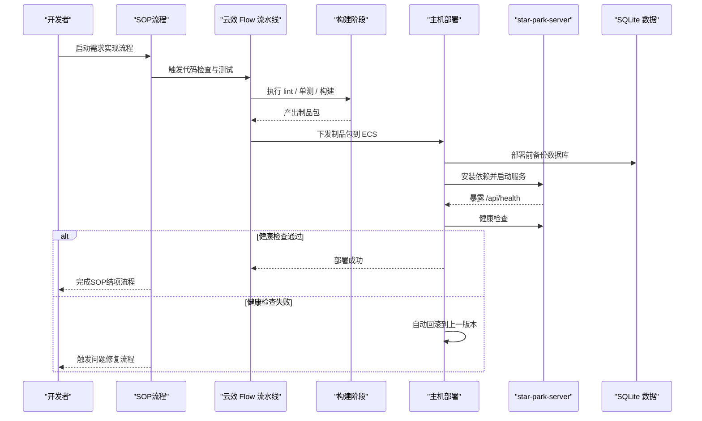
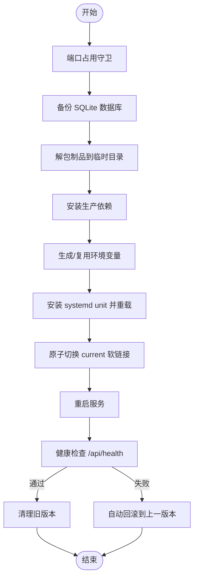

# CI/CD 与自动化部署

<cite>
**本文引用的文件**
- [.flow/star-park-nodejs-cicd.yml](file://.flow/star-park-nodejs-cicd.yml)
- [deploy/deploy.sh](file://deploy/deploy.sh)
- [deploy/health-check.sh](file://deploy/health-check.sh)
- [deploy/rollback.sh](file://deploy/rollback.sh)
- [deploy/star-park-server.service](file://deploy/star-park-server.service)
- [Makefile](file://Makefile)
- [scripts/lint-deps.py](file://scripts/lint-deps.py)
- [scripts/lint-quality.py](file://scripts/lint-quality.py)
- [harness/config/environment.json](file://harness/config/environment.json)
- [docs/CICD-PLAYBOOK.md](file://docs/CICD-PLAYBOOK.md)
- [.qoderwake/cidRR7nMraPhZpgXUOuhARMxQ%3D%3D/目标管理需求实现SOP.md](file://.qoderwake/cidRR7nMraPhZpgXUOuhARMxQ%3D%3D/目标管理需求实现SOP.md)
- [.qoderwake/cidRR7nMraPhZpgXUOuhARMxQ%3D%3D/ponr-4-sop-prompt.md](file://.qoderwake/cidRR7nMraPhZpgXUOuhARMxQ%3D%3D/ponr-4-sop-prompt.md)
- [docs/exec-specs/completed/goals-todos-db-persistence/acceptance.md](file://docs/exec-specs/completed/goals-todos-db-persistence/acceptance.md)
- [docs/exec-specs/completed/reward-management/acceptance.md](file://docs/exec-specs/completed/reward-management/acceptance.md)
</cite>

## 更新摘要
**所做更改**
- 新增SOP文档集成章节，详细说明标准操作流程的整合
- 增强工作流程标准化部分，包含端到端需求实现流程
- 更新流水线配置以支持SOP驱动的开发模式
- 添加执行规格验证机制，确保质量门禁的严格执行
- 完善回滚策略和故障恢复流程

## 产品概述
本章节聚焦"星星乐园"项目的持续集成与持续交付（CI/CD）及自动化部署能力。该体系以云效 Flow 流水线为核心，将代码检查、单元测试、构建打包、主机部署与健康检查串联为可追溯的发布流程；通过版本目录 + 原子软链切换实现零停机回滚，配合 SQLite 数据库备份与端口守卫，保障生产环境稳定上线。**最新更新**：现已集成完整的标准操作流程（SOP）系统，提供从需求确认到结项的全流程标准化指导，确保团队开发的一致性和可追溯性。面向产品经理与运营角色，本文强调发布节奏、质量门禁与回滚策略，避免深入技术细节。

## 核心业务流程
- **触发与拉取**：推送或合并到 main 分支后，云效 Flow 从 Codeup 仓库拉取代码并执行流水线。
- **SOP驱动开发**：基于标准操作流程进行需求实现，包含需求确认、方案评估、代码修改、本地验证等9个标准化阶段。
- **质量门禁**：执行分层依赖检查与代码质量检查，确保架构约束与编码规范。
- **执行规格验证**：通过预定义的验收标准自动验证功能完整性，确保交付质量。
- **单元测试**：运行后端单测与覆盖率报告，阻断不达标变更。
- **构建打包**：构建前端静态资源，组装服务端源码与部署脚本为制品包。
- **主机部署**：在目标 ECS 上解包、安装依赖、写入 systemd unit、原子切换 current、重启服务并健康检查。
- **自动回滚**：健康检查失败时自动回滚至上一版本，必要时人工介入。
- **访问打通**：安全组与主机防火墙双层放通，限定来源白名单。
- **数据同步**：部署前备份 SQLite，支持后续数据导入与一致性校验。

**图表来源**
- [.flow/star-park-nodejs-cicd.yml:20-153](file://.flow/star-park-nodejs-cicd.yml#L20-L153)
- [deploy/deploy.sh:67-172](file://deploy/deploy.sh#L67-L172)
- [deploy/health-check.sh:1-26](file://deploy/health-check.sh#L1-L26)
- [.qoderwake/cidRR7nMraPhZpgXUOuhARMxQ%3D%3D/目标管理需求实现SOP.md:10-23](file://.qoderwake/cidRR7nMraPhZpgXUOuhARMxQ%3D%3D/目标管理需求实现SOP.md#L10-L23)

**章节来源**
- [.flow/star-park-nodejs-cicd.yml:20-153](file://.flow/star-park-nodejs-cicd.yml#L20-L153)
- [deploy/deploy.sh:67-172](file://deploy/deploy.sh#L67-L172)
- [deploy/health-check.sh:1-26](file://deploy/health-check.sh#L1-L26)
- [docs/CICD-PLAYBOOK.md:11-24](file://docs/CICD-PLAYBOOK.md#L11-L24)
- [.qoderwake/cidRR7nMraPhZpgXUOuhARMxQ%3D%3D/目标管理需求实现SOP.md:10-23](file://.qoderwake/cidRR7nMraPhZpgXUOuhARMxQ%3D%3D/目标管理需求实现SOP.md#L10-L23)

## 功能模块清单
- **流水线定义**（.flow/star-park-nodejs-cicd.yml）
  - 职责：编排代码检查、单元测试、构建打包、主机部署四阶段；注入 Node 版本、制品上传与 VMDeploy 主机部署参数。
  - 用户价值：一键发布、可追溯、可回滚。
  - 验收要点：lint 通过、单测覆盖、制品包含 server 与 pc-admin、VMDeploy 成功调用 deploy.sh。
- **SOP流程集成**（.qoderwake/cidRR7nMraPhZpgXUOuhARMxQ%3D%3D/）
  - 职责：提供标准化的需求实现流程，包含9个阶段的完整操作指南。
  - 用户价值：统一开发流程，确保交付质量和可追溯性。
  - 验收要点：SOP文档完整、流程步骤清晰、模板可用。
- **执行规格验证**（docs/exec-specs/completed/）
  - 职责：定义每个需求的详细验收标准和自动化验证命令。
  - 用户价值：确保功能完整性，减少回归风险。
  - 验收要点：验收命令可执行、覆盖率达标、边界情况处理。
- **代码质量门禁**（scripts/lint-deps.py、scripts/lint-quality.py）
  - 职责：强制分层依赖规则、禁止跨层直导、限制 console.log 等质量模式。
  - 用户价值：降低架构腐化风险，提升可维护性。
  - 验收要点：lint 全绿，无违规告警。
- **构建与制品**（Makefile、.yml build_stage）
  - 职责：构建前端静态资源，组装服务端源码与部署脚本为制品包。
  - 用户价值：统一产物形态，便于分发与回滚。
  - 验收要点：dist-package 包含 server/src、pc-admin/dist、deploy 脚本与 service unit。
- **主机部署**（deploy/deploy.sh）
  - 职责：端口守卫、数据库备份、解包、依赖安装、环境变量生成、systemd 安装、current 原子切换、重启与健康检查、旧版本清理。
  - 用户价值：零停机切换、失败自动回滚、数据不丢失。
  - 验收要点：current 指向新版本、/api/health 返回 ok、日志正常、保留最近 N 个版本。
- **健康检查**（deploy/health-check.sh）
  - 职责：轮询 /api/health 直到返回 status=ok 或超时。
  - 用户价值：快速发现异常，支撑自动回滚。
  - 验收要点：指定端口可达且响应正确。
- **手动回滚**（deploy/rollback.sh）
  - 职责：切换到上一个或指定版本，重启并健康检查。
  - 用户价值：快速恢复线上业务。
  - 验收要点：current 指向目标版本，服务可用。
- **服务管理**（deploy/star-park-server.service）
  - 职责：定义工作目录、启动命令、环境变量文件、日志输出、重启策略与安全加固。
  - 用户价值：标准化进程生命周期管理。
  - 验收要点：systemctl 状态 active，日志写入 /var/log/star-park。
- **本地与测试环境**（harness/config/environment.json、Makefile）
  - 职责：描述运行时、数据库、服务端口、功能场景与脚本入口。
  - 用户价值：统一开发体验与验证路径。
  - 验收要点：本地可启动服务，健康端点可用。

**章节来源**
- [.flow/star-park-nodejs-cicd.yml:20-153](file://.flow/star-park-nodejs-cicd.yml#L20-L153)
- [.qoderwake/cidRR7nMraPhZpgXUOuhARMxQ%3D%3D/目标管理需求实现SOP.md:10-23](file://.qoderwake/cidRR7nMraPhZpgXUOuhARMxQ%3D%3D/目标管理需求实现SOP.md#L10-L23)
- [docs/exec-specs/completed/goals-todos-db-persistence/acceptance.md:1-351](file://docs/exec-specs/completed/goals-todos-db-persistence/acceptance.md#L1-L351)
- [scripts/lint-deps.py:16-98](file://scripts/lint-deps.py#L16-L98)
- [scripts/lint-quality.py:17-48](file://scripts/lint-quality.py#L17-L48)
- [Makefile:3-69](file://Makefile#L3-L69)
- [deploy/deploy.sh:67-172](file://deploy/deploy.sh#L67-L172)
- [deploy/health-check.sh:1-26](file://deploy/health-check.sh#L1-L26)
- [deploy/rollback.sh:1-45](file://deploy/rollback.sh#L1-L45)
- [deploy/star-park-server.service:1-27](file://deploy/star-park-server.service#L1-L27)
- [harness/config/environment.json:1-65](file://harness/config/environment.json#L1-L65)

## 数据与状态
- **版本目录与当前版本**
  - releases/<BUILD_NUMBER>：每个发布独立目录，保留最近若干版本。
  - current：指向当前活跃版本的软链接，切换即上线/回滚。
- **共享数据与备份**
  - shared/data：持久化 SQLite 数据目录，跨版本保留。
  - backups：每次部署前对数据库进行备份，保留最近若干份。
- **环境变量**
  - shared/star-park.env：首次生成 NODE_ENV、PORT、STATIC_DIR，后续复用并允许人工调整。
- **服务进程**
  - systemd unit 管理 star-park-server，工作目录为 current/server，日志输出到 /var/log/star-park。
- **健康状态**
  - /api/health 返回 {status:"ok"} 表示服务就绪，用于部署后验证。
- **SOP执行记录**
  - .qoderwake/：存储SOP流程执行记录和模板。
  - docs/exec-specs/completed/：保存已完成需求的执行规格和验收结果。

**图表来源**
- [deploy/deploy.sh:54-172](file://deploy/deploy.sh#L54-L172)
- [deploy/health-check.sh:1-26](file://deploy/health-check.sh#L1-L26)

**章节来源**
- [deploy/deploy.sh:67-172](file://deploy/deploy.sh#L67-L172)
- [deploy/star-park-server.service:7-23](file://deploy/star-park-server.service#L7-L23)
- [deploy/health-check.sh:1-26](file://deploy/health-check.sh#L1-L26)

## 关键约束与边界
- **构建镜像与环境**
  - 公共构建镜像为 Ubuntu 16.04，仅 Python 3.5，无 docker，pypi 不可达；Node 版本需通过 nvm 显式安装并断言 >= 18。
  - 原生模块 better-sqlite3 无法源码编译，采用跳过安装脚本并从 npmmirror 获取预编译产物的方案。
- **端口与网络**
  - 生产端口固定为 3002（3001 被无关应用占用），部署前进行端口占用守卫。
  - 外网访问需同时放行 ECS 安全组与主机 firewalld，来源限定白名单。
- **数据安全**
  - 部署前必须备份 SQLite，使用 .backup 或拷贝方式生成一致快照；导入时仅迁移数据，保留线上 schema。
- **回滚策略**
  - 健康检查失败自动回滚到上一版本；首次部署无历史版本则停止服务避免半上线状态。
- **质量门禁**
  - 分层依赖检查禁止前端直接导入后端代码；质量检查限制 console.log 与文件大小。
- **SOP执行约束**
  - 所有需求实现必须遵循标准操作流程，包含需求确认、方案评估、代码修改、本地验证、远端同步、流水线触发、分支合并、验收、结项9个阶段。
  - 每个阶段都有明确的验收标准和检查点，确保流程的可执行性和可追溯性。
- **运维建议**
  - 首次部署前后拍快照；记录残留风险（如 HTTPS、鉴权网关、SSH 开放范围）。

**章节来源**
- [docs/CICD-PLAYBOOK.md:134-193](file://docs/CICD-PLAYBOOK.md#L134-L193)
- [docs/CICD-PLAYBOOK.md:220-257](file://docs/CICD-PLAYBOOK.md#L220-L257)
- [docs/CICD-PLAYBOOK.md:260-277](file://docs/CICD-PLAYBOOK.md#L260-L277)
- [.flow/star-park-nodejs-cicd.yml:20-153](file://.flow/star-park-nodejs-cicd.yml#L20-L153)
- [deploy/deploy.sh:54-172](file://deploy/deploy.sh#L54-L172)
- [scripts/lint-deps.py:16-98](file://scripts/lint-deps.py#L16-L98)
- [scripts/lint-quality.py:17-48](file://scripts/lint-quality.py#L17-L48)
- [.qoderwake/cidRR7nMraPhZpgXUOuhARMxQ%3D%3D/目标管理需求实现SOP.md:10-23](file://.qoderwake/cidRR7nMraPhZpgXUOuhARMxQ%3D%3D/目标管理需求实现SOP.md#L10-L23)

## 新增：SOP文档集成与工作流标准化

### SOP流程架构
项目现已集成完整的标准操作流程（SOP）系统，为需求实现提供标准化的端到端指导：

- **需求确认阶段**：明确需求背景、验收标准、影响范围，从 Projex 提取需求 ID
- **方案确认阶段**：确定改动点、分支策略、回滚方案，形成决策记录
- **代码修改阶段**：按分层架构与项目规范修改代码，遵循最小改动原则
- **本地验证阶段**：构建、测试、lint、页面验证，确保功能完整性
- **远端同步阶段**：提交并推送至 Codeup 目标分支，保持代码同步
- **流水线触发阶段**：触发云效 Flow 流水线执行并验证，确保质量门禁
- **分支合并阶段**：部署验证通过后，将特性分支合并至 main
- **验收阶段**：按验收标准逐项确认，形成验收结论
- **结项阶段**：更新 Projex 需求状态、更新文档、关闭任务、记录经验

### 执行规格验证机制
通过 `docs/exec-specs/completed/` 目录中的验收标准文件，实现了自动化的质量验证：

- **Task级验收**：每个功能拆分为多个 Task，每个 Task 有独立的验收命令
- **SHALL约束**：使用强制性约束语言定义必须满足的条件
- **幂等性验证**：确保重复执行不会产生副作用
- **边界Case处理**：覆盖异常情况和不常见场景

### 工具链集成
SOP系统与现有工具链深度集成：

- **a1 CLI集成**：通过 `a1 project workitem get` 获取需求详情
- **Git工作流**：规范的 commit message 格式，包含 ReqId 关联
- **Makefile命令**：统一的构建、测试、验证入口
- **云效Flow**：自动触发流水线，支持代码源触发

**章节来源**
- [.qoderwake/cidRR7nMraPhZpgXUOuhARMxQ%3D%3D/目标管理需求实现SOP.md:10-23](file://.qoderwake/cidRR7nMraPhZpgXUOuhARMxQ%3D%3D/目标管理需求实现SOP.md#L10-L23)
- [docs/exec-specs/completed/goals-todos-db-persistence/acceptance.md:1-351](file://docs/exec-specs/completed/goals-todos-db-persistence/acceptance.md#L1-L351)
- [docs/exec-specs/completed/reward-management/acceptance.md:1-109](file://docs/exec-specs/completed/reward-management/acceptance.md#L1-L109)
- [.qoderwake/cidRR7nMraPhZpgXUOuhARMxQ%3D%3D/ponr-4-sop-prompt.md:1-117](file://.qoderwake/cidRR7nMraPhZpgXUOuhARMxQ%3D%3D/ponr-4-sop-prompt.md#L1-L117)