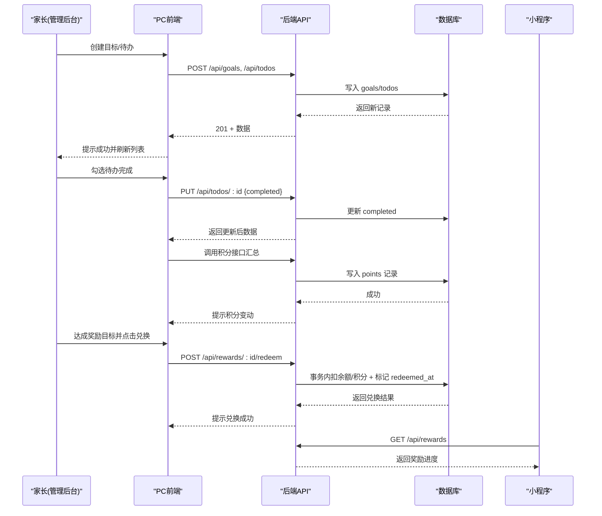
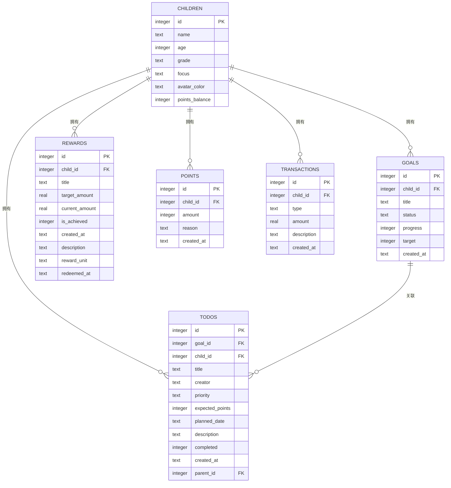
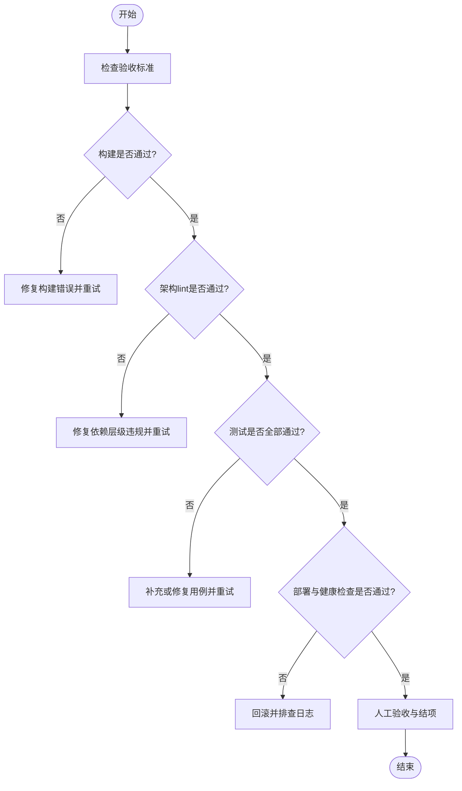

# PONR-4 需求实现 SOP

<cite>
**本文引用的文件**   
- [ponr-4-sop-prompt.md](file://.qoderwake/cidRR7nMraPhZpgXUOuhARMxQ%3D%3D/ponr-4-sop-prompt.md)
- [目标管理需求实现SOP.md](file://.qoderwake/cidRR7nMraPhZpgXUOuhARMxQ%3D%3D/目标管理需求实现SOP.md)
- [goals-todos-db-persistence/tasks.md](file://docs/exec-specs/completed/goals-todos-db-persistence/tasks.md)
- [goals-todos-db-persistence/acceptance.md](file://docs/exec-specs/completed/goals-todos-db-persistence/acceptance.md)
- [reward-management/tasks.md](file://docs/exec-specs/completed/reward-management/tasks.md)
- [reward-management/acceptance.md](file://docs/exec-specs/completed/reward-management/acceptance.md)
- [database.js](file://star-park/server/src/database.js)
- [Goals.vue](file://star-park/pc-admin/src/views/Goals.vue)
- [Rewards.vue](file://star-park/pc-admin/src/views/Rewards.vue)
- [api.md](file://docs/api.md)
</cite>

## 产品概述
星星乐园是面向多孩家庭的激励管理系统，核心机制为“任务打卡 + 双货币激励（金钱+积分）”，所有功能围绕孩子维度独立管理。PONR-4 聚焦于目标与待办任务的数据库持久化、奖励目标的完善与兑换能力，以及前后端联动的可验收交付流程。该 SOP 将需求拆解为端到端步骤，覆盖从需求确认、代码定位、修改验证到流水线发布与验收结项的全链路，确保产品经理、运营与家长等角色都能理解业务价值与验收要点。

## 核心业务流程
- 目标与待办生命周期：家长在管理后台创建年度目标，并为目标或全局创建待办；待办完成时按预期积分自动汇总至对应孩子的积分余额；删除目标时通过事务解除与待办的关联，保证数据一致性。
- 奖励目标与兑换：家长可为孩子设置奖励目标（支持元或星星两种单位），达成后可由家长在管理后台执行兑换；后端在事务中扣减相应余额并记录兑换时间，避免重复兑换与余额不足问题。
- 小程序侧查看：小程序提供奖励查看页面，展示进度、达成与已兑换状态，帮助孩子在移动端感知目标进展。

**章节来源**
- [goals-todos-db-persistence/tasks.md:69-171](file://docs/exec-specs/completed/goals-todos-db-persistence/tasks.md#L69-L171)
- [goals-todos-db-persistence/tasks.md:173-295](file://docs/exec-specs/completed/goals-todos-db-persistence/tasks.md#L173-L295)
- [reward-management/tasks.md:31-181](file://docs/exec-specs/completed/reward-management/tasks.md#L31-L181)
- [database.js:90-115](file://star-park/server/src/database.js#L90-L115)

## 功能模块清单
- 目标与待办持久化
  - 职责：新增 goals/todos 表、CRUD 路由、前端 API 封装、Goals.vue 改造为 API 读写、一次性迁移本地遗留数据。
  - 用户价值：目标与待办跨设备、跨浏览器持久化，支持父子任务、计划日期、预期积分、优先级等字段，提升目标管理能力。
  - 验收要点：构建通过、模板未改动、无业务数据写入 localStorage、删除目标级联解除关联、筛选与默认值行为正确。
- 奖励管理与兑换
  - 职责：rewards 表 schema 迁移（description、reward_unit、redeemed_at）、后端 rewards API 完善（含兑换端点）、管理后台 Rewards.vue 重写、小程序奖励查看页。
  - 用户价值：家长可设定奖励目标与单位，达成后一键兑换，自动扣减余额并记录兑换时间；小程序端可视化进度。
  - 验收要点：POST/PUT 支持新字段、兑换事务正确、重复兑换与余额不足错误码、页面渲染与筛选正常。
- 文档与架构合规
  - 职责：更新 docs/api.md 新增端点说明；保持分层架构与依赖检查通过。
  - 用户价值：接口文档与架构规则一致，便于后续迭代与维护。
  - 验收要点：make lint-arch 通过、api.md 包含新端点、测试覆盖率达标。

**章节来源**
- [goals-todos-db-persistence/tasks.md:18-171](file://docs/exec-specs/completed/goals-todos-db-persistence/tasks.md#L18-L171)
- [goals-todos-db-persistence/tasks.md:173-387](file://docs/exec-specs/completed/goals-todos-db-persistence/tasks.md#L173-L387)
- [reward-management/tasks.md:3-181](file://docs/exec-specs/completed/reward-management/tasks.md#L3-L181)
- [api.md:127-200](file://docs/api.md#L127-L200)

## 数据与状态
- 核心数据模型
  - goals：id、child_id、title、status、progress、target、created_at；用于年度目标分类与进度跟踪。
  - todos：id、goal_id、child_id、title、creator、priority、expected_points、planned_date、description、completed、created_at、parent_id；用于任务分解与执行。
  - rewards：id、child_id、title、target_amount、current_amount、is_achieved、created_at、description、reward_unit、redeemed_at；用于奖励目标与兑换记录。
  - points：id、child_id、amount、reason、created_at；用于积分流水。
  - transactions：id、child_id、type、amount、description、created_at；用于金钱交易流水。
- 关键状态流转
  - 目标状态：todo/rest/health/happy/study；待办状态：completed 0/1；奖励状态：is_achieved 0/1、redeemed_at 空/有值。
  - 删除目标：事务内先 UPDATE todos SET goal_id = NULL，再 DELETE goals，保证关联待办仍存在且 goal_id 置空。
  - 兑换奖励：根据 reward_unit 选择扣减金钱余额（transactions type=redeem）或积分余额（children.points_balance 扣减 + points 负数记录），同时标记 redeemed_at。
- 数据所有权边界
  - child_id 作为归属维度，全局数据（child_id 为 null）不参与积分汇总；父子任务通过 parent_id 组织。
  - 前端仅做展示层变更（如移除创建人列）时不污染数据层；数据迁移仅在首次进入页面触发一次。

**章节来源**
- [database.js:27-128](file://star-park/server/src/database.js#L27-L128)
- [database.js:130-197](file://star-park/server/src/database.js#L130-L197)
- [goals-todos-db-persistence/acceptance.md:25-62](file://docs/exec-specs/completed/goals-todos-db-persistence/acceptance.md#L25-L62)
- [reward-management/acceptance.md:17-38](file://docs/exec-specs/completed/reward-management/acceptance.md#L17-L38)

## 关键约束与边界
- 非功能性需求
  - 单文件不超过 500 行；禁止引入 console.log 调试语句；遵循分层架构（L0-L5）与依赖检查。
  - 构建必须通过；测试覆盖率需达到阈值；架构 lint 必须通过。
- 依赖与集成边界
  - 后端使用 SQLite（WAL 模式、外键开启），测试环境内存库；前端基于 Vue 3 + Element Plus；小程序 uni-app。
  - 云效 Flow CI/CD 负责代码检查、单元测试、构建与部署；健康检查接口用于服务可用性验证。
- 业务约束
  - 删除目标时必须通过事务解除与待办的关联；奖励兑换不可重复、余额不足需明确错误提示；全局待办不参与积分汇总。
  - 展示层变更（如移除创建人列）不得影响数据层字段与表单/详情页；一次性迁移保留原 localStorage 数据作为备份。

**章节来源**
- [目标管理需求实现SOP.md:18-23](file://.qoderwake/cidRR7nMraPhZpgXUOuhARMxQ%3D%3D/目标管理需求实现SOP.md#L18-L23)
- [目标管理需求实现SOP.md:181-233](file://.qoderwake/cidRR7nMraPhZpgXUOuhARMxQ%3D%3D/目标管理需求实现SOP.md#L181-L233)
- [goals-todos-db-persistence/acceptance.md:245-340](file://docs/exec-specs/completed/goals-todos-db-persistence/acceptance.md#L245-L340)
- [reward-management/acceptance.md:92-109](file://docs/exec-specs/completed/reward-management/acceptance.md#L92-L109)