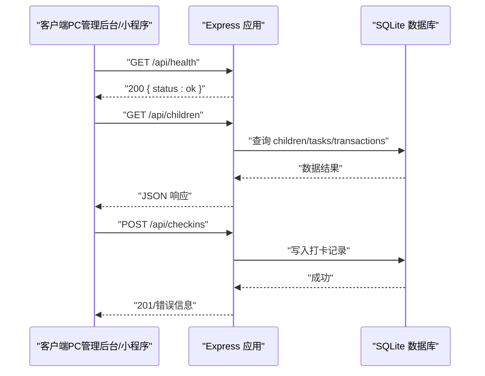
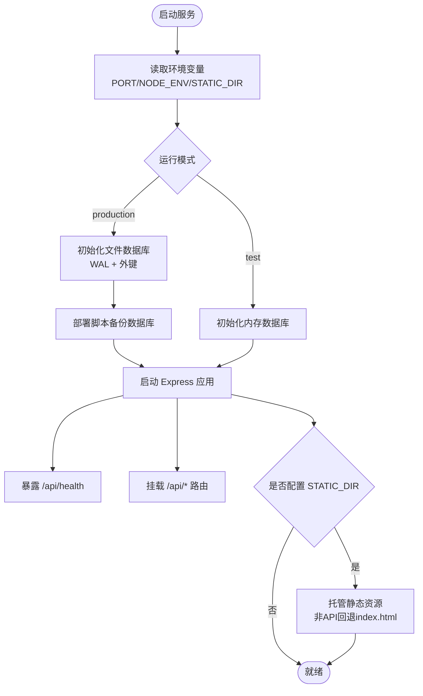

# 安全配置与网络策略

<cite>
**本文引用的文件**
- [star-park/server/src/app.js](file://star-park/server/src/app.js)
- [star-park/server/src/index.js](file://star-park/server/src/index.js)
- [star-park/server/package.json](file://star-park/server/package.json)
- [star-park/server/src/database.js](file://star-park/server/src/database.js)
- [deploy/star-park-server.service](file://deploy/star-park-server.service)
- [deploy/deploy.sh](file://deploy/deploy.sh)
- [harness/config/environment.json](file://harness/config/environment.json)
- [star-park/miniprogram/src/api/index.js](file://star-park/miniprogram/src/api/index.js)
- [star-park/pc-admin/src/api/index.js](file://star-park/pc-admin/src/api/index.js)
</cite>

## 产品概述
本章节聚焦“星星乐园”在运行时的安全配置与网络策略，面向产品经理、运营与家长等角色，说明后端服务如何暴露接口、如何允许跨域访问、如何托管前端静态资源、如何在生产环境以最小权限运行，以及前后端如何通过统一 API 边界进行通信。文档避免深入代码细节，重点呈现可操作的部署与安全要点。

## 核心业务流程
- 浏览器或小程序发起请求到后端 /api 前缀的接口；后端通过统一的中间件处理请求并路由到具体业务模块。
- 健康检查接口用于部署后的可用性验证。
- 生产环境下，后端可选地直接托管构建好的前端静态资源，非 /api 路径回退到 index.html，实现单页应用的路由兼容。

图表来源
- [star-park/server/src/app.js:17-35](file://star-park/server/src/app.js#L17-L35)
- [star-park/server/src/database.js:27-116](file://star-park/server/src/database.js#L27-L116)

章节来源
- [star-park/server/src/app.js:17-47](file://star-park/server/src/app.js#L17-L47)
- [star-park/server/src/index.js:4-13](file://star-park/server/src/index.js#L4-L13)

## 功能模块清单
- 跨域访问控制（CORS）
  - 职责：允许前端在不同域名或端口下访问后端 API。
  - 验收要点：开发时 PC 管理后台与后端不同端口可正常调用；生产环境按实际域名限制来源。
- 请求体解析
  - 职责：将 JSON 请求体解析为对象供路由使用。
  - 验收要点：所有 POST/PUT 请求携带 application/json 时可被正确解析。
- 路由与 API 边界
  - 职责：集中注册 /api/* 路由与健康检查。
  - 验收要点：仅 /api 开头的路径进入业务逻辑；健康检查返回稳定结构。
- 静态资源托管（可选）
  - 职责：在生产环境托管构建产物，并将非 API 请求回退到 index.html。
  - 验收要点：设置 STATIC_DIR 后，访问根路径能加载管理后台页面。
- 进程与服务隔离
  - 职责：以 systemd 单元运行，启用最小权限与只读系统目录保护。
  - 验收要点：服务不可写系统目录，仅允许读写指定路径；日志输出到独立文件。
- 环境变量与端口
  - 职责：通过环境变量控制监听端口、运行模式与静态目录。
  - 验收要点：PORT 生效；NODE_ENV=test 时使用内存数据库；STATIC_DIR 指向构建产物。
- 前端 API 基地址
  - 职责：PC 管理后台与小程序分别配置 /api 基地址，确保与后端一致。
  - 验收要点：开发时可通过代理转发到后端；生产时走同一域名下的 /api。

章节来源
- [star-park/server/src/app.js:17-47](file://star-park/server/src/app.js#L17-L47)
- [star-park/server/src/index.js:4-13](file://star-park/server/src/index.js#L4-L13)
- [deploy/star-park-server.service:7-23](file://deploy/star-park-server.service#L7-L23)
- [deploy/deploy.sh:140-151](file://deploy/deploy.sh#L140-L151)
- [harness/config/environment.json:28-32](file://harness/config/environment.json#L28-L32)
- [star-park/pc-admin/src/api/index.js:4-9](file://star-park/pc-admin/src/api/index.js#L4-L9)
- [star-park/miniprogram/src/api/index.js:1-3](file://star-park/miniprogram/src/api/index.js#L1-L3)

## 数据与状态
- 数据库模式与环境
  - 测试环境：使用内存数据库，保证用例隔离与快速执行。
  - 生产环境：使用文件型 SQLite，开启 WAL 模式以提升并发性能，并启用外键约束。
- 数据持久化与备份
  - 部署脚本在发布前对 SQLite 文件进行备份，失败时自动回滚到上一版本。
  - 数据目录通过软链接共享，版本切换不丢失数据。
- 权限与文件系统
  - systemd 单元启用 NoNewPrivileges、PrivateTmp、ProtectSystem=full，仅允许读写项目目录与日志目录。
- 环境变量与密钥
  - 端口、运行模式、静态目录通过环境变量注入；敏感信息应通过外部密钥管理（当前未内置）。

图表来源
- [star-park/server/src/database.js:5-24](file://star-park/server/src/database.js#L5-L24)
- [deploy/deploy.sh:73-86](file://deploy/deploy.sh#L73-L86)
- [deploy/star-park-server.service:20-23](file://deploy/star-park-server.service#L20-L23)
- [star-park/server/src/app.js:37-47](file://star-park/server/src/app.js#L37-L47)

章节来源
- [star-park/server/src/database.js:5-24](file://star-park/server/src/database.js#L5-L24)
- [deploy/deploy.sh:73-86](file://deploy/deploy.sh#L73-L86)
- [deploy/star-park-server.service:20-23](file://deploy/star-park-server.service#L20-L23)
- [star-park/server/src/app.js:37-47](file://star-park/server/src/app.js#L37-L47)

## 关键约束与边界
- 网络与跨域
  - 当前启用全局 CORS，便于开发与多端接入；生产建议根据域名白名单收紧来源，避免任意站点调用。
  - 所有业务接口统一以 /api 前缀暴露，便于网关或反向代理做鉴权与限流。
- 端口与进程
  - 默认端口可通过环境变量覆盖；部署脚本包含端口占用守卫，防止误占其他线上服务端口。
  - 服务以 systemd 管理，具备重启保护与日志输出。
- 静态资源与路由冲突
  - 仅在配置 STATIC_DIR 且目录存在时启用静态托管；非 /api 路径回退到 index.html，需确保路由不与业务 API 冲突。
- 数据完整性
  - 启用外键约束与 WAL 模式，提升一致性与并发能力；部署前自动备份，失败回滚保障数据安全。
- 依赖与构建
  - 生产安装依赖时优先使用预编译原生模块，避免目标机缺少编译工具链导致失败。
- 前端调用边界
  - PC 管理后台与小程序均通过 /api 访问后端；开发阶段可使用代理转发，生产阶段应统一域名与 HTTPS。

章节来源
- [star-park/server/src/app.js:17-47](file://star-park/server/src/app.js#L17-L47)
- [star-park/server/src/index.js:4-13](file://star-park/server/src/index.js#L4-L13)
- [deploy/deploy.sh:54-65](file://deploy/deploy.sh#L54-L65)
- [deploy/deploy.sh:112-138](file://deploy/deploy.sh#L112-L138)
- [star-park/pc-admin/src/api/index.js:4-9](file://star-park/pc-admin/src/api/index.js#L4-L9)
- [star-park/miniprogram/src/api/index.js:1-3](file://star-park/miniprogram/src/api/index.js#L1-L3)