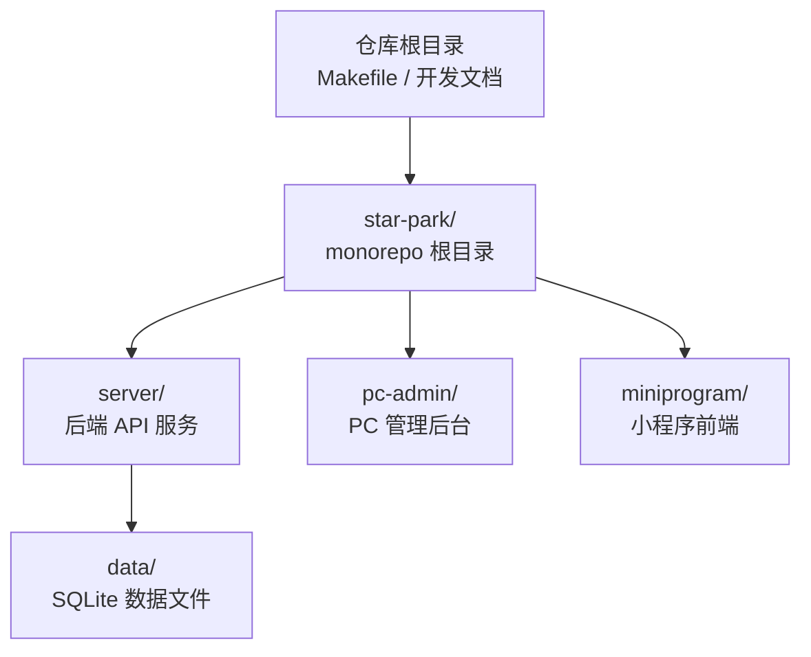
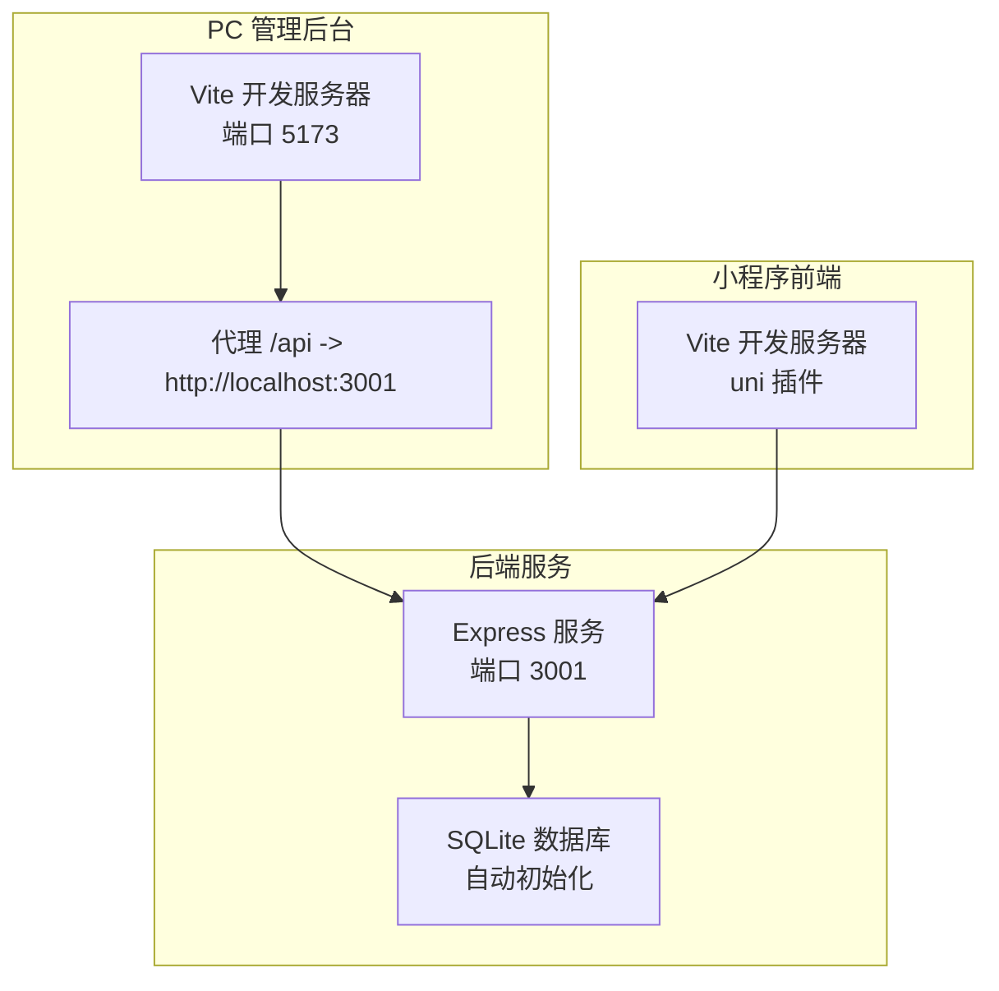
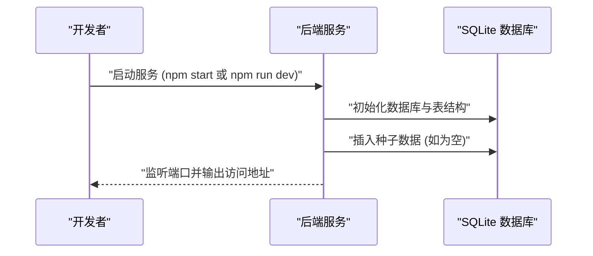
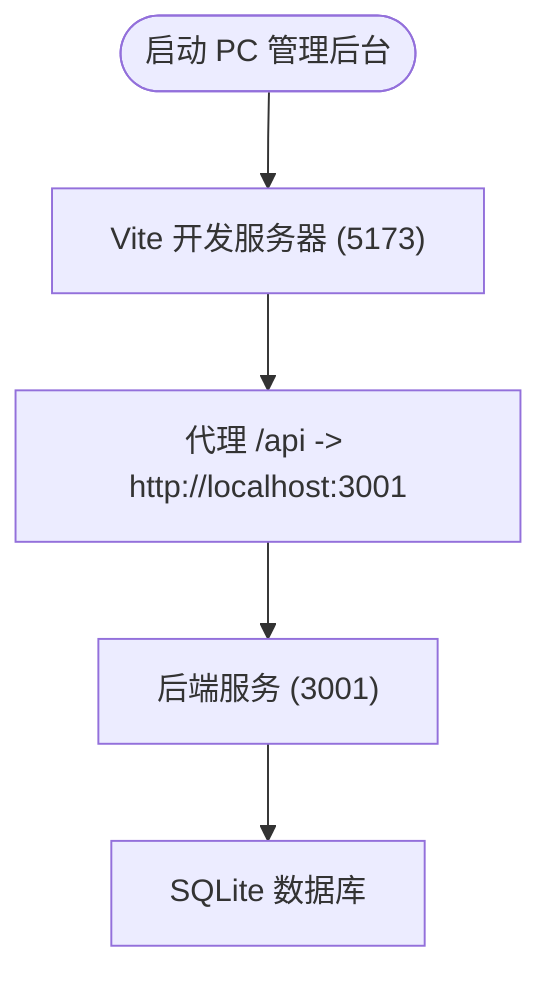
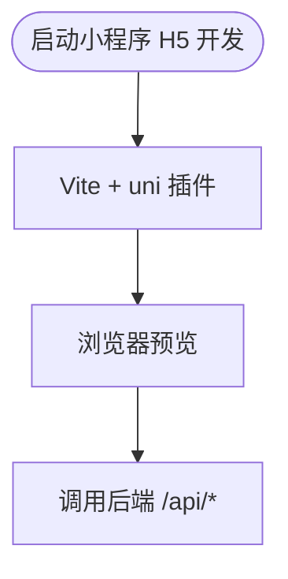
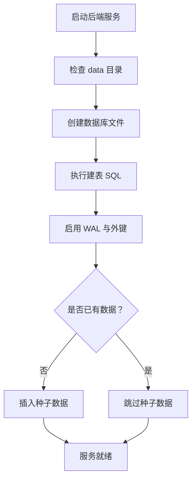
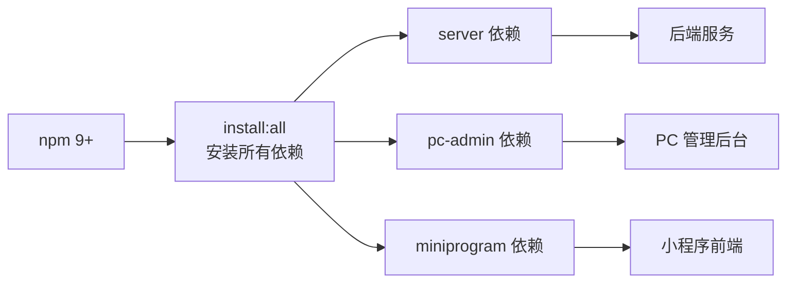

# 快速开始

<cite>
**本文引用的文件**
- [star-park/package.json](file://star-park/package.json)
- [star-park/server/package.json](file://star-park/server/package.json)
- [star-park/pc-admin/package.json](file://star-park/pc-admin/package.json)
- [star-park/miniprogram/package.json](file://star-park/miniprogram/package.json)
- [docs/DEVELOPMENT.md](file://docs/DEVELOPMENT.md)
- [Makefile](file://Makefile)
- [harness/scripts/setup-env.sh](file://harness/scripts/setup-env.sh)
- [harness/scripts/start-server.sh](file://harness/scripts/start-server.sh)
- [harness/config/environment.json](file://harness/config/environment.json)
- [star-park/server/src/index.js](file://star-park/server/src/index.js)
- [star-park/server/src/database.js](file://star-park/server/src/database.js)
- [star-park/server/src/seed.js](file://star-park/server/src/seed.js)
- [star-park/server/src/routes/children.js](file://star-park/server/src/routes/children.js)
- [star-park/server/src/routes/tasks.js](file://star-park/server/src/routes/tasks.js)
- [star-park/server/src/routes/checkins.js](file://star-park/server/src/routes/checkins.js)
- [star-park/server/src/routes/rewards.js](file://star-park/server/src/routes/rewards.js)
- [star-park/server/src/routes/stats.js](file://star-park/server/src/routes/stats.js)
- [star-park/pc-admin/vite.config.js](file://star-park/pc-admin/vite.config.js)
- [star-park/miniprogram/vite.config.js](file://star-park/miniprogram/vite.config.js)
</cite>

## 目录
1. [简介](#简介)
2. [项目结构](#项目结构)
3. [核心组件](#核心组件)
4. [架构总览](#架构总览)
5. [详细组件分析](#详细组件分析)
6. [依赖分析](#依赖分析)
7. [性能考虑](#性能考虑)
8. [故障排查指南](#故障排查指南)
9. [结论](#结论)
10. [附录](#附录)

## 简介
本指南面向新手开发者，帮助你在约30分钟内完成 StarParadise 的本地开发环境搭建与系统运行。内容涵盖环境要求、依赖安装、后端服务启动、PC 管理后台与小程序开发服务器启动、数据库初始化、环境变量配置以及常见问题排查。

## 项目结构
项目采用 monorepo 多项目管理模式，根目录提供统一的安装与启动脚本，子目录分别承载后端服务、PC 管理后台与小程序前端。

图表来源
- [Makefile:1-70](file://Makefile#L1-L70)
- [star-park/package.json:1-13](file://star-park/package.json#L1-L13)

章节来源
- [Makefile:1-70](file://Makefile#L1-L70)
- [docs/DEVELOPMENT.md:65-92](file://docs/DEVELOPMENT.md#L65-L92)

## 核心组件
- 后端服务（server）：基于 Express 的 REST API，内置 SQLite 数据库初始化与种子数据填充，提供健康检查端点。
- PC 管理后台（pc-admin）：Vue 3 + Vite 开发的管理界面，开发服务器默认端口 5173，并配置了对后端 API 的代理转发。
- 小程序前端（miniprogram）：基于 uni-app 的跨平台前端，支持 H5 与微信小程序两种开发模式。
- 一键安装与启动：根目录提供统一脚本与 Makefile 目标，简化多项目依赖安装与服务启动。

章节来源
- [star-park/server/src/index.js:1-42](file://star-park/server/src/index.js#L1-L42)
- [star-park/pc-admin/vite.config.js:1-19](file://star-park/pc-admin/vite.config.js#L1-L19)
- [star-park/miniprogram/vite.config.js:1-7](file://star-park/miniprogram/vite.config.js#L1-L7)
- [star-park/package.json:6-11](file://star-park/package.json#L6-L11)

## 架构总览
下图展示了本地开发时的请求流：PC 管理后台与小程序前端均通过 Vite 开发服务器运行，PC 端通过代理将 /api 请求转发至后端服务；小程序端在 H5 模式下直接访问后端接口。

图表来源
- [star-park/pc-admin/vite.config.js:6-14](file://star-park/pc-admin/vite.config.js#L6-L14)
- [star-park/server/src/index.js:14-41](file://star-park/server/src/index.js#L14-L41)
- [star-park/server/src/database.js:10-15](file://star-park/server/src/database.js#L10-L15)

## 详细组件分析

### 后端服务（server）
- 启动与开发模式
  - 生产启动：通过后端 package.json 的 start 脚本执行主入口。
  - 开发模式：通过 dev 脚本启用热重载。
- 健康检查
  - 提供 /api/health 健康检查端点，便于自动化等待服务就绪。
- 数据库初始化
  - 首次启动时自动创建 data 目录与数据库文件，启用 WAL 模式与外键约束。
  - 自动创建核心表：children、tasks、checkins、rewards、transactions、points。
  - 迁移：为 children 表增加 points_balance 字段。
- 种子数据
  - 若数据库为空则插入示例数据（孩子、任务、奖励目标），避免首次体验空数据。
- API 路由
  - 子模块化路由：children、tasks、checkins、rewards、stats、points，覆盖增删改查与统计分析。

图表来源
- [star-park/server/src/index.js:30-41](file://star-park/server/src/index.js#L30-L41)
- [star-park/server/src/database.js:17-80](file://star-park/server/src/database.js#L17-L80)
- [star-park/server/src/seed.js:3-42](file://star-park/server/src/seed.js#L3-L42)

章节来源
- [star-park/server/src/index.js:1-42](file://star-park/server/src/index.js#L1-L42)
- [star-park/server/src/database.js:1-90](file://star-park/server/src/database.js#L1-L90)
- [star-park/server/src/seed.js:1-45](file://star-park/server/src/seed.js#L1-L45)
- [star-park/server/package.json:4-7](file://star-park/server/package.json#L4-L7)

### PC 管理后台（pc-admin）
- 开发服务器
  - Vite 开发服务器，默认端口 5173。
  - 通过代理将 /api 请求转发到后端服务（默认 http://localhost:3001）。
- 构建与预览
  - 支持构建生产版本与本地预览。

图表来源
- [star-park/pc-admin/vite.config.js:6-14](file://star-park/pc-admin/vite.config.js#L6-L14)
- [star-park/server/src/index.js:14-41](file://star-park/server/src/index.js#L14-L41)

章节来源
- [star-park/pc-admin/vite.config.js:1-19](file://star-park/pc-admin/vite.config.js#L1-L19)
- [star-park/pc-admin/package.json:6-10](file://star-park/pc-admin/package.json#L6-L10)

### 小程序前端（miniprogram）
- 开发模式
  - H5 开发模式：通过 uni 提供的 Vite 插件启动开发服务器。
  - 微信小程序开发模式：通过 uni-cli 启动对应平台模拟器。
- 构建模式
  - 支持 H5 与微信小程序的生产构建。

图表来源
- [star-park/miniprogram/vite.config.js:1-7](file://star-park/miniprogram/vite.config.js#L1-L7)
- [star-park/miniprogram/package.json:4-9](file://star-park/miniprogram/package.json#L4-L9)

章节来源
- [star-park/miniprogram/vite.config.js:1-7](file://star-park/miniprogram/vite.config.js#L1-L7)
- [star-park/miniprogram/package.json:1-27](file://star-park/miniprogram/package.json#L1-L27)

### 数据库初始化与种子数据
- 初始化流程
  - 首次启动时自动创建 data 目录与数据库文件。
  - 执行建表语句，启用 WAL 模式与外键约束。
  - 迁移：为 children 表增加 points_balance 字段。
  - 若表中无数据，则插入示例数据（孩子、任务、奖励目标）。
- 健康检查
  - 后端提供 /api/health，便于启动脚本等待服务就绪。

图表来源
- [star-park/server/src/database.js:5-15](file://star-park/server/src/database.js#L5-L15)
- [star-park/server/src/database.js:17-80](file://star-park/server/src/database.js#L17-L80)
- [star-park/server/src/seed.js:3-42](file://star-park/server/src/seed.js#L3-L42)
- [harness/scripts/start-server.sh:18-25](file://harness/scripts/start-server.sh#L18-L25)

章节来源
- [star-park/server/src/database.js:1-90](file://star-park/server/src/database.js#L1-L90)
- [star-park/server/src/seed.js:1-45](file://star-park/server/src/seed.js#L1-L45)
- [harness/scripts/start-server.sh:1-29](file://harness/scripts/start-server.sh#L1-L29)

## 依赖分析
- 语言与工具链
  - Node.js 18+、npm 9+、Python 3.10+（用于验证脚本）。
- 依赖安装方式
  - 一键安装：在 star-park 目录执行安装脚本，自动安装 server、pc-admin、miniprogram 三处依赖。
  - 单独安装：进入各子目录执行 npm install。
- 一键启动
  - 后端：npm run start:server
  - PC 管理后台：npm run start:pc
  - 小程序 H5：npm run start:mini

图表来源
- [docs/DEVELOPMENT.md:3-8](file://docs/DEVELOPMENT.md#L3-L8)
- [star-park/package.json:7](file://star-park/package.json#L7)
- [Makefile:62-66](file://Makefile#L62-L66)

章节来源
- [docs/DEVELOPMENT.md:3-8](file://docs/DEVELOPMENT.md#L3-L8)
- [star-park/package.json:6-11](file://star-park/package.json#L6-L11)
- [Makefile:62-66](file://Makefile#L62-L66)

## 性能考虑
- SQLite WAL 模式
  - 启用 WAL 模式以提升并发读写性能，适合开发阶段的多请求场景。
- 事务与批量操作
  - 在创建打卡记录时使用事务，确保数据一致性与原子性。
- 前端代理
  - PC 管理后台通过代理减少跨域问题，提高开发调试效率。

章节来源
- [star-park/server/src/database.js:13-15](file://star-park/server/src/database.js#L13-L15)
- [star-park/server/src/checkins.js:48-78](file://star-park/server/src/checkins.js#L48-L78)
- [star-park/pc-admin/vite.config.js:8-13](file://star-park/pc-admin/vite.config.js#L8-L13)

## 故障排查指南
- 后端服务无法启动或端口占用
  - 检查端口 3001 是否被占用，必要时设置自定义端口。
  - 查看后端日志输出，确认数据库初始化与种子数据是否成功。
- 健康检查失败
  - 使用 /api/health 端点验证服务状态；若超时，检查防火墙与代理配置。
- PC 管理后台无法访问 /api
  - 确认 Vite 代理配置指向 http://localhost:3001。
  - 确保后端服务已在 3001 端口运行。
- 小程序 H5 预览异常
  - 确保后端服务已启动且可访问。
  - 如遇跨域问题，检查后端 CORS 配置与代理设置。
- 数据库文件权限问题
  - 确认 data 目录可写，避免因权限导致初始化失败。
- 依赖安装失败
  - 清理 node_modules 并重新安装；确保网络稳定与 npm 缓存可用。

章节来源
- [star-park/server/src/index.js:29-32](file://star-park/server/src/index.js#L29-L32)
- [star-park/pc-admin/vite.config.js:8-13](file://star-park/pc-admin/vite.config.js#L8-L13)
- [star-park/server/src/database.js:6-8](file://star-park/server/src/database.js#L6-L8)

## 结论
通过本指南，你可以在本地快速搭建并运行 StarParadise 的完整开发环境。建议按照“环境准备 → 一键安装 → 启动后端 → 启动 PC 管理后台 → 启动小程序 H5”的顺序进行，遇到问题可参考故障排查部分。完成后即可进行功能开发与联调测试。

## 附录

### 环境变量与默认值
- PORT：3001（后端服务端口）
- NODE_ENV：development（运行环境）

章节来源
- [docs/DEVELOPMENT.md:94-99](file://docs/DEVELOPMENT.md#L94-L99)
- [harness/config/environment.json:8-24](file://harness/config/environment.json#L8-L24)

### 一键安装与启动脚本
- 一键安装所有依赖
  - 在 star-park 目录执行安装脚本，自动安装 server、pc-admin、miniprogram 三处依赖。
- 一键启动
  - 后端：npm run start:server
  - PC 管理后台：npm run start:pc
  - 小程序 H5：npm run start:mini
- Makefile 目标
  - setup-env：环境准备与依赖安装。
  - start-server：启动后端服务并等待健康检查就绪。
  - teardown-env：环境清理脚本。

章节来源
- [star-park/package.json:7-11](file://star-park/package.json#L7-L11)
- [Makefile:62-69](file://Makefile#L62-L69)
- [harness/scripts/setup-env.sh:10-20](file://harness/scripts/setup-env.sh#L10-L20)
- [harness/scripts/start-server.sh:8-14](file://harness/scripts/start-server.sh#L8-L14)

### API 路由概览（后端）
- 健康检查：GET /api/health
- 孩子：GET/POST /api/children；GET /api/children/:id/balance；GET /api/children/:id/transactions
- 任务：GET/POST/PUT/DELETE /api/tasks
- 打卡：GET/POST /api/checkins
- 奖励：GET/POST/PUT/DELETE /api/rewards
- 统计：GET /api/stats/:childId；GET /api/dashboard

章节来源
- [star-park/server/src/index.js:20-27](file://star-park/server/src/index.js#L20-L27)
- [star-park/server/src/routes/children.js:5-88](file://star-park/server/src/routes/children.js#L5-L88)
- [star-park/server/src/routes/tasks.js:5-91](file://star-park/server/src/routes/tasks.js#L5-L91)
- [star-park/server/src/routes/checkins.js:6-90](file://star-park/server/src/routes/checkins.js#L6-L90)
- [star-park/server/src/routes/rewards.js:5-84](file://star-park/server/src/routes/rewards.js#L5-L84)
- [star-park/server/src/routes/stats.js:6-182](file://star-park/server/src/routes/stats.js#L6-L182)