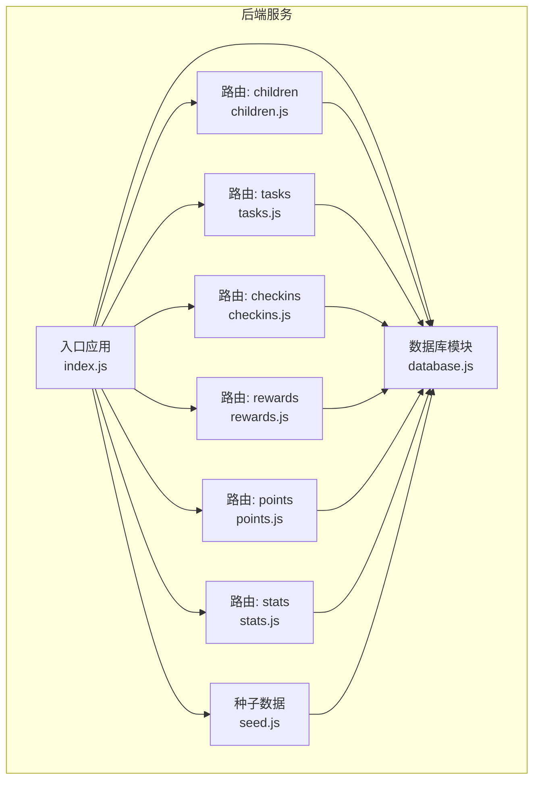
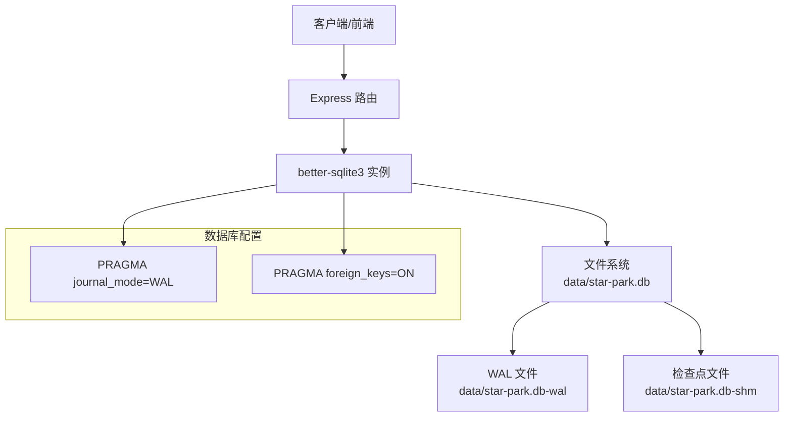
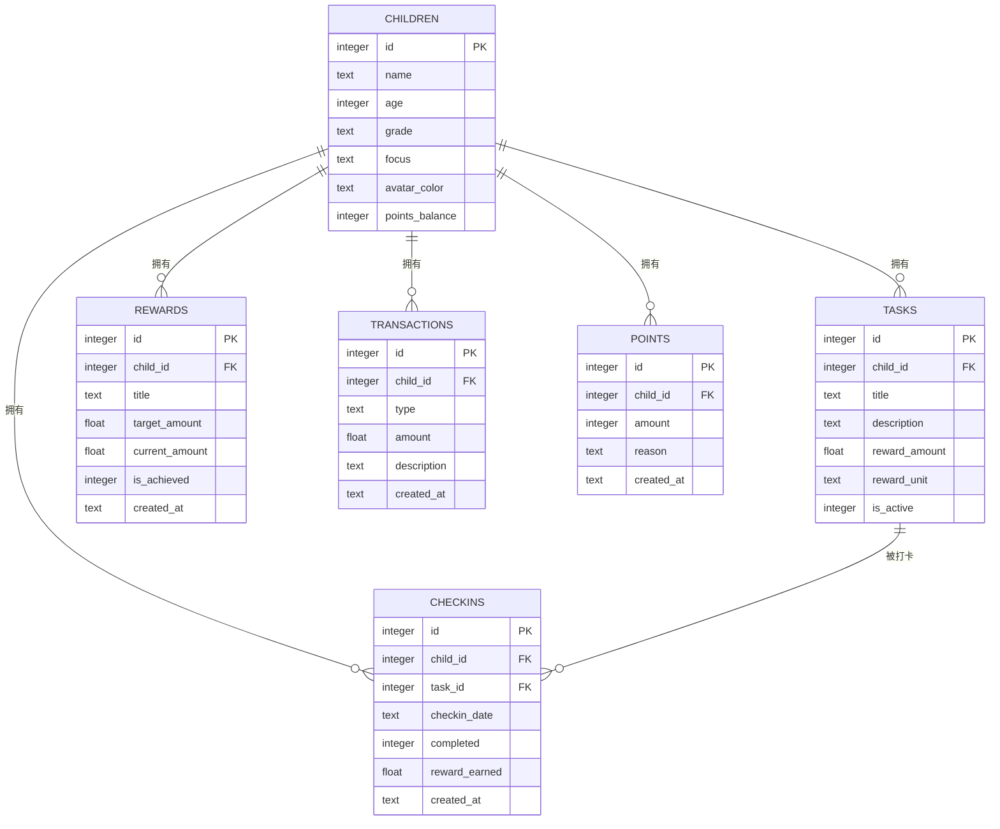
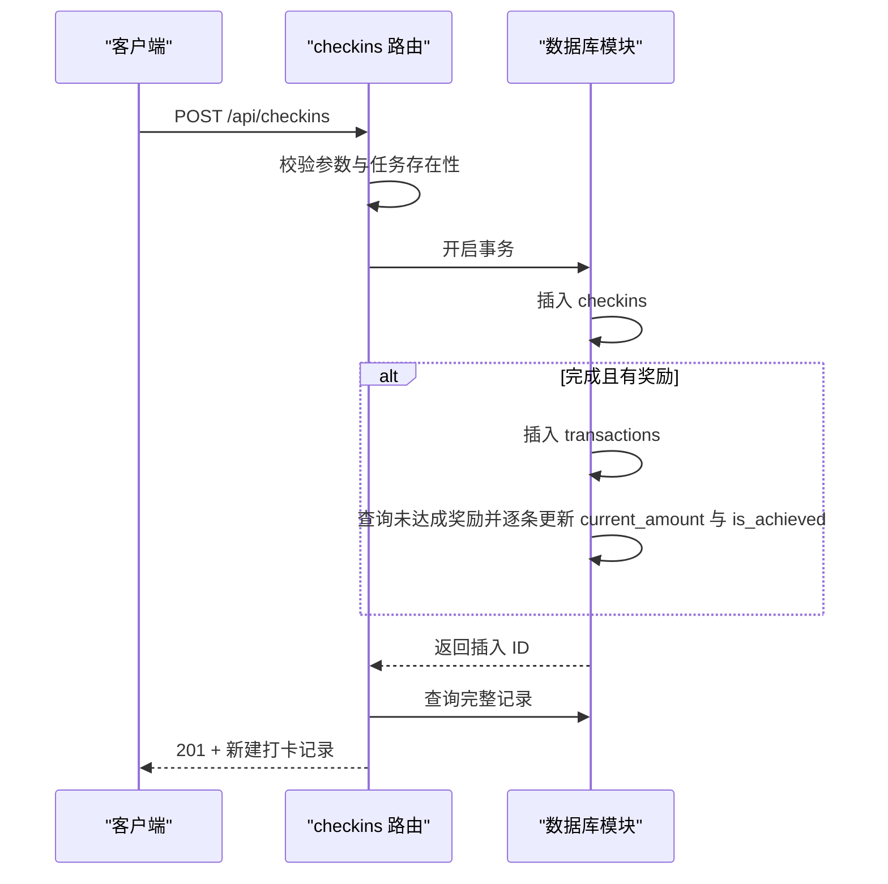
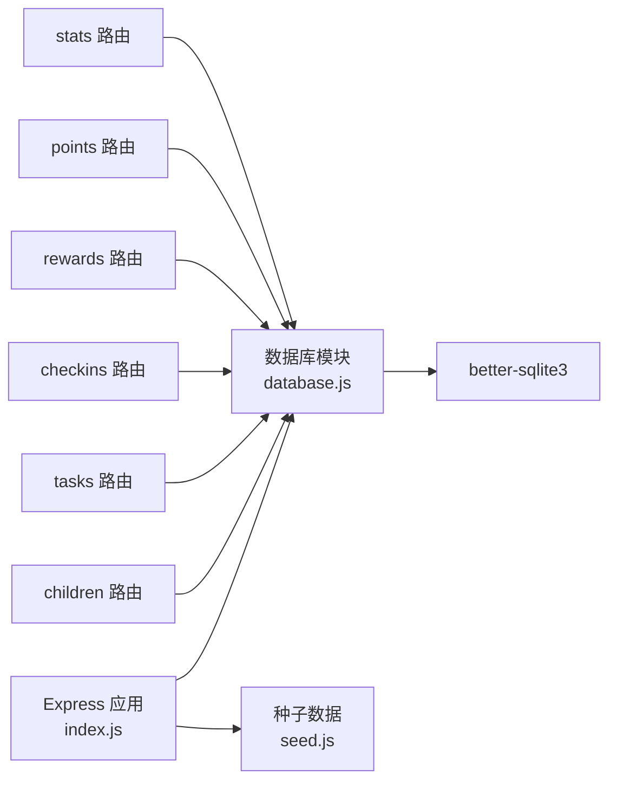

# 数据库概览

<cite>
**本文引用的文件**
- [database.js](file://star-park/server/src/database.js)
- [index.js](file://star-park/server/src/index.js)
- [seed.js](file://star-park/server/src/seed.js)
- [children.js](file://star-park/server/src/routes/children.js)
- [tasks.js](file://star-park/server/src/routes/tasks.js)
- [checkins.js](file://star-park/server/src/routes/checkins.js)
- [rewards.js](file://star-park/server/src/routes/rewards.js)
- [points.js](file://star-park/server/src/routes/points.js)
- [stats.js](file://star-park/server/src/routes/stats.js)
- [check-db-consistency.sh](file://scripts/check-db-consistency.sh)
- [package.json](file://star-park/server/package.json)
- [OPERATIONS.md](file://docs/OPERATIONS.md)
- [environment.json](file://harness/config/environment.json)
</cite>

## 目录
1. [简介](#简介)
2. [项目结构](#项目结构)
3. [核心组件](#核心组件)
4. [架构总览](#架构总览)
5. [详细组件分析](#详细组件分析)
6. [依赖关系分析](#依赖关系分析)
7. [性能考虑](#性能考虑)
8. [故障排查指南](#故障排查指南)
9. [结论](#结论)
10. [附录](#附录)

## 简介
本文件面向 StarParadise 系统的数据库层，聚焦 SQLite 在本项目中的整体架构与运维实践。内容涵盖数据库文件位置、WAL 模式配置、外键约束启用、初始化流程、数据目录结构与权限、事务处理机制、并发控制方案，以及性能调优参数、内存使用优化与磁盘空间管理等运维要点。

## 项目结构
数据库相关代码集中于后端服务模块，采用“单实例数据库 + 路由驱动”的轻量架构：
- 数据库初始化与表结构定义位于数据库模块
- 业务路由通过统一数据库句柄进行读写
- 种子数据在服务启动时按需初始化
- 提供一致性检查脚本保障 DDL 与代码字段一致

图表来源
- [index.js:1-42](file://star-park/server/src/index.js#L1-L42)
- [database.js:1-90](file://star-park/server/src/database.js#L1-L90)
- [seed.js:1-45](file://star-park/server/src/seed.js#L1-L45)
- [children.js:1-88](file://star-park/server/src/routes/children.js#L1-L88)
- [tasks.js:1-91](file://star-park/server/src/routes/tasks.js#L1-L91)
- [checkins.js:1-90](file://star-park/server/src/routes/checkins.js#L1-L90)
- [rewards.js:1-84](file://star-park/server/src/routes/rewards.js#L1-L84)
- [points.js:1-74](file://star-park/server/src/routes/points.js#L1-L74)
- [stats.js:1-182](file://star-park/server/src/routes/stats.js#L1-L182)

章节来源
- [index.js:1-42](file://star-park/server/src/index.js#L1-L42)
- [database.js:1-90](file://star-park/server/src/database.js#L1-L90)

## 核心组件
- 数据库模块：负责数据库文件创建、目录初始化、WAL 模式与外键约束配置、表结构定义与迁移
- 路由层：围绕 children、tasks、checkins、rewards、points、stats 提供 CRUD 与统计接口
- 种子数据：按需初始化示例数据，避免重复插入
- 一致性检查：Shell 脚本校验核心表与关键字段存在性

章节来源
- [database.js:1-90](file://star-park/server/src/database.js#L1-L90)
- [seed.js:1-45](file://star-park/server/src/seed.js#L1-L45)
- [check-db-consistency.sh:1-45](file://scripts/check-db-consistency.sh#L1-L45)

## 架构总览
数据库层采用单实例 SQLite（better-sqlite3）直连模式，无连接池概念；通过路由层的预编译语句与事务封装实现并发安全与数据一致性。

图表来源
- [database.js:10-15](file://star-park/server/src/database.js#L10-L15)
- [database.js:18-80](file://star-park/server/src/database.js#L18-L80)
- [package.json:8-13](file://star-park/server/package.json#L8-L13)

## 详细组件分析

### 数据库初始化与表结构
- 数据目录与文件：数据库文件位于服务 data 目录，首次启动自动创建目录与数据库文件
- WAL 模式：启用 WAL 提升并发读写性能
- 外键约束：开启外键约束，保证参照完整性
- 表结构：children、tasks、checkins、rewards、transactions、points 六张核心表
- 迁移：为 children 表增加 points_balance 字段（若不存在则新增）

图表来源
- [database.js:18-80](file://star-park/server/src/database.js#L18-L80)

章节来源
- [database.js:5-11](file://star-park/server/src/database.js#L5-L11)
- [database.js:13-15](file://star-park/server/src/database.js#L13-L15)
- [database.js:18-80](file://star-park/server/src/database.js#L18-L80)
- [database.js:82-87](file://star-park/server/src/database.js#L82-L87)

### 数据目录结构与文件权限
- 数据目录：服务根目录下 data 子目录，用于存放 SQLite 主库文件及 WAL 相关文件
- 权限建议：生产环境建议将 data 目录权限限制为仅服务进程可读写，避免非预期访问
- 备份与恢复：运维指南提供 cp 方式备份与恢复，便于快速回滚

章节来源
- [database.js:5-11](file://star-park/server/src/database.js#L5-L11)
- [OPERATIONS.md:94-102](file://docs/OPERATIONS.md#L94-L102)

### 事务处理机制与并发控制
- 并发模型：better-sqlite3 为单进程同步库，不提供连接池；通过 WAL 模式与外键约束提升并发读写能力
- 事务封装：在关键写入流程中使用事务，确保多步写入原子性
  - 删除任务：先删除关联打卡记录，再删除任务
  - 打卡流程：插入打卡记录、创建交易记录、更新奖励目标累计值
  - 手动积分：插入积分记录并同步更新 children 的 points_balance

图表来源
- [checkins.js:30-87](file://star-park/server/src/routes/checkins.js#L30-L87)
- [database.js:13-15](file://star-park/server/src/database.js#L13-L15)

章节来源
- [tasks.js:78-84](file://star-park/server/src/routes/tasks.js#L78-L84)
- [checkins.js:48-76](file://star-park/server/src/routes/checkins.js#L48-L76)
- [points.js:43-57](file://star-park/server/src/routes/points.js#L43-L57)

### 数据一致性与迁移
- 一致性检查：Shell 脚本在 CI/或运维场景下检查核心表与 children 表关键字段是否存在
- 迁移策略：通过 ALTER TABLE 动态为现有表添加新列，捕获异常避免重复执行失败

章节来源
- [check-db-consistency.sh:21-41](file://scripts/check-db-consistency.sh#L21-L41)
- [database.js:82-87](file://star-park/server/src/database.js#L82-L87)

### 种子数据初始化
- 触发时机：服务启动时调用种子脚本
- 去重逻辑：若 children 表已有数据则跳过
- 写入流程：使用事务批量插入示例数据，确保原子性

章节来源
- [index.js:34-35](file://star-park/server/src/index.js#L34-L35)
- [seed.js:3-42](file://star-park/server/src/seed.js#L3-L42)

## 依赖关系分析
- Express 应用依赖数据库模块导出的连接实例
- 各路由模块依赖数据库模块进行查询与写入
- better-sqlite3 作为 SQLite 的 Node.js 绑定，提供高性能本地存储

图表来源
- [index.js:1-42](file://star-park/server/src/index.js#L1-L42)
- [database.js:1-11](file://star-park/server/src/database.js#L1-L11)
- [package.json:8-13](file://star-park/server/package.json#L8-L13)

章节来源
- [index.js:1-42](file://star-park/server/src/index.js#L1-L42)
- [package.json:8-13](file://star-park/server/package.json#L8-L13)

## 性能考虑
- WAL 模式：已启用 WAL，显著提升并发读取与写入性能
- 事务批处理：在多步写入场景使用事务，减少锁竞争与回滚成本
- 预编译语句：路由层普遍使用预编译语句，降低 SQL 解析开销
- 统计查询：stats 路由对连续打卡、周完成率、30 天每日完成情况等进行聚合统计，建议在高并发场景下适当缓存热点结果
- 运维调优：生产环境建议定期执行 PRAGMA optimize，保持索引与统计信息最优

章节来源
- [database.js:13-15](file://star-park/server/src/database.js#L13-L15)
- [stats.js:6-101](file://star-park/server/src/routes/stats.js#L6-L101)
- [OPERATIONS.md:104-109](file://docs/OPERATIONS.md#L104-L109)

## 故障排查指南
- 健康检查：通过 /api/health 确认服务可用
- 日志查看：开发环境直接查看控制台输出
- 数据库备份与恢复：使用 cp 进行备份与恢复
- DDL 一致性：使用一致性检查脚本核对核心表与字段
- 外键约束错误：如遇外键约束导致的删除/更新失败，请确认级联规则与依赖关系
- 性能问题：确认 WAL 是否生效、是否频繁执行大型聚合查询、是否遗漏必要的索引

章节来源
- [index.js:29-32](file://star-park/server/src/index.js#L29-L32)
- [OPERATIONS.md:65-77](file://docs/OPERATIONS.md#L65-L77)
- [OPERATIONS.md:94-102](file://docs/OPERATIONS.md#L94-L102)
- [check-db-consistency.sh:15-41](file://scripts/check-db-consistency.sh#L15-L41)

## 结论
StarParadise 的数据库层以 SQLite 为核心，借助 better-sqlite3 提供高性能、低复杂度的本地存储。通过 WAL 模式、外键约束、事务封装与一致性检查脚本，系统在功能完整性与运维稳定性方面具备良好基础。建议在生产环境中配合 PRAGMA optimize、定期备份与访问控制，进一步提升可靠性与安全性。

## 附录

### 数据库关键设置速览
- 数据库文件位置：服务 data 目录下的 star-park.db
- WAL 模式：已启用
- 外键约束：已启用
- 迁移：children 表新增 points_balance 字段

章节来源
- [database.js:10-15](file://star-park/server/src/database.js#L10-L15)
- [database.js:82-87](file://star-park/server/src/database.js#L82-L87)

### 运行与运维要点
- 启动命令与端口：参考入口应用与运维文档
- 备份与恢复：使用 cp 进行文件级备份与恢复
- 性能调优：定期执行 PRAGMA optimize

章节来源
- [index.js:14](file://star-park/server/src/index.js#L14)
- [OPERATIONS.md:94-109](file://docs/OPERATIONS.md#L94-L109)