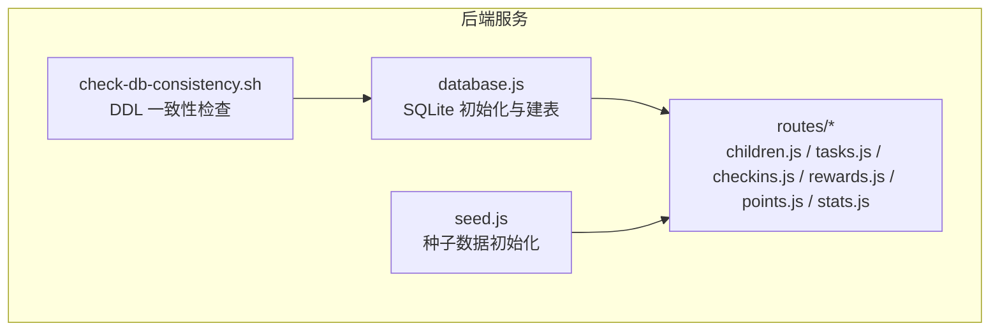
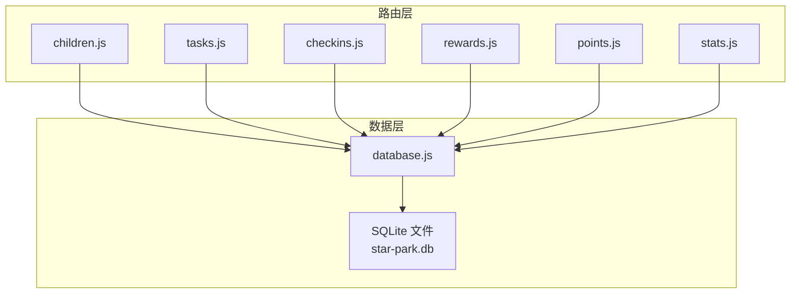
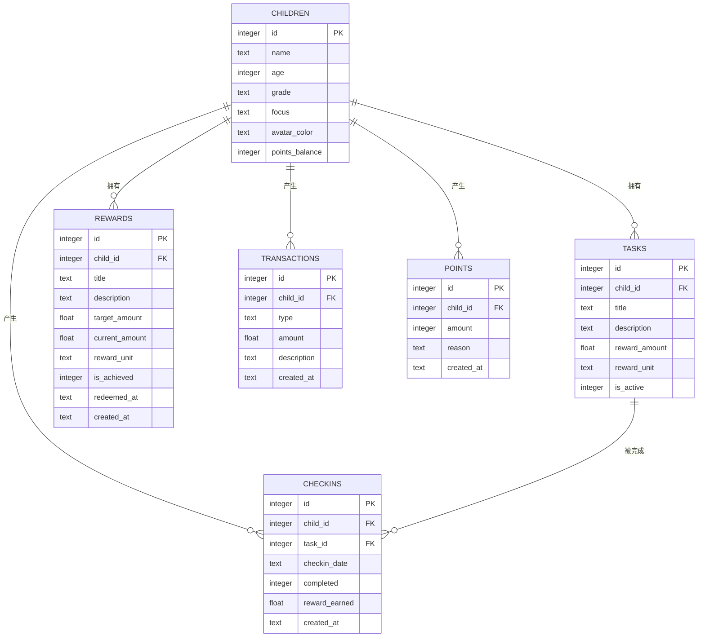
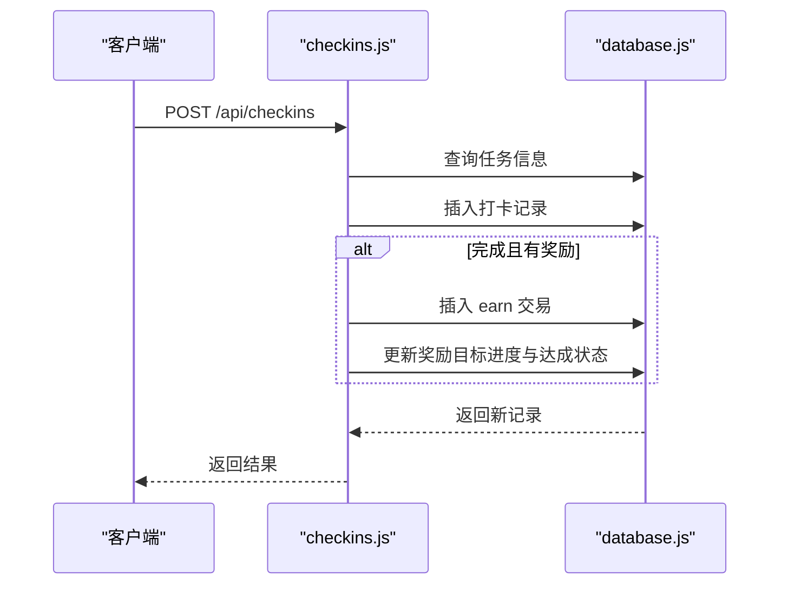
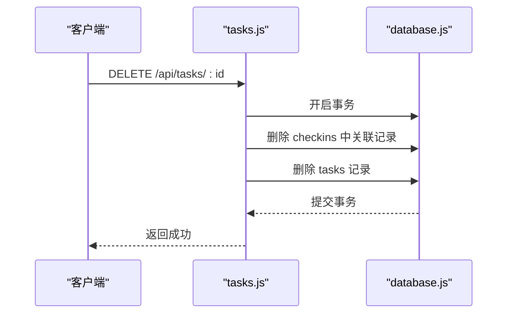
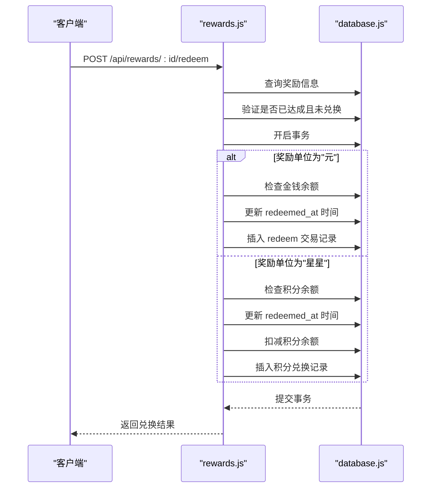
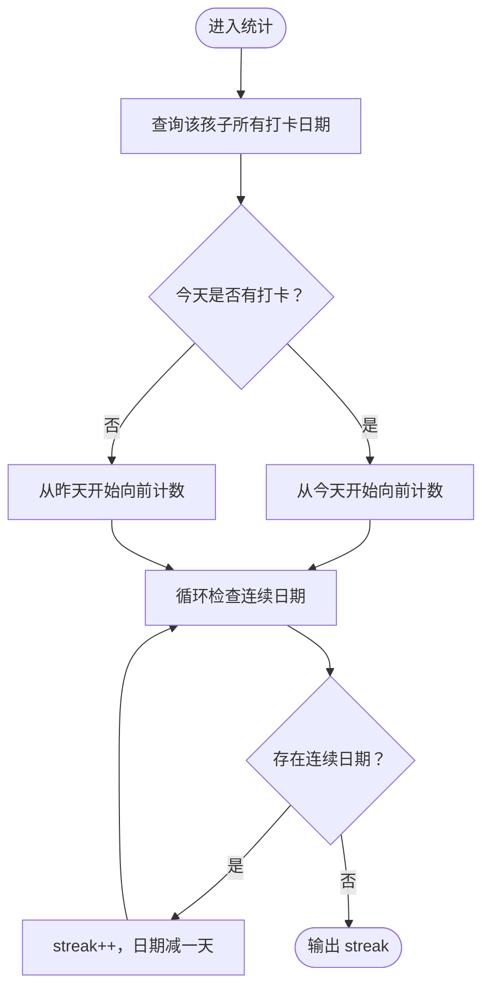
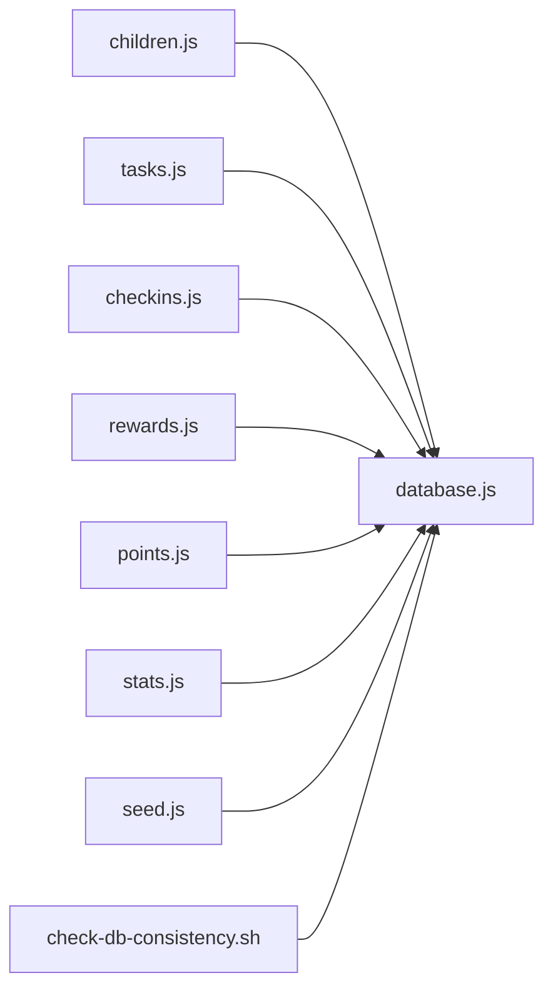

# 数据库设计

<cite>
**本文引用的文件**
- [database.js](file://star-park/server/src/database.js)
- [seed.js](file://star-park/server/src/seed.js)
- [children.js](file://star-park/server/src/routes/children.js)
- [tasks.js](file://star-park/server/src/routes/tasks.js)
- [checkins.js](file://star-park/server/src/routes/checkins.js)
- [rewards.js](file://star-park/server/src/routes/rewards.js)
- [points.js](file://star-park/server/src/routes/points.js)
- [stats.js](file://star-park/server/src/routes/stats.js)
- [check-db-consistency.sh](file://scripts/check-db-consistency.sh)
- [server.md](file://docs/design-docs/server.md)
- [ARCHITECTURE.md](file://docs/ARCHITECTURE.md)
</cite>

## 更新摘要
**所做更改**
- 更新了 Rewards 表结构定义，新增 description、reward_unit、redeemed_at 字段
- 完善了奖励兑换功能的详细说明，包括事务处理和余额验证逻辑
- 增强了数据迁移策略的说明，详细描述了 try/catch 模式的向后兼容性保证
- 更新了 API 接口文档，反映新的奖励管理功能
- 完善了 ER 图和业务流程图，体现新的奖励单位支持和兑换机制

## 目录
1. [简介](#简介)
2. [项目结构](#项目结构)
3. [核心组件](#核心组件)
4. [架构总览](#架构总览)
5. [详细组件分析](#详细组件分析)
6. [依赖分析](#依赖分析)
7. [性能考量](#性能考量)
8. [故障排查指南](#故障排查指南)
9. [结论](#结论)
10. [附录](#附录)

## 简介
本文件为 StarParadise 系统的数据库设计文档，聚焦于基于 SQLite 的嵌入式数据库架构。内容涵盖表结构定义、字段类型、主外键关系、索引策略建议、核心数据模型关系映射（Children、Tasks、Checkins、Rewards、Transactions、Points）、数据访问模式、缓存策略、性能优化、数据迁移路径与版本管理策略。文档同时提供数据库模式图与 ER 图，并结合现有路由实现说明关键流程。

**更新** 本次更新重点反映了奖励管理功能的增强，包括 Rewards 表的新增字段和完整的兑换流程支持。

## 项目结构
数据库相关的核心文件位于后端服务目录中：
- 数据库初始化与建表：database.js
- 种子数据初始化：seed.js
- 路由层（数据访问与业务流程）：children.js、tasks.js、checkins.js、rewards.js、points.js、stats.js
- 数据库一致性检查脚本：check-db-consistency.sh
- 设计文档参考：server.md、ARCHITECTURE.md

图表来源
- [database.js:1-111](file://star-park/server/src/database.js#L1-L111)
- [seed.js:1-45](file://star-park/server/src/seed.js#L1-L45)
- [children.js:1-88](file://star-park/server/src/routes/children.js#L1-L88)
- [tasks.js:1-91](file://star-park/server/src/routes/tasks.js#L1-L91)
- [checkins.js:1-179](file://star-park/server/src/routes/checkins.js#L1-L179)
- [rewards.js:1-167](file://star-park/server/src/routes/rewards.js#L1-L167)
- [points.js:1-74](file://star-park/server/src/routes/points.js#L1-L74)
- [stats.js:1-182](file://star-park/server/src/routes/stats.js#L1-L182)
- [check-db-consistency.sh:1-45](file://scripts/check-db-consistency.sh#L1-L45)

章节来源
- [database.js:1-111](file://star-park/server/src/database.js#L1-L111)
- [seed.js:1-45](file://star-park/server/src/seed.js#L1-L45)
- [server.md:1-115](file://docs/design-docs/server.md#L1-L115)
- [ARCHITECTURE.md:1-207](file://docs/ARCHITECTURE.md#L1-L207)

## 核心组件
本节概述六个核心数据表及其职责与约束：
- Children（孩子信息）：存储孩子基础信息与积分余额字段。
- Tasks（任务定义）：描述每个孩子的具体任务，含奖励金额与单位、启用状态。
- Checkins（打卡记录）：记录每日完成情况、奖励发放、时间戳。
- Rewards（奖励目标）：记录孩子设定的奖励目标，跟踪当前累计金额与达成状态，支持多种奖励单位和兑换时间记录。
- Transactions（交易记录）：记录金钱类收支流水（earn/spend/redeem）。
- Points（积分记录）：记录积分增减明细与余额同步。

**更新** Rewards 表现在支持灵活的奖励单位（元/星星等），并具备完整的兑换生命周期管理。

章节来源
- [database.js:18-80](file://star-park/server/src/database.js#L18-L80)

## 架构总览
后端通过 Express 路由调用 SQLite 数据库，实现对六张核心表的增删改查与业务流程编排。下图展示数据层与路由层的关系：

图表来源
- [children.js:1-88](file://star-park/server/src/routes/children.js#L1-L88)
- [tasks.js:1-91](file://star-park/server/src/routes/tasks.js#L1-L91)
- [checkins.js:1-179](file://star-park/server/src/routes/checkins.js#L1-L179)
- [rewards.js:1-167](file://star-park/server/src/routes/rewards.js#L1-L167)
- [points.js:1-74](file://star-park/server/src/routes/points.js#L1-L74)
- [stats.js:1-182](file://star-park/server/src/routes/stats.js#L1-L182)
- [database.js:1-111](file://star-park/server/src/database.js#L1-L111)

## 详细组件分析

### 数据模型与关系映射（ER 图）
下图展示六张核心表的实体关系，包括主键、外键约束与典型基数关系。

**更新** Rewards 表现在包含 description（奖励描述）、reward_unit（奖励单位）、redeemed_at（兑换时间）三个新字段，支持更丰富的奖励管理和兑换追踪。

图表来源
- [database.js:18-80](file://star-park/server/src/database.js#L18-L80)

章节来源
- [database.js:18-80](file://star-park/server/src/database.js#L18-L80)

### 表结构定义与字段说明
- Children
  - 主键：id
  - 字段：name、age、grade、focus、avatar_color、points_balance
  - 约束：非空 name；默认头像颜色；points_balance 用于积分余额缓存
- Tasks
  - 主键：id；外键：child_id → Children(id)
  - 字段：title、description、reward_amount、reward_unit、is_active
  - 约束：默认奖励金额与单位；默认启用状态
- Checkins
  - 主键：id；外键：child_id → Children(id)、task_id → Tasks(id)，级联删除
  - 字段：checkin_date、completed、reward_earned、created_at
  - 约束：默认完成标记与奖励金额；默认时间
- Rewards
  - 主键：id；外键：child_id → Children(id)
  - 字段：title、description、target_amount、current_amount、reward_unit、is_achieved、redeemed_at、created_at
  - 约束：默认未达成；默认累计金额；支持多种奖励单位；记录兑换时间
- Transactions
  - 主键：id；外键：child_id → Children(id)
  - 字段：type（earn/spend/redeem）、amount、description、created_at
  - 约束：默认时间；支持三种交易类型
- Points
  - 主键：id；外键：child_id → Children(id)
  - 字段：amount（整数）、reason、created_at
  - 约束：默认时间

**更新** Rewards 表现已完全支持灵活的奖励单位系统，可以配置为"元"或"星星"等不同单位，并完整记录兑换时间和状态。

章节来源
- [database.js:18-80](file://star-park/server/src/database.js#L18-L80)

### 索引策略建议
- 已有索引
  - 主键索引：所有表的主键列自动建立
- 建议新增索引（基于查询模式）
  - children(name)：按名称检索或去重场景
  - tasks(child_id, is_active)：按孩子与启用状态过滤
  - checkins(child_id, checkin_date)：按孩子与日期范围查询
  - checkins(task_id)：按任务统计完成情况
  - rewards(child_id, is_achieved)：按孩子与达成状态筛选
  - rewards(child_id, reward_unit)：按孩子与奖励单位筛选
  - transactions(child_id, type, created_at)：按类型与时间聚合
  - points(child_id, created_at)：积分明细与余额统计

**更新** 新增了针对 rewards 表的复合索引建议，以优化按奖励单位筛选的查询性能。

章节来源
- [children.js:5-37](file://star-park/server/src/routes/children.js#L5-L37)
- [tasks.js:5-19](file://star-park/server/src/routes/tasks.js#L5-L19)
- [checkins.js:6-28](file://star-park/server/src/routes/checkins.js#L6-L28)
- [rewards.js:5-19](file://star-park/server/src/routes/rewards.js#L5-L19)
- [points.js:5-28](file://star-park/server/src/routes/points.js#L5-L28)
- [stats.js:6-101](file://star-park/server/src/routes/stats.js#L6-L101)

### 数据完整性约束与外键关系
- 外键约束
  - Tasks.child_id → Children(id)
  - Checkins.child_id → Children(id)（ON DELETE CASCADE）
  - Checkins.task_id → Tasks(id)（ON DELETE CASCADE）
  - Rewards.child_id → Children(id)
  - Transactions.child_id → Children(id)
  - Points.child_id → Children(id)
- 其他约束
  - Children.points_balance：用于积分余额缓存
  - Checkins.reward_earned：根据任务奖励金额动态计算
  - Transactions.type：限定 earn/spend/redeem 类型
  - Rewards.reward_unit：支持灵活的单位配置（元/星星等）
  - Rewards.redeemed_at：记录奖励兑换时间，确保不可重复兑换

**更新** 新增了 Rewards 表的业务约束，包括奖励单位验证和兑换时间唯一性保证。

章节来源
- [database.js:36-48](file://star-park/server/src/database.js#L36-L48)
- [database.js:59](file://star-park/server/src/database.js#L59)
- [database.js:69](file://star-park/server/src/database.js#L69)
- [database.js:78](file://star-park/server/src/database.js#L78)

### 触发器与存储过程
- 当前实现未使用触发器或存储过程
- 业务逻辑集中在路由层（如 checkins 流程中的事务封装、rewards 兑换流程的事务保护）

**更新** Rewards 兑换功能现在使用 db.transaction() 确保原子性操作，防止并发条件下的数据不一致。

章节来源
- [checkins.js:48-77](file://star-park/server/src/routes/checkins.js#L48-L77)
- [rewards.js:107-154](file://star-park/server/src/routes/rewards.js#L107-L154)

### 数据访问模式
- 子表读取：children.js 在返回孩子列表时，按 child_id 查询 tasks 并汇总 transactions 收入作为余额
- 任务 CRUD：tasks.js 支持按 child_id 过滤、创建、更新、删除；删除任务时先清理关联 checkins
- 打卡流程：checkins.js 创建打卡记录，若完成则插入 earn 交易并更新 rewards 的 current_amount 与 is_achieved
- 奖励目标：rewards.js 支持按 child_id 过滤、创建、更新、删除，以及完整的兑换流程
- 积分系统：points.js 支持按 child_id 查询积分明细与余额；POST 手动加分并同步 children.points_balance
- 统计仪表盘：stats.js 计算连续打卡天数、本周完成率、最近30日每日完成情况、余额等

**更新** Rewards API 现在支持完整的生命周期管理，包括创建、更新、兑换等操作，并支持多种奖励单位。

章节来源
- [children.js:5-37](file://star-park/server/src/routes/children.js#L5-L37)
- [tasks.js:5-91](file://star-park/server/src/routes/tasks.js#L5-L91)
- [checkins.js:30-87](file://star-park/server/src/routes/checkins.js#L30-L87)
- [rewards.js:5-167](file://star-park/server/src/routes/rewards.js#L5-L167)
- [points.js:5-74](file://star-park/server/src/routes/points.js#L5-L74)
- [stats.js:6-182](file://star-park/server/src/routes/stats.js#L6-L182)

### 关键流程时序图

#### 打卡奖励流程（checkins）

图表来源
- [checkins.js:30-87](file://star-park/server/src/routes/checkins.js#L30-L87)
- [database.js:18-80](file://star-park/server/src/database.js#L18-L80)

#### 删除任务流程（tasks）

图表来源
- [tasks.js:78-84](file://star-park/server/src/routes/tasks.js#L78-L84)
- [database.js:18-80](file://star-park/server/src/database.js#L18-L80)

#### 奖励兑换流程（rewards）

**新增** 这是新增的奖励兑换流程图，展示了完整的兑换流程和事务保护机制。

图表来源
- [rewards.js:89-164](file://star-park/server/src/routes/rewards.js#L89-L164)
- [database.js:18-80](file://star-park/server/src/database.js#L18-L80)

### 复杂逻辑流程图（统计连续打卡天数）

图表来源
- [stats.js:17-36](file://star-park/server/src/routes/stats.js#L17-L36)

## 依赖分析
- 路由层依赖 database.js 提供的连接与表结构
- seed.js 依赖 database.js 初始化表结构并插入示例数据
- check-db-consistency.sh 依赖 SQLite CLI 校验表与字段存在性

图表来源
- [children.js:1-88](file://star-park/server/src/routes/children.js#L1-L88)
- [tasks.js:1-91](file://star-park/server/src/routes/tasks.js#L1-L91)
- [checkins.js:1-179](file://star-park/server/src/routes/checkins.js#L1-L179)
- [rewards.js:1-167](file://star-park/server/src/routes/rewards.js#L1-L167)
- [points.js:1-74](file://star-park/server/src/routes/points.js#L1-L74)
- [stats.js:1-182](file://star-park/server/src/routes/stats.js#L1-L182)
- [seed.js:1-45](file://star-park/server/src/seed.js#L1-L45)
- [check-db-consistency.sh:1-45](file://scripts/check-db-consistency.sh#L1-L45)
- [database.js:1-111](file://star-park/server/src/database.js#L1-L111)

章节来源
- [children.js:1-88](file://star-park/server/src/routes/children.js#L1-L88)
- [tasks.js:1-91](file://star-park/server/src/routes/tasks.js#L1-L91)
- [checkins.js:1-179](file://star-park/server/src/routes/checkins.js#L1-L179)
- [rewards.js:1-167](file://star-park/server/src/routes/rewards.js#L1-L167)
- [points.js:1-74](file://star-park/server/src/routes/points.js#L1-L74)
- [stats.js:1-182](file://star-park/server/src/routes/stats.js#L1-L182)
- [seed.js:1-45](file://star-park/server/src/seed.js#L1-L45)
- [check-db-consistency.sh:1-45](file://scripts/check-db-consistency.sh#L1-L45)
- [database.js:1-111](file://star-park/server/src/database.js#L1-L111)

## 性能考量
- 并发与日志模式
  - 启用 WAL 模式以提升并发读写性能
  - 启用外键约束保证数据一致性
- 查询优化建议
  - 为高频过滤字段建立复合索引（如 tasks(child_id, is_active)、checkins(child_id, checkin_date)）
  - 对统计类查询（如最近30日每日完成情况）使用分页或窗口函数减少一次性数据量
- 写入优化
  - 使用事务批量写入（如 checkins、points、rewards 兑换的事务封装）
  - 控制单次事务大小，避免长时间锁持有
- 缓存策略
  - children.points_balance 作为积分余额缓存字段，减少每次查询的聚合开销
  - 前端可缓存近期统计结果，降低后端压力

**更新** Rewards 兑换操作现在使用事务保护，确保在高并发场景下的数据一致性。

章节来源
- [database.js:13-15](file://star-park/server/src/database.js#L13-L15)
- [points.js:43-57](file://star-park/server/src/routes/points.js#L43-L57)
- [checkins.js:48-77](file://star-park/server/src/routes/checkins.js#L48-L77)
- [rewards.js:107-154](file://star-park/server/src/routes/rewards.js#L107-L154)

## 故障排查指南
- 数据库文件缺失
  - 首次启动会自动创建数据库文件；若缺失，检查 data 目录权限与路径
- DDL 一致性问题
  - 使用 check-db-consistency.sh 校验核心表与 children 表关键字段是否存在
- 常见错误与处理
  - 400 缺少必填字段：补充请求体后重试
  - 404 资源不存在：确认 ID 是否正确
  - 500 数据库异常：检查数据库状态与 WAL 日志
- 奖励兑换相关错误
  - 余额不足：检查 transactions 表中的 earn/spend 记录
  - 积分余额不足：检查 children.points_balance 与 points 表记录
  - 重复兑换：检查 rewards.redeemed_at 字段是否为空

**更新** 新增了奖励兑换相关的故障排查指南，帮助快速定位兑换失败的原因。

章节来源
- [check-db-consistency.sh:15-42](file://scripts/check-db-consistency.sh#L15-L42)
- [children.js:42-53](file://star-park/server/src/routes/children.js#L42-L53)
- [tasks.js:24-35](file://star-park/server/src/routes/tasks.js#L24-L35)
- [checkins.js:33-44](file://star-park/server/src/routes/checkins.js#L33-L44)
- [rewards.js:24-35](file://star-park/server/src/routes/rewards.js#L24-L35)
- [rewards.js:90-164](file://star-park/server/src/routes/rewards.js#L90-L164)
- [points.js:33-41](file://star-park/server/src/routes/points.js#L33-L41)

## 结论
本设计以 SQLite 为核心，围绕 Children、Tasks、Checkins、Rewards、Transactions、Points 六张表构建家庭激励系统。通过外键约束与事务封装保障数据一致性，利用 WAL 模式与索引建议提升性能。当前未使用触发器与存储过程，业务逻辑集中于路由层，便于维护与扩展。

**更新** 本次更新显著增强了奖励管理系统，支持灵活的奖励单位配置和完整的兑换生命周期管理。通过 try/catch 迁移模式确保了向后兼容性，使得系统能够在不中断服务的情况下进行数据库结构升级。建议后续引入复合索引与缓存策略，持续通过一致性检查脚本保障 DDL 与代码的一致性。

## 附录

### 数据迁移路径与版本管理策略
- 迁移策略
  - 通过 ALTER TABLE 动态添加字段（如 children.points_balance、rewards.description/reward_unit/redeemed_at），兼容已有数据
  - 使用 try/catch 忽略重复添加字段的异常，确保向后兼容性
  - 为新字段设置合理的默认值，保证现有数据的完整性
- 版本管理
  - 以数据库初始化脚本为基准版本；新增迁移逻辑时在初始化脚本中追加
  - 使用一致性检查脚本在 CI/CD 中验证表结构与字段存在性
  - 遵循幂等性原则，确保迁移脚本可重复执行
- 发布流程
  - 新功能上线前执行一致性检查
  - 若涉及表结构变更，先在测试环境验证，再合并到生产
  - 保持数据库迁移与应用程序版本的同步

**更新** 详细说明了新的奖励相关字段的迁移策略，包括 description、reward_unit、redeemed_at 三个字段的安全添加方式。

章节来源
- [database.js:82-108](file://star-park/server/src/database.js#L82-L108)
- [check-db-consistency.sh:21-42](file://scripts/check-db-consistency.sh#L21-L42)

### API 接口规范

#### 奖励管理 API
- **GET /api/rewards** - 获取奖励目标列表
  - 参数：child_id（可选）
  - 响应：包含 description、reward_unit、redeemed_at 字段的奖励列表
- **POST /api/rewards** - 创建奖励目标
  - 请求体：child_id、title、target_amount、description（可选）、reward_unit（可选，默认"元"）
  - 响应：新创建的奖励对象
- **PUT /api/rewards/:id** - 更新奖励目标
  - 支持更新：title、target_amount、current_amount、is_achieved、description、reward_unit
  - 响应：更新后的奖励对象
- **DELETE /api/rewards/:id** - 删除奖励目标
  - 响应：成功标志
- **POST /api/rewards/:id/redeem** - 兑换奖励
  - 前置条件：奖励已达成且未兑换
  - 支持单位："元"（扣减金钱余额）、"星星"（扣减积分余额）
  - 响应：兑换后的奖励对象，包含 redeemed_at 时间戳

**新增** 这是完整的奖励管理 API 规范，反映了最新的字段支持和兑换功能。

章节来源
- [rewards.js:5-167](file://star-park/server/src/routes/rewards.js#L5-L167)