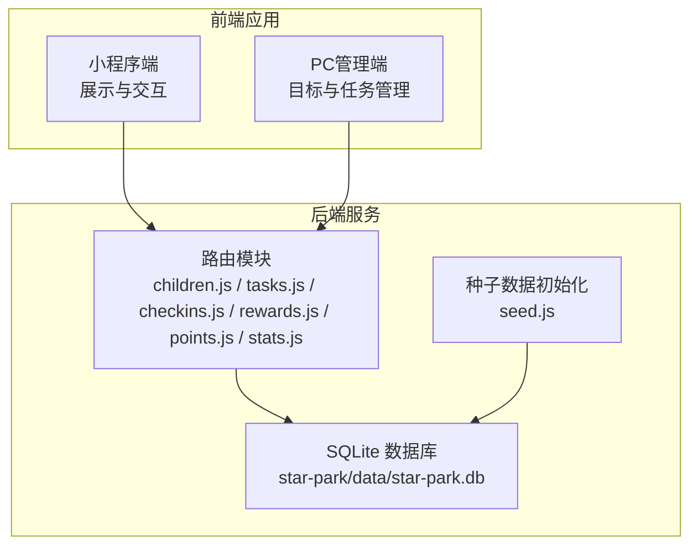
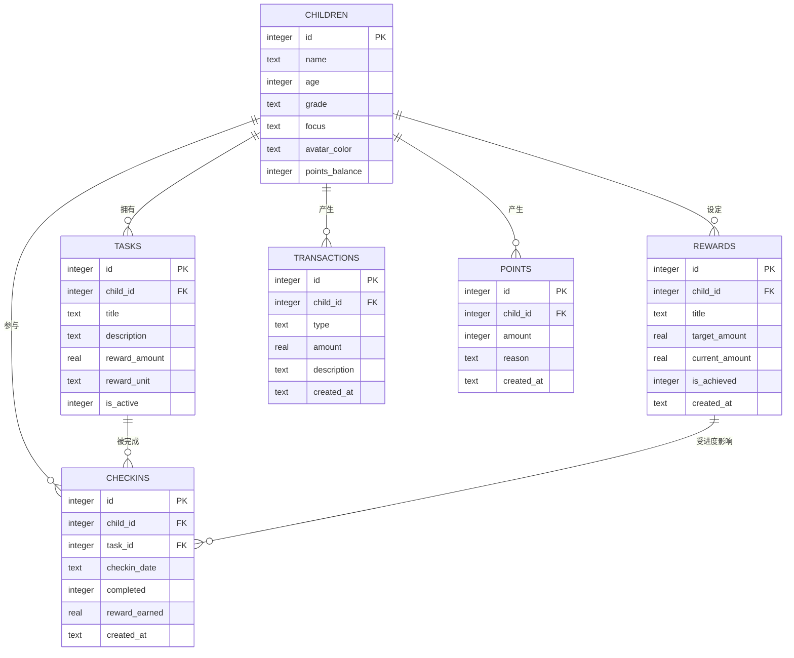
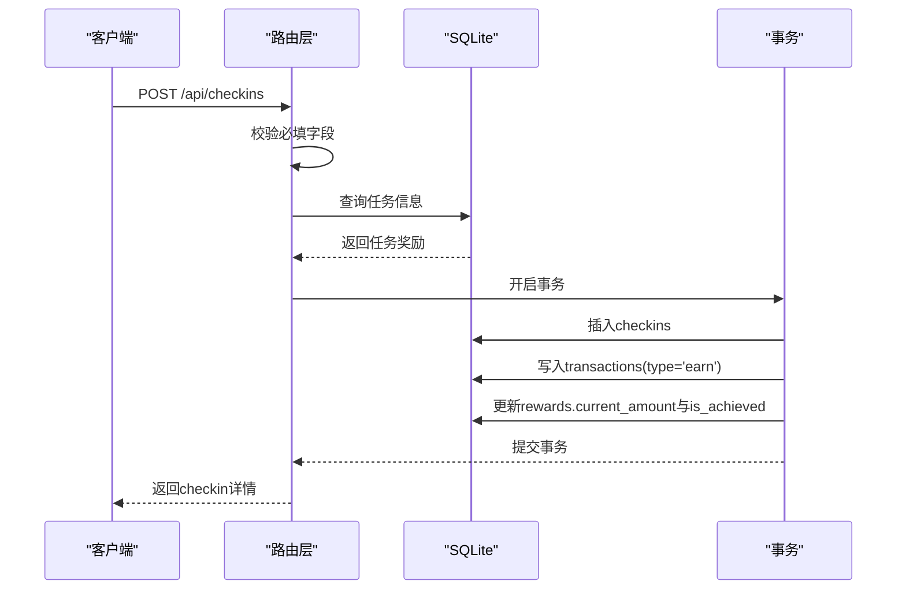

# 数据模型定义

<cite>
**本文引用的文件**
- [database.js](file://star-park/server/src/database.js)
- [seed.js](file://star-park/server/src/seed.js)
- [children.js](file://star-park/server/src/routes/children.js)
- [tasks.js](file://star-park/server/src/routes/tasks.js)
- [checkins.js](file://star-park/server/src/routes/checkins.js)
- [rewards.js](file://star-park/server/src/routes/rewards.js)
- [points.js](file://star-park/server/src/routes/points.js)
- [stats.js](file://star-park/server/src/routes/stats.js)
- [api.md](file://docs/api.md)
</cite>

## 目录
1. [简介](#简介)
2. [项目结构](#项目结构)
3. [核心数据模型](#核心数据模型)
4. [架构总览](#架构总览)
5. [详细模型分析](#详细模型分析)
6. [依赖关系分析](#依赖关系分析)
7. [性能考量](#性能考量)
8. [故障排查指南](#故障排查指南)
9. [结论](#结论)

## 简介
本文件面向StarParadise系统，系统采用本地SQLite数据库存储，围绕“孩子-任务-打卡-奖励-交易-积分”六类核心实体构建数据模型，支撑家庭内日常行为激励与成长追踪。本文将逐项阐述Children、Tasks、Checkins、Rewards、Transactions、Points六大模型的字段定义、数据类型、默认值、约束条件、设计理念、业务含义、字段间关联关系，并给出典型示例与使用场景。

## 项目结构
后端基于Express + better-sqlite3，数据库在首次启动时自动建表；路由层提供REST接口，配合统计与仪表盘接口输出聚合指标。

图表来源
- [database.js:18-80](file://star-park/server/src/database.js#L18-L80)
- [seed.js:1-45](file://star-park/server/src/seed.js#L1-L45)
- [children.js:1-88](file://star-park/server/src/routes/children.js#L1-L88)
- [tasks.js:1-91](file://star-park/server/src/routes/tasks.js#L1-L91)
- [checkins.js:1-90](file://star-park/server/src/routes/checkins.js#L1-L90)
- [rewards.js:1-84](file://star-park/server/src/routes/rewards.js#L1-L84)
- [points.js:1-74](file://star-park/server/src/routes/points.js#L1-L74)
- [stats.js:1-182](file://star-park/server/src/routes/stats.js#L1-L182)

章节来源
- [database.js:18-80](file://star-park/server/src/database.js#L18-L80)
- [seed.js:1-45](file://star-park/server/src/seed.js#L1-L45)

## 核心数据模型
本节对六大核心数据模型进行字段定义、数据类型、默认值、约束条件的系统性梳理，并解释其业务语义与设计取向。

- Children（孩子信息模型）
  - 字段与类型
    - id: 整型，主键，自增
    - name: 文本，非空
    - age: 整型，可空
    - grade: 文本，可空
    - focus: 文本，可空
    - avatar_color: 文本，默认值'#19C8B9'
    - points_balance: 整型，默认值0（迁移后新增列）
  - 约束与索引
    - 主键唯一
    - 外键约束：用于关联Tasks、Checkins、Rewards、Transactions、Points
  - 设计理念
    - 记录孩子基础画像与可视化标识色，支持积分余额字段以统一激励口径
  - 使用场景
    - 展示卡片、仪表盘概览、任务与奖励关联

- Tasks（任务模型）
  - 字段与类型
    - id: 整型，主键，自增
    - child_id: 整型，非空，外键指向children.id
    - title: 文本，非空
    - description: 文本，可空
    - reward_amount: 实数，默认1.0
    - reward_unit: 文本，默认"元"
    - is_active: 整型，默认1（1表示启用，0表示停用）
  - 约束与索引
    - 外键：child_id -> children(id)，级联删除由Checkins触发器控制
  - 设计理念
    - 将“任务”与“奖励”解耦，便于灵活配置奖励额度与单位
  - 使用场景
    - 孩子侧任务列表、打卡奖励计算、统计活跃任务数

- Checkins（打卡记录模型）
  - 字段与类型
    - id: 整型，主键，自增
    - child_id: 整型，非空，外键指向children.id
    - task_id: 整型，非空，外键指向tasks.id
    - checkin_date: 文本，非空（YYYY-MM-DD）
    - completed: 整型，默认1（1表示完成，0表示未完成）
    - reward_earned: 实数，默认0
    - created_at: 文本，默认当前本地时间
  - 约束与索引
    - 外键：child_id -> children(id)（级联删除），task_id -> tasks(id)（级联删除）
  - 设计理念
    - 记录每日完成事实，支持奖励累计与目标进度更新
  - 使用场景
    - 日常打卡、奖励发放、连续打卡统计、周完成率计算

- Rewards（奖励目标模型）
  - 字段与类型
    - id: 整型，主键，自增
    - child_id: 整型，非空，外键指向children.id
    - title: 文本，非空
    - target_amount: 实数，非空
    - current_amount: 实数，默认0
    - is_achieved: 整型，默认0（0未达成，1达成）
    - created_at: 文本，默认当前本地时间
  - 约束与索引
    - 外键：child_id -> children(id)
  - 设计理念
    - 将“即时奖励”与“长期目标”结合，形成正反馈闭环
  - 使用场景
    - 目标进度可视化、兑换提醒、消费抵扣

- Transactions（交易模型）
  - 字段与类型
    - id: 整型，主键，自增
    - child_id: 整型，非空，外键指向children.id
    - type: 文本，非空（如"earn"/"spend"）
    - amount: 实数，非空
    - description: 文本，可空
    - created_at: 文本，默认当前本地时间
  - 约束与索引
    - 外键：child_id -> children(id)
  - 设计理念
    - 统一“收入/支出”流水，便于余额计算与审计
  - 使用场景
    - 收支明细、余额计算、报表生成

- Points（积分模型）
  - 字段与类型
    - id: 整型，主键，自增
    - child_id: 整型，非空，外键指向children.id
    - amount: 整型，非空（家长手动加减积分）
    - reason: 文本，可空
    - created_at: 文本，默认当前本地时间
  - 约束与索引
    - 外键：child_id -> children(id)
  - 设计理念
    - 家长侧直接干预的即时激励工具，与余额联动
  - 使用场景
    - 特殊奖励、惩罚、积分余额更新

章节来源
- [database.js:18-80](file://star-park/server/src/database.js#L18-L80)

## 架构总览
下图展示六大模型之间的关系与典型数据流。

图表来源
- [database.js:18-80](file://star-park/server/src/database.js#L18-L80)

## 详细模型分析

### Children（孩子信息模型）
- 字段定义与约束
  - id: 主键，自增
  - name: 非空，用于界面展示
  - age/grade/focus: 可空，扩展信息
  - avatar_color: 默认'#19C8B9'，用于UI视觉标识
  - points_balance: 迁移后新增，用于积分余额
- 业务含义
  - 孩子的唯一身份标识，承载任务、打卡、奖励、交易、积分等上下文
- 关联关系
  - Tasks.child_id → Children.id
  - Checkins.child_id → Children.id
  - Rewards.child_id → Children.id
  - Transactions.child_id → Children.id
  - Points.child_id → Children.id
- 示例数据
  - name: "老二"，age: 13，grade: "初一"，focus: "各学科提分"，avatar_color: "#FF6B6B"
- 使用场景
  - 小程序首页卡片展示、PC端仪表盘概览、统计接口聚合

章节来源
- [database.js:18-26](file://star-park/server/src/database.js#L18-L26)
- [children.js:5-37](file://star-park/server/src/routes/children.js#L5-L37)

### Tasks（任务模型）
- 字段定义与约束
  - child_id: 非空，外键
  - title: 非空，任务名称
  - description: 可空，任务描述
  - reward_amount: 默认1.0，奖励金额
  - reward_unit: 默认"元"
  - is_active: 默认1，控制任务是否计入统计
- 业务含义
  - 家庭日常行为清单，与奖励挂钩，驱动打卡行为
- 关联关系
  - Checkins.task_id → Tasks.id
- 示例数据
  - child_id: 2，title: "英语背单词"，description: "每天背10个单词"，reward_amount: 1，reward_unit: "元"
- 使用场景
  - 任务列表查询、新增/修改/删除、统计活跃任务数

章节来源
- [database.js:28-37](file://star-park/server/src/database.js#L28-L37)
- [tasks.js:5-36](file://star-park/server/src/routes/tasks.js#L5-L36)

### Checkins（打卡记录模型）
- 字段定义与约束
  - child_id/task_id: 非空，外键
  - checkin_date: 非空，YYYY-MM-DD
  - completed: 默认1，0/1标记完成
  - reward_earned: 默认0，完成时等于对应任务奖励
  - created_at: 默认当前本地时间
- 业务含义
  - 记录每日完成事实，驱动奖励与目标进度更新
- 关联关系
  - 与Tasks、Children、Rewards存在强关联
- 示例数据
  - child_id: 2，task_id: 1，checkin_date: "2026-05-25"，completed: 1，reward_earned: 1.0
- 使用场景
  - 新增打卡（含事务：插入checkins、写入transactions、更新rewards）、查询某日/某孩打卡

章节来源
- [database.js:39-49](file://star-park/server/src/database.js#L39-L49)
- [checkins.js:30-87](file://star-park/server/src/routes/checkins.js#L30-L87)

### Rewards（奖励目标模型）
- 字段定义与约束
  - child_id: 非空，外键
  - title/target_amount: 非空
  - current_amount: 默认0，随打卡累计
  - is_achieved: 默认0，达到目标后置1
  - created_at: 默认当前本地时间
- 业务含义
  - 将短期奖励与长期目标结合，形成正反馈闭环
- 关联关系
  - 与Checkins、Children关联，完成时累计current_amount并判定is_achieved
- 示例数据
  - child_id: 4，title: "变形金刚玩具"，target_amount: 50，current_amount: 0
- 使用场景
  - 新增目标、更新目标、查询未达成目标、兑换提醒

章节来源
- [database.js:51-60](file://star-park/server/src/database.js#L51-L60)
- [rewards.js:5-36](file://star-park/server/src/routes/rewards.js#L5-L36)

### Transactions（交易模型）
- 字段定义与约束
  - child_id: 非空，外键
  - type: 非空，如"earn"/"spend"
  - amount: 非空，实数
  - description: 可空
  - created_at: 默认当前本地时间
- 业务含义
  - 统一收支流水，便于余额计算与审计
- 关联关系
  - 与Children关联
- 示例数据
  - child_id: 2，type: "earn"，amount: 1.0，description: "完成「英语背单词」打卡奖励"
- 使用场景
  - 收支明细查询、余额计算、报表生成

章节来源
- [database.js:62-70](file://star-park/server/src/database.js#L62-L70)
- [stats.js:79-86](file://star-park/server/src/routes/stats.js#L79-L86)

### Points（积分模型）
- 字段定义与约束
  - child_id: 非空，外键
  - amount: 非空，整数（家长手动加减）
  - reason: 可空
  - created_at: 默认当前本地时间
- 业务含义
  - 家长侧直接干预的即时激励工具，与children.points_balance联动
- 关联关系
  - 与Children关联，写入后同步更新children.points_balance
- 示例数据
  - child_id: 2，amount: 5，reason: "表现优秀"
- 使用场景
  - 家长手动加分/减分、积分余额更新、积分记录查询

章节来源
- [database.js:72-79](file://star-park/server/src/database.js#L72-L79)
- [points.js:5-72](file://star-park/server/src/routes/points.js#L5-L72)

## 依赖关系分析
- 外键约束与级联删除
  - Checkins.child_id → Children(id)（级联删除）
  - Checkins.task_id → Tasks(id)（级联删除）
  - Rewards.child_id → Children(id)
  - Transactions.child_id → Children(id)
  - Points.child_id → Children(id)
- 事务一致性
  - 打卡流程：插入checkins → 写入transactions → 更新rewards（单事务）
  - 删除任务：先删checkins，再删task（单事务）
  - 手动积分：插入points → 更新children.points_balance（单事务）
- 统计与聚合
  - 统计接口基于checkins、tasks、transactions、rewards进行聚合计算

图表来源
- [checkins.js:30-87](file://star-park/server/src/routes/checkins.js#L30-L87)

章节来源
- [checkins.js:78-87](file://star-park/server/src/routes/checkins.js#L78-L87)
- [tasks.js:78-88](file://star-park/server/src/routes/tasks.js#L78-L88)
- [points.js:43-68](file://star-park/server/src/routes/points.js#L43-L68)

## 性能考量
- WAL模式与外键开启
  - 数据库启用WAL模式与外键约束，提升并发读写与数据一致性
- 索引建议
  - 建议在checkins.checkin_date、checkins.child_id、checkins.task_id、rewards.is_achieved、transactions.type等高频查询字段上建立索引，以优化统计与查询性能
- 事务批处理
  - 对批量导入或批量更新场景，建议使用事务包裹，减少锁竞争与IO次数
- 数据量增长
  - 随着打卡记录增多，建议定期归档历史数据或按月/季度清理，避免单表过大影响查询

## 故障排查指南
- 常见错误与定位
  - 缺少必填字段：如创建任务时缺失child_id或title，或创建打卡时缺失child_id/task_id/checkin_date，接口返回400
  - 资源不存在：如更新/删除任务或奖励时id不存在，接口返回404
  - 服务器内部错误：数据库异常或事务失败，接口返回500
- 排查步骤
  - 检查请求参数是否符合API文档要求
  - 核对关联实体是否存在（如child_id、task_id）
  - 查看数据库事务是否成功提交
  - 检查统计接口依赖的聚合逻辑是否正确（如周起止、活跃任务数）

章节来源
- [api.md:215-222](file://docs/api.md#L215-L222)
- [children.js:42-53](file://star-park/server/src/routes/children.js#L42-L53)
- [tasks.js:24-35](file://star-park/server/src/routes/tasks.js#L24-L35)
- [checkins.js:33-44](file://star-park/server/src/routes/checkins.js#L33-L44)
- [rewards.js:24-35](file://star-park/server/src/routes/rewards.js#L24-L35)
- [points.js:33-41](file://star-park/server/src/routes/points.js#L33-L41)

## 结论
StarParadise通过六大核心数据模型构建了清晰的“行为-奖励-目标-积分”闭环：Children承载身份与余额，Tasks定义行为与奖励，Checkins记录事实并驱动Transactions与Rewards，Points作为家长侧即时干预工具并与Children余额联动。数据库层面通过外键与事务保障一致性，统计接口提供关键指标，整体设计简洁、可扩展且易于维护。