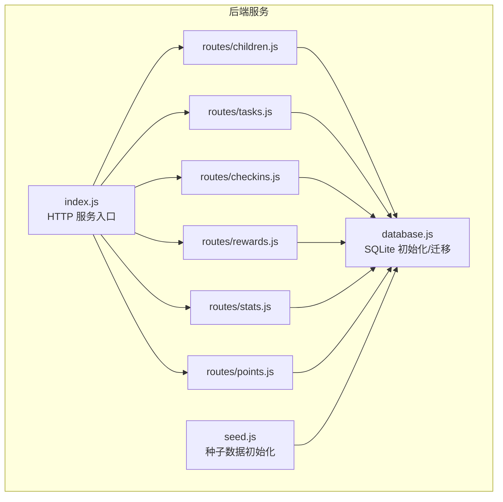
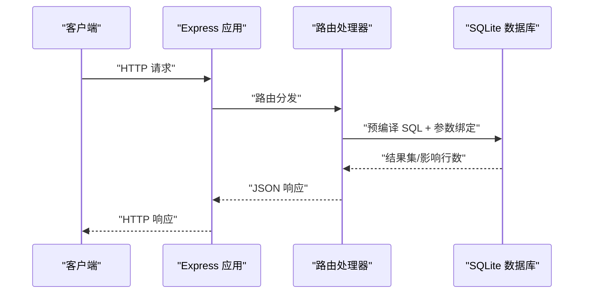
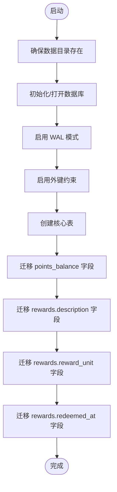
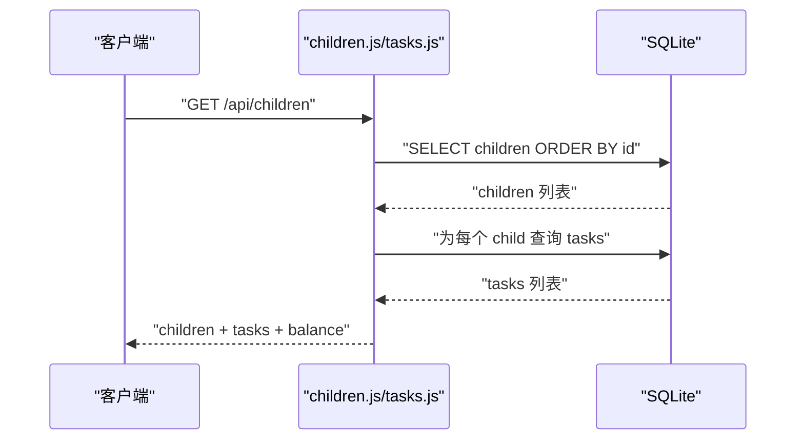
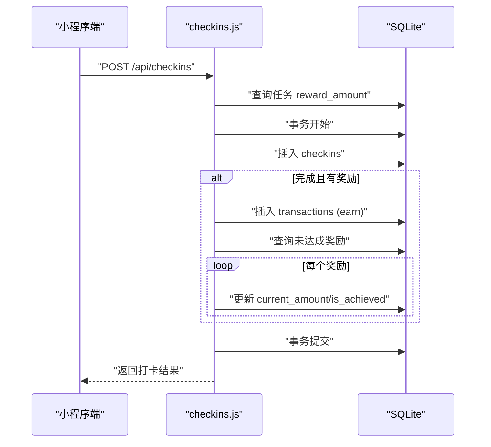
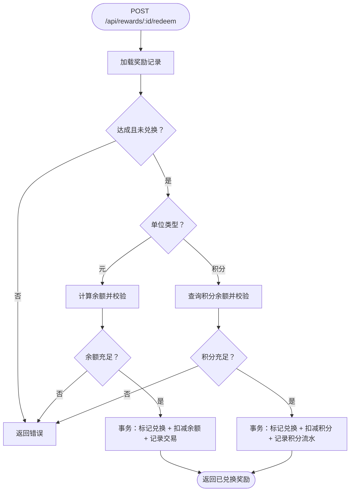
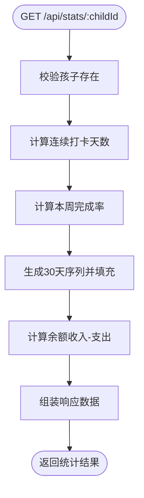
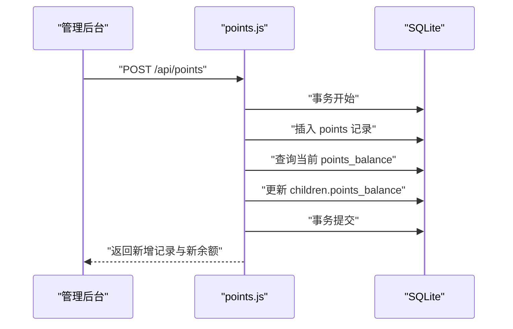
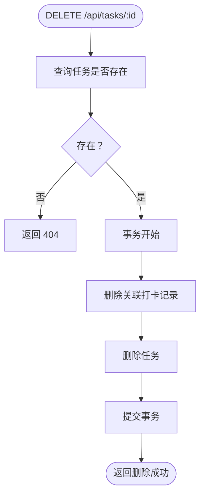
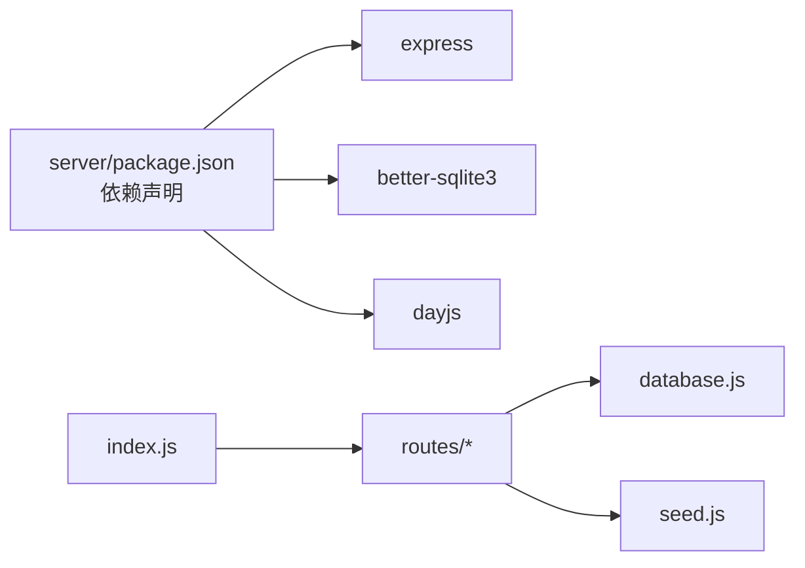

# 数据访问模式

<cite>
**本文引用的文件**
- [database.js](file://star-park/server/src/database.js)
- [index.js](file://star-park/server/src/index.js)
- [seed.js](file://star-park/server/src/seed.js)
- [children.js](file://star-park/server/src/routes/children.js)
- [tasks.js](file://star-park/server/src/routes/tasks.js)
- [checkins.js](file://star-park/server/src/routes/checkins.js)
- [rewards.js](file://star-park/server/src/routes/rewards.js)
- [stats.js](file://star-park/server/src/routes/stats.js)
- [points.js](file://star-park/server/src/routes/points.js)
- [package.json](file://star-park/server/package.json)
- [ARCHITECTURE.md](file://docs/ARCHITECTURE.md)
- [api.md](file://docs/api.md)
- [check-db-consistency.sh](file://scripts/check-db-consistency.sh)
</cite>

## 目录
1. [简介](#简介)
2. [项目结构](#项目结构)
3. [核心组件](#核心组件)
4. [架构总览](#架构总览)
5. [详细组件分析](#详细组件分析)
6. [依赖关系分析](#依赖关系分析)
7. [性能考量](#性能考量)
8. [故障排查指南](#故障排查指南)
9. [结论](#结论)
10. [附录](#附录)

## 简介
本文件聚焦 StarParadise 系统的数据访问模式，围绕 CRUD 最佳实践、批量处理、事务管理策略展开；结合现有实现总结查询优化（JOIN、子查询、聚合）、缓存与连接池现状、并发控制机制；并给出数据迁移与版本升级策略、备份恢复流程建议，以及性能监控与慢查询分析思路。内容严格基于仓库中的实际代码与文档进行归纳与提炼，避免臆测。

## 项目结构
后端采用 Express + SQLite 的轻量架构，数据层集中于单文件数据库初始化与迁移脚本，业务路由按资源划分，职责清晰、边界明确，便于理解与扩展。

**图表来源**
- [index.js:1-42](file://star-park/server/src/index.js#L1-L42)
- [database.js:1-111](file://star-park/server/src/database.js#L1-L111)
- [seed.js:1-45](file://star-park/server/src/seed.js#L1-L45)
- [children.js:1-96](file://star-park/server/src/routes/children.js#L1-L96)
- [tasks.js:1-91](file://star-park/server/src/routes/tasks.js#L1-L91)
- [checkins.js:1-90](file://star-park/server/src/routes/checkins.js#L1-L90)
- [rewards.js:1-167](file://star-park/server/src/routes/rewards.js#L1-L167)
- [stats.js:1-182](file://star-park/server/src/routes/stats.js#L1-L182)
- [points.js:1-74](file://star-park/server/src/routes/points.js#L1-L74)

**章节来源**
- [ARCHITECTURE.md:10-71](file://docs/ARCHITECTURE.md#L10-L71)
- [index.js:1-42](file://star-park/server/src/index.js#L1-L42)

## 核心组件
- 数据库初始化与迁移：集中于数据库模块，启用 WAL 模式与外键约束，定义核心表结构，并对历史字段进行安全迁移。
- 路由层：按资源拆分，统一通过预编译语句访问数据库，部分复杂流程使用事务包裹。
- 服务入口：注册中间件与路由，暴露健康检查与 API 路由。

**章节来源**
- [database.js:13-111](file://star-park/server/src/database.js#L13-L111)
- [index.js:16-28](file://star-park/server/src/index.js#L16-L28)
- [seed.js:3-42](file://star-park/server/src/seed.js#L3-L42)

## 架构总览
后端服务通过 Express 提供 REST API，前端通过 HTTP 与后端交互。数据访问集中在 SQLite，采用预编译语句与事务保证一致性与性能。

**图表来源**
- [ARCHITECTURE.md:137-143](file://docs/ARCHITECTURE.md#L137-L143)
- [index.js:16-28](file://star-park/server/src/index.js#L16-L28)
- [children.js:6-37](file://star-park/server/src/routes/children.js#L6-L37)
- [database.js:13-80](file://star-park/server/src/database.js#L13-L80)

## 详细组件分析

### 数据库初始化与迁移
- 初始化：创建数据目录与数据库文件，启用 WAL 模式与外键约束，定义核心表结构。
- 迁移：对历史字段进行增量迁移，捕获异常避免重复执行导致失败。
- 设计要点：DDL 与 DML 分离，迁移脚本幂等，便于后续版本演进。

**图表来源**
- [database.js:5-111](file://star-park/server/src/database.js#L5-L111)

**章节来源**
- [database.js:5-111](file://star-park/server/src/database.js#L5-L111)
- [check-db-consistency.sh:10-45](file://scripts/check-db-consistency.sh#L10-L45)

### 孩子与任务：CRUD 与查询
- CRUD：使用预编译语句插入、查询、更新、删除，参数化防止注入。
- 查询优化：按需筛选（child_id），避免全表扫描；聚合查询使用 SUM/COUNT。
- 并发控制：SQLite 在 WAL 模式下具备较好并发读写能力；路由层未显式加锁，依赖数据库层面的事务隔离。

**图表来源**
- [children.js:6-37](file://star-park/server/src/routes/children.js#L6-L37)
- [tasks.js:5-19](file://star-park/server/src/routes/tasks.js#L5-L19)
- [database.js:13-80](file://star-park/server/src/database.js#L13-L80)

**章节来源**
- [children.js:6-37](file://star-park/server/src/routes/children.js#L6-L37)
- [tasks.js:5-19](file://star-park/server/src/routes/tasks.js#L5-L19)

### 打卡流程：事务与关联更新
- 事务：使用事务包裹插入打卡记录、创建交易记录、更新奖励目标进度，确保原子性。
- 关联更新：完成后根据任务奖励金额更新交易记录与多个奖励目标的当前进度。
- 查询优化：LEFT JOIN 获取任务标题；按日期与 child_id 精确过滤。

**图表来源**
- [checkins.js:30-87](file://star-park/server/src/routes/checkins.js#L30-L87)
- [database.js:13-80](file://star-park/server/src/database.js#L13-L80)

**章节来源**
- [checkins.js:30-87](file://star-park/server/src/routes/checkins.js#L30-L87)

### 奖励目标：条件判断与跨单位兑换
- 条件判断：兑换前校验是否达成、是否已兑换；按单位类型分别扣减余额或积分。
- 聚合查询：使用 CASE WHEN 与 SUM 计算余额；按 child_id 聚合统计。
- 事务：兑换流程在事务中执行，保证状态一致。

**图表来源**
- [rewards.js:89-164](file://star-park/server/src/routes/rewards.js#L89-L164)
- [database.js:13-80](file://star-park/server/src/database.js#L13-L80)

**章节来源**
- [rewards.js:89-164](file://star-park/server/src/routes/rewards.js#L89-L164)

### 统计与仪表盘：聚合与填充
- 聚合查询：COUNT/SUM/COUNT(DISTINCT) 计算连续打卡、本周完成率、余额。
- 数据填充：按日期范围生成 30 天序列，缺失日期补 0，便于前端展示。
- JOIN：LEFT JOIN 获取任务标题，增强可读性。

**图表来源**
- [stats.js:6-101](file://star-park/server/src/routes/stats.js#L6-L101)
- [database.js:13-80](file://star-park/server/src/database.js#L13-L80)

**章节来源**
- [stats.js:6-101](file://star-park/server/src/routes/stats.js#L6-L101)

### 积分系统：手动增减与余额同步
- 手动加分：家长操作，插入积分记录并同步更新孩子积分余额。
- 余额查询：通过聚合查询获取当前积分余额。
- 事务：保证记录与余额的一致性。

**图表来源**
- [points.js:30-72](file://star-park/server/src/routes/points.js#L30-L72)
- [database.js:13-80](file://star-park/server/src/database.js#L13-L80)

**章节来源**
- [points.js:30-72](file://star-park/server/src/routes/points.js#L30-L72)

### 任务删除：级联与事务
- 级联删除：外键约束设置为级联删除，删除任务时自动清理打卡记录。
- 事务：若需自定义清理顺序，可在路由中使用事务确保一致性。

**图表来源**
- [tasks.js:70-88](file://star-park/server/src/routes/tasks.js#L70-L88)
- [database.js:13-80](file://star-park/server/src/database.js#L13-L80)

**章节来源**
- [tasks.js:70-88](file://star-park/server/src/routes/tasks.js#L70-L88)

## 依赖关系分析
- 后端依赖：Express 提供 Web 服务，better-sqlite3 提供 SQLite 访问，dayjs 用于日期处理。
- 路由与数据库：所有路由均通过数据库模块访问 SQLite，保持数据访问一致性。
- 前后端：前端通过 HTTP API 与后端交互，遵循架构约束。

**图表来源**
- [package.json:8-13](file://star-park/server/package.json#L8-L13)
- [index.js:1-42](file://star-park/server/src/index.js#L1-L42)
- [database.js:1-111](file://star-park/server/src/database.js#L1-L111)
- [seed.js:1-45](file://star-park/server/src/seed.js#L1-L45)

**章节来源**
- [package.json:8-13](file://star-park/server/package.json#L8-L13)
- [ARCHITECTURE.md:167-178](file://docs/ARCHITECTURE.md#L167-L178)

## 性能考量
- 连接与并发
  - SQLite 采用 WAL 模式，提升并发读写性能；路由层未显式复用连接，每个请求新建连接，适合小规模场景。
  - 并发控制：未使用显式锁，依赖数据库事务隔离与 WAL；高并发下建议评估连接池策略。
- 查询优化
  - JOIN：在统计与查询中广泛使用 LEFT JOIN，注意确保关联列建立索引（当前未见显式索引定义）。
  - 子查询与聚合：使用 SUM/COUNT/DISTINCT 等聚合函数，减少应用侧计算。
  - 参数化：全部使用预编译语句与参数绑定，避免注入并提升缓存命中。
- 缓存策略
  - 当前未发现应用层缓存实现；可考虑热点数据（如统计结果）短期缓存，结合失效策略。
- 批量处理
  - 路由层未见批量接口；可通过批量插入/更新优化种子数据与迁移脚本（当前 seed 已使用事务）。

**章节来源**
- [database.js:13-111](file://star-park/server/src/database.js#L13-L111)
- [seed.js:23-41](file://star-park/server/src/seed.js#L23-L41)
- [stats.js:17-77](file://star-park/server/src/routes/stats.js#L17-L77)
- [checkins.js:48-76](file://star-park/server/src/routes/checkins.js#L48-L76)

## 故障排查指南
- 常见错误与定位
  - 400 参数错误：路由层对必填字段进行校验，优先检查请求体与查询参数。
  - 404 资源不存在：检查资源 ID 是否存在，确认外键约束与级联行为。
  - 500 服务器错误：关注数据库异常与事务回滚，查看日志输出。
- 数据一致性检查
  - 使用 DDL 一致性检查脚本验证核心表与关键字段是否存在。
- API 文档对照
  - 对照 API 文档核对请求参数与响应结构，快速定位问题。

**章节来源**
- [children.js:40-54](file://star-park/server/src/routes/children.js#L40-L54)
- [tasks.js:21-36](file://star-park/server/src/routes/tasks.js#L21-L36)
- [check-db-consistency.sh:10-45](file://scripts/check-db-consistency.sh#L10-L45)
- [api.md:16-253](file://docs/api.md#L16-L253)

## 结论
StarParadise 的数据访问模式以 SQLite + Express 为核心，通过预编译语句与事务保障一致性与安全性；查询层面广泛采用 JOIN 与聚合，满足统计与报表需求。当前未引入应用层缓存与连接池，适合中小规模家庭场景；未来可按业务增长引入缓存与连接池策略，同时完善索引与慢查询分析机制。

## 附录

### 数据访问最佳实践清单
- CRUD
  - 使用预编译语句与参数绑定，避免字符串拼接。
  - 对必填字段进行显式校验，返回明确错误信息。
- 事务
  - 将强一致性的多步操作放入事务，确保原子性。
  - 事务内尽量减少锁持有时间，避免长事务阻塞。
- 查询优化
  - 对高频过滤字段（如 child_id、checkin_date）建立索引（当前未见显式索引定义）。
  - 使用 JOIN 时限定必要字段，避免 SELECT *。
  - 聚合查询中合理使用 WHERE/HAVING，减少数据传输。
- 缓存与并发
  - 引入短期缓存（如 Redis/Memory）存放热点统计结果，设置合理过期策略。
  - 评估连接池（如 generic-pool）以降低连接开销。
- 批量处理
  - 批量插入/更新时分批提交，避免单次事务过大。
- 迁移与版本升级
  - 迁移脚本幂等，捕获异常并记录日志。
  - 版本升级前备份数据库，验证迁移脚本与数据一致性。
- 备份与恢复
  - 定期备份 SQLite 文件；恢复时先停止服务，替换文件后重启。
- 监控与慢查询
  - 记录慢查询（SQL + 参数 + 耗时），定期分析并优化。
  - 关注 WAL 文件大小与磁盘空间，定期维护。