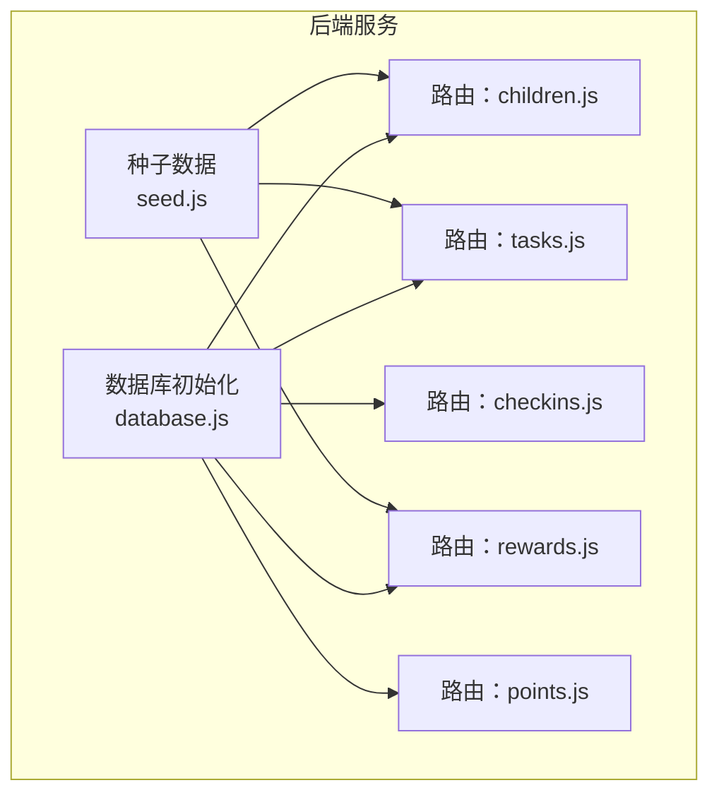
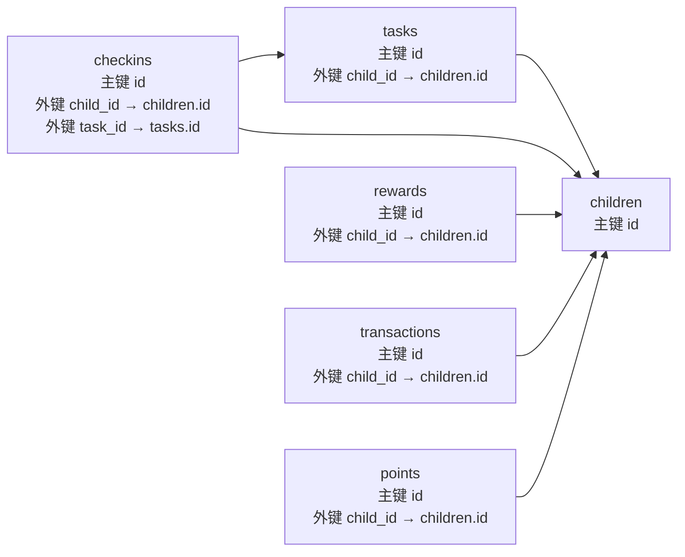
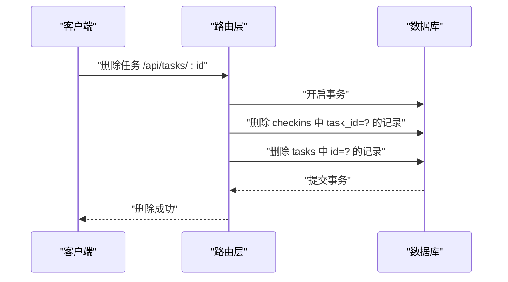
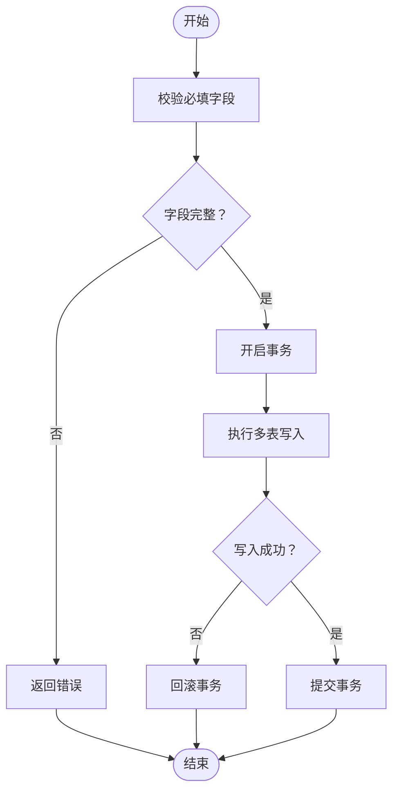
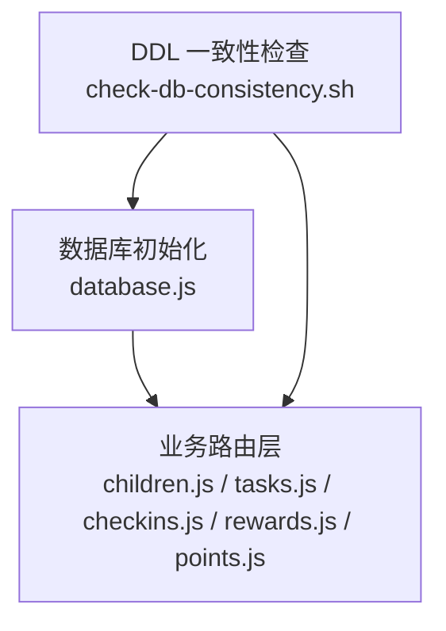

# 约束与索引

<cite>
**本文引用的文件**
- [database.js](file://star-park/server/src/database.js)
- [seed.js](file://star-park/server/src/seed.js)
- [children.js](file://star-park/server/src/routes/children.js)
- [tasks.js](file://star-park/server/src/routes/tasks.js)
- [checkins.js](file://star-park/server/src/routes/checkins.js)
- [rewards.js](file://star-park/server/src/routes/rewards.js)
- [points.js](file://star-park/server/src/routes/points.js)
- [check-db-consistency.sh](file://scripts/check-db-consistency.sh)
</cite>

## 目录
1. [简介](#简介)
2. [项目结构](#项目结构)
3. [核心组件](#核心组件)
4. [架构总览](#架构总览)
5. [详细组件分析](#详细组件分析)
6. [依赖分析](#依赖分析)
7. [性能考量](#性能考量)
8. [故障排查指南](#故障排查指南)
9. [结论](#结论)
10. [附录](#附录)

## 简介
本文件聚焦 StarParadise 系统的数据库约束与索引设计，围绕以下主题展开：
- 外键约束的定义与作用：包括 CASCADE 删除策略、NOT NULL 约束、DEFAULT 值设置
- 主键约束、唯一性约束、检查约束的应用场景
- 索引策略：主键索引、外键索引、复合索引的设计考虑
- 数据验证规则、业务规则约束、触发器与存储过程的使用现状与建议
- 性能优化建议与查询优化策略

## 项目结构
数据库层位于后端服务目录中，采用 SQLite（better-sqlite3）作为本地嵌入式数据库，建表语句集中于数据库初始化脚本，并通过迁移脚本逐步完善表结构。路由层负责业务接口与数据访问，种子数据用于快速初始化演示环境。

图表来源
- [database.js:18-80](file://star-park/server/src/database.js#L18-L80)
- [seed.js:3-42](file://star-park/server/src/seed.js#L3-L42)
- [children.js:1-96](file://star-park/server/src/routes/children.js#L1-L96)
- [tasks.js:1-91](file://star-park/server/src/routes/tasks.js#L1-L91)
- [checkins.js:1-90](file://star-park/server/src/routes/checkins.js#L1-L90)
- [rewards.js:1-167](file://star-park/server/src/routes/rewards.js#L1-L167)
- [points.js:1-74](file://star-park/server/src/routes/points.js#L1-L74)

章节来源
- [database.js:18-80](file://star-park/server/src/database.js#L18-L80)
- [seed.js:3-42](file://star-park/server/src/seed.js#L3-L42)

## 核心组件
- 数据库初始化与表结构
  - children、tasks、checkins、rewards、transactions、points 等核心表均定义了主键约束与外键约束
  - 外键引用遵循“子表指向父表”的关系，如 tasks.child_id 引用 children.id，checkins 的 child_id 与 task_id 分别引用 children.id 与 tasks.id
  - 部分子表外键使用了 CASCADE 删除策略，确保删除父记录时级联清理子记录
- 约束与默认值
  - NOT NULL 约束用于强制关键字段（如 name、title、checkin_date 等）非空
  - DEFAULT 值用于日期时间、数值与布尔字段，保证插入时无需显式提供
- 迁移与演进
  - 通过 ALTER TABLE 为现有表增加新列并设置默认值，体现数据库演进策略
- 路由层的数据访问
  - 各路由对输入参数进行基本校验，结合数据库约束保障数据一致性
  - 事务用于跨表写入，确保业务原子性（如创建打卡、兑换奖励）

章节来源
- [database.js:18-80](file://star-park/server/src/database.js#L18-L80)
- [database.js:82-108](file://star-park/server/src/database.js#L82-L108)
- [children.js:40-54](file://star-park/server/src/routes/children.js#L40-L54)
- [tasks.js:21-36](file://star-park/server/src/routes/tasks.js#L21-L36)
- [checkins.js:30-87](file://star-park/server/src/routes/checkins.js#L30-L87)
- [rewards.js:74-87](file://star-park/server/src/routes/rewards.js#L74-L87)
- [points.js:30-72](file://star-park/server/src/routes/points.js#L30-L72)

## 架构总览
下图展示数据库约束与业务流程的关系：外键约束确保参照完整性；NOT NULL 与 DEFAULT 保障数据质量；事务与路由层共同实现业务规则与原子性。

图表来源
- [database.js:18-80](file://star-park/server/src/database.js#L18-L80)

## 详细组件分析

### 外键约束与 CASCADE 删除策略
- 定义与作用
  - tasks.child_id 引用 children.id，确保任务归属有效
  - checkins.child_id 与 task_id 分别引用 children.id 与 tasks.id，确保打卡记录与任务、孩子关联有效
  - checkins 对 child_id 与 task_id 的外键均配置 CASCADE 删除策略，删除父记录时自动清理子记录，避免悬挂引用
- 业务影响
  - 删除一个孩子或任务时，相关打卡记录会被自动清理，降低数据碎片风险
  - 通过外键约束减少脏数据进入业务层，提升查询稳定性

图表来源
- [tasks.js:78-84](file://star-park/server/src/routes/tasks.js#L78-L84)
- [database.js:36-48](file://star-park/server/src/database.js#L36-L48)

章节来源
- [database.js:36-48](file://star-park/server/src/database.js#L36-L48)
- [tasks.js:78-84](file://star-park/server/src/routes/tasks.js#L78-L84)

### 主键约束与唯一性约束
- 主键约束
  - 所有核心表均定义主键（AUTOINCREMENT），确保每条记录唯一标识
- 唯一性约束
  - 当前建表语句未显式声明唯一性约束（UNIQUE）。若未来需要保证字段唯一（如 children.name 在特定范围内的唯一），可在建表阶段补充 UNIQUE 约束
- 应用场景建议
  - 若需限制某字段唯一，优先在建表阶段通过 UNIQUE 约束实现，其次在应用层做幂等校验

章节来源
- [database.js:18-80](file://star-park/server/src/database.js#L18-L80)

### 检查约束（CHECK）
- 现状
  - 当前建表语句未使用 CHECK 约束
- 建议
  - 对数值型字段（如 reward_amount、target_amount、amount）增加非负校验
  - 对布尔型字段（如 is_active、completed、is_achieved）增加取值范围校验
  - 对枚举类字段（如 type、reward_unit）增加允许值集合校验

章节来源
- [database.js:18-80](file://star-park/server/src/database.js#L18-L80)

### NOT NULL 约束与 DEFAULT 值
- NOT NULL
  - 关键字段（如 children.name、tasks.title、checkins.checkin_date 等）设置为 NOT NULL，防止空值进入业务逻辑
- DEFAULT
  - 时间戳字段（created_at）使用函数默认值，确保记录创建时间自动填充
  - 数值字段（如 reward_amount、current_amount、points_balance）设置合理默认值，避免空值参与计算
- 业务意义
  - 提升查询稳定性与报表准确性，减少空值处理分支

章节来源
- [database.js:18-80](file://star-park/server/src/database.js#L18-L80)
- [children.js:40-54](file://star-park/server/src/routes/children.js#L40-L54)
- [tasks.js:21-36](file://star-park/server/src/routes/tasks.js#L21-L36)
- [checkins.js:30-87](file://star-park/server/src/routes/checkins.js#L30-L87)
- [rewards.js:21-38](file://star-park/server/src/routes/rewards.js#L21-L38)
- [points.js:30-72](file://star-park/server/src/routes/points.js#L30-L72)

### 索引策略
- 主键索引
  - 所有表的主键（PRIMARY KEY）自动建立索引，用于加速主键查找与连接
- 外键索引
  - 外键字段（如 tasks.child_id、checkins.child_id、checkins.task_id、rewards.child_id、transactions.child_id、points.child_id）未显式创建索引
  - 建议对外键字段创建索引，以提升 JOIN 与删除效率
- 复合索引
  - 高频查询条件组合（如 checkins.child_id + checkin_date、rewards.child_id + is_achieved）可考虑复合索引
- 现状与建议
  - 当前未显式创建索引，SQLite 会在必要时进行全表扫描
  - 随着数据量增长，建议根据查询模式创建索引，平衡写入性能与读取性能

章节来源
- [database.js:18-80](file://star-park/server/src/database.js#L18-L80)
- [checkins.js:6-28](file://star-park/server/src/routes/checkins.js#L6-L28)
- [rewards.js:5-19](file://star-park/server/src/routes/rewards.js#L5-L19)

### 数据验证规则与业务规则约束
- 输入参数校验
  - 路由层对必填字段进行校验（如 children.name、tasks.child_id+title、checkins.child_id+task_id+date），并在缺失时返回错误
- 业务规则
  - 兑换奖励前检查达成状态与重复兑换标记
  - 积分与金钱余额校验，防止透支
- 事务保障
  - 创建打卡、手动加积分、兑换奖励均使用事务，确保多表写入原子性

图表来源
- [children.js:40-54](file://star-park/server/src/routes/children.js#L40-L54)
- [tasks.js:21-36](file://star-park/server/src/routes/tasks.js#L21-L36)
- [checkins.js:30-87](file://star-park/server/src/routes/checkins.js#L30-L87)
- [rewards.js:89-164](file://star-park/server/src/routes/rewards.js#L89-L164)
- [points.js:30-72](file://star-park/server/src/routes/points.js#L30-L72)

章节来源
- [children.js:40-54](file://star-park/server/src/routes/children.js#L40-L54)
- [tasks.js:21-36](file://star-park/server/src/routes/tasks.js#L21-L36)
- [checkins.js:30-87](file://star-park/server/src/routes/checkins.js#L30-L87)
- [rewards.js:89-164](file://star-park/server/src/routes/rewards.js#L89-L164)
- [points.js:30-72](file://star-park/server/src/routes/points.js#L30-L72)

### 触发器与存储过程
- 现状
  - 未使用触发器与存储过程
- 建议
  - 可用触发器实现自动审计日志、自动更新派生字段（如累计余额）
  - 可用存储过程封装复杂业务流程（如批量结算、统计报表生成），提升可维护性

章节来源
- [database.js:18-80](file://star-park/server/src/database.js#L18-L80)

## 依赖分析
- 组件耦合
  - 路由层依赖数据库模块，通过预编译 SQL 与事务实现业务逻辑
  - 外键关系决定查询路径与删除行为，影响路由层的删除顺序与事务边界
- 外部依赖
  - better-sqlite3 提供 SQLite 访问能力，WAL 模式与外键开关在初始化阶段启用
- 一致性检查
  - DDL 一致性脚本用于验证核心表与关键字段的存在性，保障部署一致性

图表来源
- [database.js:13-15](file://star-park/server/src/database.js#L13-L15)
- [check-db-consistency.sh:21-42](file://scripts/check-db-consistency.sh#L21-L42)
- [children.js:1-96](file://star-park/server/src/routes/children.js#L1-L96)
- [tasks.js:1-91](file://star-park/server/src/routes/tasks.js#L1-L91)
- [checkins.js:1-90](file://star-park/server/src/routes/checkins.js#L1-L90)
- [rewards.js:1-167](file://star-park/server/src/routes/rewards.js#L1-L167)
- [points.js:1-74](file://star-park/server/src/routes/points.js#L1-L74)

章节来源
- [database.js:13-15](file://star-park/server/src/database.js#L13-L15)
- [check-db-consistency.sh:21-42](file://scripts/check-db-consistency.sh#L21-L42)

## 性能考量
- WAL 模式
  - 初始化时启用 WAL 模式，提升并发读写性能
- 索引优化
  - 建议对外键字段与高频过滤/排序字段创建索引，减少全表扫描
  - 针对复合查询条件（如按 child_id 与日期过滤）创建复合索引
- 写入优化
  - 使用事务批量写入，减少提交次数
  - 控制单次事务大小，避免长时间锁持有
- 查询优化
  - 尽量使用带索引的 WHERE 条件与 JOIN 条件
  - 避免 SELECT *，仅选择必要字段
  - 对聚合查询使用 LIMIT 与分页

章节来源
- [database.js:13-15](file://star-park/server/src/database.js#L13-L15)
- [checkins.js:6-28](file://star-park/server/src/routes/checkins.js#L6-L28)
- [rewards.js:5-19](file://star-park/server/src/routes/rewards.js#L5-L19)

## 故障排查指南
- 常见错误类型
  - 外键约束失败：尝试插入或更新时引用不存在的父记录
  - NOT NULL 约束失败：缺少必填字段
  - 余额不足：兑换奖励或积分扣减时余额不足
- 排查步骤
  - 检查核心表与字段是否存在（使用一致性检查脚本）
  - 核对路由层参数校验与业务规则
  - 查看事务边界与提交状态
- 工具与脚本
  - DDL 一致性检查脚本用于验证表结构
  - 日志输出包含错误信息，便于定位问题

章节来源
- [check-db-consistency.sh:15-42](file://scripts/check-db-consistency.sh#L15-L42)
- [rewards.js:158-163](file://star-park/server/src/routes/rewards.js#L158-L163)
- [points.js:38-41](file://star-park/server/src/routes/points.js#L38-L41)

## 结论
- StarParadise 的数据库层通过外键约束、NOT NULL 与 DEFAULT 设计，构建了清晰的参照完整性与数据质量保障
- CASCADE 删除策略简化了父子数据的生命周期管理
- 当前未显式创建索引，建议依据查询模式逐步引入索引以提升性能
- 事务与路由层的参数校验共同实现了业务规则与原子性
- 未来可在建表阶段补充 CHECK 约束与 UNIQUE 约束，并考虑引入触发器与存储过程以增强自动化与可维护性

## 附录
- 数据库初始化与迁移
  - 初始化建表与外键约束
  - 迁移新增字段与默认值
- 种子数据
  - 初始化演示数据，验证核心流程

章节来源
- [database.js:18-80](file://star-park/server/src/database.js#L18-L80)
- [database.js:82-108](file://star-park/server/src/database.js#L82-L108)
- [seed.js:3-42](file://star-park/server/src/seed.js#L3-L42)