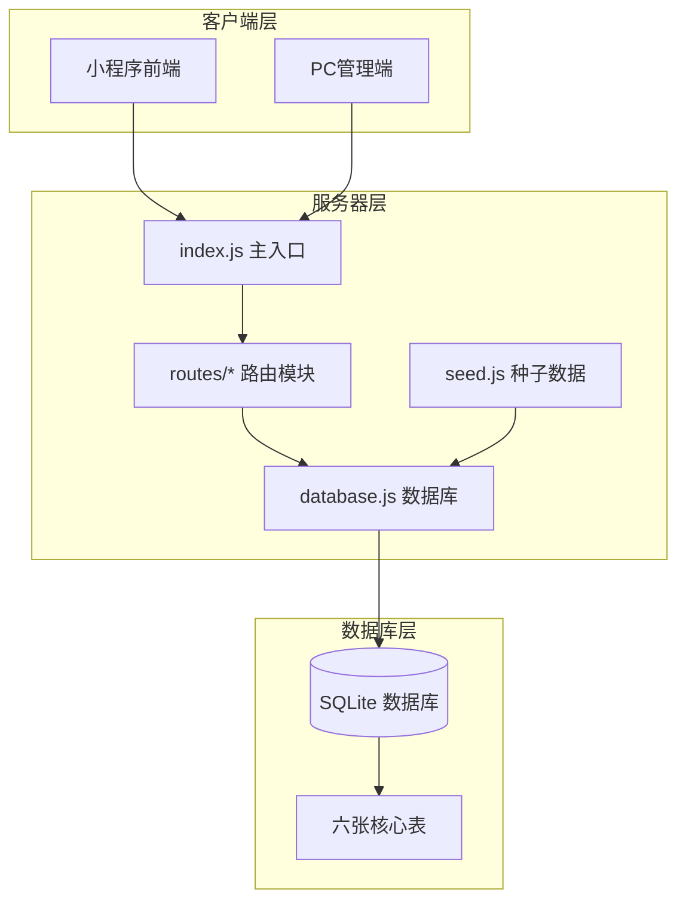
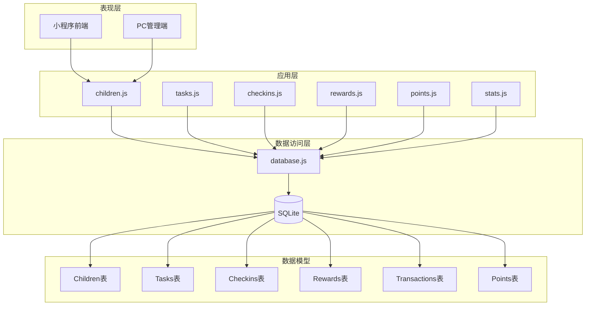
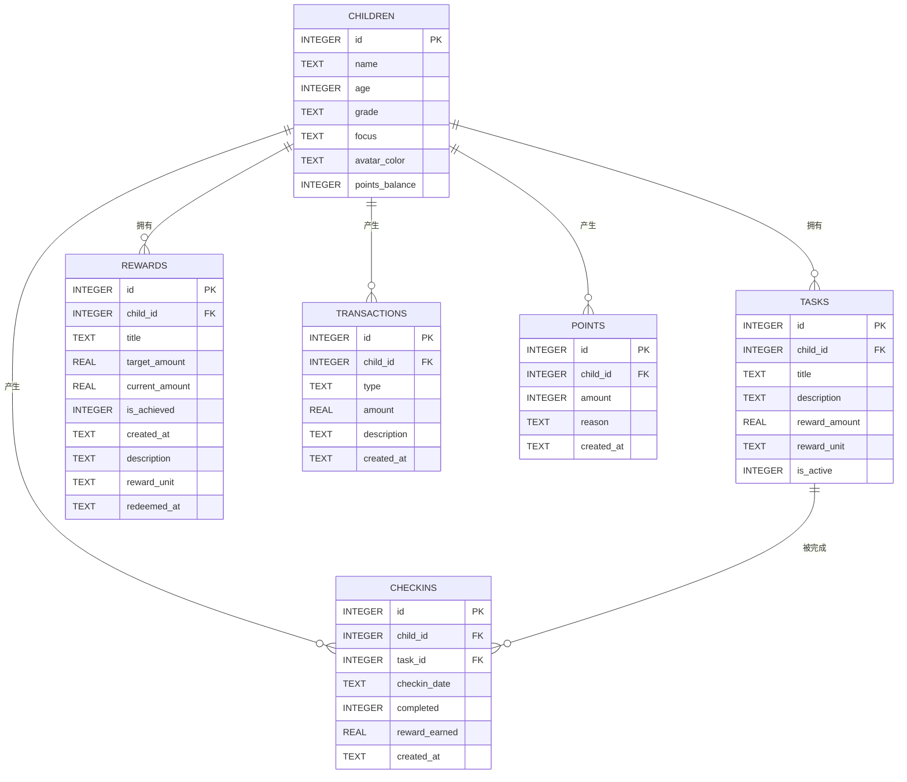
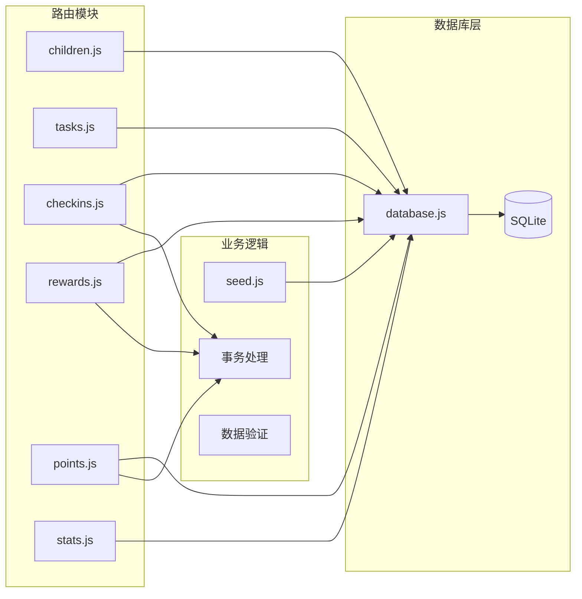
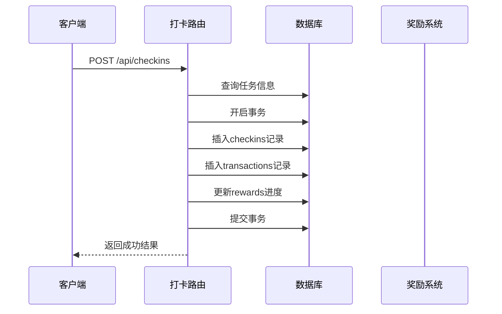
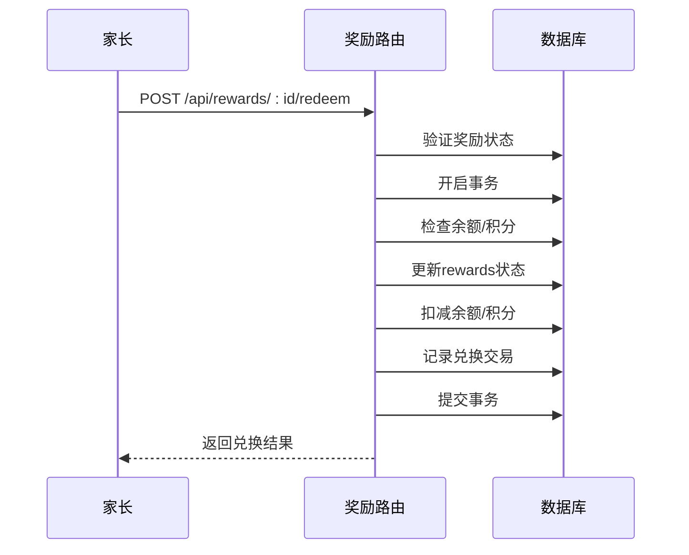

# 表关系设计

<cite>
**本文档引用的文件**
- [database.js](file://star-park/server/src/database.js)
- [seed.js](file://star-park/server/src/seed.js)
- [checkins.js](file://star-park/server/src/routes/checkins.js)
- [tasks.js](file://star-park/server/src/routes/tasks.js)
- [rewards.js](file://star-park/server/src/routes/rewards.js)
- [points.js](file://star-park/server/src/routes/points.js)
- [children.js](file://star-park/server/src/routes/children.js)
- [stats.js](file://star-park/server/src/routes/stats.js)
- [index.js](file://star-park/server/src/index.js)
</cite>

## 目录
1. [简介](#简介)
2. [项目结构](#项目结构)
3. [核心组件](#核心组件)
4. [架构概览](#架构概览)
5. [详细组件分析](#详细组件分析)
6. [依赖分析](#依赖分析)
7. [性能考虑](#性能考虑)
8. [故障排除指南](#故障排除指南)
9. [结论](#结论)

## 简介

StarParadise是一个基于SQLite的儿童行为管理与奖励系统。本设计文档专注于系统六张核心表之间的关系映射，包括Children与Tasks的一对多关系、Children与Checkins的一对多关系、Tasks与Checkins的多对一关系、Children与Rewards的一对多关系、Children与Transactions的一对多关系，以及Children与Points的一对多关系。文档详细解释了外键约束的设计原则、级联删除策略和数据完整性保障机制，并提供了ER图和关系图来说明表间依赖关系和引用完整性。

## 项目结构

系统采用Express.js作为后端框架，使用better-sqlite3作为数据库驱动。项目结构清晰地分离了数据库初始化、路由处理和业务逻辑：

**图表来源**
- [index.js:1-42](file://star-park/server/src/index.js#L1-L42)
- [database.js:1-111](file://star-park/server/src/database.js#L1-L111)

**章节来源**
- [index.js:1-42](file://star-park/server/src/index.js#L1-L42)
- [database.js:1-111](file://star-park/server/src/database.js#L1-L111)

## 核心组件

系统包含六张核心表，每张表都有明确的职责和约束：

### 表结构概览

| 表名 | 主键 | 外键 | 约束 | 用途 |
|------|------|------|------|------|
| children | id | 无 | 自增主键 | 孩子基本信息存储 |
| tasks | id | child_id → children.id | 必须引用有效孩子 | 任务定义与奖励设置 |
| checkins | id | child_id → children.id task_id → tasks.id | 级联删除 | 打卡记录与奖励计算 |
| rewards | id | child_id → children.id | 无级联删除 | 奖励目标与进度跟踪 |
| transactions | id | child_id → children.id | 无级联删除 | 金钱交易记录 |
| points | id | child_id → children.id | 无级联删除 | 积分记录与余额管理 |

**章节来源**
- [database.js:18-80](file://star-park/server/src/database.js#L18-L80)

## 架构概览

系统采用三层架构设计，确保数据一致性和业务逻辑的清晰分离：

**图表来源**
- [index.js:6-27](file://star-park/server/src/index.js#L6-L27)
- [database.js:18-80](file://star-park/server/src/database.js#L18-L80)

## 详细组件分析

### 外键约束与级联策略

系统在外键约束设计上采用了不同的策略来满足不同业务场景的需求：

#### Children表（父表）
- **主键**: id (INTEGER PRIMARY KEY AUTOINCREMENT)
- **约束**: 无外键依赖
- **特点**: 作为其他表的父表，不接受任何外键约束

#### Tasks表（子表）
- **外键**: child_id → children(id)
- **约束**: ON DELETE NO ACTION (默认行为)
- **业务意义**: 当删除孩子时，其任务不会自动删除，需要手动处理

#### Checkins表（子表）
- **复合外键**: child_id → children(id) ON DELETE CASCADE
- **复合外键**: task_id → tasks(id) ON DELETE CASCADE  
- **约束**: 级联删除策略
- **业务意义**: 删除孩子或任务时，相关的打卡记录会自动清理

#### Rewards表（子表）
- **外键**: child_id → children(id)
- **约束**: ON DELETE NO ACTION
- **业务意义**: 奖励目标独立于孩子存在，便于历史记录保留

#### Transactions表（子表）
- **外键**: child_id → children(id)
- **约束**: ON DELETE NO ACTION
- **业务意义**: 交易记录作为审计日志保留

#### Points表（子表）
- **外键**: child_id → children(id)
- **约束**: ON DELETE NO ACTION
- **业务意义**: 积分记录独立管理

**章节来源**
- [database.js:36](file://star-park/server/src/database.js#L36)
- [database.js:47-48](file://star-park/server/src/database.js#L47-L48)
- [database.js:59](file://star-park/server/src/database.js#L59)
- [database.js:69](file://star-park/server/src/database.js#L69)
- [database.js:78](file://star-park/server/src/database.js#L78)

### ER关系图

**图表来源**
- [database.js:18-80](file://star-park/server/src/database.js#L18-L80)

### 关系映射详解

#### 1. Children ↔ Tasks：一对多关系
- **关系类型**: 一个孩子可以拥有多个任务
- **外键位置**: Tasks表中的child_id字段
- **约束特性**: NO ACTION级联（删除孩子时不自动删除任务）
- **业务影响**: 需要手动处理删除逻辑，避免数据丢失

#### 2. Children ↔ Checkins：一对多关系
- **关系类型**: 一个孩子可以有多次打卡记录
- **外键位置**: Checkins表中的child_id字段
- **约束特性**: CASCADE级联删除
- **业务影响**: 删除孩子时，所有相关打卡记录自动清理

#### 3. Tasks ↔ Checkins：多对一关系
- **关系类型**: 多个打卡记录对应同一个任务
- **外键位置**: Checkins表中的task_id字段
- **约束特性**: CASCADE级联删除
- **业务影响**: 删除任务时，所有相关打卡记录自动清理

#### 4. Children ↔ Rewards：一对多关系
- **关系类型**: 一个孩子可以有多个奖励目标
- **外键位置**: Rewards表中的child_id字段
- **约束特性**: NO ACTION级联
- **业务影响**: 奖励目标独立存在，便于历史追踪

#### 5. Children ↔ Transactions：一对多关系
- **关系类型**: 一个孩子可以有多笔交易记录
- **外键位置**: Transactions表中的child_id字段
- **约束特性**: NO ACTION级联
- **业务影响**: 交易记录作为审计日志保留

#### 6. Children ↔ Points：一对多关系
- **关系类型**: 一个孩子可以有多条积分记录
- **外键位置**: Points表中的child_id字段
- **约束特性**: NO ACTION级联
- **业务影响**: 积分记录独立管理，便于余额计算

**章节来源**
- [database.js:28-79](file://star-park/server/src/database.js#L28-L79)

### 数据完整性保障机制

系统通过多种机制确保数据完整性：

#### 1. 外键约束验证
- 所有外键引用都经过严格验证
- 防止孤儿记录的产生
- 维护参照完整性

#### 2. 级联删除策略
- **CASCADE**: 用于Checkins表，确保删除孩子或任务时清理相关记录
- **NO ACTION**: 用于其他表，防止意外的数据删除

#### 3. 事务处理
- 关键业务操作使用数据库事务
- 确保操作的原子性、一致性、隔离性和持久性

#### 4. 数据迁移机制
- 支持动态添加新列
- 保持向后兼容性

**章节来源**
- [database.js:82-108](file://star-park/server/src/database.js#L82-L108)

## 依赖分析

### 路由依赖关系

**图表来源**
- [index.js:6-27](file://star-park/server/src/index.js#L6-L27)
- [database.js:18-80](file://star-park/server/src/database.js#L18-L80)

### 业务流程依赖

#### 打卡奖励流程

**图表来源**
- [checkins.js:31-87](file://star-park/server/src/routes/checkins.js#L31-L87)

#### 奖励兑换流程

**图表来源**
- [rewards.js:89-164](file://star-park/server/src/routes/rewards.js#L89-L164)

**章节来源**
- [checkins.js:31-87](file://star-park/server/src/routes/checkins.js#L31-L87)
- [rewards.js:89-164](file://star-park/server/src/routes/rewards.js#L89-L164)

## 性能考虑

### 数据库优化策略

1. **WAL模式启用**
   - 提升并发读取性能
   - 减少锁竞争

2. **索引策略**
   - 在常用查询字段上建立索引
   - 优化查询性能

3. **事务批量处理**
   - 将相关操作合并到单个事务中
   - 减少数据库往返次数

4. **连接池管理**
   - 合理配置连接数量
   - 避免连接泄漏

### 缓存策略

1. **内存缓存**
   - 缓存热点数据
   - 减少数据库查询

2. **查询结果缓存**
   - 缓存复杂查询结果
   - 提高响应速度

## 故障排除指南

### 常见问题及解决方案

#### 1. 外键约束错误
**症状**: 插入或更新数据时报外键约束错误
**原因**: 引用的父表记录不存在
**解决**: 确保先创建父表记录，再创建子表记录

#### 2. 级联删除异常
**症状**: 删除操作影响范围超出预期
**原因**: CASCADE级联删除策略
**解决**: 在删除前确认数据依赖关系

#### 3. 事务回滚
**症状**: 部分操作失败但部分成功
**原因**: 事务未正确提交
**解决**: 确保所有操作都在同一事务中执行

#### 4. 数据不一致
**症状**: 不同查询结果不一致
**原因**: 并发访问导致的数据竞争
**解决**: 使用适当的锁定策略

**章节来源**
- [checkins.js:48-76](file://star-park/server/src/routes/checkins.js#L48-L76)
- [rewards.js:107-154](file://star-park/server/src/routes/rewards.js#L107-L154)

## 结论

StarParadise系统的表关系设计体现了良好的数据库规范化原则和业务需求平衡。通过精心设计的外键约束和级联策略，系统在保证数据完整性的同时，提供了灵活的业务处理能力。

关键设计要点：
- **明确的关系映射**: 清晰表达了一对多和多对一关系
- **合理的级联策略**: 根据业务需求选择合适的删除策略
- **事务安全保障**: 关键操作使用事务确保数据一致性
- **扩展性设计**: 支持动态数据迁移和功能扩展

这套设计为系统的稳定运行和未来发展奠定了坚实基础，能够有效支撑儿童行为管理与奖励系统的各项功能需求。