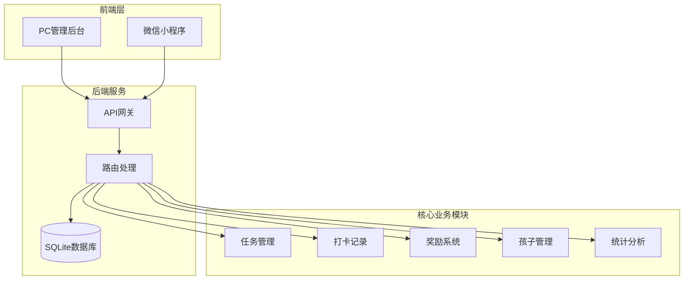
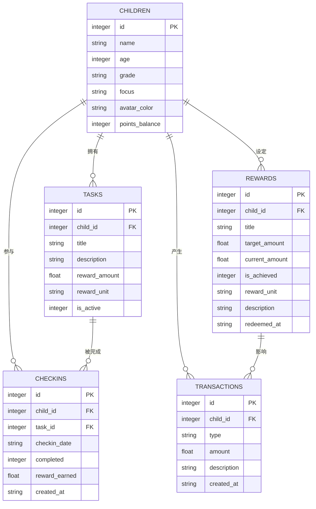
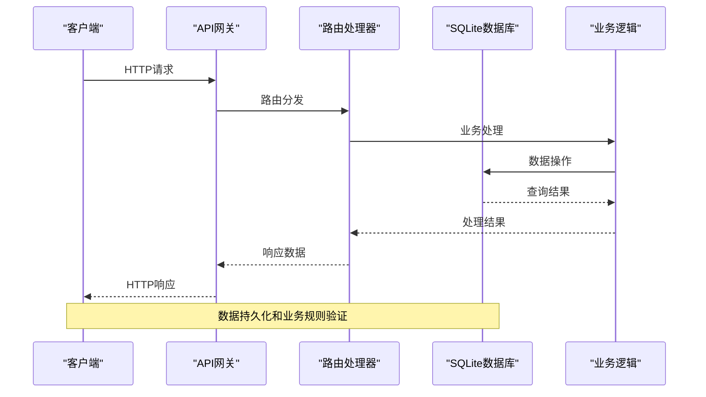
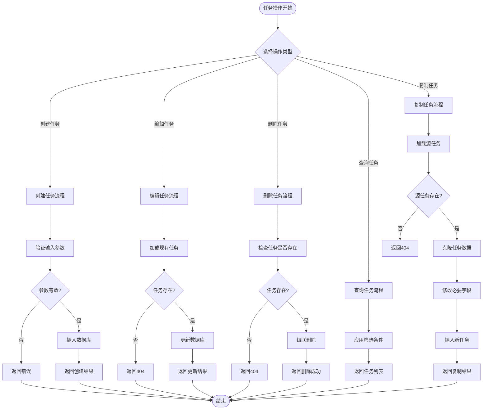
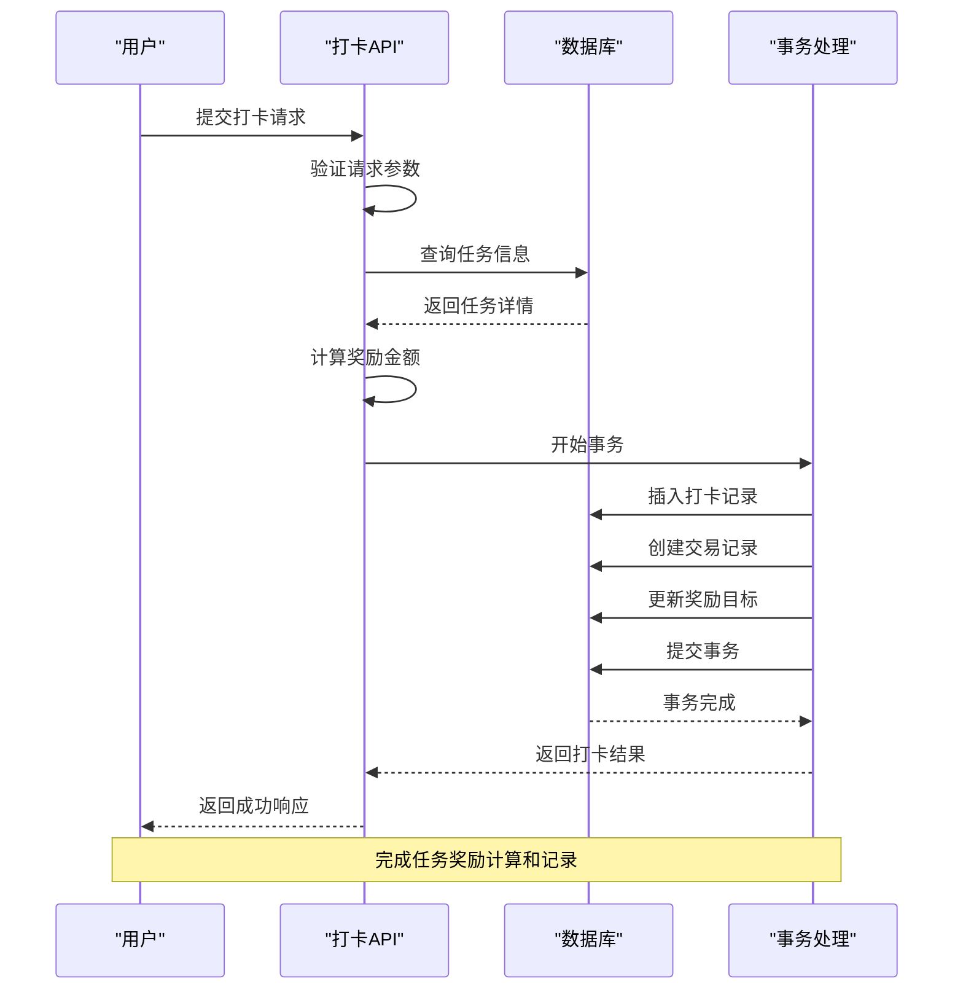
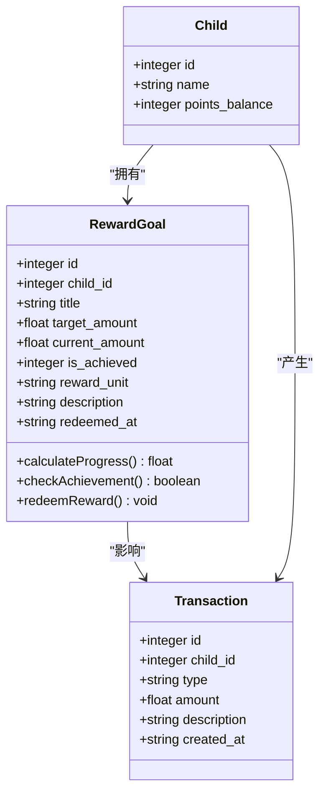
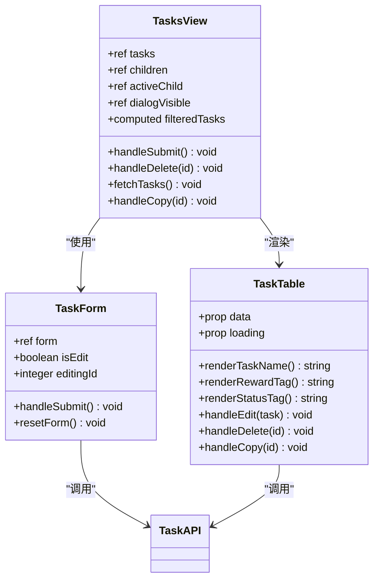
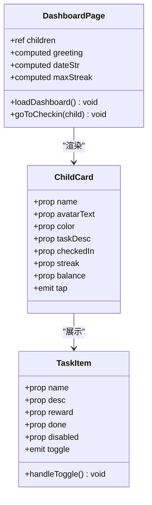
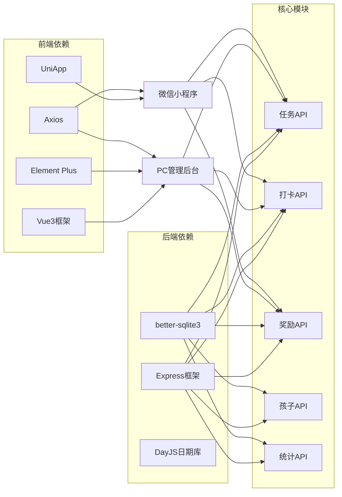

# 任务管理系统

<cite>
**本文档引用的文件**
- [tasks.js](file://star-park/server/src/routes/tasks.js)
- [database.js](file://star-park/server/src/database.js)
- [checkins.js](file://star-park/server/src/routes/checkins.js)
- [rewards.js](file://star-park/server/src/routes/rewards.js)
- [children.js](file://star-park/server/src/routes/children.js)
- [stats.js](file://star-park/server/src/routes/stats.js)
- [index.js](file://star-park/pc-admin/src/api/index.js)
- [index.js](file://star-park/miniprogram/src/api/index.js)
- [Tasks.vue](file://star-park/pc-admin/src/views/Tasks.vue)
- [TaskItem.vue](file://star-park/miniprogram/src/components/TaskItem.vue)
- [ChildCard.vue](file://star-park/miniprogram/src/components/ChildCard.vue)
- [index.vue](file://star-park/miniprogram/src/pages/index/index.vue)
- [api.md](file://docs/api.md)
</cite>

## 更新摘要
**所做更改**
- 新增任务复制功能，支持快速创建相似任务
- 扩展API端点以支持目标管理功能
- 增强任务管理的用户体验和效率

## 目录
1. [简介](#简介)
2. [项目结构](#项目结构)
3. [核心组件](#核心组件)
4. [架构概览](#架构概览)
5. [详细组件分析](#详细组件分析)
6. [依赖关系分析](#依赖关系分析)
7. [性能考虑](#性能考虑)
8. [故障排除指南](#故障排除指南)
9. [结论](#结论)
10. [附录](#附录)

## 简介

星星乐园任务管理系统是一个基于家庭场景设计的任务管理与奖励系统。该系统通过任务创建、打卡完成、奖励计算等功能，帮助家长培养孩子的良好习惯，建立正向激励机制。

系统采用前后端分离架构，后端使用Node.js + Express + SQLite，前端提供PC管理后台和微信小程序两个客户端。核心功能包括任务生命周期管理、打卡记录追踪、奖励目标设定与兑换、以及完整的统计分析功能。

**最新更新**：系统新增了任务复制功能，允许用户快速创建与现有任务相似的副本，大大提高了任务管理的效率和便捷性。

## 项目结构

整个项目采用模块化组织方式，主要分为以下层次：



**图表来源**
- [tasks.js:1-91](file://star-park/server/src/routes/tasks.js#L1-L91)
- [database.js:1-111](file://star-park/server/src/database.js#L1-L111)

**章节来源**
- [tasks.js:1-91](file://star-park/server/src/routes/tasks.js#L1-L91)
- [database.js:1-111](file://star-park/server/src/database.js#L1-L111)

## 核心组件

系统的核心组件围绕五个主要业务模块构建：

### 数据模型关系



**图表来源**
- [database.js:18-80](file://star-park/server/src/database.js#L18-L80)

### 任务管理核心功能

系统提供完整的任务生命周期管理：
- **创建任务**：支持设置任务标题、描述、奖励金额和单位
- **编辑任务**：动态调整任务属性和状态
- **删除任务**：级联删除相关打卡记录
- **查询任务**：支持按孩子筛选和全量查询
- **复制任务**：快速创建与现有任务相似的副本

**最新更新**：新增的任务复制功能允许用户基于现有任务快速创建新任务，保留原任务的配置信息，只需修改必要的字段即可。

**章节来源**
- [tasks.js:5-36](file://star-park/server/src/routes/tasks.js#L5-L36)
- [database.js:28-37](file://star-park/server/src/database.js#L28-L37)

## 架构概览

系统采用RESTful API设计，前后端通过HTTP协议通信。整体架构遵循分层设计原则：



**图表来源**
- [tasks.js:21-36](file://star-park/server/src/routes/tasks.js#L21-L36)
- [checkins.js:30-87](file://star-park/server/src/routes/checkins.js#L30-L87)

**章节来源**
- [tasks.js:1-91](file://star-park/server/src/routes/tasks.js#L1-L91)
- [checkins.js:1-90](file://star-park/server/src/routes/checkins.js#L1-L90)

## 详细组件分析

### 任务管理组件

#### 任务数据模型

任务系统的核心数据结构包括以下关键字段：

| 字段名 | 类型 | 必填 | 默认值 | 说明 |
|--------|------|------|--------|------|
| id | integer | 否 | 自增 | 主键标识符 |
| child_id | integer | 是 | - | 关联孩子ID |
| title | string | 是 | - | 任务标题 |
| description | string | 否 | null | 任务描述 |
| reward_amount | float | 否 | 1.0 | 奖励金额 |
| reward_unit | string | 否 | "元" | 奖励单位 |
| is_active | integer | 否 | 1 | 任务状态(1启用,0停用) |

#### 任务操作流程



**最新更新**：新增的复制任务流程允许用户快速创建与现有任务相似的副本，提高任务管理效率。

**图表来源**
- [tasks.js:21-88](file://star-park/server/src/routes/tasks.js#L21-L88)

#### 任务状态管理

任务状态采用布尔标志位表示：
- **启用状态** (`is_active = 1`)：任务对用户可见并可被打卡完成
- **停用状态** (`is_active = 0`)：任务不可见且不参与统计

状态切换通过编辑接口实现，支持实时更新任务可用性。

**章节来源**
- [tasks.js:38-68](file://star-park/server/src/routes/tasks.js#L38-L68)
- [database.js:35-35](file://star-park/server/src/database.js#L35-L35)

### 打卡记录组件

#### 打卡流程

打卡系统实现了完整的任务完成追踪机制：



**图表来源**
- [checkins.js:30-87](file://star-park/server/src/routes/checkins.js#L30-87)

#### 奖励计算机制

系统支持多种奖励计算方式：

1. **固定奖励**：每次完成任务获得固定金额
2. **累积奖励**：根据完成次数累计奖励
3. **里程碑奖励**：达到特定条件触发额外奖励

奖励计算在打卡时自动完成，确保实时反映孩子的成就。

**章节来源**
- [checkins.js:30-87](file://star-park/server/src/routes/checkins.js#L30-87)

### 奖励目标组件

#### 奖励目标管理

奖励目标系统允许家长为孩子设定储蓄目标：



**图表来源**
- [rewards.js:21-87](file://star-park/server/src/routes/rewards.js#L21-87)

#### 奖励类型配置

系统支持两种奖励类型：

1. **金钱奖励** (`reward_unit = "元"`)
   - 从交易账户中扣除
   - 支持余额不足检查
   - 自动记录消费明细

2. **积分奖励** (`reward_unit = "星星"`)
   - 从积分账户中扣除
   - 实时积分余额更新
   - 生成积分消费记录

**章节来源**
- [rewards.js:89-164](file://star-park/server/src/routes/rewards.js#L89-164)

### 前端组件分析

#### PC管理后台任务界面

PC管理后台提供了完整的任务管理界面：



**最新更新**：任务表格和视图组件已更新以支持复制功能，用户可以右键点击任务或点击复制按钮来创建任务副本。

**图表来源**
- [Tasks.vue:1-265](file://star-park/pc-admin/src/views/Tasks.vue#L1-265)

#### 小程序任务组件

小程序端提供了简洁的任务展示组件：



**图表来源**
- [TaskItem.vue:1-133](file://star-park/miniprogram/src/components/TaskItem.vue#L1-133)
- [ChildCard.vue:1-162](file://star-park/miniprogram/src/components/ChildCard.vue#L1-162)
- [index.vue:1-194](file://star-park/miniprogram/src/pages/index/index.vue#L1-194)

**章节来源**
- [Tasks.vue:1-265](file://star-park/pc-admin/src/views/Tasks.vue#L1-265)
- [TaskItem.vue:1-133](file://star-park/miniprogram/src/components/TaskItem.vue#L1-133)
- [ChildCard.vue:1-162](file://star-park/miniprogram/src/components/ChildCard.vue#L1-162)
- [index.vue:1-194](file://star-park/miniprogram/src/pages/index/index.vue#L1-194)

## 依赖关系分析

系统采用模块化设计，各组件间依赖关系清晰：



**图表来源**
- [tasks.js:1-3](file://star-park/server/src/routes/tasks.js#L1-3)
- [checkins.js:1-4](file://star-park/server/src/routes/checkins.js#L1-4)
- [rewards.js:1-3](file://star-park/server/src/routes/rewards.js#L1-3)

**章节来源**
- [tasks.js:1-91](file://star-park/server/src/routes/tasks.js#L1-91)
- [checkins.js:1-90](file://star-park/server/src/routes/checkins.js#L1-90)
- [rewards.js:1-167](file://star-park/server/src/routes/rewards.js#L1-167)

## 性能考虑

系统在设计时充分考虑了性能优化：

### 数据库优化
- **WAL模式**：启用写前日志模式提升并发性能
- **外键约束**：确保数据一致性的同时保持查询效率
- **索引策略**：在常用查询字段上建立索引

### 缓存策略
- **内存缓存**：热点数据缓存减少数据库访问
- **响应缓存**：静态数据响应缓存降低服务器压力

### API优化
- **批量操作**：支持批量查询和更新操作
- **分页查询**：大数据集分页避免内存溢出
- **条件筛选**：精确的查询条件减少数据传输

## 故障排除指南

### 常见问题及解决方案

#### 任务相关问题
- **任务创建失败**：检查必填字段完整性，确认孩子ID有效性
- **任务更新异常**：验证任务存在性，检查权限限制
- **任务删除错误**：确认级联删除逻辑，检查依赖关系
- **任务复制失败**：检查源任务存在性，验证复制权限

#### 打卡相关问题
- **打卡记录异常**：检查日期格式，验证任务状态
- **奖励计算错误**：核对奖励金额配置，检查交易记录
- **重复打卡问题**：验证日期唯一性约束

#### 奖励相关问题
- **兑换失败**：检查奖励状态和余额充足性
- **进度计算错误**：验证累积逻辑和边界条件
- **单位转换问题**：确认奖励单位配置正确

**最新更新**：新增的任务复制功能故障排除指南，确保用户能够顺利使用复制功能。

**章节来源**
- [tasks.js:16-18](file://star-park/server/src/routes/tasks.js#L16-18)
- [checkins.js:34-44](file://star-park/server/src/routes/checkins.js#L34-44)
- [rewards.js:97-102](file://star-park/server/src/routes/rewards.js#L97-102)

## 结论

星星乐园任务管理系统通过精心设计的架构和完善的业务逻辑，为家庭场景提供了完整的任务管理解决方案。系统具备以下优势：

1. **功能完整**：涵盖任务管理、打卡追踪、奖励系统、统计分析等核心功能
2. **用户体验**：提供PC管理和小程序双端体验，满足不同使用场景
3. **扩展性强**：模块化设计便于功能扩展和维护
4. **数据安全**：完善的错误处理和数据验证机制
5. **操作便捷**：新增的任务复制功能大幅提升了任务管理效率

系统通过合理的数据模型设计和业务流程控制，有效支撑了家庭教育场景中的习惯养成和激励机制建设。

## 附录

### API接口文档

系统提供完整的RESTful API接口，支持标准的CRUD操作和业务特定功能。

#### 任务管理接口
- `GET /api/tasks` - 获取任务列表
- `POST /api/tasks` - 创建任务
- `PUT /api/tasks/:id` - 更新任务
- `DELETE /api/tasks/:id` - 删除任务
- `POST /api/tasks/:id/copy` - 复制任务（新增）

#### 打卡记录接口
- `GET /api/checkins` - 获取打卡记录
- `POST /api/checkins` - 创建打卡记录

#### 奖励目标接口
- `GET /api/rewards` - 获取奖励目标
- `POST /api/rewards` - 创建奖励目标
- `PUT /api/rewards/:id` - 更新奖励目标
- `DELETE /api/rewards/:id` - 删除奖励目标
- `POST /api/rewards/:id/redeem` - 兑换奖励

**最新更新**：新增的任务复制API接口，允许用户通过API快速创建任务副本。

**章节来源**
- [api.md:84-176](file://docs/api.md#L84-176)

### 前端组件使用示例

#### PC管理后台集成
```javascript
// 任务管理页面集成
import { getTasks, createTask, updateTask, deleteTask, copyTask } from '@/api'

// 获取任务列表
const tasks = await getTasks()

// 创建新任务
const newTask = await createTask({
  child_id: 1,
  title: '英语练习',
  description: '每天练习20分钟',
  reward_amount: 2.0,
  reward_unit: '元'
})

// 复制现有任务
const copiedTask = await copyTask(existingTaskId)

// 更新任务状态
await updateTask(taskId, { is_active: 0 })
```

#### 小程序组件使用
```vue
<!-- 任务项组件使用 -->
<TaskItem 
  :name="task.title"
  :desc="task.description"
  :reward="`${task.reward_amount}${task.reward_unit}`"
  :done="task.completed"
  @toggle="handleTaskToggle"
/>
```

**最新更新**：添加了任务复制功能的API调用示例，展示了如何在PC管理后台中使用复制功能。