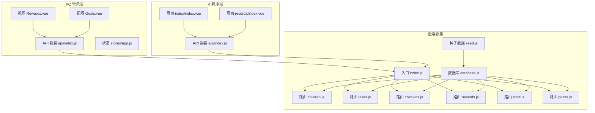
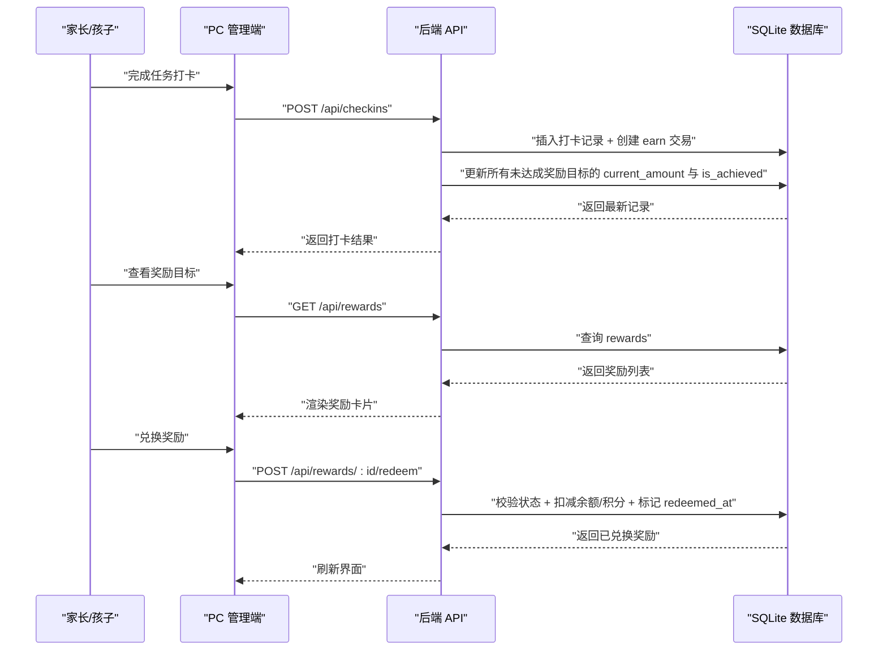
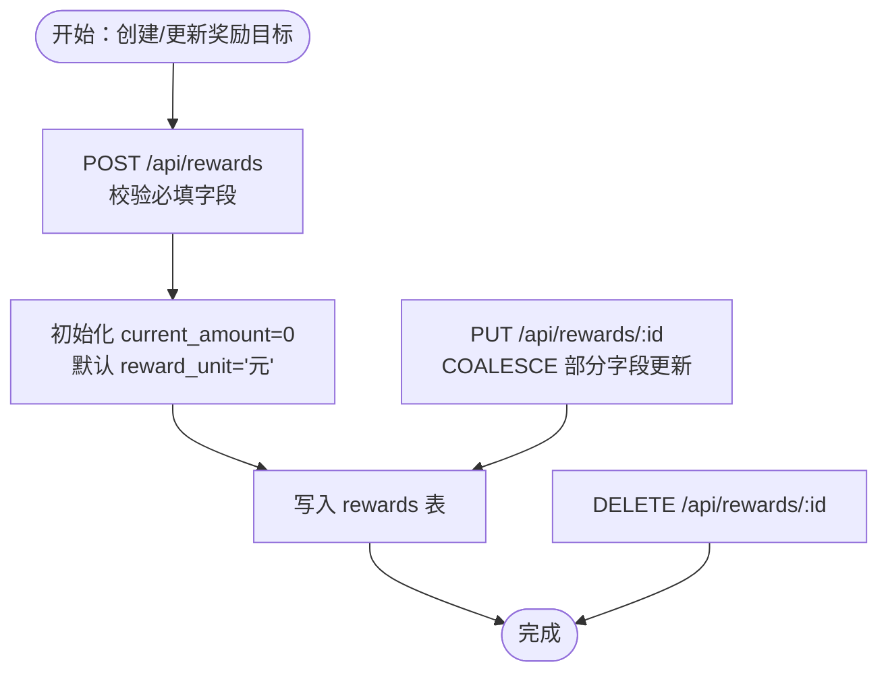
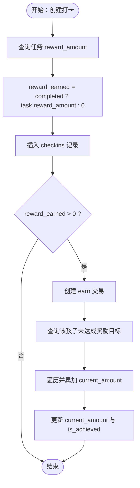
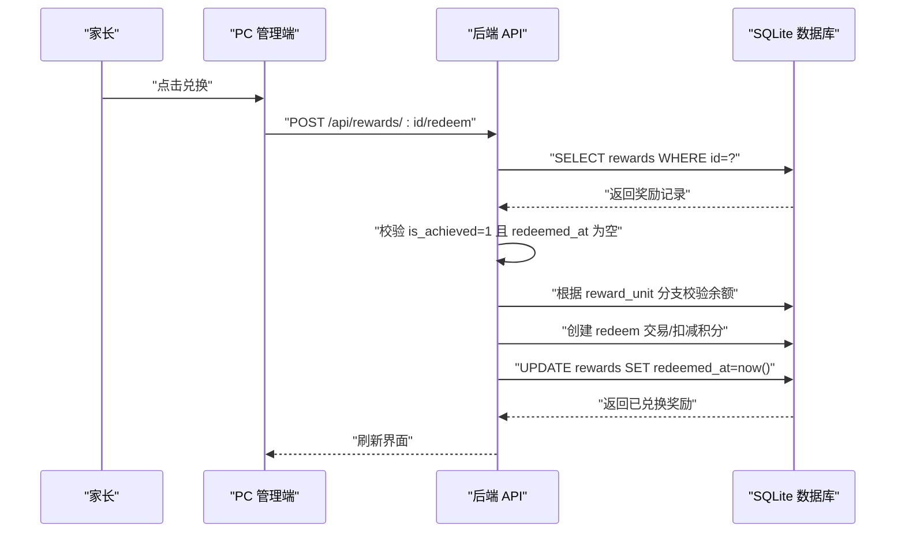
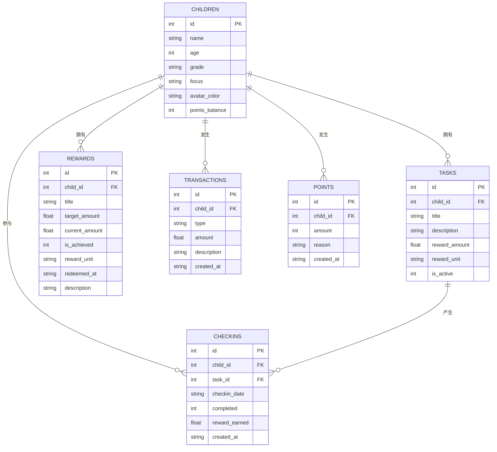
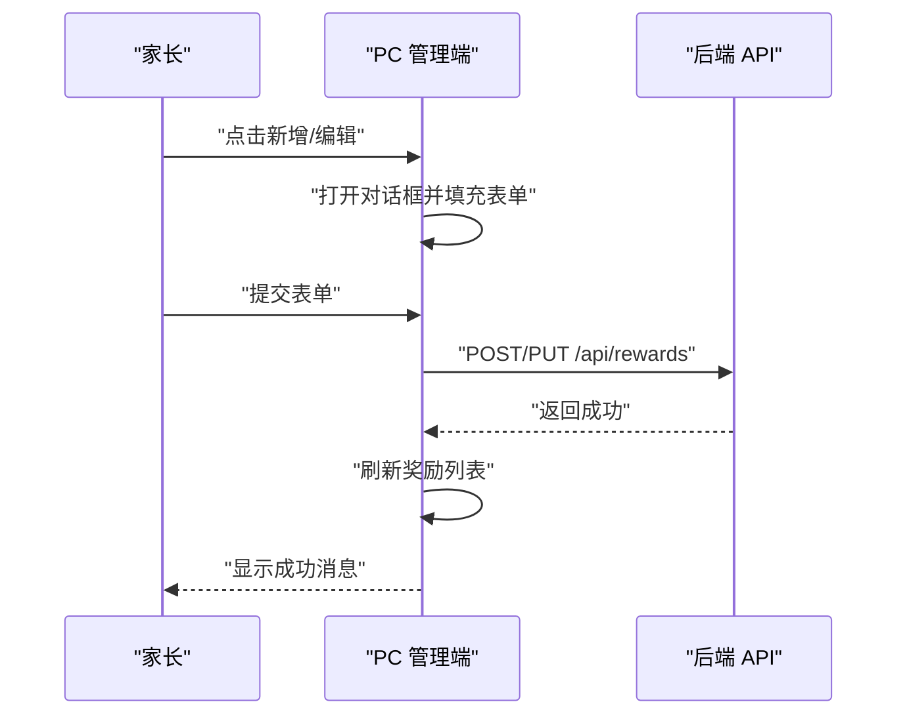
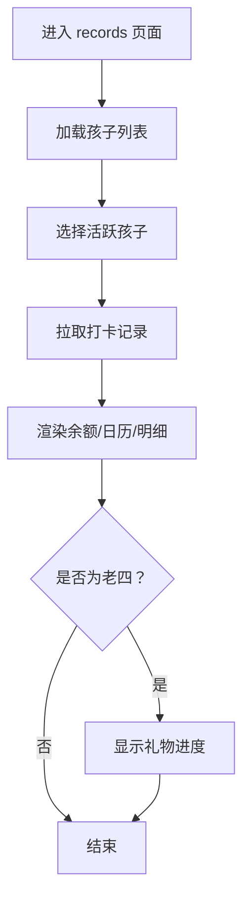
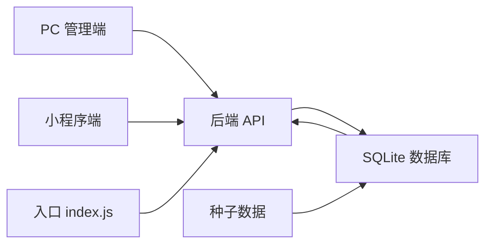

# 奖励目标管理

<cite>
**本文引用的文件**
- [star-park/server/src/routes/rewards.js](file://star-park/server/src/routes/rewards.js)
- [star-park/server/src/routes/checkins.js](file://star-park/server/src/routes/checkins.js)
- [star-park/server/src/routes/children.js](file://star-park/server/src/routes/children.js)
- [star-park/server/src/routes/stats.js](file://star-park/server/src/routes/stats.js)
- [star-park/server/src/routes/tasks.js](file://star-park/server/src/routes/tasks.js)
- [star-park/server/src/routes/points.js](file://star-park/server/src/routes/points.js)
- [star-park/server/src/database.js](file://star-park/server/src/database.js)
- [star-park/server/src/index.js](file://star-park/server/src/index.js)
- [star-park/server/src/seed.js](file://star-park/server/src/seed.js)
- [star-park/pc-admin/src/views/Rewards.vue](file://star-park/pc-admin/src/views/Rewards.vue)
- [star-park/pc-admin/src/views/Goals.vue](file://star-park/pc-admin/src/views/Goals.vue)
- [star-park/pc-admin/src/api/index.js](file://star-park/pc-admin/src/api/index.js)
- [star-park/pc-admin/src/stores/app.js](file://star-park/pc-admin/src/stores/app.js)
- [star-park/miniprogram/src/pages/records/index.vue](file://star-park/miniprogram/src/pages/records/index.vue)
- [star-park/miniprogram/src/pages/index/index.vue](file://star-park/miniprogram/src/pages/index/index.vue)
- [star-park/miniprogram/src/api/index.js](file://star-park/miniprogram/src/api/index.js)
- [docs/api.md](file://docs/api.md)
</cite>

## 目录
1. [简介](#简介)
2. [项目结构](#项目结构)
3. [核心组件](#核心组件)
4. [架构总览](#架构总览)
5. [详细组件分析](#详细组件分析)
6. [依赖关系分析](#依赖关系分析)
7. [性能考虑](#性能考虑)
8. [故障排查指南](#故障排查指南)
9. [结论](#结论)
10. [附录](#附录)

## 简介
本系统围绕“奖励目标管理”构建，提供以下能力：
- 奖励目标设定与管理：目标金额、完成期限、目标类型分类（通过关联任务与统计维度体现）、目标状态（进行中/已达成/已兑换）。
- 进度追踪：自动计算当前余额、完成百分比、剩余金额。
- 奖励发放与兑换：基于任务完成自动累积奖励；支持家长手动兑换，按“元/星星”两种单位扣减对应余额。
- 目标完成后处理：自动更新目标状态、生成兑换记录、更新历史归档（通过交易与积分记录实现）。
- API 接口：提供奖励目标的 CRUD 与兑换接口，以及仪表盘、统计、任务、积分等配套接口。
- 前端界面：PC 管理端提供奖励目标卡片视图与筛选；小程序端提供记录与仪表盘视图，支持进度可视化。

## 项目结构
后端采用 Express + better-sqlite3，数据库采用 SQLite（WAL 模式），路由模块化组织；前端分为 PC 管理端（Vue + Element Plus）与小程序端（UniApp）。

**图表来源**
- [star-park/server/src/index.js:1-42](file://star-park/server/src/index.js#L1-L42)
- [star-park/server/src/database.js:1-111](file://star-park/server/src/database.js#L1-L111)
- [star-park/pc-admin/src/views/Rewards.vue:1-471](file://star-park/pc-admin/src/views/Rewards.vue#L1-L471)
- [star-park/pc-admin/src/views/Goals.vue:1-686](file://star-park/pc-admin/src/views/Goals.vue#L1-L686)
- [star-park/miniprogram/src/pages/index/index.vue:1-194](file://star-park/miniprogram/src/pages/index/index.vue#L1-L194)
- [star-park/miniprogram/src/pages/records/index.vue:1-460](file://star-park/miniprogram/src/pages/records/index.vue#L1-L460)

**章节来源**
- [star-park/server/src/index.js:1-42](file://star-park/server/src/index.js#L1-L42)
- [star-park/server/src/database.js:1-111](file://star-park/server/src/database.js#L1-L111)

## 核心组件
- 数据模型与迁移：children、tasks、checkins、rewards、transactions、points 表，含外键约束与 WAL 模式。
- 路由层：children、tasks、checkins、rewards、stats、points。
- 前端视图：PC 端 Rewards、Goals；小程序端 index、records。
- API 文档：统一的接口规范与示例。

**章节来源**
- [star-park/server/src/database.js:17-111](file://star-park/server/src/database.js#L17-L111)
- [docs/api.md:1-253](file://docs/api.md#L1-L253)

## 架构总览
系统采用前后端分离架构，后端提供 RESTful API，前端通过封装的 API 客户端调用。数据流从任务完成触发奖励累积，到奖励目标状态更新，再到家长手动兑换，最终形成交易与积分记录的历史归档。

**图表来源**
- [star-park/server/src/routes/checkins.js:30-87](file://star-park/server/src/routes/checkins.js#L30-L87)
- [star-park/server/src/routes/rewards.js:89-164](file://star-park/server/src/routes/rewards.js#L89-L164)
- [star-park/pc-admin/src/views/Rewards.vue:282-301](file://star-park/pc-admin/src/views/Rewards.vue#L282-L301)

## 详细组件分析

### 奖励目标管理（后端）
- 功能要点
  - 创建奖励目标：校验 child_id、title、target_amount，初始化 current_amount 为 0，reward_unit 默认“元”，description 可选。
  - 更新奖励目标：支持部分字段更新（title、target_amount、current_amount、is_achieved、description、reward_unit）。
  - 删除奖励目标：按 id 删除。
  - 兑换奖励：仅当 is_achieved=1 且未兑换（redeemed_at 为空）时允许兑换；根据 reward_unit 分支处理：
    - “元”：校验 transactions 余额 ≥ 兑换金额，创建 redeem 交易记录，标记 redeemed_at。
    - “星星”：校验 children.points_balance ≥ 兑换金额，扣减积分余额并记录积分流水。
  - 自动状态更新：每次完成打卡，遍历该孩子所有未达成奖励目标，累加本次 earn 的 reward_earned，若达到或超过 target_amount 则置 is_achieved=1。

**图表来源**
- [star-park/server/src/routes/rewards.js:21-87](file://star-park/server/src/routes/rewards.js#L21-L87)

**章节来源**
- [star-park/server/src/routes/rewards.js:1-167](file://star-park/server/src/routes/rewards.js#L1-L167)

### 进度追踪与自动发放（后端）
- 进度追踪
  - current_amount：由打卡 earn 交易累加。
  - 完成百分比：current_amount/target_amount × 100%，上限 100%。
  - 剩余金额：target_amount - current_amount。
  - 状态更新：当 current_amount ≥ target_amount 时，is_achieved=1。
- 自动发放
  - 每次完成打卡（completed=1），根据任务 reward_amount 生成 earn 交易，并更新该孩子所有未达成奖励目标的 current_amount 与 is_achieved。

**图表来源**
- [star-park/server/src/routes/checkins.js:30-87](file://star-park/server/src/routes/checkins.js#L30-L87)

**章节来源**
- [star-park/server/src/routes/checkins.js:1-90](file://star-park/server/src/routes/checkins.js#L1-L90)

### 奖励兑换与余额管理（后端）
- 兑换前置条件：is_achieved=1 且 redeemed_at 为空。
- 兑换分支：
  - “元”：校验 transactions 余额 ≥ 兑换金额，创建 redeem 交易，标记 redeemed_at。
  - “星星”：校验 children.points_balance ≥ 兑换金额，扣减积分余额并记录积分流水。
- 错误处理：余额不足、不支持的单位、资源不存在等场景返回相应错误码。

**图表来源**
- [star-park/server/src/routes/rewards.js:89-164](file://star-park/server/src/routes/rewards.js#L89-L164)

**章节来源**
- [star-park/server/src/routes/rewards.js:89-164](file://star-park/server/src/routes/rewards.js#L89-L164)

### 数据模型与迁移（后端）
- 表结构
  - children：基础信息与 points_balance。
  - tasks：任务与奖励配置（reward_amount、reward_unit、is_active）。
  - checkins：打卡记录与奖励累积。
  - rewards：奖励目标（target_amount、current_amount、is_achieved、reward_unit、redeemed_at、description）。
  - transactions：金钱 earn/redeem 流水。
  - points：积分 earn/special 流水与余额。
- 迁移
  - children 表增加 points_balance 字段。
  - rewards 表增加 description、reward_unit、redeemed_at 字段。

**图表来源**
- [star-park/server/src/database.js:17-111](file://star-park/server/src/database.js#L17-L111)

**章节来源**
- [star-park/server/src/database.js:17-111](file://star-park/server/src/database.js#L17-L111)

### PC 管理端：奖励目标界面
- 功能概览
  - 孩子筛选标签：按 childId 过滤奖励卡片。
  - 奖励卡片：显示目标名称、目标金额、当前金额、进度条、描述、状态徽章（已达成/已兑换）。
  - 兑换按钮：仅在已达成且未兑换时显示。
  - 对话框：新增/编辑奖励目标，支持 reward_unit 选择。
- 交互流程
  - 打开对话框 → 填写必填项 → 提交 → 调用 API → 刷新列表 → 成功提示。

**图表来源**
- [star-park/pc-admin/src/views/Rewards.vue:104-143](file://star-park/pc-admin/src/views/Rewards.vue#L104-L143)
- [star-park/pc-admin/src/views/Rewards.vue:209-259](file://star-park/pc-admin/src/views/Rewards.vue#L209-L259)

**章节来源**
- [star-park/pc-admin/src/views/Rewards.vue:1-471](file://star-park/pc-admin/src/views/Rewards.vue#L1-L471)

### 小程序端：记录与仪表盘
- 记录页（records）
  - 孩子选择器：切换 activeChild。
  - 余额卡片：显示累计获得、本月收入、已用金额。
  - 礼物进度（老四专属）：目标名称、价格、进度条、已攒、还差。
  - 日历：展示本月打卡日期。
  - 打卡明细：任务名、日期、奖励金额。
- 仪表盘（index）
  - 孩子卡片：头像文字、任务描述、是否已打卡、连续天数、余额。
  - 汇总：最长连续、本周完成率、总积累。

**图表来源**
- [star-park/miniprogram/src/pages/records/index.vue:127-163](file://star-park/miniprogram/src/pages/records/index.vue#L127-L163)
- [star-park/miniprogram/src/pages/index/index.vue:100-124](file://star-park/miniprogram/src/pages/index/index.vue#L100-L124)

**章节来源**
- [star-park/miniprogram/src/pages/records/index.vue:1-460](file://star-park/miniprogram/src/pages/records/index.vue#L1-L460)
- [star-park/miniprogram/src/pages/index/index.vue:1-194](file://star-park/miniprogram/src/pages/index/index.vue#L1-L194)

### API 接口文档（摘要）
- 奖励目标
  - GET /api/rewards：获取奖励目标（可按 child_id 过滤）。
  - POST /api/rewards：创建奖励目标（必填 child_id、title、target_amount）。
  - PUT /api/rewards/:id：更新奖励目标。
  - DELETE /api/rewards/:id：删除奖励目标。
  - POST /api/rewards/:id/redeem：兑换奖励（前置条件：已达成且未兑换）。
- 任务
  - GET /api/tasks：获取任务列表（可按 child_id 过滤）。
  - POST /api/tasks：创建任务。
  - PUT /api/tasks/:id：更新任务。
  - DELETE /api/tasks/:id：删除任务（级联删除打卡记录）。
- 打卡
  - GET /api/checkins：获取打卡记录（可按 date、child_id 过滤）。
  - POST /api/checkins：创建打卡（自动累加奖励并更新目标状态）。
- 统计与仪表盘
  - GET /api/stats/:childId：获取孩子统计数据。
  - GET /api/dashboard：获取仪表盘聚合数据。
- 积分
  - GET /api/points：获取积分记录与余额。
  - POST /api/points：手动添加积分（家长操作）。
- 孩子
  - GET /api/children：获取所有孩子及其任务与余额。
  - GET /api/children/:id/balance：获取积分余额。
  - GET /api/children/:id/transactions：获取交易记录（type=money 返回金钱流水）。

**章节来源**
- [docs/api.md:146-253](file://docs/api.md#L146-L253)

## 依赖关系分析
- 路由依赖
  - index.js 统一路由挂载，依赖 database.js 初始化连接与建表。
  - seed.js 在启动时写入初始数据。
- 前端依赖
  - PC 管理端通过 api/index.js 调用后端接口；Rewards.vue 依赖 store 获取 children 列表。
  - 小程序端通过 api/index.js 调用后端接口，index/records 页面分别消费 dashboard 与 checkins 数据。

**图表来源**
- [star-park/server/src/index.js:20-27](file://star-park/server/src/index.js#L20-L27)
- [star-park/server/src/seed.js:1-45](file://star-park/server/src/seed.js#L1-L45)

**章节来源**
- [star-park/server/src/index.js:1-42](file://star-park/server/src/index.js#L1-L42)
- [star-park/pc-admin/src/api/index.js:1-56](file://star-park/pc-admin/src/api/index.js#L1-L56)
- [star-park/miniprogram/src/api/index.js:1-75](file://star-park/miniprogram/src/api/index.js#L1-L75)

## 性能考虑
- 数据库
  - WAL 模式提升并发读写性能，适合多用户同时访问。
  - 外键约束保证数据一致性，但需注意删除任务时的级联删除顺序。
- 接口
  - GET /api/rewards 支持 child_id 过滤，减少前端筛选成本。
  - GET /api/checkins 支持 date/child_id 过滤，便于日历与报表渲染。
- 前端
  - PC 端使用本地存储缓存 Goals/Goals 待办数据，减轻后端压力。
  - 小程序端按需加载数据，避免一次性渲染大量节点。

[本节为通用建议，无需特定文件引用]

## 故障排查指南
- 常见错误与定位
  - 兑换失败（余额不足/积分不足/单位不支持）：检查 reward_unit 与余额计算逻辑。
  - 奖励未达成却尝试兑换：确认 is_achieved=1 且 redeemed_at 为空。
  - 任务不存在或打卡失败：确认 task_id 与 child_id 正确性。
  - 删除任务失败：检查是否存在打卡记录，需先删除打卡记录再删除任务。
- 日志与调试
  - 后端捕获异常并返回 500；前端统一拦截器输出错误。
  - 建议在开发环境开启更详细的日志，定位 SQL 执行与事务边界。

**章节来源**
- [star-park/server/src/routes/rewards.js:158-163](file://star-park/server/src/routes/rewards.js#L158-L163)
- [star-park/server/src/routes/checkins.js:78-87](file://star-park/server/src/routes/checkins.js#L78-L87)
- [star-park/pc-admin/src/api/index.js:12-19](file://star-park/pc-admin/src/api/index.js#L12-L19)

## 结论
本系统通过清晰的表结构与路由设计，实现了奖励目标的全生命周期管理：从目标设定、自动累积、进度追踪，到家长手动兑换与历史归档。前后端分离架构配合简洁的 API 规范，既满足了 PC 管理端的集中管控需求，也兼顾了小程序端的轻量化体验。后续可在前端引入更丰富的可视化图表与通知提醒，进一步提升用户体验。

[本节为总结，无需特定文件引用]

## 附录

### 奖励目标 API 定义（CRUD 与兑换）
- 获取奖励目标
  - 方法：GET
  - 路径：/api/rewards
  - 查询参数：child_id（可选）
- 创建奖励目标
  - 方法：POST
  - 路径：/api/rewards
  - 请求体字段：child_id、title、target_amount、description（可选）、reward_unit（可选，默认“元”）
- 更新奖励目标
  - 方法：PUT
  - 路径：/api/rewards/:id
  - 请求体字段：title、target_amount、current_amount、is_achieved、description、reward_unit
- 删除奖励目标
  - 方法：DELETE
  - 路径：/api/rewards/:id
- 兑换奖励
  - 方法：POST
  - 路径：/api/rewards/:id/redeem
  - 前置条件：is_achieved=1 且 redeemed_at 为空
  - 响应：返回已兑换奖励记录

**章节来源**
- [docs/api.md:146-191](file://docs/api.md#L146-L191)
- [star-park/server/src/routes/rewards.js:5-87](file://star-park/server/src/routes/rewards.js#L5-L87)

### 前端界面与用户体验优化建议
- PC 管理端
  - 增加“全部完成”批量操作，减少重复点击。
  - 奖励卡片增加“到期时间”字段与到期提醒。
  - 导出奖励历史为 CSV，便于家长留存。
- 小程序端
  - 记录页增加“按月筛选”与“搜索任务名”。
  - 仪表盘增加“目标完成趋势”折线图。
  - 引入“完成打卡”通知与“达成提醒”。

[本节为概念性建议，无需特定文件引用]