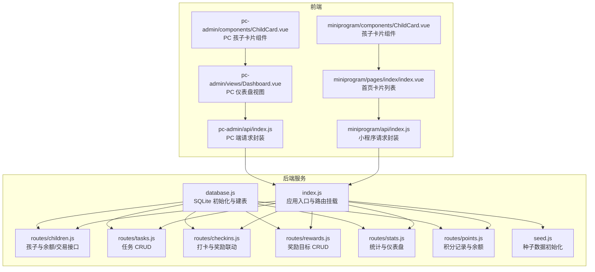
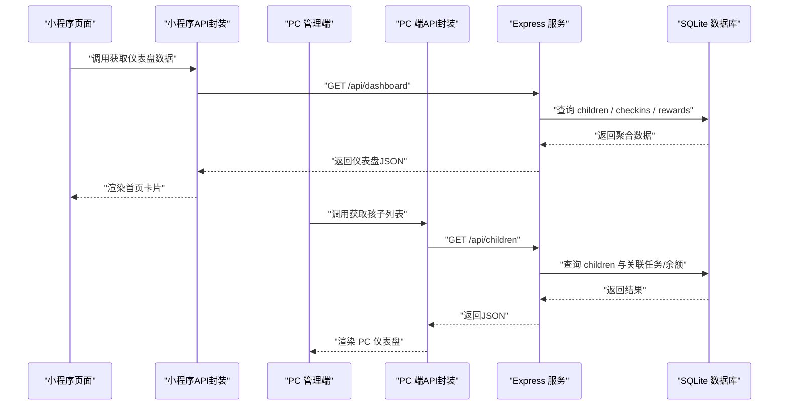
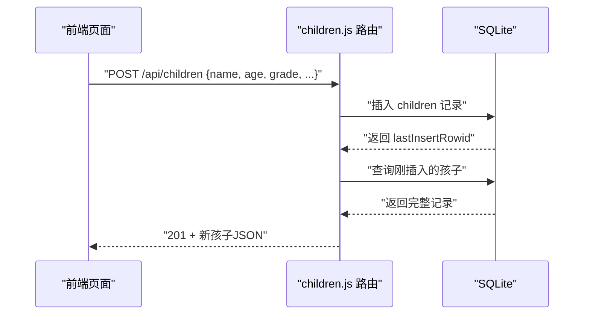
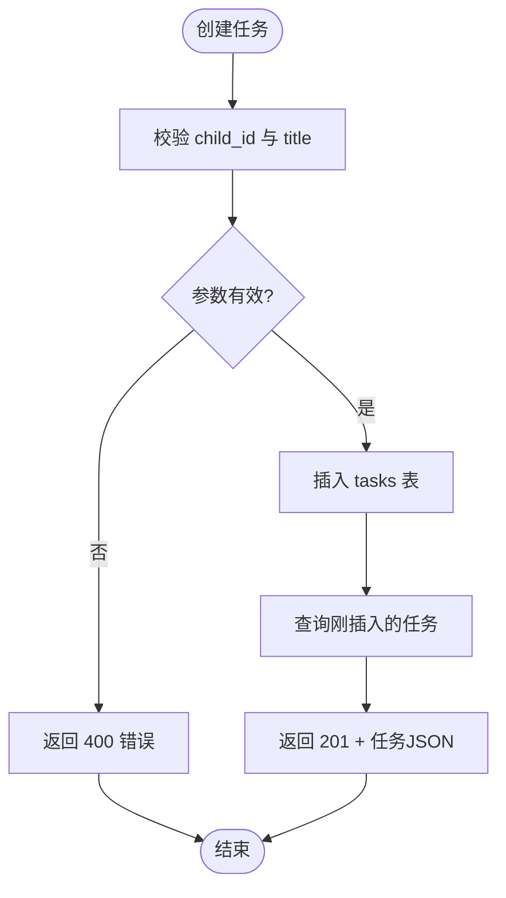
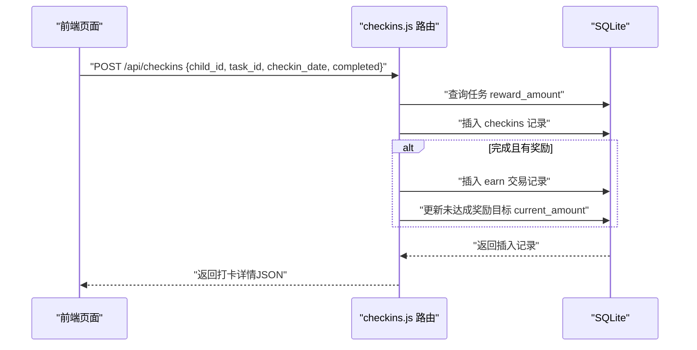
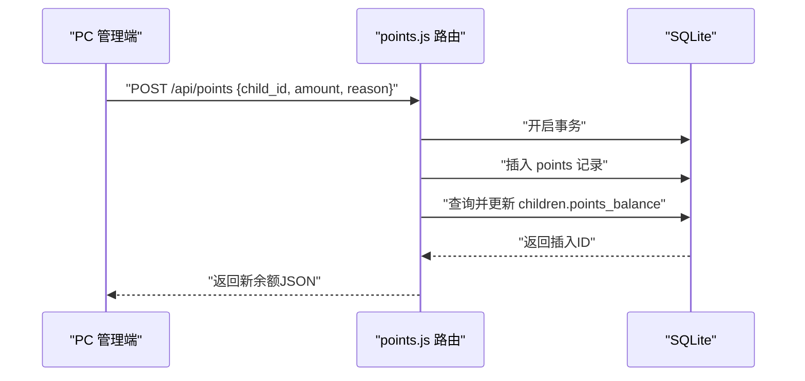
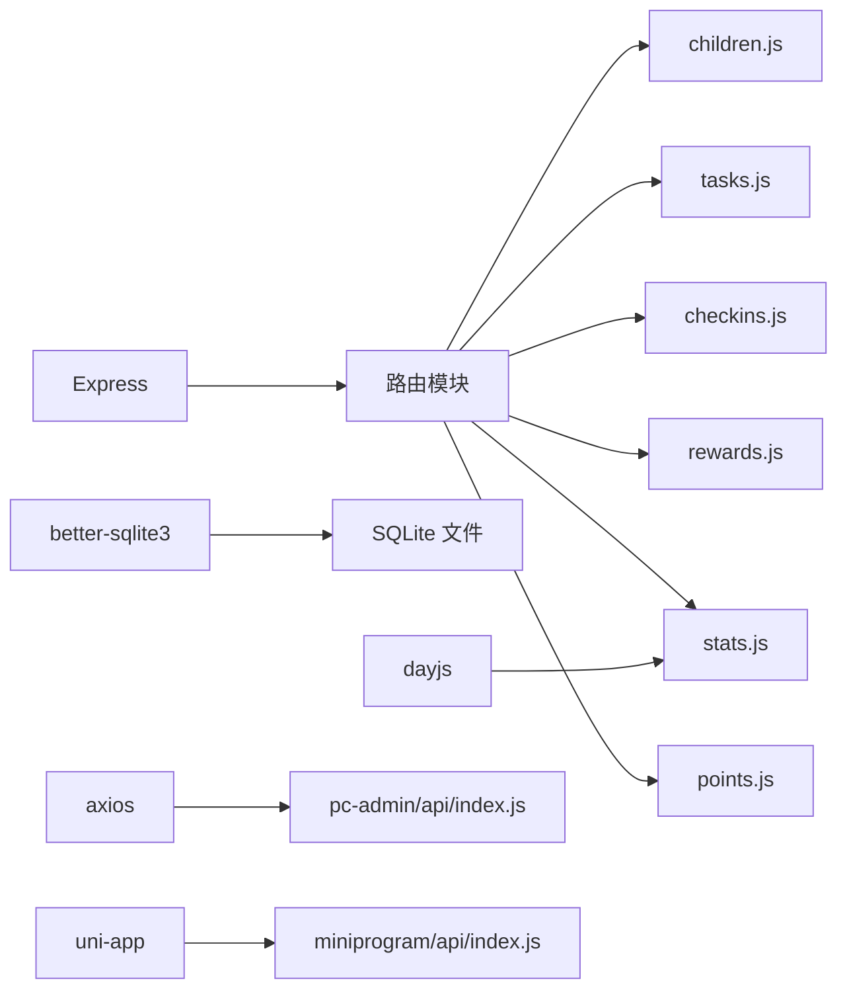

# 孩子管理系统

<cite>
**本文引用的文件**
- [star-park/server/src/index.js](file://star-park/server/src/index.js)
- [star-park/server/src/database.js](file://star-park/server/src/database.js)
- [star-park/server/src/routes/children.js](file://star-park/server/src/routes/children.js)
- [star-park/server/src/routes/tasks.js](file://star-park/server/src/routes/tasks.js)
- [star-park/server/src/routes/checkins.js](file://star-park/server/src/routes/checkins.js)
- [star-park/server/src/routes/rewards.js](file://star-park/server/src/routes/rewards.js)
- [star-park/server/src/routes/stats.js](file://star-park/server/src/routes/stats.js)
- [star-park/server/src/routes/points.js](file://star-park/server/src/routes/points.js)
- [star-park/server/src/seed.js](file://star-park/server/src/seed.js)
- [docs/api.md](file://docs/api.md)
- [star-park/miniprogram/src/api/index.js](file://star-park/miniprogram/src/api/index.js)
- [star-park/pc-admin/src/api/index.js](file://star-park/pc-admin/src/api/index.js)
- [star-park/miniprogram/src/pages/index/index.vue](file://star-park/miniprogram/src/pages/index/index.vue)
- [star-park/miniprogram/src/components/ChildCard.vue](file://star-park/miniprogram/src/components/ChildCard.vue)
- [star-park/pc-admin/src/views/Dashboard.vue](file://star-park/pc-admin/src/views/Dashboard.vue)
- [star-park/pc-admin/src/components/ChildCard.vue](file://star-park/pc-admin/src/components/ChildCard.vue)
</cite>

## 目录
1. [简介](#简介)
2. [项目结构](#项目结构)
3. [核心组件](#核心组件)
4. [架构总览](#架构总览)
5. [详细组件分析](#详细组件分析)
6. [依赖分析](#依赖分析)
7. [性能考虑](#性能考虑)
8. [故障排查指南](#故障排查指南)
9. [结论](#结论)
10. [附录](#附录)

## 简介
本系统是一个面向家庭场景的“孩子管理系统”，围绕孩子信息维护、任务分配与打卡、奖励目标与积分体系构建一体化解决方案。系统包含后端服务、小程序前端与 PC 管理端，提供 RESTful API，支持：
- 孩子信息的增删改查与个性化头像颜色设置
- 任务的创建、编辑、删除与状态跟踪
- 打卡记录生成与奖励目标联动
- 积分发放与余额统计
- 数据统计与仪表盘展示

## 项目结构
系统采用前后端分离架构，后端基于 Express + better-sqlite3，数据库为本地 SQLite 文件；前端包含基于 Vue 的小程序与 PC 管理端。

图表来源
- [star-park/server/src/index.js:1-42](file://star-park/server/src/index.js#L1-L42)
- [star-park/server/src/database.js:1-90](file://star-park/server/src/database.js#L1-L90)
- [star-park/server/src/routes/children.js:1-88](file://star-park/server/src/routes/children.js#L1-L88)
- [star-park/server/src/routes/tasks.js:1-91](file://star-park/server/src/routes/tasks.js#L1-L91)
- [star-park/server/src/routes/checkins.js:1-90](file://star-park/server/src/routes/checkins.js#L1-L90)
- [star-park/server/src/routes/rewards.js:1-84](file://star-park/server/src/routes/rewards.js#L1-L84)
- [star-park/server/src/routes/stats.js:1-182](file://star-park/server/src/routes/stats.js#L1-L182)
- [star-park/server/src/routes/points.js:1-74](file://star-park/server/src/routes/points.js#L1-L74)
- [star-park/server/src/seed.js:1-45](file://star-park/server/src/seed.js#L1-L45)
- [star-park/miniprogram/src/api/index.js:1-65](file://star-park/miniprogram/src/api/index.js#L1-L65)
- [star-park/pc-admin/src/api/index.js:1-55](file://star-park/pc-admin/src/api/index.js#L1-L55)
- [star-park/miniprogram/src/pages/index/index.vue:1-194](file://star-park/miniprogram/src/pages/index/index.vue#L1-L194)
- [star-park/miniprogram/src/components/ChildCard.vue:1-162](file://star-park/miniprogram/src/components/ChildCard.vue#L1-L162)
- [star-park/pc-admin/src/views/Dashboard.vue:1-146](file://star-park/pc-admin/src/views/Dashboard.vue#L1-L146)
- [star-park/pc-admin/src/components/ChildCard.vue:1-161](file://star-park/pc-admin/src/components/ChildCard.vue#L1-L161)

章节来源
- [star-park/server/src/index.js:1-42](file://star-park/server/src/index.js#L1-L42)
- [star-park/server/src/database.js:17-80](file://star-park/server/src/database.js#L17-L80)

## 核心组件
- 数据库层：负责建表、迁移与事务控制，确保数据一致性与并发安全。
- 路由层：提供 RESTful 接口，涵盖孩子、任务、打卡、奖励、统计与积分。
- 前端层：小程序与 PC 管理端分别调用统一后端 API，渲染数据与交互。

章节来源
- [star-park/server/src/database.js:17-80](file://star-park/server/src/database.js#L17-L80)
- [star-park/server/src/routes/children.js:5-88](file://star-park/server/src/routes/children.js#L5-L88)
- [star-park/server/src/routes/tasks.js:5-91](file://star-park/server/src/routes/tasks.js#L5-L91)
- [star-park/server/src/routes/checkins.js:6-90](file://star-park/server/src/routes/checkins.js#L6-L90)
- [star-park/server/src/routes/rewards.js:5-84](file://star-park/server/src/routes/rewards.js#L5-L84)
- [star-park/server/src/routes/stats.js:6-182](file://star-park/server/src/routes/stats.js#L6-L182)
- [star-park/server/src/routes/points.js:5-74](file://star-park/server/src/routes/points.js#L5-L74)

## 架构总览
后端服务通过 Express 提供统一 API，前端通过各自封装的请求模块调用。数据库采用 WAL 模式与外键约束，保证并发与参照完整性；种子脚本在首次启动时注入演示数据。

图表来源
- [star-park/server/src/index.js:20-27](file://star-park/server/src/index.js#L20-L27)
- [star-park/server/src/routes/stats.js:103-179](file://star-park/server/src/routes/stats.js#L103-L179)
- [star-park/server/src/routes/children.js:5-88](file://star-park/server/src/routes/children.js#L5-L88)
- [star-park/miniprogram/src/api/index.js:34-64](file://star-park/miniprogram/src/api/index.js#L34-L64)
- [star-park/pc-admin/src/api/index.js:21-44](file://star-park/pc-admin/src/api/index.js#L21-L44)

## 详细组件分析

### 孩子信息维护（增删改查、头像颜色、年龄与年级）
- 接口设计
  - GET /api/children：返回所有孩子及任务、余额信息
  - POST /api/children：新增孩子，支持 name、age、grade、focus、avatar_color
  - GET /api/children/:id/balance：查询积分余额
  - GET /api/children/:id/transactions：查询交易明细
- 数据模型
  - children 表含 id、name、age、grade、focus、avatar_color、points_balance
  - 余额与任务在查询时动态拼装
- 错误处理
  - 缺少必填参数返回 400
  - 资源不存在返回 404
  - 服务器异常返回 500

图表来源
- [star-park/server/src/routes/children.js:39-54](file://star-park/server/src/routes/children.js#L39-L54)
- [star-park/server/src/database.js:18-26](file://star-park/server/src/database.js#L18-L26)

章节来源
- [star-park/server/src/routes/children.js:5-88](file://star-park/server/src/routes/children.js#L5-L88)
- [star-park/server/src/database.js:18-26](file://star-park/server/src/database.js#L18-L26)
- [docs/api.md:33-83](file://docs/api.md#L33-L83)

### 任务分配与状态跟踪
- 接口设计
  - GET /api/tasks?child_id：按孩子筛选任务
  - POST /api/tasks：创建任务（child_id、title 必填）
  - PUT /api/tasks/:id：更新任务（支持部分字段）
  - DELETE /api/tasks/:id：删除任务（级联删除打卡记录）
- 任务状态
  - is_active 控制任务是否计入统计与预期完成数
  - 完成度统计基于本周完成次数与活跃任务数计算

图表来源
- [star-park/server/src/routes/tasks.js:21-36](file://star-park/server/src/routes/tasks.js#L21-L36)

章节来源
- [star-park/server/src/routes/tasks.js:5-91](file://star-park/server/src/routes/tasks.js#L5-L91)
- [docs/api.md:84-118](file://docs/api.md#L84-L118)

### 打卡与奖励联动
- 接口设计
  - GET /api/checkins?date&child_id：按日期或孩子筛选打卡
  - POST /api/checkins：创建打卡，自动产生交易记录与奖励目标累计
- 业务逻辑
  - 完成任务时，向 transactions 插入 earn 记录，并更新所有未达成奖励目标的 current_amount
  - 支持按 completed 字段标记完成状态

图表来源
- [star-park/server/src/routes/checkins.js:30-87](file://star-park/server/src/routes/checkins.js#L30-L87)
- [star-park/server/src/routes/rewards.js:21-36](file://star-park/server/src/routes/rewards.js#L21-L36)

章节来源
- [star-park/server/src/routes/checkins.js:6-90](file://star-park/server/src/routes/checkins.js#L6-L90)
- [docs/api.md:120-145](file://docs/api.md#L120-L145)

### 奖励目标管理
- 接口设计
  - GET /api/rewards?child_id：按孩子筛选奖励目标
  - POST /api/rewards：创建奖励目标（child_id、title、target_amount 必填）
  - PUT /api/rewards/:id：更新目标
  - DELETE /api/rewards/:id：删除目标
- 与打卡联动
  - 完成打卡后，自动累加未达成奖励目标的 current_amount，并判断是否达成

章节来源
- [star-park/server/src/routes/rewards.js:5-84](file://star-park/server/src/routes/rewards.js#L5-L84)
- [docs/api.md:146-167](file://docs/api.md#L146-L167)

### 积分系统与余额统计
- 接口设计
  - GET /api/points?child_id：获取积分记录与当前余额
  - POST /api/points：手动发放积分（amount 非零整数），自动更新 children.points_balance
- 余额计算
  - 通过 transactions 表汇总 earn/spend 得到余额
  - children 表新增 points_balance 字段用于快速读取

图表来源
- [star-park/server/src/routes/points.js:30-72](file://star-park/server/src/routes/points.js#L30-L72)
- [star-park/server/src/database.js:82-87](file://star-park/server/src/database.js#L82-L87)

章节来源
- [star-park/server/src/routes/points.js:5-74](file://star-park/server/src/routes/points.js#L5-L74)
- [docs/api.md:191-214](file://docs/api.md#L191-L214)

### 统计与仪表盘
- 接口设计
  - GET /api/stats/:childId：返回连续打卡、本周完成率、余额、30日每日完成情况等
  - GET /api/dashboard：返回所有孩子今日打卡、活跃任务、连续打卡、本周完成率、余额、未达成奖励目标等
- 统计指标
  - 连续打卡：从当天向前连续有打卡的天数
  - 本周完成率：本周实际完成次数 / 期望次数
  - 余额：earn 总额 - spend 总额

章节来源
- [star-park/server/src/routes/stats.js:6-182](file://star-park/server/src/routes/stats.js#L6-L182)
- [docs/api.md:169-184](file://docs/api.md#L169-L184)

### 前端集成与使用场景
- 小程序
  - 首页通过仪表盘接口获取孩子卡片数据，渲染头像颜色、任务描述、连续打卡与累计余额
  - 孩子卡片组件接收 name、avatarText、color、taskDesc、checkedIn、streak、balance 等属性
- PC 管理端
  - 仪表盘视图加载 dashboard 数据，展示今日打卡、连续打卡、本周完成率、余额与未达成奖励目标
  - 孩子卡片组件展示进度条与点击跳转到余额页的能力

章节来源
- [star-park/miniprogram/src/pages/index/index.vue:100-124](file://star-park/miniprogram/src/pages/index/index.vue#L100-L124)
- [star-park/miniprogram/src/components/ChildCard.vue:32-42](file://star-park/miniprogram/src/components/ChildCard.vue#L32-L42)
- [star-park/pc-admin/src/views/Dashboard.vue:76-91](file://star-park/pc-admin/src/views/Dashboard.vue#L76-L91)
- [star-park/pc-admin/src/components/ChildCard.vue:49-81](file://star-park/pc-admin/src/components/ChildCard.vue#L49-L81)

## 依赖分析
- 后端依赖
  - Express：提供 Web 服务与路由
  - better-sqlite3：本地数据库驱动
  - dayjs：日期工具
  - cors：跨域支持
- 前端依赖
  - 小程序：uni-app + Vue
  - PC 管理端：Vue + Element Plus + axios

图表来源
- [star-park/server/src/index.js:1-42](file://star-park/server/src/index.js#L1-L42)
- [star-park/server/src/routes/stats.js:3](file://star-park/server/src/routes/stats.js#L3)
- [star-park/pc-admin/src/api/index.js:1-10](file://star-park/pc-admin/src/api/index.js#L1-L10)
- [star-park/miniprogram/src/api/index.js:1-10](file://star-park/miniprogram/src/api/index.js#L1-L10)

章节来源
- [star-park/server/src/index.js:1-42](file://star-park/server/src/index.js#L1-L42)

## 性能考虑
- 数据库优化
  - WAL 模式提升并发读写性能
  - 开启外键约束保证参照完整性
  - 对常用查询字段建立索引（建议：children.name、tasks.child_id、checkins.child_id/date、rewards.child_id）
- 接口优化
  - 分页与筛选：对大列表使用分页或限制返回条数
  - 缓存：对静态统计结果进行短期缓存
  - 批量操作：批量打卡或批量任务更新可合并为事务减少往返
- 前端优化
  - 列表虚拟化：大量卡片时启用虚拟滚动
  - 懒加载：按需加载任务与交易详情

## 故障排查指南
- 常见错误与处理
  - 400 参数缺失：检查必填字段（如 name、child_id、title、amount 等）
  - 404 资源不存在：确认 ID 是否正确，是否存在关联数据
  - 500 服务器错误：查看后端日志定位 SQL 异常或事务回滚问题
- 数据一致性
  - 事务：积分发放与余额更新、打卡与交易记录、删除任务与级联打卡均使用事务
  - 外键：children、tasks、checkins、rewards、points 均设置外键约束
- 调试建议
  - 使用健康检查接口确认服务可用
  - 通过种子脚本快速验证初始数据
  - 在 PC 管理端查看仪表盘与统计接口返回

章节来源
- [star-park/server/src/routes/children.js:43-53](file://star-park/server/src/routes/children.js#L43-L53)
- [star-park/server/src/routes/tasks.js:24-26](file://star-park/server/src/routes/tasks.js#L24-L26)
- [star-park/server/src/routes/points.js:33-41](file://star-park/server/src/routes/points.js#L33-L41)
- [star-park/server/src/routes/checkins.js:33-44](file://star-park/server/src/routes/checkins.js#L33-L44)
- [star-park/server/src/routes/rewards.js:24-27](file://star-park/server/src/routes/rewards.js#L24-L27)
- [star-park/server/src/routes/stats.js:10-13](file://star-park/server/src/routes/stats.js#L10-L13)
- [star-park/server/src/routes/points.js:30-72](file://star-park/server/src/routes/points.js#L30-L72)
- [star-park/server/src/routes/checkins.js:78-87](file://star-park/server/src/routes/checkins.js#L78-L87)
- [star-park/server/src/seed.js:3-9](file://star-park/server/src/seed.js#L3-L9)

## 结论
本系统以 SQLite 为核心，结合 Express 提供清晰的 RESTful 接口，覆盖孩子信息、任务、打卡、奖励与积分的完整闭环。通过种子数据与前后端组件配合，实现即开即用的家庭教育管理体验。后续可在现有基础上扩展权限、审计日志与更丰富的统计维度。

## 附录

### API 接口清单与规范
- 健康检查
  - GET /api/health
- 孩子管理
  - GET /api/children
  - POST /api/children
  - GET /api/children/:id/balance
  - GET /api/children/:id/transactions
- 任务管理
  - GET /api/tasks
  - POST /api/tasks
  - PUT /api/tasks/:id
  - DELETE /api/tasks/:id
- 打卡管理
  - GET /api/checkins
  - POST /api/checkins
- 奖励目标
  - GET /api/rewards
  - POST /api/rewards
  - PUT /api/rewards/:id
  - DELETE /api/rewards/:id
- 统计与仪表盘
  - GET /api/stats/:childId
  - GET /api/dashboard
- 积分与余额
  - GET /api/points
  - POST /api/points

章节来源
- [docs/api.md:18-222](file://docs/api.md#L18-L222)