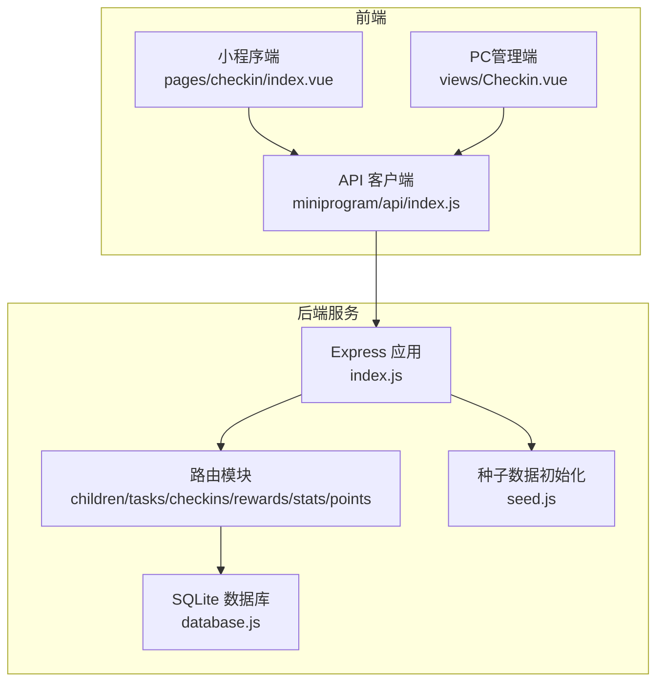
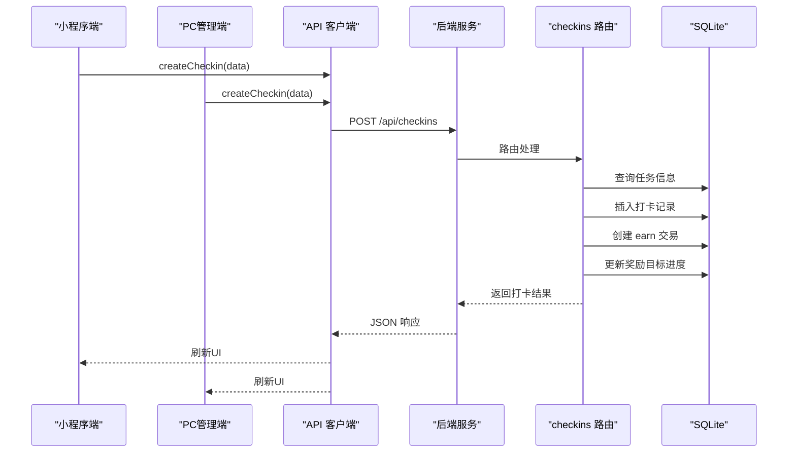
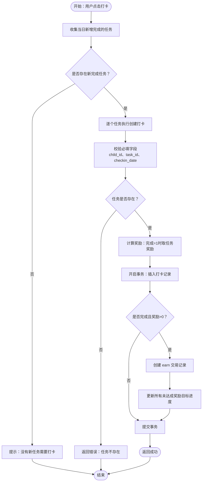
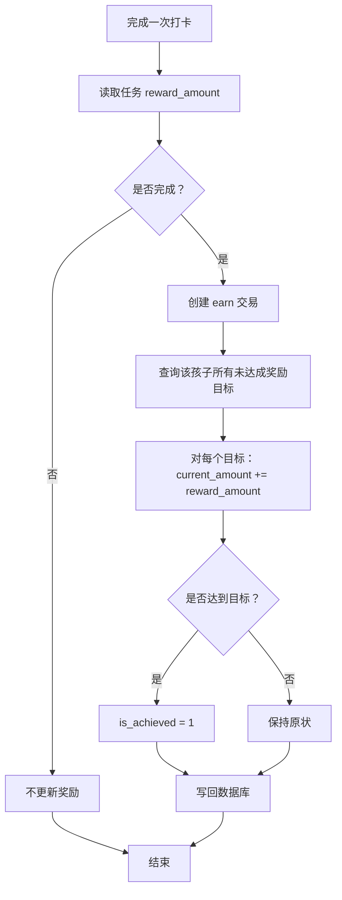
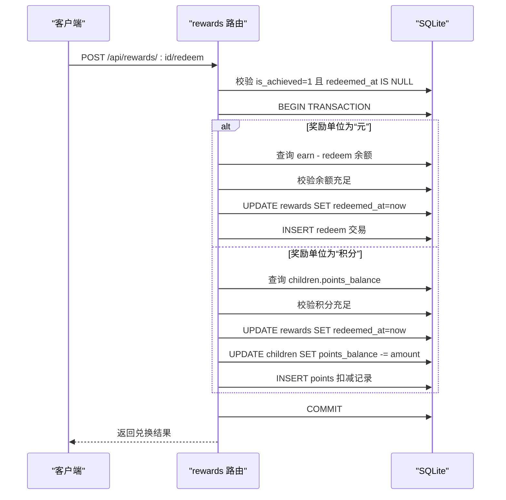
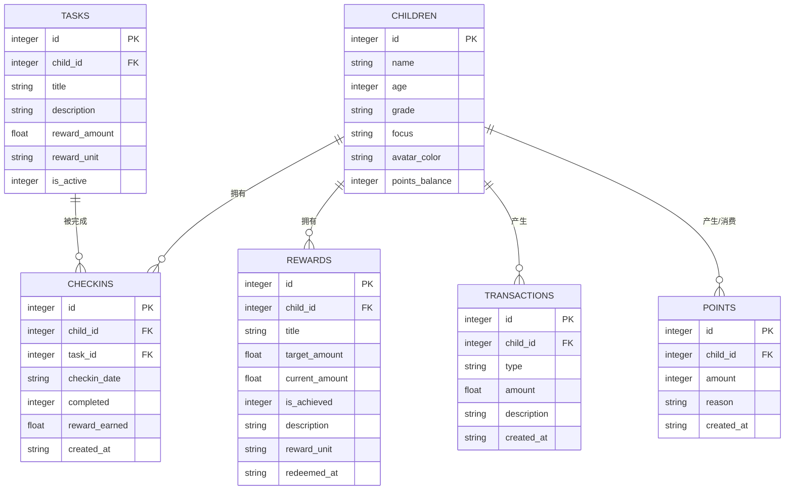
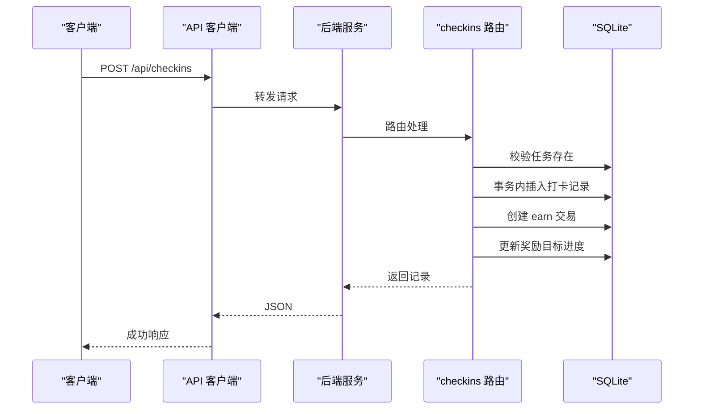
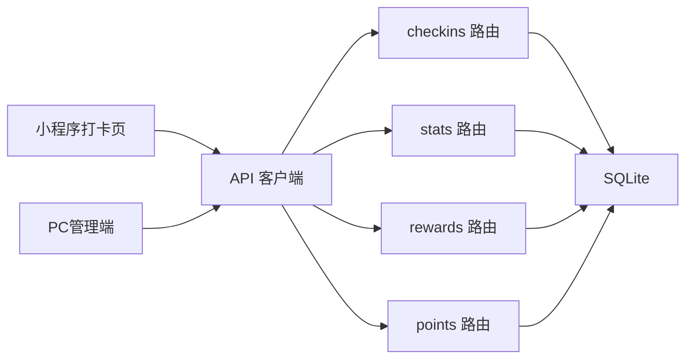

# 打卡系统

<cite>
**本文引用的文件**
- [checkins.js](file://star-park/server/src/routes/checkins.js)
- [database.js](file://star-park/server/src/database.js)
- [index.js](file://star-park/server/src/index.js)
- [api.md](file://docs/api.md)
- [server.md](file://docs/design-docs/server.md)
- [miniprogram.md](file://docs/design-docs/miniprogram.md)
- [pc-admin.md](file://docs/design-docs/pc-admin.md)
- [index.vue](file://star-park/miniprogram/src/pages/checkin/index.vue)
- [Checkin.vue](file://star-park/pc-admin/src/views/Checkin.vue)
- [stats.js](file://star-park/server/src/routes/stats.js)
- [rewards.js](file://star-park/server/src/routes/rewards.js)
- [points.js](file://star-park/server/src/routes/points.js)
- [seed.js](file://star-park/server/src/seed.js)
- [index.js](file://star-park/miniprogram/src/api/index.js)
</cite>

## 目录
1. [简介](#简介)
2. [项目结构](#项目结构)
3. [核心组件](#核心组件)
4. [架构总览](#架构总览)
5. [详细组件分析](#详细组件分析)
6. [依赖关系分析](#依赖关系分析)
7. [性能考虑](#性能考虑)
8. [故障排除指南](#故障排除指南)
9. [结论](#结论)
10. [附录](#附录)

## 简介
本文件为“打卡系统”的功能与技术文档，围绕每日打卡流程、奖励计算、事务一致性、数据存储结构以及API接口进行系统化说明。文档面向开发者与产品人员，既提供高层架构视图，也包含代码级细节与可视化图表，帮助快速理解与落地实施。

## 项目结构
后端采用 Express + better-sqlite3，前端包含小程序端与PC管理端。核心模块包括：
- 路由层：children、tasks、checkins、rewards、stats、points
- 数据层：SQLite 表结构与迁移脚本
- 前端：小程序打卡页、PC管理端“每日打卡”页面
- 文档：API接口文档与设计文档

**图表来源**
- [index.js:1-42](file://star-park/server/src/index.js#L1-42)
- [database.js:1-111](file://star-park/server/src/database.js#L1-111)
- [seed.js:1-45](file://star-park/server/src/seed.js#L1-45)
- [index.vue:1-322](file://star-park/miniprogram/src/pages/checkin/index.vue#L1-322)
- [Checkin.vue:1-417](file://star-park/pc-admin/src/views/Checkin.vue#L1-417)
- [index.js:1-75](file://star-park/miniprogram/src/api/index.js#L1-75)

**章节来源**
- [index.js:1-42](file://star-park/server/src/index.js#L1-42)
- [server.md:10-31](file://docs/design-docs/server.md#L10-L31)

## 核心组件
- 打卡路由：负责查询与创建打卡记录，触发奖励计算与事务更新
- 数据库：定义 children、tasks、checkins、rewards、transactions、points 表，并启用 WAL 与外键约束
- 前端打卡页：小程序与PC管理端均提供“每日打卡”界面，支持任务勾选与批量打卡
- 统计路由：计算连续打卡天数、周完成率、余额等指标
- 奖励路由：维护奖励目标、计算达成度、支持兑换（含事务保护）
- 积分路由：记录积分增减与余额更新（事务保护）

**章节来源**
- [checkins.js:1-90](file://star-park/server/src/routes/checkins.js#L1-90)
- [database.js:17-80](file://star-park/server/src/database.js#L17-80)
- [index.vue:165-192](file://star-park/miniprogram/src/pages/checkin/index.vue#L165-L192)
- [Checkin.vue:197-216](file://star-park/pc-admin/src/views/Checkin.vue#L197-L216)
- [stats.js:6-101](file://star-park/server/src/routes/stats.js#L6-L101)
- [rewards.js:89-164](file://star-park/server/src/routes/rewards.js#L89-L164)
- [points.js:30-72](file://star-park/server/src/routes/points.js#L30-L72)

## 架构总览
后端通过路由模块统一暴露REST接口；数据库采用SQLite嵌入式方案，启用WAL模式提升并发；前端通过API客户端调用后端接口，实现“每日打卡”与“奖励管理”。

**图表来源**
- [index.vue:174-191](file://star-park/miniprogram/src/pages/checkin/index.vue#L174-L191)
- [Checkin.vue:197-216](file://star-park/pc-admin/src/views/Checkin.vue#L197-L216)
- [checkins.js:31-87](file://star-park/server/src/routes/checkins.js#L31-87)

**章节来源**
- [server.md:75-112](file://docs/design-docs/server.md#L75-L112)

## 详细组件分析

### 打卡流程设计
- 触发机制：前端点击“确认打卡”，遍历当日新增完成的任务逐条创建打卡记录
- 时间记录：使用当前日期作为 checkin_date，created_at 由数据库自动填充
- 状态验证：completed 默认为1（完成），若任务未完成则传0
- 奖励计算：仅当任务完成且 reward_earned > 0 时，创建 earn 交易并更新所有未达成奖励目标的 current_amount

**图表来源**
- [index.vue:165-191](file://star-park/miniprogram/src/pages/checkin/index.vue#L165-L191)
- [Checkin.vue:197-216](file://star-park/pc-admin/src/views/Checkin.vue#L197-L216)
- [checkins.js:31-87](file://star-park/server/src/routes/checkins.js#L31-87)

**章节来源**
- [checkins.js:31-87](file://star-park/server/src/routes/checkins.js#L31-87)
- [index.vue:165-191](file://star-park/miniprogram/src/pages/checkin/index.vue#L165-L191)
- [Checkin.vue:197-216](file://star-park/pc-admin/src/views/Checkin.vue#L197-L216)

### 奖励计算逻辑
- 单次打卡奖励：以任务 reward_amount 为准，完成时计入 earn 交易与奖励目标 current_amount
- 连续打卡奖励：系统不单独设置“连续打卡额外奖励”，而是通过“奖励目标”机制实现累积，达成目标后可兑换
- 奖励累积机制：每完成一次打卡，遍历该孩子所有未达成的奖励目标，current_amount += 本次奖励，若达到或超过 target_amount，则标记 is_achieved = 1

**图表来源**
- [checkins.js:40-73](file://star-park/server/src/routes/checkins.js#L40-73)

**章节来源**
- [checkins.js:40-73](file://star-park/server/src/routes/checkins.js#L40-73)

### 事务性操作与一致性
- 打卡事务：在单个事务中完成插入打卡记录、创建 earn 交易、更新奖励目标进度，保证原子性
- 奖励兑换事务：根据 reward_unit 分支处理（元或积分），先校验余额/积分充足，再更新 redeemed_at 并写入交易或扣减积分
- 积分事务：插入积分记录并同步更新 children.points_balance，保证余额一致

**图表来源**
- [rewards.js:89-164](file://star-park/server/src/routes/rewards.js#L89-L164)

**章节来源**
- [checkins.js:48-76](file://star-park/server/src/routes/checkins.js#L48-76)
- [rewards.js:89-164](file://star-park/server/src/routes/rewards.js#L89-L164)
- [points.js:43-57](file://star-park/server/src/routes/points.js#L43-L57)

### 数据存储结构
- children：孩子基本信息，含 points_balance 字段用于积分余额
- tasks：任务定义，含 child_id、title、description、reward_amount、reward_unit、is_active
- checkins：打卡记录，含 child_id、task_id、checkin_date、completed、reward_earned、created_at
- rewards：奖励目标，含 child_id、title、target_amount、current_amount、is_achieved、description、reward_unit、redeemed_at
- transactions：金钱交易记录，含 child_id、type（earn/redeem/spend）、amount、description、created_at
- points：积分记录，含 child_id、amount（正为增加，负为扣减）、reason、created_at

**图表来源**
- [database.js:18-80](file://star-park/server/src/database.js#L18-80)

**章节来源**
- [database.js:18-80](file://star-park/server/src/database.js#L18-80)

### 打卡API接口说明
- GET /api/checkins
  - 功能：按日期与孩子筛选获取打卡记录，返回打卡记录并关联任务标题
  - 查询参数：date（YYYY-MM-DD）、child_id
  - 返回：打卡记录数组
- POST /api/checkins
  - 功能：创建打卡记录，同时生成 earn 交易并更新奖励目标进度
  - 请求体字段：child_id、task_id、checkin_date（YYYY-MM-DD）、completed（可选，默认1）
  - 返回：新创建的打卡记录（带任务标题）
  - 异常：缺少必填字段返回400；任务不存在返回400；其他错误返回500

**图表来源**
- [checkins.js:6-28](file://star-park/server/src/routes/checkins.js#L6-L28)
- [checkins.js:31-87](file://star-park/server/src/routes/checkins.js#L31-87)
- [api.md:120-145](file://docs/api.md#L120-L145)

**章节来源**
- [checkins.js:6-28](file://star-park/server/src/routes/checkins.js#L6-L28)
- [checkins.js:31-87](file://star-park/server/src/routes/checkins.js#L31-87)
- [api.md:120-145](file://docs/api.md#L120-L145)

### 其他相关API与前端交互
- GET /api/stats/:childId：获取统计数据（连续打卡天数、周完成率、余额、30天每日完成情况）
- GET /api/dashboard：获取仪表盘数据（按孩子聚合）
- GET /api/points?child_id：获取积分记录与余额
- POST /api/points：手动添加积分（家长操作）
- GET /api/rewards?child_id：获取奖励目标
- POST /api/rewards：创建奖励目标
- POST /api/rewards/:id/redeem：兑换奖励（事务保护）

**章节来源**
- [stats.js:6-101](file://star-park/server/src/routes/stats.js#L6-L101)
- [stats.js:103-182](file://star-park/server/src/routes/stats.js#L103-L182)
- [points.js:5-28](file://star-park/server/src/routes/points.js#L5-L28)
- [points.js:30-72](file://star-park/server/src/routes/points.js#L30-L72)
- [rewards.js:5-19](file://star-park/server/src/routes/rewards.js#L5-L19)
- [rewards.js:21-38](file://star-park/server/src/routes/rewards.js#L21-L38)
- [rewards.js:89-164](file://star-park/server/src/routes/rewards.js#L89-L164)
- [api.md:200-245](file://docs/api.md#L200-L245)

## 依赖关系分析
- 路由依赖数据库连接，所有业务逻辑在路由层完成
- 前端通过API客户端调用后端接口，小程序与PC端共享同一后端能力
- 统计与奖励模块依赖checkins与transactions数据，形成闭环

**图表来源**
- [index.js:6-27](file://star-park/server/src/index.js#L6-L27)
- [index.js:1-75](file://star-park/miniprogram/src/api/index.js#L1-75)
- [index.vue:174-191](file://star-park/miniprogram/src/pages/checkin/index.vue#L174-L191)
- [Checkin.vue:197-216](file://star-park/pc-admin/src/views/Checkin.vue#L197-L216)

**章节来源**
- [index.js:6-27](file://star-park/server/src/index.js#L6-L27)

## 性能考虑
- 数据库：启用WAL模式与外键约束，提升并发与数据一致性
- 查询优化：按日期与child_id筛选打卡记录，避免全表扫描
- 事务批处理：将多步写入合并到单个事务，减少锁竞争
- 前端缓存：小程序端在加载时标记当天已完成任务，减少重复请求

**章节来源**
- [database.js:13-15](file://star-park/server/src/database.js#L13-L15)
- [checkins.js:48-76](file://star-park/server/src/routes/checkins.js#L48-76)
- [index.vue:243-263](file://star-park/miniprogram/src/pages/checkin/index.vue#L243-L263)

## 故障排除指南
- 400 错误
  - 缺少必填字段（child_id、task_id、checkin_date）
  - 任务不存在
  - 积分添加时 amount 非法（需非零整数）
- 404 错误
  - 资源不存在（任务、奖励目标）
- 500 错误
  - 数据库异常或事务执行失败
- 前端提示
  - 小程序端网络请求失败会显示提示
  - PC管理端错误通过控制台输出

**章节来源**
- [checkins.js:34-44](file://star-park/server/src/routes/checkins.js#L34-L44)
- [points.js:34-41](file://star-park/server/src/routes/points.js#L34-L41)
- [api.md:246-253](file://docs/api.md#L246-L253)
- [miniprogram.md:72-76](file://docs/design-docs/miniprogram.md#L72-L76)
- [pc-admin.md:75-80](file://docs/design-docs/pc-admin.md#L75-L80)

## 结论
本系统通过清晰的路由职责划分、完善的事务保护与一致的数据库模型，实现了“每日打卡—奖励累积—兑换管理”的闭环。前端提供小程序与PC管理端双入口，满足不同场景需求。建议后续可扩展“连续打卡额外奖励”策略与更细粒度的权限控制。

## 附录

### 数据库初始化与迁移
- 初始化：首次启动时自动创建表结构与种子数据
- 迁移：动态添加 points_balance、description、reward_unit、redeemed_at 等字段

**章节来源**
- [seed.js:3-42](file://star-park/server/src/seed.js#L3-L42)
- [database.js:82-108](file://star-park/server/src/database.js#L82-L108)

### 前端交互要点
- 小程序端：批量创建打卡记录，完成后展示成功动画与奖励提示
- PC管理端：按日期筛选任务与打卡状态，支持“特殊积分奖励”

**章节来源**
- [index.vue:165-191](file://star-park/miniprogram/src/pages/checkin/index.vue#L165-L191)
- [Checkin.vue:197-216](file://star-park/pc-admin/src/views/Checkin.vue#L197-L216)