# 核心功能模块

<cite>
**本文引用的文件**
- [star-park/server/src/index.js](file://star-park/server/src/index.js)
- [star-park/server/src/database.js](file://star-park/server/src/database.js)
- [star-park/server/src/routes/children.js](file://star-park/server/src/routes/children.js)
- [star-park/server/src/routes/tasks.js](file://star-park/server/src/routes/tasks.js)
- [star-park/server/src/routes/checkins.js](file://star-park/server/src/routes/checkins.js)
- [star-park/server/src/routes/rewards.js](file://star-park/server/src/routes/rewards.js)
- [star-park/server/src/routes/stats.js](file://star-park/server/src/routes/stats.js)
- [star-park/server/src/routes/points.js](file://star-park/server/src/routes/points.js)
- [star-park/miniprogram/src/main.js](file://star-park/miniprogram/src/main.js)
- [star-park/miniprogram/src/pages/index/index.vue](file://star-park/miniprogram/src/pages/index/index.vue)
- [star-park/miniprogram/src/components/ChildCard.vue](file://star-park/miniprogram/src/components/ChildCard.vue)
- [star-park/miniprogram/src/components/TaskItem.vue](file://star-park/miniprogram/src/components/TaskItem.vue)
- [star-park/pc-admin/src/main.js](file://star-park/pc-admin/src/main.js)
- [star-park/pc-admin/src/views/Dashboard.vue](file://star-park/pc-admin/src/views/Dashboard.vue)
- [star-park/pc-admin/src/views/Tasks.vue](file://star-park/pc-admin/src/views/Tasks.vue)
- [star-park/pc-admin/src/views/Goals.vue](file://star-park/pc-admin/src/views/Goals.vue)
</cite>

## 目录
1. [简介](#简介)
2. [项目结构](#项目结构)
3. [核心组件](#核心组件)
4. [架构总览](#架构总览)
5. [详细组件分析](#详细组件分析)
6. [依赖分析](#依赖分析)
7. [性能考虑](#性能考虑)
8. [故障排查指南](#故障排查指南)
9. [结论](#结论)
10. [附录](#附录)

## 简介
本文件面向StarParadise的核心功能模块，围绕家庭激励系统进行系统化说明。系统包含以下关键模块：
- 孩子管理系统：信息维护、头像设置、任务分配与查看
- 任务管理系统：创建/编辑/删除、奖励规则配置、状态控制
- 打卡系统：打卡流程、奖励计算、事务一致性保障
- 奖励目标管理：目标设定、进度追踪、达成状态
- 统计分析系统：连续打卡、周完成率、余额、30日趋势等
- 积分系统：积分规则、记录管理、余额更新、家长手动加减分

文档将解释各模块的业务逻辑、用户交互流程、数据处理算法与异常处理策略，并提供可视化图示帮助理解。

## 项目结构
项目采用前后端分离架构，包含：
- 小程序前端（UniApp/Vue）：首页、打卡页、个人资料、记录页等
- PC管理端（Vue + Element Plus）：仪表盘、任务管理、目标管理、统计视图等
- 后端服务（Node.js + Express）：RESTful API，基于SQLite存储

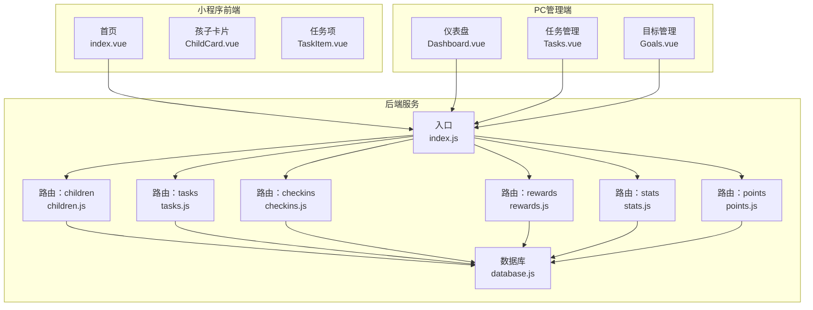

**图示来源**
- [star-park/server/src/index.js:1-42](file://star-park/server/src/index.js#L1-L42)
- [star-park/server/src/database.js:1-90](file://star-park/server/src/database.js#L1-L90)
- [star-park/server/src/routes/children.js:1-88](file://star-park/server/src/routes/children.js#L1-L88)
- [star-park/server/src/routes/tasks.js:1-91](file://star-park/server/src/routes/tasks.js#L1-L91)
- [star-park/server/src/routes/checkins.js:1-90](file://star-park/server/src/routes/checkins.js#L1-L90)
- [star-park/server/src/routes/rewards.js:1-84](file://star-park/server/src/routes/rewards.js#L1-L84)
- [star-park/server/src/routes/stats.js:1-182](file://star-park/server/src/routes/stats.js#L1-L182)
- [star-park/server/src/routes/points.js:1-74](file://star-park/server/src/routes/points.js#L1-L74)
- [star-park/miniprogram/src/pages/index/index.vue:1-194](file://star-park/miniprogram/src/pages/index/index.vue#L1-L194)
- [star-park/miniprogram/src/components/ChildCard.vue:1-162](file://star-park/miniprogram/src/components/ChildCard.vue#L1-L162)
- [star-park/miniprogram/src/components/TaskItem.vue:1-98](file://star-park/miniprogram/src/components/TaskItem.vue#L1-L98)
- [star-park/pc-admin/src/views/Dashboard.vue:1-146](file://star-park/pc-admin/src/views/Dashboard.vue#L1-L146)
- [star-park/pc-admin/src/views/Tasks.vue:1-265](file://star-park/pc-admin/src/views/Tasks.vue#L1-L265)
- [star-park/pc-admin/src/views/Goals.vue:1-686](file://star-park/pc-admin/src/views/Goals.vue#L1-L686)

**章节来源**
- [star-park/server/src/index.js:1-42](file://star-park/server/src/index.js#L1-L42)
- [star-park/server/src/database.js:1-90](file://star-park/server/src/database.js#L1-L90)

## 核心组件
- 孩子管理系统：提供孩子信息查询、余额与交易记录查询、积分余额查询；支持按孩子筛选任务列表。
- 任务管理系统：支持按孩子筛选任务、创建/更新/删除任务；更新时可调整奖励金额、单位与启用状态。
- 打卡系统：支持按日期/孩子筛选打卡记录；创建打卡时根据任务奖励金额发放奖励，写入交易记录并同步更新奖励目标进度。
- 奖励目标管理：支持按孩子筛选目标、创建/更新/删除目标；更新时可调整标题、目标值、当前进度与达成状态。
- 统计分析系统：提供单个孩子统计（连续打卡、周完成率、30日趋势、余额）与仪表盘聚合数据。
- 积分系统：支持按孩子查询积分记录与余额；家长可手动增加/减少积分并实时更新余额。

**章节来源**
- [star-park/server/src/routes/children.js:1-88](file://star-park/server/src/routes/children.js#L1-L88)
- [star-park/server/src/routes/tasks.js:1-91](file://star-park/server/src/routes/tasks.js#L1-L91)
- [star-park/server/src/routes/checkins.js:1-90](file://star-park/server/src/routes/checkins.js#L1-L90)
- [star-park/server/src/routes/rewards.js:1-84](file://star-park/server/src/routes/rewards.js#L1-L84)
- [star-park/server/src/routes/stats.js:1-182](file://star-park/server/src/routes/stats.js#L1-L182)
- [star-park/server/src/routes/points.js:1-74](file://star-park/server/src/routes/points.js#L1-L74)

## 架构总览
后端使用Express注册路由，统一JSON中间件与CORS跨域支持；数据库采用SQLite，建表包含children、tasks、checkins、rewards、transactions、points等表，并在运行期尝试迁移添加points_balance字段。前端包括小程序与PC管理端两套UI，分别通过API与后端交互。

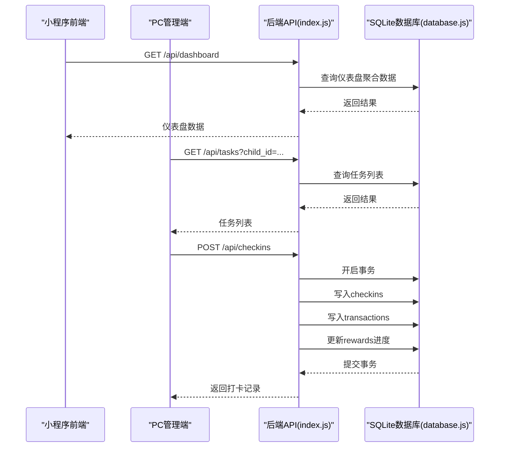

**图示来源**
- [star-park/server/src/index.js:1-42](file://star-park/server/src/index.js#L1-L42)
- [star-park/server/src/database.js:1-90](file://star-park/server/src/database.js#L1-L90)
- [star-park/server/src/routes/checkins.js:30-87](file://star-park/server/src/routes/checkins.js#L30-L87)

**章节来源**
- [star-park/server/src/index.js:1-42](file://star-park/server/src/index.js#L1-L42)
- [star-park/server/src/database.js:1-90](file://star-park/server/src/database.js#L1-L90)

## 详细组件分析

### 孩子管理系统
- 功能要点
  - 获取所有孩子及其任务与余额信息
  - 按孩子查询积分余额
  - 按孩子查询积分交易记录（points表映射为earn/spend类型）
- 数据模型关系
  - children表为主表，points表记录积分变动，transactions表记录奖励/消费流水
- 异常处理
  - 参数校验缺失时返回400
  - 服务器错误返回500

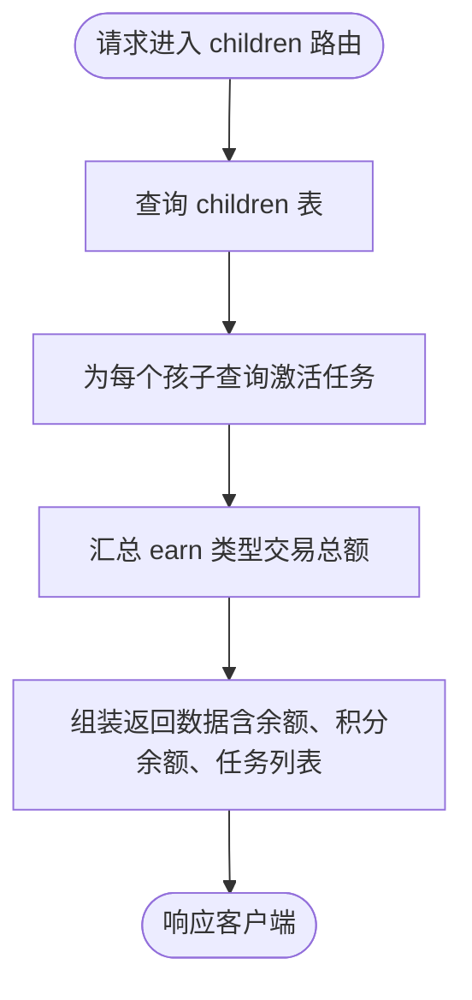

**图示来源**
- [star-park/server/src/routes/children.js:5-37](file://star-park/server/src/routes/children.js#L5-L37)

**章节来源**
- [star-park/server/src/routes/children.js:1-88](file://star-park/server/src/routes/children.js#L1-L88)

### 任务管理系统
- 功能要点
  - 支持按child_id筛选任务列表
  - 创建任务：校验必填项，写入默认奖励金额与单位
  - 更新任务：支持部分字段更新（标题、描述、奖励金额、单位、启用状态）
  - 删除任务：使用事务先清理关联打卡记录，再删除任务
- 数据模型关系
  - tasks表外键关联children表
- 异常处理
  - 任务不存在返回404
  - 参数缺失返回400
  - 服务器错误返回500

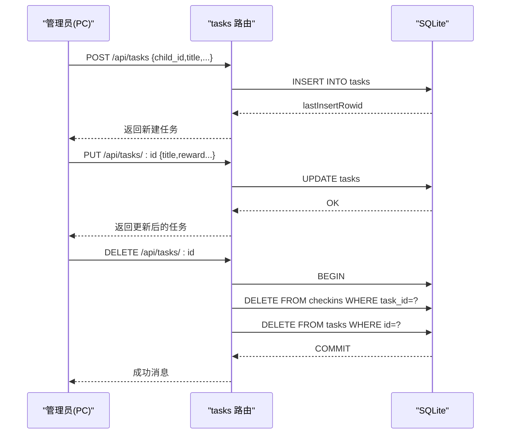

**图示来源**
- [star-park/server/src/routes/tasks.js:21-88](file://star-park/server/src/routes/tasks.js#L21-L88)

**章节来源**
- [star-park/server/src/routes/tasks.js:1-91](file://star-park/server/src/routes/tasks.js#L1-L91)

### 打卡系统
- 功能要点
  - 支持按日期/孩子筛选打卡记录
  - 创建打卡：读取任务奖励金额，若完成则写入checkins、插入earn交易、更新所有未达成奖励目标的current_amount并标记达成
  - 事务保证：上述操作在一个事务内执行，确保一致性
- 数据模型关系
  - checkins表外键关联children与tasks；rewards表记录目标进度
- 异常处理
  - 缺少必填参数返回400
  - 任务不存在返回400
  - 服务器错误返回500

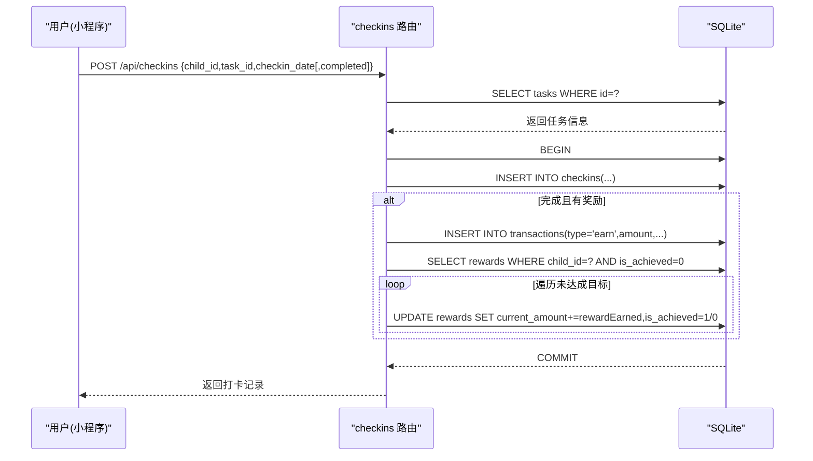

**图示来源**
- [star-park/server/src/routes/checkins.js:30-87](file://star-park/server/src/routes/checkins.js#L30-L87)

**章节来源**
- [star-park/server/src/routes/checkins.js:1-90](file://star-park/server/src/routes/checkins.js#L1-L90)

### 奖励目标管理
- 功能要点
  - 支持按child_id筛选目标列表
  - 创建目标：校验必填项，初始current_amount为0
  - 更新目标：支持标题、目标值、当前进度、达成状态
  - 删除目标：直接删除
- 数据模型关系
  - rewards表外键关联children表
- 异常处理
  - 目标不存在返回404
  - 参数缺失返回400
  - 服务器错误返回500

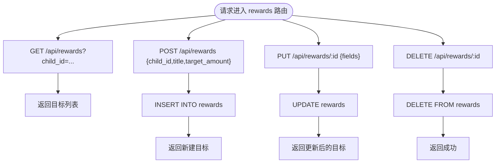

**图示来源**
- [star-park/server/src/routes/rewards.js:5-81](file://star-park/server/src/routes/rewards.js#L5-L81)

**章节来源**
- [star-park/server/src/routes/rewards.js:1-84](file://star-park/server/src/routes/rewards.js#L1-L84)

### 统计分析系统
- 功能要点
  - 单个孩子统计：连续打卡天数（从今天或昨天向前连续）、周完成率（本周应打×天数/实打）、最近30日每日完成数、余额（earn-spent）
  - 仪表盘：按孩子聚合今日打卡、活跃任务、连续打卡、周完成率、余额、未达成奖励目标
- 算法说明
  - 连续打卡：从今天或昨天开始，逐日回溯检查是否存在打卡记录
  - 周完成率：本周应打次数=活跃任务数×周内天数，实际完成次数为completed=1的记录数
  - 30日趋势：填充29天前到今天的每一天，缺失则计为0
- 异常处理
  - 孩子不存在返回404
  - 服务器错误返回500

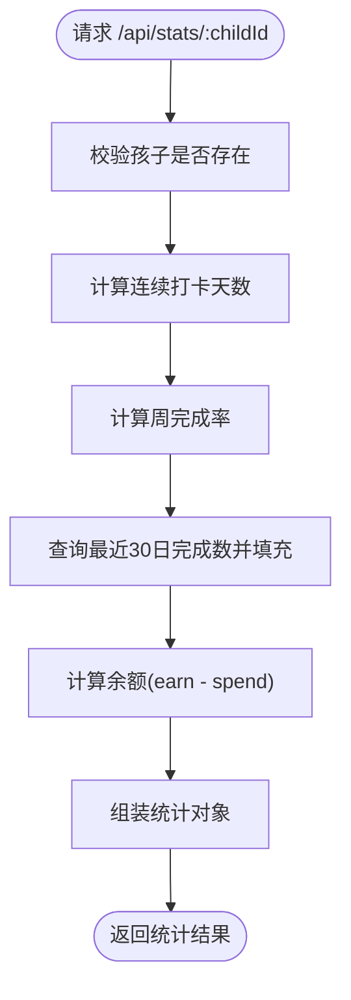

**图示来源**
- [star-park/server/src/routes/stats.js:6-101](file://star-park/server/src/routes/stats.js#L6-L101)

**章节来源**
- [star-park/server/src/routes/stats.js:1-182](file://star-park/server/src/routes/stats.js#L1-L182)

### 积分系统
- 功能要点
  - 按child_id查询积分记录与余额
  - 家长手动增加/减少积分：写入points记录并更新children.points_balance
- 数据模型关系
  - points表外键关联children表
- 异常处理
  - 缺少必填参数返回400
  - 分值非整数或为0返回400
  - 服务器错误返回500

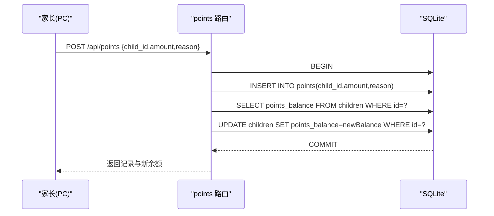

**图示来源**
- [star-park/server/src/routes/points.js:30-72](file://star-park/server/src/routes/points.js#L30-L72)

**章节来源**
- [star-park/server/src/routes/points.js:1-74](file://star-park/server/src/routes/points.js#L1-L74)

### 用户界面与交互流程

#### 小程序首页与卡片
- 首页展示问候语、日期与完成统计，加载仪表盘数据渲染孩子卡片
- 孩子卡片展示姓名、任务描述、打卡状态、连续天数、累计余额
- 任务项展示名称、描述、奖励，支持勾选完成

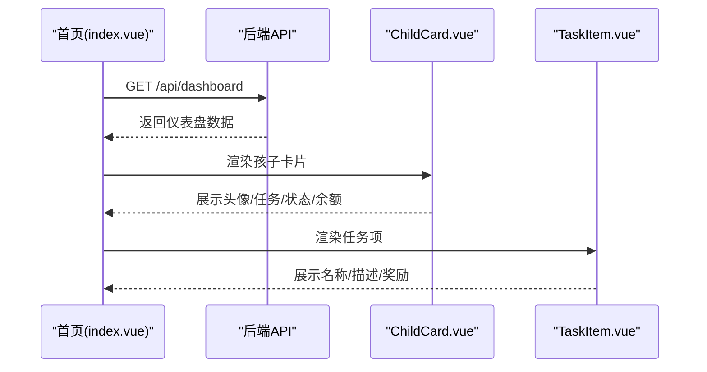

**图示来源**
- [star-park/miniprogram/src/pages/index/index.vue:100-124](file://star-park/miniprogram/src/pages/index/index.vue#L100-L124)
- [star-park/miniprogram/src/components/ChildCard.vue:1-162](file://star-park/miniprogram/src/components/ChildCard.vue#L1-L162)
- [star-park/miniprogram/src/components/TaskItem.vue:1-98](file://star-park/miniprogram/src/components/TaskItem.vue#L1-L98)

**章节来源**
- [star-park/miniprogram/src/pages/index/index.vue:1-194](file://star-park/miniprogram/src/pages/index/index.vue#L1-L194)
- [star-park/miniprogram/src/components/ChildCard.vue:1-162](file://star-park/miniprogram/src/components/ChildCard.vue#L1-L162)
- [star-park/miniprogram/src/components/TaskItem.vue:1-98](file://star-park/miniprogram/src/components/TaskItem.vue#L1-L98)

#### PC管理端仪表盘与任务管理
- 仪表盘展示今日学习进度、快捷操作入口
- 任务管理支持按孩子Tab切换、表格展示任务、对话框新增/编辑任务、删除确认

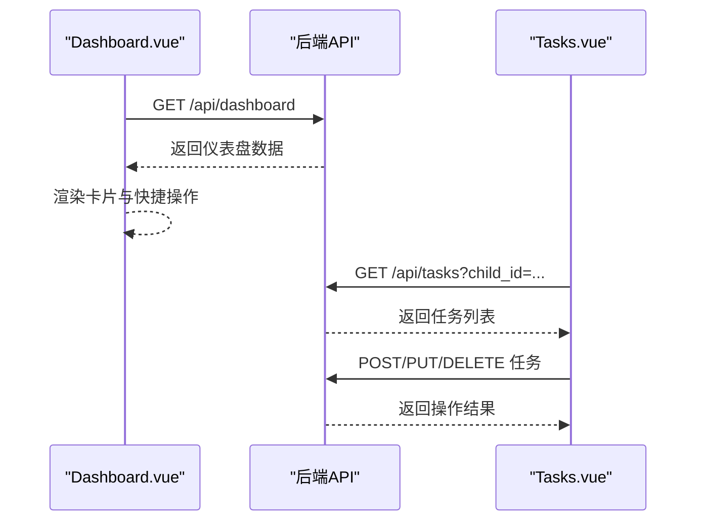

**图示来源**
- [star-park/pc-admin/src/views/Dashboard.vue:76-91](file://star-park/pc-admin/src/views/Dashboard.vue#L76-L91)
- [star-park/pc-admin/src/views/Tasks.vue:203-230](file://star-park/pc-admin/src/views/Tasks.vue#L203-L230)

**章节来源**
- [star-park/pc-admin/src/views/Dashboard.vue:1-146](file://star-park/pc-admin/src/views/Dashboard.vue#L1-L146)
- [star-park/pc-admin/src/views/Tasks.vue:1-265](file://star-park/pc-admin/src/views/Tasks.vue#L1-L265)

#### 目标管理（概念性说明）
- PC端提供目标卡片与待办表格，支持目标状态分类、进度条、待办筛选与优先级标注
- 数据持久化使用localStorage，包含默认示例数据

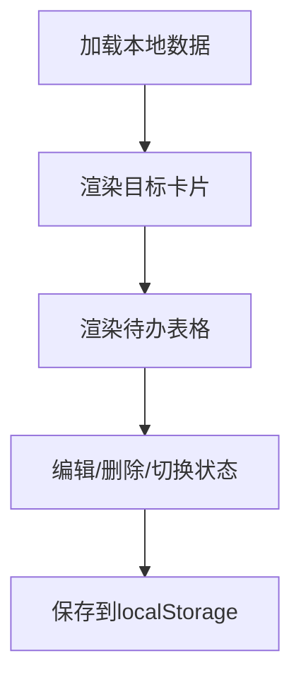

[此图为概念性流程，不对应具体源码文件，故不附“图示来源”]

**章节来源**
- [star-park/pc-admin/src/views/Goals.vue:1-686](file://star-park/pc-admin/src/views/Goals.vue#L1-L686)

## 依赖分析
- 后端依赖
  - Express：提供HTTP服务与路由
  - better-sqlite3：SQLite驱动
  - dayjs：日期时间处理
- 前端依赖
  - 小程序：Vue生态、uni-app框架
  - PC管理端：Vue、Element Plus、路由与状态管理

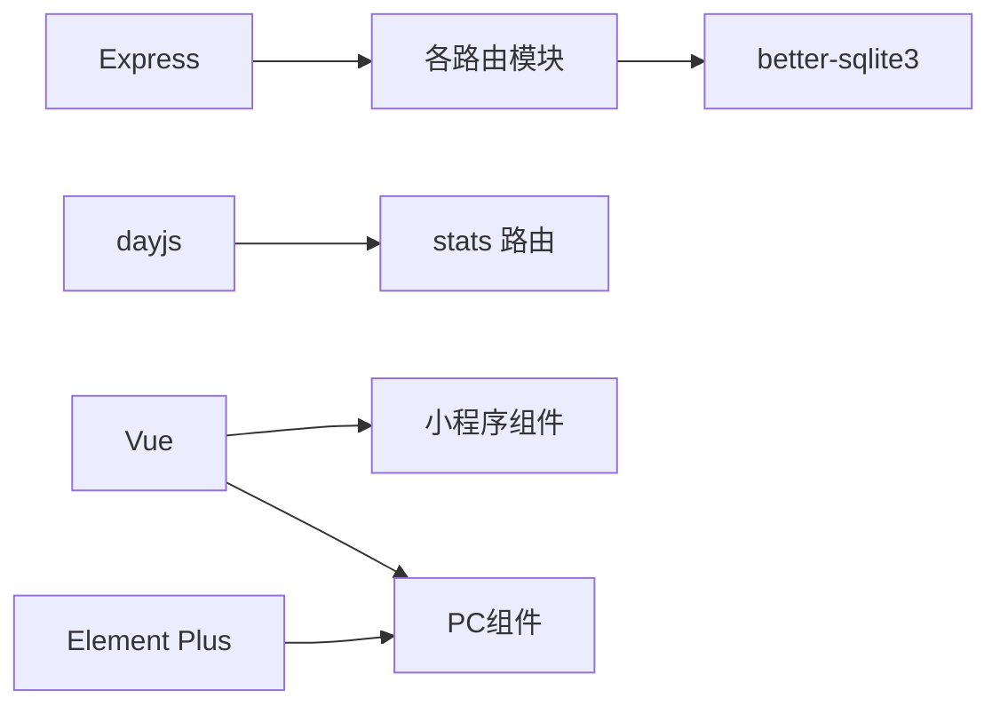

**图示来源**
- [star-park/server/src/index.js:1-42](file://star-park/server/src/index.js#L1-L42)
- [star-park/server/src/routes/stats.js:3-4](file://star-park/server/src/routes/stats.js#L3-L4)
- [star-park/pc-admin/src/main.js:1-22](file://star-park/pc-admin/src/main.js#L1-L22)
- [star-park/miniprogram/src/main.js:1-8](file://star-park/miniprogram/src/main.js#L1-L8)

**章节来源**
- [star-park/server/src/index.js:1-42](file://star-park/server/src/index.js#L1-L42)
- [star-park/pc-admin/src/main.js:1-22](file://star-park/pc-admin/src/main.js#L1-L22)
- [star-park/miniprogram/src/main.js:1-8](file://star-park/miniprogram/src/main.js#L1-L8)

## 性能考虑
- 数据库模式
  - 启用WAL模式与外键约束，提升并发与一致性
  - 建表时对常用查询字段建立索引（如checkins的child_id、task_id、checkin_date）
- 查询优化
  - 按需筛选：children按id排序、tasks按child_id筛选、checkins按日期/child_id筛选
  - 聚合查询：使用COALESCE与SUM避免NULL影响
- 事务保障
  - 打卡与积分变更均使用事务，确保原子性
- 前端缓存
  - PC端使用Pinia状态管理，减少重复请求
  - 小程序在onShow时刷新数据，保证最新状态

[本节为通用性能建议，不直接分析具体代码文件，故不附“章节来源”]

## 故障排查指南
- 常见错误与定位
  - 400错误：检查必填字段（如name、child_id、title、reward_amount、checkin_date、amount等）
  - 404错误：确认资源是否存在（任务、目标、孩子）
  - 500错误：查看后端日志，定位SQL执行异常或事务回滚问题
- 排查步骤
  - 确认数据库文件存在且路径正确
  - 检查路由参数与请求体格式
  - 在事务块中逐步验证插入/更新顺序
- 建议
  - 对外键约束失败进行显式判断与提示
  - 对数值型字段进行类型与范围校验

**章节来源**
- [star-park/server/src/routes/children.js:40-54](file://star-park/server/src/routes/children.js#L40-L54)
- [star-park/server/src/routes/tasks.js:21-36](file://star-park/server/src/routes/tasks.js#L21-L36)
- [star-park/server/src/routes/checkins.js:30-44](file://star-park/server/src/routes/checkins.js#L30-L44)
- [star-park/server/src/routes/rewards.js:21-36](file://star-park/server/src/routes/rewards.js#L21-L36)
- [star-park/server/src/routes/points.js:30-41](file://star-park/server/src/routes/points.js#L30-L41)

## 结论
StarParadise通过清晰的模块划分与一致的事务处理，实现了从任务到打卡再到统计与激励的闭环。后端以SQLite为基础，配合Express路由与事务保障，满足家庭日常激励场景的数据需求；前端通过小程序与PC管理端提供直观的操作体验。后续可在现有基础上扩展更多激励维度（如多币种奖励、排行榜、导出报表等），并持续优化查询与缓存策略。

[本节为总结性内容，不直接分析具体代码文件，故不附“章节来源”]

## 附录
- API概览（路径与方法）
  - 孩子：GET /api/children、POST /api/children、GET /api/children/:id/balance、GET /api/children/:id/transactions
  - 任务：GET /api/tasks、POST /api/tasks、PUT /api/tasks/:id、DELETE /api/tasks/:id
  - 打卡：GET /api/checkins、POST /api/checkins
  - 奖励目标：GET /api/rewards、POST /api/rewards、PUT /api/rewards/:id、DELETE /api/rewards/:id
  - 统计：GET /api/stats/:childId、GET /api/dashboard
  - 积分：GET /api/points、POST /api/points

[本节为概览性内容，不直接分析具体代码文件，故不附“章节来源”]