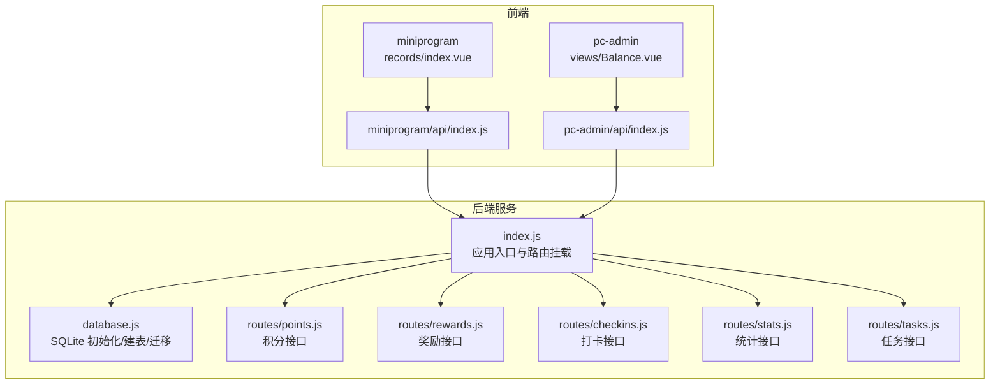
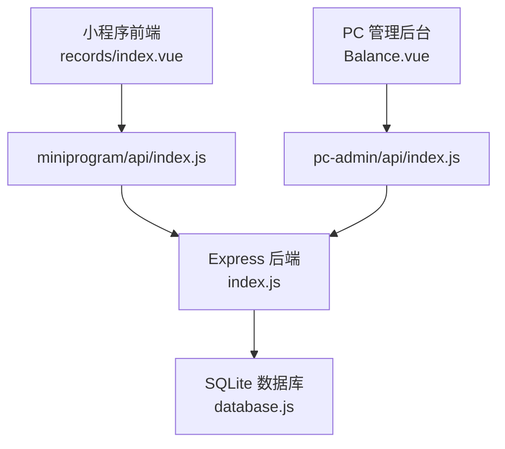
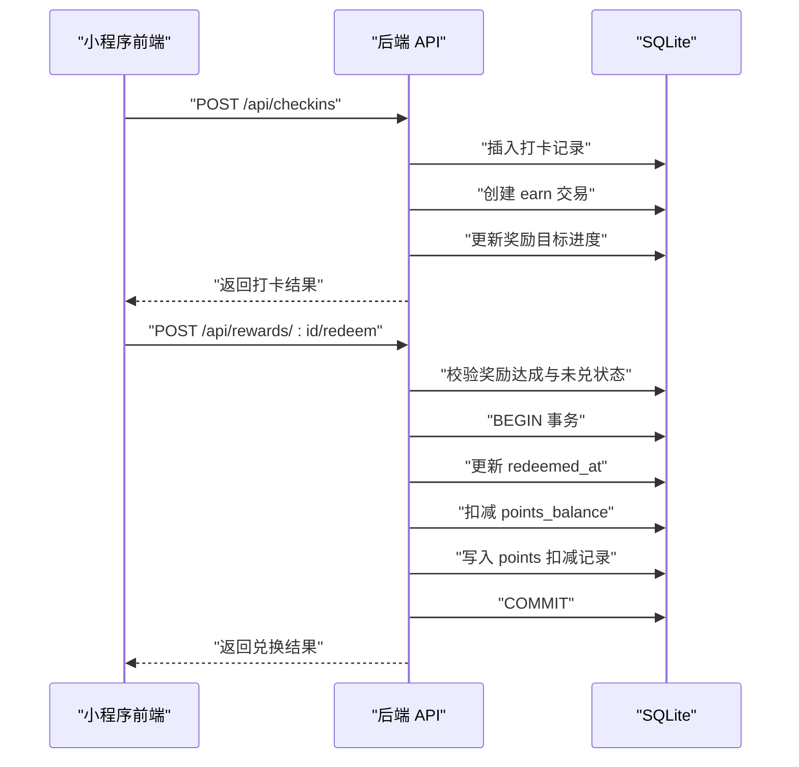
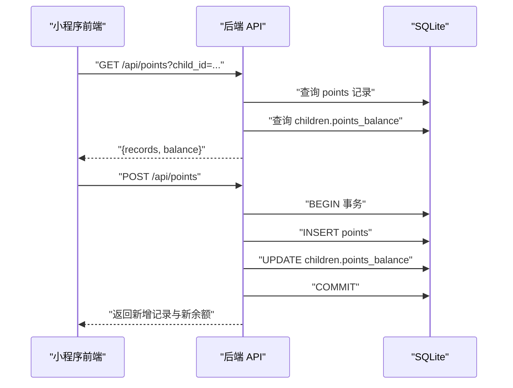
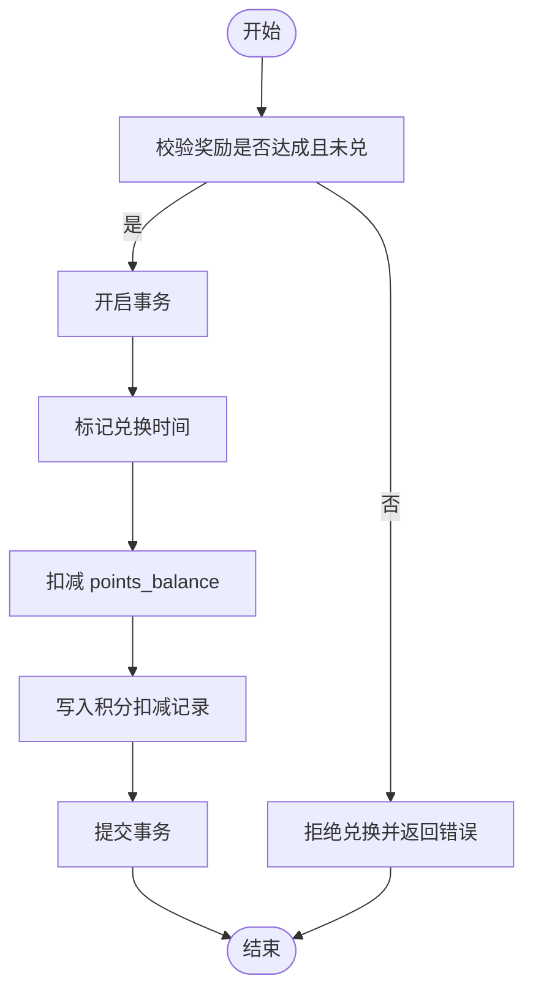
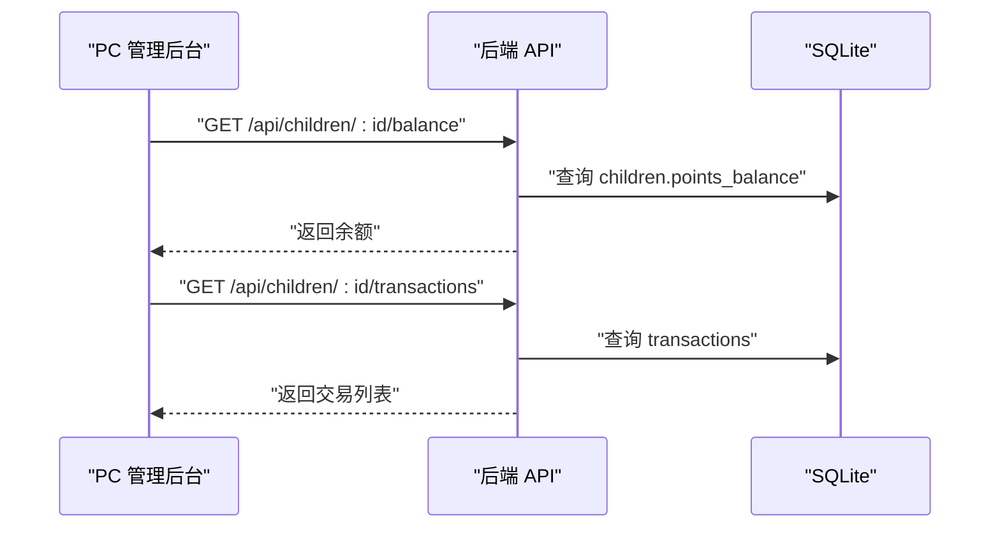
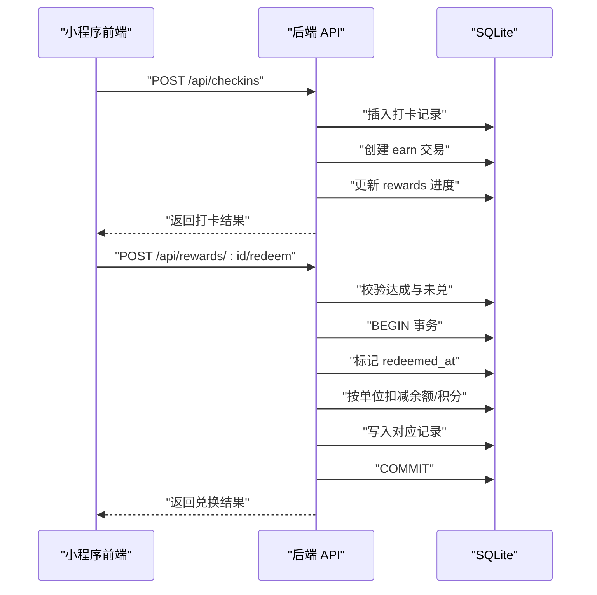
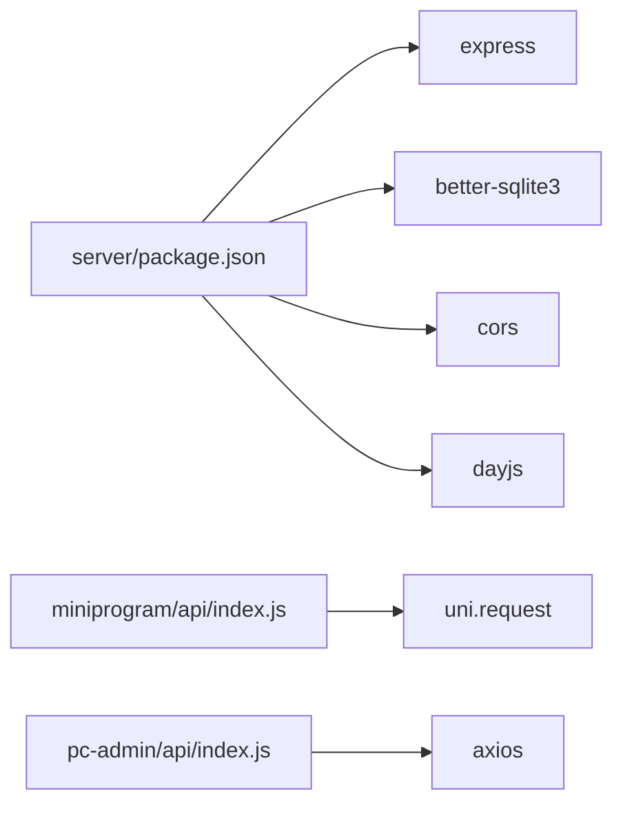

# 积分奖励系统

<cite>
**本文引用的文件**
- [star-park/server/src/index.js](file://star-park/server/src/index.js)
- [star-park/server/src/database.js](file://star-park/server/src/database.js)
- [star-park/server/src/routes/points.js](file://star-park/server/src/routes/points.js)
- [star-park/server/src/routes/rewards.js](file://star-park/server/src/routes/rewards.js)
- [star-park/server/src/routes/checkins.js](file://star-park/server/src/routes/checkins.js)
- [star-park/server/src/routes/stats.js](file://star-park/server/src/routes/stats.js)
- [star-park/server/src/routes/tasks.js](file://star-park/server/src/routes/tasks.js)
- [star-park/server/package.json](file://star-park/server/package.json)
- [star-park/miniprogram/src/api/index.js](file://star-park/miniprogram/src/api/index.js)
- [star-park/pc-admin/src/api/index.js](file://star-park/pc-admin/src/api/index.js)
- [star-park/miniprogram/src/pages/records/index.vue](file://star-park/miniprogram/src/pages/records/index.vue)
- [star-park/pc-admin/src/views/Balance.vue](file://star-park/pc-admin/src/views/Balance.vue)
- [docs/api.md](file://docs/api.md)
- [docs/design-docs/server.md](file://docs/design-docs/server.md)
- [star-park/README.md](file://star-park/README.md)
</cite>

## 目录
1. [引言](#引言)
2. [项目结构](#项目结构)
3. [核心组件](#核心组件)
4. [架构总览](#架构总览)
5. [详细组件分析](#详细组件分析)
6. [依赖分析](#依赖分析)
7. [性能考虑](#性能考虑)
8. [故障排查指南](#故障排查指南)
9. [结论](#结论)
10. [附录](#附录)

## 引言
本文件面向“积分奖励系统”的功能与实现进行全面说明，覆盖以下方面：
- 积分规则设计：积分获取方式、积分消耗规则、积分有效期管理
- 积分记录管理：积分变动记录、积分来源追踪、积分使用明细
- 行为激励机制：正向激励、负向激励、积分抵扣
- 余额计算：实时余额更新、历史记录查询、积分流水管理
- 系统 API 接口：积分增减、余额查询、交易记录获取
- 安全策略、防刷机制与异常处理
- 积分系统与奖励系统的集成关系

本系统基于 Node.js + Express + SQLite 的轻量架构，提供 RESTful API，支持 PC 管理后台与小程序前端。

## 项目结构
后端采用模块化路由组织，数据库初始化与迁移在启动时执行；前端分为 PC 管理后台与小程序两套界面，均通过统一的后端 API 进行交互。

**图表来源**
- [star-park/server/src/index.js:1-42](file://star-park/server/src/index.js#L1-L42)
- [star-park/server/src/database.js:1-111](file://star-park/server/src/database.js#L1-L111)
- [star-park/server/src/routes/points.js:1-74](file://star-park/server/src/routes/points.js#L1-L74)
- [star-park/server/src/routes/rewards.js:1-167](file://star-park/server/src/routes/rewards.js#L1-L167)
- [star-park/server/src/routes/checkins.js:1-90](file://star-park/server/src/routes/checkins.js#L1-L90)
- [star-park/server/src/routes/stats.js:1-182](file://star-park/server/src/routes/stats.js#L1-L182)
- [star-park/server/src/routes/tasks.js:1-91](file://star-park/server/src/routes/tasks.js#L1-L91)
- [star-park/miniprogram/src/pages/records/index.vue:1-460](file://star-park/miniprogram/src/pages/records/index.vue#L1-L460)
- [star-park/pc-admin/src/views/Balance.vue:1-173](file://star-park/pc-admin/src/views/Balance.vue#L1-L173)
- [star-park/miniprogram/src/api/index.js:1-75](file://star-park/miniprogram/src/api/index.js#L1-L75)
- [star-park/pc-admin/src/api/index.js:1-56](file://star-park/pc-admin/src/api/index.js#L1-L56)

**章节来源**
- [star-park/README.md:1-180](file://star-park/README.md#L1-L180)
- [docs/design-docs/server.md:1-135](file://docs/design-docs/server.md#L1-L135)

## 核心组件
- 数据库层：SQLite（better-sqlite3），包含 children、tasks、checkins、rewards、transactions、points 等表，并在启动时进行迁移与初始化。
- 路由层：积分(points)、奖励(rewards)、打卡(checkins)、统计(stats)、任务(tasks)等模块化路由。
- 前端层：PC 管理后台（余额与流水）、小程序（打卡记录与余额概览）。
- API 文档：统一的接口规范与示例，便于前后端协作。

**章节来源**
- [star-park/server/src/database.js:18-111](file://star-park/server/src/database.js#L18-L111)
- [star-park/server/src/index.js:20-27](file://star-park/server/src/index.js#L20-L27)
- [docs/api.md:1-253](file://docs/api.md#L1-L253)

## 架构总览
系统采用“前端页面 + 统一后端 API + SQLite 数据库”的三层架构。后端通过 Express 暴露 RESTful 接口，前端通过封装的 API 模块调用后端接口。

**图表来源**
- [star-park/miniprogram/src/pages/records/index.vue:1-460](file://star-park/miniprogram/src/pages/records/index.vue#L1-L460)
- [star-park/pc-admin/src/views/Balance.vue:1-173](file://star-park/pc-admin/src/views/Balance.vue#L1-L173)
- [star-park/miniprogram/src/api/index.js:1-75](file://star-park/miniprogram/src/api/index.js#L1-L75)
- [star-park/pc-admin/src/api/index.js:1-56](file://star-park/pc-admin/src/api/index.js#L1-L56)
- [star-park/server/src/index.js:13-42](file://star-park/server/src/index.js#L13-L42)
- [star-park/server/src/database.js:10-111](file://star-park/server/src/database.js#L10-L111)

## 详细组件分析

### 积分规则与余额计算
- 积分获取：通过完成任务打卡自动产生收益记录（earn），并联动更新奖励目标进度。积分记录表 points 用于追踪积分来源与去向。
- 积分消耗：目前系统主要通过“奖励兑换”实现积分抵扣，当奖励单位为“积分”时，兑换会直接扣减 children 表中的 points_balance，并生成对应的 points 记录。
- 余额计算：children 表维护 points_balance 字段，积分增减通过事务保证一致性；同时提供积分记录查询接口，便于审计与溯源。

**图表来源**
- [star-park/server/src/routes/checkins.js:31-87](file://star-park/server/src/routes/checkins.js#L31-L87)
- [star-park/server/src/routes/rewards.js:89-164](file://star-park/server/src/routes/rewards.js#L89-L164)

**章节来源**
- [star-park/server/src/routes/checkins.js:31-87](file://star-park/server/src/routes/checkins.js#L31-L87)
- [star-park/server/src/routes/rewards.js:89-164](file://star-park/server/src/routes/rewards.js#L89-L164)
- [star-park/server/src/database.js:72-79](file://star-park/server/src/database.js#L72-L79)

### 积分记录管理
- 积分记录接口：支持按 child_id 查询积分明细与当前余额，返回 records 与 balance。
- 手动增减：家长可通过 POST /api/points 对指定 child_id 进行积分增减，系统在事务中插入积分记录并同步更新 children.points_balance。
- 前端展示：小程序“打卡记录”页展示打卡明细与积分变化；PC 管理后台“积分记录”页展示余额与交易流水。

**图表来源**
- [star-park/server/src/routes/points.js:5-74](file://star-park/server/src/routes/points.js#L5-L74)
- [star-park/miniprogram/src/pages/records/index.vue:127-163](file://star-park/miniprogram/src/pages/records/index.vue#L127-L163)
- [star-park/pc-admin/src/views/Balance.vue:88-105](file://star-park/pc-admin/src/views/Balance.vue#L88-L105)

**章节来源**
- [star-park/server/src/routes/points.js:5-74](file://star-park/server/src/routes/points.js#L5-L74)
- [star-park/miniprogram/src/pages/records/index.vue:127-163](file://star-park/miniprogram/src/pages/records/index.vue#L127-L163)
- [star-park/pc-admin/src/views/Balance.vue:88-105](file://star-park/pc-admin/src/views/Balance.vue#L88-L105)

### 行为激励机制
- 正向激励：完成任务打卡后自动产生 earn 交易与积分记录，推动持续行为。
- 负向激励：系统未内置负向积分抵扣逻辑；如需实现，可在业务上扩展“惩罚性消费”场景并通过积分扣减实现。
- 积分抵扣：当奖励单位为“积分”时，兑换奖励会直接扣减 children.points_balance，并生成对应的扣减记录，形成闭环。

**图表来源**
- [star-park/server/src/routes/rewards.js:89-164](file://star-park/server/src/routes/rewards.js#L89-L164)

**章节来源**
- [star-park/server/src/routes/rewards.js:89-164](file://star-park/server/src/routes/rewards.js#L89-L164)

### 余额与流水管理
- 余额来源：earn 交易（完成任务）与手动积分增减；支出类交易在其他模块中体现。
- 流水查询：提供按 child_id 查询交易记录的接口，支持筛选类型（如 money）。
- 前端展示：PC 管理后台“积分记录”页展示余额与交易流水；小程序“打卡记录”页展示打卡明细与余额概览。

**图表来源**
- [star-park/pc-admin/src/views/Balance.vue:88-105](file://star-park/pc-admin/src/views/Balance.vue#L88-L105)
- [docs/api.md:74-83](file://docs/api.md#L74-L83)

**章节来源**
- [star-park/pc-admin/src/views/Balance.vue:88-105](file://star-park/pc-admin/src/views/Balance.vue#L88-L105)
- [docs/api.md:74-83](file://docs/api.md#L74-L83)

### 积分系统与奖励系统的集成
- 奖励目标进度：完成任务后自动更新 rewards 表的 current_amount 与 is_achieved。
- 兑换流程：当奖励达成且未兑时，按 reward_unit（元/积分）执行相应扣减，并记录 redeemed_at。
- 数据一致性：所有涉及余额与进度的操作均在事务中执行，避免并发导致的数据不一致。

**图表来源**
- [star-park/server/src/routes/checkins.js:31-87](file://star-park/server/src/routes/checkins.js#L31-L87)
- [star-park/server/src/routes/rewards.js:89-164](file://star-park/server/src/routes/rewards.js#L89-L164)

**章节来源**
- [star-park/server/src/routes/checkins.js:31-87](file://star-park/server/src/routes/checkins.js#L31-L87)
- [star-park/server/src/routes/rewards.js:89-164](file://star-park/server/src/routes/rewards.js#L89-L164)

## 依赖分析
- 后端依赖：Express、better-sqlite3、CORS、dayjs。
- 前端依赖：axios（PC 端）、uni.request（小程序端）。
- 数据库：SQLite（WAL 模式、外键约束），自动迁移与初始化。

**图表来源**
- [star-park/server/package.json:1-15](file://star-park/server/package.json#L1-L15)
- [star-park/miniprogram/src/api/index.js:1-75](file://star-park/miniprogram/src/api/index.js#L1-L75)
- [star-park/pc-admin/src/api/index.js:1-56](file://star-park/pc-admin/src/api/index.js#L1-L56)

**章节来源**
- [star-park/server/package.json:1-15](file://star-park/server/package.json#L1-L15)
- [star-park/miniprogram/src/api/index.js:1-75](file://star-park/miniprogram/src/api/index.js#L1-L75)
- [star-park/pc-admin/src/api/index.js:1-56](file://star-park/pc-admin/src/api/index.js#L1-L56)

## 性能考虑
- 数据库模式：启用 WAL 模式与外键约束，提升并发读写与数据一致性。
- 事务保护：积分增减与奖励兑换均在事务中执行，避免部分更新。
- 查询优化：按 child_id 与日期等维度进行过滤，减少扫描范围。
- 前端缓存：小程序与 PC 端在本地缓存基础数据，降低重复请求。

**章节来源**
- [star-park/server/src/database.js:13-16](file://star-park/server/src/database.js#L13-L16)
- [star-park/server/src/routes/points.js:43-57](file://star-park/server/src/routes/points.js#L43-L57)
- [star-park/server/src/routes/rewards.js:107-154](file://star-park/server/src/routes/rewards.js#L107-L154)

## 故障排查指南
- 常见错误与处理
  - 400：缺少必填参数或参数非法（如 child_id、amount、reason 等）。请检查请求体与查询参数。
  - 404：资源不存在（如任务、奖励、孩子）。请确认 ID 有效。
  - 500：服务器内部错误。检查数据库连接与 SQL 语法。
- 兑换失败排查
  - 奖励未达成或已兑换：检查 is_achieved 与 redeemed_at 字段。
  - 余额不足：当奖励单位为“元”时，检查 transactions 中的余额；当单位为“积分”时，检查 children.points_balance。
- 前端提示
  - 小程序与 PC 端均对网络请求失败进行提示，可在控制台查看具体错误信息。

**章节来源**
- [docs/api.md:246-253](file://docs/api.md#L246-L253)
- [star-park/server/src/routes/rewards.js:97-164](file://star-park/server/src/routes/rewards.js#L97-L164)
- [star-park/miniprogram/src/api/index.js:24-29](file://star-park/miniprogram/src/api/index.js#L24-L29)
- [star-park/pc-admin/src/api/index.js:12-19](file://star-park/pc-admin/src/api/index.js#L12-L19)

## 结论
本积分奖励系统以 SQLite 为核心，结合 Express 提供的 RESTful 接口，实现了从“任务打卡—积分收益—奖励目标—兑换抵扣”的完整闭环。系统具备良好的事务一致性、清晰的职责划分与直观的前端展示，适合家庭场景下的行为激励与财务教育实践。后续可根据需要扩展积分有效期、风控策略与审计日志等能力。

## 附录

### API 接口清单（节选）
- 健康检查：GET /api/health
- 获取积分记录：GET /api/points?child_id=...
- 添加积分：POST /api/points
- 获取余额：GET /api/children/:id/balance
- 获取交易记录：GET /api/children/:id/transactions
- 兑换奖励：POST /api/rewards/:id/redeem

**章节来源**
- [docs/api.md:18-253](file://docs/api.md#L18-L253)