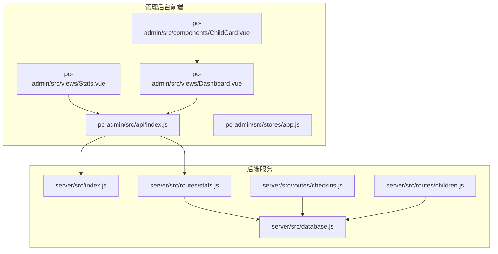
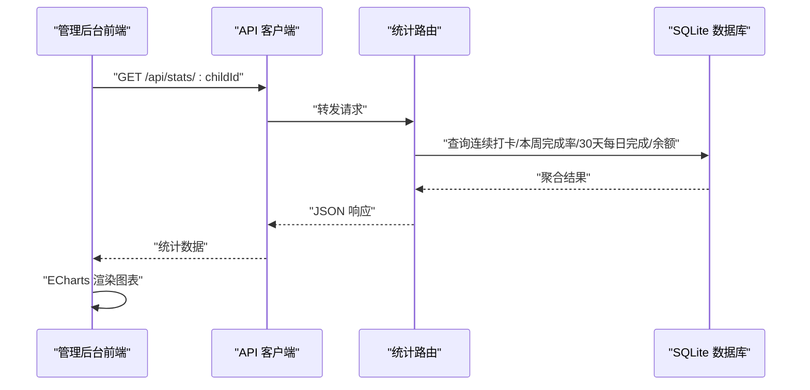
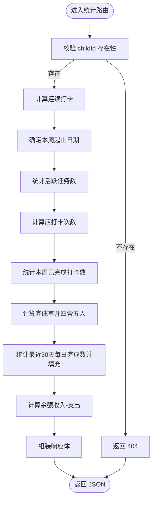
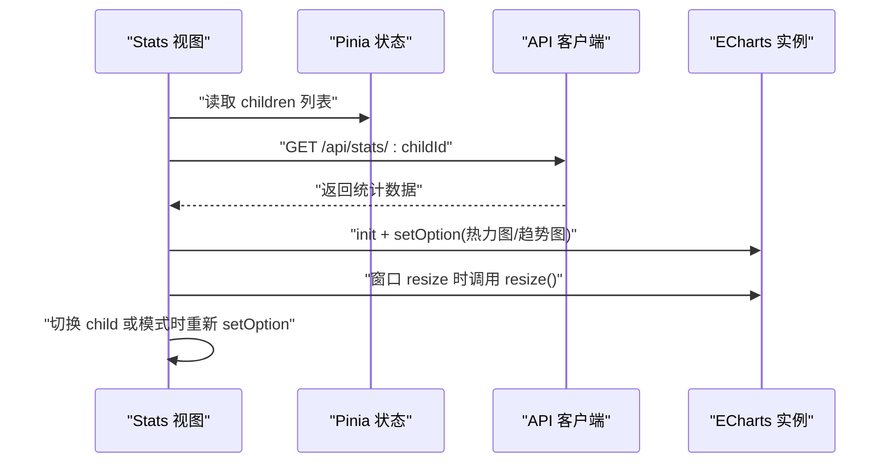
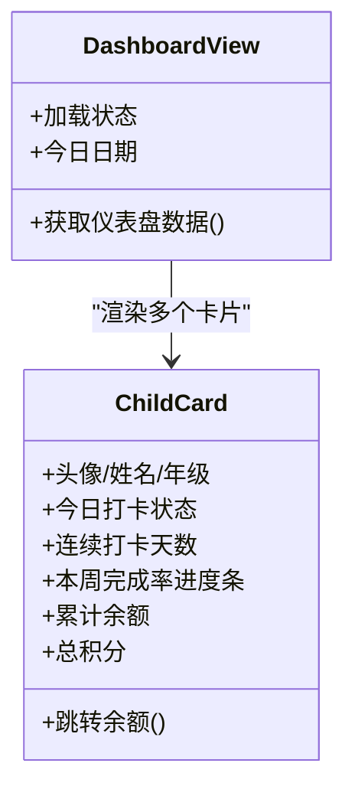
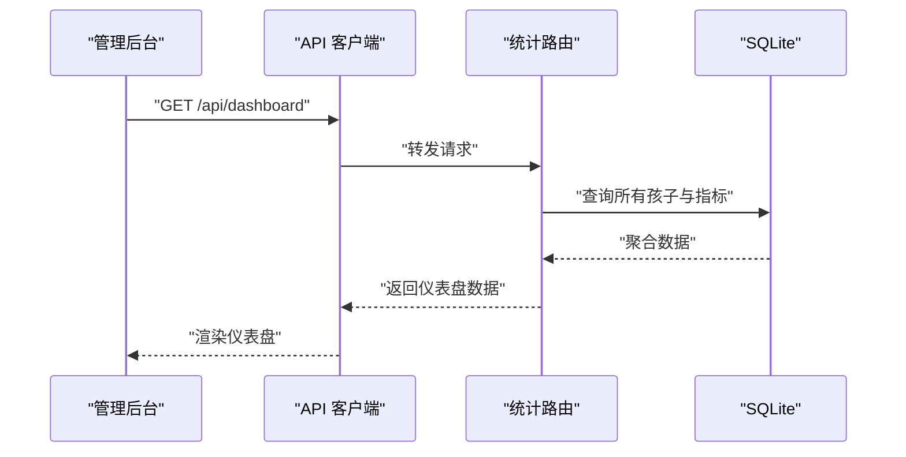
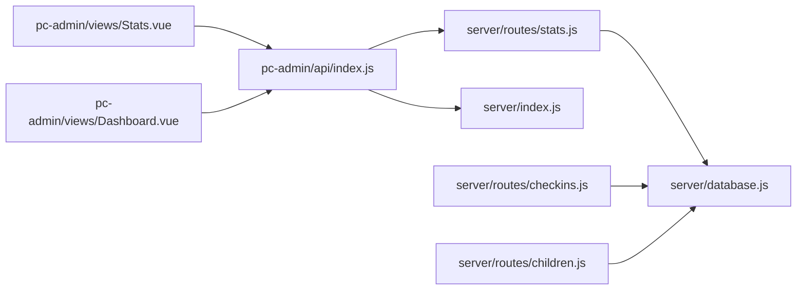

# 统计分析系统

<cite>
**本文引用的文件**
- [star-park/server/src/routes/stats.js](file://star-park/server/src/routes/stats.js)
- [star-park/server/src/routes/checkins.js](file://star-park/server/src/routes/checkins.js)
- [star-park/server/src/routes/children.js](file://star-park/server/src/routes/children.js)
- [star-park/server/src/database.js](file://star-park/server/src/database.js)
- [star-park/pc-admin/src/views/Stats.vue](file://star-park/pc-admin/src/views/Stats.vue)
- [star-park/pc-admin/src/views/Dashboard.vue](file://star-park/pc-admin/src/views/Dashboard.vue)
- [star-park/pc-admin/src/components/ChildCard.vue](file://star-park/pc-admin/src/components/ChildCard.vue)
- [star-park/pc-admin/src/api/index.js](file://star-park/pc-admin/src/api/index.js)
- [star-park/pc-admin/src/stores/app.js](file://star-park/pc-admin/src/stores/app.js)
- [docs/api.md](file://docs/api.md)
- [docs/ARCHITECTURE.md](file://docs/ARCHITECTURE.md)
- [star-park/README.md](file://star-park/README.md)
</cite>

## 目录
1. [引言](#引言)
2. [项目结构](#项目结构)
3. [核心组件](#核心组件)
4. [架构总览](#架构总览)
5. [详细组件分析](#详细组件分析)
6. [依赖关系分析](#依赖关系分析)
7. [性能考虑](#性能考虑)
8. [故障排查指南](#故障排查指南)
9. [结论](#结论)
10. [附录](#附录)

## 引言
本文件面向“统计分析系统”的功能与实现，围绕以下目标展开：
- 深入解析数据聚合算法：连续打卡统计、本周完成率分析、收支平衡报表、30天每日完成情况等指标的计算方法
- 详述图表可视化实现：ECharts配置、数据格式转换、动态更新机制
- 说明报表生成功能：统计数据的导出、打印、分享等操作建议
- 解释仪表盘设计：关键指标展示、趋势分析、异常提醒
- 提供统计API接口文档：GET /api/stats/:childId、GET /api/dashboard 等
- 给出数据准确性验证与性能优化策略

## 项目结构
系统采用前后端分离的 monorepo 架构，后端基于 Express + SQLite，前端包含管理后台（PC 端）与小程序端。统计分析主要集中在后端统计路由与管理后台的统计视图。

**图表来源**
- [docs/ARCHITECTURE.md:14-71](file://docs/ARCHITECTURE.md#L14-L71)
- [star-park/README.md:23-71](file://star-park/README.md#L23-L71)

**章节来源**
- [docs/ARCHITECTURE.md:10-71](file://docs/ARCHITECTURE.md#L10-L71)
- [star-park/README.md:13-71](file://star-park/README.md#L13-L71)

## 核心组件
- 后端统计路由：负责计算连续打卡、本周完成率、30天每日完成情况、余额等指标，并提供仪表盘聚合数据
- 前端统计视图：使用 ECharts 展示热力图与趋势图，支持按周/月切换
- 前端仪表盘视图：展示每个孩子的今日打卡、连续打卡、本周完成率、余额、积分等关键指标
- API 客户端：封装 /api/stats/:childId 与 /api/dashboard 的调用
- 数据库：SQLite 表结构包含 children、tasks、checkins、rewards、transactions 等

**章节来源**
- [star-park/server/src/routes/stats.js:6-182](file://star-park/server/src/routes/stats.js#L6-L182)
- [star-park/pc-admin/src/views/Stats.vue:1-291](file://star-park/pc-admin/src/views/Stats.vue#L1-L291)
- [star-park/pc-admin/src/views/Dashboard.vue:1-146](file://star-park/pc-admin/src/views/Dashboard.vue#L1-L146)
- [star-park/pc-admin/src/api/index.js:41-45](file://star-park/pc-admin/src/api/index.js#L41-L45)
- [star-park/server/src/database.js:17-80](file://star-park/server/src/database.js#L17-L80)

## 架构总览
后端通过路由处理统计请求，查询 SQLite 数据库并返回聚合结果；前端通过 API 客户端发起请求，渲染 ECharts 图表与仪表盘卡片。

**图表来源**
- [star-park/server/src/routes/stats.js:6-101](file://star-park/server/src/routes/stats.js#L6-L101)
- [star-park/pc-admin/src/api/index.js:41-42](file://star-park/pc-admin/src/api/index.js#L41-L42)
- [star-park/pc-admin/src/views/Stats.vue:68-82](file://star-park/pc-admin/src/views/Stats.vue#L68-L82)

**章节来源**
- [docs/ARCHITECTURE.md:117-143](file://docs/ARCHITECTURE.md#L117-L143)
- [star-park/README.md:13-20](file://star-park/README.md#L13-L20)

## 详细组件分析

### 统计数据聚合算法
本节详解后端统计路由中的核心算法与数据来源。

- 连续打卡统计（从今天向前回溯）
  - 步骤：获取该孩子所有打卡日期，若今天无打卡则从昨天开始回溯；使用集合快速判断某日是否存在打卡；逐日递减直到断档为止
  - 关键点：日期格式统一为 YYYY-MM-DD；断档即停止累加
  - 参考实现位置：[连续打卡计算:17-36](file://star-park/server/src/routes/stats.js#L17-L36)

- 本周完成率分析
  - 步骤：计算周起始与结束日期；统计活跃任务数；计算应打卡次数（活跃任务数 × 从周初到今天的自然日数）；统计本周已完成打卡数；计算完成率并四舍五入
  - 关键点：应打卡次数随周内自然日数变化；完成率仅统计 completed=1 的记录
  - 参考实现位置：[本周完成率计算:38-56](file://star-park/server/src/routes/stats.js#L38-L56)

- 30天每日完成情况
  - 步骤：计算29天前的日期；按日分组统计已完成的打卡数量；填充缺失日期，默认计数为0
  - 关键点：输出数组长度固定为30；日期严格按自然日顺序排列
  - 参考实现位置：[30天每日完成情况:58-77](file://star-park/server/src/routes/stats.js#L58-L77)

- 收支平衡报表（余额）
  - 步骤：统计 earn 类型交易总额与 spend/redeem 类型交易总额；余额=收入-支出
  - 关键点：支出类型包含 redeem（兑换奖励）；使用 COALESCE 防止空值
  - 参考实现位置：[余额计算:79-86](file://star-park/server/src/routes/stats.js#L79-L86)

- 仪表盘全局统计
  - 步骤：遍历所有孩子，计算今日打卡、连续打卡、本周完成率、余额、奖励目标等
  - 关键点：与单人统计一致的算法，但批量处理
  - 参考实现位置：[仪表盘聚合:103-179](file://star-park/server/src/routes/stats.js#L103-L179)

**图表来源**
- [star-park/server/src/routes/stats.js:6-101](file://star-park/server/src/routes/stats.js#L6-L101)

**章节来源**
- [star-park/server/src/routes/stats.js:6-101](file://star-park/server/src/routes/stats.js#L6-L101)

### 图表可视化实现（ECharts）
管理后台统计视图通过 ECharts 实现两类图表：最近30天打卡热力图与完成率趋势图。

- 日历热力图
  - 数据准备：生成最近30天日期序列，从统计数据中取值，缺失补0
  - 配置要点：xAxis 使用 MM/DD 标签旋转显示；yAxis 为数值轴；柱状条按值设置不同透明度的颜色；柱宽适配
  - 动态更新：选择不同孩子后重新渲染
  - 参考实现位置：[热力图渲染:84-151](file://star-park/pc-admin/src/views/Stats.vue#L84-L151)

- 完成率趋势图
  - 数据准备：支持按周/月两种模式；若无趋势数据则生成示例标签
  - 配置要点：折线平滑、带面积填充、坐标轴格式化、百分比刻度
  - 动态更新：切换趋势模式后重新渲染
  - 参考实现位置：[趋势图渲染:153-242](file://star-park/pc-admin/src/views/Stats.vue#L153-L242)

**图表来源**
- [star-park/pc-admin/src/views/Stats.vue:39-82](file://star-park/pc-admin/src/views/Stats.vue#L39-L82)
- [star-park/pc-admin/src/api/index.js:41-42](file://star-park/pc-admin/src/api/index.js#L41-L42)

**章节来源**
- [star-park/pc-admin/src/views/Stats.vue:18-35](file://star-park/pc-admin/src/views/Stats.vue#L18-L35)
- [star-park/pc-admin/src/views/Stats.vue:84-151](file://star-park/pc-admin/src/views/Stats.vue#L84-L151)
- [star-park/pc-admin/src/views/Stats.vue:153-242](file://star-park/pc-admin/src/views/Stats.vue#L153-L242)

### 仪表盘设计
仪表盘首页展示每个孩子的关键指标，便于家长快速掌握整体进度。

- 孩子卡片组件
  - 展示：头像、姓名、年级、今日打卡状态、连续打卡天数、本周完成率进度条、累计余额、总积分
  - 交互：点击积分值跳转到余额管理
  - 参考实现位置：[ChildCard 组件:1-161](file://star-park/pc-admin/src/components/ChildCard.vue#L1-L161)

- 仪表盘视图
  - 数据来源：GET /api/dashboard 返回每个孩子的聚合指标
  - 快捷操作：前往打卡、任务管理、奖励管理、统计页面
  - 参考实现位置：[Dashboard 视图:1-146](file://star-park/pc-admin/src/views/Dashboard.vue#L1-L146)

**图表来源**
- [star-park/pc-admin/src/views/Dashboard.vue:1-92](file://star-park/pc-admin/src/views/Dashboard.vue#L1-L92)
- [star-park/pc-admin/src/components/ChildCard.vue:1-161](file://star-park/pc-admin/src/components/ChildCard.vue#L1-L161)

**章节来源**
- [star-park/pc-admin/src/views/Dashboard.vue:1-92](file://star-park/pc-admin/src/views/Dashboard.vue#L1-L92)
- [star-park/pc-admin/src/components/ChildCard.vue:1-161](file://star-park/pc-admin/src/components/ChildCard.vue#L1-L161)

### 报表生成功能
当前前端未实现“导出/打印/分享”按钮，但具备扩展能力：
- 导出：可在 Stats 视图中增加导出按钮，将当前图表数据与表格数据导出为 CSV/Excel
- 打印：利用浏览器打印功能，针对图表容器设置打印样式
- 分享：生成当前视图的链接快照（含 childId 与趋势模式），通过复制链接分享

上述为概念性建议，不涉及具体代码实现。

### 统计API接口文档
- GET /api/stats/:childId
  - 功能：获取指定孩子的统计数据（连续打卡、本周完成率、余额、30天每日完成情况）
  - 响应字段：child_id、streak、weekly_rate、weekly_checkins、weekly_expected、active_tasks、balance、daily_data
  - 参考文档位置：[统计数据接口:200-216](file://docs/api.md#L200-L216)

- GET /api/dashboard
  - 功能：获取全局仪表盘数据（每个孩子的今日打卡、连续打卡、本周完成率、余额、奖励目标等）
  - 参考文档位置：[仪表盘接口:217-221](file://docs/api.md#L217-L221)

- 其他相关接口
  - GET /api/checkins：按日期与孩子筛选打卡记录
  - POST /api/checkins：创建打卡并联动交易与奖励进度
  - GET /api/children 与 GET /api/children/:id/balance：获取孩子列表与余额
  - 参考文档位置：[打卡接口:120-145](file://docs/api.md#L120-L145)、[余额接口:74-83](file://docs/api.md#L74-L83)

**图表来源**
- [star-park/server/src/routes/stats.js:103-179](file://star-park/server/src/routes/stats.js#L103-L179)
- [star-park/pc-admin/src/api/index.js:44-45](file://star-park/pc-admin/src/api/index.js#L44-L45)

**章节来源**
- [docs/api.md:200-221](file://docs/api.md#L200-L221)
- [star-park/server/src/routes/stats.js:6-101](file://star-park/server/src/routes/stats.js#L6-L101)

## 依赖关系分析
- 后端路由依赖数据库模块进行查询与事务处理
- 前端视图依赖 API 客户端与状态管理，通过 ECharts 渲染图表
- 打卡流程与统计指标密切相关：创建打卡会更新交易与奖励进度，影响余额与完成率

**图表来源**
- [star-park/pc-admin/src/api/index.js:1-56](file://star-park/pc-admin/src/api/index.js#L1-L56)
- [star-park/server/src/routes/stats.js:1-5](file://star-park/server/src/routes/stats.js#L1-L5)
- [star-park/server/src/database.js:1-11](file://star-park/server/src/database.js#L1-L11)
- [star-park/server/src/routes/checkins.js:1-4](file://star-park/server/src/routes/checkins.js#L1-L4)
- [star-park/server/src/routes/children.js:1-3](file://star-park/server/src/routes/children.js#L1-L3)
- [star-park/pc-admin/src/views/Stats.vue:1-44](file://star-park/pc-admin/src/views/Stats.vue#L1-L44)
- [star-park/pc-admin/src/views/Dashboard.vue:1-48](file://star-park/pc-admin/src/views/Dashboard.vue#L1-L48)

**章节来源**
- [docs/ARCHITECTURE.md:14-71](file://docs/ARCHITECTURE.md#L14-L71)

## 性能考虑
- 数据库层面
  - 启用 WAL 模式与外键约束，提升并发与一致性
  - 对常用查询字段（如 checkins.child_id、checkins.checkin_date、transactions.child_id）建立索引可进一步优化
- 后端层面
  - 统计路由使用一次性查询与内存集合判断，避免嵌套循环；对大数据量场景可考虑分页或缓存
  - 仪表盘聚合对每个孩子执行多次查询，建议在高并发场景下引入 Redis 缓存或批量查询
- 前端层面
  - ECharts 实例在组件卸载时释放，避免内存泄漏
  - 图表容器监听窗口 resize，保证响应式布局

**章节来源**
- [star-park/server/src/database.js:13-15](file://star-park/server/src/database.js#L13-L15)
- [star-park/pc-admin/src/views/Stats.vue:259-263](file://star-park/pc-admin/src/views/Stats.vue#L259-L263)

## 故障排查指南
- 常见错误与定位
  - 孩子不存在：统计路由对 childId 进行存在性校验，返回 404
  - 服务器内部错误：路由捕获异常并返回 500，检查数据库连接与 SQL 语法
  - API 调用失败：检查 /api 基础路径与跨域配置，确认后端服务已启动
- 建议排查步骤
  - 后端：查看日志与数据库状态，确认表结构与种子数据是否完整
  - 前端：打开浏览器开发者工具 Network 面板，确认请求路径与响应内容
  - 数据一致性：核对 checkins 与 transactions 的插入顺序与事务边界

**章节来源**
- [star-park/server/src/routes/stats.js:8-100](file://star-park/server/src/routes/stats.js#L8-L100)
- [star-park/pc-admin/src/api/index.js:12-19](file://star-park/pc-admin/src/api/index.js#L12-L19)

## 结论
本统计分析系统通过后端聚合与前端可视化相结合的方式，实现了连续打卡、本周完成率、30天每日完成情况与余额等关键指标的展示。系统架构清晰、职责分明，具备良好的扩展性。后续可在报表导出、打印与分享、缓存与索引优化等方面进一步增强用户体验与性能表现。

## 附录
- 数据库表结构概览（来自后端建表与迁移）
  - children：基础信息与积分余额
  - tasks：任务定义与奖励单位
  - checkins：打卡记录与奖励发放
  - rewards：奖励目标与兑换状态
  - transactions：余额变动流水

**章节来源**
- [star-park/server/src/database.js:17-80](file://star-park/server/src/database.js#L17-L80)