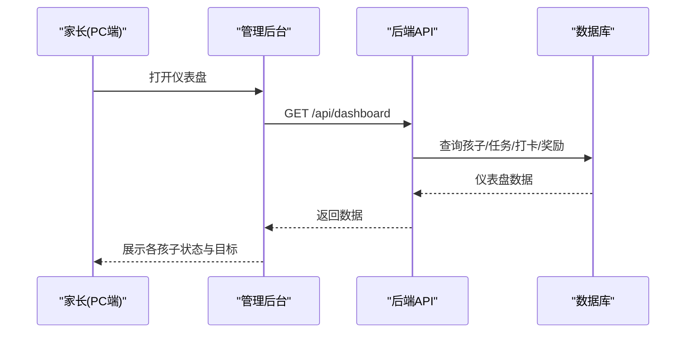
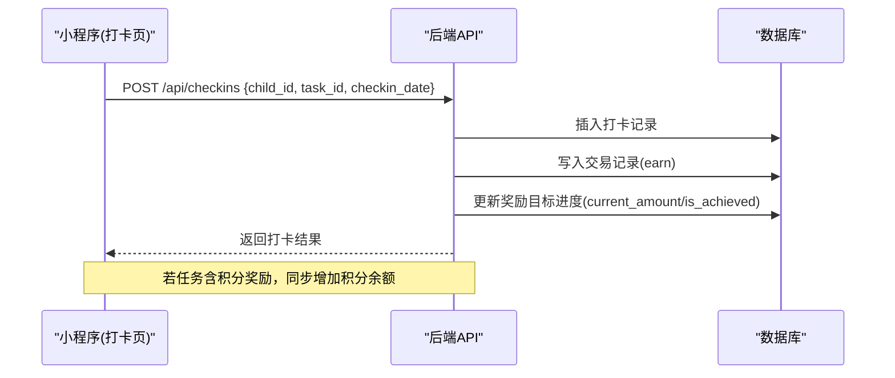
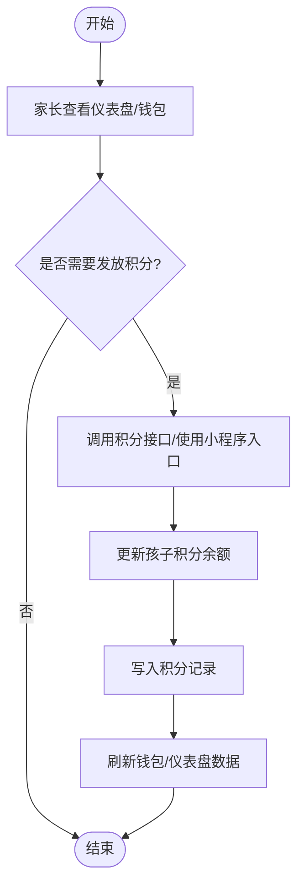
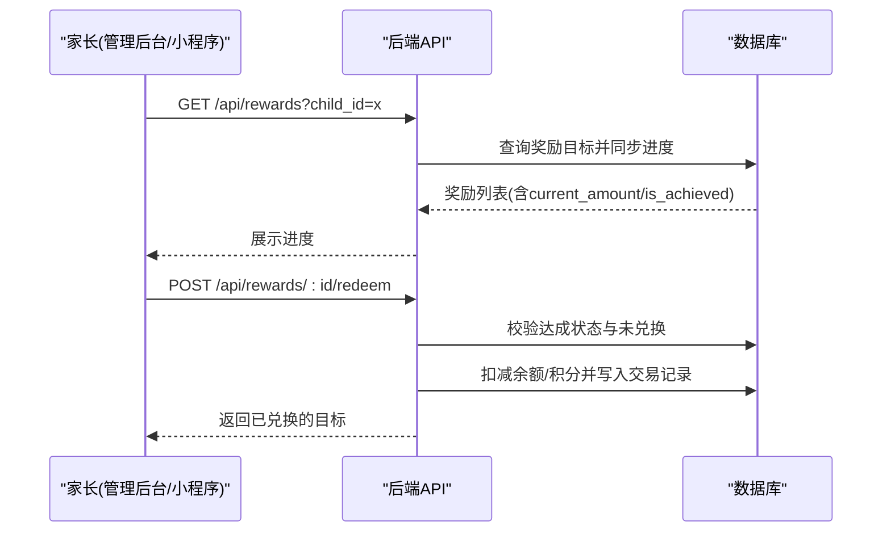

# 核心用户旅程

<cite>
**本文引用的文件**
- [ARCHITECTURE.md](file://docs/ARCHITECTURE.md)
- [api.md](file://docs/api.md)
- [checkins.js](file://star-park/server/src/routes/checkins.js)
- [rewards.js](file://star-park/server/src/routes/rewards.js)
- [points.js](file://star-park/server/src/routes/points.js)
- [stats.js](file://star-park/server/src/routes/stats.js)
- [Dashboard.vue](file://star-park/pc-admin/src/views/Dashboard.vue)
- [checkin/index.vue](file://star-park/miniprogram/src/pages/checkin/index.vue)
- [wallet/index.vue](file://star-park/miniprogram/src/pages/wallet/index.vue)
</cite>

## 产品概述
星星乐园是面向多孩家庭的激励管理系统，采用“任务打卡 + 双货币激励（金钱+积分）”机制，围绕孩子维度独立管理。家长通过 PC 管理后台进行初始化与数据查看、发放积分；孩子或家长通过小程序完成每日打卡；当奖励目标达成后，家长可执行兑换，形成从“设置—执行—反馈—兑现”的完整业务闭环。

- 项目定位：家庭激励与习惯养成工具，支持多孩并行管理。
- 目标用户：家长（管理者）、孩子（被激励者）。
- 核心价值：用可量化的打卡行为驱动正向反馈，帮助家长高效管理学习任务与成长目标。
- 适用场景：日常学习任务打卡、连续打卡激励、阶段性礼物目标达成与兑换。

**章节来源**
- [ARCHITECTURE.md:6-15](file://docs/ARCHITECTURE.md#L6-L15)
- [api.md:6-14](file://docs/api.md#L6-L14)

## 核心业务流程
本部分聚焦四个关键旅程：家长初始化系统、孩子每日打卡、家长查看数据与发放积分、奖励目标达成与兑换。每个旅程包含触发入口、关键触点、情绪曲线与业务闭环说明。

### 旅程一：家长初始化系统
- 触发入口：PC 管理后台首页仪表盘。
- 关键触点：
  - 加载仪表盘数据，展示各孩子今日打卡情况、活跃任务、连续打卡天数、本周完成率、余额与奖励目标。
  - 若尚无孩子数据，可在管理后台创建孩子、任务、奖励目标等基础信息（对应后端 children/tasks/rewards 接口）。
- 情绪曲线：首次进入看到“空状态”→ 快速创建后获得“有数据”的正向反馈。
- 业务闭环：初始化完成后，后续打卡、统计、兑换均基于已创建的孩子与任务数据运转。

**图表来源**
- [stats.js:103-179](file://star-park/server/src/routes/stats.js#L103-L179)
- [Dashboard.vue:21-68](file://star-park/pc-admin/src/views/Dashboard.vue#L21-L68)

**章节来源**
- [Dashboard.vue:21-68](file://star-park/pc-admin/src/views/Dashboard.vue#L21-L68)
- [stats.js:103-179](file://star-park/server/src/routes/stats.js#L103-L179)
- [api.md:33-57](file://docs/api.md#L33-L57)

### 旅程二：孩子每日打卡
- 触发入口：小程序“打卡”页。
- 关键触点：
  - 选择孩子 → 查看今日任务列表 → 勾选已完成的任务 → 提交打卡或一键全部打卡。
  - 提交成功后显示祝贺动画与本次获得的金额奖励提示。
- 情绪曲线：完成任务→即时正反馈（打卡成功弹窗）→持续激励（连续打卡、累计余额）。
- 业务闭环：打卡成功后，后端写入打卡记录、交易记录，更新奖励目标进度，并自动发放积分（如任务配置了积分奖励）。

**图表来源**
- [checkins.js:40-106](file://star-park/server/src/routes/checkins.js#L40-L106)
- [checkins.js:108-200](file://star-park/server/src/routes/checkins.js#L108-L200)

**章节来源**
- [checkin/index.vue:174-223](file://star-park/miniprogram/src/pages/checkin/index.vue#L174-L223)
- [checkins.js:40-106](file://star-park/server/src/routes/checkins.js#L40-L106)
- [api.md:232-257](file://docs/api.md#L232-L257)

### 旅程三：家长查看数据与发放积分
- 触发入口：
  - 管理后台仪表盘/统计页面查看整体数据。
  - 小程序钱包页查看余额与明细。
- 关键触点：
  - 仪表盘：展示连续打卡、周完成率、余额、奖励目标。
  - 钱包：切换“交易明细/积分记录”，查看 earn/spend/redeem 流水与积分增减。
  - 发放积分：在小程序打卡页通过“特殊积分奖励”入口，或在后端调用积分接口手动添加。
- 情绪曲线：清晰的数据呈现带来掌控感；积分发放提供额外正向强化。
- 业务闭环：积分发放会更新孩子积分余额并生成积分记录；交易明细与仪表盘口径一致，便于家长核对。

**图表来源**
- [points.js:30-70](file://star-park/server/src/routes/points.js#L30-L70)
- [wallet/index.vue:117-153](file://star-park/miniprogram/src/pages/wallet/index.vue#L117-L153)

**章节来源**
- [stats.js:6-101](file://star-park/server/src/routes/stats.js#L6-L101)
- [wallet/index.vue:17-75](file://star-park/miniprogram/src/pages/wallet/index.vue#L17-L75)
- [points.js:30-70](file://star-park/server/src/routes/points.js#L30-L70)
- [api.md:312-357](file://docs/api.md#L312-L357)

### 旅程四：奖励目标达成与兑换
- 触发入口：
  - 小程序“奖励”页查看目标进度。
  - 管理后台奖励管理页操作兑换。
- 关键触点：
  - 进度条展示当前金额/积分与目标值，达成时显示“已达成”。
  - 家长执行兑换：根据奖励单位（元/星星）扣减相应余额或积分，并标记兑换时间。
- 情绪曲线：接近目标时期待感增强→达成时庆祝→兑换后满足感。
- 业务闭环：兑换后余额/积分扣减，交易记录生成，目标状态更新为已兑换，防止重复兑换。

**图表来源**
- [rewards.js:36-49](file://star-park/server/src/routes/rewards.js#L36-L49)
- [rewards.js:115-189](file://star-park/server/src/routes/rewards.js#L115-L189)

**章节来源**
- [rewards.js:36-49](file://star-park/server/src/routes/rewards.js#L36-L49)
- [rewards.js:115-189](file://star-park/server/src/routes/rewards.js#L115-L189)
- [api.md:258-310](file://docs/api.md#L258-L310)

## 功能模块清单
- 打卡模块
  - 职责：记录孩子每日任务完成情况，计算奖励金额与积分，更新奖励目标进度。
  - 用户价值：即时反馈，培养坚持习惯。
  - 验收要点：打卡成功写入记录与交易；重复打卡跳过；自动打卡生效；积分奖励正确发放。
- 钱包模块
  - 职责：展示金额余额与积分余额，提供交易明细与积分记录。
  - 用户价值：透明化收支，便于家长核对与教育。
  - 验收要点：余额与仪表盘口径一致；明细按时间倒序；积分记录包含原因与时间。
- 奖励目标模块
  - 职责：设定目标金额/积分，跟踪进度，支持达成与兑换。
  - 用户价值：将长期目标可视化，提升动机。
  - 验收要点：进度与余额对齐；达成状态正确；兑换不可重复；单位支持元/星星。
- 统计与仪表盘模块
  - 职责：计算连续打卡、周完成率、近30天每日打卡、余额汇总。
  - 用户价值：宏观掌握孩子表现与趋势。
  - 验收要点：连续打卡从今日或昨日起算；周完成率分母为活跃任务×天数；余额=总收入-总支出-已兑换。
- 积分发放模块
  - 职责：家长手动发放积分，更新余额并记录原因。
  - 用户价值：灵活强化特定行为。
  - 验收要点：非零整数校验；余额更新准确；记录可查。

**章节来源**
- [checkins.js:40-106](file://star-park/server/src/routes/checkins.js#L40-L106)
- [wallet/index.vue:17-75](file://star-park/miniprogram/src/pages/wallet/index.vue#L17-L75)
- [rewards.js:36-49](file://star-park/server/src/routes/rewards.js#L36-L49)
- [stats.js:6-101](file://star-park/server/src/routes/stats.js#L6-L101)
- [points.js:30-70](file://star-park/server/src/routes/points.js#L30-L70)

## 数据与状态
- 核心数据模型
  - 孩子：基本信息、余额、积分余额、连续打卡、月度累计等。
  - 任务：关联孩子、计划日期、奖励金额、是否活跃等。
  - 打卡记录：孩子、任务、日期、是否完成、获得奖励。
  - 交易记录：类型（earn/spend/redeem）、金额、描述、时间。
  - 奖励目标：归属孩子、目标值、当前值、是否达成、是否已兑换、单位（元/星星）。
  - 积分记录：孩子、数量、原因、时间。
- 关键状态流转
  - 打卡完成：检查记录→写入交易→更新奖励进度→可能发放积分。
  - 奖励达成：当前值≥目标值→is_achieved=1→可兑换。
  - 兑换：校验达成且未兑换→扣减余额/积分→写入交易→标记兑换时间。
- 数据所有权边界
  - 所有数据以孩子维度隔离，跨孩子不共享余额与目标。
  - 仪表盘与钱包余额口径一致，确保家长看到的数字可信。

**章节来源**
- [stats.js:6-101](file://star-park/server/src/routes/stats.js#L6-L101)
- [rewards.js:115-189](file://star-park/server/src/routes/rewards.js#L115-L189)
- [checkins.js:40-106](file://star-park/server/src/routes/checkins.js#L40-L106)
- [points.js:30-70](file://star-park/server/src/routes/points.js#L30-L70)

## 关键约束与边界
- 非功能性需求
  - 数据一致性：打卡、交易、奖励进度、积分发放均在事务内处理，避免中间态。
  - 性能：SQLite 嵌入式数据库适合小型家庭应用；统计接口对近30天数据进行分组与填充。
  - 可用性：小程序提供一键全部打卡，降低家长操作成本。
- 依赖与集成边界
  - 前后端通过 REST API 通信，禁止前端直接导入后端模块。
  - 管理后台与小程序各自独立，仅共享 API 契约。
- 业务约束
  - 积分分值必须为非零整数。
  - 奖励单位仅支持“元”和“星星”，不支持其他单位。
  - 奖励目标需先达成且未兑换方可兑换，防止重复兑换。
  - 连续打卡从今日或昨日开始计算，若今天未打卡则从昨天起算。

**章节来源**
- [ARCHITECTURE.md:75-95](file://docs/ARCHITECTURE.md#L75-L95)
- [api.md:345-357](file://docs/api.md#L345-L357)
- [rewards.js:115-189](file://star-park/server/src/routes/rewards.js#L115-L189)
- [stats.js:17-36](file://star-park/server/src/routes/stats.js#L17-L36)
