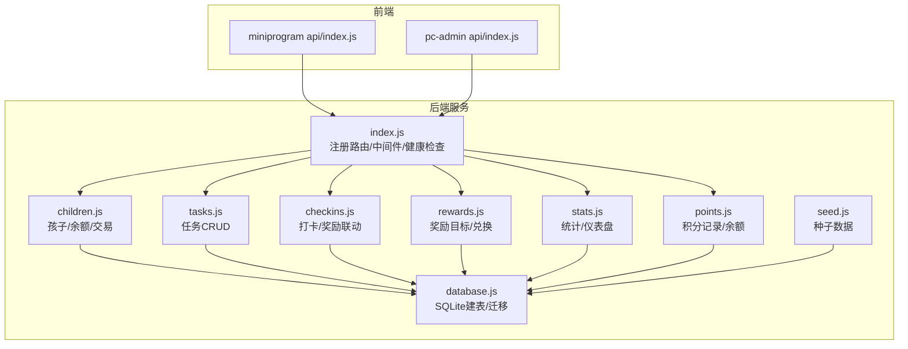
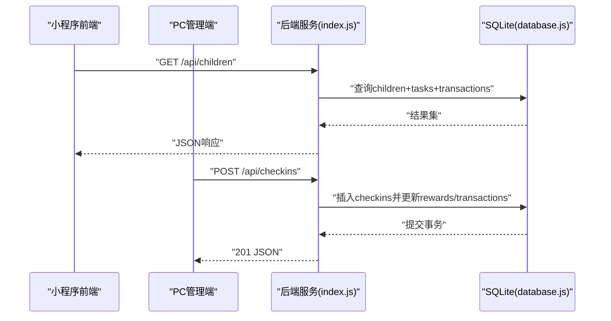
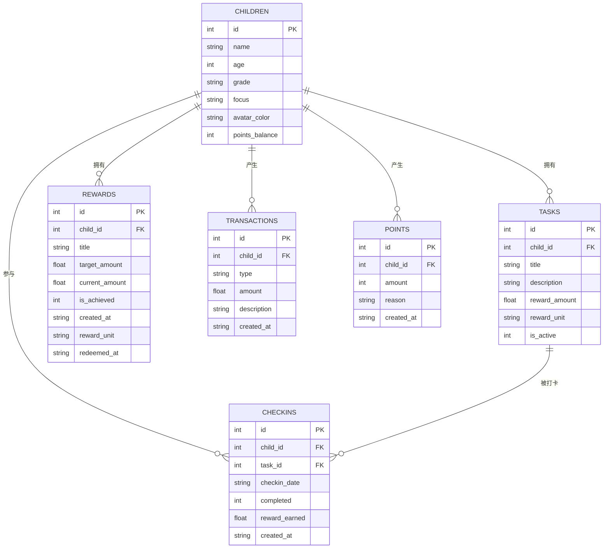
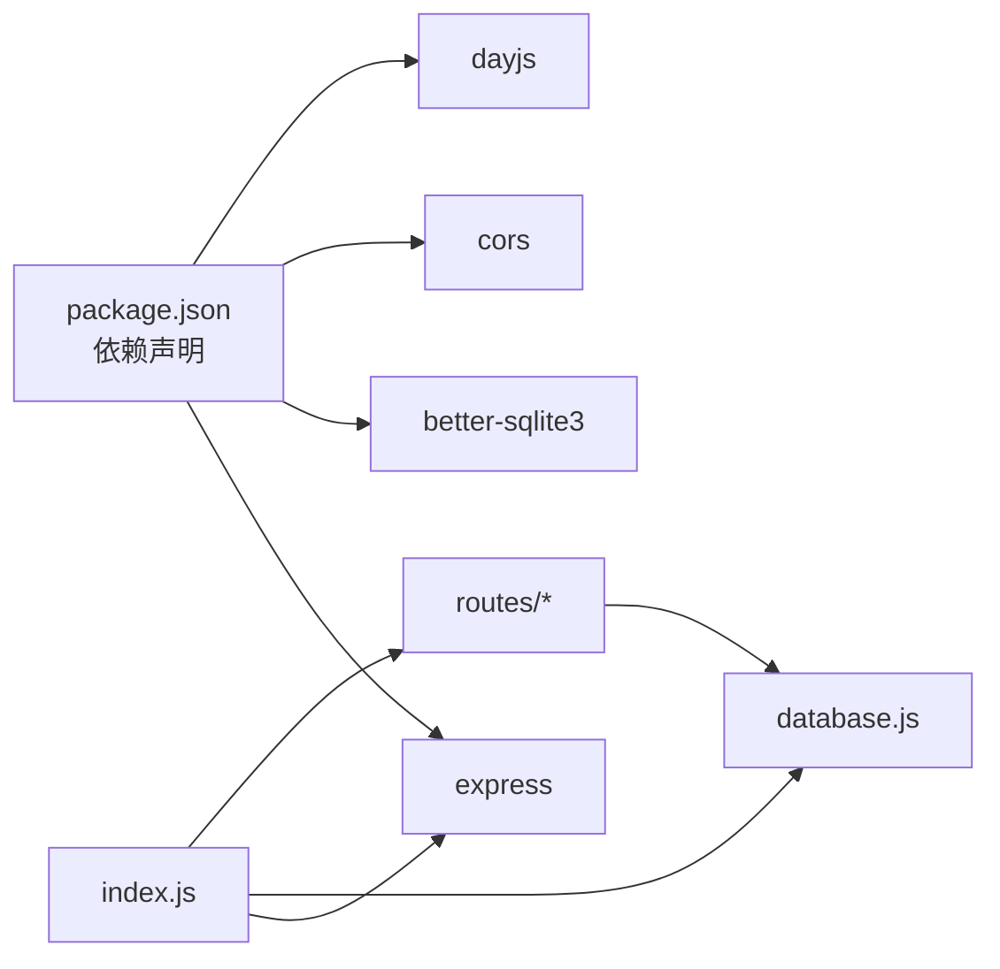

# API测试

<cite>
**本文引用的文件**
- [scripts/run-api-tests.sh](file://scripts/run-api-tests.sh)
- [scripts/generate-api-doc.sh](file://scripts/generate-api-doc.sh)
- [docs/api.md](file://docs/api.md)
- [docs/TESTING.md](file://docs/TESTING.md)
- [star-park/server/src/index.js](file://star-park/server/src/index.js)
- [star-park/server/src/routes/children.js](file://star-park/server/src/routes/children.js)
- [star-park/server/src/routes/tasks.js](file://star-park/server/src/routes/tasks.js)
- [star-park/server/src/routes/checkins.js](file://star-park/server/src/routes/checkins.js)
- [star-park/server/src/routes/rewards.js](file://star-park/server/src/routes/rewards.js)
- [star-park/server/src/routes/stats.js](file://star-park/server/src/routes/stats.js)
- [star-park/server/src/routes/points.js](file://star-park/server/src/routes/points.js)
- [star-park/server/src/database.js](file://star-park/server/src/database.js)
- [star-park/server/src/seed.js](file://star-park/server/src/seed.js)
- [star-park/server/package.json](file://star-park/server/package.json)
- [star-park/miniprogram/src/api/index.js](file://star-park/miniprogram/src/api/index.js)
- [star-park/pc-admin/src/api/index.js](file://star-park/pc-admin/src/api/index.js)
</cite>

## 目录
1. [简介](#简介)
2. [项目结构](#项目结构)
3. [核心组件](#核心组件)
4. [架构总览](#架构总览)
5. [详细组件分析](#详细组件分析)
6. [依赖分析](#依赖分析)
7. [性能考虑](#性能考虑)
8. [故障排查指南](#故障排查指南)
9. [结论](#结论)
10. [附录](#附录)

## 简介
本文件面向StarParadise项目的API测试，系统化阐述RESTful接口测试策略与实践，覆盖端点测试用例设计、请求/响应校验、工具使用（Postman/Insomnia）、自动化测试脚本、测试数据管理、版本兼容性、性能基准与负载测试、测试报告生成、API文档同步与契约测试方法。文档基于仓库现有实现与脚本进行提炼，确保可操作、可落地。

## 项目结构
后端采用Express + better-sqlite3，路由集中在server/src/routes目录；前端分别在小程序与PC管理端调用统一的后端API；测试策略与脚本位于scripts与docs中。

图表来源
- [star-park/server/src/index.js:1-42](file://star-park/server/src/index.js#L1-L42)
- [star-park/server/src/routes/children.js:1-96](file://star-park/server/src/routes/children.js#L1-L96)
- [star-park/server/src/routes/tasks.js:1-91](file://star-park/server/src/routes/tasks.js#L1-L91)
- [star-park/server/src/routes/checkins.js:1-90](file://star-park/server/src/routes/checkins.js#L1-L90)
- [star-park/server/src/routes/rewards.js:1-167](file://star-park/server/src/routes/rewards.js#L1-L167)
- [star-park/server/src/routes/stats.js:1-182](file://star-park/server/src/routes/stats.js#L1-L182)
- [star-park/server/src/routes/points.js:1-74](file://star-park/server/src/routes/points.js#L1-L74)
- [star-park/server/src/database.js:1-111](file://star-park/server/src/database.js#L1-L111)
- [star-park/server/src/seed.js:1-45](file://star-park/server/src/seed.js#L1-L45)
- [star-park/miniprogram/src/api/index.js:1-75](file://star-park/miniprogram/src/api/index.js#L1-L75)
- [star-park/pc-admin/src/api/index.js:1-56](file://star-park/pc-admin/src/api/index.js#L1-L56)

章节来源
- [star-park/server/src/index.js:1-42](file://star-park/server/src/index.js#L1-L42)
- [docs/TESTING.md:1-91](file://docs/TESTING.md#L1-L91)

## 核心组件
- 健康检查：/api/health，GET，返回服务状态与时间戳。
- 孩子管理：/api/children（GET/POST），/api/children/:id/balance（GET），/api/children/:id/transactions（GET）。
- 任务管理：/api/tasks（GET/POST/PUT/DELETE）。
- 打卡与奖励：/api/checkins（GET/POST），/api/rewards（GET/POST/PUT/DELETE），/api/rewards/:id/redeem（POST）。
- 统计与仪表盘：/api/stats/:childId（GET），/api/dashboard（GET）。
- 积分系统：/api/points（GET/POST）。
- 数据库：better-sqlite3，含建表、迁移与种子数据初始化。

章节来源
- [star-park/server/src/index.js:29-32](file://star-park/server/src/index.js#L29-L32)
- [star-park/server/src/routes/children.js:5-93](file://star-park/server/src/routes/children.js#L5-L93)
- [star-park/server/src/routes/tasks.js:5-88](file://star-park/server/src/routes/tasks.js#L5-L88)
- [star-park/server/src/routes/checkins.js:6-87](file://star-park/server/src/routes/checkins.js#L6-L87)
- [star-park/server/src/routes/rewards.js:5-164](file://star-park/server/src/routes/rewards.js#L5-L164)
- [star-park/server/src/routes/stats.js:6-179](file://star-park/server/src/routes/stats.js#L6-L179)
- [star-park/server/src/routes/points.js:5-72](file://star-park/server/src/routes/points.js#L5-L72)
- [star-park/server/src/database.js:17-80](file://star-park/server/src/database.js#L17-L80)

## 架构总览
后端通过Express提供REST API，前端通过各自封装的API模块发起HTTP请求。数据库采用本地SQLite文件，启动时自动建表与迁移，并在首次启动时注入种子数据。

图表来源
- [star-park/server/src/index.js:20-27](file://star-park/server/src/index.js#L20-L27)
- [star-park/server/src/routes/children.js:6-36](file://star-park/server/src/routes/children.js#L6-L36)
- [star-park/server/src/routes/checkins.js:31-86](file://star-park/server/src/routes/checkins.js#L31-L86)
- [star-park/server/src/database.js:13-15](file://star-park/server/src/database.js#L13-L15)

## 详细组件分析

### 健康检查测试
- 端点：GET /api/health
- 请求：无需认证，JSON请求体
- 响应：包含status与timestamp字段
- 测试要点：
  - 响应状态码为200
  - JSON字段存在且类型正确
  - 时间戳格式合理
- 自动化：仓库已有集成测试脚本直接验证健康检查

章节来源
- [star-park/server/src/index.js:29-32](file://star-park/server/src/index.js#L29-L32)
- [scripts/run-api-tests.sh:13-17](file://scripts/run-api-tests.sh#L13-L17)

### 孩子列表与余额/交易测试
- 端点：GET /api/children
  - 响应包含每个孩子的任务列表与累计余额
  - 余额来自transactions表earn类汇总
- 端点：GET /api/children/:id/balance
  - 返回points_balance
- 端点：GET /api/children/:id/transactions?type=money
  - 返回transactions表记录
  - 默认返回points表记录（兼容管理端）
- 测试要点：
  - 正常返回JSON数组/对象
  - 余额与交易记录与数据库一致
  - 缺少child_id时报400
- 自动化：集成测试脚本验证获取列表

章节来源
- [star-park/server/src/routes/children.js:5-93](file://star-park/server/src/routes/children.js#L5-L93)
- [scripts/run-api-tests.sh:19-22](file://scripts/run-api-tests.sh#L19-L22)

### 任务CRUD测试
- 端点：GET /api/tasks?child_id=
  - 可按child_id筛选
- 端点：POST /api/tasks
  - 必填：child_id、title
  - 默认reward_amount=1.0，reward_unit="元"
- 端点：PUT /api/tasks/:id
  - 支持部分字段更新
- 端点：DELETE /api/tasks/:id
  - 删除前先清理checkins
- 测试要点：
  - 新增后返回完整任务对象
  - 更新字段仅变更传入字段
  - 删除后关联checkins一并清理
  - 缺少必填字段返回400
  - 不存在资源返回404

章节来源
- [star-park/server/src/routes/tasks.js:5-88](file://star-park/server/src/routes/tasks.js#L5-L88)

### 打卡与奖励联动测试
- 端点：GET /api/checkins?date=&child_id=
  - 支持按日期与孩子筛选
- 端点：POST /api/checkins
  - 必填：child_id、task_id、checkin_date
  - completed默认1
  - 成功后插入checkins，并在完成时：
    - 创建transactions记录
    - 更新所有未达成奖励的current_amount，并判定是否达成
- 测试要点：
  - 成功创建返回201与checkin详情
  - 任务不存在返回400
  - 查询结果包含task_title等联结字段
- 自动化：集成测试脚本验证获取与创建

章节来源
- [star-park/server/src/routes/checkins.js:6-87](file://star-park/server/src/routes/checkins.js#L6-L87)
- [scripts/run-api-tests.sh:24-27](file://scripts/run-api-tests.sh#L24-L27)

### 奖励目标与兑换测试
- 端点：GET /api/rewards?child_id=
- 端点：POST /api/rewards
  - 必填：child_id、title、target_amount
  - 默认reward_unit="元"
- 端点：PUT /api/rewards/:id
- 端点：DELETE /api/rewards/:id
- 端点：POST /api/rewards/:id/redeem
  - 前置：is_achieved=1且未兑换
  - 单位为"元"时：校验transactions余额，创建redeem交易
  - 单位为"星星"时：校验points余额，扣减积分并记录points明细
  - 余额不足返回400
- 测试要点：
  - 兑换成功返回奖励对象并标记redeemed_at
  - 重复兑换返回400
  - 不支持的单位返回400

章节来源
- [star-park/server/src/routes/rewards.js:5-164](file://star-park/server/src/routes/rewards.js#L5-L164)

### 统计与仪表盘测试
- 端点：GET /api/stats/:childId
  - 计算连续打卡天数、本周完成率、最近30天每日完成情况、余额等
- 端点：GET /api/dashboard
  - 返回所有孩子当日打卡、活跃任务、连续天数、本周完成率、余额、未达成奖励
- 测试要点：
  - 返回字段结构与文档一致
  - 边界日期与空数据处理正确

章节来源
- [star-park/server/src/routes/stats.js:6-179](file://star-park/server/src/routes/stats.js#L6-L179)

### 积分系统测试
- 端点：GET /api/points?child_id=
  - 返回积分记录与当前points_balance
- 端点：POST /api/points
  - 必填：child_id、amount（非零整数）
  - 自动更新children.points_balance并记录points明细
- 测试要点：
  - 缺少必填字段返回400
  - amount为0或非整数返回400
  - 成功后返回新增记录与新余额

章节来源
- [star-park/server/src/routes/points.js:5-72](file://star-park/server/src/routes/points.js#L5-L72)

### 数据模型与关系

图表来源
- [star-park/server/src/database.js:18-79](file://star-park/server/src/database.js#L18-L79)

## 依赖分析
- Express中间件：CORS、JSON解析
- 数据库：better-sqlite3，启用WAL与外键约束
- 前端调用：小程序与PC端均通过统一的/baseURL="/api"访问后端
- 自动化：集成测试脚本依赖后端服务运行

图表来源
- [star-park/server/package.json:8-13](file://star-park/server/package.json#L8-L13)
- [star-park/server/src/index.js:1-42](file://star-park/server/src/index.js#L1-L42)

章节来源
- [star-park/server/package.json:1-15](file://star-park/server/package.json#L1-L15)
- [star-park/server/src/index.js:16-27](file://star-park/server/src/index.js#L16-L27)

## 性能考虑
- 数据库并发：WAL模式提升读写并发能力
- 查询优化：按需筛选（child_id/date）减少结果集
- 事务使用：批量写入（checkins/rewards/points）保证一致性
- 前端缓存：对静态数据（如任务列表）进行本地缓存
- 基准与负载：建议使用JMeter/Artillery对关键端点（/api/dashboard、/api/children、/api/checkins）进行基准与压力测试，关注P95/P99延迟与错误率

## 故障排查指南
- 健康检查失败
  - 确认后端进程已启动
  - 检查端口占用与CORS设置
- 400错误
  - 核对必填字段（child_id/title/task_id等）
  - 校验请求体JSON格式
- 404错误
  - 资源不存在（任务/奖励/孩子）
- 500错误
  - 查看后端日志与数据库异常
  - 检查事务回滚与外键约束
- 自动化脚本
  - 使用集成测试脚本验证核心路径
  - 通过Makefile目标运行测试与清理

章节来源
- [scripts/run-api-tests.sh:1-36](file://scripts/run-api-tests.sh#L1-L36)
- [docs/TESTING.md:33-53](file://docs/TESTING.md#L33-L53)

## 结论
本测试文档基于仓库现有实现与脚本，构建了覆盖健康检查、CRUD、认证授权（无）、错误处理、数据一致性与性能的关键测试策略。建议持续完善单元测试覆盖率，引入契约测试与API文档同步机制，以保障API演进过程中的稳定性与一致性。

## 附录

### API测试工具与使用
- Postman
  - 导入API文档，批量执行集合
  - 使用环境变量管理BASE_URL与鉴权
- Insomnia
  - 通过导入OpenAPI/Swagger文件生成请求模板
  - 利用环境与变量管理多环境配置
- 自动化脚本
  - 集成测试：scripts/run-api-tests.sh
  - 文档生成：scripts/generate-api-doc.sh（扫描路由）

章节来源
- [scripts/run-api-tests.sh:1-36](file://scripts/run-api-tests.sh#L1-L36)
- [scripts/generate-api-doc.sh:1-18](file://scripts/generate-api-doc.sh#L1-L18)
- [docs/api.md:1-253](file://docs/api.md#L1-L253)

### 测试数据管理
- 种子数据：首次启动时自动注入
- 数据库迁移：自动建表与字段补齐
- 前端调用：统一通过/baseURL="/api"访问

章节来源
- [star-park/server/src/seed.js:1-45](file://star-park/server/src/seed.js#L1-L45)
- [star-park/server/src/database.js:17-111](file://star-park/server/src/database.js#L17-L111)
- [star-park/miniprogram/src/api/index.js:1-75](file://star-park/miniprogram/src/api/index.js#L1-L75)
- [star-park/pc-admin/src/api/index.js:1-56](file://star-park/pc-admin/src/api/index.js#L1-L56)

### API版本兼容性测试
- 建议在docs/api.md中标注版本号与变更历史
- 对新增/删除字段进行向后兼容性校验
- 使用契约测试（如Pact/JSON Schema）确保前后端约定一致

### 性能基准与负载测试
- 关键端点：/api/dashboard、/api/children、/api/checkins
- 指标：RPS、P95/P99延迟、错误率、数据库锁等待
- 工具：JMeter/Artillery/K6

### 测试报告生成
- 集成测试：脚本输出通过CI归档
- 单元测试：覆盖率报告（Jest/Vitest）
- 契约测试：生成契约差异报告

### API文档同步测试与契约测试
- 文档同步：scripts/generate-api-doc.sh扫描路由并更新docs/api.md
- 契约测试：基于OpenAPI/Swagger定义契约，前端/后端分别消费契约进行验证

章节来源
- [scripts/generate-api-doc.sh:1-18](file://scripts/generate-api-doc.sh#L1-L18)
- [docs/api.md:1-253](file://docs/api.md#L1-L253)