# 前端测试

<cite>
**本文引用的文件**
- [star-park/miniprogram/package.json](file://star-park/miniprogram/package.json)
- [star-park/pc-admin/package.json](file://star-park/pc-admin/package.json)
- [star-park/miniprogram/src/main.js](file://star-park/miniprogram/src/main.js)
- [star-park/pc-admin/src/main.js](file://star-park/pc-admin/src/main.js)
- [star-park/miniprogram/src/App.vue](file://star-park/miniprogram/src/App.vue)
- [star-park/pc-admin/src/App.vue](file://star-park/pc-admin/src/App.vue)
- [star-park/miniprogram/src/components/ChildCard.vue](file://star-park/miniprogram/src/components/ChildCard.vue)
- [star-park/miniprogram/src/components/TaskItem.vue](file://star-park/miniprogram/src/components/TaskItem.vue)
- [star-park/pc-admin/src/components/ChildCard.vue](file://star-park/pc-admin/src/components/ChildCard.vue)
- [star-park/pc-admin/src/components/Layout.vue](file://star-park/pc-admin/src/components/Layout.vue)
- [star-park/pc-admin/src/router/index.js](file://star-park/pc-admin/src/router/index.js)
- [star-park/pc-admin/src/stores/app.js](file://star-park/pc-admin/src/stores/app.js)
- [star-park/pc-admin/src/views/Dashboard.vue](file://star-park/pc-admin/src/views/Dashboard.vue)
- [star-park/pc-admin/src/views/Checkin.vue](file://star-park/pc-admin/src/views/Checkin.vue)
- [star-park/miniprogram/src/pages/index/index.vue](file://star-park/miniprogram/src/pages/index/index.vue)
- [star-park/miniprogram/src/pages/checkin/index.vue](file://star-park/miniprogram/src/pages/checkin/index.vue)
</cite>

## 目录
1. [引言](#引言)
2. [项目结构](#项目结构)
3. [核心组件](#核心组件)
4. [架构总览](#架构总览)
5. [详细组件分析](#详细组件分析)
6. [依赖分析](#依赖分析)
7. [性能考虑](#性能考虑)
8. [故障排查指南](#故障排查指南)
9. [结论](#结论)
10. [附录](#附录)

## 引言
本测试文档面向 StarParadise 项目，系统化阐述前端测试策略与实践，覆盖 Vue 组件测试、页面功能测试、用户交互测试，并结合 PC 管理后台与小程序两类前端形态，给出可落地的测试方案。文档同时涵盖响应式设计、浏览器兼容性、可访问性、性能测试、截图对比以及端到端用户流程测试建议。

## 项目结构
- 小程序前端位于 star-park/miniprogram，采用 uni-app 框架，使用 Vue 3 语法与组件化开发。
- PC 管理后台位于 star-park/pc-admin，采用 Vite + Vue 3 + Pinia + Element Plus + vue-router。
- 两套前端共享部分业务组件（如 ChildCard、TaskItem），并在各自页面中组合使用。

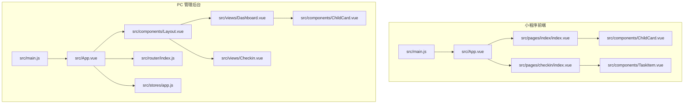

图表来源
- [star-park/miniprogram/src/main.js:1-8](file://star-park/miniprogram/src/main.js#L1-L8)
- [star-park/pc-admin/src/main.js:1-22](file://star-park/pc-admin/src/main.js#L1-L22)
- [star-park/miniprogram/src/App.vue:1-26](file://star-park/miniprogram/src/App.vue#L1-L26)
- [star-park/pc-admin/src/App.vue:1-10](file://star-park/pc-admin/src/App.vue#L1-L10)
- [star-park/miniprogram/src/pages/index/index.vue:1-194](file://star-park/miniprogram/src/pages/index/index.vue#L1-L194)
- [star-park/miniprogram/src/pages/checkin/index.vue:1-322](file://star-park/miniprogram/src/pages/checkin/index.vue#L1-L322)
- [star-park/pc-admin/src/components/Layout.vue:1-29](file://star-park/pc-admin/src/components/Layout.vue#L1-L29)
- [star-park/pc-admin/src/router/index.js:1-67](file://star-park/pc-admin/src/router/index.js#L1-L67)
- [star-park/pc-admin/src/stores/app.js:1-62](file://star-park/pc-admin/src/stores/app.js#L1-L62)
- [star-park/pc-admin/src/views/Dashboard.vue:1-146](file://star-park/pc-admin/src/views/Dashboard.vue#L1-L146)
- [star-park/pc-admin/src/views/Checkin.vue:1-417](file://star-park/pc-admin/src/views/Checkin.vue#L1-L417)
- [star-park/miniprogram/src/components/ChildCard.vue:1-162](file://star-park/miniprogram/src/components/ChildCard.vue#L1-L162)
- [star-park/miniprogram/src/components/TaskItem.vue:1-133](file://star-park/miniprogram/src/components/TaskItem.vue#L1-L133)
- [star-park/pc-admin/src/components/ChildCard.vue:1-161](file://star-park/pc-admin/src/components/ChildCard.vue#L1-L161)

章节来源
- [star-park/miniprogram/src/main.js:1-8](file://star-park/miniprogram/src/main.js#L1-L8)
- [star-park/pc-admin/src/main.js:1-22](file://star-park/pc-admin/src/main.js#L1-L22)

## 核心组件
- 小程序侧核心组件
  - ChildCard：展示孩子信息、打卡状态、连续天数与余额等，支持点击事件。
  - TaskItem：展示任务条目，支持勾选切换与禁用态。
- PC 后台核心组件
  - ChildCard：展示孩子信息、今日打卡、连续天数、周完成率、余额与积分等，支持跳转到积分详情。
  - Layout：布局容器，内含侧边栏与主内容区，使用 router-view 渲染子路由。
- 路由与状态
  - PC 后台使用 vue-router 配置多级路由，Layout 包裹子视图；beforeEach 动态设置标题。
  - PC 后台使用 Pinia 管理全局状态（children、currentChild、loading、颜色映射、加载与切换接口）。

章节来源
- [star-park/miniprogram/src/components/ChildCard.vue:1-162](file://star-park/miniprogram/src/components/ChildCard.vue#L1-L162)
- [star-park/miniprogram/src/components/TaskItem.vue:1-133](file://star-park/miniprogram/src/components/TaskItem.vue#L1-L133)
- [star-park/pc-admin/src/components/ChildCard.vue:1-161](file://star-park/pc-admin/src/components/ChildCard.vue#L1-L161)
- [star-park/pc-admin/src/components/Layout.vue:1-29](file://star-park/pc-admin/src/components/Layout.vue#L1-L29)
- [star-park/pc-admin/src/router/index.js:1-67](file://star-park/pc-admin/src/router/index.js#L1-L67)
- [star-park/pc-admin/src/stores/app.js:1-62](file://star-park/pc-admin/src/stores/app.js#L1-L62)

## 架构总览
下图展示 PC 管理后台的典型交互路径：用户在仪表盘页面看到多个孩子卡片，点击“去打卡”或“管理任务”等按钮触发路由跳转；在打卡页根据日期选择与任务勾选，提交后刷新状态并提示结果。

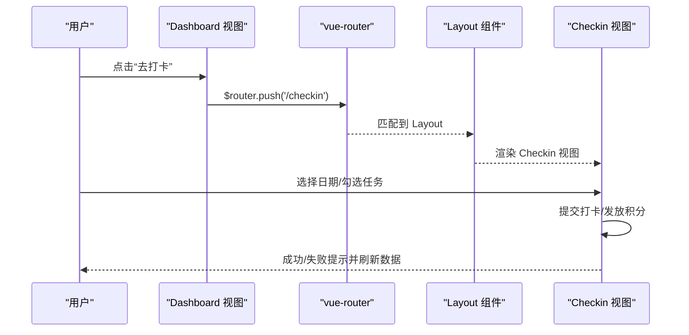

图表来源
- [star-park/pc-admin/src/views/Dashboard.vue:1-146](file://star-park/pc-admin/src/views/Dashboard.vue#L1-L146)
- [star-park/pc-admin/src/router/index.js:1-67](file://star-park/pc-admin/src/router/index.js#L1-L67)
- [star-park/pc-admin/src/components/Layout.vue:1-29](file://star-park/pc-admin/src/components/Layout.vue#L1-L29)
- [star-park/pc-admin/src/views/Checkin.vue:1-417](file://star-park/pc-admin/src/views/Checkin.vue#L1-L417)

## 详细组件分析

### 组件 A：ChildCard（小程序）
- 属性与行为
  - 接收 name、avatarText、color、taskDesc、checkedIn、streak、balance。
  - 支持 tap 事件，用于跳转到打卡页。
- 测试要点
  - 属性渲染正确性（名称、徽章文案、颜色条、统计数据）。
  - 点击事件是否触发。
  - 不同状态下的视觉差异（完成/未完成）。
- 示例测试场景
  - 传入不同 color，断言颜色条与头像背景色。
  - 传入 checkedIn 为 true/false，断言徽章文案与样式类。
  - 触发 tap 事件，断言导航行为。

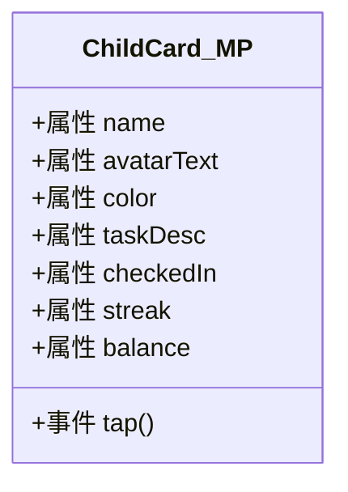

图表来源
- [star-park/miniprogram/src/components/ChildCard.vue:1-162](file://star-park/miniprogram/src/components/ChildCard.vue#L1-L162)

章节来源
- [star-park/miniprogram/src/components/ChildCard.vue:1-162](file://star-park/miniprogram/src/components/ChildCard.vue#L1-L162)

### 组件 B：TaskItem（小程序）
- 属性与行为
  - 接收 name、desc、reward、done、disabled。
  - 支持 toggle 事件，当 disabled 时禁止切换。
- 测试要点
  - 勾选框样式随 done/disabled 变化。
  - 文案与奖励文本样式。
  - 点击触发 toggle 的条件判断。
- 示例测试场景
  - done=false 且 disabled=false：点击应切换 done=true。
  - disabled=true：点击不应改变 done。
  - 断言样式类与文案状态。

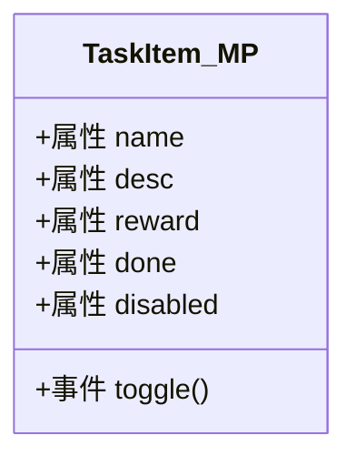

图表来源
- [star-park/miniprogram/src/components/TaskItem.vue:1-133](file://star-park/miniprogram/src/components/TaskItem.vue#L1-L133)

章节来源
- [star-park/miniprogram/src/components/TaskItem.vue:1-133](file://star-park/miniprogram/src/components/TaskItem.vue#L1-L133)

### 组件 C：ChildCard（PC 后台）
- 属性与行为
  - 接收 child 对象与 color，计算 checkedIn 与 weekRate。
  - 点击“总积分”触发路由跳转至 /balance。
- 测试要点
  - 计算属性 checkedIn/weekRate 正确映射 child 字段。
  - 点击积分值应触发路由 push。
  - 样式与 Element Plus 进度条渲染。
- 示例测试场景
  - 传入 child.todayCheckedIn=true，断言“今日打卡”文案与样式。
  - 传入 child.weekRate=数值，断言进度条 percentage。
  - 点击积分值，断言路由变化。

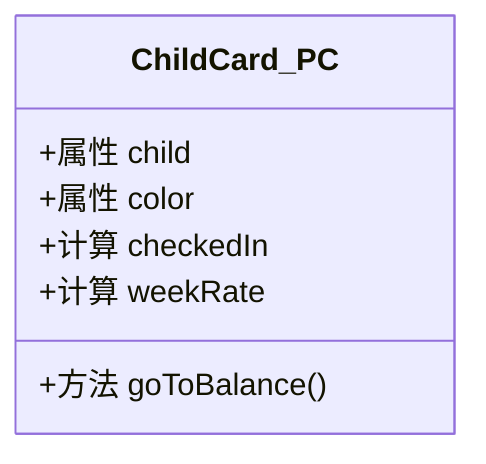

图表来源
- [star-park/pc-admin/src/components/ChildCard.vue:1-161](file://star-park/pc-admin/src/components/ChildCard.vue#L1-L161)

章节来源
- [star-park/pc-admin/src/components/ChildCard.vue:1-161](file://star-park/pc-admin/src/components/ChildCard.vue#L1-L161)

### 组件 D：Layout（PC 后台）
- 行为
  - 渲染 SideNav 与 router-view，使用 :key="$route.fullPath" 强制刷新。
- 测试要点
  - 主区域宽度与滚动行为。
  - 路由切换时 key 是否变化导致重新渲染。
- 示例测试场景
  - 切换路由后，router-view 内容更新。
  - 同一路由参数变化时，强制刷新生效。

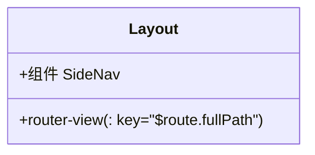

图表来源
- [star-park/pc-admin/src/components/Layout.vue:1-29](file://star-park/pc-admin/src/components/Layout.vue#L1-L29)

章节来源
- [star-park/pc-admin/src/components/Layout.vue:1-29](file://star-park/pc-admin/src/components/Layout.vue#L1-L29)

### 页面 E：Dashboard（PC 后台）
- 行为
  - 加载 dashboard 数据或回退到 store.children。
  - 快捷按钮跳转到对应页面。
- 测试要点
  - v-loading 加载态。
  - 无数据时显示空状态。
  - 快捷按钮点击后的路由跳转。
- 示例测试场景
  - 加载中显示 loading。
  - 无 children 时显示空状态。
  - 点击“去打卡”按钮，断言路由跳转。

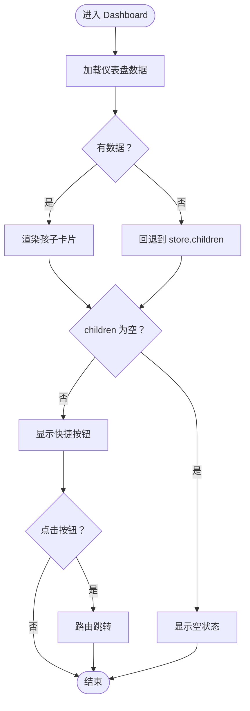

图表来源
- [star-park/pc-admin/src/views/Dashboard.vue:1-146](file://star-park/pc-admin/src/views/Dashboard.vue#L1-L146)

章节来源
- [star-park/pc-admin/src/views/Dashboard.vue:1-146](file://star-park/pc-admin/src/views/Dashboard.vue#L1-L146)

### 页面 F：Checkin（PC 后台）
- 行为
  - 日期选择器联动任务与打卡记录。
  - 支持特殊积分奖励弹窗。
  - 提交打卡后刷新状态并提示。
- 测试要点
  - 日期变更后并发请求任务与打卡数据。
  - 任务勾选状态与奖励计算。
  - 弹窗表单校验与提交。
  - 提交成功后消息提示与数据刷新。
- 示例测试场景
  - 选择历史日期，按钮禁用。
  - 勾选任务后奖励金额正确累加。
  - 打开积分弹窗，填写必填项并提交。

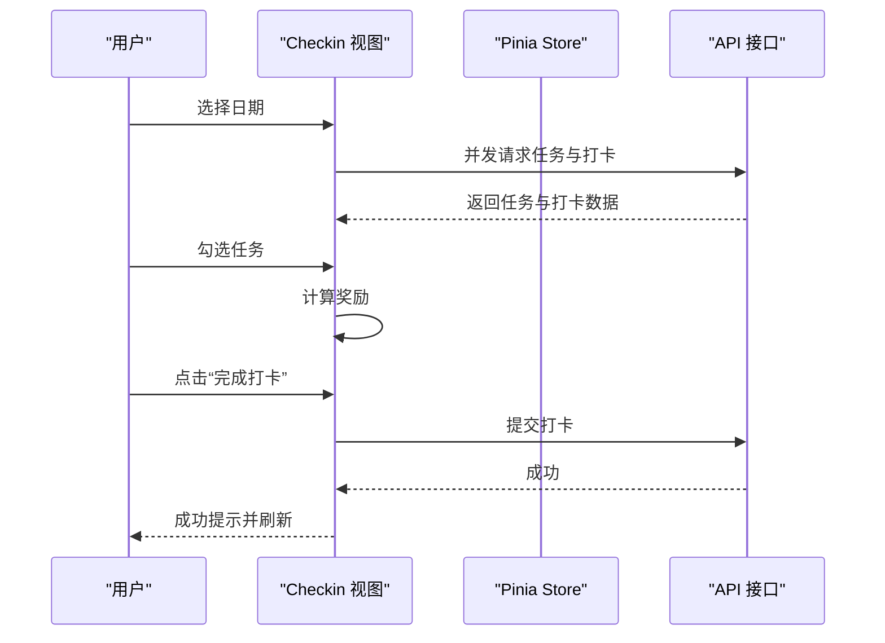

图表来源
- [star-park/pc-admin/src/views/Checkin.vue:1-417](file://star-park/pc-admin/src/views/Checkin.vue#L1-L417)
- [star-park/pc-admin/src/stores/app.js:1-62](file://star-park/pc-admin/src/stores/app.js#L1-L62)

章节来源
- [star-park/pc-admin/src/views/Checkin.vue:1-417](file://star-park/pc-admin/src/views/Checkin.vue#L1-L417)
- [star-park/pc-admin/src/stores/app.js:1-62](file://star-park/pc-admin/src/stores/app.js#L1-L62)

### 页面 G：首页（小程序）
- 行为
  - 根据时间生成问候语，展示日期与完成统计。
  - 点击卡片跳转到打卡页。
- 测试要点
  - 不同时段问候语正确。
  - 日期字符串格式化。
  - 汇总数据（最长连续、本周完成率、总积累）计算。
- 示例测试场景
  - 传入 children，断言“已完成/总数”统计。
  - 点击卡片，断言 switchTab 到打卡页。

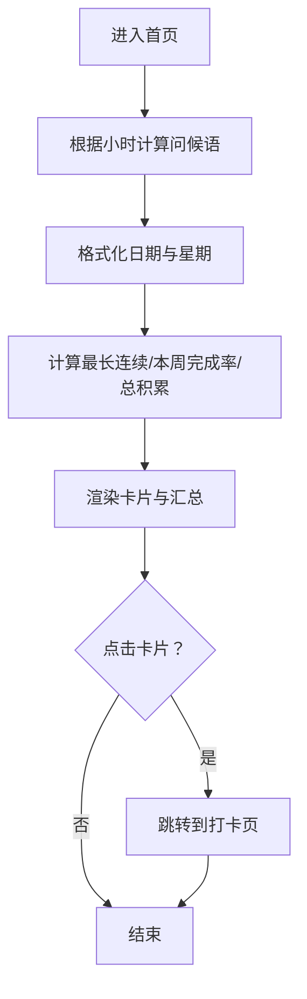

图表来源
- [star-park/miniprogram/src/pages/index/index.vue:1-194](file://star-park/miniprogram/src/pages/index/index.vue#L1-L194)

章节来源
- [star-park/miniprogram/src/pages/index/index.vue:1-194](file://star-park/miniprogram/src/pages/index/index.vue#L1-L194)

### 页面 H：打卡页（小程序）
- 行为
  - 孩子选择器、任务勾选、打卡成功动画、积分奖励弹窗。
  - 提交后标记已打卡任务并显示成功弹层。
- 测试要点
  - 孩子切换后任务列表更新。
  - 勾选任务后奖励金额计算。
  - 提交按钮可用性判断。
  - 成功动画与提示。
- 示例测试场景
  - 选择孩子，断言 activeChild 与 activeTasks。
  - 勾选任务后 todayReward 正确。
  - 提交后标记 checkedToday 并显示成功弹层。

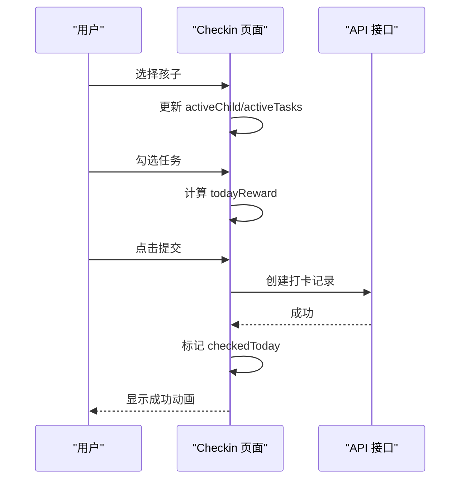

图表来源
- [star-park/miniprogram/src/pages/checkin/index.vue:1-322](file://star-park/miniprogram/src/pages/checkin/index.vue#L1-L322)

章节来源
- [star-park/miniprogram/src/pages/checkin/index.vue:1-322](file://star-park/miniprogram/src/pages/checkin/index.vue#L1-L322)

## 依赖分析
- 小程序前端
  - 依赖 @dcloudio/uni-app、@dcloudio/uni-mp-weixin、pinia、vue。
  - 开发依赖包含 @dcloudio/uni-automator、@dcloudio/vite-plugin-uni 等。
- PC 管理后台
  - 依赖 vue、vue-router、pinia、element-plus、echarts、axios、dayjs。
  - 开发依赖包含 @vitejs/plugin-vue、vite。
- 路由与状态
  - PC 后台通过 router/index.js 配置嵌套路由与标题设置。
  - 通过 stores/app.js 管理 children、currentChild、loading、颜色映射与异步加载。

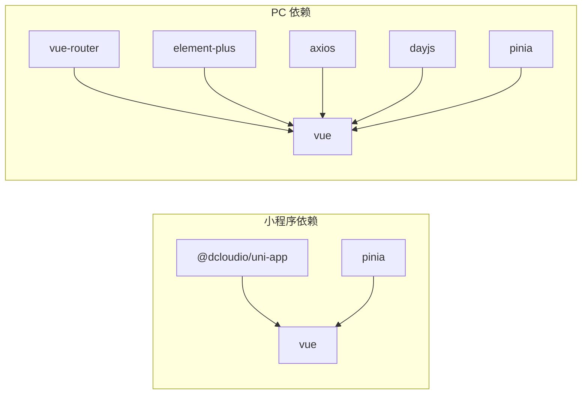

图表来源
- [star-park/miniprogram/package.json:1-28](file://star-park/miniprogram/package.json#L1-L28)
- [star-park/pc-admin/package.json:1-26](file://star-park/pc-admin/package.json#L1-L26)

章节来源
- [star-park/miniprogram/package.json:1-28](file://star-park/miniprogram/package.json#L1-L28)
- [star-park/pc-admin/package.json:1-26](file://star-park/pc-admin/package.json#L1-L26)
- [star-park/pc-admin/src/router/index.js:1-67](file://star-park/pc-admin/src/router/index.js#L1-L67)
- [star-park/pc-admin/src/stores/app.js:1-62](file://star-park/pc-admin/src/stores/app.js#L1-L62)

## 性能考虑
- 组件渲染优化
  - 使用 v-show/v-if 控制复杂区域渲染，避免不必要的 DOM。
  - 列表渲染时使用稳定 key，减少重排。
- 网络请求优化
  - 合理使用并发请求（如 PC 打卡页的 Promise.all）。
  - 对高频请求进行缓存或节流。
- 资源加载
  - 图片与图标按需加载，避免阻塞主线程。
  - 使用懒加载组件与路由（PC 后台已使用动态导入）。
- 性能测试建议
  - 使用浏览器性能面板测量关键路径渲染时间。
  - 在 CI 中引入 Lighthouse 或 WebPageTest 报告基线。

## 故障排查指南
- 路由标题不更新
  - 检查 router.beforeEach 是否正确设置 document.title。
- 状态未刷新
  - 确认提交后调用数据拉取函数并重置 loading。
- 小程序页面无法跳转
  - 检查 switchTab/url 配置与页面路径。
- 组件样式异常
  - 校验 scoped 样式与主题变量是否一致。
- 空状态显示问题
  - 确认 children.length 与 loading 状态判断逻辑。

章节来源
- [star-park/pc-admin/src/router/index.js:61-64](file://star-park/pc-admin/src/router/index.js#L61-L64)
- [star-park/pc-admin/src/views/Dashboard.vue:89-91](file://star-park/pc-admin/src/views/Dashboard.vue#L89-L91)
- [star-park/miniprogram/src/pages/index/index.vue:93-97](file://star-park/miniprogram/src/pages/index/index.vue#L93-L97)
- [star-park/miniprogram/src/pages/checkin/index.vue:165-192](file://star-park/miniprogram/src/pages/checkin/index.vue#L165-L192)

## 结论
本测试文档基于项目现有代码结构，明确了两类前端的测试重点与实施策略。通过组件级断言、路由与状态联动验证、用户交互模拟以及端到端流程覆盖，可有效保障功能正确性与用户体验稳定性。建议在持续集成中引入自动化测试与质量门禁，确保回归测试覆盖率与性能基线。

## 附录
- 测试框架与工具建议
  - 小程序：基于 uni-app 的 uni-automator 进行端到端测试；组件测试可参考 uni-app 生态的单元测试方案。
  - PC 后台：可采用 Vitest + @vue/test-utils 进行组件与单元测试；Cypress 或 Playwright 进行端到端测试。
- 响应式设计与浏览器兼容性
  - 使用媒体查询与弹性布局，针对移动端与桌面端分别验证。
  - 在主流浏览器（Chrome、Firefox、Safari、Edge）与微信开发者工具中进行回归测试。
- 可访问性（a11y）
  - 确保标签、焦点顺序与键盘可达性；为图片与图标提供替代文本；保证足够的对比度。
- 截图对比测试
  - 使用 Percy 或类似工具对关键页面进行快照比对，识别 UI 回退。
- 性能与体验
  - 关键渲染路径（FCP/LCP/CLS）监控；首屏加载时间与交互延迟阈值设定。