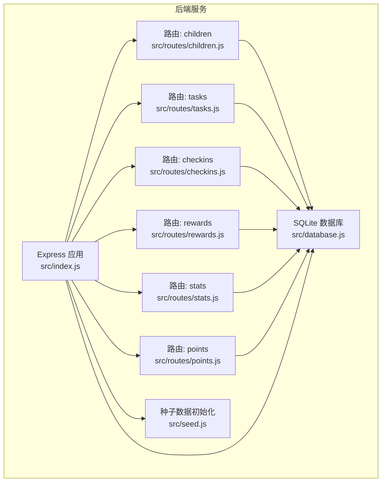
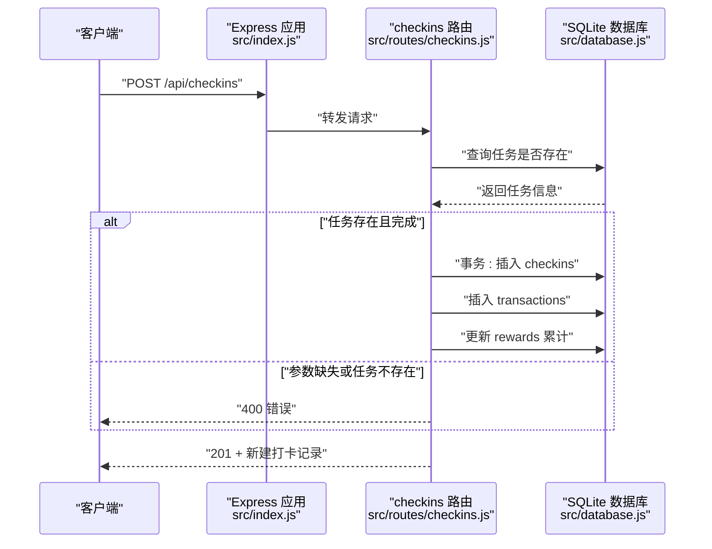
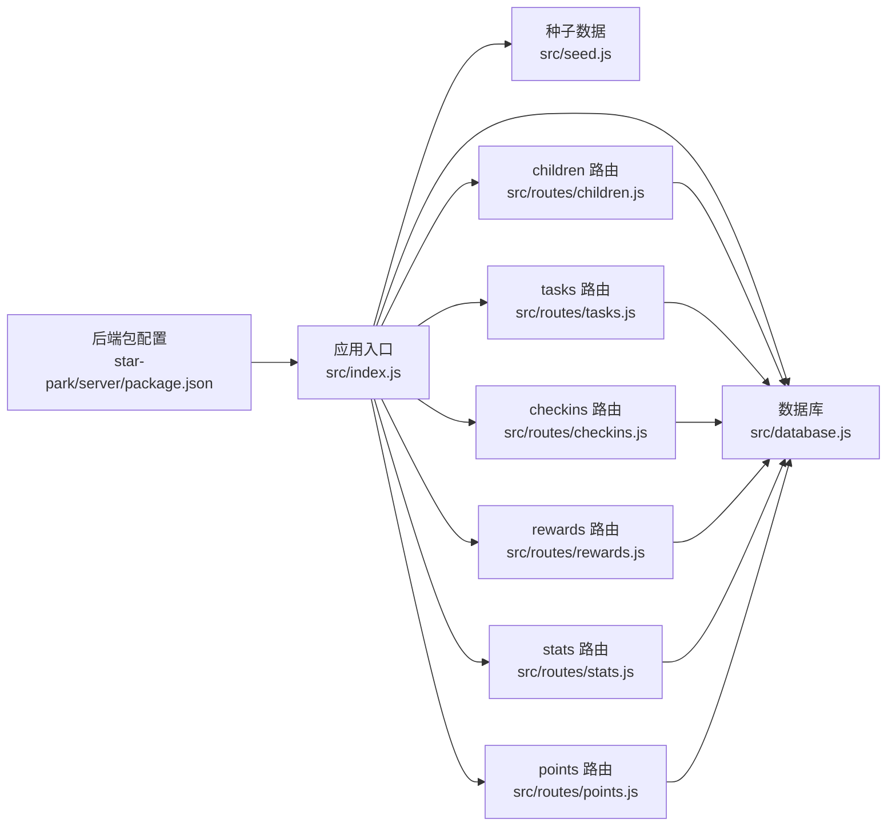

# 单元测试

<cite>
**本文引用的文件**
- [package.json](file://star-park/server/package.json)
- [index.js](file://star-park/server/src/index.js)
- [database.js](file://star-park/server/src/database.js)
- [children.js](file://star-park/server/src/routes/children.js)
- [tasks.js](file://star-park/server/src/routes/tasks.js)
- [checkins.js](file://star-park/server/src/routes/checkins.js)
- [rewards.js](file://star-park/server/src/routes/rewards.js)
- [stats.js](file://star-park/server/src/routes/stats.js)
- [points.js](file://star-park/server/src/routes/points.js)
- [seed.js](file://star-park/server/src/seed.js)
- [run-api-tests.sh](file://scripts/run-api-tests.sh)
</cite>

## 目录
1. [引言](#引言)
2. [项目结构](#项目结构)
3. [核心组件](#核心组件)
4. [架构总览](#架构总览)
5. [详细组件分析](#详细组件分析)
6. [依赖分析](#依赖分析)
7. [性能考虑](#性能考虑)
8. [故障排查指南](#故障排查指南)
9. [结论](#结论)
10. [附录](#附录)

## 引言
本文件面向 StarParadise 项目后端服务，系统化阐述单元测试与集成测试的实施策略，覆盖以下方面：
- 后端路由模块测试：针对 children、tasks、checkins、rewards、stats、points 等路由的请求/响应行为进行验证
- 数据库操作测试：围绕 better-sqlite3 的建表、迁移、事务、查询与更新进行测试
- 核心业务逻辑测试：如打卡奖励发放、奖励目标累计、仪表盘统计等
- 测试框架与工具：结合现有脚本与依赖，给出可落地的测试方案
- Mock 对象与测试数据：如何隔离数据库与外部依赖，准备最小化测试集
- 断言与覆盖率：断言方法建议、覆盖率目标与持续集成建议
- 错误处理、边界条件与异常：对 4xx/5xx 场景、空数据、并发场景的测试要点

## 项目结构
后端服务采用 Express + better-sqlite3 架构，路由集中在 src/routes 下，数据库初始化与建表在 database.js，应用入口在 index.js，并在启动时执行种子数据初始化。

图表来源
- [index.js:1-42](file://star-park/server/src/index.js#L1-L42)
- [database.js:1-90](file://star-park/server/src/database.js#L1-L90)
- [children.js:1-88](file://star-park/server/src/routes/children.js#L1-L88)
- [tasks.js:1-91](file://star-park/server/src/routes/tasks.js#L1-L91)
- [checkins.js:1-90](file://star-park/server/src/routes/checkins.js#L1-L90)
- [rewards.js:1-84](file://star-park/server/src/routes/rewards.js#L1-L84)
- [stats.js:1-182](file://star-park/server/src/routes/stats.js#L1-L182)
- [points.js:1-74](file://star-park/server/src/routes/points.js#L1-L74)
- [seed.js:1-45](file://star-park/server/src/seed.js#L1-L45)

章节来源
- [index.js:1-42](file://star-park/server/src/index.js#L1-L42)
- [database.js:1-90](file://star-park/server/src/database.js#L1-L90)
- [seed.js:1-45](file://star-park/server/src/seed.js#L1-L45)

## 核心组件
- Express 应用与中间件：启用 CORS、JSON 解析；挂载各路由模块；提供健康检查接口；启动时执行种子数据初始化
- 数据库层：better-sqlite3 连接本地 SQLite 文件，启用 WAL 与外键约束；建表与迁移；提供事务支持
- 路由层：children（增删改查、余额与交易）、tasks（CRUD、级联删除）、checkins（创建打卡并联动交易与奖励累计）、rewards（目标 CRUD）、stats（个人与仪表盘统计）、points（积分记录与余额）

章节来源
- [index.js:1-42](file://star-park/server/src/index.js#L1-L42)
- [database.js:1-90](file://star-park/server/src/database.js#L1-L90)
- [children.js:1-88](file://star-park/server/src/routes/children.js#L1-L88)
- [tasks.js:1-91](file://star-park/server/src/routes/tasks.js#L1-L91)
- [checkins.js:1-90](file://star-park/server/src/routes/checkins.js#L1-L90)
- [rewards.js:1-84](file://star-park/server/src/routes/rewards.js#L1-L84)
- [stats.js:1-182](file://star-park/server/src/routes/stats.js#L1-L182)
- [points.js:1-74](file://star-park/server/src/routes/points.js#L1-L74)

## 架构总览
下图展示一次“创建打卡”请求的端到端流程，体现路由、数据库与事务的协作关系。

图表来源
- [index.js:1-42](file://star-park/server/src/index.js#L1-L42)
- [checkins.js:1-90](file://star-park/server/src/routes/checkins.js#L1-L90)
- [database.js:1-90](file://star-park/server/src/database.js#L1-L90)

## 详细组件分析

### 路由模块测试策略
- 子模块划分：每个路由文件独立导出路由器，便于单独挂载与测试
- 典型测试点：
  - 正常路径：参数齐全、数据存在、返回 2xx
  - 参数校验：必填字段缺失、类型不合法、返回 400
  - 资源状态：资源不存在返回 404
  - 业务一致性：如创建打卡后余额与奖励累计正确
- 测试数据：使用种子数据或在测试前注入最小化数据集

章节来源
- [children.js:1-88](file://star-park/server/src/routes/children.js#L1-L88)
- [tasks.js:1-91](file://star-park/server/src/routes/tasks.js#L1-L91)
- [checkins.js:1-90](file://star-park/server/src/routes/checkins.js#L1-L90)
- [rewards.js:1-84](file://star-park/server/src/routes/rewards.js#L1-L84)
- [stats.js:1-182](file://star-park/server/src/routes/stats.js#L1-L182)
- [points.js:1-74](file://star-park/server/src/routes/points.js#L1-L74)

### 数据库操作测试策略
- 建表与迁移：验证表结构、默认值、外键约束、迁移脚本无异常
- 事务：对涉及多表写入的流程（如创建打卡）进行事务回滚与提交验证
- 查询与更新：参数化查询、聚合统计、时间范围查询的正确性
- 并发与一致性：WAL 模式下的并发读写行为

章节来源
- [database.js:1-90](file://star-park/server/src/database.js#L1-L90)

### 核心业务逻辑测试策略
- 打卡奖励链路：完成度、奖励金额、交易记录、奖励累计、奖励达成状态
- 仪表盘统计：连续打卡、本周完成率、余额、30 天每日完成情况
- 积分管理：手动加减积分、余额更新、记录转换

章节来源
- [checkins.js:1-90](file://star-park/server/src/routes/checkins.js#L1-L90)
- [stats.js:1-182](file://star-park/server/src/routes/stats.js#L1-L182)
- [points.js:1-74](file://star-park/server/src/routes/points.js#L1-L74)

### 测试框架与工具
- 当前仓库未包含 Jest/Mocha 等测试框架依赖，但后端依赖中包含 Express、better-sqlite3、dayjs、cors 等运行时依赖
- 建议引入测试框架与断言库（如 Jest + supertest），并配合 better-sqlite3 的内存数据库或临时文件进行隔离测试
- 可复用现有脚本 run-api-tests.sh 的思路，将端到端测试与单元测试并行推进

章节来源
- [package.json:1-15](file://star-park/server/package.json#L1-L15)
- [run-api-tests.sh:1-36](file://scripts/run-api-tests.sh#L1-L36)

### Mock 对象与测试数据
- Mock 对象：对数据库连接层进行 Mock，避免真实磁盘文件与锁竞争；对第三方库（如 dayjs）进行时间 Mock
- 测试数据：优先使用种子数据；在测试前清理或重建最小化数据集；对事务性操作使用事务回滚模拟失败场景

章节来源
- [seed.js:1-45](file://star-park/server/src/seed.js#L1-L45)
- [database.js:1-90](file://star-park/server/src/database.js#L1-L90)

### 断言与覆盖率
- 断言方法：状态码、响应体结构、字段存在性、数值范围、时间格式
- 覆盖率目标：建议语句覆盖率、分支覆盖率、函数覆盖率均不低于 80%，关键业务路径不低于 90%
- 持续集成：在 CI 中运行单元测试与端到端测试脚本，失败即阻断

章节来源
- [run-api-tests.sh:1-36](file://scripts/run-api-tests.sh#L1-L36)

### 错误处理、边界条件与异常
- 参数校验：必填字段缺失、非法类型、越界值
- 资源状态：资源不存在、重复创建、删除级联
- 业务异常：任务不存在、完成度与奖励不匹配、余额不足（积分消费场景）
- 边界条件：时间范围边界、空结果集、零值与负值、最大/最小数值

章节来源
- [children.js:1-88](file://star-park/server/src/routes/children.js#L1-L88)
- [tasks.js:1-91](file://star-park/server/src/routes/tasks.js#L1-L91)
- [checkins.js:1-90](file://star-park/server/src/routes/checkins.js#L1-L90)
- [rewards.js:1-84](file://star-park/server/src/routes/rewards.js#L1-L84)
- [stats.js:1-182](file://star-park/server/src/routes/stats.js#L1-L182)
- [points.js:1-74](file://star-park/server/src/routes/points.js#L1-L74)

## 依赖分析
后端服务依赖关系如下：

图表来源
- [package.json:1-15](file://star-park/server/package.json#L1-L15)
- [index.js:1-42](file://star-park/server/src/index.js#L1-L42)
- [database.js:1-90](file://star-park/server/src/database.js#L1-L90)
- [seed.js:1-45](file://star-park/server/src/seed.js#L1-L45)
- [children.js:1-88](file://star-park/server/src/routes/children.js#L1-L88)
- [tasks.js:1-91](file://star-park/server/src/routes/tasks.js#L1-L91)
- [checkins.js:1-90](file://star-park/server/src/routes/checkins.js#L1-L90)
- [rewards.js:1-84](file://star-park/server/src/routes/rewards.js#L1-L84)
- [stats.js:1-182](file://star-park/server/src/routes/stats.js#L1-L182)
- [points.js:1-74](file://star-park/server/src/routes/points.js#L1-L74)

章节来源
- [package.json:1-15](file://star-park/server/package.json#L1-L15)
- [index.js:1-42](file://star-park/server/src/index.js#L1-L42)

## 性能考虑
- 数据库并发：WAL 模式提升并发读取能力；对高并发写入场景，建议在测试中模拟并发事务冲突
- 查询优化：对高频统计查询（如仪表盘）进行索引与 SQL 优化验证
- 内存数据库：在单元测试中使用内存数据库减少 IO 开销

## 故障排查指南
- 健康检查失败：确认服务已启动、端口占用、CORS 配置
- 路由 404：核对路由挂载路径与请求路径一致
- 业务 400/404：检查参数校验与资源存在性逻辑
- 事务异常：确认事务包裹的多步写入是否完整提交或回滚
- 端到端脚本：使用 run-api-tests.sh 快速验证健康检查、列表读取与仪表盘接口

章节来源
- [run-api-tests.sh:1-36](file://scripts/run-api-tests.sh#L1-L36)

## 结论
通过将路由、数据库与业务逻辑拆分为可测试单元，结合 Mock 与最小化测试数据，可在不依赖生产环境的情况下稳定验证功能正确性。建议逐步引入测试框架与覆盖率监控，并将单元测试与现有端到端脚本协同纳入 CI 流程。

## 附录

### 测试用例编写规范
- 命名规范：describe/it 使用清晰语义，如 describe('children 路由'), it('应返回所有孩子及其任务')
- 前置条件：每个测试前准备最小化数据，测试后清理或回滚
- 断言层次：先断言状态码，再断言响应体结构与字段，最后断言业务值
- 异常用例：覆盖参数缺失、非法类型、资源不存在、事务失败等

### 具体测试示例（步骤说明）
- 数据库查询测试
  - 步骤：在测试前插入最小化数据；调用对应查询接口；断言返回条目数量与字段
  - 关注点：参数化查询、排序、分页（如适用）
- API 路由测试
  - 步骤：使用 supertest 发送请求；断言状态码与 JSON 结构
  - 关注点：GET/POST/PUT/DELETE 的不同行为与鉴权（如无鉴权则无需）
- 数据验证测试
  - 步骤：构造非法输入（如必填字段为空、非数字字符串）；断言 400
  - 关注点：边界值（0、负数、极大值）与类型转换

### 错误处理、边界条件与异常测试清单
- 参数校验：必填缺失、类型不符、越界
- 资源状态：不存在、重复、级联删除
- 业务异常：奖励金额为 0、余额不足、日期格式错误
- 并发异常：事务回滚、死锁模拟（内存数据库下较难，可用超时与重试策略验证）