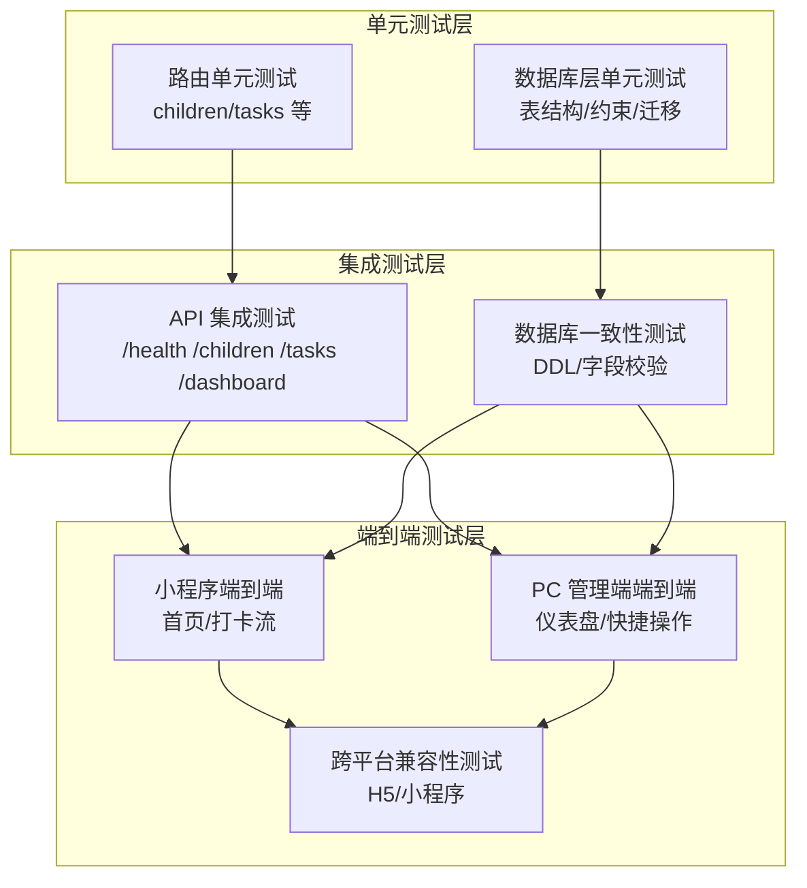
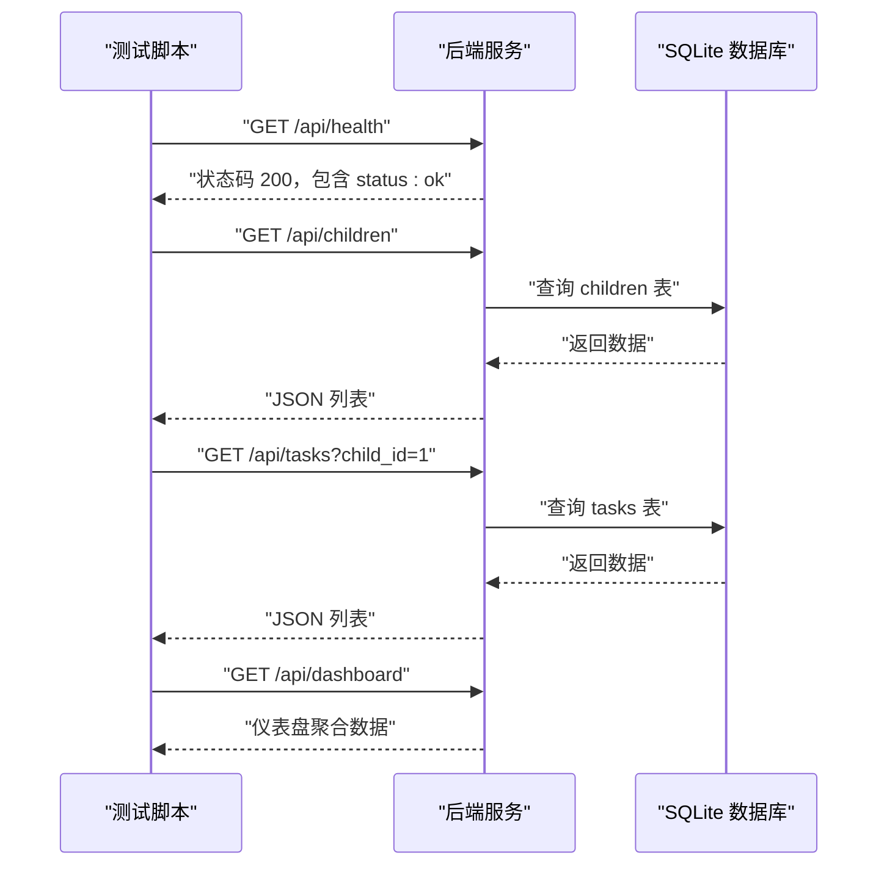
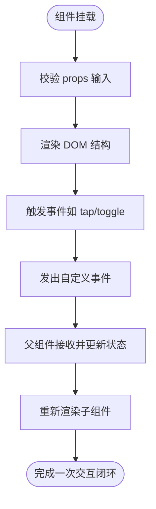
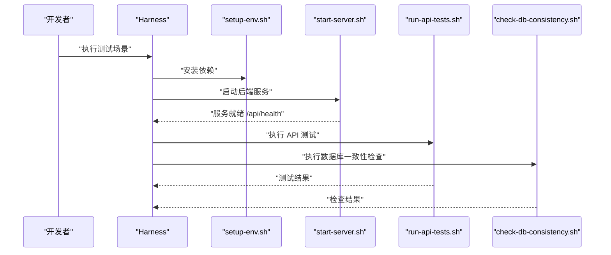
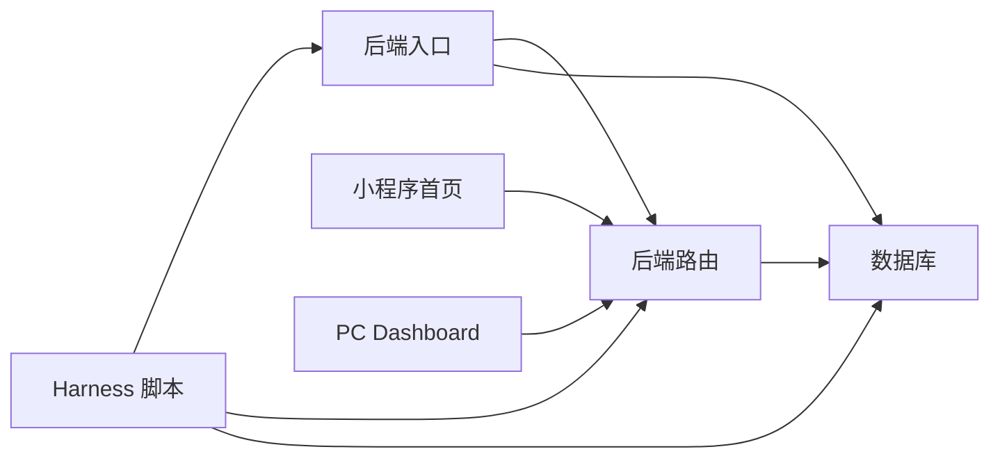

# 测试策略

<cite>
**本文引用的文件**
- [scripts/run-api-tests.sh](file://scripts/run-api-tests.sh)
- [scripts/check-db-consistency.sh](file://scripts/check-db-consistency.sh)
- [harness/config/environment.json](file://harness/config/environment.json)
- [harness/scripts/setup-env.sh](file://harness/scripts/setup-env.sh)
- [harness/scripts/start-server.sh](file://harness/scripts/start-server.sh)
- [star-park/server/src/index.js](file://star-park/server/src/index.js)
- [star-park/server/src/database.js](file://star-park/server/src/database.js)
- [star-park/server/src/routes/children.js](file://star-park/server/src/routes/children.js)
- [star-park/server/src/routes/tasks.js](file://star-park/server/src/routes/tasks.js)
- [star-park/miniprogram/package.json](file://star-park/miniprogram/package.json)
- [star-park/pc-admin/package.json](file://star-park/pc-admin/package.json)
- [star-park/miniprogram/src/components/ChildCard.vue](file://star-park/miniprogram/src/components/ChildCard.vue)
- [star-park/miniprogram/src/components/TaskItem.vue](file://star-park/miniprogram/src/components/TaskItem.vue)
- [star-park/pc-admin/src/components/ChildCard.vue](file://star-park/pc-admin/src/components/ChildCard.vue)
- [star-park/pc-admin/src/components/Layout.vue](file://star-park/pc-admin/src/components/Layout.vue)
- [star-park/miniprogram/src/pages/index/index.vue](file://star-park/miniprogram/src/pages/index/index.vue)
- [star-park/pc-admin/src/views/Dashboard.vue](file://star-park/pc-admin/src/views/Dashboard.vue)
</cite>

## 目录
1. [引言](#引言)
2. [项目结构](#项目结构)
3. [核心组件](#核心组件)
4. [架构总览](#架构总览)
5. [详细组件分析](#详细组件分析)
6. [依赖关系分析](#依赖关系分析)
7. [性能考虑](#性能考虑)
8. [故障排查指南](#故障排查指南)
9. [结论](#结论)
10. [附录](#附录)

## 引言
本测试策略文档面向 StarParadise 项目，围绕测试金字塔（单元测试、集成测试、端到端测试）制定系统化测试方案，覆盖 API 测试规范、数据库一致性测试、前端组件测试、跨平台兼容性测试，并提供测试环境搭建、测试数据准备、自动化测试脚本使用、代码覆盖率要求、测试报告生成、缺陷跟踪流程与回归测试策略，以及性能测试、安全测试与用户体验测试流程建议。

## 项目结构
项目采用多端同构架构：后端基于 Express + better-sqlite3，提供 REST API；前端包含微信小程序端与 PC 管理端，分别使用 Vue 3 + UniApp 与 Vue 3 + Element Plus。测试基础设施通过 Harness 提供环境配置与脚本编排，配合仓库根目录下的自动化脚本实现 API 与数据库一致性验证。

```mermaid
graph TB
subgraph "后端服务"
SIndex["server/src/index.js"]
SDao["server/src/database.js"]
RChildren["server/src/routes/children.js"]
RTasks["server/src/routes/tasks.js"]
end
subgraph "前端 - 小程序"
MPkg["miniprogram/package.json"]
MIndexPage["miniprogram/src/pages/index/index.vue"]
MChildCard["miniprogram/src/components/ChildCard.vue"]
MTaskItem["miniprogram/src/components/TaskItem.vue"]
end
subgraph "前端 - PC 管理端"
PCPkg["pc-admin/package.json"]
PCDash["pc-admin/src/views/Dashboard.vue"]
PCLayout["pc-admin/src/components/Layout.vue"]
PCChildCard["pc-admin/src/components/ChildCard.vue"]
end
subgraph "测试与工具"
EnvCfg["harness/config/environment.json"]
Setup["harness/scripts/setup-env.sh"]
Start["harness/scripts/start-server.sh"]
APITest["scripts/run-api-tests.sh"]
DBTest["scripts/check-db-consistency.sh"]
end
MIndexPage --> RChildren
MIndexPage --> RTasks
PCDash --> RChildren
PCDash --> RTasks
SIndex --> SDao
SIndex --> RChildren
SIndex --> RTasks
APITest --> SIndex
DBTest --> SDao
Start --> SIndex
Setup --> SIndex
```

图表来源
- [star-park/server/src/index.js:1-42](file://star-park/server/src/index.js#L1-L42)
- [star-park/server/src/database.js:1-90](file://star-park/server/src/database.js#L1-L90)
- [star-park/server/src/routes/children.js:1-88](file://star-park/server/src/routes/children.js#L1-L88)
- [star-park/server/src/routes/tasks.js:1-91](file://star-park/server/src/routes/tasks.js#L1-L91)
- [star-park/miniprogram/src/pages/index/index.vue:1-194](file://star-park/miniprogram/src/pages/index/index.vue#L1-L194)
- [star-park/pc-admin/src/views/Dashboard.vue:1-146](file://star-park/pc-admin/src/views/Dashboard.vue#L1-L146)
- [harness/config/environment.json:1-56](file://harness/config/environment.json#L1-L56)
- [harness/scripts/setup-env.sh:1-23](file://harness/scripts/setup-env.sh#L1-L23)
- [harness/scripts/start-server.sh:1-29](file://harness/scripts/start-server.sh#L1-L29)
- [scripts/run-api-tests.sh:1-36](file://scripts/run-api-tests.sh#L1-L36)
- [scripts/check-db-consistency.sh:1-45](file://scripts/check-db-consistency.sh#L1-L45)

章节来源
- [harness/config/environment.json:1-56](file://harness/config/environment.json#L1-L56)
- [harness/scripts/setup-env.sh:1-23](file://harness/scripts/setup-env.sh#L1-L23)
- [harness/scripts/start-server.sh:1-29](file://harness/scripts/start-server.sh#L1-L29)
- [scripts/run-api-tests.sh:1-36](file://scripts/run-api-tests.sh#L1-L36)
- [scripts/check-db-consistency.sh:1-45](file://scripts/check-db-consistency.sh#L1-L45)

## 核心组件
- 后端服务：提供 /api/health 健康检查、/api/children、/api/tasks、/api/checkins、/api/rewards、/api/stats、/api/dashboard、/api/points 等路由，使用 better-sqlite3 管理 SQLite 数据库。
- 数据层：初始化 WAL 模式与外键约束，定义 children、tasks、checkins、rewards、transactions、points 等核心表，并具备迁移逻辑（如为 children 表新增 points_balance 字段）。
- 前端（小程序）：首页聚合展示仪表盘数据，使用 ChildCard、TaskItem 组件渲染；组件通过 props 与事件进行交互。
- 前端（PC 管理端）：Dashboard 页面拉取仪表盘数据并以 ChildCard 展示；Layout 组件承载侧边导航与主内容区。

章节来源
- [star-park/server/src/index.js:1-42](file://star-park/server/src/index.js#L1-L42)
- [star-park/server/src/database.js:1-90](file://star-park/server/src/database.js#L1-L90)
- [star-park/server/src/routes/children.js:1-88](file://star-park/server/src/routes/children.js#L1-L88)
- [star-park/server/src/routes/tasks.js:1-91](file://star-park/server/src/routes/tasks.js#L1-L91)
- [star-park/miniprogram/src/components/ChildCard.vue:1-162](file://star-park/miniprogram/src/components/ChildCard.vue#L1-L162)
- [star-park/miniprogram/src/components/TaskItem.vue:1-98](file://star-park/miniprogram/src/components/TaskItem.vue#L1-L98)
- [star-park/pc-admin/src/components/ChildCard.vue:1-161](file://star-park/pc-admin/src/components/ChildCard.vue#L1-L161)
- [star-park/pc-admin/src/components/Layout.vue:1-29](file://star-park/pc-admin/src/components/Layout.vue#L1-L29)
- [star-park/miniprogram/src/pages/index/index.vue:1-194](file://star-park/miniprogram/src/pages/index/index.vue#L1-L194)
- [star-park/pc-admin/src/views/Dashboard.vue:1-146](file://star-park/pc-admin/src/views/Dashboard.vue#L1-L146)

## 架构总览
下图展示测试金字塔在本项目中的落地方式：单元测试聚焦后端路由与数据层；集成测试验证 API 与数据库一致性；端到端测试覆盖前后端协作流程与跨平台体验。

图表来源
- [scripts/run-api-tests.sh:1-36](file://scripts/run-api-tests.sh#L1-L36)
- [scripts/check-db-consistency.sh:1-45](file://scripts/check-db-consistency.sh#L1-L45)
- [star-park/server/src/database.js:1-90](file://star-park/server/src/database.js#L1-L90)
- [star-park/server/src/routes/children.js:1-88](file://star-park/server/src/routes/children.js#L1-L88)
- [star-park/server/src/routes/tasks.js:1-91](file://star-park/server/src/routes/tasks.js#L1-L91)
- [star-park/miniprogram/src/pages/index/index.vue:1-194](file://star-park/miniprogram/src/pages/index/index.vue#L1-L194)
- [star-park/pc-admin/src/views/Dashboard.vue:1-146](file://star-park/pc-admin/src/views/Dashboard.vue#L1-L146)

## 详细组件分析

### 后端服务与路由测试策略
- 单元测试
  - 路由层：针对 children 与 tasks 路由的 GET/POST/PUT/DELETE 逻辑进行断言，覆盖参数校验、错误处理与返回码。
  - 数据层：对数据库初始化、WAL/外键设置、DDL 与迁移逻辑进行断言，确保表结构与字段存在。
- 集成测试
  - API 集成：使用脚本对 /api/health、/api/children、/api/tasks、/api/dashboard 进行端到端请求验证，确保服务可用与数据返回符合预期。
  - 数据库一致性：通过 SQLite PRAGMA 与 .tables 校验核心表与关键字段存在性，避免迁移遗漏。
- 端到端测试
  - 覆盖“健康检查 → 获取孩子列表 → 获取任务列表 → 获取仪表盘”的完整流程，结合 Harness 环境脚本启动服务并等待就绪。

图表来源
- [scripts/run-api-tests.sh:1-36](file://scripts/run-api-tests.sh#L1-L36)
- [star-park/server/src/index.js:29-32](file://star-park/server/src/index.js#L29-L32)
- [star-park/server/src/routes/children.js:5-37](file://star-park/server/src/routes/children.js#L5-L37)
- [star-park/server/src/routes/tasks.js:5-19](file://star-park/server/src/routes/tasks.js#L5-L19)

章节来源
- [scripts/run-api-tests.sh:1-36](file://scripts/run-api-tests.sh#L1-L36)
- [scripts/check-db-consistency.sh:1-45](file://scripts/check-db-consistency.sh#L1-L45)
- [star-park/server/src/index.js:1-42](file://star-park/server/src/index.js#L1-L42)
- [star-park/server/src/database.js:1-90](file://star-park/server/src/database.js#L1-L90)
- [star-park/server/src/routes/children.js:1-88](file://star-park/server/src/routes/children.js#L1-L88)
- [star-park/server/src/routes/tasks.js:1-91](file://star-park/server/src/routes/tasks.js#L1-L91)

### 前端组件测试策略
- 单元测试
  - 小程序组件：ChildCard、TaskItem 通过 props 输入与事件发射进行断言，验证样式类名、文本内容与交互行为。
  - PC 组件：ChildCard、Layout 通过 props 与计算属性断言渲染结果与路由行为。
- 集成测试
  - 仪表盘页面：Dashboard 通过 API 获取数据并渲染 ChildCard 列表，需验证数据映射、空态与加载态。
- 端到端测试
  - 小程序首页：从加载仪表盘到点击进入打卡页的完整流程；PC 管理端：从加载 Dashboard 到点击快捷操作的流程。

图表来源
- [star-park/miniprogram/src/components/ChildCard.vue:31-43](file://star-park/miniprogram/src/components/ChildCard.vue#L31-L43)
- [star-park/miniprogram/src/components/TaskItem.vue:14-23](file://star-park/miniprogram/src/components/TaskItem.vue#L14-L23)
- [star-park/pc-admin/src/components/ChildCard.vue:49-64](file://star-park/pc-admin/src/components/ChildCard.vue#L49-L64)
- [star-park/pc-admin/src/components/Layout.vue:10-12](file://star-park/pc-admin/src/components/Layout.vue#L10-L12)
- [star-park/miniprogram/src/pages/index/index.vue:99-132](file://star-park/miniprogram/src/pages/index/index.vue#L99-L132)
- [star-park/pc-admin/src/views/Dashboard.vue:76-91](file://star-park/pc-admin/src/views/Dashboard.vue#L76-L91)

章节来源
- [star-park/miniprogram/src/components/ChildCard.vue:1-162](file://star-park/miniprogram/src/components/ChildCard.vue#L1-L162)
- [star-park/miniprogram/src/components/TaskItem.vue:1-98](file://star-park/miniprogram/src/components/TaskItem.vue#L1-L98)
- [star-park/pc-admin/src/components/ChildCard.vue:1-161](file://star-park/pc-admin/src/components/ChildCard.vue#L1-L161)
- [star-park/pc-admin/src/components/Layout.vue:1-29](file://star-park/pc-admin/src/components/Layout.vue#L1-L29)
- [star-park/miniprogram/src/pages/index/index.vue:1-194](file://star-park/miniprogram/src/pages/index/index.vue#L1-L194)
- [star-park/pc-admin/src/views/Dashboard.vue:1-146](file://star-park/pc-admin/src/views/Dashboard.vue#L1-L146)

### 测试环境与自动化脚本
- 环境配置：Harness 提供 runtime、databases、test_environment、functional_scenarios、scripts 等配置，支持 SQLite 内存替代方案与测试命令占位。
- 环境搭建：setup-env.sh 安装后端与 PC 管理端依赖，无需外部数据库服务。
- 服务启动：start-server.sh 导出端口与环境变量，启动后端服务并轮询 /api/health 确认就绪。
- API 测试：run-api-tests.sh 对健康检查、孩子列表、任务列表、仪表盘接口进行验证。
- 数据库一致性：check-db-consistency.sh 校验核心表与关键字段存在性。

图表来源
- [harness/config/environment.json:1-56](file://harness/config/environment.json#L1-L56)
- [harness/scripts/setup-env.sh:1-23](file://harness/scripts/setup-env.sh#L1-L23)
- [harness/scripts/start-server.sh:1-29](file://harness/scripts/start-server.sh#L1-L29)
- [scripts/run-api-tests.sh:1-36](file://scripts/run-api-tests.sh#L1-L36)
- [scripts/check-db-consistency.sh:1-45](file://scripts/check-db-consistency.sh#L1-L45)

章节来源
- [harness/config/environment.json:1-56](file://harness/config/environment.json#L1-L56)
- [harness/scripts/setup-env.sh:1-23](file://harness/scripts/setup-env.sh#L1-L23)
- [harness/scripts/start-server.sh:1-29](file://harness/scripts/start-server.sh#L1-L29)
- [scripts/run-api-tests.sh:1-36](file://scripts/run-api-tests.sh#L1-L36)
- [scripts/check-db-consistency.sh:1-45](file://scripts/check-db-consistency.sh#L1-L45)

## 依赖关系分析
- 后端路由依赖数据库连接与初始化种子数据；Express 中间件启用 CORS 与 JSON 解析。
- 前端页面通过 API 模块调用后端接口；组件之间通过 props 与事件通信。
- Harness 环境脚本负责服务生命周期管理与测试前置条件准备。

图表来源
- [star-park/server/src/index.js:1-42](file://star-park/server/src/index.js#L1-L42)
- [star-park/server/src/database.js:1-90](file://star-park/server/src/database.js#L1-L90)
- [star-park/server/src/routes/children.js:1-88](file://star-park/server/src/routes/children.js#L1-L88)
- [star-park/server/src/routes/tasks.js:1-91](file://star-park/server/src/routes/tasks.js#L1-L91)
- [star-park/miniprogram/src/pages/index/index.vue:1-194](file://star-park/miniprogram/src/pages/index/index.vue#L1-L194)
- [star-park/pc-admin/src/views/Dashboard.vue:1-146](file://star-park/pc-admin/src/views/Dashboard.vue#L1-L146)
- [harness/scripts/start-server.sh:1-29](file://harness/scripts/start-server.sh#L1-L29)

章节来源
- [star-park/server/src/index.js:1-42](file://star-park/server/src/index.js#L1-L42)
- [star-park/server/src/database.js:1-90](file://star-park/server/src/database.js#L1-L90)
- [star-park/server/src/routes/children.js:1-88](file://star-park/server/src/routes/children.js#L1-L88)
- [star-park/server/src/routes/tasks.js:1-91](file://star-park/server/src/routes/tasks.js#L1-L91)
- [star-park/miniprogram/src/pages/index/index.vue:1-194](file://star-park/miniprogram/src/pages/index/index.vue#L1-L194)
- [star-park/pc-admin/src/views/Dashboard.vue:1-146](file://star-park/pc-admin/src/views/Dashboard.vue#L1-L146)
- [harness/scripts/start-server.sh:1-29](file://harness/scripts/start-server.sh#L1-L29)

## 性能考虑
- 数据库性能：启用 WAL 模式与外键约束，减少锁竞争；对高频查询建立索引（如 children.id、tasks.child_id、checkins.child_id/task_id）。
- 接口优化：分页查询任务列表与打卡记录；缓存仪表盘聚合数据；避免 N+1 查询。
- 前端优化：组件懒加载、虚拟滚动、图片资源压缩；减少不必要的响应式计算与重渲染。
- 压测建议：使用压测工具对 /api/dashboard、/api/children、/api/tasks 进行并发与延迟测试，观察数据库与接口瓶颈。

## 故障排查指南
- 服务未启动或超时
  - 检查 start-server.sh 的端口与环境变量导出是否正确；确认 /api/health 可访问。
- API 返回异常
  - 核对请求路径与参数；检查路由层错误处理与状态码；查看后端日志。
- 数据库一致性问题
  - 使用 check-db-consistency.sh 校验表与字段；若缺失字段，检查迁移逻辑与数据库初始化脚本。
- 前端渲染异常
  - 检查 props 输入与事件发射；确认 API 返回数据结构与前端映射一致；定位组件计算属性与样式类名。

章节来源
- [harness/scripts/start-server.sh:1-29](file://harness/scripts/start-server.sh#L1-L29)
- [scripts/check-db-consistency.sh:1-45](file://scripts/check-db-consistency.sh#L1-L45)
- [star-park/server/src/routes/children.js:1-88](file://star-park/server/src/routes/children.js#L1-L88)
- [star-park/server/src/routes/tasks.js:1-91](file://star-park/server/src/routes/tasks.js#L1-L91)
- [star-park/miniprogram/src/components/ChildCard.vue:31-43](file://star-park/miniprogram/src/components/ChildCard.vue#L31-L43)
- [star-park/pc-admin/src/views/Dashboard.vue:76-91](file://star-park/pc-admin/src/views/Dashboard.vue#L76-L91)

## 结论
本测试策略以测试金字塔为核心，结合 Harness 环境与现有自动化脚本，形成从单元到端到端的完整测试闭环。通过明确 API 测试规范、数据库一致性检查、前端组件与跨平台兼容性测试，以及性能与安全测试建议，可有效保障 StarParadise 在多端场景下的质量与稳定性。

## 附录

### 测试金字塔实施清单
- 单元测试
  - 后端路由：children/tasks 的增删改查与错误分支。
  - 数据层：表结构、约束、迁移逻辑。
  - 前端组件：props 输入、事件发射、渲染断言。
- 集成测试
  - API：/health、/children、/tasks、/dashboard。
  - 数据库：核心表与关键字段存在性。
- 端到端测试
  - 小程序：首页仪表盘 → 打卡流程。
  - PC 管理端：Dashboard → 快捷操作。
  - 跨平台：H5 与小程序兼容性验证。

### 测试环境搭建步骤
- 安装依赖：执行 setup-env.sh。
- 启动服务：执行 start-server.sh，等待 /api/health 就绪。
- 运行测试：执行 run-api-tests.sh 与 check-db-consistency.sh。
- 清理环境：根据需要执行 Harness 的 teardown 脚本（如有）。

章节来源
- [harness/scripts/setup-env.sh:1-23](file://harness/scripts/setup-env.sh#L1-L23)
- [harness/scripts/start-server.sh:1-29](file://harness/scripts/start-server.sh#L1-L29)
- [scripts/run-api-tests.sh:1-36](file://scripts/run-api-tests.sh#L1-L36)
- [scripts/check-db-consistency.sh:1-45](file://scripts/check-db-consistency.sh#L1-L45)