# 自动化测试

<cite>
**本文引用的文件**
- [run-api-tests.sh](file://scripts/run-api-tests.sh)
- [code-review-check.sh](file://scripts/code-review-check.sh)
- [check-db-consistency.sh](file://scripts/check-db-consistency.sh)
- [lint-quality.py](file://scripts/lint-quality.py)
- [lint-deps.py](file://scripts/lint-deps.py)
- [generate-api-doc.sh](file://scripts/generate-api-doc.sh)
- [validate.py](file://scripts/validate.py)
- [README.md（验证脚本）](file://scripts/verify/README.md)
- [setup-env.sh](file://harness/scripts/setup-env.sh)
- [start-server.sh](file://harness/scripts/start-server.sh)
- [ARCHITECTURE.md](file://docs/ARCHITECTURE.md)
- [DEVELOPMENT.md](file://docs/DEVELOPMENT.md)
- [Makefile](file://Makefile)
</cite>

## 目录
1. [简介](#简介)
2. [项目结构](#项目结构)
3. [核心组件](#核心组件)
4. [架构总览](#架构总览)
5. [详细组件分析](#详细组件分析)
6. [依赖分析](#依赖分析)
7. [性能考虑](#性能考虑)
8. [故障排查指南](#故障排查指南)
9. [结论](#结论)
10. [附录](#附录)

## 简介
本文件面向 StarParadise 项目的持续集成与交付（CI/CD）场景，系统性梳理自动化测试与质量门禁的配置与执行方式。内容覆盖：
- CI/CD 流水线中的自动化测试配置与执行顺序
- API 测试自动化、代码质量检查自动化、依赖扫描自动化
- 测试环境自动搭建、测试数据准备、测试结果报告
- 覆盖率统计、性能回归检测、安全漏洞扫描的集成建议
- 质量门禁设置与失败重试机制

## 项目结构
项目采用 monorepo 结构，包含后端服务、管理后台前端与小程序前端三部分；同时提供统一的验证与构建脚本、测试脚本与基础设施脚本。

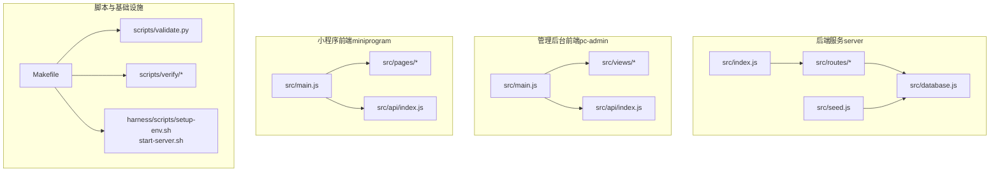

图表来源
- [ARCHITECTURE.md:14-71](file://docs/ARCHITECTURE.md#L14-L71)
- [DEVELOPMENT.md:72-99](file://docs/DEVELOPMENT.md#L72-L99)
- [Makefile:1-70](file://Makefile#L1-L70)

章节来源
- [ARCHITECTURE.md:1-209](file://docs/ARCHITECTURE.md#L1-L209)
- [DEVELOPMENT.md:1-123](file://docs/DEVELOPMENT.md#L1-L123)
- [Makefile:1-70](file://Makefile#L1-L70)

## 核心组件
- 统一验证管道：通过统一入口脚本按序执行构建、架构校验、测试与端到端验证，任一步骤失败即停止后续步骤。
- API 接口测试：对健康检查、资源列表与仪表盘接口进行端到端验证。
- 代码质量检查：识别原始调试输出、超大文件、硬编码 TODO 等问题。
- 依赖扫描：基于层层次结构强制约束模块导入方向，防止跨层与跨子项目不当依赖。
- DDL/实体一致性检查：校验 SQLite 表结构与预期字段。
- API 文档自动生成：从路由定义扫描端点，更新接口文档。
- 环境搭建与服务启动：自动安装依赖并启动后端服务，等待健康检查通过。
- 端到端验证：用户视角的功能验证脚本集合。

章节来源
- [validate.py:1-58](file://scripts/validate.py#L1-L58)
- [run-api-tests.sh:1-36](file://scripts/run-api-tests.sh#L1-L36)
- [lint-quality.py:1-124](file://scripts/lint-quality.py#L1-L124)
- [lint-deps.py:1-252](file://scripts/lint-deps.py#L1-L252)
- [check-db-consistency.sh:1-45](file://scripts/check-db-consistency.sh#L1-L45)
- [generate-api-doc.sh:1-18](file://scripts/generate-api-doc.sh#L1-L18)
- [setup-env.sh:1-28](file://harness/scripts/setup-env.sh#L1-L28)
- [start-server.sh:1-29](file://harness/scripts/start-server.sh#L1-L29)
- [README.md（验证脚本）:1-23](file://scripts/verify/README.md#L1-L23)

## 架构总览
下图展示 CI/CD 流水线中各阶段的交互与控制流，包括环境准备、服务启动、测试执行与结果判定。

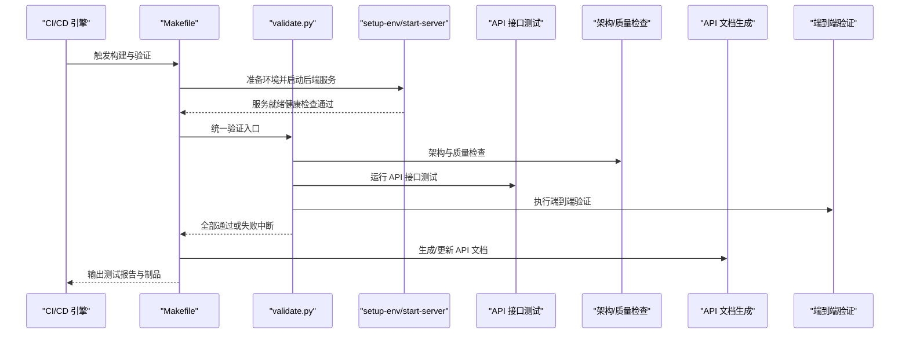

图表来源
- [Makefile:1-70](file://Makefile#L1-L70)
- [validate.py:1-58](file://scripts/validate.py#L1-L58)
- [setup-env.sh:1-28](file://harness/scripts/setup-env.sh#L1-L28)
- [start-server.sh:1-29](file://harness/scripts/start-server.sh#L1-L29)
- [run-api-tests.sh:1-36](file://scripts/run-api-tests.sh#L1-L36)
- [generate-api-doc.sh:1-18](file://scripts/generate-api-doc.sh#L1-L18)

## 详细组件分析

### 统一验证管道（validate.py）
- 功能：按顺序执行构建、架构校验、测试与端到端验证；任一步骤失败即终止流水线。
- 控制流：通过子进程调用 Makefile 目标，失败即退出码非零，触发 CI 失败。
- 质量门禁：作为唯一“是否可用”的入口，确保只有通过全部检查的变更才能进入后续阶段。

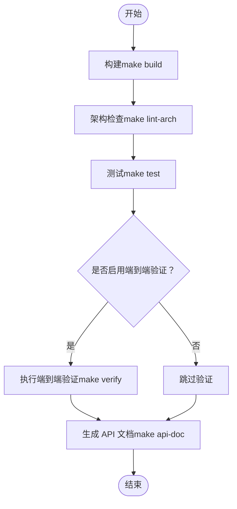

图表来源
- [validate.py:28-54](file://scripts/validate.py#L28-L54)
- [Makefile:3-16](file://Makefile#L3-L16)

章节来源
- [validate.py:1-58](file://scripts/validate.py#L1-L58)
- [Makefile:1-70](file://Makefile#L1-L70)

### API 接口测试（run-api-tests.sh）
- 功能：对健康检查、资源列表与仪表盘接口进行端到端验证。
- 参数化：可通过环境变量配置基础 URL，默认指向本地后端 API。
- 失败策略：任一断言失败即退出码非零，触发 CI 失败。

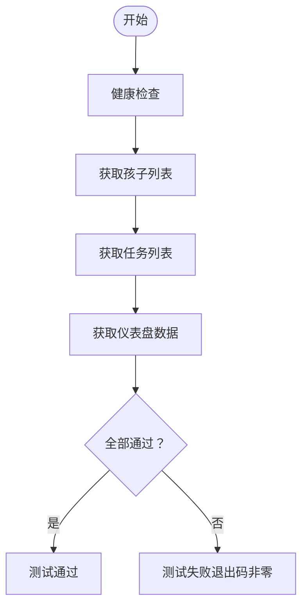

图表来源
- [run-api-tests.sh:10-36](file://scripts/run-api-tests.sh#L10-L36)

章节来源
- [run-api-tests.sh:1-36](file://scripts/run-api-tests.sh#L1-L36)

### 代码质量检查（lint-quality.py）
- 功能：检测原始 console.log 使用、文件大小限制、以及已知例外与大文件。
- 跳过目录：排除版本控制、构建产物与特定工具目录。
- 质量门禁：发现违规即输出详细信息并退出码非零。

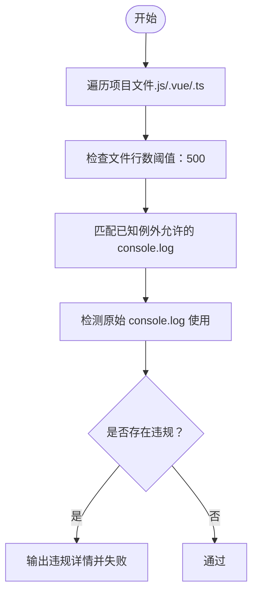

图表来源
- [lint-quality.py:47-119](file://scripts/lint-quality.py#L47-L119)

章节来源
- [lint-quality.py:1-124](file://scripts/lint-quality.py#L1-L124)

### 依赖扫描（lint-deps.py）
- 功能：基于层层次结构强制模块导入方向，禁止前端直接导入后端模块、路由间相互导入等。
- 层级定义：数据层、后端路由、后端入口、前端 API/组件/路由/状态/样式、前端页面/视图、前端入口。
- 质量门禁：发现跨层或禁止导入即输出修复建议并失败。

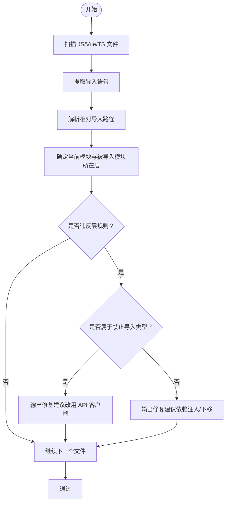

图表来源
- [lint-deps.py:156-247](file://scripts/lint-deps.py#L156-L247)
- [ARCHITECTURE.md:75-96](file://docs/ARCHITECTURE.md#L75-L96)

章节来源
- [lint-deps.py:1-252](file://scripts/lint-deps.py#L1-L252)
- [ARCHITECTURE.md:75-96](file://docs/ARCHITECTURE.md#L75-L96)

### DDL/实体一致性检查（check-db-consistency.sh）
- 功能：校验 SQLite 数据库文件是否存在、核心表是否齐全、关键字段是否存在。
- 质量门禁：缺失表或字段即失败，首次启动时数据库不存在则跳过。

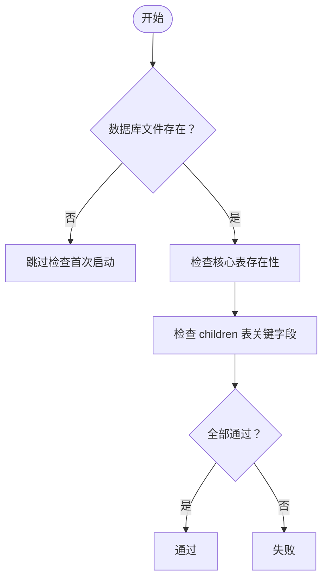

图表来源
- [check-db-consistency.sh:15-42](file://scripts/check-db-consistency.sh#L15-L42)

章节来源
- [check-db-consistency.sh:1-45](file://scripts/check-db-consistency.sh#L1-L45)

### API 文档自动生成（generate-api-doc.sh）
- 功能：从后端路由定义扫描端点，更新接口文档。
- 质量门禁：作为构建后的附加步骤，保证文档与实现一致。

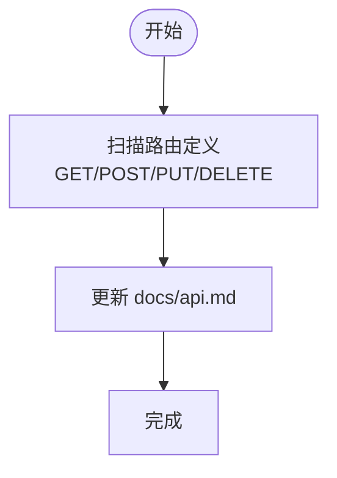

图表来源
- [generate-api-doc.sh:10-17](file://scripts/generate-api-doc.sh#L10-L17)

章节来源
- [generate-api-doc.sh:1-18](file://scripts/generate-api-doc.sh#L1-L18)

### 环境搭建与服务启动（setup-env.sh、start-server.sh）
- 功能：自动安装后端、管理后台与小程序依赖，并启动后端服务，等待健康检查通过。
- 质量门禁：服务启动超时将导致 CI 失败。

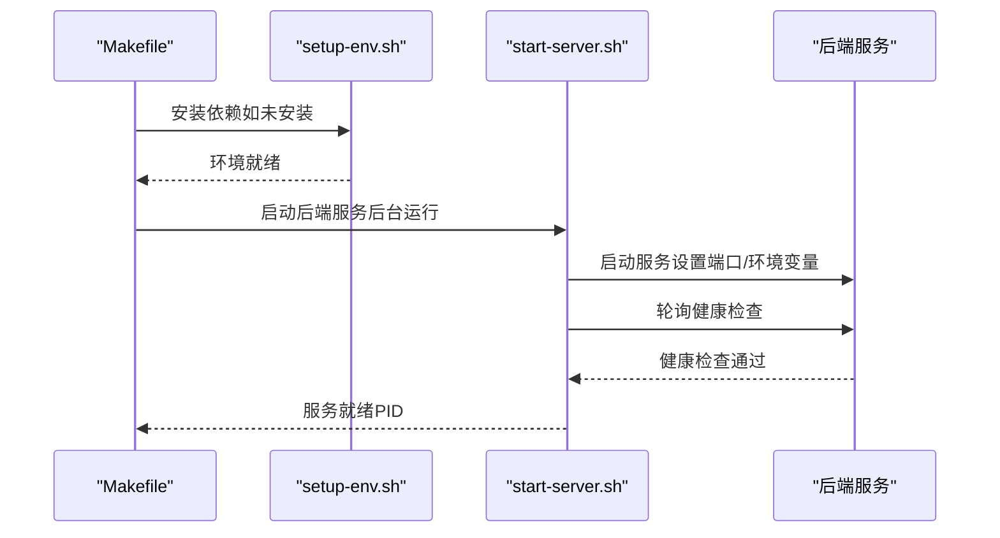

图表来源
- [setup-env.sh:10-25](file://harness/scripts/setup-env.sh#L10-L25)
- [start-server.sh:18-28](file://harness/scripts/start-server.sh#L18-L28)

章节来源
- [setup-env.sh:1-28](file://harness/scripts/setup-env.sh#L1-L28)
- [start-server.sh:1-29](file://harness/scripts/start-server.sh#L1-L29)

### 端到端验证（scripts/verify）
- 功能：用户视角的功能验证脚本集合，每个脚本负责一个场景，成功退出码为 0，失败则中断流水线。
- 新增流程：新增场景脚本后，将其加入 Makefile 的 verify 目标。

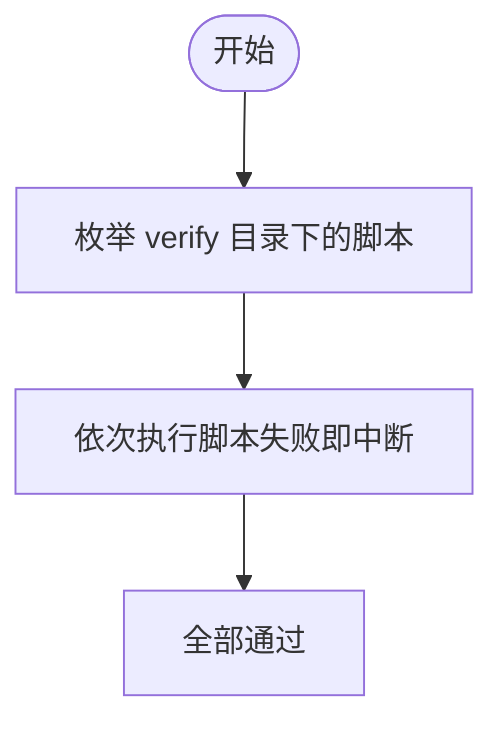

图表来源
- [README.md（验证脚本）:6-22](file://scripts/verify/README.md#L6-L22)
- [Makefile:54-60](file://Makefile#L54-L60)

章节来源
- [README.md（验证脚本）:1-23](file://scripts/verify/README.md#L1-L23)
- [Makefile:54-60](file://Makefile#L54-L60)

## 依赖分析
- 组件耦合度：验证管道集中于 validate.py，通过 Makefile 目标串联各检查与测试；脚本之间松耦合，便于替换与扩展。
- 外部依赖：后端使用 Express 与 SQLite；前端使用 Vue 生态与 uni-app；Python 脚本用于质量与架构检查。
- 质量门禁：统一入口失败即阻断，确保下游阶段不会在不稳定的基线之上继续执行。

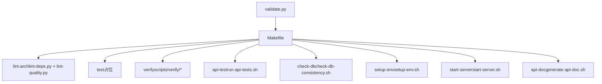

图表来源
- [validate.py:32-40](file://scripts/validate.py#L32-L40)
- [Makefile:1-70](file://Makefile#L1-L70)

章节来源
- [validate.py:1-58](file://scripts/validate.py#L1-L58)
- [Makefile:1-70](file://Makefile#L1-L70)

## 性能考虑
- 测试执行顺序：先进行快速的架构与质量检查，再执行较慢的端到端验证，缩短平均失败反馈周期。
- 服务启动等待：通过轮询健康检查避免立即执行测试导致的连接失败。
- 并行化建议：在 CI 中将不同子项目或不同类型的检查并行执行（如前端构建与后端测试），但需注意共享资源（如数据库）的并发访问控制。
- 报告与缓存：将测试报告与覆盖率结果上传至 CI 平台，以便回溯与趋势分析。

## 故障排查指南
- API 测试失败
  - 检查后端服务是否启动且健康检查通过
  - 核对基础 URL 环境变量是否正确
  - 查看具体断言失败的接口响应
- 依赖扫描失败
  - 按照修复建议将被导入模块下移至更低层级，或改为通过 API 客户端通信
- 代码质量检查失败
  - 删除原始 console.log 或替换为结构化日志
  - 拆分超大文件或将其标记为已知大文件例外
- DDL/实体一致性检查失败
  - 确认数据库文件存在且核心表与字段齐全
  - 首次启动时数据库不存在属正常现象，可跳过检查
- 环境搭建失败
  - 确认依赖安装目录不存在冲突
  - 检查端口占用与网络连通性

章节来源
- [run-api-tests.sh:13-32](file://scripts/run-api-tests.sh#L13-L32)
- [lint-deps.py:190-222](file://scripts/lint-deps.py#L190-L222)
- [lint-quality.py:63-69](file://scripts/lint-quality.py#L63-L69)
- [check-db-consistency.sh:15-41](file://scripts/check-db-consistency.sh#L15-L41)
- [start-server.sh:18-28](file://harness/scripts/start-server.sh#L18-L28)

## 结论
本项目已具备完善的自动化测试与质量门禁体系：统一验证入口、API 接口测试、架构与质量检查、依赖扫描、DDL 一致性检查、API 文档自动生成、环境自动搭建与服务启动，以及端到端验证脚本集合。建议在现有基础上引入覆盖率统计、性能回归检测与安全漏洞扫描，以进一步完善 CI/CD 的质量保障能力。

## 附录

### CI/CD 流水线配置示例（概念性）
- 阶段划分
  - 环境准备：安装依赖、启动后端服务
  - 构建与检查：构建前端、运行架构与质量检查
  - 测试：执行 API 接口测试与端到端验证
  - 文档与制品：生成 API 文档、上传测试报告
- 质量门禁
  - 任一阶段失败即中断流水线
  - 支持失败重试：对网络波动或偶发性失败进行有限次数重试
- 覆盖率统计
  - 在测试阶段收集覆盖率数据并上传至平台
- 性能回归检测
  - 对关键接口设定响应时间阈值，超过阈值即告警
- 安全漏洞扫描
  - 对依赖进行扫描，阻止存在高危漏洞的版本进入主干

### 具体配置要点（基于现有脚本）
- API 测试自动化
  - 使用 Makefile 的 api-test 目标运行接口测试
  - 通过环境变量配置基础 URL
- 代码质量检查自动化
  - 使用 Makefile 的 lint-arch 目标运行架构与质量检查
  - 将 lint-quality.py 与 lint-deps.py 的输出纳入 CI 报告
- 依赖扫描自动化
  - 保持层层次结构定义清晰，确保 lint-deps.py 能正确识别违规
- 测试环境自动搭建
  - 使用 Makefile 的 setup-env 与 start-server 目标
  - 在 CI 中设置端口与环境变量
- 测试数据自动准备
  - 利用种子数据初始化脚本（若存在）或在测试前执行必要的数据库初始化
- 测试结果自动报告
  - 将测试输出与报告上传至 CI 平台
- 测试覆盖率自动统计
  - 在测试阶段启用覆盖率收集并上传
- 性能回归检测
  - 在端到端验证中记录关键接口耗时并设定阈值
- 安全漏洞扫描集成
  - 在依赖安装后执行依赖扫描，阻止高危漏洞版本

章节来源
- [Makefile:25-37](file://Makefile#L25-L37)
- [validate.py:32-40](file://scripts/validate.py#L32-L40)
- [setup-env.sh:10-25](file://harness/scripts/setup-env.sh#L10-L25)
- [start-server.sh:18-28](file://harness/scripts/start-server.sh#L18-L28)
- [run-api-tests.sh:10-11](file://scripts/run-api-tests.sh#L10-L11)
- [lint-deps.py:15-71](file://scripts/lint-deps.py#L15-L71)
- [lint-quality.py:14-44](file://scripts/lint-quality.py#L14-L44)