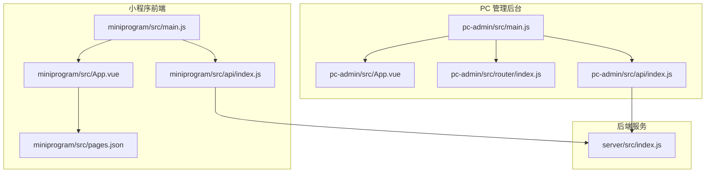
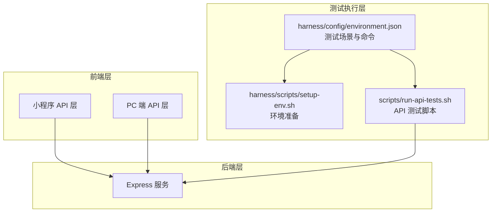
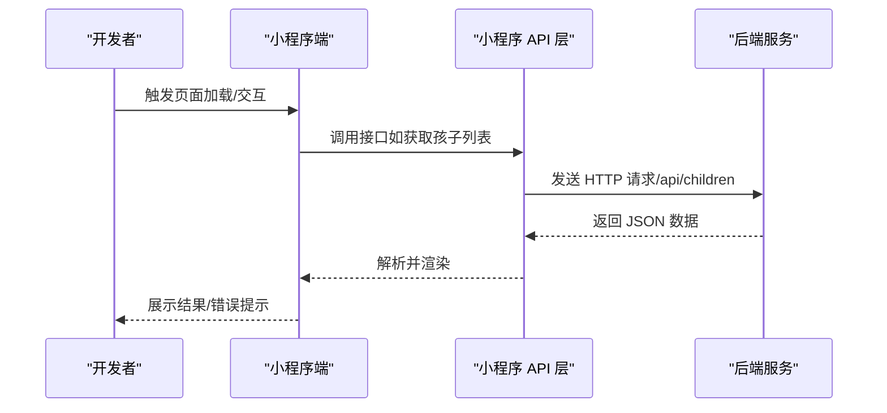
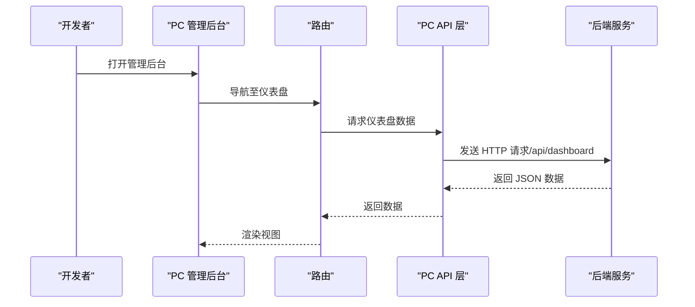
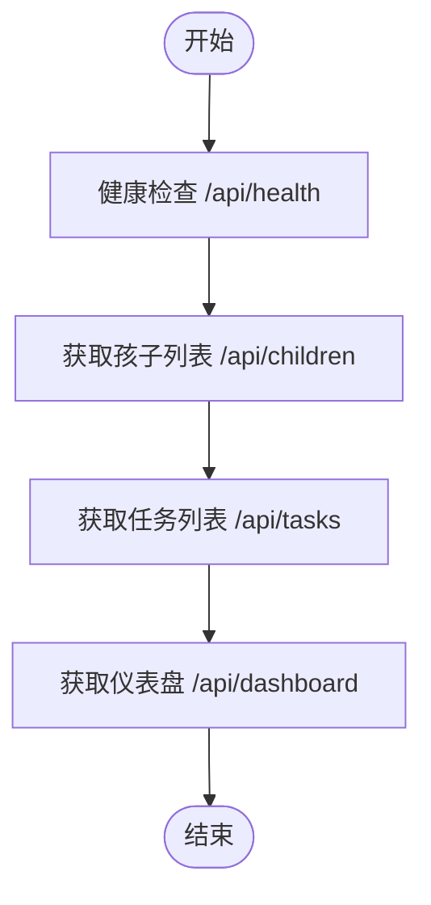
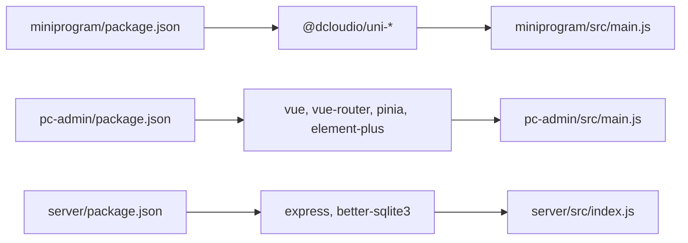

# 跨平台测试

<cite>
**本文引用的文件**
- [star-park/miniprogram/src/main.js](file://star-park/miniprogram/src/main.js)
- [star-park/pc-admin/src/main.js](file://star-park/pc-admin/src/main.js)
- [star-park/server/src/index.js](file://star-park/server/src/index.js)
- [scripts/run-api-tests.sh](file://scripts/run-api-tests.sh)
- [harness/config/environment.json](file://harness/config/environment.json)
- [star-park/miniprogram/package.json](file://star-park/miniprogram/package.json)
- [star-park/pc-admin/package.json](file://star-park/pc-admin/package.json)
- [star-park/server/package.json](file://star-park/server/package.json)
- [star-park/miniprogram/src/App.vue](file://star-park/miniprogram/src/App.vue)
- [star-park/pc-admin/src/App.vue](file://star-park/pc-admin/src/App.vue)
- [star-park/miniprogram/src/pages.json](file://star-park/miniprogram/src/pages.json)
- [star-park/pc-admin/src/router/index.js](file://star-park/pc-admin/src/router/index.js)
- [star-park/miniprogram/src/api/index.js](file://star-park/miniprogram/src/api/index.js)
- [star-park/pc-admin/src/api/index.js](file://star-park/pc-admin/src/api/index.js)
- [harness/scripts/setup-env.sh](file://harness/scripts/setup-env.sh)
</cite>

## 目录
1. [引言](#引言)
2. [项目结构](#项目结构)
3. [核心组件](#核心组件)
4. [架构总览](#架构总览)
5. [详细组件分析](#详细组件分析)
6. [依赖关系分析](#依赖关系分析)
7. [性能考虑](#性能考虑)
8. [故障排查指南](#故障排查指南)
9. [结论](#结论)
10. [附录](#附录)

## 引言
本测试文档面向 StarParadise 项目，覆盖 uni-app 小程序端、PC 管理后台与后端服务的跨平台测试策略与实践。重点说明：
- 不同平台的测试策略差异与平台特定问题处理
- 跨平台一致性验证方法
- 具体测试示例：小程序端功能测试、PC 端界面测试、响应式布局测试、触摸交互测试
- iOS/Android 平台测试要点、不同屏幕尺寸适配测试、网络环境测试
- 测试工具链配置、自动化测试执行、缺陷跟踪与报告生成

## 项目结构
项目采用多包结构，包含：
- 小程序前端（uni-app）：支持微信小程序与 H5 构建
- PC 管理后台（Vue 3 + Pinia + Element Plus）
- 后端服务（Express + better-sqlite3）

图表来源
- [star-park/miniprogram/src/main.js:1-8](file://star-park/miniprogram/src/main.js#L1-L8)
- [star-park/pc-admin/src/main.js:1-22](file://star-park/pc-admin/src/main.js#L1-L22)
- [star-park/server/src/index.js:1-42](file://star-park/server/src/index.js#L1-L42)
- [star-park/miniprogram/src/App.vue:1-26](file://star-park/miniprogram/src/App.vue#L1-L26)
- [star-park/pc-admin/src/App.vue:1-10](file://star-park/pc-admin/src/App.vue#L1-L10)
- [star-park/miniprogram/src/pages.json:1-54](file://star-park/miniprogram/src/pages.json#L1-L54)
- [star-park/pc-admin/src/router/index.js:1-67](file://star-park/pc-admin/src/router/index.js#L1-L67)
- [star-park/miniprogram/src/api/index.js:1-75](file://star-park/miniprogram/src/api/index.js#L1-L75)
- [star-park/pc-admin/src/api/index.js:1-56](file://star-park/pc-admin/src/api/index.js#L1-L56)

章节来源
- [star-park/miniprogram/src/main.js:1-8](file://star-park/miniprogram/src/main.js#L1-L8)
- [star-park/pc-admin/src/main.js:1-22](file://star-park/pc-admin/src/main.js#L1-L22)
- [star-park/server/src/index.js:1-42](file://star-park/server/src/index.js#L1-L42)

## 核心组件
- 小程序应用入口与生命周期：负责应用初始化与页面样式全局设置
- PC 管理后台入口与路由：负责状态管理、UI 组件库注册、路由导航与页面标题设置
- 后端服务：提供 REST API、健康检查、CORS 支持与种子数据初始化
- API 层：分别封装小程序与 PC 端的网络请求，统一调用后端接口

章节来源
- [star-park/miniprogram/src/App.vue:1-26](file://star-park/miniprogram/src/App.vue#L1-L26)
- [star-park/pc-admin/src/App.vue:1-10](file://star-park/pc-admin/src/App.vue#L1-L10)
- [star-park/server/src/index.js:1-42](file://star-park/server/src/index.js#L1-L42)
- [star-park/miniprogram/src/api/index.js:1-75](file://star-park/miniprogram/src/api/index.js#L1-L75)
- [star-park/pc-admin/src/api/index.js:1-56](file://star-park/pc-admin/src/api/index.js#L1-L56)

## 架构总览
下图展示跨平台测试涉及的关键组件与交互路径，包括小程序与 PC 端通过各自 API 层访问后端服务。

图表来源
- [harness/config/environment.json:1-65](file://harness/config/environment.json#L1-L65)
- [harness/scripts/setup-env.sh:1-28](file://harness/scripts/setup-env.sh#L1-L28)
- [scripts/run-api-tests.sh:1-36](file://scripts/run-api-tests.sh#L1-L36)
- [star-park/miniprogram/src/api/index.js:1-75](file://star-park/miniprogram/src/api/index.js#L1-L75)
- [star-park/pc-admin/src/api/index.js:1-56](file://star-park/pc-admin/src/api/index.js#L1-L56)
- [star-park/server/src/index.js:1-42](file://star-park/server/src/index.js#L1-L42)

## 详细组件分析

### 小程序端测试策略
- 应用入口与生命周期
  - 使用 uni-app SSR 应用创建方式，确保在不同平台（微信小程序/H5）的一致性
  - 生命周期钩子用于日志与状态追踪，便于定位问题
- 页面与导航
  - pages.json 定义页面与 tabBar，需验证标题、图标与跳转逻辑
- API 访问
  - 小程序端通过 uni.request 发起请求，自动区分 H5 与小程序环境的基地址
  - 关键接口包括：仪表盘、孩子列表、打卡记录、统计、奖励、任务、余额与积分等
- 平台差异
  - 微信小程序与 H5 在网络栈、存储、事件模型上存在差异，需分别验证
  - 触摸交互（如滑动、点击）与键盘/输入法行为需在真机或模拟器上验证
- 兼容性测试
  - iOS/Android 的系统版本差异、字体渲染、安全区域与刘海屏适配
  - 不同屏幕尺寸（iPhone SE 到 iPhone Pro Max、Android 小屏到大屏）的布局与可点触面积

图表来源
- [star-park/miniprogram/src/main.js:1-8](file://star-park/miniprogram/src/main.js#L1-L8)
- [star-park/miniprogram/src/api/index.js:1-75](file://star-park/miniprogram/src/api/index.js#L1-L75)
- [star-park/server/src/index.js:1-42](file://star-park/server/src/index.js#L1-L42)

章节来源
- [star-park/miniprogram/src/main.js:1-8](file://star-park/miniprogram/src/main.js#L1-L8)
- [star-park/miniprogram/src/App.vue:1-26](file://star-park/miniprogram/src/App.vue#L1-L26)
- [star-park/miniprogram/src/pages.json:1-54](file://star-park/miniprogram/src/pages.json#L1-L54)
- [star-park/miniprogram/src/api/index.js:1-75](file://star-park/miniprogram/src/api/index.js#L1-L75)

### PC 管理后台测试策略
- 应用入口与 UI 组件
  - 注册 Element Plus 及图标，启用 Pinia 与 Vue Router
  - 路由按模块划分，包含仪表盘、目标管理、每日打卡、任务管理、积分与奖励、统计等
- API 访问
  - 使用 axios 创建带拦截器的实例，统一封装 GET/POST/PUT/DELETE
  - 关键接口与小程序一致，但参数与响应结构以 PC 端为准
- 响应式布局与交互
  - 基于浏览器窗口变化的布局适配，需验证断点切换、菜单折叠、表格/图表自适应
  - 键鼠交互（点击、悬停、滚动）与表单输入校验
- 网络环境测试
  - 本地开发（Vite）、预览与构建产物的网络行为一致性验证

图表来源
- [star-park/pc-admin/src/main.js:1-22](file://star-park/pc-admin/src/main.js#L1-L22)
- [star-park/pc-admin/src/router/index.js:1-67](file://star-park/pc-admin/src/router/index.js#L1-L67)
- [star-park/pc-admin/src/api/index.js:1-56](file://star-park/pc-admin/src/api/index.js#L1-L56)
- [star-park/server/src/index.js:1-42](file://star-park/server/src/index.js#L1-L42)

章节来源
- [star-park/pc-admin/src/main.js:1-22](file://star-park/pc-admin/src/main.js#L1-L22)
- [star-park/pc-admin/src/router/index.js:1-67](file://star-park/pc-admin/src/router/index.js#L1-L67)
- [star-park/pc-admin/src/api/index.js:1-56](file://star-park/pc-admin/src/api/index.js#L1-L56)

### 后端服务测试策略
- 健康检查与路由
  - 提供 /api/health 健康检查端点，返回状态与时间戳
  - 注册 children/tasks/checkins/rewards/stats/points 等路由
- 数据库与种子数据
  - 使用 better-sqlite3，SQLite 为嵌入式数据库，无需外部服务
  - 首次启动时进行种子数据初始化
- 测试工具链
  - 使用脚本 scripts/run-api-tests.sh 进行端到端 API 验证
  - harness/config/environment.json 定义测试场景、前置条件与期望结果

图表来源
- [scripts/run-api-tests.sh:1-36](file://scripts/run-api-tests.sh#L1-L36)
- [star-park/server/src/index.js:1-42](file://star-park/server/src/index.js#L1-L42)

章节来源
- [star-park/server/src/index.js:1-42](file://star-park/server/src/index.js#L1-L42)
- [scripts/run-api-tests.sh:1-36](file://scripts/run-api-tests.sh#L1-L36)
- [harness/config/environment.json:1-65](file://harness/config/environment.json#L1-L65)

### 跨平台一致性验证
- 接口一致性
  - 小程序与 PC 端对同一后端接口的调用参数与返回值需保持一致
- 表现一致性
  - 字体、颜色、间距、图标在不同平台与设备上保持一致
- 业务流程一致性
  - 从“创建打卡记录”到“统计更新”的流程在各平台表现一致

章节来源
- [star-park/miniprogram/src/api/index.js:1-75](file://star-park/miniprogram/src/api/index.js#L1-L75)
- [star-park/pc-admin/src/api/index.js:1-56](file://star-park/pc-admin/src/api/index.js#L1-L56)
- [harness/config/environment.json:34-57](file://harness/config/environment.json#L34-L57)

### 测试示例

#### 小程序端功能测试
- 页面与导航
  - 验证首页、打卡、记录、钱包、我的等页面标题与跳转
  - 验证 tabBar 图标与选中态
- 功能流程
  - 登录/进入应用后，拉取孩子列表与任务列表
  - 创建打卡记录并验证统计更新
- 平台差异
  - 微信开发者工具与真机联调，验证触摸手势与键盘行为
  - iOS 与 Android 的字体渲染与安全区域差异

章节来源
- [star-park/miniprogram/src/pages.json:1-54](file://star-park/miniprogram/src/pages.json#L1-L54)
- [harness/config/environment.json:46-57](file://harness/config/environment.json#L46-L57)

#### PC 端界面测试
- 路由与布局
  - 验证仪表盘、目标管理、每日打卡、任务管理、积分与奖励、统计等页面
  - 验证菜单折叠、断点切换下的布局表现
- 交互与表单
  - 表单输入校验、提交反馈、表格排序与分页
- 性能与兼容
  - 不同浏览器（Chrome/Firefox/Safari）下的渲染与交互一致性

章节来源
- [star-park/pc-admin/src/router/index.js:1-67](file://star-park/pc-admin/src/router/index.js#L1-L67)
- [star-park/pc-admin/src/main.js:1-22](file://star-park/pc-admin/src/main.js#L1-L22)

#### 响应式布局测试
- 断点验证
  - 在常见分辨率（移动端、平板、桌面）下验证布局与交互元素
- 触摸交互测试
  - 移动端滑动、点击、长按等手势的可用性与反馈
- 屏幕适配
  - 不同屏幕密度与 DPR 下的清晰度与可读性

章节来源
- [star-park/pc-admin/src/styles/main.css](file://star-park/pc-admin/src/styles/main.css)

#### 触摸交互测试
- 小程序端
  - 验证按钮点击、列表滑动、输入框焦点与键盘弹起
- PC 端
  - 验证鼠标悬停、点击、拖拽与键盘快捷键

章节来源
- [star-park/miniprogram/src/App.vue:1-26](file://star-park/miniprogram/src/App.vue#L1-L26)
- [star-park/pc-admin/src/App.vue:1-10](file://star-park/pc-admin/src/App.vue#L1-L10)

#### iOS 与 Android 平台测试
- 系统版本差异
  - iOS 15+ 与 iOS 17+；Android 10/13/14 等
- 真机联调
  - 使用微信开发者工具与各平台真机进行回归测试
- 专项测试
  - 安全区域、刘海屏、虚拟按键、状态栏样式

章节来源
- [star-park/miniprogram/src/pages.json:1-54](file://star-park/miniprogram/src/pages.json#L1-L54)

#### 不同屏幕尺寸适配测试
- 小米、华为、苹果等主流机型
- 小屏（360-480dp）、中屏（480-600dp）、大屏（600dp+）
- 横竖屏切换与键盘弹出后的布局恢复

章节来源
- [star-park/miniprogram/src/App.vue:17-25](file://star-park/miniprogram/src/App.vue#L17-L25)

#### 网络环境测试
- 低速网络与弱网模拟
- DNS 解析异常、超时重试与降级提示
- HTTPS 证书与混合内容处理

章节来源
- [star-park/miniprogram/src/api/index.js:1-30](file://star-park/miniprogram/src/api/index.js#L1-L30)
- [star-park/pc-admin/src/api/index.js:1-20](file://star-park/pc-admin/src/api/index.js#L1-L20)

### 测试工具链配置与自动化执行
- 环境准备
  - 使用 harness/scripts/setup-env.sh 安装依赖并准备 SQLite 数据库
- 测试场景
  - harness/config/environment.json 定义健康检查与打卡流程等场景
- 自动化执行
  - scripts/run-api-tests.sh 作为 API 端到端测试入口
- 缺陷跟踪与报告
  - 建议在 CI 中集成上述脚本，并输出 JSON 报告以便后续分析

章节来源
- [harness/scripts/setup-env.sh:1-28](file://harness/scripts/setup-env.sh#L1-L28)
- [harness/config/environment.json:1-65](file://harness/config/environment.json#L1-L65)
- [scripts/run-api-tests.sh:1-36](file://scripts/run-api-tests.sh#L1-L36)

## 依赖关系分析
- 包管理与构建
  - 小程序端：使用 uni-app 与 Vite 插件，支持多平台构建
  - PC 端：使用 Vite 与 Vue 插件，支持开发与生产构建
  - 后端：使用 Express，数据库为 better-sqlite3
- 依赖耦合
  - 前端通过 API 层与后端解耦，便于独立测试与演进
- 外部依赖
  - Element Plus、Axios、Day.js 等第三方库

图表来源
- [star-park/miniprogram/package.json:1-28](file://star-park/miniprogram/package.json#L1-L28)
- [star-park/pc-admin/package.json:1-26](file://star-park/pc-admin/package.json#L1-L26)
- [star-park/server/package.json:1-15](file://star-park/server/package.json#L1-L15)
- [star-park/miniprogram/src/main.js:1-8](file://star-park/miniprogram/src/main.js#L1-L8)
- [star-park/pc-admin/src/main.js:1-22](file://star-park/pc-admin/src/main.js#L1-L22)
- [star-park/server/src/index.js:1-42](file://star-park/server/src/index.js#L1-L42)

章节来源
- [star-park/miniprogram/package.json:1-28](file://star-park/miniprogram/package.json#L1-L28)
- [star-park/pc-admin/package.json:1-26](file://star-park/pc-admin/package.json#L1-L26)
- [star-park/server/package.json:1-15](file://star-park/server/package.json#L1-L15)

## 性能考虑
- 小程序端
  - 减少不必要的 setData 与页面跳转，避免频繁重绘
  - 合理使用分页与懒加载，降低首屏与交互延迟
- PC 端
  - 合理拆分路由组件，使用动态导入减少初始包体积
  - 图表与表格组件按需渲染，避免大数据量时的阻塞
- 网络性能
  - 合理设置超时与重试策略，提供用户可感知的加载状态

## 故障排查指南
- 健康检查失败
  - 确认后端服务已启动且监听端口可用
  - 检查 CORS 配置与请求头
- API 返回异常
  - 核对请求路径、方法与参数是否符合后端定义
  - 查看小程序端 toast 与 PC 端控制台错误信息
- 环境准备问题
  - 使用 harness/scripts/setup-env.sh 安装依赖并确认数据库文件存在

章节来源
- [scripts/run-api-tests.sh:1-36](file://scripts/run-api-tests.sh#L1-L36)
- [harness/scripts/setup-env.sh:1-28](file://harness/scripts/setup-env.sh#L1-L28)
- [star-park/miniprogram/src/api/index.js:24-28](file://star-park/miniprogram/src/api/index.js#L24-L28)
- [star-park/pc-admin/src/api/index.js:13-19](file://star-park/pc-admin/src/api/index.js#L13-L19)

## 结论
通过明确的跨平台测试策略与工具链配置，可以有效保障 StarParadise 在小程序与 PC 管理后台上的功能一致性与用户体验。建议在持续集成中引入自动化测试脚本，并结合真机与多浏览器回归，确保在 iOS/Android 与桌面环境中的稳定性与性能。

## 附录
- 测试场景清单
  - 健康检查：/api/health
  - 孩子列表：/api/children
  - 任务列表：/api/tasks
  - 仪表盘：/api/dashboard
  - 打卡流程：创建打卡记录并验证统计更新
- 建议的缺陷跟踪字段
  - 平台（小程序/PC）、设备型号/浏览器、系统版本、复现步骤、截图/录屏、优先级、责任人、状态