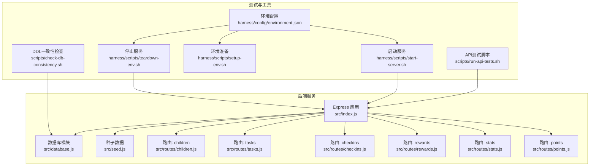
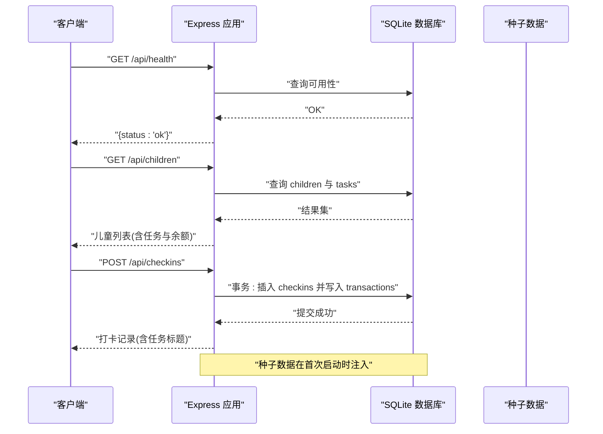
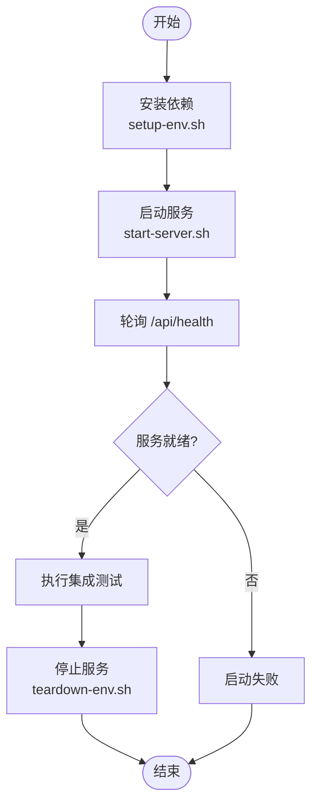
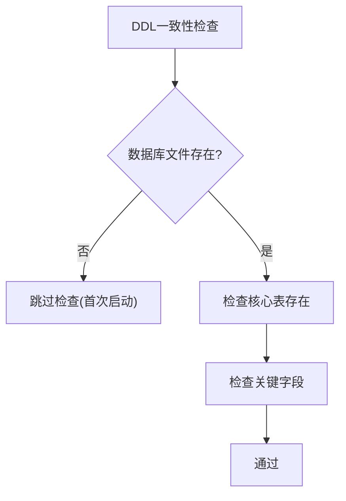
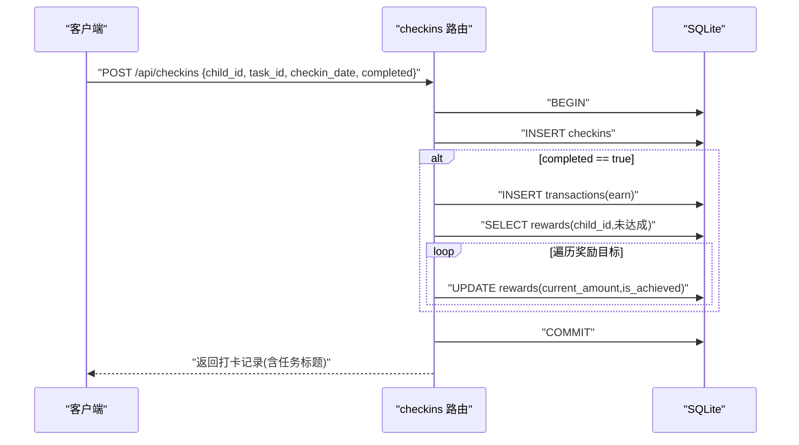
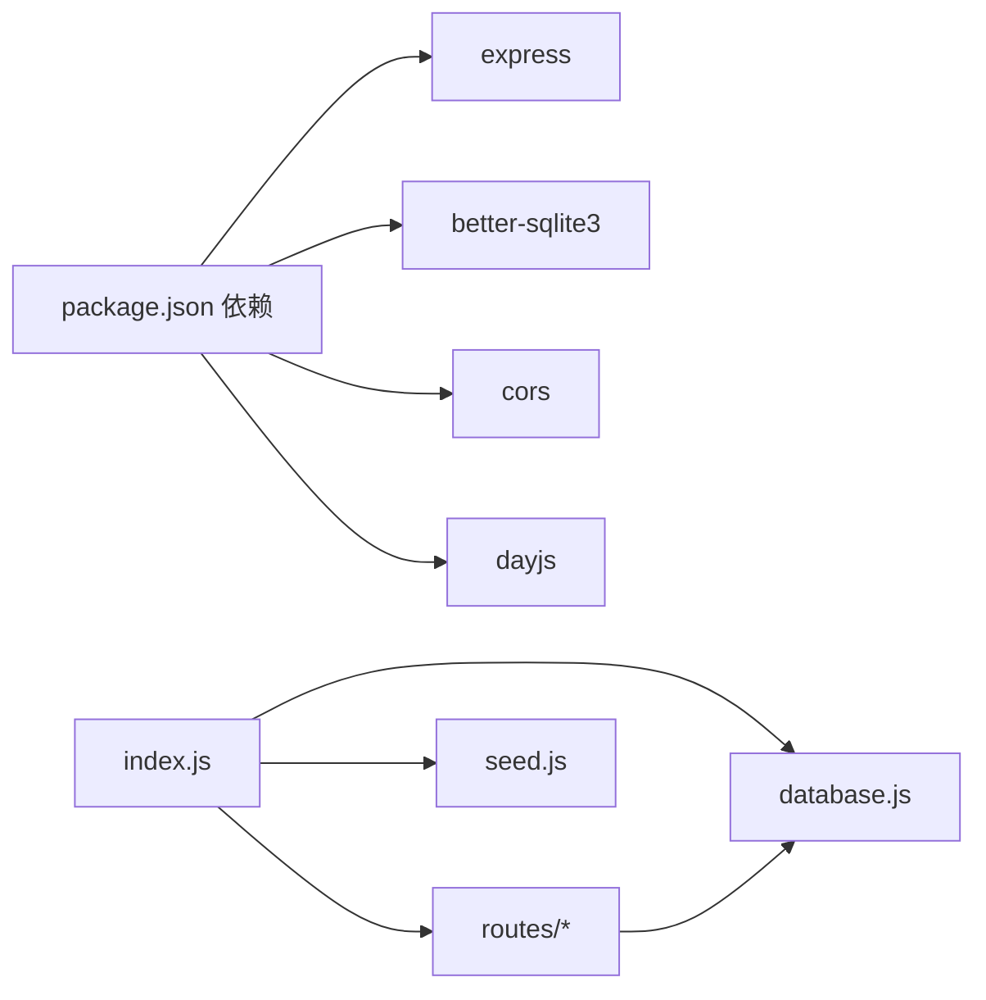

# 集成测试

<cite>
**本文引用的文件**
- [package.json](file://star-park/server/package.json)
- [index.js](file://star-park/server/src/index.js)
- [database.js](file://star-park/server/src/database.js)
- [seed.js](file://star-park/server/src/seed.js)
- [children.js](file://star-park/server/src/routes/children.js)
- [tasks.js](file://star-park/server/src/routes/tasks.js)
- [checkins.js](file://star-park/server/src/routes/checkins.js)
- [rewards.js](file://star-park/server/src/routes/rewards.js)
- [stats.js](file://star-park/server/src/routes/stats.js)
- [points.js](file://star-park/server/src/routes/points.js)
- [run-api-tests.sh](file://scripts/run-api-tests.sh)
- [check-db-consistency.sh](file://scripts/check-db-consistency.sh)
- [setup-env.sh](file://harness/scripts/setup-env.sh)
- [start-server.sh](file://harness/scripts/start-server.sh)
- [teardown-env.sh](file://harness/scripts/teardown-env.sh)
- [environment.json](file://harness/config/environment.json)
</cite>

## 目录
1. [简介](#简介)
2. [项目结构](#项目结构)
3. [核心组件](#核心组件)
4. [架构总览](#架构总览)
5. [详细组件分析](#详细组件分析)
6. [依赖关系分析](#依赖关系分析)
7. [性能考量](#性能考量)
8. [故障排查指南](#故障排查指南)
9. [结论](#结论)
10. [附录](#附录)

## 简介
本文件面向StarParadise项目的集成测试，系统性阐述后端服务集成测试、数据库连接测试、API端点集成测试的实施方法与最佳实践。内容覆盖测试环境搭建、数据库种子数据准备、服务启动与停止流程；提供API集成测试示例（请求-响应、事务处理、错误场景）；包含数据库一致性测试、跨模块交互测试与外部依赖模拟；并给出测试数据清理、测试隔离与并发测试策略。

## 项目结构
后端采用Express + better-sqlite3，路由按功能模块拆分，数据库初始化与迁移在启动时执行，种子数据仅在首次运行时注入。测试相关脚本位于scripts与harness目录，分别负责API端到端验证与数据库一致性检查，以及环境准备、服务启停控制。

图表来源
- [index.js:1-42](file://star-park/server/src/index.js#L1-L42)
- [database.js:1-111](file://star-park/server/src/database.js#L1-L111)
- [seed.js:1-45](file://star-park/server/src/seed.js#L1-L45)
- [children.js:1-96](file://star-park/server/src/routes/children.js#L1-L96)
- [tasks.js:1-91](file://star-park/server/src/routes/tasks.js#L1-L91)
- [checkins.js:1-90](file://star-park/server/src/routes/checkins.js#L1-L90)
- [rewards.js:1-167](file://star-park/server/src/routes/rewards.js#L1-L167)
- [stats.js:1-182](file://star-park/server/src/routes/stats.js#L1-L182)
- [points.js:1-74](file://star-park/server/src/routes/points.js#L1-L74)
- [run-api-tests.sh:1-36](file://scripts/run-api-tests.sh#L1-L36)
- [check-db-consistency.sh:1-45](file://scripts/check-db-consistency.sh#L1-L45)
- [setup-env.sh:1-23](file://harness/scripts/setup-env.sh#L1-L23)
- [start-server.sh:1-29](file://harness/scripts/start-server.sh#L1-L29)
- [teardown-env.sh:1-14](file://harness/scripts/teardown-env.sh#L1-L14)
- [environment.json:1-56](file://harness/config/environment.json#L1-L56)

章节来源
- [package.json:1-15](file://star-park/server/package.json#L1-L15)
- [index.js:1-42](file://star-park/server/src/index.js#L1-L42)
- [database.js:1-111](file://star-park/server/src/database.js#L1-L111)
- [seed.js:1-45](file://star-park/server/src/seed.js#L1-L45)
- [run-api-tests.sh:1-36](file://scripts/run-api-tests.sh#L1-L36)
- [check-db-consistency.sh:1-45](file://scripts/check-db-consistency.sh#L1-L45)
- [setup-env.sh:1-23](file://harness/scripts/setup-env.sh#L1-L23)
- [start-server.sh:1-29](file://harness/scripts/start-server.sh#L1-L29)
- [teardown-env.sh:1-14](file://harness/scripts/teardown-env.sh#L1-L14)
- [environment.json:1-56](file://harness/config/environment.json#L1-L56)

## 核心组件
- Express应用与中间件：启用CORS与JSON解析，挂载多条业务路由，并提供健康检查端点。
- 数据库模块：使用better-sqlite3创建数据目录与数据库文件，启用WAL与外键约束，定义核心表结构并执行迁移。
- 种子数据：在数据库为空时插入初始数据，保证测试与演示环境具备基础数据。
- 路由模块：按领域拆分，涵盖儿童、任务、打卡、奖励、统计与积分等，实现增删改查与跨表事务。

章节来源
- [index.js:1-42](file://star-park/server/src/index.js#L1-L42)
- [database.js:1-111](file://star-park/server/src/database.js#L1-L111)
- [seed.js:1-45](file://star-park/server/src/seed.js#L1-L45)
- [children.js:1-96](file://star-park/server/src/routes/children.js#L1-L96)
- [tasks.js:1-91](file://star-park/server/src/routes/tasks.js#L1-L91)
- [checkins.js:1-90](file://star-park/server/src/routes/checkins.js#L1-L90)
- [rewards.js:1-167](file://star-park/server/src/routes/rewards.js#L1-L167)
- [stats.js:1-182](file://star-park/server/src/routes/stats.js#L1-L182)
- [points.js:1-74](file://star-park/server/src/routes/points.js#L1-L74)

## 架构总览
下图展示从客户端到后端服务再到数据库的端到端调用路径，以及关键事务边界与数据一致性保障。

图表来源
- [index.js:29-41](file://star-park/server/src/index.js#L29-L41)
- [children.js:5-37](file://star-park/server/src/routes/children.js#L5-L37)
- [checkins.js:30-87](file://star-park/server/src/routes/checkins.js#L30-L87)
- [seed.js:3-42](file://star-park/server/src/seed.js#L3-L42)

## 详细组件分析

### 测试环境搭建与服务启停
- 环境准备：安装后端与管理后台依赖，SQLite为嵌入式无需外部服务。
- 服务启动：导出端口与环境变量，后台启动服务并轮询健康检查端点。
- 服务停止：终止匹配的node进程，清理残留进程。
- 环境变量：测试环境建议使用独立端口与开发模式，避免冲突。

图表来源
- [setup-env.sh:1-23](file://harness/scripts/setup-env.sh#L1-L23)
- [start-server.sh:1-29](file://harness/scripts/start-server.sh#L1-L29)
- [teardown-env.sh:1-14](file://harness/scripts/teardown-env.sh#L1-L14)
- [environment.json:19-24](file://harness/config/environment.json#L19-L24)

章节来源
- [setup-env.sh:1-23](file://harness/scripts/setup-env.sh#L1-L23)
- [start-server.sh:1-29](file://harness/scripts/start-server.sh#L1-L29)
- [teardown-env.sh:1-14](file://harness/scripts/teardown-env.sh#L1-L14)
- [environment.json:19-24](file://harness/config/environment.json#L19-L24)

### 数据库连接与一致性测试
- 数据库文件：位于data目录，首次访问自动创建。
- 核心表：children、tasks、checkins、rewards、transactions、points。
- 迁移：动态添加字段（如points_balance、description、reward_unit、redeemed_at）。
- 一致性检查：校验表存在与关键字段，支持DDL演进验证。

图表来源
- [check-db-consistency.sh:1-45](file://scripts/check-db-consistency.sh#L1-L45)
- [database.js:17-108](file://star-park/server/src/database.js#L17-L108)

章节来源
- [check-db-consistency.sh:1-45](file://scripts/check-db-consistency.sh#L1-L45)
- [database.js:17-108](file://star-park/server/src/database.js#L17-L108)

### API端点集成测试示例

#### 健康检查与基础数据流
- 步骤：启动服务 → 轮询健康端点 → 获取儿童列表 → 获取任务列表 → 获取仪表盘数据。
- 断言：健康响应包含状态字段；儿童列表非空且包含任务与余额；任务列表按条件过滤；仪表盘聚合数据合理。

章节来源
- [run-api-tests.sh:13-32](file://scripts/run-api-tests.sh#L13-L32)
- [index.js:29-32](file://star-park/server/src/index.js#L29-L32)
- [children.js:5-37](file://star-park/server/src/routes/children.js#L5-L37)
- [tasks.js:5-19](file://star-park/server/src/routes/tasks.js#L5-L19)
- [stats.js:103-179](file://star-park/server/src/routes/stats.js#L103-L179)

#### 事务处理测试（打卡与奖励）
- 流程：创建打卡记录 → 写入checkins → 在事务中写入transactions → 更新rewards的current_amount与is_achieved → 返回完整记录。
- 关键点：completed为真时才产生奖励；奖励金额来自任务配置；rewards批量更新逻辑需验证。

图表来源
- [checkins.js:30-87](file://star-park/server/src/routes/checkins.js#L30-L87)
- [rewards.js:89-164](file://star-park/server/src/routes/rewards.js#L89-L164)

章节来源
- [checkins.js:30-87](file://star-park/server/src/routes/checkins.js#L30-L87)
- [rewards.js:89-164](file://star-park/server/src/routes/rewards.js#L89-L164)

#### 错误场景测试
- 参数缺失：创建任务缺少child_id或title → 返回400。
- 资源不存在：更新任务/奖励时ID不存在 → 返回404。
- 余额不足：兑换奖励时金额不足 → 返回400。
- 外键约束：删除任务前先清理checkins → 事务保证一致性。

章节来源
- [tasks.js:21-36](file://star-park/server/src/routes/tasks.js#L21-L36)
- [tasks.js:38-68](file://star-park/server/src/routes/tasks.js#L38-L68)
- [rewards.js:74-87](file://star-park/server/src/routes/rewards.js#L74-L87)
- [rewards.js:89-164](file://star-park/server/src/routes/rewards.js#L89-L164)

#### 数据库一致性测试
- 表结构：确保核心表存在，关键字段齐全（如children.points_balance、rewards.description等）。
- 索引与约束：外键约束与CASCADE删除在删除任务时清理打卡记录。
- 数据迁移：新增字段时检查迁移逻辑，避免重复执行导致异常。

章节来源
- [database.js:17-108](file://star-park/server/src/database.js#L17-L108)
- [tasks.js:78-84](file://star-park/server/src/routes/tasks.js#L78-L84)

#### 跨模块交互测试
- 孩子与任务：获取儿童列表时合并任务与余额信息。
- 统计与仪表盘：按日聚合打卡、计算连续天数与本周完成率。
- 兑换流程：根据奖励单位选择钱包类型（元/星星），并更新对应余额与记录表。

章节来源
- [children.js:5-37](file://star-park/server/src/routes/children.js#L5-L37)
- [stats.js:6-101](file://star-park/server/src/routes/stats.js#L6-L101)
- [rewards.js:89-164](file://star-park/server/src/routes/rewards.js#L89-L164)

#### 外部依赖模拟
- better-sqlite3：本地嵌入式数据库，无需额外容器。
- dayjs：日期计算与格式化，用于统计与时间范围。
- CORS：允许前端跨域访问。

章节来源
- [package.json:8-13](file://star-park/server/package.json#L8-L13)
- [stats.js:1-4](file://star-park/server/src/routes/stats.js#L1-L4)
- [index.js:16-18](file://star-park/server/src/index.js#L16-L18)

### 测试数据清理与隔离
- 清理策略：停止服务进程，下次启动时重新注入种子数据（若无数据）。
- 隔离策略：测试环境使用独立端口与NODE_ENV=test，避免与开发/生产环境冲突。
- 并发测试：利用WAL模式提升读写并发，但需注意事务边界与锁竞争。

章节来源
- [teardown-env.sh:1-14](file://harness/scripts/teardown-env.sh#L1-L14)
- [environment.json:19-24](file://harness/config/environment.json#L19-L24)
- [database.js:13-14](file://star-park/server/src/database.js#L13-L14)

## 依赖关系分析
- 组件耦合：路由依赖数据库模块；应用在启动时加载路由与种子数据。
- 外部依赖：better-sqlite3、express、cors、dayjs。
- 配置驱动：环境变量控制端口与环境模式；测试脚本通过BASE_URL参数化。

图表来源
- [package.json:8-13](file://star-park/server/package.json#L8-L13)
- [index.js:1-11](file://star-park/server/src/index.js#L1-L11)
- [children.js:1-3](file://star-park/server/src/routes/children.js#L1-L3)
- [database.js:1-3](file://star-park/server/src/database.js#L1-L3)
- [seed.js:1](file://star-park/server/src/seed.js#L1)

章节来源
- [package.json:8-13](file://star-park/server/package.json#L8-L13)
- [index.js:1-11](file://star-park/server/src/index.js#L1-L11)

## 性能考量
- WAL模式：提升并发读写性能，适合多用户同时访问。
- 事务边界：在需要强一致性的场景（如打卡奖励）使用事务包裹，减少部分提交风险。
- 查询优化：统计接口涉及多表聚合，建议在高频字段上建立索引（如checkins.child_id、checkins.checkin_date）。

章节来源
- [database.js:13-14](file://star-park/server/src/database.js#L13-L14)
- [checkins.js:48-76](file://star-park/server/src/routes/checkins.js#L48-L76)
- [stats.js:6-101](file://star-park/server/src/routes/stats.js#L6-L101)

## 故障排查指南
- 服务未启动：确认端口占用与进程残留，使用停止脚本清理后重试。
- 健康检查失败：检查路由挂载与中间件配置，确保健康端点可达。
- 数据库异常：检查数据目录权限与文件存在性，必要时删除数据库文件后重启。
- 种子数据未注入：确认数据库为空且种子函数执行路径，避免重复注入。

章节来源
- [start-server.sh:18-28](file://harness/scripts/start-server.sh#L18-L28)
- [teardown-env.sh:5-11](file://harness/scripts/teardown-env.sh#L5-L11)
- [index.js:29-32](file://star-park/server/src/index.js#L29-L32)
- [database.js:5-11](file://star-park/server/src/database.js#L5-L11)
- [seed.js:3-9](file://star-park/server/src/seed.js#L3-L9)

## 结论
通过统一的环境脚本、参数化的测试脚本与完善的路由设计，StarParadise后端具备良好的集成测试基础。建议在CI中固定测试端口、启用WAL模式、对关键事务进行回归验证，并持续完善DDL一致性检查与错误场景覆盖。

## 附录
- 端到端测试清单
  - 健康检查：/api/health
  - 基础数据：/api/children、/api/tasks、/api/dashboard
  - 事务流程：/api/checkins（完成/未完成）、/api/rewards/:id/redeem
  - 错误场景：参数缺失、资源不存在、余额不足、重复兑换
  - 数据一致性：核心表与字段检查、外键约束验证