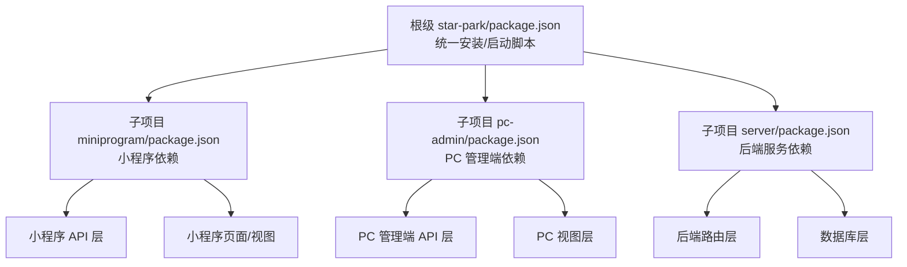
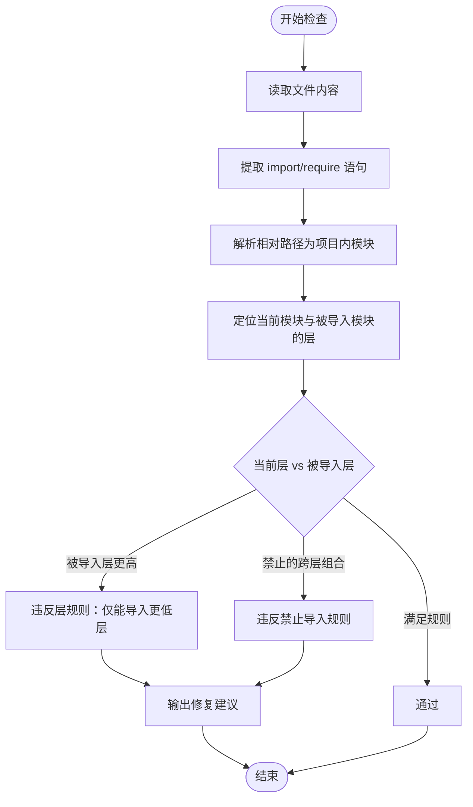
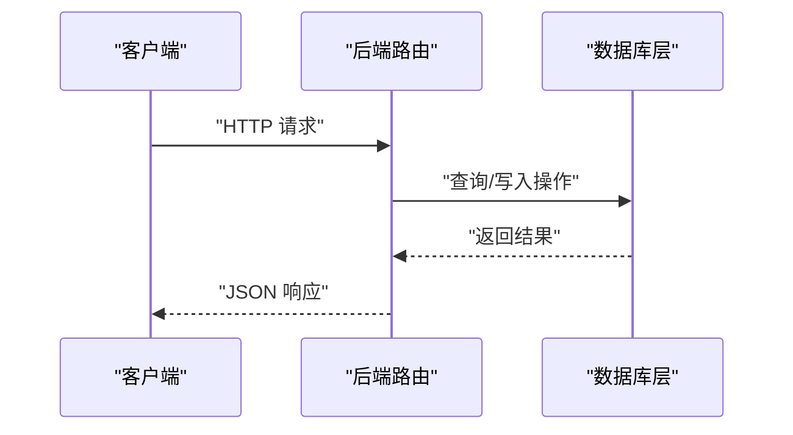
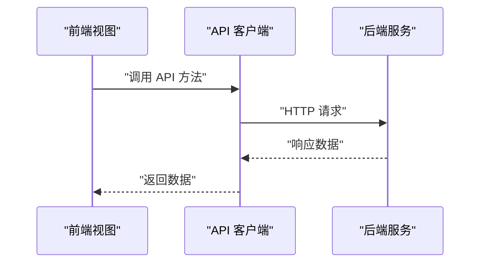
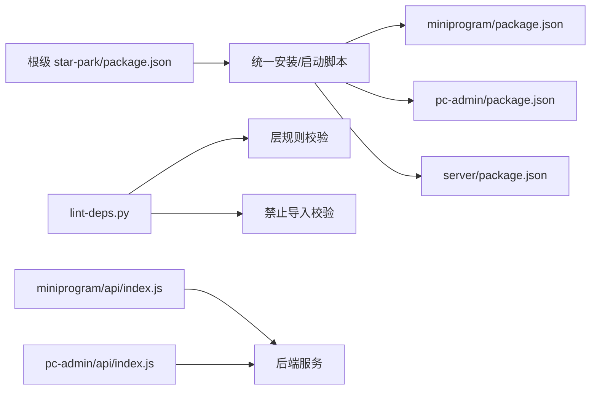

# 依赖管理设计

<cite>
**本文引用的文件**
- [star-park/package.json](file://star-park/package.json)
- [miniprogram/package.json](file://star-park/miniprogram/package.json)
- [pc-admin/package.json](file://star-park/pc-admin/package.json)
- [server/package.json](file://star-park/server/package.json)
- [lint-deps.py](file://scripts/lint-deps.py)
- [ARCHITECTURE.md](file://docs/ARCHITECTURE.md)
- [index.js](file://star-park/server/src/index.js)
- [database.js](file://star-park/server/src/database.js)
- [checkins.js](file://star-park/server/src/routes/checkins.js)
- [main.js](file://star-park/pc-admin/src/main.js)
- [main.js](file://star-park/miniprogram/src/main.js)
- [api/index.js](file://star-park/pc-admin/src/api/index.js)
- [api/index.js](file://star-park/miniprogram/src/api/index.js)
- [code-review-check.sh](file://scripts/code-review-check.sh)
- [run-api-tests.sh](file://scripts/run-api-tests.sh)
</cite>

## 目录
1. [简介](#简介)
2. [项目结构](#项目结构)
3. [核心组件](#核心组件)
4. [架构总览](#架构总览)
5. [详细组件分析](#详细组件分析)
6. [依赖分析](#依赖分析)
7. [性能考虑](#性能考虑)
8. [故障排查指南](#故障排查指南)
9. [结论](#结论)
10. [附录](#附录)

## 简介
本文件系统化阐述 StarParadise 在 Monorepo 多包结构下的依赖管理设计，重点覆盖：
- 根级与子项目级 package.json 的职责划分与统一管理
- 强制依赖规则：路由间互导禁令、数据库层隔离、前端不得直连后端等
- 依赖层次结构（L0–L5）的设计原理与实现机制
- 冲突解决策略、版本兼容性管理、构建优化与安全依赖审查流程

## 项目结构
StarParadise 采用前后端分离的 Monorepo 结构，包含三个独立子项目：
- 后端服务（server）：Express + SQLite，提供 REST API
- 管理后台前端（pc-admin）：Vue 3 + Element Plus
- 小程序前端（miniprogram）：Vue 3 + uni-app

根级与子项目 package.json 的职责如下：
- 根级 star-park/package.json：聚合安装与启动脚本，统一触发子项目安装与启动
- 子项目各自 package.json：声明自身依赖与构建脚本，确保边界清晰

图表来源
- [star-park/package.json:1-13](file://star-park/package.json#L1-L13)
- [miniprogram/package.json:1-28](file://star-park/miniprogram/package.json#L1-L28)
- [pc-admin/package.json:1-26](file://star-park/pc-admin/package.json#L1-L26)
- [server/package.json:1-15](file://star-park/server/package.json#L1-L15)

章节来源
- [star-park/package.json:1-13](file://star-park/package.json#L1-L13)
- [miniprogram/package.json:1-28](file://star-park/miniprogram/package.json#L1-L28)
- [pc-admin/package.json:1-26](file://star-park/pc-admin/package.json#L1-L26)
- [server/package.json:1-15](file://star-park/server/package.json#L1-L15)

## 核心组件
- 依赖检查工具：scripts/lint-deps.py，基于层层次结构与禁止导入规则进行静态校验
- 架构文档：docs/ARCHITECTURE.md，定义 L0–L5 分层、模块归属与强制约束
- 后端入口与路由：server/src/index.js 与 server/src/routes/*，体现 L1–L2 的依赖方向
- 前端入口与 API：pc-admin/src/main.js、miniprogram/src/main.js 与各自 api/index.js，体现 L3–L5 的依赖方向
- 数据库层：server/src/database.js，作为 L0 严格隔离，不导入任何上层模块

章节来源
- [lint-deps.py:1-252](file://scripts/lint-deps.py#L1-L252)
- [ARCHITECTURE.md:1-209](file://docs/ARCHITECTURE.md#L1-L209)
- [index.js:1-42](file://star-park/server/src/index.js#L1-L42)
- [database.js:1-111](file://star-park/server/src/database.js#L1-L111)
- [main.js:1-22](file://star-park/pc-admin/src/main.js#L1-L22)
- [main.js:1-8](file://star-park/miniprogram/src/main.js#L1-L8)
- [api/index.js:1-56](file://star-park/pc-admin/src/api/index.js#L1-L56)
- [api/index.js:1-75](file://star-park/miniprogram/src/api/index.js#L1-L75)

## 架构总览
下图展示 L0–L5 分层与模块间的依赖方向，以及禁止导入的边界。

```mermaid
graph TD
subgraph "L0 数据层"
DB["server/src/database.js"]
SEED["server/src/seed.js"]
end
subgraph "L1 后端路由"
ROUTE_CHILD["server/src/routes/children.js"]
ROUTE_TASK["server/src/routes/tasks.js"]
ROUTE_CHECKIN["server/src/routes/checkins.js"]
ROUTE_REWARD["server/src/routes/rewards.js"]
ROUTE_STATS["server/src/routes/stats.js"]
ROUTE_POINT["server/src/routes/points.js"]
end
subgraph "L2 后端入口"
SRV_INDEX["server/src/index.js"]
end
subgraph "L3 前端 API/组件"
API_PC["pc-admin/src/api/index.js"]
COMP_PC["pc-admin/src/components/*"]
ROUTER_PC["pc-admin/src/router/index.js"]
STORE_PC["pc-admin/src/stores/app.js"]
API_MP["miniprogram/src/api/index.js"]
COMP_MP["miniprogram/src/components/*"]
end
subgraph "L4 前端页面/视图"
VIEWS_PC["pc-admin/src/views/*"]
PAGES_MP["miniprogram/src/pages/*"]
end
subgraph "L5 前端入口"
MAIN_PC["pc-admin/src/main.js"]
APP_PC["pc-admin/src/App.vue"]
MAIN_MP["miniprogram/src/main.js"]
APP_MP["miniprogram/src/App.vue"]
end
ROUTE_CHILD --> DB
ROUTE_TASK --> DB
ROUTE_CHECKIN --> DB
ROUTE_REWARD --> DB
ROUTE_STATS --> DB
ROUTE_POINT --> DB
SRV_INDEX --> ROUTE_CHILD
SRV_INDEX --> ROUTE_TASK
SRV_INDEX --> ROUTE_CHECKIN
SRV_INDEX --> ROUTE_REWARD
SRV_INDEX --> ROUTE_STATS
SRV_INDEX --> ROUTE_POINT
VIEWS_PC --> API_PC
VIEWS_PC --> COMP_PC
PAGES_MP --> API_MP
PAGES_MP --> COMP_MP
MAIN_PC --> VIEWS_PC
MAIN_PC --> ROUTER_PC
MAIN_PC --> STORE_PC
MAIN_MP --> PAGES_MP
```

图表来源
- [ARCHITECTURE.md:14-71](file://docs/ARCHITECTURE.md#L14-L71)
- [index.js:1-42](file://star-park/server/src/index.js#L1-L42)
- [database.js:1-111](file://star-park/server/src/database.js#L1-L111)
- [api/index.js:1-56](file://star-park/pc-admin/src/api/index.js#L1-L56)
- [api/index.js:1-75](file://star-park/miniprogram/src/api/index.js#L1-L75)
- [main.js:1-22](file://star-park/pc-admin/src/main.js#L1-L22)
- [main.js:1-8](file://star-park/miniprogram/src/main.js#L1-L8)

## 详细组件分析

### 依赖层次结构（L0–L5）设计原理
- L0 数据层：仅依赖标准库与 npm 包，不导入任何上层模块；负责数据库初始化、建表与迁移
- L1 后端路由：依赖 L0，处理具体业务路由；不导入其他路由模块，避免循环依赖
- L2 后端入口：依赖 L0–L1，装配中间件与路由；不导入 L3–L5
- L3 前端 API/组件：仅依赖 npm 包，不导入 L0–L2；提供 API 客户端与通用组件
- L4 前端页面/视图：依赖 L3，不导入 L0–L2；负责业务视图渲染
- L5 前端入口：依赖 L3–L4，不导入 L0–L2；负责应用挂载与全局配置

强制约束与实现机制：
- 通过 scripts/lint-deps.py 对模块路径进行层映射与导入方向校验
- 通过 docs/ARCHITECTURE.md 明确禁止导入清单（如前端不得导入后端）

章节来源
- [ARCHITECTURE.md:75-96](file://docs/ARCHITECTURE.md#L75-L96)
- [lint-deps.py:13-92](file://scripts/lint-deps.py#L13-L92)

### 强制依赖规则与实现机制
- 路由模块间互导禁令：L1 路由仅依赖 L0，不互相导入，避免循环依赖与耦合
- 数据库层隔离：L0 数据库不导入任何内部模块，确保纯基础设施属性
- 前端不得直连后端：L3/L4/L5 仅通过 HTTP API 与后端交互，不直接 require 后端模块
- 同一子项目页面/视图互导禁令：同一子项目内页面/视图不互相导入，避免交叉耦合

实现机制：
- lint-deps.py 通过正则提取 import/require，解析相对路径，定位模块所属层，并对比当前层与被导入层的层级关系
- 对于禁止的跨层导入，输出明确修复建议（移动功能、依赖注入、接口抽象）

图表来源
- [lint-deps.py:156-223](file://scripts/lint-deps.py#L156-L223)

章节来源
- [lint-deps.py:156-223](file://scripts/lint-deps.py#L156-L223)
- [ARCHITECTURE.md:88-96](file://docs/ARCHITECTURE.md#L88-L96)

### 后端路由与数据库依赖关系
后端路由在 L1 层调用 L0 的数据库模块，形成“路由 → 数据库”的单向依赖，保证业务逻辑与数据访问的清晰边界。

图表来源
- [checkins.js:1-90](file://star-park/server/src/routes/checkins.js#L1-L90)
- [database.js:1-111](file://star-park/server/src/database.js#L1-L111)

章节来源
- [checkins.js:1-90](file://star-park/server/src/routes/checkins.js#L1-L90)
- [database.js:1-111](file://star-park/server/src/database.js#L1-L111)

### 前端 API 客户端与入口依赖关系
前端通过各自 API 客户端发起 HTTP 请求，L3/L4/L5 之间保持纯 UI/视图与 API 的分层，避免直接导入后端模块。

图表来源
- [api/index.js:1-56](file://star-park/pc-admin/src/api/index.js#L1-L56)
- [api/index.js:1-75](file://star-park/miniprogram/src/api/index.js#L1-L75)
- [index.js:1-42](file://star-park/server/src/index.js#L1-L42)

章节来源
- [api/index.js:1-56](file://star-park/pc-admin/src/api/index.js#L1-L56)
- [api/index.js:1-75](file://star-park/miniprogram/src/api/index.js#L1-L75)
- [index.js:1-42](file://star-park/server/src/index.js#L1-L42)

## 依赖分析
- 根级统一管理：star-park/package.json 提供 install:all 与多子项目启动脚本，便于一次性安装与启动
- 子项目独立依赖：各子项目 package.json 独立声明依赖，避免跨项目污染
- 强制规则执行：lint-deps.py 作为 CI/PR 阶段的静态检查，确保分层与禁止导入规则得到遵守
- 前后端交互：前端通过 API 客户端与后端 REST API 通信，不直接 require 后端模块

图表来源
- [star-park/package.json:1-13](file://star-park/package.json#L1-L13)
- [lint-deps.py:225-247](file://scripts/lint-deps.py#L225-L247)

章节来源
- [star-park/package.json:1-13](file://star-park/package.json#L1-L13)
- [lint-deps.py:225-247](file://scripts/lint-deps.py#L225-L247)

## 性能考虑
- 数据库层优化：启用 WAL 模式与外键约束，提升并发与一致性
- 构建优化：前端项目分别独立构建，减少无关变更影响范围
- 依赖精简：仅引入必要 npm 包，降低包体积与安装时间

章节来源
- [database.js:13-15](file://star-park/server/src/database.js#L13-L15)
- [miniprogram/package.json:19-26](file://star-park/miniprogram/package.json#L19-L26)
- [pc-admin/package.json:21-24](file://star-park/pc-admin/package.json#L21-L24)

## 故障排查指南
- 依赖违规问题：运行 lint-deps.py 输出违规详情与修复建议，优先采用“功能下沉”“依赖注入”“接口抽象”三种方式
- 端到端测试：使用 run-api-tests.sh 验证健康检查、获取孩子列表、任务列表与仪表盘接口
- 编码规范：使用 code-review-check.sh 检查调试语句与 TODO 标记

章节来源
- [lint-deps.py:225-247](file://scripts/lint-deps.py#L225-L247)
- [run-api-tests.sh:1-36](file://scripts/run-api-tests.sh#L1-L36)
- [code-review-check.sh:1-35](file://scripts/code-review-check.sh#L1-L35)

## 结论
StarParadise 的依赖管理以分层架构为核心，通过根级统一脚本与子项目独立依赖相结合，辅以 lint-deps.py 的强制规则校验，有效保障了模块边界与可维护性。前后端通过 API 客户端解耦，既满足功能需求又避免了技术债积累。建议在持续集成中固定执行依赖检查与 API 测试，确保新改动不破坏既有约束。

## 附录
- 依赖版本与用途参考：
  - 后端：express、better-sqlite3、cors、dayjs
  - PC 管理端：vue、vue-router、pinia、element-plus、echarts、axios、dayjs
  - 小程序：vue、pinia、uni-app 生态

章节来源
- [server/package.json:8-13](file://star-park/server/package.json#L8-L13)
- [pc-admin/package.json:11-20](file://star-park/pc-admin/package.json#L11-L20)
- [miniprogram/package.json:10-26](file://star-park/miniprogram/package.json#L10-L26)