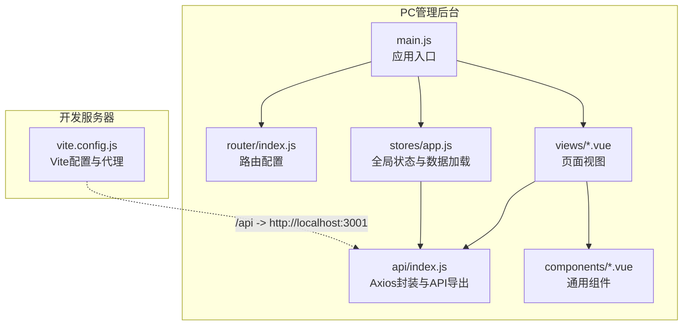
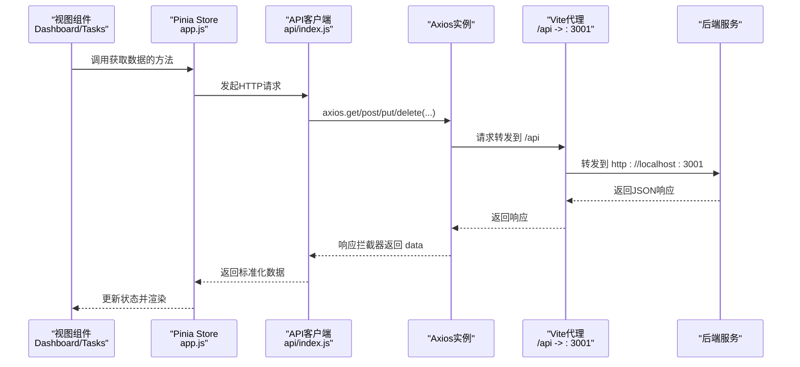
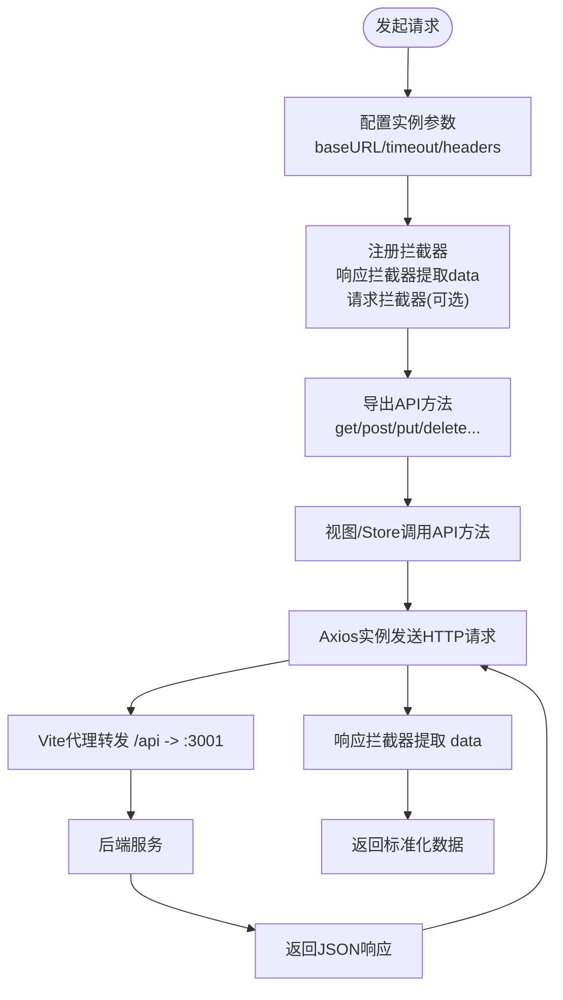
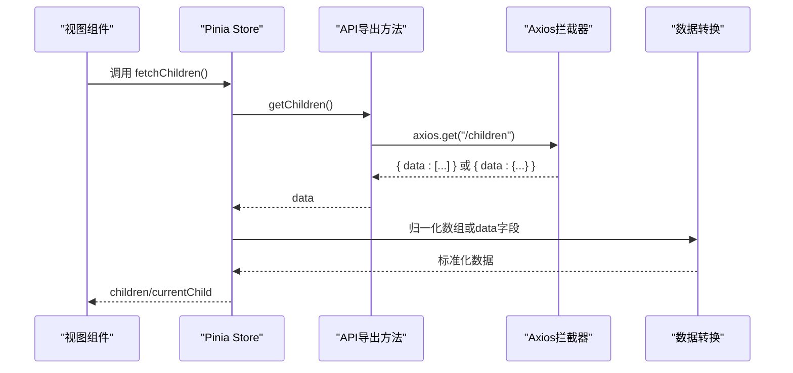
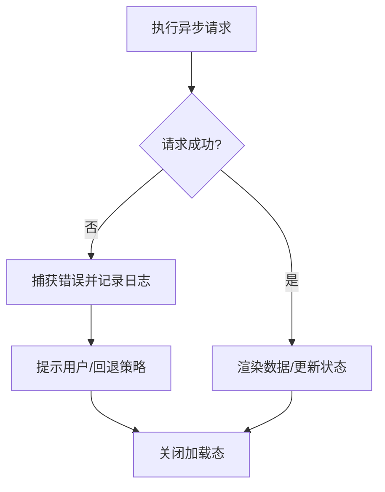
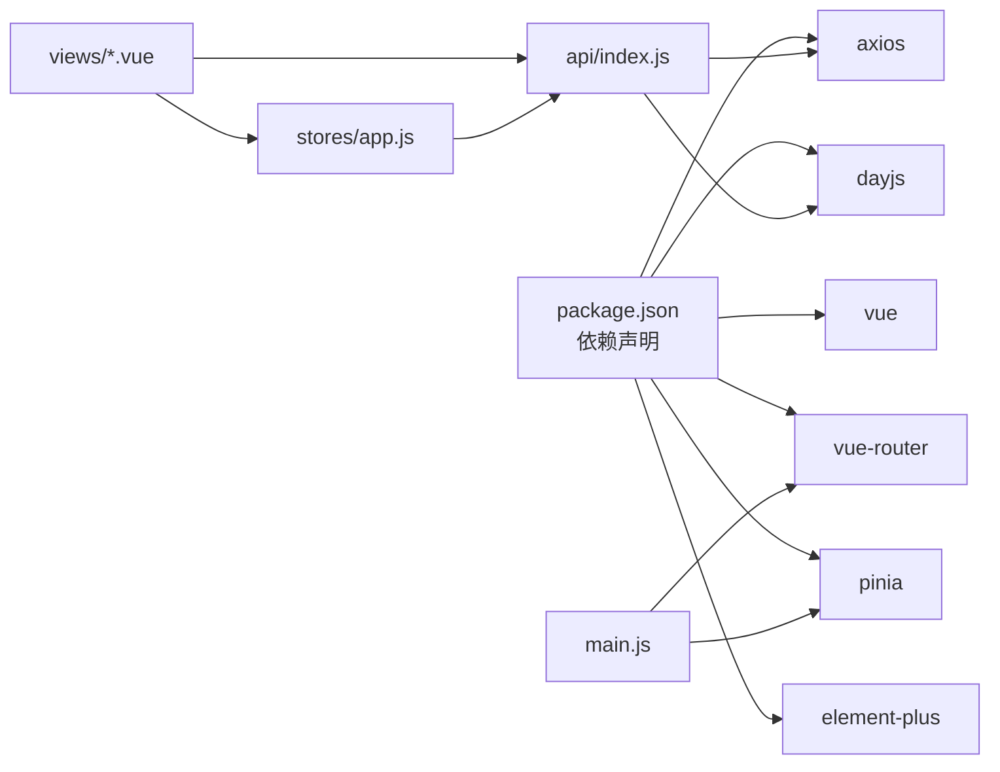

# API客户端设计

<cite>
**本文引用的文件**
- [star-park/pc-admin/src/api/index.js](file://star-park/pc-admin/src/api/index.js)
- [star-park/pc-admin/src/stores/app.js](file://star-park/pc-admin/src/stores/app.js)
- [star-park/pc-admin/src/main.js](file://star-park/pc-admin/src/main.js)
- [star-park/pc-admin/vite.config.js](file://star-park/pc-admin/vite.config.js)
- [star-park/pc-admin/src/router/index.js](file://star-park/pc-admin/src/router/index.js)
- [star-park/pc-admin/src/views/Dashboard.vue](file://star-park/pc-admin/src/views/Dashboard.vue)
- [star-park/pc-admin/src/views/Tasks.vue](file://star-park/pc-admin/src/views/Tasks.vue)
- [star-park/pc-admin/src/components/ChildCard.vue](file://star-park/pc-admin/src/components/ChildCard.vue)
- [star-park/pc-admin/src/App.vue](file://star-park/pc-admin/src/App.vue)
- [star-park/pc-admin/package.json](file://star-park/pc-admin/package.json)
</cite>

## 目录
1. [简介](#简介)
2. [项目结构](#项目结构)
3. [核心组件](#核心组件)
4. [架构总览](#架构总览)
5. [详细组件分析](#详细组件分析)
6. [依赖关系分析](#依赖关系分析)
7. [性能考量](#性能考量)
8. [故障排查指南](#故障排查指南)
9. [结论](#结论)
10. [附录](#附录)

## 简介
本文件面向StarParadise PC管理后台的API客户端，系统性梳理Axios封装的设计理念与实现要点，覆盖请求/响应拦截器、错误处理机制、请求重试策略、API调用模式、数据格式转换、认证令牌管理、超时处理、错误处理最佳实践、网络异常恢复与用户体验优化，并提供使用示例、调试技巧与性能优化建议。内容以PC端前端代码为依据，结合Vite代理、Element Plus组件与Pinia状态管理，形成端到端的API客户端设计说明。

## 项目结构
PC管理后台采用Vue 3 + Vite + Pinia + Element Plus技术栈，API客户端位于pc-admin/src/api/index.js，通过Axios统一发起HTTP请求；开发服务器通过Vite代理将/api前缀转发至后端服务；状态管理由Pinia Store负责；路由控制页面导航与标题设置；UI组件基于Element Plus构建。

**图表来源**
- [star-park/pc-admin/src/main.js:1-22](file://star-park/pc-admin/src/main.js#L1-L22)
- [star-park/pc-admin/src/router/index.js:1-67](file://star-park/pc-admin/src/router/index.js#L1-L67)
- [star-park/pc-admin/src/api/index.js:1-56](file://star-park/pc-admin/src/api/index.js#L1-L56)
- [star-park/pc-admin/src/stores/app.js:1-62](file://star-park/pc-admin/src/stores/app.js#L1-L62)
- [star-park/pc-admin/vite.config.js:1-19](file://star-park/pc-admin/vite.config.js#L1-L19)

**章节来源**
- [star-park/pc-admin/src/main.js:1-22](file://star-park/pc-admin/src/main.js#L1-L22)
- [star-park/pc-admin/src/router/index.js:1-67](file://star-park/pc-admin/src/router/index.js#L1-L67)
- [star-park/pc-admin/src/api/index.js:1-56](file://star-park/pc-admin/src/api/index.js#L1-L56)
- [star-park/pc-admin/src/stores/app.js:1-62](file://star-park/pc-admin/src/stores/app.js#L1-L62)
- [star-park/pc-admin/vite.config.js:1-19](file://star-park/pc-admin/vite.config.js#L1-L19)

## 核心组件
- Axios封装与API导出：在api/index.js中创建Axios实例，设置基础URL、超时与默认头，注册响应拦截器统一提取响应数据，按业务域导出具体API方法（如获取任务、打卡、奖励、统计、仪表盘、余额与交易等）。
- 状态管理：stores/app.js提供Pinia Store，维护孩子列表、当前选中孩子、加载状态等，并封装获取孩子列表的异步方法，内部调用API层。
- 视图与交互：views/*.vue通过组合式API调用API层与Store，进行数据渲染与用户交互；组件如ChildCard用于展示子资源统计与跳转。
- 开发代理：vite.config.js配置/api前缀代理至后端服务，便于本地联调。
- 应用入口：main.js注册插件、图标、路由与Pinia，挂载应用。

**章节来源**
- [star-park/pc-admin/src/api/index.js:1-56](file://star-park/pc-admin/src/api/index.js#L1-L56)
- [star-park/pc-admin/src/stores/app.js:1-62](file://star-park/pc-admin/src/stores/app.js#L1-L62)
- [star-park/pc-admin/src/views/Dashboard.vue:1-146](file://star-park/pc-admin/src/views/Dashboard.vue#L1-L146)
- [star-park/pc-admin/src/views/Tasks.vue:1-265](file://star-park/pc-admin/src/views/Tasks.vue#L1-L265)
- [star-park/pc-admin/src/components/ChildCard.vue:1-161](file://star-park/pc-admin/src/components/ChildCard.vue#L1-L161)
- [star-park/pc-admin/vite.config.js:1-19](file://star-park/pc-admin/vite.config.js#L1-L19)
- [star-park/pc-admin/src/main.js:1-22](file://star-park/pc-admin/src/main.js#L1-L22)

## 架构总览
下图展示了从视图到API客户端再到后端服务的数据流与职责边界：

**图表来源**
- [star-park/pc-admin/src/views/Dashboard.vue:76-91](file://star-park/pc-admin/src/views/Dashboard.vue#L76-L91)
- [star-park/pc-admin/src/stores/app.js:30-44](file://star-park/pc-admin/src/stores/app.js#L30-L44)
- [star-park/pc-admin/src/api/index.js:4-19](file://star-park/pc-admin/src/api/index.js#L4-L19)
- [star-park/pc-admin/vite.config.js:6-14](file://star-park/pc-admin/vite.config.js#L6-L14)

## 详细组件分析

### Axios封装与拦截器设计
- 实例配置
  - 基础URL：/api，便于开发阶段通过Vite代理转发至后端。
  - 超时：10秒，避免长时间阻塞UI。
  - 默认头：application/json，确保后端正确解析请求体。
- 响应拦截器
  - 统一提取响应数据，简化调用方逻辑，避免重复读取response.data。
  - 错误处理：打印错误日志并透传错误，便于上层捕获与提示。
- 请求拦截器
  - 当前未显式注册请求拦截器，若需注入认证令牌、签名或自定义头，可在该位置扩展。

**图表来源**
- [star-park/pc-admin/src/api/index.js:4-19](file://star-park/pc-admin/src/api/index.js#L4-L19)

**章节来源**
- [star-park/pc-admin/src/api/index.js:1-56](file://star-park/pc-admin/src/api/index.js#L1-L56)

### API调用模式与数据格式转换
- 调用模式
  - 视图组件直接调用API导出方法，如获取任务、创建/更新/删除任务、获取打卡、奖励、统计、仪表盘、余额与交易等。
  - Store封装异步数据加载，内部调用API并进行数据归一化（如数组或嵌套data字段）。
- 数据格式转换
  - 响应拦截器统一返回data，调用方可直接接收数组或对象。
  - Store侧对后端返回的嵌套data进行兼容处理，保证组件渲染一致性。
  - 视图组件对部分字段进行轻量转换（如布尔值、数值、枚举标签），提升展示体验。

**图表来源**
- [star-park/pc-admin/src/stores/app.js:30-44](file://star-park/pc-admin/src/stores/app.js#L30-L44)
- [star-park/pc-admin/src/api/index.js:21-22](file://star-park/pc-admin/src/api/index.js#L21-L22)

**章节来源**
- [star-park/pc-admin/src/stores/app.js:30-44](file://star-park/pc-admin/src/stores/app.js#L30-L44)
- [star-park/pc-admin/src/views/Tasks.vue:203-222](file://star-park/pc-admin/src/views/Tasks.vue#L203-L222)

### 错误处理机制与最佳实践
- 响应拦截器错误分支：打印错误日志并透传错误，便于上层统一处理。
- 视图与Store层面：在try/catch中捕获错误，记录日志并提示用户；finally中关闭加载态，保证用户体验。
- 最佳实践
  - 在Store与视图分别设置错误兜底，避免错误冒泡导致崩溃。
  - 对于仪表盘场景，当接口失败时回退到本地缓存或Store已有数据，维持界面可用性。
  - 使用消息提示组件（如Element Plus的消息/确认框）向用户反馈操作结果。

**图表来源**
- [star-park/pc-admin/src/views/Dashboard.vue:76-91](file://star-park/pc-admin/src/views/Dashboard.vue#L76-L91)
- [star-park/pc-admin/src/stores/app.js:30-44](file://star-park/pc-admin/src/stores/app.js#L30-L44)

**章节来源**
- [star-park/pc-admin/src/views/Dashboard.vue:76-91](file://star-park/pc-admin/src/views/Dashboard.vue#L76-L91)
- [star-park/pc-admin/src/stores/app.js:30-44](file://star-park/pc-admin/src/stores/app.js#L30-L44)

### 认证令牌管理
- 当前实现未在请求拦截器中注入认证令牌或签名，若后端需要鉴权，建议在请求拦截器中读取令牌并附加到请求头。
- 可选方案
  - 将令牌存储于安全存储或Vuex/Pinia中，在请求拦截器中动态附加Authorization头。
  - 配合刷新令牌流程，处理401场景下的静默刷新与重试。

[本节为概念性建议，不直接对应现有代码文件]

### 超时处理与网络异常恢复
- 超时：Axios实例设置了10秒超时，避免长时间等待阻塞UI。
- 网络异常恢复
  - 响应拦截器记录错误并透传，上层可结合重试策略与降级逻辑。
  - 仪表盘场景在失败时回退到Store已有数据，保障基本可用性。

**章节来源**
- [star-park/pc-admin/src/api/index.js:4-6](file://star-park/pc-admin/src/api/index.js#L4-L6)
- [star-park/pc-admin/src/views/Dashboard.vue:76-91](file://star-park/pc-admin/src/views/Dashboard.vue#L76-L91)

### 请求重试策略
- 当前未实现自动重试逻辑。若需增强稳定性，可在请求拦截器中对特定错误码或网络异常进行指数退避重试，并限制最大重试次数。
- 建议仅对幂等请求（GET/DELETE）启用自动重试，避免重复副作用。

[本节为概念性建议，不直接对应现有代码文件]

### 开发代理与跨域
- Vite开发服务器通过proxy将/api前缀转发至后端服务地址，避免开发阶段的跨域问题。
- 代理配置清晰简洁，便于本地联调。

**章节来源**
- [star-park/pc-admin/vite.config.js:6-14](file://star-park/pc-admin/vite.config.js#L6-L14)

### 使用示例与调试技巧
- 使用示例
  - 在视图中调用API导出方法：如获取任务列表、创建/更新/删除任务、获取打卡/奖励/统计/仪表盘/余额/交易等。
  - 在Store中封装异步加载：统一处理加载态、错误与数据归一化。
- 调试技巧
  - 打开浏览器开发者工具Network面板，观察/api请求是否被Vite代理正确转发。
  - 查看Console输出，定位响应拦截器打印的错误信息。
  - 在Store与视图中增加日志，确认数据流转与状态变更。

**章节来源**
- [star-park/pc-admin/src/views/Tasks.vue:160-201](file://star-park/pc-admin/src/views/Tasks.vue#L160-L201)
- [star-park/pc-admin/src/stores/app.js:30-44](file://star-park/pc-admin/src/stores/app.js#L30-L44)
- [star-park/pc-admin/vite.config.js:6-14](file://star-park/pc-admin/vite.config.js#L6-L14)

## 依赖关系分析
- 外部依赖
  - axios：HTTP客户端，提供请求/响应拦截器能力。
  - dayjs：日期时间处理（在视图中使用）。
  - element-plus：UI组件库，提供消息、确认框、表格、表单等。
  - pinia：状态管理库，集中管理应用状态。
  - vue & vue-router：前端框架与路由。
- 内部依赖
  - main.js依赖router与pinia；router控制页面标题；views依赖api与stores；api依赖axios与dayjs；components复用UI元素。

**图表来源**
- [star-park/pc-admin/package.json:11-20](file://star-park/pc-admin/package.json#L11-L20)
- [star-park/pc-admin/src/main.js:1-22](file://star-park/pc-admin/src/main.js#L1-L22)
- [star-park/pc-admin/src/api/index.js:1-2](file://star-park/pc-admin/src/api/index.js#L1-L2)
- [star-park/pc-admin/src/stores/app.js:1-3](file://star-park/pc-admin/src/stores/app.js#L1-L3)

**章节来源**
- [star-park/pc-admin/package.json:1-26](file://star-park/pc-admin/package.json#L1-L26)
- [star-park/pc-admin/src/main.js:1-22](file://star-park/pc-admin/src/main.js#L1-L22)

## 性能考量
- 请求粒度与合并：对高频小请求进行合并或批量查询，减少HTTP往返。
- 缓存策略：对静态或低频数据引入内存缓存或localStorage缓存，降低重复请求。
- 渲染优化：使用计算属性与浅层响应式，避免不必要的重渲染；表格与列表使用虚拟滚动（如Element Plus支持）。
- 超时与重试：合理设置超时与重试策略，避免阻塞UI；对非幂等请求谨慎重试。
- 代理与CDN：开发环境使用Vite代理，生产环境建议后端开启Gzip/压缩与CDN加速。

[本节提供一般性指导，不直接分析具体文件]

## 故障排查指南
- 网络请求失败
  - 检查Vite代理是否正确配置，确认/api前缀是否转发至后端。
  - 查看Network面板，确认请求URL、状态码与响应体。
- 响应数据异常
  - 确认后端返回结构是否包含data字段，Store侧是否正确归一化。
  - 在响应拦截器中检查返回格式，必要时调整API导出方法。
- 用户体验问题
  - 确保在finally中关闭加载态，避免按钮一直处于禁用状态。
  - 对错误进行用户友好提示，避免直接抛出原始错误。

**章节来源**
- [star-park/pc-admin/vite.config.js:6-14](file://star-park/pc-admin/vite.config.js#L6-L14)
- [star-park/pc-admin/src/stores/app.js:30-44](file://star-park/pc-admin/src/stores/app.js#L30-L44)
- [star-park/pc-admin/src/views/Dashboard.vue:76-91](file://star-park/pc-admin/src/views/Dashboard.vue#L76-L91)

## 结论
本API客户端以Axios为核心，通过响应拦截器统一数据提取、在Store与视图中实现错误兜底与加载态管理，结合Vite代理与Element Plus组件，形成了清晰、可维护且具备良好用户体验的前端数据访问层。后续可在请求拦截器中补充认证令牌注入与自动重试策略，进一步提升安全性与稳定性。

## 附录
- 关键文件路径与职责
  - api/index.js：Axios实例、拦截器与API导出
  - stores/app.js：全局状态与数据加载
  - views/*.vue：页面逻辑与用户交互
  - vite.config.js：开发代理配置
  - main.js：应用初始化与插件注册
  - router/index.js：路由与页面标题
  - components/*.vue：通用UI组件

**章节来源**
- [star-park/pc-admin/src/api/index.js:1-56](file://star-park/pc-admin/src/api/index.js#L1-L56)
- [star-park/pc-admin/src/stores/app.js:1-62](file://star-park/pc-admin/src/stores/app.js#L1-L62)
- [star-park/pc-admin/src/views/Dashboard.vue:1-146](file://star-park/pc-admin/src/views/Dashboard.vue#L1-L146)
- [star-park/pc-admin/src/views/Tasks.vue:1-265](file://star-park/pc-admin/src/views/Tasks.vue#L1-L265)
- [star-park/pc-admin/src/components/ChildCard.vue:1-161](file://star-park/pc-admin/src/components/ChildCard.vue#L1-L161)
- [star-park/pc-admin/vite.config.js:1-19](file://star-park/pc-admin/vite.config.js#L1-L19)
- [star-park/pc-admin/src/main.js:1-22](file://star-park/pc-admin/src/main.js#L1-L22)
- [star-park/pc-admin/src/router/index.js:1-67](file://star-park/pc-admin/src/router/index.js#L1-L67)
- [star-park/pc-admin/src/App.vue:1-10](file://star-park/pc-admin/src/App.vue#L1-L10)