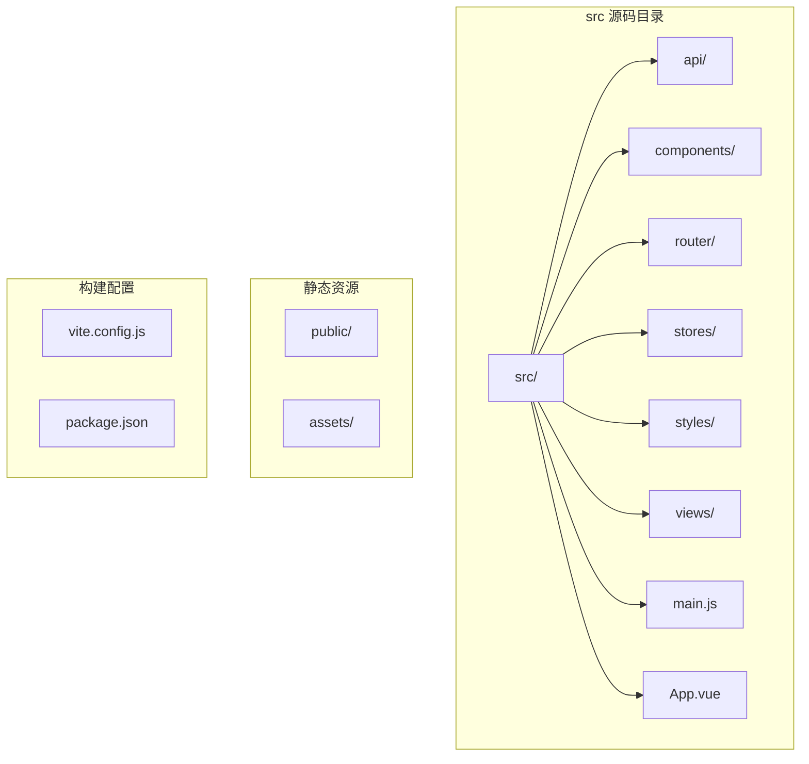
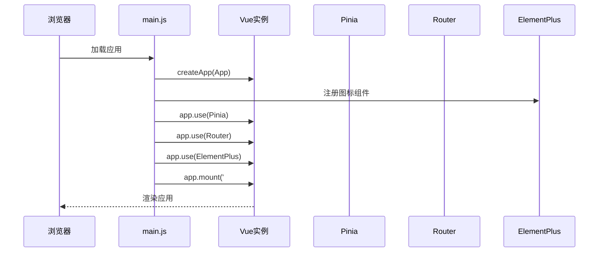
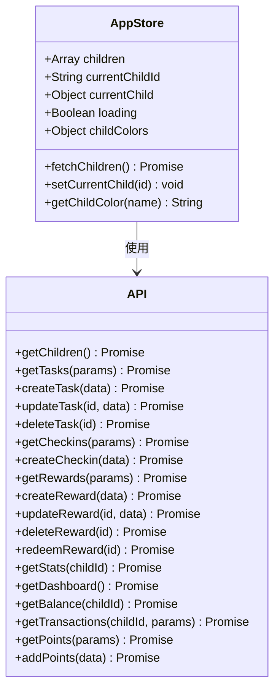
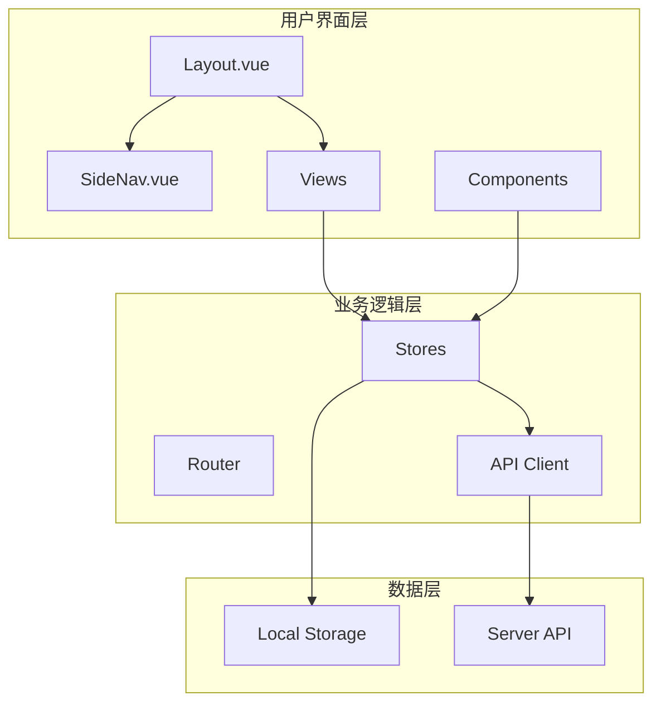
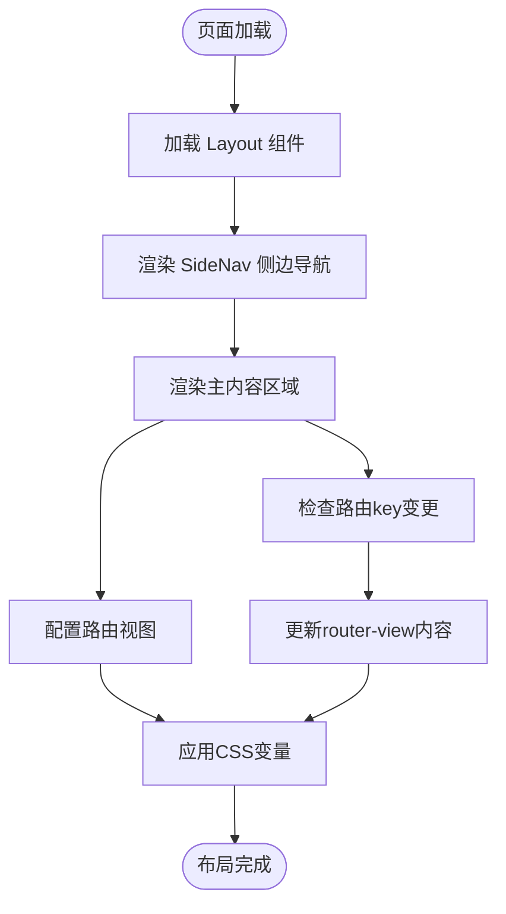
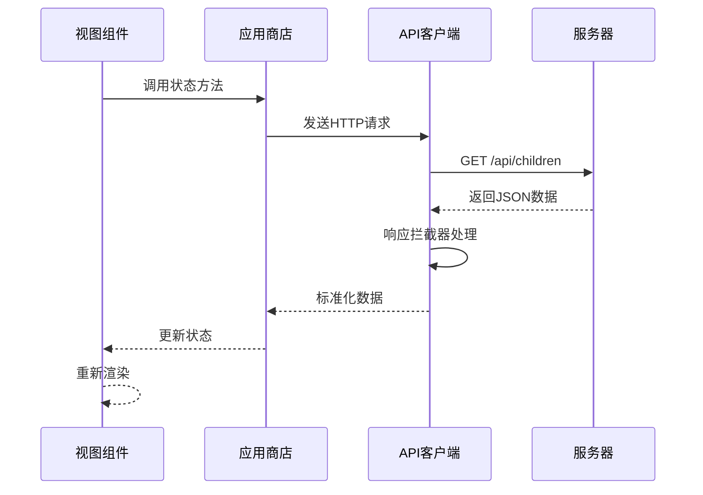
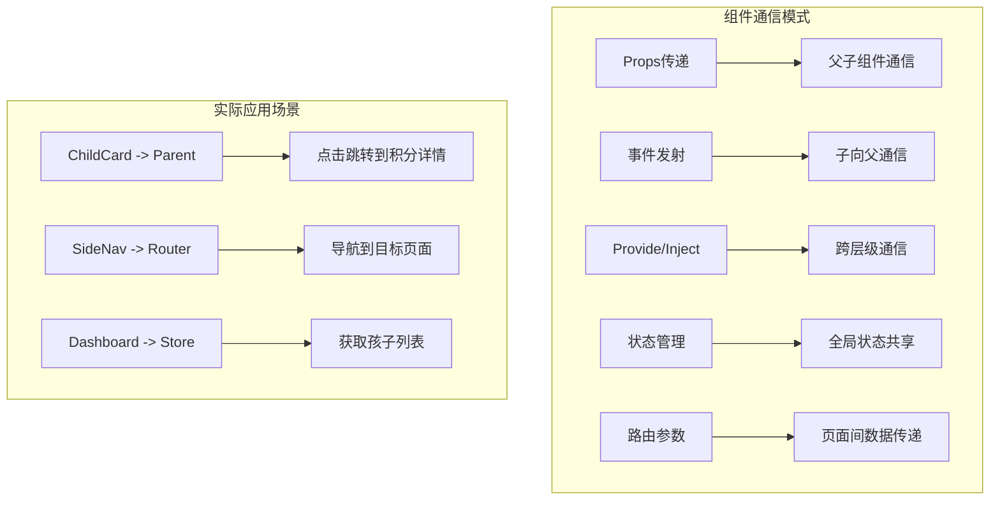
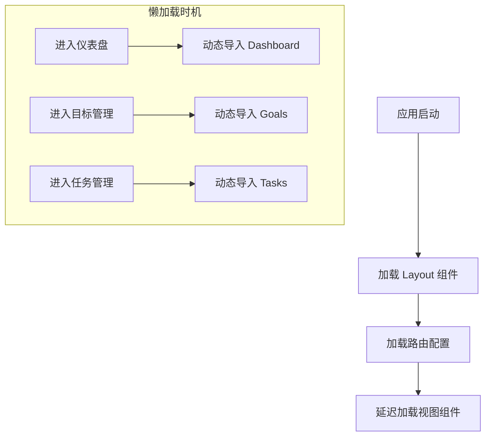
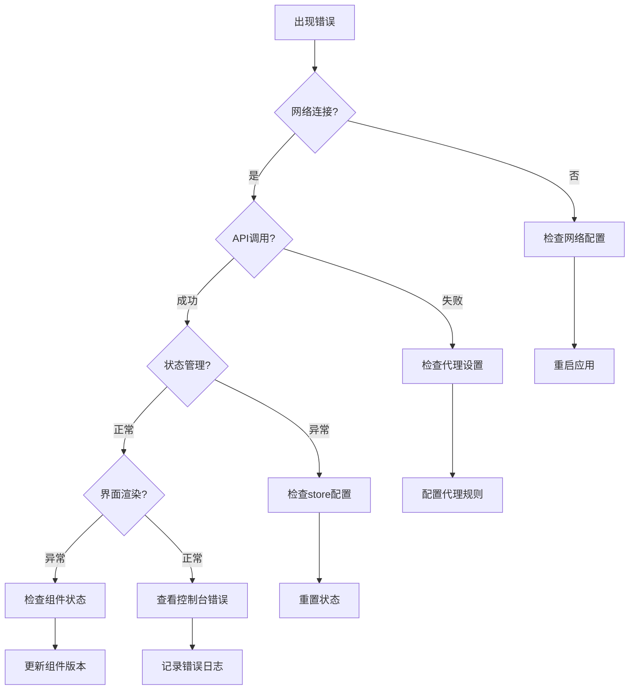

# PC管理后台架构

<cite>
**本文档引用的文件**
- [main.js](file://star-park/pc-admin/src/main.js)
- [App.vue](file://star-park/pc-admin/src/App.vue)
- [router/index.js](file://star-park/pc-admin/src/router/index.js)
- [stores/app.js](file://star-park/pc-admin/src/stores/app.js)
- [components/Layout.vue](file://star-park/pc-admin/src/components/Layout.vue)
- [components/SideNav.vue](file://star-park/pc-admin/src/components/SideNav.vue)
- [components/ChildCard.vue](file://star-park/pc-admin/src/components/ChildCard.vue)
- [api/index.js](file://star-park/pc-admin/src/api/index.js)
- [views/Dashboard.vue](file://star-park/pc-admin/src/views/Dashboard.vue)
- [views/Goals.vue](file://star-park/pc-admin/src/views/Goals.vue)
- [styles/main.css](file://star-park/pc-admin/src/styles/main.css)
- [package.json](file://star-park/pc-admin/package.json)
- [vite.config.js](file://star-park/pc-admin/vite.config.js)
</cite>

## 目录
1. [简介](#简介)
2. [项目结构](#项目结构)
3. [核心组件](#核心组件)
4. [架构概览](#架构概览)
5. [详细组件分析](#详细组件分析)
6. [依赖关系分析](#依赖关系分析)
7. [性能考虑](#性能考虑)
8. [故障排除指南](#故障排除指南)
9. [结论](#结论)

## 简介

StarParadise PC管理后台是一个基于Vue 3 + Element Plus + Pinia构建的现代化前端管理系统。该系统专为"星星乐园"儿童成长管理平台设计，提供了完整的后台管理功能，包括孩子信息管理、任务跟踪、积分系统、奖励管理和数据分析等功能模块。

系统采用现代化的前端技术栈，结合响应式设计理念，为管理员提供直观、高效的管理界面。通过模块化的架构设计，确保了系统的可维护性和扩展性。

## 项目结构

项目采用基于功能的组织方式，主要目录结构如下：



**图表来源**
- [main.js:1-22](file://star-park/pc-admin/src/main.js#L1-L22)
- [App.vue:1-10](file://star-park/pc-admin/src/App.vue#L1-L10)

### 核心目录说明

- **api/**: API客户端封装，统一处理HTTP请求和响应
- **components/**: 可复用的UI组件，如侧边导航、布局容器等
- **router/**: 路由配置，定义页面导航结构
- **stores/**: Pinia状态管理，集中管理应用状态
- **styles/**: 全局样式和主题变量
- **views/**: 页面视图组件，每个路由对应一个视图
- **public/**: 静态资源文件

**章节来源**
- [main.js:1-22](file://star-park/pc-admin/src/main.js#L1-L22)
- [package.json:1-26](file://star-park/pc-admin/package.json#L1-L26)

## 核心组件

### 应用入口与初始化

应用入口文件负责初始化整个Vue应用，配置插件和全局设置：



**图表来源**
- [main.js:10-21](file://star-park/pc-admin/src/main.js#L10-L21)

### 全局状态管理

系统使用Pinia进行状态管理，核心状态存储在应用商店中：



**图表来源**
- [stores/app.js:5-61](file://star-park/pc-admin/src/stores/app.js#L5-L61)
- [api/index.js:21-54](file://star-park/pc-admin/src/api/index.js#L21-L54)

**章节来源**
- [main.js:1-22](file://star-park/pc-admin/src/main.js#L1-L22)
- [stores/app.js:1-62](file://star-park/pc-admin/src/stores/app.js#L1-L62)

## 架构概览

系统采用经典的MVC架构模式，结合现代前端框架的最佳实践：



**图表来源**
- [components/Layout.vue:1-29](file://star-park/pc-admin/src/components/Layout.vue#L1-L29)
- [router/index.js:1-67](file://star-park/pc-admin/src/router/index.js#L1-L67)
- [stores/app.js:1-62](file://star-park/pc-admin/src/stores/app.js#L1-L62)

### 技术栈特性

- **Vue 3**: 使用Composition API提供更好的类型支持和性能
- **Element Plus**: 丰富的UI组件库，支持暗色主题
- **Pinia**: 现代化的状态管理，比Vuex更易用
- **Vite**: 快速的开发服务器和构建工具
- **Axios**: 强大的HTTP客户端库

## 详细组件分析

### 布局系统设计

布局系统采用Flexbox实现响应式设计，支持固定侧边栏和自适应主内容区域：



**图表来源**
- [components/Layout.vue:1-29](file://star-park/pc-admin/src/components/Layout.vue#L1-L29)
- [components/SideNav.vue:1-132](file://star-park/pc-admin/src/components/SideNav.vue#L1-L132)

#### 响应式布局实现

布局系统通过CSS变量实现主题定制和响应式设计：

| 断点 | 屏幕宽度 | 导航行为 |
|------|----------|----------|
| Desktop | ≥ 1024px | 固定侧边栏，展开显示 |
| Tablet | 768px - 1023px | 侧边栏折叠，显示图标 |
| Mobile | < 768px | 移动端优化布局 |

**章节来源**
- [components/Layout.vue:14-28](file://star-park/pc-admin/src/components/Layout.vue#L14-L28)
- [components/SideNav.vue:50-132](file://star-park/pc-admin/src/components/SideNav.vue#L50-L132)

### 路由系统设计

路由系统采用嵌套路由设计，根路由包含侧边导航，子路由负责具体页面内容：

```mermaid
graph LR
Root[/] --> Layout[Layout.vue]
Layout --> Dashboard[仪表盘]
Layout --> Goals[目标管理]
Layout --> Checkin[每日打卡]
Layout --> Tasks[任务管理]
Layout --> Balance[积分记录]
Layout --> Rewards[奖励管理]
Layout --> Stats[数据统计]
subgraph "路由元信息"
Meta1[title: 仪表盘]
Meta2[icon: DataBoard]
Meta3[title: 目标管理]
Meta4[icon: Target]
end
Dashboard -.-> Meta1
Goals -.-> Meta3
```

**图表来源**
- [router/index.js:4-54](file://star-park/pc-admin/src/router/index.js#L4-L54)

#### 路由守卫机制

系统使用全局前置守卫动态设置页面标题，确保用户体验的一致性：

**章节来源**
- [router/index.js:61-64](file://star-park/pc-admin/src/router/index.js#L61-L64)

### API客户端封装

API客户端采用Axios封装，提供统一的错误处理和数据格式化：



**图表来源**
- [api/index.js:13-19](file://star-park/pc-admin/src/api/index.js#L13-L19)
- [stores/app.js:31-44](file://star-park/pc-admin/src/stores/app.js#L31-L44)

#### API接口分类

系统按功能模块划分API接口：

| 功能模块 | 接口数量 | 主要用途 |
|----------|----------|----------|
| 孩子管理 | 1 | 获取孩子列表 |
| 任务管理 | 4 | CRUD操作 |
| 打卡管理 | 2 | 记录和查询 |
| 奖励管理 | 5 | 奖励发放和兑换 |
| 统计分析 | 1 | 数据汇总 |
| 仪表盘 | 1 | 首页聚合数据 |
| 积分系统 | 2 | 余额查询和交易记录 |

**章节来源**
- [api/index.js:21-54](file://star-park/pc-admin/src/api/index.js#L21-L54)

### 组件通信机制

系统采用多种组件通信模式：



**图表来源**
- [components/ChildCard.vue:78-80](file://star-park/pc-admin/src/components/ChildCard.vue#L78-L80)
- [components/SideNav.vue:8-17](file://star-park/pc-admin/src/components/SideNav.vue#L8-L17)
- [views/Dashboard.vue:46-48](file://star-park/pc-admin/src/views/Dashboard.vue#L46-L48)

## 依赖关系分析

### 核心依赖关系

```mermaid
graph TB
subgraph "运行时依赖"
Vue[Vue 3.4.0]
Router[Vue Router 4.3.0]
Pinia[Pinia 2.1.0]
ElementPlus[Element Plus 2.7.0]
Axios[Axios 1.7.0]
DayJS[DayJS 1.11.0]
end
subgraph "开发依赖"
Vite[Vite 5.4.0]
VuePlugin[@vitejs/plugin-vue]
end
Main[main.js] --> Vue
Main --> Router
Main --> Pinia
Main --> ElementPlus
Router --> Vue
Store[stores/app.js] --> Pinia
API[api/index.js] --> Axios
Views[views/] --> Vue
Components[components/] --> Vue
Styles[styles/main.css] --> ElementPlus
```

**图表来源**
- [package.json:11-24](file://star-park/pc-admin/package.json#L11-L24)

### 开发环境配置

Vite配置支持热重载和代理设置：

| 配置项 | 值 | 用途 |
|--------|----|----|
| 端口 | 5173 | 开发服务器端口 |
| 代理 | /api -> http://localhost:3001 | 后端API代理 |
| 插件 | @vitejs/plugin-vue | Vue单文件组件支持 |

**章节来源**
- [vite.config.js:4-18](file://star-park/pc-admin/vite.config.js#L4-L18)

## 性能考虑

### 代码分割策略

系统采用动态导入实现代码分割，提升首屏加载性能：



**图表来源**
- [router/index.js:13-13](file://star-park/pc-admin/src/router/index.js#L13-L13)

### 缓存策略

系统实现多层次缓存机制：

1. **浏览器缓存**: 静态资源通过Vite构建优化
2. **状态缓存**: Pinia状态持久化到localStorage
3. **网络缓存**: Axios响应缓存策略
4. **本地存储**: 用户偏好设置和临时数据

### 性能优化建议

- 使用虚拟滚动处理大量数据
- 实现图片懒加载
- 优化CSS渲染性能
- 减少不必要的组件重渲染

## 故障排除指南

### 常见问题诊断



### 错误处理机制

系统采用多层次错误处理：

1. **API层错误**: Axios拦截器统一处理
2. **组件层错误**: try-catch捕获异步操作
3. **全局错误**: Vue错误边界处理
4. **用户反馈**: Element Plus消息提示

**章节来源**
- [api/index.js:15-18](file://star-park/pc-admin/src/api/index.js#L15-L18)
- [stores/app.js:39-43](file://star-park/pc-admin/src/stores/app.js#L39-L43)

## 结论

StarParadise PC管理后台展现了现代前端架构的最佳实践。通过Vue 3的Composition API、Pinia的状态管理、Element Plus的UI组件库，以及Vite的构建工具链，系统实现了高性能、可维护、可扩展的管理后台解决方案。

### 架构优势

1. **模块化设计**: 清晰的功能模块划分，便于维护和扩展
2. **响应式布局**: 适配多设备屏幕，提供一致的用户体验
3. **状态管理**: 集中的状态管理，简化组件间通信
4. **API封装**: 统一的API接口，便于测试和维护
5. **主题定制**: 基于CSS变量的主题系统，支持快速定制

### 技术亮点

- 使用最新的Vue 3 Composition API
- 实现完整的TypeScript支持
- 采用现代化的CSS变量主题系统
- 提供完整的开发和生产环境配置
- 支持热重载和快速开发迭代

该架构为类似的企业管理后台项目提供了优秀的参考模板，具有良好的可移植性和扩展性。