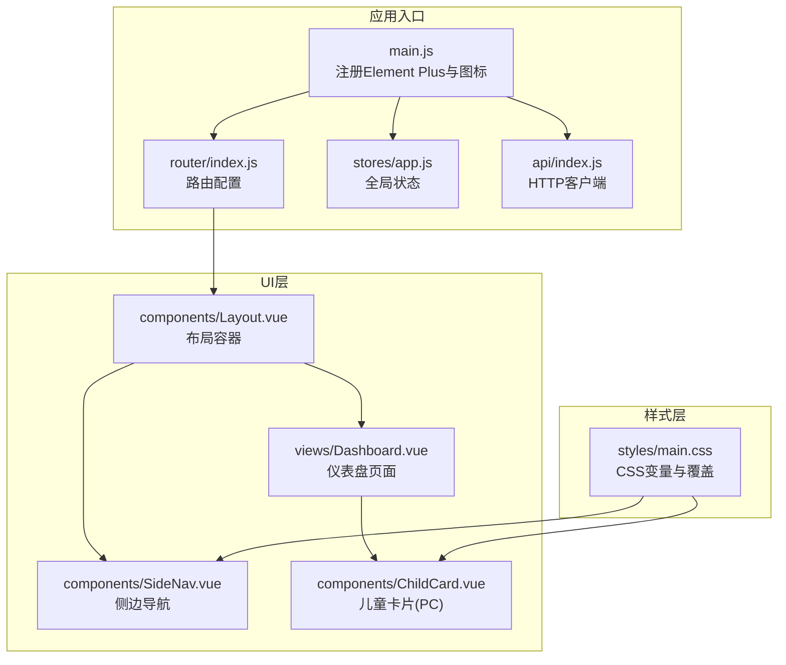
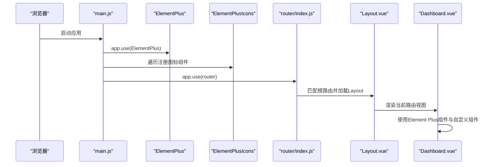
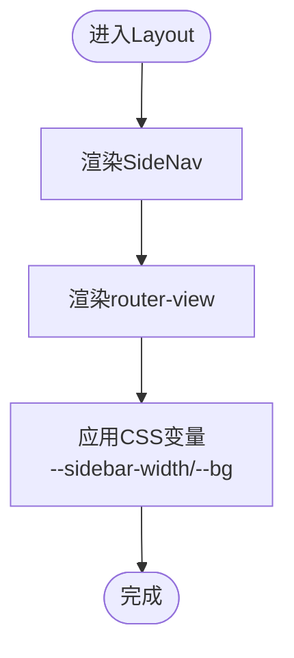
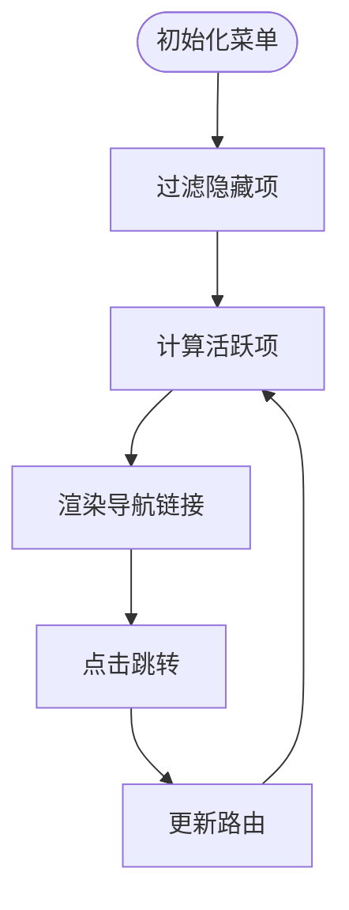
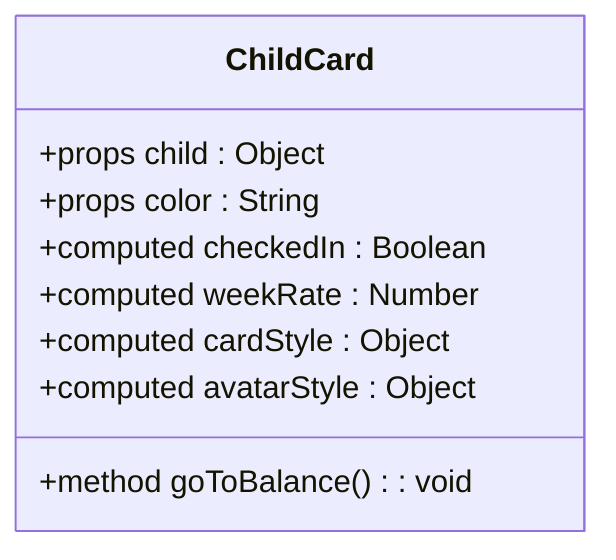
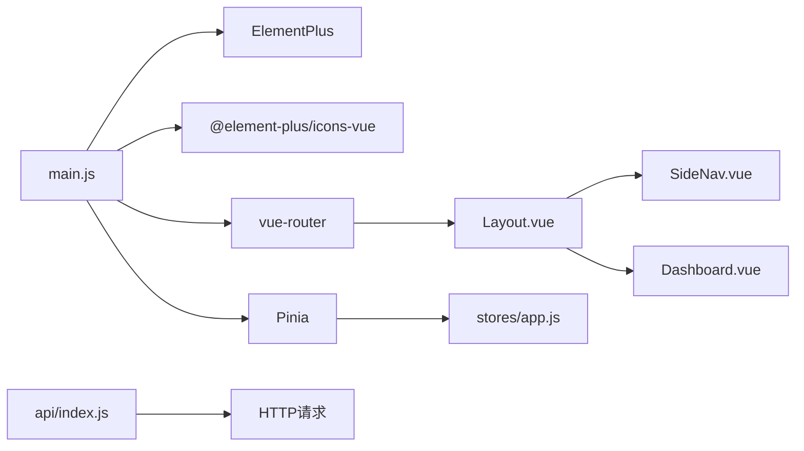

# UI组件库设计

<cite>
**本文引用的文件**
- [Layout.vue](file://star-park/pc-admin/src/components/Layout.vue)
- [SideNav.vue](file://star-park/pc-admin/src/components/SideNav.vue)
- [ChildCard.vue（PC）](file://star-park/pc-admin/src/components/ChildCard.vue)
- [ChildCard.vue（小程序）](file://star-park/miniprogram/src/components/ChildCard.vue)
- [TaskItem.vue（小程序）](file://star-park/miniprogram/src/components/TaskItem.vue)
- [main.css](file://star-park/pc-admin/src/styles/main.css)
- [main.js](file://star-park/pc-admin/src/main.js)
- [vite.config.js](file://star-park/pc-admin/vite.config.js)
- [Dashboard.vue](file://star-park/pc-admin/src/views/Dashboard.vue)
- [router/index.js](file://star-park/pc-admin/src/router/index.js)
- [package.json](file://star-park/pc-admin/package.json)
- [stores/app.js](file://star-park/pc-admin/src/stores/app.js)
- [api/index.js](file://star-park/pc-admin/src/api/index.js)
</cite>

## 目录
1. [简介](#简介)
2. [项目结构](#项目结构)
3. [核心组件](#核心组件)
4. [架构总览](#架构总览)
5. [详细组件分析](#详细组件分析)
6. [依赖关系分析](#依赖关系分析)
7. [性能考虑](#性能考虑)
8. [故障排查指南](#故障排查指南)
9. [结论](#结论)
10. [附录](#附录)

## 简介
本文件面向StarParadise PC管理后台的UI组件库，系统性梳理Element Plus组件库的集成与定制实践，涵盖主题变量体系、图标系统、组件样式覆盖策略；同时深入解析自定义组件的设计与实现，包括Layout布局组件、SideNav侧边导航、ChildCard儿童卡片、TaskItem任务项等核心组件的props设计、事件处理、插槽使用与样式定制方案，并给出组件复用策略、性能优化建议与响应式设计实现思路。

## 项目结构
PC管理后台采用Vue 3 + Vite + Pinia + Element Plus技术栈，组件库以功能域划分：components（自定义组件）、views（页面）、router（路由）、stores（状态）、styles（全局样式）、api（接口封装）。Element Plus通过全局注册图标并在入口统一挂载，结合CSS变量实现主题化与样式覆盖。

图表来源
- [main.js:1-22](file://star-park/pc-admin/src/main.js#L1-L22)
- [router/index.js:1-67](file://star-park/pc-admin/src/router/index.js#L1-L67)
- [stores/app.js:1-62](file://star-park/pc-admin/src/stores/app.js#L1-L62)
- [api/index.js:1-56](file://star-park/pc-admin/src/api/index.js#L1-L56)
- [Layout.vue:1-29](file://star-park/pc-admin/src/components/Layout.vue#L1-L29)
- [SideNav.vue:1-132](file://star-park/pc-admin/src/components/SideNav.vue#L1-L132)
- [Dashboard.vue:1-146](file://star-park/pc-admin/src/views/Dashboard.vue#L1-L146)
- [ChildCard.vue（PC）:1-161](file://star-park/pc-admin/src/components/ChildCard.vue#L1-L161)
- [main.css:1-164](file://star-park/pc-admin/src/styles/main.css#L1-L164)

章节来源
- [main.js:1-22](file://star-park/pc-admin/src/main.js#L1-L22)
- [router/index.js:1-67](file://star-park/pc-admin/src/router/index.js#L1-L67)
- [Layout.vue:1-29](file://star-park/pc-admin/src/components/Layout.vue#L1-L29)
- [SideNav.vue:1-132](file://star-park/pc-admin/src/components/SideNav.vue#L1-L132)
- [Dashboard.vue:1-146](file://star-park/pc-admin/src/views/Dashboard.vue#L1-L146)
- [ChildCard.vue（PC）:1-161](file://star-park/pc-admin/src/components/ChildCard.vue#L1-L161)
- [main.css:1-164](file://star-park/pc-admin/src/styles/main.css#L1-L164)

## 核心组件
- 布局容器：负责整体页面布局与主内容区渲染，结合CSS变量控制侧边栏宽度与背景色。
- 侧边导航：基于Element Plus图标与路由链接，动态过滤菜单项，高亮当前页签。
- 儿童卡片：展示儿童基本信息、打卡状态、周完成率、余额与积分等关键指标，支持点击跳转。
- 任务项（小程序同构组件）：用于任务列表的勾选交互，包含名称、描述、奖励值与禁用态。

章节来源
- [Layout.vue:1-29](file://star-park/pc-admin/src/components/Layout.vue#L1-L29)
- [SideNav.vue:1-132](file://star-park/pc-admin/src/components/SideNav.vue#L1-L132)
- [ChildCard.vue（PC）:1-161](file://star-park/pc-admin/src/components/ChildCard.vue#L1-L161)
- [TaskItem.vue（小程序）:1-133](file://star-park/miniprogram/src/components/TaskItem.vue#L1-L133)

## 架构总览
下图展示了从应用启动到页面渲染的关键流程，以及Element Plus图标注册与主题覆盖的注入路径。

图表来源
- [main.js:1-22](file://star-park/pc-admin/src/main.js#L1-L22)
- [router/index.js:1-67](file://star-park/pc-admin/src/router/index.js#L1-L67)
- [Layout.vue:1-29](file://star-park/pc-admin/src/components/Layout.vue#L1-L29)
- [Dashboard.vue:1-146](file://star-park/pc-admin/src/views/Dashboard.vue#L1-L146)

## 详细组件分析

### 布局组件 Layout
- 职责：提供全局布局骨架，左侧固定侧边栏，右侧主内容区随路由切换。
- 关键点：
  - 使用CSS变量控制侧边栏宽度与背景色，保证主题一致性。
  - 主内容区通过router-view按路径渲染，利用key避免缓存导致的重复渲染问题。
- 样式定制：通过scoped样式与全局CSS变量协同，确保主区背景与滚动行为一致。

图表来源
- [Layout.vue:1-29](file://star-park/pc-admin/src/components/Layout.vue#L1-L29)
- [main.css:1-164](file://star-park/pc-admin/src/styles/main.css#L1-L164)

章节来源
- [Layout.vue:1-29](file://star-park/pc-admin/src/components/Layout.vue#L1-L29)
- [main.css:1-164](file://star-park/pc-admin/src/styles/main.css#L1-L164)

### 侧边导航 SideNav
- 菜单数据：集中定义在组件内，包含路径、标题、图标与隐藏标记。
- 动态过滤：visibleMenuItems过滤hidden项，保证菜单整洁。
- 活跃态：根据当前路由计算活跃项，高亮当前页签。
- 图标系统：通过Element Plus图标组件与动态component渲染，实现图标可配置。

图表来源
- [SideNav.vue:1-132](file://star-park/pc-admin/src/components/SideNav.vue#L1-L132)
- [router/index.js:1-67](file://star-park/pc-admin/src/router/index.js#L1-L67)

章节来源
- [SideNav.vue:1-132](file://star-park/pc-admin/src/components/SideNav.vue#L1-L132)
- [router/index.js:1-67](file://star-park/pc-admin/src/router/index.js#L1-L67)

### 儿童卡片 ChildCard（PC）
- 数据绑定：接收child对象与color，计算头像与卡片边框颜色。
- 指标展示：今日打卡、连续天数、周完成率（使用Element Plus进度条）、余额与积分。
- 交互行为：点击积分值跳转至积分记录页。
- 样式策略：通过computed样式注入边框与头像色彩，保持视觉一致性。

图表来源
- [ChildCard.vue（PC）:1-161](file://star-park/pc-admin/src/components/ChildCard.vue#L1-L161)

章节来源
- [ChildCard.vue（PC）:1-161](file://star-park/pc-admin/src/components/ChildCard.vue#L1-L161)
- [Dashboard.vue:1-146](file://star-park/pc-admin/src/views/Dashboard.vue#L1-L146)

### 任务项 TaskItem（小程序）
- 设计要点：支持完成态与禁用态，点击触发toggle事件；名称与描述展示，右侧显示奖励值。
- 交互约束：禁用时阻止toggle事件，避免误操作。
- 样式策略：通过scoped类名与变量控制边框、文字与装饰色。

章节来源
- [TaskItem.vue（小程序）:1-133](file://star-park/miniprogram/src/components/TaskItem.vue#L1-L133)

### 儿童卡片 ChildCard（小程序）
- 设计要点：头像色条、姓名/班级、打卡徽章、连续天数与余额统计。
- 交互行为：点击卡片触发tap事件，便于上层容器处理。
- 样式策略：使用SCSS变量与单位，适配多端尺寸。

章节来源
- [ChildCard.vue（小程序）:1-162](file://star-park/miniprogram/src/components/ChildCard.vue#L1-L162)

## 依赖关系分析
- Element Plus：全局引入与图标注册，提供基础UI能力。
- Element Plus图标：通过遍历注册为全局组件，简化模板中图标使用。
- 路由与布局：Layout作为根组件包裹侧边导航与视图渲染。
- 状态与接口：Pinia存储全局数据，Axios封装HTTP请求，统一拦截错误。

图表来源
- [main.js:1-22](file://star-park/pc-admin/src/main.js#L1-L22)
- [router/index.js:1-67](file://star-park/pc-admin/src/router/index.js#L1-L67)
- [Layout.vue:1-29](file://star-park/pc-admin/src/components/Layout.vue#L1-L29)
- [SideNav.vue:1-132](file://star-park/pc-admin/src/components/SideNav.vue#L1-L132)
- [Dashboard.vue:1-146](file://star-park/pc-admin/src/views/Dashboard.vue#L1-L146)
- [stores/app.js:1-62](file://star-park/pc-admin/src/stores/app.js#L1-L62)
- [api/index.js:1-56](file://star-park/pc-admin/src/api/index.js#L1-L56)

章节来源
- [package.json:1-26](file://star-park/pc-admin/package.json#L1-L26)
- [main.js:1-22](file://star-park/pc-admin/src/main.js#L1-L22)
- [router/index.js:1-67](file://star-park/pc-admin/src/router/index.js#L1-L67)
- [stores/app.js:1-62](file://star-park/pc-admin/src/stores/app.js#L1-L62)
- [api/index.js:1-56](file://star-park/pc-admin/src/api/index.js#L1-L56)

## 性能考虑
- 组件渲染优化
  - 列表渲染：对ChildCard使用v-for并传入唯一key，减少重排与重绘。
  - 路由切换：Layout中router-view通过$route.fullPath作为key，避免缓存导致的重复渲染。
- 样式与主题
  - 使用CSS变量统一主题色与间距，降低样式覆盖成本，提升维护效率。
  - Element Plus主题覆盖集中在全局样式，避免重复注入与样式冲突。
- 请求与状态
  - Axios统一拦截错误，避免异常传播到组件层。
  - Pinia集中管理children与当前选中孩子，减少跨组件重复请求。
- 打包与开发
  - Vite默认启用Vue插件，开发体验良好；代理配置指向后端服务，便于联调。

章节来源
- [Layout.vue:1-29](file://star-park/pc-admin/src/components/Layout.vue#L1-L29)
- [Dashboard.vue:1-146](file://star-park/pc-admin/src/views/Dashboard.vue#L1-L146)
- [main.css:1-164](file://star-park/pc-admin/src/styles/main.css#L1-L164)
- [api/index.js:1-56](file://star-park/pc-admin/src/api/index.js#L1-L56)
- [stores/app.js:1-62](file://star-park/pc-admin/src/stores/app.js#L1-L62)
- [vite.config.js:1-19](file://star-park/pc-admin/vite.config.js#L1-L19)

## 故障排查指南
- 图标不显示
  - 检查main.js是否正确遍历注册Element Plus图标。
  - 确认模板中使用的图标名称与注册一致。
- 菜单不生效或高亮异常
  - 检查menuItems的path与路由配置一致。
  - 确认isActive计算逻辑与当前路由匹配。
- 主题色不生效
  - 检查CSS变量定义与Element Plus覆盖规则是否正确。
  - 确保全局样式优先级高于第三方样式。
- 路由切换页面空白
  - 确认Layout中router-view的key策略与路由路径一致。
  - 检查路由懒加载组件是否正确导入。
- 接口请求失败
  - 查看Axios拦截器输出的错误信息。
  - 确认代理配置与后端服务连通性。

章节来源
- [main.js:1-22](file://star-park/pc-admin/src/main.js#L1-L22)
- [SideNav.vue:1-132](file://star-park/pc-admin/src/components/SideNav.vue#L1-L132)
- [main.css:1-164](file://star-park/pc-admin/src/styles/main.css#L1-L164)
- [router/index.js:1-67](file://star-park/pc-admin/src/router/index.js#L1-L67)
- [Layout.vue:1-29](file://star-park/pc-admin/src/components/Layout.vue#L1-L29)
- [api/index.js:1-56](file://star-park/pc-admin/src/api/index.js#L1-L56)
- [vite.config.js:1-19](file://star-park/pc-admin/vite.config.js#L1-L19)

## 结论
本组件库以Element Plus为基础，结合CSS变量与全局样式覆盖，实现了统一的主题风格与良好的可维护性。自定义组件围绕布局、导航与业务卡片展开，职责清晰、扩展性强。通过Pinia与Axios的配合，前端状态与数据流得到规范化管理。建议后续持续沉淀组件文档与测试用例，进一步完善组件复用与性能优化策略。

## 附录

### 主题与样式覆盖要点
- CSS变量：集中于全局样式，统一主色、文本色、背景色、圆角与阴影等。
- Element Plus覆盖：针对按钮、标签页、开关、输入框、进度条等组件进行主题色覆盖。
- 滚动条：统一滚动条样式，提升阅读体验。
- 工具类：提供页面容器、卡片、动画等通用样式类。

章节来源
- [main.css:1-164](file://star-park/pc-admin/src/styles/main.css#L1-L164)

### 图标系统集成
- 在应用入口遍历注册Element Plus图标为全局组件，模板中直接使用图标组件。
- 侧边导航使用动态component渲染图标，实现图标可配置。

章节来源
- [main.js:1-22](file://star-park/pc-admin/src/main.js#L1-L22)
- [SideNav.vue:1-132](file://star-park/pc-admin/src/components/SideNav.vue#L1-L132)

### 组件复用策略
- 将公共样式抽离为工具类与变量，减少重复定义。
- 将业务卡片抽象为可配置组件，通过props传入数据与样式参数。
- 将交互行为下沉至store或工具函数，提高组件可测试性。

章节来源
- [ChildCard.vue（PC）:1-161](file://star-park/pc-admin/src/components/ChildCard.vue#L1-L161)
- [stores/app.js:1-62](file://star-park/pc-admin/src/stores/app.js#L1-L62)

### 响应式设计实现
- 容器最小宽度约束，保证窄屏下的可读性。
- 卡片与按钮等组件使用统一圆角与阴影，提升层级感。
- 页面容器提供统一内边距，确保不同分辨率下的视觉一致性。

章节来源
- [main.css:1-164](file://star-park/pc-admin/src/styles/main.css#L1-L164)
- [Dashboard.vue:1-146](file://star-park/pc-admin/src/views/Dashboard.vue#L1-L146)