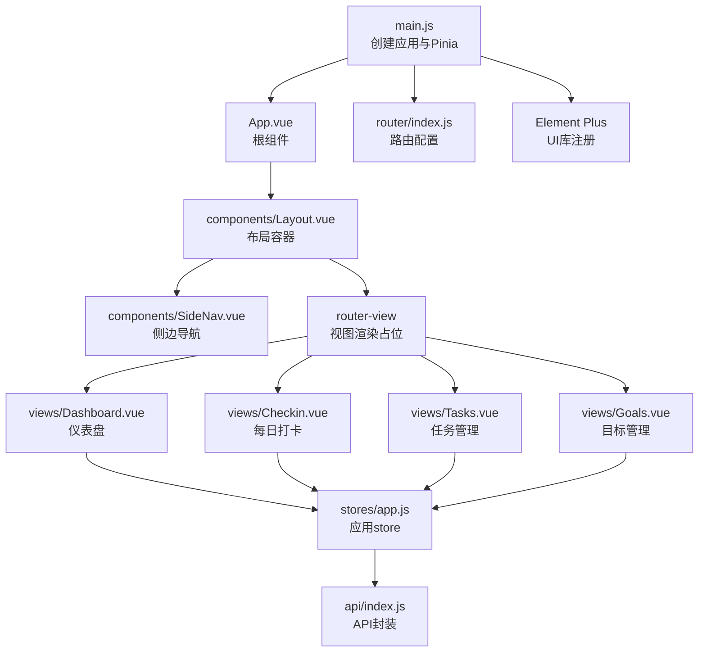
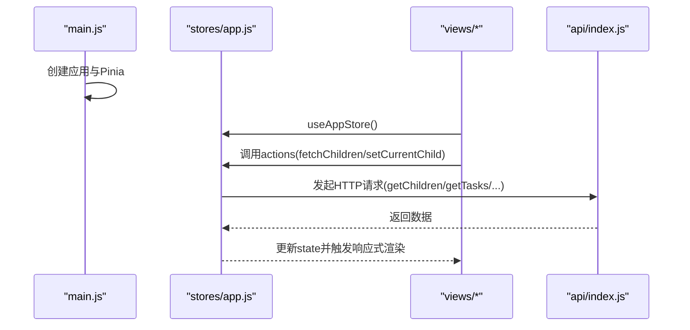
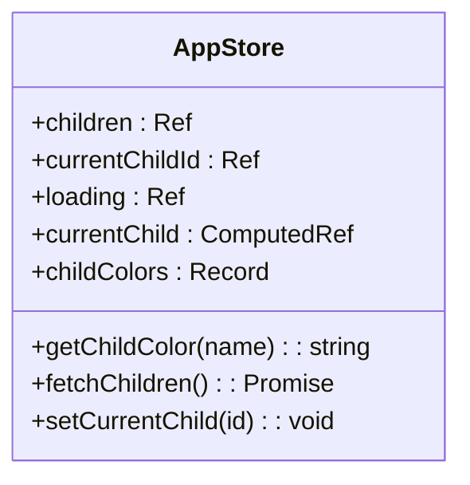
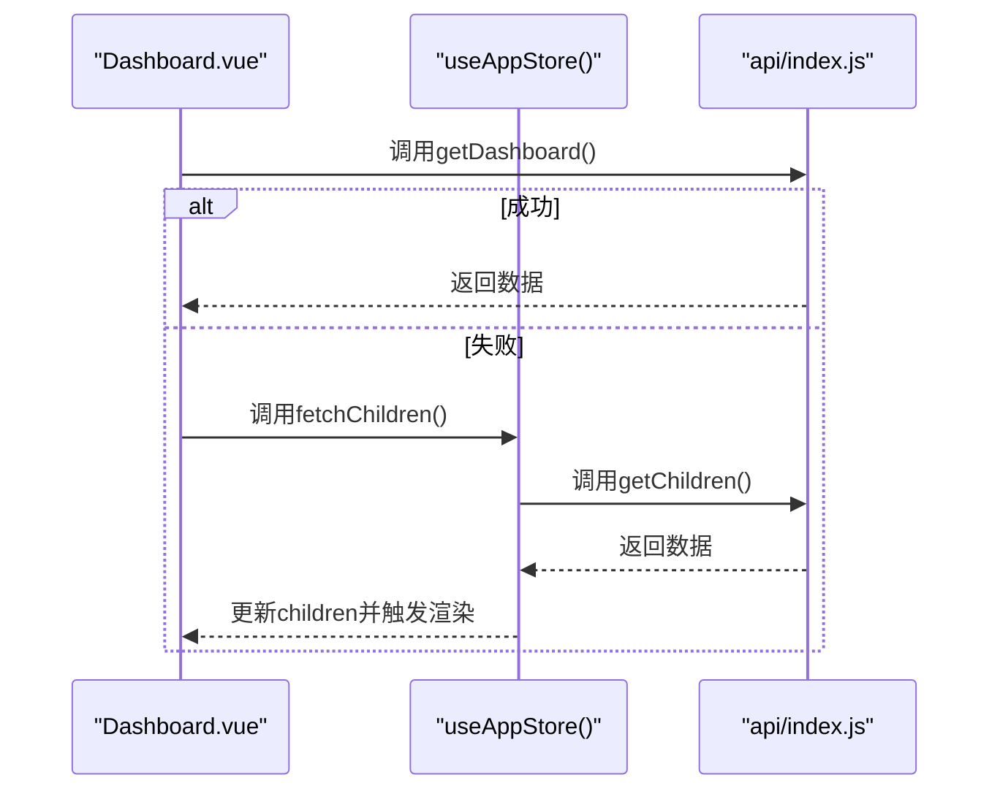
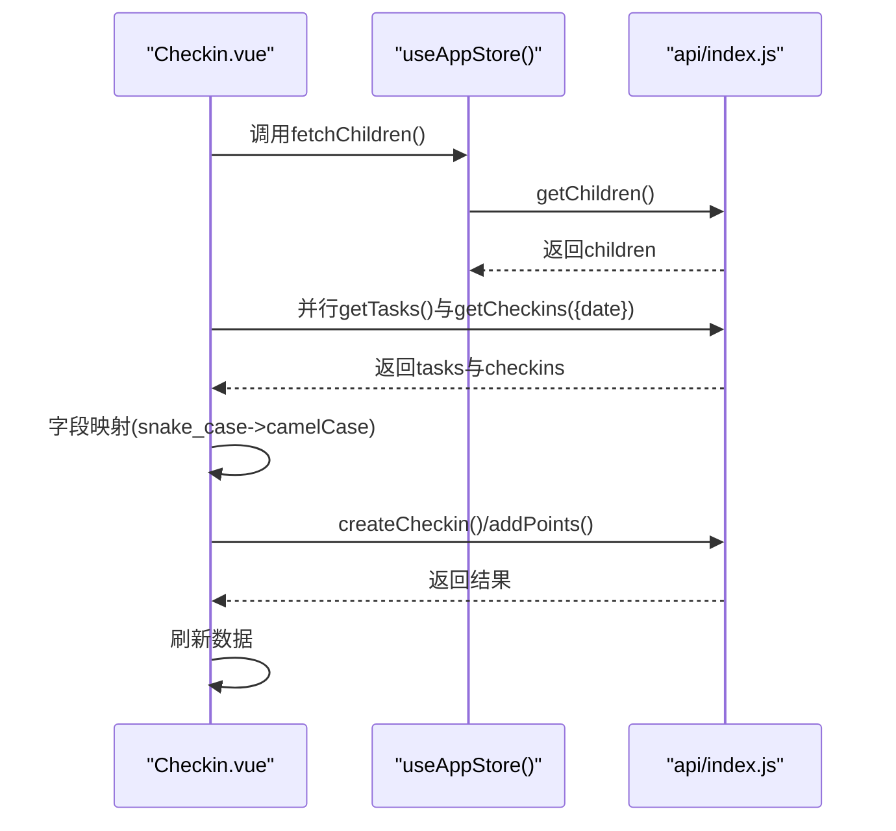
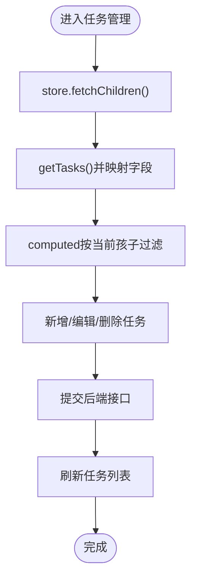
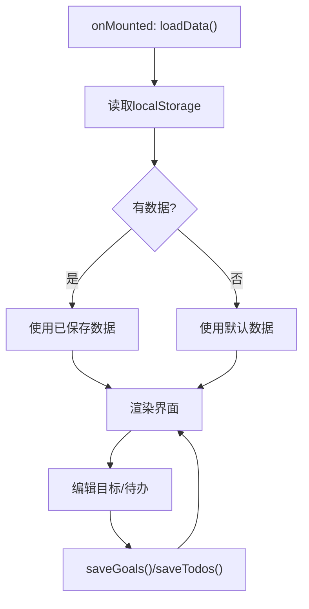
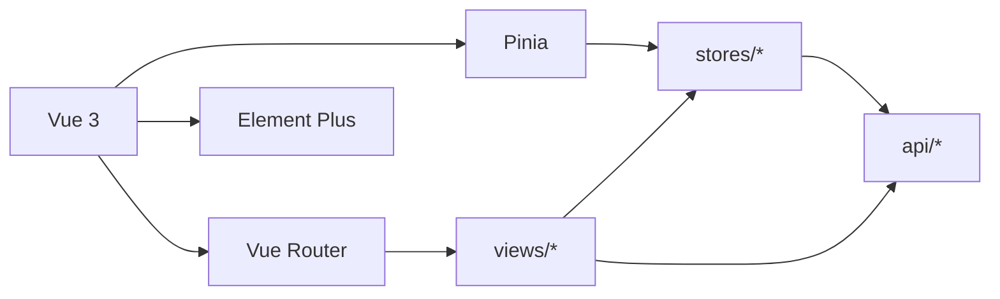

# 状态管理设计

<cite>
**本文引用的文件**
- [app.js](file://star-park/pc-admin/src/stores/app.js)
- [main.js](file://star-park/pc-admin/src/main.js)
- [App.vue](file://star-park/pc-admin/src/App.vue)
- [package.json](file://star-park/pc-admin/package.json)
- [router/index.js](file://star-park/pc-admin/src/router/index.js)
- [api/index.js](file://star-park/pc-admin/src/api/index.js)
- [components/Layout.vue](file://star-park/pc-admin/src/components/Layout.vue)
- [components/SideNav.vue](file://star-park/pc-admin/src/components/SideNav.vue)
- [views/Dashboard.vue](file://star-park/pc-admin/src/views/Dashboard.vue)
- [views/Checkin.vue](file://star-park/pc-admin/src/views/Checkin.vue)
- [views/Tasks.vue](file://star-park/pc-admin/src/views/Tasks.vue)
- [views/Goals.vue](file://star-park/pc-admin/src/views/Goals.vue)
</cite>

## 目录
1. [简介](#简介)
2. [项目结构](#项目结构)
3. [核心组件](#核心组件)
4. [架构总览](#架构总览)
5. [详细组件分析](#详细组件分析)
6. [依赖关系分析](#依赖关系分析)
7. [性能考量](#性能考量)
8. [故障排查指南](#故障排查指南)
9. [结论](#结论)
10. [附录](#附录)

## 简介
本文件面向StarParadise PC管理后台的状态管理设计，聚焦于Pinia在该前端项目中的使用方式与最佳实践。内容涵盖store定义、state状态管理、actions方法实现、getters计算属性；应用级状态管理设计（如用户认证状态、全局配置、数据缓存策略）；状态持久化机制、状态同步策略、跨组件状态共享模式；并提供性能优化技巧与调试方法。

## 项目结构
PC管理后台采用Vue 3 + Pinia + Vue Router + Element Plus的技术栈。应用通过在根实例中安装Pinia，使所有组件可通过组合式API访问store。路由负责页面级导航，布局组件负责侧边栏与主内容区的组织。API层封装Axios请求，统一处理响应格式与错误。

图表来源
- [main.js:1-22](file://star-park/pc-admin/src/main.js#L1-L22)
- [App.vue:1-10](file://star-park/pc-admin/src/App.vue#L1-L10)
- [router/index.js:1-67](file://star-park/pc-admin/src/router/index.js#L1-L67)
- [components/Layout.vue:1-29](file://star-park/pc-admin/src/components/Layout.vue#L1-L29)
- [components/SideNav.vue:1-132](file://star-park/pc-admin/src/components/SideNav.vue#L1-L132)
- [views/Dashboard.vue:1-146](file://star-park/pc-admin/src/views/Dashboard.vue#L1-L146)
- [views/Checkin.vue:1-417](file://star-park/pc-admin/src/views/Checkin.vue#L1-L417)
- [views/Tasks.vue:1-265](file://star-park/pc-admin/src/views/Tasks.vue#L1-L265)
- [views/Goals.vue:1-686](file://star-park/pc-admin/src/views/Goals.vue#L1-L686)
- [stores/app.js:1-62](file://star-park/pc-admin/src/stores/app.js#L1-L62)
- [api/index.js:1-56](file://star-park/pc-admin/src/api/index.js#L1-L56)

章节来源
- [main.js:1-22](file://star-park/pc-admin/src/main.js#L1-L22)
- [router/index.js:1-67](file://star-park/pc-admin/src/router/index.js#L1-L67)
- [components/Layout.vue:1-29](file://star-park/pc-admin/src/components/Layout.vue#L1-L29)
- [components/SideNav.vue:1-132](file://star-park/pc-admin/src/components/SideNav.vue#L1-L132)

## 核心组件
本项目仅定义了一个应用级store：app.js。它集中管理“孩子列表”、“当前选中的孩子ID”、“加载状态”等数据，并提供获取当前孩子信息的计算属性、获取颜色映射的方法、拉取孩子列表的异步动作以及设置当前孩子的动作。该store被多个视图组件共享使用，用于跨组件状态共享。

- store定义与导出：通过组合式API定义store，返回state、getters与actions。
- state状态管理：包含孩子列表、当前选中ID、加载状态等。
- getters计算属性：根据当前选中ID计算当前孩子对象。
- actions方法实现：异步获取孩子列表、设置当前孩子、颜色映射工具。
- 跨组件共享：各视图通过组合式API调用useAppStore()获取store实例。

章节来源
- [stores/app.js:1-62](file://star-park/pc-admin/src/stores/app.js#L1-L62)

## 架构总览
下图展示Pinia在应用中的装配与使用流程：应用启动时安装Pinia，随后各组件通过useAppStore()访问store；API层通过Axios封装HTTP请求；路由负责页面切换与标题设置。

图表来源
- [main.js:10-21](file://star-park/pc-admin/src/main.js#L10-L21)
- [stores/app.js:30-61](file://star-park/pc-admin/src/stores/app.js#L30-L61)
- [api/index.js:1-56](file://star-park/pc-admin/src/api/index.js#L1-L56)

## 详细组件分析

### 应用store（app.js）
- 数据结构与复杂度
  - children数组：读取O(n)查找当前孩子；插入/更新O(1)。
  - currentChildId：简单标量，读写O(1)。
  - loading：布尔标记，读写O(1)。
- 依赖链
  - 依赖：defineStore、ref、computed、getChildren。
  - 被依赖：各视图组件。
- 错误处理
  - 异步获取失败时打印错误日志，finally中关闭loading。
- 性能影响
  - 计算属性currentChild基于children与currentChildId，依赖稳定，计算成本低。
  - 颜色映射为常量表查询，O(1)。

图表来源
- [stores/app.js:5-61](file://star-park/pc-admin/src/stores/app.js#L5-L61)

章节来源
- [stores/app.js:1-62](file://star-park/pc-admin/src/stores/app.js#L1-L62)

### 视图组件与状态交互

#### 仪表盘（Dashboard.vue）
- 使用场景
  - 首次进入尝试获取仪表盘数据；若失败则回退到从store拉取孩子列表。
  - 展示孩子卡片与快捷操作。
- 关键交互
  - 本地computed优先使用接口返回数据，否则回退到store.children。
  - 调用store.fetchChildren()进行数据拉取。
- 性能注意
  - 本地dashboardData避免重复请求；loading控制骨架屏。

图表来源
- [views/Dashboard.vue:76-91](file://star-park/pc-admin/src/views/Dashboard.vue#L76-L91)
- [stores/app.js:30-44](file://star-park/pc-admin/src/stores/app.js#L30-L44)
- [api/index.js:44-45](file://star-park/pc-admin/src/api/index.js#L44-L45)

章节来源
- [views/Dashboard.vue:1-146](file://star-park/pc-admin/src/views/Dashboard.vue#L1-L146)

#### 每日打卡（Checkin.vue）
- 使用场景
  - 选择日期后并行拉取任务与打卡数据，映射字段后渲染。
  - 支持特殊积分奖励弹窗，提交后刷新数据。
- 关键交互
  - 并行Promise获取任务与打卡数据，映射字段兼容后端命名风格。
  - 通过store.fetchChildren()确保孩子列表可用。
- 性能注意
  - 并行请求减少总等待时间；字段映射在内存中完成，避免重复转换。

图表来源
- [views/Checkin.vue:160-221](file://star-park/pc-admin/src/views/Checkin.vue#L160-L221)
- [stores/app.js:30-44](file://star-park/pc-admin/src/stores/app.js#L30-L44)
- [api/index.js:22-29](file://star-park/pc-admin/src/api/index.js#L22-L29)
- [api/index.js:31-39](file://star-park/pc-admin/src/api/index.js#L31-L39)
- [api/index.js:52-54](file://star-park/pc-admin/src/api/index.js#L52-L54)

章节来源
- [views/Checkin.vue:1-417](file://star-park/pc-admin/src/views/Checkin.vue#L1-L417)

#### 任务管理（Tasks.vue）
- 使用场景
  - 以标签页按孩子维度筛选任务，支持新增/编辑/删除。
  - 通过store.children提供下拉选项。
- 关键交互
  - 本地tasks数组存储后端返回的任务列表，computed按当前选中孩子过滤。
  - 表单提交时将字段转换为后端期望的snake_case格式。
- 性能注意
  - 本地过滤computed在children稳定时高效；提交后统一刷新数据。

图表来源
- [views/Tasks.vue:203-230](file://star-park/pc-admin/src/views/Tasks.vue#L203-L230)
- [stores/app.js:30-44](file://star-park/pc-admin/src/stores/app.js#L30-L44)
- [api/index.js:24-28](file://star-park/pc-admin/src/api/index.js#L24-L28)

章节来源
- [views/Tasks.vue:1-265](file://star-park/pc-admin/src/views/Tasks.vue#L1-L265)

#### 目标管理（Goals.vue）
- 使用场景
  - 本地维护目标与待办列表，使用localStorage持久化。
  - 提供目标进度可视化与待办筛选。
- 关键交互
  - 本地状态：goals、todos、过滤器等。
  - 持久化：saveGoals/saveTodos写入localStorage；loadData读取。
- 性能注意
  - 本地状态适合小规模数据；默认数据来自代码，便于快速演示。

图表来源
- [views/Goals.vue:469-479](file://star-park/pc-admin/src/views/Goals.vue#L469-L479)
- [views/Goals.vue:461-467](file://star-park/pc-admin/src/views/Goals.vue#L461-L467)

章节来源
- [views/Goals.vue:1-686](file://star-park/pc-admin/src/views/Goals.vue#L1-L686)

### 路由与布局
- 路由配置：定义页面级路由与标题设置，在导航前钩子中动态设置document.title。
- 布局组件：Layout.vue包含SideNav与router-view，负责侧边菜单与主内容区。
- 侧边导航：SideNav.vue基于路由状态高亮当前菜单项。

章节来源
- [router/index.js:1-67](file://star-park/pc-admin/src/router/index.js#L1-L67)
- [components/Layout.vue:1-29](file://star-park/pc-admin/src/components/Layout.vue#L1-L29)
- [components/SideNav.vue:1-132](file://star-park/pc-admin/src/components/SideNav.vue#L1-L132)

## 依赖关系分析
- 技术栈依赖：Vue 3、Pinia、Vue Router、Element Plus、Axios、dayjs。
- 组件耦合：视图组件对store存在直接依赖；store对API层存在间接依赖。
- 外部依赖：Axios用于HTTP请求；Element Plus提供UI组件与图标。

图表来源
- [package.json:11-19](file://star-park/pc-admin/package.json#L11-L19)
- [main.js:1-22](file://star-park/pc-admin/src/main.js#L1-L22)
- [stores/app.js:1-62](file://star-park/pc-admin/src/stores/app.js#L1-L62)
- [api/index.js:1-56](file://star-park/pc-admin/src/api/index.js#L1-L56)

章节来源
- [package.json:1-26](file://star-park/pc-admin/package.json#L1-L26)
- [main.js:1-22](file://star-park/pc-admin/src/main.js#L1-L22)

## 性能考量
- 响应式与计算属性
  - 使用computed进行派生数据计算，避免重复计算与冗余渲染。
- 并行请求
  - 在Checkin.vue中对任务与打卡数据采用Promise.all并行获取，缩短首屏等待时间。
- 本地缓存与懒加载
  - Goals.vue使用localStorage进行轻量持久化；Dashboard.vue在失败时回退到store数据，避免空渲染。
- 渲染优化
  - Element Plus组件按需使用，避免不必要的全局样式引入。
- 网络层优化
  - Axios统一拦截器处理响应数据与错误，减少重复样板代码。

## 故障排查指南
- API错误处理
  - 响应拦截器统一返回data，错误时打印日志并reject，便于上层捕获。
- 控制台日志
  - store与视图组件在异常路径打印错误信息，便于定位问题。
- 状态检查
  - 在组件中打印store.state与computed结果，确认数据流向正确。
- 调试建议
  - 使用浏览器开发者工具的Vue DevTools查看store状态变化。
  - 在网络面板观察请求与响应，确认字段映射与接口返回一致。

章节来源
- [api/index.js:12-19](file://star-park/pc-admin/src/api/index.js#L12-L19)
- [stores/app.js:39-40](file://star-park/pc-admin/src/stores/app.js#L39-L40)
- [views/Dashboard.vue:81-83](file://star-park/pc-admin/src/views/Dashboard.vue#L81-L83)
- [views/Checkin.vue:190-192](file://star-park/pc-admin/src/views/Checkin.vue#L190-L192)

## 结论
本项目采用Pinia进行应用级状态管理，通过单一store集中管理“孩子列表”等全局数据，并结合组合式API在各视图中实现跨组件共享。配合Axios封装与路由配置，形成清晰的数据流与渲染链路。Goals.vue展示了本地持久化的可行方案，Dashboard.vue与Checkin.vue体现了错误回退与并行请求的优化策略。整体设计简洁、可维护性强，适合中小型管理后台场景。

## 附录
- 最佳实践清单
  - 将全局共享状态收敛至store，避免分散在组件内部。
  - 使用computed进行派生数据，减少重复计算。
  - 对并发请求使用Promise.all提升首屏性能。
  - 对轻量数据采用localStorage持久化，复杂业务考虑服务端存储。
  - 在actions中统一处理错误与loading状态，保持UI一致性。
- 性能优化建议
  - 对大列表使用虚拟滚动或分页。
  - 避免在模板中执行复杂计算，尽量在computed中完成。
  - 合理拆分store模块，降低单个store体积与订阅范围。
- 调试方法
  - 使用浏览器Vue DevTools观察store状态与变更历史。
  - 在关键节点打印日志，追踪数据流向。
  - 使用网络面板验证请求参数与响应格式。