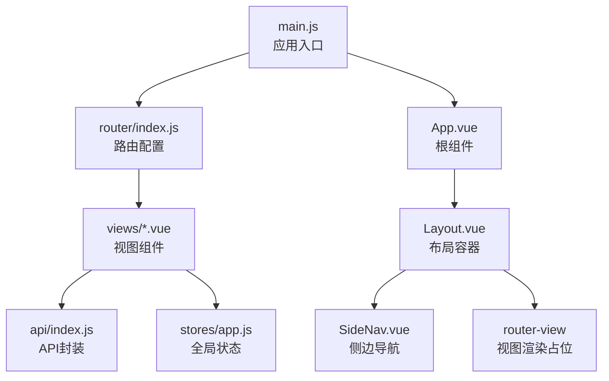
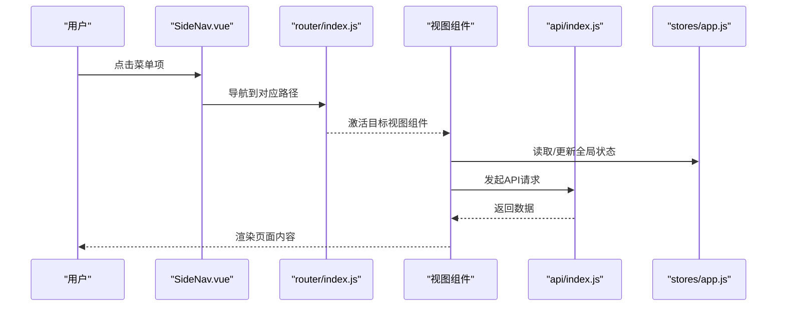
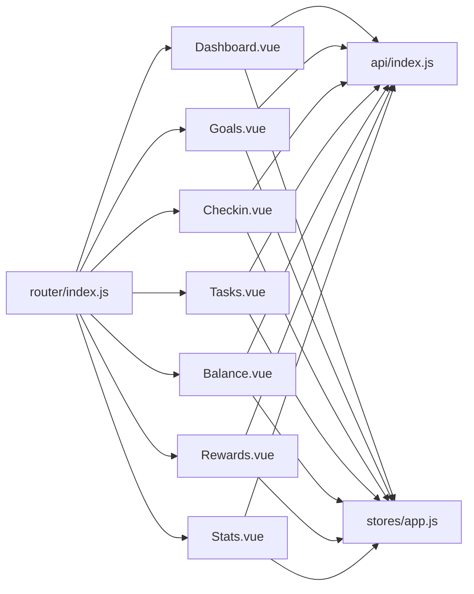

# 路由系统设计

<cite>
**本文档引用的文件**
- [router/index.js](file://star-park/pc-admin/src/router/index.js)
- [main.js](file://star-park/pc-admin/src/main.js)
- [App.vue](file://star-park/pc-admin/src/App.vue)
- [Layout.vue](file://star-park/pc-admin/src/components/Layout.vue)
- [SideNav.vue](file://star-park/pc-admin/src/components/SideNav.vue)
- [Dashboard.vue](file://star-park/pc-admin/src/views/Dashboard.vue)
- [Tasks.vue](file://star-park/pc-admin/src/views/Tasks.vue)
- [Checkin.vue](file://star-park/pc-admin/src/views/Checkin.vue)
- [Goals.vue](file://star-park/pc-admin/src/views/Goals.vue)
- [Rewards.vue](file://star-park/pc-admin/src/views/Rewards.vue)
- [Stats.vue](file://star-park/pc-admin/src/views/Stats.vue)
- [Balance.vue](file://star-park/pc-admin/src/views/Balance.vue)
- [ChildCard.vue](file://star-park/pc-admin/src/components/ChildCard.vue)
- [stores/app.js](file://star-park/pc-admin/src/stores/app.js)
- [api/index.js](file://star-park/pc-admin/src/api/index.js)
</cite>

## 目录
1. [简介](#简介)
2. [项目结构](#项目结构)
3. [核心组件](#核心组件)
4. [架构总览](#架构总览)
5. [详细组件分析](#详细组件分析)
6. [依赖分析](#依赖分析)
7. [性能考虑](#性能考虑)
8. [故障排除指南](#故障排除指南)
9. [结论](#结论)

## 简介
本文件面向StarParadise PC管理后台的前端路由系统，基于Vue Router进行设计与实现。文档围绕以下主题展开：
- 路由配置与嵌套路由结构
- 导航守卫与页面标题设置
- 视图组件与路由的映射关系
- 路由懒加载与性能优化
- 权限控制与面包屑导航设计
- 路由跳转最佳实践与常见问题

## 项目结构
PC管理后台采用单页应用（SPA）架构，通过Vue Router实现页面切换；应用通过主入口挂载路由实例，并在布局组件中渲染侧边栏与主内容区。

图表来源
- [main.js:1-22](file://star-park/pc-admin/src/main.js#L1-L22)
- [router/index.js:1-67](file://star-park/pc-admin/src/router/index.js#L1-L67)
- [App.vue:1-10](file://star-park/pc-admin/src/App.vue#L1-L10)
- [Layout.vue:1-29](file://star-park/pc-admin/src/components/Layout.vue#L1-L29)
- [SideNav.vue:1-132](file://star-park/pc-admin/src/components/SideNav.vue#L1-L132)
- [api/index.js:1-56](file://star-park/pc-admin/src/api/index.js#L1-L56)
- [stores/app.js:1-62](file://star-park/pc-admin/src/stores/app.js#L1-L62)

章节来源
- [main.js:1-22](file://star-park/pc-admin/src/main.js#L1-L22)
- [router/index.js:1-67](file://star-park/pc-admin/src/router/index.js#L1-L67)
- [App.vue:1-10](file://star-park/pc-admin/src/App.vue#L1-L10)
- [Layout.vue:1-29](file://star-park/pc-admin/src/components/Layout.vue#L1-L29)
- [SideNav.vue:1-132](file://star-park/pc-admin/src/components/SideNav.vue#L1-L132)

## 核心组件
- 路由配置与导航守卫
  - 使用history模式创建路由器，定义嵌套路由，包含仪表盘、任务管理、每日打卡、目标管理、奖励管理、数据统计、积分记录等页面。
  - 在导航守卫中统一设置页面标题，确保每个视图的浏览器标题一致。
- 布局与侧边导航
  - Layout负责整体布局与主内容区渲染；SideNav提供菜单项与活动态样式，菜单项来源于路由meta信息与本地配置。
- 视图组件
  - 各页面组件通过懒加载方式按需加载，减少首屏体积；组件内部通过API封装与全局状态管理进行数据交互。

章节来源
- [router/index.js:1-67](file://star-park/pc-admin/src/router/index.js#L1-L67)
- [Layout.vue:1-29](file://star-park/pc-admin/src/components/Layout.vue#L1-L29)
- [SideNav.vue:1-132](file://star-park/pc-admin/src/components/SideNav.vue#L1-L132)

## 架构总览
下图展示了路由到视图组件的整体调用链路，以及与API与状态管理的交互。

图表来源
- [SideNav.vue:8-17](file://star-park/pc-admin/src/components/SideNav.vue#L8-L17)
- [router/index.js:4-54](file://star-park/pc-admin/src/router/index.js#L4-L54)
- [api/index.js:21-56](file://star-park/pc-admin/src/api/index.js#L21-L56)
- [stores/app.js:31-44](file://star-park/pc-admin/src/stores/app.js#L31-L44)

## 详细组件分析

### 路由配置与导航守卫
- 嵌套路由结构
  - 根路径“/”作为布局容器，children数组内定义各子路由，每个子路由均通过动态导入实现懒加载。
  - 子路由包含：仪表盘、目标管理、每日打卡、任务管理、积分记录、奖励管理、数据统计。
- 导航守卫
  - beforeEach中根据路由meta.title动态设置页面标题，确保用户体验一致。
- 路由懒加载
  - 所有视图组件均通过函数返回import()实现按需加载，降低首屏资源压力。

章节来源
- [router/index.js:4-67](file://star-park/pc-admin/src/router/index.js#L4-L67)

### 视图组件与路由映射
- 仪表盘（/dashboard）
  - 路由名称：Dashboard；组件：Dashboard.vue；元信息：标题“仪表盘”，图标DataBoard。
  - 页面包含快捷操作按钮，支持跳转至打卡、任务管理、奖励管理、统计分析。
- 目标管理（/goals）
  - 路由名称：Goals；组件：Goals.vue；元信息：标题“目标管理”，图标Target。
  - 页面包含年度目标与待办任务管理，支持本地持久化。
- 每日打卡（/checkin）
  - 路由名称：Checkin；组件：Checkin.vue；元信息：标题“每日打卡”，图标Calendar。
  - 支持按日期筛选、任务完成与特殊积分奖励。
- 任务管理（/tasks）
  - 路由名称：Tasks；组件：Tasks.vue；元信息：标题“任务管理”，图标List。
  - 支持按孩子筛选、任务增删改查。
- 积分记录（/balance）
  - 路由名称：Balance；组件：Balance.vue；元信息：标题“积分记录”，图标Wallet。
  - 支持按孩子筛选余额与交易流水。
- 奖励管理（/rewards）
  - 路由名称：Rewards；组件：Rewards.vue；元信息：标题“奖励管理”，图标Present。
  - 支持奖励目标设定、进度展示与兑换。
- 数据统计（/stats）
  - 路由名称：Stats；组件：Stats.vue；元信息：标题“数据统计”，图标TrendCharts。
  - 展示热力图与完成率趋势图。

章节来源
- [router/index.js:10-51](file://star-park/pc-admin/src/router/index.js#L10-L51)
- [Dashboard.vue:22-38](file://star-park/pc-admin/src/views/Dashboard.vue#L22-L38)
- [Goals.vue:8-46](file://star-park/pc-admin/src/views/Goals.vue#L8-L46)
- [Checkin.vue:1-417](file://star-park/pc-admin/src/views/Checkin.vue#L1-L417)
- [Tasks.vue:1-265](file://star-park/pc-admin/src/views/Tasks.vue#L1-L265)
- [Balance.vue:1-173](file://star-park/pc-admin/src/views/Balance.vue#L1-L173)
- [Rewards.vue:1-471](file://star-park/pc-admin/src/views/Rewards.vue#L1-L471)
- [Stats.vue:1-291](file://star-park/pc-admin/src/views/Stats.vue#L1-L291)

### 导航守卫与页面标题
- beforeEach守卫会读取路由meta.title并设置document.title，确保页面标题与菜单项一致。
- 该策略提升了用户对当前页面的认知，便于多标签页浏览。

章节来源
- [router/index.js:61-64](file://star-park/pc-admin/src/router/index.js#L61-L64)

### 侧边导航与面包屑设计
- 侧边导航
  - SideNav通过v-for遍历菜单项，结合useRoute判断当前激活路径，动态高亮对应菜单。
  - 菜单项来源于路由meta与本地配置，支持隐藏属性（如积分记录）。
- 面包屑导航
  - 当前代码未实现专用的面包屑组件；建议在Layout中引入面包屑组件，根据$route.matched动态生成层级路径，提升导航体验。

章节来源
- [SideNav.vue:31-47](file://star-park/pc-admin/src/components/SideNav.vue#L31-L47)
- [Layout.vue:5](file://star-park/pc-admin/src/components/Layout.vue#L5)

### 动态路由参数处理
- 当前路由系统未使用动态参数（如:id），但可通过扩展支持：
  - 在路由表中定义param字段，如children/{id}。
  - 在视图组件中通过$router.params或useRoute().params读取参数。
  - 结合全局状态store进行数据预取与缓存。

[本节为概念性说明，不直接分析具体文件，故无章节来源]

### 权限控制实现
- 当前路由未实现权限守卫；建议在beforeEach中加入鉴权逻辑：
  - 读取用户状态（如token或角色），对未授权访问进行拦截并重定向至登录页。
  - 对不同角色开放特定菜单与路由，避免越权访问。

[本节为概念性说明，不直接分析具体文件，故无章节来源]

### 路由懒加载机制
- 所有视图组件通过动态导入实现懒加载，减少首屏加载时间。
- 建议配合webpack的魔法注释进行代码分割命名，便于调试与性能分析。

章节来源
- [router/index.js:13](file://star-park/pc-admin/src/router/index.js#L13)
- [router/index.js:19](file://star-park/pc-admin/src/router/index.js#L19)
- [router/index.js:25](file://star-park/pc-admin/src/router/index.js#L25)
- [router/index.js:31](file://star-park/pc-admin/src/router/index.js#L31)
- [router/index.js:37](file://star-park/pc-admin/src/router/index.js#L37)
- [router/index.js:43](file://star-park/pc-admin/src/router/index.js#L43)
- [router/index.js:49](file://star-park/pc-admin/src/router/index.js#L49)

### 路由跳转最佳实践
- 使用router-link替代a标签，保持SPA导航一致性。
- 在组件内部使用编程式导航时，优先使用相对路径或具名路由，避免硬编码绝对路径。
- 对于跨组件跳转，建议通过事件或状态管理触发，而非直接在子组件中注入router。

章节来源
- [SideNav.vue:8-17](file://star-park/pc-admin/src/components/SideNav.vue#L8-L17)
- [Dashboard.vue:22-38](file://star-park/pc-admin/src/views/Dashboard.vue#L22-L38)
- [ChildCard.vue:78-80](file://star-park/pc-admin/src/components/ChildCard.vue#L78-L80)

### API与状态集成
- API封装
  - 通过axios创建实例，统一设置baseURL、超时与响应拦截，简化各组件调用。
- 全局状态
  - Pinia Store提供children列表与当前选中孩子，视图组件通过store.fetchChildren初始化数据。

章节来源
- [api/index.js:4-19](file://star-park/pc-admin/src/api/index.js#L4-L19)
- [stores/app.js:31-44](file://star-park/pc-admin/src/stores/app.js#L31-L44)

## 依赖分析
- 组件耦合关系
  - Layout与SideNav强耦合（菜单项与路由路径一致），修改路由需同步更新菜单。
  - 视图组件依赖API封装与全局状态，形成清晰的数据流。
- 外部依赖
  - Vue Router用于路由管理；Element Plus用于UI组件库；ECharts用于统计图表渲染。

图表来源
- [router/index.js:4-54](file://star-park/pc-admin/src/router/index.js#L4-L54)
- [Dashboard.vue:46](file://star-park/pc-admin/src/views/Dashboard.vue#L46)
- [Goals.vue:198](file://star-park/pc-admin/src/views/Goals.vue#L198)
- [Checkin.vue:118](file://star-park/pc-admin/src/views/Checkin.vue#L118)
- [Tasks.vue:102](file://star-park/pc-admin/src/views/Tasks.vue#L102)
- [Balance.vue:60](file://star-park/pc-admin/src/views/Balance.vue#L60)
- [Rewards.vue:151](file://star-park/pc-admin/src/views/Rewards.vue#L151)
- [Stats.vue:44](file://star-park/pc-admin/src/views/Stats.vue#L44)
- [api/index.js:21-56](file://star-park/pc-admin/src/api/index.js#L21-L56)
- [stores/app.js:1-62](file://star-park/pc-admin/src/stores/app.js#L1-L62)

## 性能考虑
- 路由懒加载
  - 通过动态导入实现按需加载，显著降低首屏体积。
- 图表渲染
  - 统计页面使用ECharts，应在窗口尺寸变化时及时resize，避免图表变形。
- 数据获取
  - 使用Promise.all并发获取多个接口数据，缩短等待时间；同时注意错误处理与loading状态。

章节来源
- [Stats.vue:245-248](file://star-park/pc-admin/src/views/Stats.vue#L245-L248)
- [Checkin.vue:163-166](file://star-park/pc-admin/src/views/Checkin.vue#L163-L166)
- [Rewards.vue:303-329](file://star-park/pc-admin/src/views/Rewards.vue#L303-L329)

## 故障排除指南
- 页面标题未更新
  - 检查导航守卫是否正确设置meta.title；确认beforeEach执行顺序。
- 路由跳转无效
  - 确认router-link的to属性与路由path一致；避免硬编码绝对路径。
- 图表显示异常
  - 确保在mounted中初始化图表，在onBeforeUnmount中释放资源；监听window.resize事件。
- 数据为空或加载缓慢
  - 检查API拦截器与响应格式；确认并发请求与loading状态设置。

章节来源
- [router/index.js:61-64](file://star-park/pc-admin/src/router/index.js#L61-L64)
- [Stats.vue:259-263](file://star-park/pc-admin/src/views/Stats.vue#L259-L263)
- [api/index.js:13-19](file://star-park/pc-admin/src/api/index.js#L13-L19)

## 结论
StarParadise PC管理后台的路由系统以Vue Router为核心，采用嵌套路由与懒加载策略，结合全局状态与API封装，实现了清晰的页面组织与良好的用户体验。建议后续增强权限控制、完善面包屑导航，并对动态参数与路由守卫进行扩展，以满足更复杂的业务场景。