# 前端架构设计

<cite>
**本文档引用的文件**
- [star-park/pc-admin/src/main.js](file://star-park/pc-admin/src/main.js)
- [star-park/miniprogram/src/main.js](file://star-park/miniprogram/src/main.js)
- [star-park/pc-admin/src/App.vue](file://star-park/pc-admin/src/App.vue)
- [star-park/miniprogram/src/App.vue](file://star-park/miniprogram/src/App.vue)
- [star-park/pc-admin/src/router/index.js](file://star-park/pc-admin/src/router/index.js)
- [star-park/miniprogram/src/pages.json](file://star-park/miniprogram/src/pages.json)
- [star-park/pc-admin/src/components/Layout.vue](file://star-park/pc-admin/src/components/Layout.vue)
- [star-park/pc-admin/src/components/SideNav.vue](file://star-park/pc-admin/src/components/SideNav.vue)
- [star-park/pc-admin/src/components/ChildCard.vue](file://star-park/pc-admin/src/components/ChildCard.vue)
- [star-park/miniprogram/src/components/ChildCard.vue](file://star-park/miniprogram/src/components/ChildCard.vue)
- [star-park/pc-admin/src/stores/app.js](file://star-park/pc-admin/src/stores/app.js)
- [star-park/pc-admin/src/api/index.js](file://star-park/pc-admin/src/api/index.js)
- [star-park/miniprogram/src/api/index.js](file://star-park/miniprogram/src/api/index.js)
- [star-park/pc-admin/src/views/Dashboard.vue](file://star-park/pc-admin/src/views/Dashboard.vue)
- [star-park/pc-admin/vite.config.js](file://star-park/pc-admin/vite.config.js)
- [star-park/miniprogram/vite.config.js](file://star-park/miniprogram/vite.config.js)
- [star-park/pc-admin/package.json](file://star-park/pc-admin/package.json)
- [star-park/miniprogram/package.json](file://star-park/miniprogram/package.json)
</cite>

## 目录
1. [引言](#引言)
2. [项目结构](#项目结构)
3. [核心组件](#核心组件)
4. [架构总览](#架构总览)
5. [详细组件分析](#详细组件分析)
6. [依赖分析](#依赖分析)
7. [性能考虑](#性能考虑)
8. [故障排查指南](#故障排查指南)
9. [结论](#结论)
10. [附录](#附录)

## 引言
本设计文档面向 StarParadise 的前端架构，系统性阐述 PC 管理后台（基于 Vue 3 + Element Plus）与小程序端（基于 uni-app）的双前端架构设计。文档从分层架构视角解析入口文件、页面视图、组件、路由、状态管理等模块的组织方式，梳理模块间依赖关系、数据流向与组件复用策略，并给出响应式设计原则、跨平台适配方案、性能优化策略与用户体验设计建议。

## 项目结构
双前端采用“功能域+层次化”组织方式：
- PC 管理后台
  - 入口与应用：main.js、App.vue
  - 路由：router/index.js
  - 视图：views 下各页面
  - 组件：components 下布局与业务组件
  - 状态管理：stores 下 Pinia Store
  - API 封装：api/index.js
  - 构建配置：vite.config.js、package.json
- 小程序端（uni-app）
  - 入口与应用：main.js、App.vue
  - 页面配置：pages.json
  - 组件：components 下业务组件
  - API 封装：api/index.js
  - 构建配置：vite.config.js、package.json

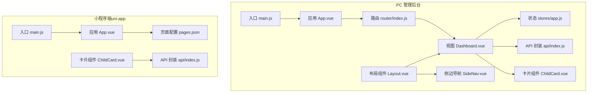

图表来源
- [star-park/pc-admin/src/main.js:1-22](file://star-park/pc-admin/src/main.js#L1-L22)
- [star-park/pc-admin/src/App.vue:1-10](file://star-park/pc-admin/src/App.vue#L1-L10)
- [star-park/pc-admin/src/router/index.js:1-67](file://star-park/pc-admin/src/router/index.js#L1-L67)
- [star-park/pc-admin/src/components/Layout.vue:1-29](file://star-park/pc-admin/src/components/Layout.vue#L1-L29)
- [star-park/pc-admin/src/components/SideNav.vue:1-132](file://star-park/pc-admin/src/components/SideNav.vue#L1-L132)
- [star-park/pc-admin/src/components/ChildCard.vue:1-161](file://star-park/pc-admin/src/components/ChildCard.vue#L1-L161)
- [star-park/pc-admin/src/stores/app.js:1-62](file://star-park/pc-admin/src/stores/app.js#L1-L62)
- [star-park/pc-admin/src/api/index.js:1-56](file://star-park/pc-admin/src/api/index.js#L1-L56)
- [star-park/pc-admin/src/views/Dashboard.vue:1-146](file://star-park/pc-admin/src/views/Dashboard.vue#L1-L146)
- [star-park/miniprogram/src/main.js:1-8](file://star-park/miniprogram/src/main.js#L1-L8)
- [star-park/miniprogram/src/App.vue:1-26](file://star-park/miniprogram/src/App.vue#L1-L26)
- [star-park/miniprogram/src/pages.json:1-54](file://star-park/miniprogram/src/pages.json#L1-L54)
- [star-park/miniprogram/src/api/index.js:1-75](file://star-park/miniprogram/src/api/index.js#L1-L75)
- [star-park/miniprogram/src/components/ChildCard.vue:1-162](file://star-park/miniprogram/src/components/ChildCard.vue#L1-L162)

章节来源
- [star-park/pc-admin/src/main.js:1-22](file://star-park/pc-admin/src/main.js#L1-L22)
- [star-park/miniprogram/src/main.js:1-8](file://star-park/miniprogram/src/main.js#L1-L8)
- [star-park/pc-admin/src/App.vue:1-10](file://star-park/pc-admin/src/App.vue#L1-L10)
- [star-park/miniprogram/src/App.vue:1-26](file://star-park/miniprogram/src/App.vue#L1-L26)
- [star-park/pc-admin/src/router/index.js:1-67](file://star-park/pc-admin/src/router/index.js#L1-L67)
- [star-park/miniprogram/src/pages.json:1-54](file://star-park/miniprogram/src/pages.json#L1-L54)

## 核心组件
- 应用入口与初始化
  - PC 端在入口中注册 Pinia、路由、Element Plus，并挂载应用；图标按需注册以减少体积。
  - 小程序端遵循 uni-app SSR 入口规范，导出 createApp 工厂函数。
- 应用根组件
  - PC 端根组件通过路由视图承载页面内容。
  - 小程序端根组件声明生命周期钩子与全局样式。
- 路由与页面
  - PC 端使用 vue-router，采用嵌套路由与动态导入实现页面级懒加载。
  - 小程序端使用 pages.json 声明页面与 tabbar，统一设置导航栏标题与主题色。
- 组件体系
  - 布局组件：PC 端提供侧边导航与主内容区布局；小程序端卡片组件承担主要展示。
  - 业务组件：ChildCard 在两端复用，但实现细节适配各自框架。
- 状态管理
  - PC 端使用 Pinia 定义应用状态（如孩子列表、当前选中孩子、加载状态等），集中管理跨页面共享数据。
- API 封装
  - PC 端使用 axios 并配置响应拦截器，统一处理返回数据与错误。
  - 小程序端封装 uni.request，区分 H5 与小程序环境的 baseURL，并统一封装错误提示。

章节来源
- [star-park/pc-admin/src/main.js:1-22](file://star-park/pc-admin/src/main.js#L1-L22)
- [star-park/miniprogram/src/main.js:1-8](file://star-park/miniprogram/src/main.js#L1-L8)
- [star-park/pc-admin/src/App.vue:1-10](file://star-park/pc-admin/src/App.vue#L1-L10)
- [star-park/miniprogram/src/App.vue:1-26](file://star-park/miniprogram/src/App.vue#L1-L26)
- [star-park/pc-admin/src/router/index.js:1-67](file://star-park/pc-admin/src/router/index.js#L1-L67)
- [star-park/miniprogram/src/pages.json:1-54](file://star-park/miniprogram/src/pages.json#L1-L54)
- [star-park/pc-admin/src/components/Layout.vue:1-29](file://star-park/pc-admin/src/components/Layout.vue#L1-L29)
- [star-park/pc-admin/src/components/SideNav.vue:1-132](file://star-park/pc-admin/src/components/SideNav.vue#L1-L132)
- [star-park/pc-admin/src/components/ChildCard.vue:1-161](file://star-park/pc-admin/src/components/ChildCard.vue#L1-L161)
- [star-park/miniprogram/src/components/ChildCard.vue:1-162](file://star-park/miniprogram/src/components/ChildCard.vue#L1-L162)
- [star-park/pc-admin/src/stores/app.js:1-62](file://star-park/pc-admin/src/stores/app.js#L1-L62)
- [star-park/pc-admin/src/api/index.js:1-56](file://star-park/pc-admin/src/api/index.js#L1-L56)
- [star-park/miniprogram/src/api/index.js:1-75](file://star-park/miniprogram/src/api/index.js#L1-L75)

## 架构总览
双前端架构采用“同构逻辑、异构实现”的设计思路：
- 逻辑层：API 接口、状态管理、页面视图在两端保持一致或语义一致。
- 展示层：PC 端使用 Element Plus 组件库与桌面端交互风格；小程序端使用原生小程序组件与移动端交互风格。
- 数据流：视图组件通过 API 层调用后端接口，状态通过 Pinia Store 集中管理，路由驱动页面切换。
- 跨平台适配：通过条件判断与不同构建配置实现 H5 与小程序环境的差异化处理。

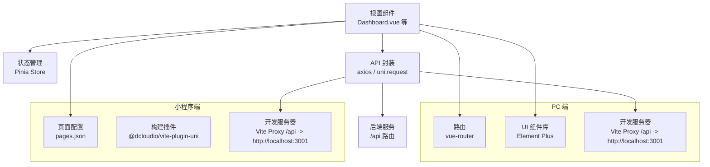

图表来源
- [star-park/pc-admin/src/views/Dashboard.vue:1-146](file://star-park/pc-admin/src/views/Dashboard.vue#L1-L146)
- [star-park/pc-admin/src/stores/app.js:1-62](file://star-park/pc-admin/src/stores/app.js#L1-L62)
- [star-park/pc-admin/src/api/index.js:1-56](file://star-park/pc-admin/src/api/index.js#L1-L56)
- [star-park/miniprogram/src/api/index.js:1-75](file://star-park/miniprogram/src/api/index.js#L1-L75)
- [star-park/pc-admin/src/router/index.js:1-67](file://star-park/pc-admin/src/router/index.js#L1-L67)
- [star-park/miniprogram/src/pages.json:1-54](file://star-park/miniprogram/src/pages.json#L1-L54)
- [star-park/pc-admin/vite.config.js:1-19](file://star-park/pc-admin/vite.config.js#L1-L19)
- [star-park/miniprogram/vite.config.js:1-17](file://star-park/miniprogram/vite.config.js#L1-L17)

## 详细组件分析

### PC 管理后台入口与应用
- 初始化流程
  - 创建 Vue 应用实例，注册 Pinia、路由、Element Plus。
  - 动态注册 Element Plus 图标，避免全量引入。
  - 挂载到 DOM。
- 设计要点
  - 单一职责：仅负责应用初始化与全局插件注册。
  - 可扩展性：后续可在此注入权限中间件、国际化等。

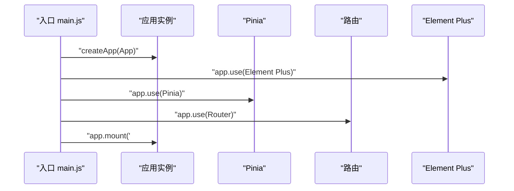

图表来源
- [star-park/pc-admin/src/main.js:1-22](file://star-park/pc-admin/src/main.js#L1-L22)

章节来源
- [star-park/pc-admin/src/main.js:1-22](file://star-park/pc-admin/src/main.js#L1-L22)

### 小程序端入口与应用
- 初始化流程
  - 遵循 uni-app 规范导出 createApp 工厂函数，返回 SSR App 实例。
  - 根组件声明生命周期钩子（启动、显示、隐藏）与全局样式。
- 设计要点
  - 适配多端：通过工厂函数支持 H5 与小程序运行时差异。
  - 样式隔离：全局样式通过 App.vue 统一注入。

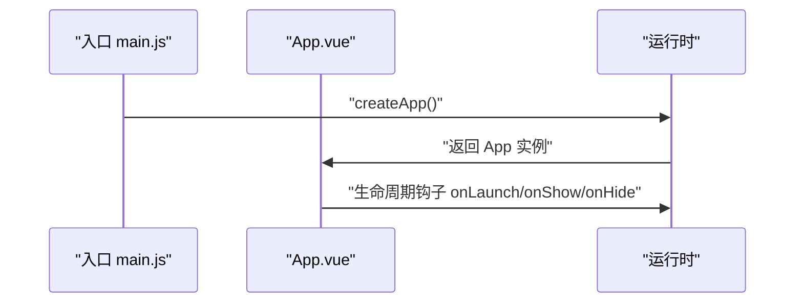

图表来源
- [star-park/miniprogram/src/main.js:1-8](file://star-park/miniprogram/src/main.js#L1-L8)
- [star-park/miniprogram/src/App.vue:1-26](file://star-park/miniprogram/src/App.vue#L1-L26)

章节来源
- [star-park/miniprogram/src/main.js:1-8](file://star-park/miniprogram/src/main.js#L1-L8)
- [star-park/miniprogram/src/App.vue:1-26](file://star-park/miniprogram/src/App.vue#L1-L26)

### 路由与页面组织（PC 端）
- 路由设计
  - 使用 history 模式与嵌套路由，根路由指向 Layout，子路由为各功能页。
  - 路由守卫设置页面标题，提升可访问性。
  - 子路由采用动态导入，实现按需加载与代码分割。
- 页面组织
  - views 下按功能划分页面，Dashboard 作为默认入口。
  - 通过 Layout 组织侧边导航与主内容区，实现统一布局。

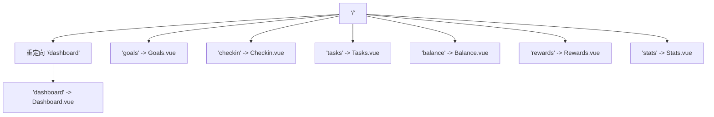

图表来源
- [star-park/pc-admin/src/router/index.js:1-67](file://star-park/pc-admin/src/router/index.js#L1-L67)
- [star-park/pc-admin/src/components/Layout.vue:1-29](file://star-park/pc-admin/src/components/Layout.vue#L1-L29)

章节来源
- [star-park/pc-admin/src/router/index.js:1-67](file://star-park/pc-admin/src/router/index.js#L1-L67)
- [star-park/pc-admin/src/components/Layout.vue:1-29](file://star-park/pc-admin/src/components/Layout.vue#L1-L29)

### 页面配置（小程序端）
- 页面与 Tabbar
  - pages.json 声明页面路径与导航栏标题，统一全局样式。
  - tabBar 配置五项菜单，分别对应首页、打卡、记录、钱包、我的。
- 设计要点
  - 一致性：所有页面标题与主题色在全局样式中统一。
  - 可维护性：通过 JSON 配置集中管理页面清单与 tabbar。

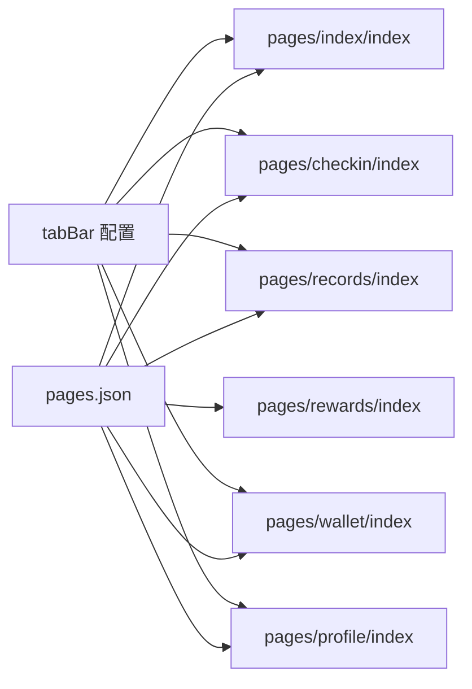

图表来源
- [star-park/miniprogram/src/pages.json:1-54](file://star-park/miniprogram/src/pages.json#L1-L54)

章节来源
- [star-park/miniprogram/src/pages.json:1-54](file://star-park/miniprogram/src/pages.json#L1-L54)

### 布局与导航组件（PC 端）
- Layout
  - 采用 Flex 布局，左侧固定侧边栏，右侧自适应主内容区。
  - 通过 router-view 渲染当前路由页面，key 基于 fullPath 防止缓存导致的状态错乱。
- SideNav
  - 固定定位，包含 Logo、菜单项与版本信息。
  - 菜单项根据当前路由高亮，支持 hover 效果与图标渲染。

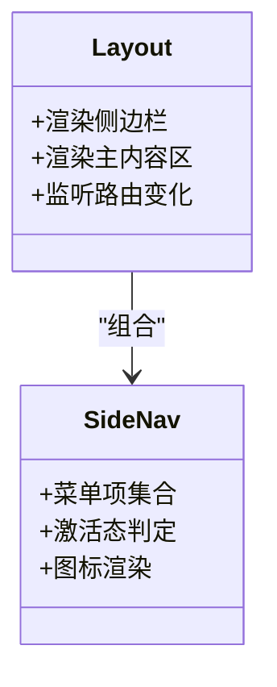

图表来源
- [star-park/pc-admin/src/components/Layout.vue:1-29](file://star-park/pc-admin/src/components/Layout.vue#L1-L29)
- [star-park/pc-admin/src/components/SideNav.vue:1-132](file://star-park/pc-admin/src/components/SideNav.vue#L1-L132)

章节来源
- [star-park/pc-admin/src/components/Layout.vue:1-29](file://star-park/pc-admin/src/components/Layout.vue#L1-L29)
- [star-park/pc-admin/src/components/SideNav.vue:1-132](file://star-park/pc-admin/src/components/SideNav.vue#L1-L132)

### 业务组件：ChildCard（跨端复用）
- PC 端 ChildCard
  - 展示孩子头像、打卡状态、连续天数、余额与积分等指标。
  - 使用 Element Plus 进度条与样式变量，支持点击跳转到余额页。
- 小程序端 ChildCard
  - 使用 uni-app 视图组件与 rpx 单位，实现移动端适配。
  - 支持点击事件透传，便于上层绑定交互。

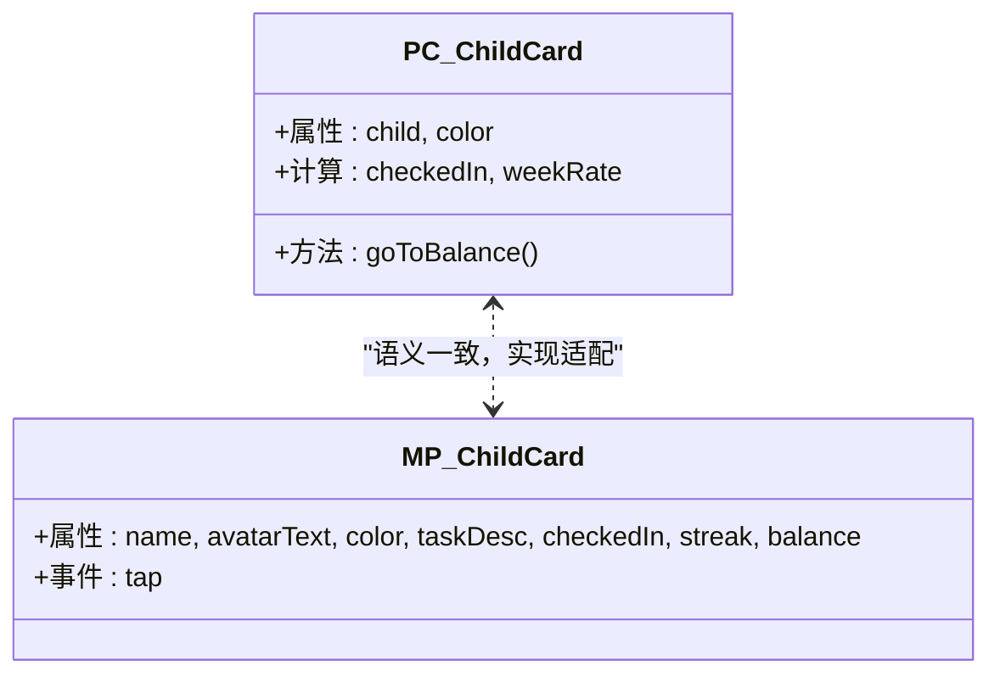

图表来源
- [star-park/pc-admin/src/components/ChildCard.vue:1-161](file://star-park/pc-admin/src/components/ChildCard.vue#L1-L161)
- [star-park/miniprogram/src/components/ChildCard.vue:1-162](file://star-park/miniprogram/src/components/ChildCard.vue#L1-L162)

章节来源
- [star-park/pc-admin/src/components/ChildCard.vue:1-161](file://star-park/pc-admin/src/components/ChildCard.vue#L1-L161)
- [star-park/miniprogram/src/components/ChildCard.vue:1-162](file://star-park/miniprogram/src/components/ChildCard.vue#L1-L162)

### 状态管理（Pinia Store）
- Store 设计
  - 管理孩子列表、当前选中孩子 ID、加载状态与颜色映射。
  - 提供获取颜色、拉取孩子列表、设置当前孩子等方法。
  - 通过 computed 计算当前选中孩子，保证派生状态一致性。
- 数据流
  - 视图组件通过 store 方法读取与更新状态，避免跨组件重复请求。
  - Dashboard 在首次加载失败时回退到本地 store 数据，增强健壮性。

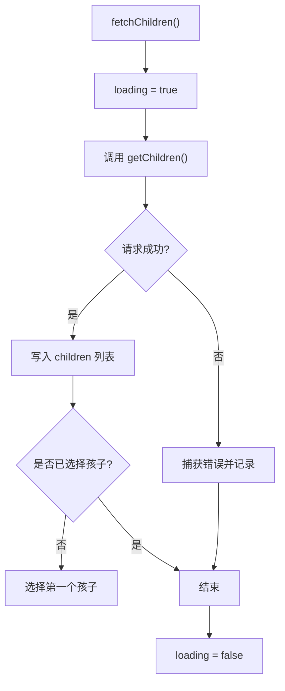

图表来源
- [star-park/pc-admin/src/stores/app.js:1-62](file://star-park/pc-admin/src/stores/app.js#L1-L62)

章节来源
- [star-park/pc-admin/src/stores/app.js:1-62](file://star-park/pc-admin/src/stores/app.js#L1-L62)

### API 封装与数据流
- PC 端 API
  - 基于 axios 创建实例，设置 baseURL、超时与 Content-Type。
  - 统一响应拦截器，自动提取 data 字段，简化视图层处理。
  - 按业务拆分接口：孩子、任务、打卡、奖励、统计、仪表盘、积分/余额等。
- 小程序端 API
  - 条件判断 H5 与小程序环境，分别使用相对路径或完整 URL。
  - 封装 request 函数，统一封装 uni.request 的 success/fail 分支与错误提示。
  - 按业务拆分接口，与 PC 端语义一致。

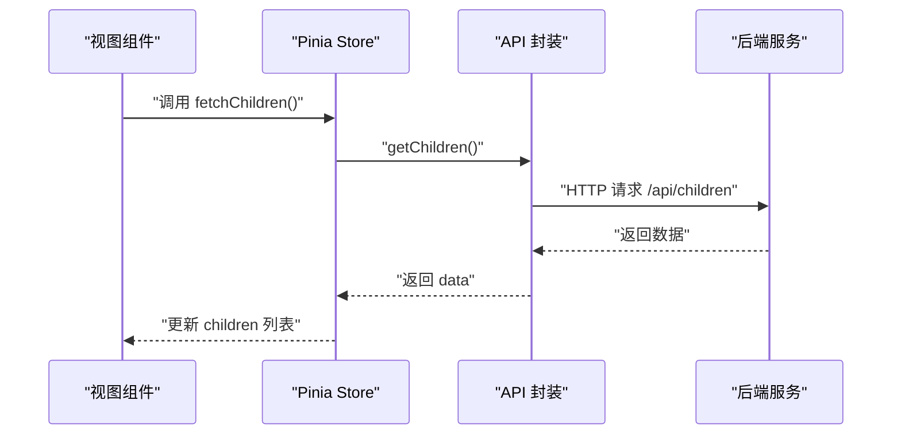

图表来源
- [star-park/pc-admin/src/views/Dashboard.vue:1-146](file://star-park/pc-admin/src/views/Dashboard.vue#L1-L146)
- [star-park/pc-admin/src/stores/app.js:1-62](file://star-park/pc-admin/src/stores/app.js#L1-L62)
- [star-park/pc-admin/src/api/index.js:1-56](file://star-park/pc-admin/src/api/index.js#L1-L56)
- [star-park/miniprogram/src/api/index.js:1-75](file://star-park/miniprogram/src/api/index.js#L1-L75)

章节来源
- [star-park/pc-admin/src/api/index.js:1-56](file://star-park/pc-admin/src/api/index.js#L1-L56)
- [star-park/miniprogram/src/api/index.js:1-75](file://star-park/miniprogram/src/api/index.js#L1-L75)

### 视图组件：Dashboard
- 功能概览
  - 展示欢迎信息与日期，加载孩子卡片列表。
  - 提供快捷操作按钮，快速跳转到打卡、任务、奖励、统计等页面。
  - 支持空状态与加载状态，提升用户体验。
- 数据来源
  - 优先从 getDashboard 获取数据；若失败则回退到 store 中的 children 列表。
  - 使用 dayjs 格式化日期字符串。

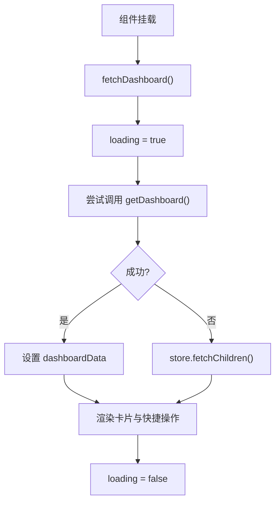

图表来源
- [star-park/pc-admin/src/views/Dashboard.vue:1-146](file://star-park/pc-admin/src/views/Dashboard.vue#L1-L146)

章节来源
- [star-park/pc-admin/src/views/Dashboard.vue:1-146](file://star-park/pc-admin/src/views/Dashboard.vue#L1-L146)

## 依赖分析
- 依赖关系
  - PC 端：main.js 依赖 App.vue、router、pinia、Element Plus；App.vue 依赖路由视图；router 依赖 Layout 与各 views；views 依赖 stores 与 api；components 依赖 Element Plus 与路由。
  - 小程序端：main.js 依赖 App.vue；App.vue 依赖 pages.json；components 依赖 api；api 依赖运行时 uni。
- 耦合与内聚
  - 组件内聚：ChildCard 专注于单个卡片渲染，职责单一。
  - 组件耦合：Layout 与 SideNav 通过路由联动，降低跨组件耦合。
  - 数据耦合：Pinia Store 作为单一数据源，避免多处重复请求。
- 外部依赖
  - PC 端：vue、vue-router、pinia、element-plus、axios、dayjs。
  - 小程序端：@dcloudio/uni-app、pinia、vue。

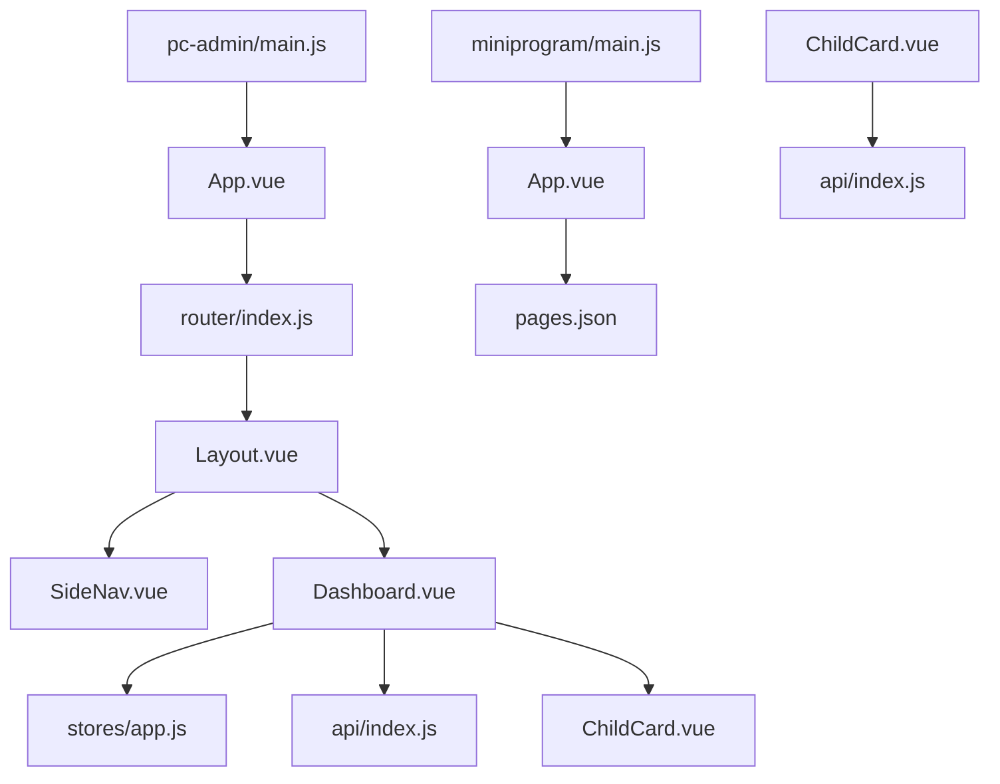

图表来源
- [star-park/pc-admin/src/main.js:1-22](file://star-park/pc-admin/src/main.js#L1-L22)
- [star-park/pc-admin/src/App.vue:1-10](file://star-park/pc-admin/src/App.vue#L1-L10)
- [star-park/pc-admin/src/router/index.js:1-67](file://star-park/pc-admin/src/router/index.js#L1-L67)
- [star-park/pc-admin/src/components/Layout.vue:1-29](file://star-park/pc-admin/src/components/Layout.vue#L1-L29)
- [star-park/pc-admin/src/components/SideNav.vue:1-132](file://star-park/pc-admin/src/components/SideNav.vue#L1-L132)
- [star-park/pc-admin/src/views/Dashboard.vue:1-146](file://star-park/pc-admin/src/views/Dashboard.vue#L1-L146)
- [star-park/pc-admin/src/stores/app.js:1-62](file://star-park/pc-admin/src/stores/app.js#L1-L62)
- [star-park/pc-admin/src/api/index.js:1-56](file://star-park/pc-admin/src/api/index.js#L1-L56)
- [star-park/miniprogram/src/main.js:1-8](file://star-park/miniprogram/src/main.js#L1-L8)
- [star-park/miniprogram/src/App.vue:1-26](file://star-park/miniprogram/src/App.vue#L1-L26)
- [star-park/miniprogram/src/pages.json:1-54](file://star-park/miniprogram/src/pages.json#L1-L54)
- [star-park/miniprogram/src/api/index.js:1-75](file://star-park/miniprogram/src/api/index.js#L1-L75)

章节来源
- [star-park/pc-admin/package.json:1-26](file://star-park/pc-admin/package.json#L1-L26)
- [star-park/miniprogram/package.json:1-28](file://star-park/miniprogram/package.json#L1-L28)

## 性能考虑
- 代码分割与懒加载
  - 路由按需加载与组件动态导入，减少首屏包体。
- 状态缓存与回退
  - Store 缓存孩子列表，Dashboard 在 API 失败时回退本地数据，避免频繁请求。
- UI 组件优化
  - Element Plus 图标按需注册，避免全量引入。
- 网络请求优化
  - axios 统一拦截器提取 data，减少视图层样板代码。
  - 小程序端统一封装 request，集中处理错误提示。
- 开发体验
  - Vite Proxy 将 /api 转发至后端服务，开发阶段无需额外配置。

章节来源
- [star-park/pc-admin/src/router/index.js:1-67](file://star-park/pc-admin/src/router/index.js#L1-L67)
- [star-park/pc-admin/src/stores/app.js:1-62](file://star-park/pc-admin/src/stores/app.js#L1-L62)
- [star-park/pc-admin/src/main.js:1-22](file://star-park/pc-admin/src/main.js#L1-L22)
- [star-park/pc-admin/src/api/index.js:1-56](file://star-park/pc-admin/src/api/index.js#L1-L56)
- [star-park/miniprogram/src/api/index.js:1-75](file://star-park/miniprogram/src/api/index.js#L1-L75)
- [star-park/pc-admin/vite.config.js:1-19](file://star-park/pc-admin/vite.config.js#L1-L19)
- [star-park/miniprogram/vite.config.js:1-17](file://star-park/miniprogram/vite.config.js#L1-L17)

## 故障排查指南
- 路由标题不生效
  - 检查路由 meta.title 是否正确设置，以及路由守卫是否执行。
- 图标不显示
  - 确认 Element Plus 图标是否按需注册，组件名称是否匹配。
- API 请求失败
  - PC 端检查 axios 拦截器与 baseURL，确认 /api 代理配置。
  - 小程序端检查 BASE_URL 判断逻辑与 uni.request 成功/失败分支。
- 小程序页面无法打开
  - 检查 pages.json 中页面路径与 tabBar 配置是否正确。
- 样式异常
  - PC 端检查 CSS 变量与 scoped 样式作用域。
  - 小程序端检查 rpx 单位与全局样式 page 标签。

章节来源
- [star-park/pc-admin/src/router/index.js:1-67](file://star-park/pc-admin/src/router/index.js#L1-L67)
- [star-park/pc-admin/src/main.js:1-22](file://star-park/pc-admin/src/main.js#L1-L22)
- [star-park/pc-admin/src/api/index.js:1-56](file://star-park/pc-admin/src/api/index.js#L1-L56)
- [star-park/miniprogram/src/api/index.js:1-75](file://star-park/miniprogram/src/api/index.js#L1-L75)
- [star-park/miniprogram/src/pages.json:1-54](file://star-park/miniprogram/src/pages.json#L1-L54)
- [star-park/miniprogram/src/App.vue:1-26](file://star-park/miniprogram/src/App.vue#L1-L26)

## 结论
本设计文档系统阐述了 StarParadise 的双前端架构：PC 管理后台与小程序端在保持业务逻辑一致性的前提下，针对不同平台特性进行组件与实现层面的适配。通过清晰的分层结构、统一的 API 封装与 Pinia 状态管理，实现了良好的可维护性与可扩展性。配合路由懒加载、按需注册与代理转发等手段，兼顾了性能与开发体验。

## 附录
- 响应式设计原则
  - 使用相对单位（如 rpx）与 CSS 变量，确保在不同屏幕尺寸下的一致表现。
- 跨平台适配方案
  - 通过条件判断与不同构建配置，实现 H5 与小程序环境的差异化处理。
- 用户体验设计考虑
  - 提供加载与空状态反馈，统一导航与交互风格，减少用户认知负担。