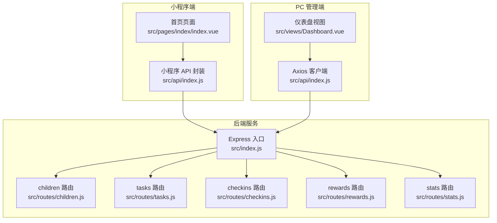
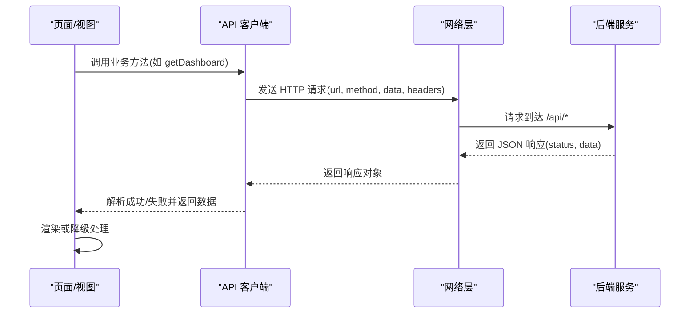
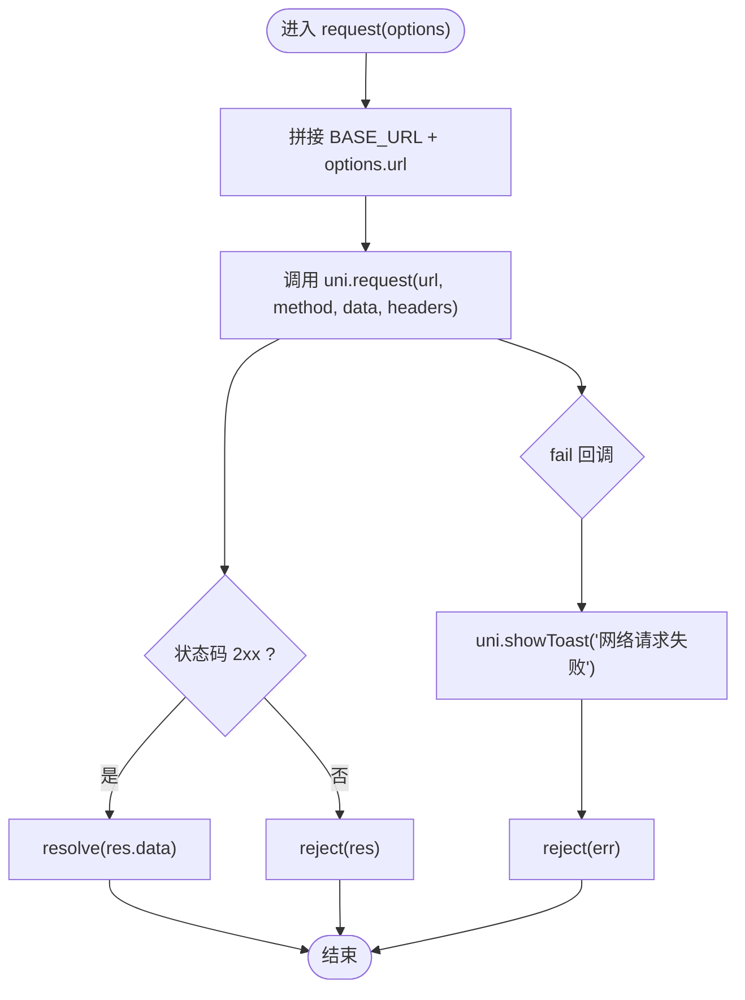
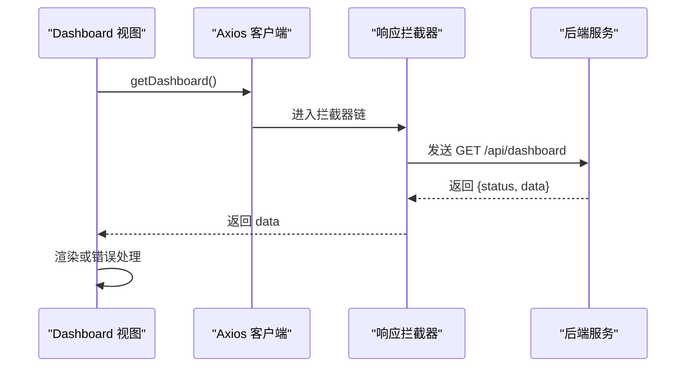
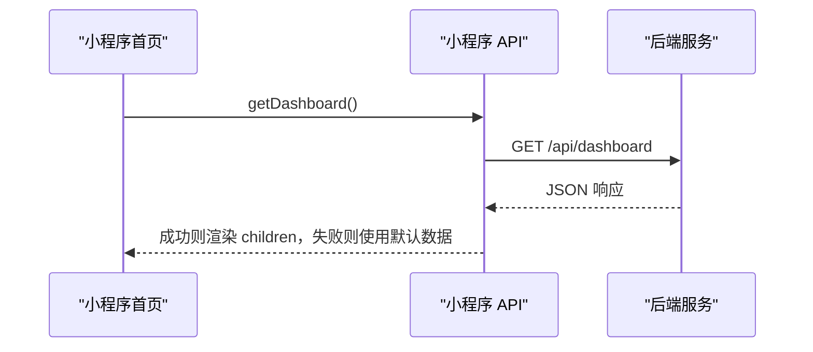
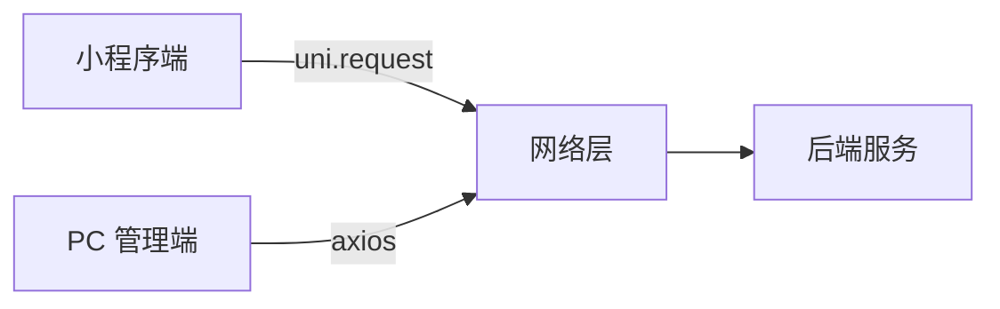

# API调用封装

<cite>
**本文引用的文件**   
- [star-park/miniprogram/src/api/index.js](file://star-park/miniprogram/src/api/index.js)
- [star-park/pc-admin/src/api/index.js](file://star-park/pc-admin/src/api/index.js)
- [star-park/miniprogram/src/pages/index/index.vue](file://star-park/miniprogram/src/pages/index/index.vue)
- [star-park/pc-admin/src/views/Dashboard.vue](file://star-park/pc-admin/src/views/Dashboard.vue)
- [star-park/server/src/index.js](file://star-park/server/src/index.js)
- [star-park/server/src/routes/children.js](file://star-park/server/src/routes/children.js)
- [star-park/server/src/routes/tasks.js](file://star-park/server/src/routes/tasks.js)
- [star-park/server/src/routes/checkins.js](file://star-park/server/src/routes/checkins.js)
- [star-park/server/src/routes/rewards.js](file://star-park/server/src/routes/rewards.js)
- [star-park/server/src/routes/stats.js](file://star-park/server/src/routes/stats.js)
- [star-park/miniprogram/src/manifest.json](file://star-park/miniprogram/src/manifest.json)
</cite>

## 目录
1. [简介](#简介)
2. [项目结构](#项目结构)
3. [核心组件](#核心组件)
4. [架构总览](#架构总览)
5. [详细组件分析](#详细组件分析)
6. [依赖分析](#依赖分析)
7. [性能考虑](#性能考虑)
8. [故障排查指南](#故障排查指南)
9. [结论](#结论)
10. [附录](#附录)

## 简介
本文件系统性梳理 StarParadise 小程序与 PC 管理端的 API 调用封装设计，重点覆盖：
- Axios 实例配置与拦截器
- 请求/响应拦截器的实现与职责边界
- 错误处理机制：网络异常、业务错误、重试策略
- 小程序环境适配：BASE_URL 判定、uni.request 使用、toast 提示
- 与后端 API 的对接方式：请求格式、响应解析、数据转换
- 最佳实践：并发控制、超时处理、调试技巧
- 安全性与性能优化建议

## 项目结构
前端侧分为两套应用：
- 小程序端：基于 uni-app，使用原生 uni.request 发起请求
- PC 管理端：基于 Vue + Pinia + Element Plus，使用 Axios 构建 API 客户端

后端采用 Express，统一前缀 /api，按模块划分路由。

图表来源
- [star-park/miniprogram/src/api/index.js:1-75](file://star-park/miniprogram/src/api/index.js#L1-L75)
- [star-park/pc-admin/src/api/index.js:1-56](file://star-park/pc-admin/src/api/index.js#L1-L56)
- [star-park/server/src/index.js:1-42](file://star-park/server/src/index.js#L1-L42)
- [star-park/server/src/routes/children.js:1-96](file://star-park/server/src/routes/children.js#L1-L96)
- [star-park/server/src/routes/tasks.js:1-91](file://star-park/server/src/routes/tasks.js#L1-L91)
- [star-park/server/src/routes/checkins.js:1-90](file://star-park/server/src/routes/checkins.js#L1-L90)
- [star-park/server/src/routes/rewards.js:1-167](file://star-park/server/src/routes/rewards.js#L1-L167)
- [star-park/server/src/routes/stats.js:1-182](file://star-park/server/src/routes/stats.js#L1-L182)

章节来源
- [star-park/miniprogram/src/api/index.js:1-75](file://star-park/miniprogram/src/api/index.js#L1-L75)
- [star-park/pc-admin/src/api/index.js:1-56](file://star-park/pc-admin/src/api/index.js#L1-L56)
- [star-park/server/src/index.js:1-42](file://star-park/server/src/index.js#L1-L42)

## 核心组件
- 小程序 API 封装：提供通用 request 方法与一组业务 API 函数，自动设置 Content-Type，区分 H5 与小程序环境的 BASE_URL，统一处理状态码与失败 toast。
- PC 管理端 Axios 客户端：创建带 baseURL、timeout、默认头的实例；仅在响应拦截器中剥离 data，便于上层直接消费数据；其余错误透传 Promise 链。
- 页面/视图：分别在 mounted/onShow 生命周期触发 API 调用，进行数据渲染或降级兜底。

章节来源
- [star-park/miniprogram/src/api/index.js:1-75](file://star-park/miniprogram/src/api/index.js#L1-L75)
- [star-park/pc-admin/src/api/index.js:1-56](file://star-park/pc-admin/src/api/index.js#L1-L56)
- [star-park/miniprogram/src/pages/index/index.vue:1-194](file://star-park/miniprogram/src/pages/index/index.vue#L1-L194)
- [star-park/pc-admin/src/views/Dashboard.vue:1-146](file://star-park/pc-admin/src/views/Dashboard.vue#L1-L146)

## 架构总览
小程序与 PC 端分别构建独立的 API 客户端，统一指向后端 /api 前缀。小程序通过 uni.request 实现请求；PC 端通过 Axios 实现请求与拦截。后端按模块拆分路由，提供统一的 JSON 响应。

图表来源
- [star-park/miniprogram/src/api/index.js:7-30](file://star-park/miniprogram/src/api/index.js#L7-L30)
- [star-park/pc-admin/src/api/index.js:4-19](file://star-park/pc-admin/src/api/index.js#L4-L19)
- [star-park/server/src/index.js:20-27](file://star-park/server/src/index.js#L20-L27)

## 详细组件分析

### 小程序 API 封装（uni.request）
- 环境判断与 BASE_URL：在 H5 模式下使用相对路径 /api，通过 Vite devServer proxy 转发至后端；在小程序模式使用完整 URL。
- 通用 request：封装 uni.request，统一设置 Content-Type 为 application/json，合并自定义 header；对 2xx 状态码视为成功，否则 reject；fail 回调中统一 toast 提示并 reject。
- 业务 API：围绕 /api 下各模块封装具体接口，如 dashboard、children、checkins、rewards、tasks、stats、points、transactions 等。

图表来源
- [star-park/miniprogram/src/api/index.js:7-30](file://star-park/miniprogram/src/api/index.js#L7-L30)

章节来源
- [star-park/miniprogram/src/api/index.js:1-75](file://star-park/miniprogram/src/api/index.js#L1-L75)
- [star-park/miniprogram/src/manifest.json:19-29](file://star-park/miniprogram/src/manifest.json#L19-L29)

### PC 管理端 Axios 客户端（拦截器与接口）
- Axios 实例：baseURL 为 /api，timeout 10s，默认 Content-Type 为 application/json。
- 响应拦截器：统一剥离 response.data，便于上层直接消费数据；错误统一打印日志并透传错误。
- 业务接口：按模块导出 get/post/put/delete 等方法，如 children、tasks、checkins、rewards、stats、points、transactions 等。

图表来源
- [star-park/pc-admin/src/api/index.js:4-19](file://star-park/pc-admin/src/api/index.js#L4-L19)
- [star-park/pc-admin/src/views/Dashboard.vue:76-87](file://star-park/pc-admin/src/views/Dashboard.vue#L76-L87)

章节来源
- [star-park/pc-admin/src/api/index.js:1-56](file://star-park/pc-admin/src/api/index.js#L1-L56)
- [star-park/pc-admin/src/views/Dashboard.vue:1-146](file://star-park/pc-admin/src/views/Dashboard.vue#L1-L146)

### 页面/视图中的调用流程
- 小程序首页：在 onMounted/onShow 中调用 api.getDashboard，解析 children 并渲染；失败时使用默认数据兜底。
- PC 管理端仪表盘：在 onMounted 中调用 getDashboard，loading 控制与错误降级；失败时回退到 Pinia store 的 children 数据。

图表来源
- [star-park/miniprogram/src/pages/index/index.vue:100-124](file://star-park/miniprogram/src/pages/index/index.vue#L100-L124)

章节来源
- [star-park/miniprogram/src/pages/index/index.vue:1-194](file://star-park/miniprogram/src/pages/index/index.vue#L1-L194)
- [star-park/pc-admin/src/views/Dashboard.vue:1-146](file://star-park/pc-admin/src/views/Dashboard.vue#L1-L146)

### 后端 API 对接要点
- 统一前缀：/api/children、/api/tasks、/api/checkins、/api/rewards、/api/stats、/api/dashboard、/api/points。
- 响应格式：标准 JSON，包含 status 与 data；部分路由返回业务实体数组或对象。
- 数据转换：后端在 children 路由中将余额、积分、任务列表等聚合到返回体；前端无需二次转换即可渲染。

章节来源
- [star-park/server/src/index.js:20-27](file://star-park/server/src/index.js#L20-L27)
- [star-park/server/src/routes/children.js:5-37](file://star-park/server/src/routes/children.js#L5-L37)
- [star-park/server/src/routes/stats.js:103-179](file://star-park/server/src/routes/stats.js#L103-L179)

## 依赖分析
- 小程序端依赖 uni-app 的 uni.request，不引入第三方 HTTP 库，减少包体积。
- PC 端依赖 axios，具备完善的拦截器生态，便于扩展认证、重试、日志等功能。
- 两端均以 /api 作为统一前缀，便于反向代理与跨域处理。

图表来源
- [star-park/miniprogram/src/api/index.js:9-16](file://star-park/miniprogram/src/api/index.js#L9-L16)
- [star-park/pc-admin/src/api/index.js:1-10](file://star-park/pc-admin/src/api/index.js#L1-L10)
- [star-park/server/src/index.js:1-42](file://star-park/server/src/index.js#L1-L42)

章节来源
- [star-park/miniprogram/src/api/index.js:1-75](file://star-park/miniprogram/src/api/index.js#L1-L75)
- [star-park/pc-admin/src/api/index.js:1-56](file://star-park/pc-admin/src/api/index.js#L1-L56)
- [star-park/server/src/index.js:1-42](file://star-park/server/src/index.js#L1-L42)

## 性能考虑
- 超时控制：PC 端已设置 10s 超时；小程序端未显式设置，建议在 uni.request 中增加 timeout 字段以避免长时间挂起。
- 并发控制：当前页面调用多为单次请求；若未来需要批量请求，建议使用 Promise.all 并限制并发度，避免阻塞 UI。
- 缓存策略：小程序端未见本地缓存逻辑；可在页面 onShow 时加入“新鲜度”判断，避免重复拉取相同数据。
- 网络抖动：小程序端 fail 回调已统一 toast；建议在 PC 端响应拦截器中识别网络错误并给出用户提示。
- 数据预处理：后端已做聚合（如 children 路由），前端可直接渲染，减少额外转换成本。

## 故障排查指南
- 网络异常
  - 小程序：fail 回调会触发 toast 并 reject，检查 BASE_URL 与代理配置；确认 manifest.json 中 H5 devServer.proxy 是否正确指向后端地址。
  - PC 端：响应拦截器会打印错误日志，检查浏览器 Network 面板与 CORS 设置。
- 业务错误
  - 后端路由返回 4xx/5xx 时，小程序端会 reject 原始响应；PC 端会在拦截器中透传错误。建议在页面层捕获并友好提示。
- 跨域问题
  - 后端已启用 CORS；若仍出现跨域，请检查代理与 Origin 配置。
- 开发调试
  - 小程序端：在 request.fail 中输出 err，定位网络层问题。
  - PC 端：在响应拦截器中输出 error.response 或 error.request，结合后端日志定位。

章节来源
- [star-park/miniprogram/src/api/index.js:24-27](file://star-park/miniprogram/src/api/index.js#L24-L27)
- [star-park/pc-admin/src/api/index.js:13-19](file://star-park/pc-admin/src/api/index.js#L13-L19)
- [star-park/miniprogram/src/manifest.json:20-28](file://star-park/miniprogram/src/manifest.json#L20-L28)

## 结论
- 小程序端通过轻量封装统一了请求与错误处理，适合小程序环境；建议补充超时与缓存策略。
- PC 端通过 Axios 提供了良好的扩展性，拦截器可承载认证、重试、日志等横切能力。
- 后端接口清晰、数据聚合充分，前后端协作顺畅。
- 建议后续完善：统一超时、统一重试、统一鉴权、统一缓存与统一错误提示。

## 附录

### API 调用最佳实践清单
- 超时与重试
  - 在 uni.request 中设置合理 timeout；对 5xx/网络异常可进行有限次数重试。
- 并发控制
  - 使用队列或信号量限制并发，避免 UI 卡顿。
- 缓存与去重
  - 页面 onShow 时根据时间戳或参数判断是否需要重新请求。
- 错误提示
  - 统一在拦截器或封装层输出用户可读提示，避免泄露内部错误细节。
- 调试技巧
  - 打开 Network 面板观察请求与响应；在拦截器中打印关键字段（如 URL、状态码、耗时）。

### 安全性与性能优化建议
- 安全性
  - 建议在 Axios 拦截器中注入 Authorization 头（如 JWT），并在后端校验。
  - 对敏感接口增加权限校验与速率限制。
- 性能
  - 合理设置缓存 TTL；对高频接口开启条件请求（如 ETag/Last-Modified）。
  - 后端查询使用索引与分页，避免一次性返回大量数据。