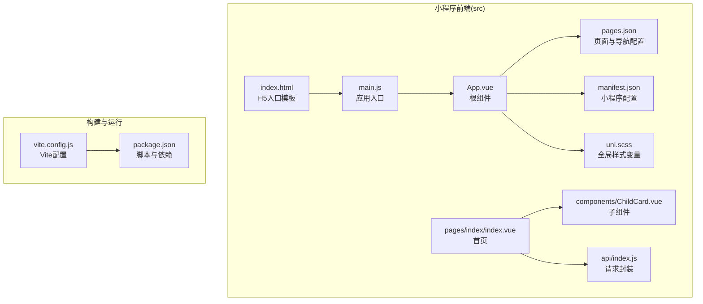
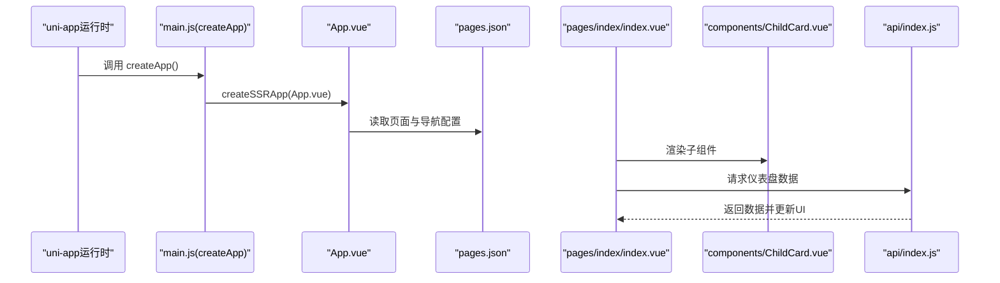
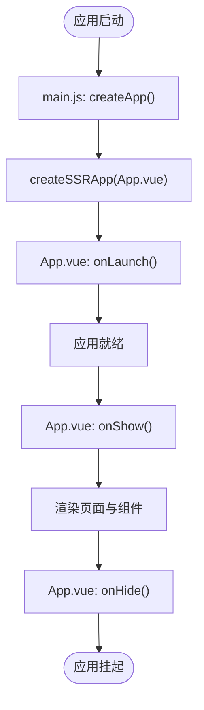
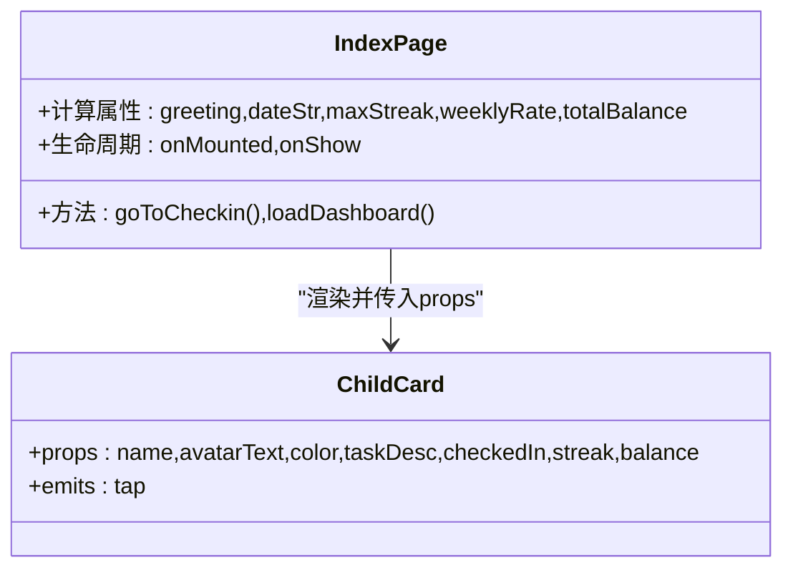
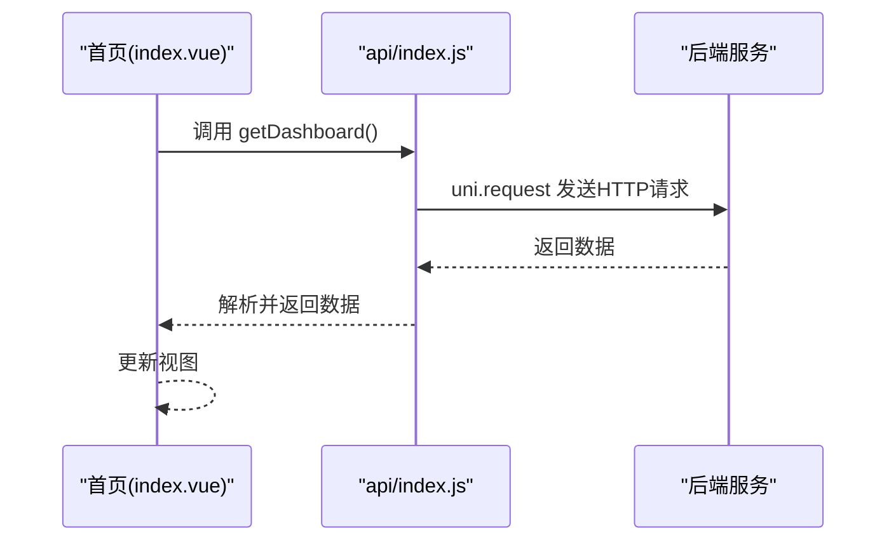
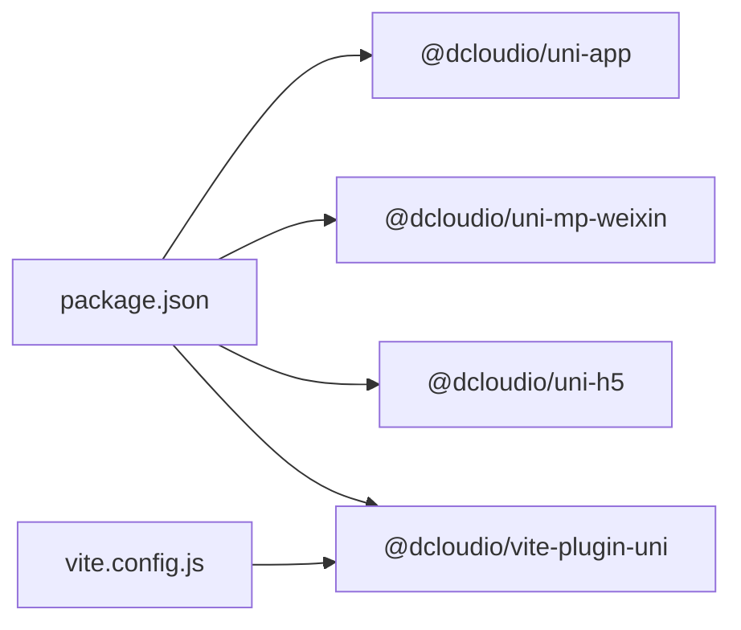

# 小程序入口与配置

<cite>
**本文引用的文件**
- [main.js](file://star-park/miniprogram/src/main.js)
- [App.vue](file://star-park/miniprogram/src/App.vue)
- [manifest.json](file://star-park/miniprogram/src/manifest.json)
- [pages.json](file://star-park/miniprogram/src/pages.json)
- [vite.config.js](file://star-park/miniprogram/vite.config.js)
- [package.json](file://star-park/miniprogram/package.json)
- [index.html](file://star-park/miniprogram/index.html)
- [uni.scss](file://star-park/miniprogram/src/uni.scss)
- [pages/index/index.vue](file://star-park/miniprogram/src/pages/index/index.vue)
- [components/ChildCard.vue](file://star-park/miniprogram/src/components/ChildCard.vue)
- [api/index.js](file://star-park/miniprogram/src/api/index.js)
- [miniprogram.md](file://docs/design-docs/miniprogram.md)
- [DEVELOPMENT.md](file://docs/DEVELOPMENT.md)
</cite>

## 目录
1. [简介](#简介)
2. [项目结构](#项目结构)
3. [核心组件](#核心组件)
4. [架构总览](#架构总览)
5. [详细组件分析](#详细组件分析)
6. [依赖分析](#依赖分析)
7. [性能考虑](#性能考虑)
8. [故障排查指南](#故障排查指南)
9. [结论](#结论)
10. [附录](#附录)

## 简介
本文件聚焦 StarParadise 小程序端的入口与配置，系统化说明以下内容：
- 应用初始化流程：main.js 中 createSSRApp 的使用与 App.vue 根组件加载机制
- manifest.json 配置：小程序基本信息、平台特定设置（如 mp-weixin）、H5 开发服务器与代理
- Vite 构建配置：插件启用、开发服务器与代理、跨端构建命令
- uni-app 平台适配：构建目标、运行模式、H5 与小程序差异
- 启动流程与常见配置问题的解决方案

## 项目结构
小程序端位于 star-park/miniprogram，采用 uni-app + Vue 3 结构，关键目录与文件如下：
- 入口与根组件：src/main.js、src/App.vue
- 配置文件：src/manifest.json、src/pages.json、vite.config.js、package.json、index.html、src/uni.scss
- 页面与组件：src/pages/index/index.vue、src/components/ChildCard.vue
- API 客户端：src/api/index.js
- 文档参考：docs/design-docs/miniprogram.md、docs/DEVELOPMENT.md

图表来源
- [main.js:1-8](file://star-park/miniprogram/src/main.js#L1-L8)
- [App.vue:1-26](file://star-park/miniprogram/src/App.vue#L1-L26)
- [pages.json:1-54](file://star-park/miniprogram/src/pages.json#L1-L54)
- [manifest.json:1-31](file://star-park/miniprogram/src/manifest.json#L1-L31)
- [vite.config.js:1-17](file://star-park/miniprogram/vite.config.js#L1-L17)
- [package.json:1-28](file://star-park/miniprogram/package.json#L1-L28)
- [index.html:1-15](file://star-park/miniprogram/index.html#L1-L15)
- [pages/index/index.vue:1-194](file://star-park/miniprogram/src/pages/index/index.vue#L1-L194)
- [components/ChildCard.vue:1-162](file://star-park/miniprogram/src/components/ChildCard.vue#L1-L162)
- [api/index.js:1-75](file://star-park/miniprogram/src/api/index.js#L1-L75)

章节来源
- [main.js:1-8](file://star-park/miniprogram/src/main.js#L1-L8)
- [App.vue:1-26](file://star-park/miniprogram/src/App.vue#L1-L26)
- [pages.json:1-54](file://star-park/miniprogram/src/pages.json#L1-L54)
- [manifest.json:1-31](file://star-park/miniprogram/src/manifest.json#L1-L31)
- [vite.config.js:1-17](file://star-park/miniprogram/vite.config.js#L1-L17)
- [package.json:1-28](file://star-park/miniprogram/package.json#L1-L28)
- [index.html:1-15](file://star-park/miniprogram/index.html#L1-L15)

## 核心组件
- 应用入口与初始化
  - main.js 通过 createSSRApp 加载 App.vue，并导出 createApp 以供 uni-app 运行时调用
  - App.vue 使用 uni-app 生命周期钩子 onLaunch/onShow/onHide，负责应用级事件与全局样式
- 页面与导航
  - pages.json 定义页面路径、导航栏标题、全局样式以及 tabBar 列表与图标
- 配置中心
  - manifest.json 提供小程序名称、版本、平台特定设置（mp-weixin）与 H5 开发服务器代理
- 构建与运行
  - package.json 提供 dev/build 脚本，区分 mp-weixin 与 h5
  - vite.config.js 配置 uni 插件、开发服务器与 /api 代理

章节来源
- [main.js:1-8](file://star-park/miniprogram/src/main.js#L1-L8)
- [App.vue:1-26](file://star-park/miniprogram/src/App.vue#L1-L26)
- [pages.json:1-54](file://star-park/miniprogram/src/pages.json#L1-L54)
- [manifest.json:1-31](file://star-park/miniprogram/src/manifest.json#L1-L31)
- [package.json:1-28](file://star-park/miniprogram/package.json#L1-L28)
- [vite.config.js:1-17](file://star-park/miniprogram/vite.config.js#L1-L17)

## 架构总览
下图展示小程序端从入口到页面渲染的关键路径，以及与 API 客户端的交互。

图表来源
- [main.js:1-8](file://star-park/miniprogram/src/main.js#L1-L8)
- [App.vue:1-26](file://star-park/miniprogram/src/App.vue#L1-L26)
- [pages.json:1-54](file://star-park/miniprogram/src/pages.json#L1-L54)
- [pages/index/index.vue:1-194](file://star-park/miniprogram/src/pages/index/index.vue#L1-L194)
- [components/ChildCard.vue:1-162](file://star-park/miniprogram/src/components/ChildCard.vue#L1-L162)
- [api/index.js:1-75](file://star-park/miniprogram/src/api/index.js#L1-L75)

## 详细组件分析

### 应用入口与初始化流程（main.js 与 App.vue）
- 初始化要点
  - 使用 createSSRApp 包装根组件 App.vue，确保服务端渲染与客户端一致
  - 导出 createApp 供 uni-app 运行时调用，形成标准的入口约定
- 根组件生命周期
  - onLaunch：应用启动时触发，适合进行初始化逻辑
  - onShow：应用显示时触发，适合刷新数据或恢复状态
  - onHide：应用隐藏时触发，适合清理定时器或保存状态
- 全局样式
  - App.vue 中的全局样式作用于 page，统一字体、字号、行高与背景色

图表来源
- [main.js:1-8](file://star-park/miniprogram/src/main.js#L1-L8)
- [App.vue:1-26](file://star-park/miniprogram/src/App.vue#L1-L26)

章节来源
- [main.js:1-8](file://star-park/miniprogram/src/main.js#L1-L8)
- [App.vue:1-26](file://star-park/miniprogram/src/App.vue#L1-L26)

### manifest.json 配置详解
- 基本信息
  - name、description、versionName、versionCode：小程序名称、描述与版本号
  - transformPx：是否转换 px（当前为关闭）
- 平台特定配置（mp-weixin）
  - appid：微信小程序的唯一标识
  - setting：编译与打包相关选项（如 es6、enhance、postcss、minified）
  - usingComponents：启用自定义组件
- H5 开发服务器（h5.devServer）
  - port：开发服务器端口
  - proxy：将 /api 前缀代理到后端服务地址，便于跨域与本地联调

章节来源
- [manifest.json:1-31](file://star-park/miniprogram/src/manifest.json#L1-L31)

### pages.json 页面与导航配置
- 页面列表（pages）
  - 每个页面包含 path 与 style（如导航栏标题）
- 全局样式（globalStyle）
  - 导航栏文字颜色、标题文本、背景色等
- tabBar
  - color、selectedColor、backgroundColor、borderStyle
  - list：每个 tab 的 pagePath、text、图标与选中态图标

章节来源
- [pages.json:1-54](file://star-park/miniprogram/src/pages.json#L1-L54)

### Vite 构建配置（vite.config.js 与 package.json）
- 插件与开发服务器
  - @dcloudio/vite-plugin-uni：提供 uni-app 跨端构建能力
  - server.host/port/proxy：开发服务器监听与 /api 代理
- 跨端构建命令
  - dev:h5、dev:mp-weixin：分别启动 H5 与微信小程序开发模式
  - build:h5、build:mp-weixin：分别构建 H5 与微信小程序产物
- H5 入口模板
  - index.html 引入 /src/main.js 作为模块入口，配合 Vite/H5 环境运行

章节来源
- [vite.config.js:1-17](file://star-park/miniprogram/vite.config.js#L1-L17)
- [package.json:1-28](file://star-park/miniprogram/package.json#L1-L28)
- [index.html:1-15](file://star-park/miniprogram/index.html#L1-L15)

### uni.scss 全局样式变量
- 定义主色、浅色系、背景、文字、边框、卡片圆角、阴影等变量
- 在页面与组件样式中通过 scoped 方式使用，保证主题一致性

章节来源
- [uni.scss:1-17](file://star-park/miniprogram/src/uni.scss#L1-L17)

### 页面与组件：首页与子卡片
- 首页（pages/index/index.vue）
  - 使用 ChildCard 列表展示子项信息
  - 计算属性生成问候语、日期与汇总数据
  - 生命周期 onMounted/onShow 时拉取仪表盘数据
  - 通过 uni.switchTab 跳转至打卡页
- 子卡片（components/ChildCard.vue）
  - 接收 props：姓名、头像文本、颜色、任务描述、打卡状态、连击数、余额
  - emit tap 事件，供父组件处理点击跳转

图表来源
- [pages/index/index.vue:1-194](file://star-park/miniprogram/src/pages/index/index.vue#L1-L194)
- [components/ChildCard.vue:1-162](file://star-park/miniprogram/src/components/ChildCard.vue#L1-L162)

章节来源
- [pages/index/index.vue:1-194](file://star-park/miniprogram/src/pages/index/index.vue#L1-L194)
- [components/ChildCard.vue:1-162](file://star-park/miniprogram/src/components/ChildCard.vue#L1-L162)

### API 客户端与网络请求
- 请求封装
  - api/index.js 对 uni.request 进行封装，统一封装 header、状态判断与错误提示
  - 支持 GET/POST 等方法，返回 Promise
- 环境适配
  - H5 模式通过 /api 代理访问后端；小程序模式使用完整 URL
  - 失败时统一调用 uni.showToast 提示用户

图表来源
- [pages/index/index.vue:100-124](file://star-park/miniprogram/src/pages/index/index.vue#L100-L124)
- [api/index.js:1-75](file://star-park/miniprogram/src/api/index.js#L1-L75)

章节来源
- [api/index.js:1-75](file://star-park/miniprogram/src/api/index.js#L1-L75)
- [pages/index/index.vue:100-124](file://star-park/miniprogram/src/pages/index/index.vue#L100-L124)

## 依赖分析
- 运行时依赖
  - @dcloudio/uni-app、@dcloudio/uni-mp-weixin、@dcloudio/uni-h5、vue 等，提供跨端运行与小程序端能力
- 开发依赖
  - @dcloudio/vite-plugin-uni、vite、sass 等，支撑 Vite 构建与样式编译
- 脚本命令
  - dev:mp-weixin、dev:h5、build:mp-weixin、build:h5，分别对应不同平台的开发与构建

图表来源
- [package.json:1-28](file://star-park/miniprogram/package.json#L1-L28)
- [vite.config.js:1-17](file://star-park/miniprogram/vite.config.js#L1-L17)

章节来源
- [package.json:1-28](file://star-park/miniprogram/package.json#L1-L28)
- [vite.config.js:1-17](file://star-park/miniprogram/vite.config.js#L1-L17)

## 性能考虑
- 构建优化
  - mp-weixin.setting 中启用 es6、enhance、postcss、minified 等可提升代码压缩与编译效率
- 样式与资源
  - 使用 uni.scss 统一样式变量，减少重复计算与样式体积
  - tabBar 图标建议使用合适尺寸与格式，避免过大图片影响加载
- 网络请求
  - API 客户端统一处理失败提示，避免频繁弹窗影响体验
  - 首页数据在 onShow 时刷新，兼顾数据新鲜度与性能

## 故障排查指南
- H5 开发无法访问后端接口
  - 检查 manifest.json h5.devServer.proxy 是否正确指向后端地址
  - 确认 vite.config.js server.proxy 与之保持一致
- 微信小程序构建报错
  - 确认 mp-weixin.appid 是否填写，setting 中各项编译选项是否与项目兼容
  - 使用 dev:mp-weixin 与 build:mp-weixin 前先清理缓存
- 页面未显示或样式异常
  - 检查 pages.json 中页面路径与 tabBar 配置是否与实际目录一致
  - 确认 App.vue 全局样式未被局部样式覆盖
- 数据不更新
  - 确保首页在 onShow 生命周期中调用 loadDashboard
  - 检查 api/index.js 中 BASE_URL 在不同环境下的取值逻辑

章节来源
- [manifest.json:1-31](file://star-park/miniprogram/src/manifest.json#L1-L31)
- [vite.config.js:1-17](file://star-park/miniprogram/vite.config.js#L1-L17)
- [pages.json:1-54](file://star-park/miniprogram/src/pages.json#L1-L54)
- [App.vue:1-26](file://star-park/miniprogram/src/App.vue#L1-L26)
- [pages/index/index.vue:126-132](file://star-park/miniprogram/src/pages/index/index.vue#L126-L132)
- [api/index.js:1-75](file://star-park/miniprogram/src/api/index.js#L1-L75)

## 结论
本文件梳理了 StarParadise 小程序端的入口初始化、配置与构建要点，明确了 uni-app 在小程序端的适配方式与跨端开发流程。通过合理配置 manifest.json、pages.json、vite.config.js 与 package.json，结合 API 客户端的统一封装，可高效完成开发与调试工作。建议在团队协作中固化脚本命令与代理规则，减少环境差异带来的问题。

## 附录
- 开发与构建命令参考（来自 DEVELOPMENT.md）
  - H5 开发：npm run dev:h5
  - 小程序开发：npm run dev:mp-weixin
  - H5 构建：npm run build:h5
  - 小程序构建：npm run build:mp-weixin

章节来源
- [DEVELOPMENT.md:63-71](file://docs/DEVELOPMENT.md#L63-L71)