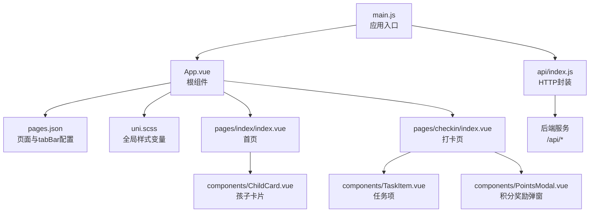
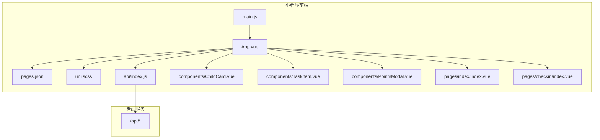
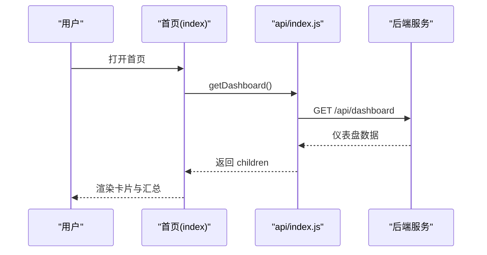
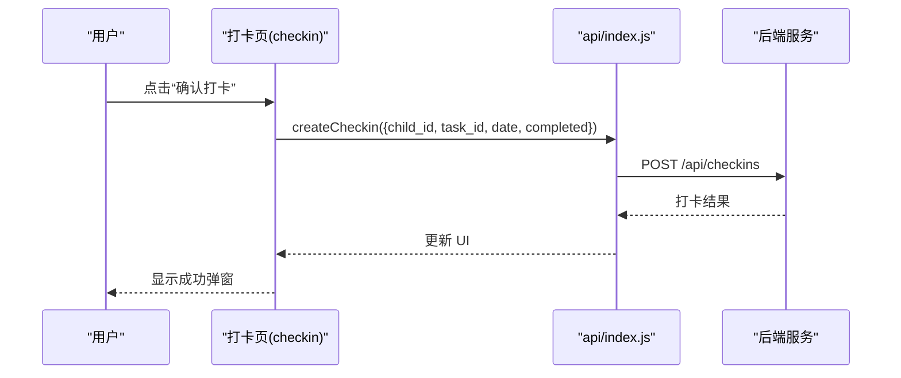
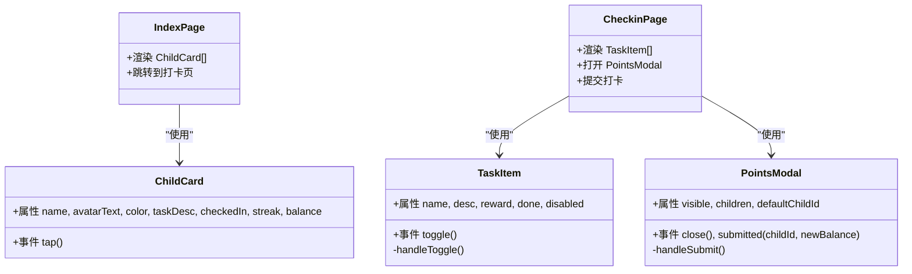
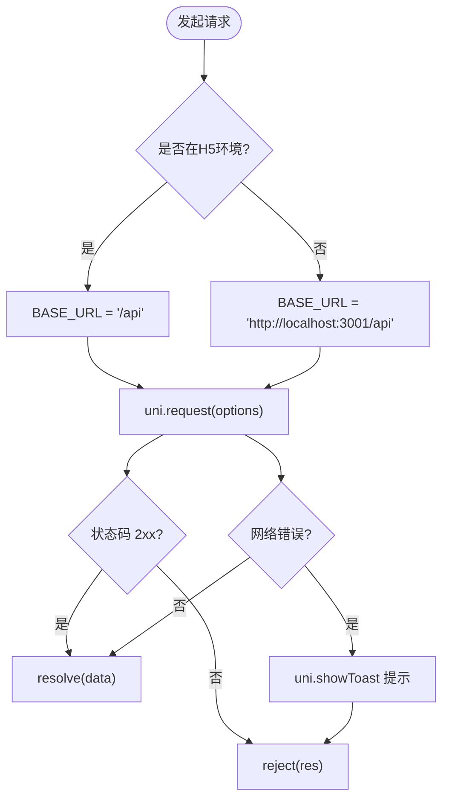
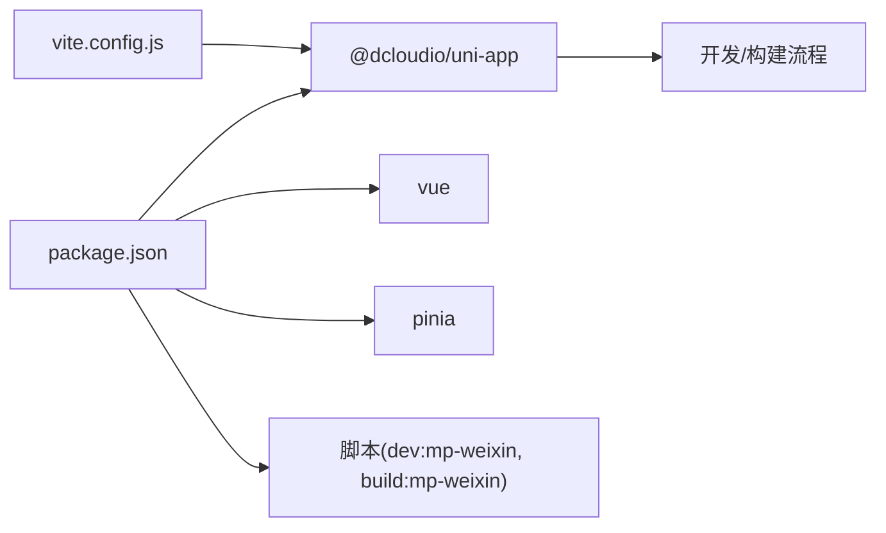

# 小程序架构

<cite>
**本文引用的文件**
- [main.js](file://star-park/miniprogram/src/main.js)
- [App.vue](file://star-park/miniprogram/src/App.vue)
- [pages.json](file://star-park/miniprogram/src/pages.json)
- [manifest.json](file://star-park/miniprogram/src/manifest.json)
- [uni.scss](file://star-park/miniprogram/src/uni.scss)
- [package.json](file://star-park/miniprogram/package.json)
- [vite.config.js](file://star-park/miniprogram/vite.config.js)
- [api/index.js](file://star-park/miniprogram/src/api/index.js)
- [components/ChildCard.vue](file://star-park/miniprogram/src/components/ChildCard.vue)
- [components/TaskItem.vue](file://star-park/miniprogram/src/components/TaskItem.vue)
- [components/PointsModal.vue](file://star-park/miniprogram/src/components/PointsModal.vue)
- [pages/index/index.vue](file://star-park/miniprogram/src/pages/index/index.vue)
- [pages/checkin/index.vue](file://star-park/miniprogram/src/pages/checkin/index.vue)
- [docs/design-docs/miniprogram.md](file://docs/design-docs/miniprogram.md)
- [docs/ARCHITECTURE.md](file://docs/ARCHITECTURE.md)
- [star-park/README.md](file://star-park/README.md)
</cite>

## 目录
1. [引言](#引言)
2. [项目结构](#项目结构)
3. [核心组件](#核心组件)
4. [架构总览](#架构总览)
5. [详细组件分析](#详细组件分析)
6. [依赖关系分析](#依赖关系分析)
7. [性能考虑](#性能考虑)
8. [故障排查指南](#故障排查指南)
9. [结论](#结论)
10. [附录](#附录)

## 引言
本文件面向StarParadise小程序端，系统性梳理基于uni-app的跨平台小程序前端架构。重点覆盖：小程序入口初始化、页面路由配置、组件体系、跨平台适配与响应式设计、移动端交互优化、生命周期与事件处理、数据绑定模式、与PC端共享代码策略、组件复用与API封装，并给出最佳实践与性能优化建议。

## 项目结构
- 小程序端位于 star-park/miniprogram/src，采用 uni-app + Vue 3 + Pinia 的技术栈。
- 顶层 package.json 提供构建与预览脚本，vite.config.js 配置H5代理与开发服务器。
- pages.json 定义页面清单、全局样式与底部tabBar；manifest.json 配置小程序应用信息与编译设置。
- 核心入口 main.js 使用 createSSRApp 创建应用实例；根组件 App.vue 定义应用生命周期钩子与全局样式。
- 组件层 components 提供可复用的业务组件；页面层 pages 提供业务页面；api 层封装HTTP请求。

**图示来源**
- [main.js:1-8](file://star-park/miniprogram/src/main.js#L1-L8)
- [App.vue:1-26](file://star-park/miniprogram/src/App.vue#L1-L26)
- [pages.json:1-54](file://star-park/miniprogram/src/pages.json#L1-L54)
- [uni.scss:1-17](file://star-park/miniprogram/src/uni.scss#L1-L17)
- [api/index.js:1-75](file://star-park/miniprogram/src/api/index.js#L1-L75)
- [pages/index/index.vue:1-194](file://star-park/miniprogram/src/pages/index/index.vue#L1-L194)
- [pages/checkin/index.vue:1-322](file://star-park/miniprogram/src/pages/checkin/index.vue#L1-L322)
- [components/ChildCard.vue:1-162](file://star-park/miniprogram/src/components/ChildCard.vue#L1-L162)
- [components/TaskItem.vue:1-133](file://star-park/miniprogram/src/components/TaskItem.vue#L1-L133)
- [components/PointsModal.vue:1-241](file://star-park/miniprogram/src/components/PointsModal.vue#L1-L241)

**章节来源**
- [star-park/README.md:55-69](file://star-park/README.md#L55-L69)
- [package.json:1-28](file://star-park/miniprogram/package.json#L1-L28)
- [vite.config.js:1-17](file://star-park/miniprogram/vite.config.js#L1-L17)

## 核心组件
- 应用入口与生命周期
  - 入口函数 createApp 返回 { app }，遵循 uni-app 规范。
  - App.vue 使用 onLaunch/onShow/onHide 生命周期钩子进行应用级事件处理。
- 页面路由与tabBar
  - pages.json 声明页面路径与导航栏标题；全局样式统一导航栏与背景色；tabBar 定义五个页面入口及图标。
- 组件系统
  - ChildCard：展示孩子信息、打卡状态、连续天数与余额。
  - TaskItem：展示任务名称、描述、奖励、完成态与禁用态。
  - PointsModal：特殊积分奖励弹窗，支持选择孩子、输入分值与理由。
- API封装
  - api/index.js 封装 uni.request，按环境动态拼接BASE_URL，统一处理状态码与错误提示。
- 样式与主题
  - uni.scss 定义主色、背景、文本、边框、圆角与阴影等全局变量，页面样式通过 scoped 与变量统一风格。

**章节来源**
- [main.js:1-8](file://star-park/miniprogram/src/main.js#L1-L8)
- [App.vue:1-26](file://star-park/miniprogram/src/App.vue#L1-L26)
- [pages.json:1-54](file://star-park/miniprogram/src/pages.json#L1-L54)
- [uni.scss:1-17](file://star-park/miniprogram/src/uni.scss#L1-L17)
- [api/index.js:1-75](file://star-park/miniprogram/src/api/index.js#L1-L75)
- [components/ChildCard.vue:1-162](file://star-park/miniprogram/src/components/ChildCard.vue#L1-L162)
- [components/TaskItem.vue:1-133](file://star-park/miniprogram/src/components/TaskItem.vue#L1-L133)
- [components/PointsModal.vue:1-241](file://star-park/miniprogram/src/components/PointsModal.vue#L1-L241)

## 架构总览
- 前后端分离：小程序前端通过 HTTP 与后端服务通信，避免直接依赖后端模块。
- 跨平台适配：通过 uni-app 在微信小程序与H5之间共享代码；manifest.json 配置 mp-weixin 编译参数与代理。
- 组件化与复用：页面组件组合基础UI组件，公共业务组件在多页面复用。
- 状态与数据流：页面内使用 ref/computed 管理本地状态；通过 api 封装调用后端接口，返回数据驱动视图更新。

**图示来源**
- [main.js:1-8](file://star-park/miniprogram/src/main.js#L1-L8)
- [App.vue:1-26](file://star-park/miniprogram/src/App.vue#L1-L26)
- [pages.json:1-54](file://star-park/miniprogram/src/pages.json#L1-L54)
- [uni.scss:1-17](file://star-park/miniprogram/src/uni.scss#L1-L17)
- [api/index.js:1-75](file://star-park/miniprogram/src/api/index.js#L1-L75)
- [components/ChildCard.vue:1-162](file://star-park/miniprogram/src/components/ChildCard.vue#L1-L162)
- [components/TaskItem.vue:1-133](file://star-park/miniprogram/src/components/TaskItem.vue#L1-L133)
- [components/PointsModal.vue:1-241](file://star-park/miniprogram/src/components/PointsModal.vue#L1-L241)
- [pages/index/index.vue:1-194](file://star-park/miniprogram/src/pages/index/index.vue#L1-L194)
- [pages/checkin/index.vue:1-322](file://star-park/miniprogram/src/pages/checkin/index.vue#L1-L322)

## 详细组件分析

### 页面与路由：首页与打卡页
- 首页 index
  - 展示问候语、日期与完成度；渲染 ChildCard 列表；计算最长连续、周完成率与总余额；跳转到打卡页。
  - 生命周期：onMounted 与 onShow 均触发数据加载，保证进入前台刷新最新数据。
- 打卡页 checkin
  - 孩子选择器、任务列表、积分奖励入口、提交按钮与统计卡片；支持特殊积分奖励弹窗；根据当日打卡记录标记任务完成态。

**图示来源**
- [pages/index/index.vue:100-124](file://star-park/miniprogram/src/pages/index/index.vue#L100-L124)
- [api/index.js:35-37](file://star-park/miniprogram/src/api/index.js#L35-L37)

**图示来源**
- [pages/checkin/index.vue:165-192](file://star-park/miniprogram/src/pages/checkin/index.vue#L165-L192)
- [api/index.js:45-46](file://star-park/miniprogram/src/api/index.js#L45-L46)

**章节来源**
- [pages/index/index.vue:1-194](file://star-park/miniprogram/src/pages/index/index.vue#L1-L194)
- [pages/checkin/index.vue:1-322](file://star-park/miniprogram/src/pages/checkin/index.vue#L1-L322)

### 组件系统：ChildCard、TaskItem、PointsModal
- ChildCard
  - 属性：name、avatarText、color、taskDesc、checkedIn、streak、balance。
  - 事件：tap，用于点击卡片跳转。
  - 样式：scoped + uni.scss 变量，统一圆角、阴影与颜色。
- TaskItem
  - 属性：name、desc、reward、done、disabled。
  - 事件：toggle，用于切换任务完成态；当 disabled 时阻止交互。
  - 样式：完成态与禁用态视觉差异明显。
- PointsModal
  - 属性：visible、children、defaultChildId。
  - 事件：close、submitted，用于关闭与回传新余额。
  - 逻辑：校验输入、调用 addPoints、回传新余额并提示。

**图示来源**
- [components/ChildCard.vue:31-42](file://star-park/miniprogram/src/components/ChildCard.vue#L31-L42)
- [components/TaskItem.vue:21-36](file://star-park/miniprogram/src/components/TaskItem.vue#L21-L36)
- [components/PointsModal.vue:59-102](file://star-park/miniprogram/src/components/PointsModal.vue#L59-L102)
- [pages/index/index.vue:10-23](file://star-park/miniprogram/src/pages/index/index.vue#L10-L23)
- [pages/checkin/index.vue:53-62](file://star-park/miniprogram/src/pages/checkin/index.vue#L53-L62)

**章节来源**
- [components/ChildCard.vue:1-162](file://star-park/miniprogram/src/components/ChildCard.vue#L1-L162)
- [components/TaskItem.vue:1-133](file://star-park/miniprogram/src/components/TaskItem.vue#L1-L133)
- [components/PointsModal.vue:1-241](file://star-park/miniprogram/src/components/PointsModal.vue#L1-L241)

### API封装与跨平台适配
- 环境判断与URL拼接：在H5模式下使用相对路径并通过Vite代理转发；在小程序模式下使用完整URL。
- 统一请求封装：封装 uni.request，统一处理状态码与失败回调，失败时通过 uni.showToast 提示。
- 接口定义：涵盖仪表盘、孩子列表、打卡记录、奖励、任务、余额、积分等常用接口。

**图示来源**
- [api/index.js:1-30](file://star-park/miniprogram/src/api/index.js#L1-L30)

**章节来源**
- [api/index.js:1-75](file://star-park/miniprogram/src/api/index.js#L1-L75)
- [vite.config.js:1-17](file://star-park/miniprogram/vite.config.js#L1-L17)
- [manifest.json:19-29](file://star-park/miniprogram/src/manifest.json#L19-L29)

## 依赖关系分析
- 构建与运行
  - package.json 定义 dev/build 脚本，依赖 @dcloudio/uni-app、vue、pinia 等。
  - vite.config.js 注册 @dcloudio/vite-plugin-uni，配置代理到后端服务。
- 代码组织与约束
  - 文档明确前后端分离，前端模块不得直接导入后端模块，仅通过HTTP通信。
  - 前端页面/视图之间禁止互相导入，避免循环依赖。

**图示来源**
- [package.json:1-28](file://star-park/miniprogram/package.json#L1-L28)
- [vite.config.js:1-17](file://star-park/miniprogram/vite.config.js#L1-L17)

**章节来源**
- [docs/ARCHITECTURE.md:88-96](file://docs/ARCHITECTURE.md#L88-L96)
- [docs/ARCHITECTURE.md:165-201](file://docs/ARCHITECTURE.md#L165-L201)

## 性能考虑
- 网络请求
  - 合理使用缓存与去抖：在 onShow 中刷新数据，避免重复请求；对高频接口可增加本地缓存。
  - 错误快速反馈：统一 toast 提示，减少用户等待时间。
- 视图渲染
  - 列表渲染：使用 v-for + key，避免不必要的重排；对长列表可考虑虚拟滚动（如后续扩展）。
  - 动画与过渡：成功弹窗使用轻量动画，避免复杂滤镜与阴影叠加导致掉帧。
- 资源与体积
  - 图标与静态资源：tabBar图标按需加载，避免过大图片；合理拆分样式，减少重复。
  - 构建优化：开启压缩与按需打包，减少首屏体积。
- 交互体验
  - 按钮禁用态：提交按钮根据 canSubmit 控制禁用，避免无效点击。
  - 输入校验：积分弹窗对数值与必填项进行即时校验，减少后端压力。

## 故障排查指南
- 网络请求失败
  - 现象：uni.showToast 提示“网络请求失败”。
  - 排查：确认后端服务已启动、代理配置正确、BASE_URL 与接口路径无误。
- 打卡提交异常
  - 现象：提交后未更新或提示失败。
  - 排查：检查 createCheckin 参数完整性、后端接口返回状态、前端错误日志。
- 页面空白或样式异常
  - 现象：页面不显示或样式错乱。
  - 排查：检查 pages.json 路径与 tabBar 配置、uni.scss 变量是否正确引入、组件 scoped 样式作用域。

**章节来源**
- [api/index.js:24-28](file://star-park/miniprogram/src/api/index.js#L24-L28)
- [pages/checkin/index.vue:184-188](file://star-park/miniprogram/src/pages/checkin/index.vue#L184-L188)
- [pages/checkin/index.vue:169-171](file://star-park/miniprogram/src/pages/checkin/index.vue#L169-L171)

## 结论
本架构以 uni-app 为核心，结合 Vue 3 组件化与 Pinia 状态管理，实现了跨平台小程序的高效开发与维护。通过清晰的页面路由、可复用的业务组件与统一的API封装，满足了家庭激励管理系统的日常使用需求。建议持续关注网络与渲染性能优化，完善错误监控与埋点，进一步提升用户体验与稳定性。

## 附录
- 最佳实践
  - 生命周期：在 onShow 中刷新数据，在 onMounted 中做一次性初始化。
  - 事件处理：组件间通过 props/emit 解耦，避免直接操作 DOM。
  - 样式：优先使用 uni.scss 变量，保持主题一致性；尽量使用 rpx 单位适配多设备。
  - 构建：使用脚本一键启动开发与构建，确保 H5 与小程序两端一致。
- 与PC端共享策略
  - 通过文档与契约约束前后端接口，前端页面/组件严格通过HTTP通信，避免直接依赖后端模块。
  - 组件复用：将通用业务组件沉淀至公共库，两端按需引入。

**章节来源**
- [docs/design-docs/miniprogram.md:1-81](file://docs/design-docs/miniprogram.md#L1-L81)
- [docs/ARCHITECTURE.md:88-96](file://docs/ARCHITECTURE.md#L88-L96)
- [star-park/README.md:13-20](file://star-park/README.md#L13-L20)