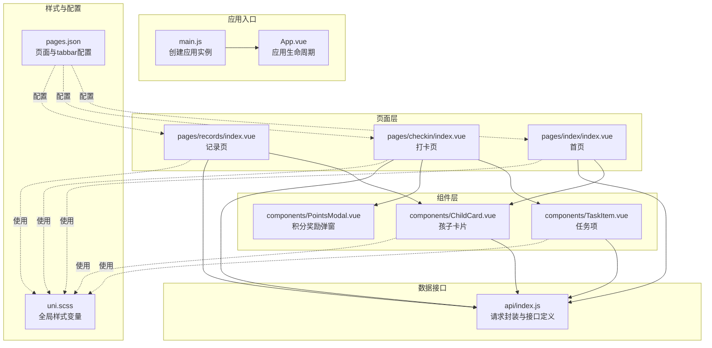
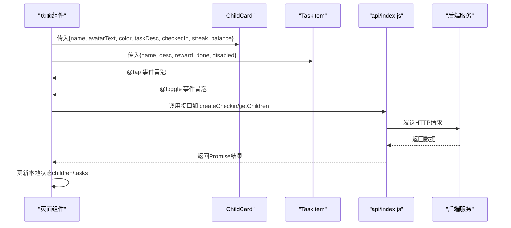
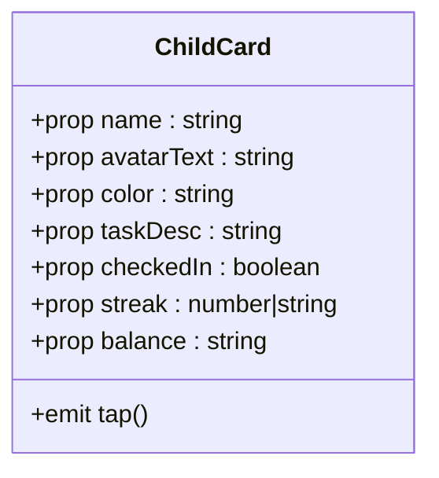
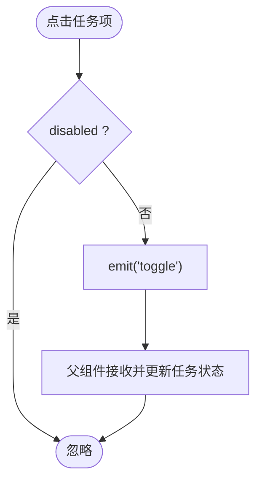
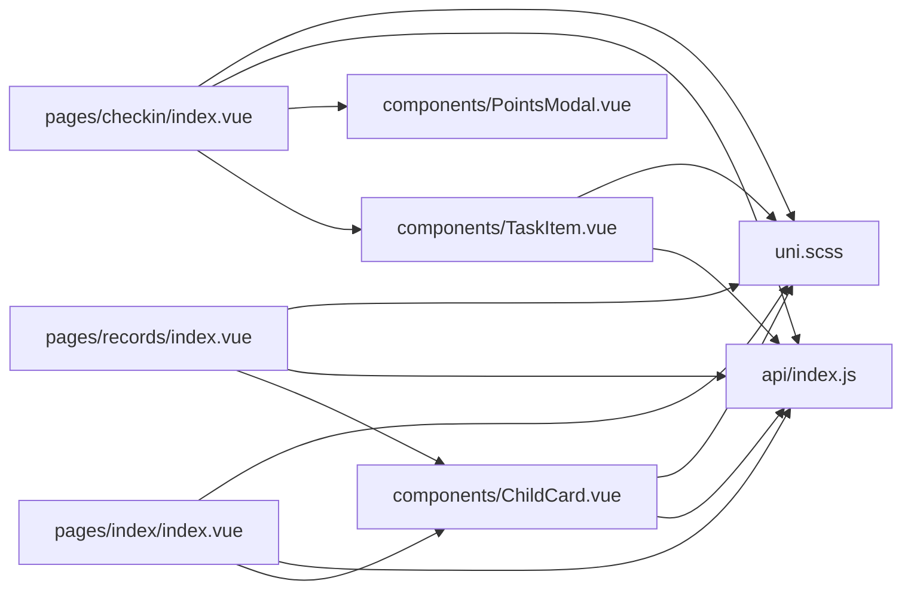

# 组件系统设计

<cite>
**本文引用的文件**
- [ChildCard.vue](file://star-park/miniprogram/src/components/ChildCard.vue)
- [TaskItem.vue](file://star-park/miniprogram/src/components/TaskItem.vue)
- [PointsModal.vue](file://star-park/miniprogram/src/components/PointsModal.vue)
- [index.vue（首页）](file://star-park/miniprogram/src/pages/index/index.vue)
- [index.vue（打卡页）](file://star-park/miniprogram/src/pages/checkin/index.vue)
- [index.vue（记录页）](file://star-park/miniprogram/src/pages/records/index.vue)
- [App.vue](file://star-park/miniprogram/src/App.vue)
- [main.js](file://star-park/miniprogram/src/main.js)
- [uni.scss](file://star-park/miniprogram/src/uni.scss)
- [pages.json](file://star-park/miniprogram/src/pages.json)
- [api/index.js](file://star-park/miniprogram/src/api/index.js)
</cite>

## 目录
1. [简介](#简介)
2. [项目结构](#项目结构)
3. [核心组件](#核心组件)
4. [架构总览](#架构总览)
5. [组件详解](#组件详解)
6. [依赖关系分析](#依赖关系分析)
7. [性能考量](#性能考量)
8. [故障排查指南](#故障排查指南)
9. [结论](#结论)
10. [附录](#附录)

## 简介
本文件面向 StarParadise 小程序的组件化体系，重点围绕可复用组件的设计理念与实现方式进行系统化梳理，涵盖 ChildCard 孩子信息展示组件与 TaskItem 任务项渲染组件。内容包括：
- 组件的 props 属性定义与类型约束
- 事件处理机制与父子通信
- 样式封装策略与主题变量管理
- 页面与组件的通信方式（父子数据传递、事件冒泡）
- 小程序生命周期钩子在组件中的应用
- 组件开发规范、命名约定与样式管理最佳实践
- 复用策略与性能优化技巧

## 项目结构
该小程序采用基于 Vue 3 + UniApp 的跨端开发框架，组件统一放置于 src/components 目录下，页面位于 src/pages 下，全局样式变量集中于 uni.scss，页面路由配置在 pages.json 中，应用入口在 main.js 中创建。

图表来源
- [main.js:1-8](file://star-park/miniprogram/src/main.js#L1-L8)
- [App.vue:1-26](file://star-park/miniprogram/src/App.vue#L1-L26)
- [index.vue（首页）:1-194](file://star-park/miniprogram/src/pages/index/index.vue#L1-L194)
- [index.vue（打卡页）:1-322](file://star-park/miniprogram/src/pages/checkin/index.vue#L1-L322)
- [index.vue（记录页）:1-460](file://star-park/miniprogram/src/pages/records/index.vue#L1-L460)
- [ChildCard.vue:1-162](file://star-park/miniprogram/src/components/ChildCard.vue#L1-L162)
- [TaskItem.vue:1-133](file://star-park/miniprogram/src/components/TaskItem.vue#L1-L133)
- [PointsModal.vue:1-241](file://star-park/miniprogram/src/components/PointsModal.vue#L1-L241)
- [uni.scss:1-17](file://star-park/miniprogram/src/uni.scss#L1-L17)
- [pages.json:1-54](file://star-park/miniprogram/src/pages.json#L1-L54)
- [api/index.js:1-75](file://star-park/miniprogram/src/api/index.js#L1-L75)

章节来源
- [main.js:1-8](file://star-park/miniprogram/src/main.js#L1-L8)
- [App.vue:1-26](file://star-park/miniprogram/src/App.vue#L1-L26)
- [pages.json:1-54](file://star-park/miniprogram/src/pages.json#L1-L54)

## 核心组件
本节聚焦两个关键可复用组件：ChildCard（孩子信息展示）与 TaskItem（任务列表渲染）。它们均采用 Composition API 与单文件组件形式，具备明确的 props 定义、事件发射与样式封装。

- ChildCard 组件
  - 功能：展示孩子头像、姓名、当前任务描述、打卡状态徽章、连续打卡与累计余额等信息；支持点击事件冒泡。
  - 关键点：props 包含 name、avatarText、color、taskDesc、checkedIn、streak、balance；通过类名动态切换“已打卡”视觉态；样式使用 scoped 与全局变量。
- TaskItem 组件
  - 功能：渲染任务名称、描述、奖励金额，支持勾选切换；禁用态不可交互；完成态样式变化。
  - 关键点：props 包含 name、desc、reward、done、disabled；通过 emit('toggle') 向父组件传递变更意图；内部 handleToggle 控制事件触发条件。

章节来源
- [ChildCard.vue:1-162](file://star-park/miniprogram/src/components/ChildCard.vue#L1-L162)
- [TaskItem.vue:1-133](file://star-park/miniprogram/src/components/TaskItem.vue#L1-L133)

## 架构总览
组件与页面的交互遵循“页面持有状态，组件负责展示与事件发射”的原则。页面通过 props 将数据传入组件，组件通过 emit 将用户操作反馈给页面，页面再进行状态更新与副作用处理（如网络请求）。

图表来源
- [index.vue（首页）:1-194](file://star-park/miniprogram/src/pages/index/index.vue#L1-L194)
- [index.vue（打卡页）:1-322](file://star-park/miniprogram/src/pages/checkin/index.vue#L1-L322)
- [ChildCard.vue:1-162](file://star-park/miniprogram/src/components/ChildCard.vue#L1-L162)
- [TaskItem.vue:1-133](file://star-park/miniprogram/src/components/TaskItem.vue#L1-L133)
- [api/index.js:1-75](file://star-park/miniprogram/src/api/index.js#L1-L75)

## 组件详解

### ChildCard 组件
- 设计理念
  - 卡片式布局，强调信息层级与可读性；通过颜色条与徽章传达状态；支持点击进入详情或打卡流程。
  - 使用 scoped 样式隔离，配合 uni.scss 全局变量统一主题风格。
- Props 定义
  - name：字符串，默认空；用于显示孩子姓名。
  - avatarText：字符串，默认空；用于头像占位文本。
  - color：字符串，默认品牌色；用于头像背景与颜色条。
  - taskDesc：字符串，默认空；用于显示当前任务描述。
  - checkedIn：布尔，默认 false；控制卡片整体视觉态。
  - streak：数字/字符串，默认 0；连续打卡天数。
  - balance：字符串，默认 ¥0；累计余额。
- 事件处理
  - 定义 tap 事件，供父组件监听卡片点击行为。
- 样式封装
  - 使用 scoped 作用域避免样式污染；通过 uni.scss 变量控制主色、阴影、圆角等。
  - 类名采用 BEM 风格，便于维护与扩展。
- 生命周期与页面通信
  - 在首页中作为子组件被渲染，通过 props 接收数据；点击事件用于跳转到打卡页。
  - 页面在 onMounted/onShow 中拉取仪表盘数据，驱动 ChildCard 渲染。

图表来源
- [ChildCard.vue:31-42](file://star-park/miniprogram/src/components/ChildCard.vue#L31-L42)

章节来源
- [ChildCard.vue:1-162](file://star-park/miniprogram/src/components/ChildCard.vue#L1-L162)
- [index.vue（首页）:1-194](file://star-park/miniprogram/src/pages/index/index.vue#L1-L194)

### TaskItem 组件
- 设计理念
  - 任务项采用左右布局：左侧为勾选框，中间为任务信息，右侧为奖励与完成标签；完成态与禁用态视觉差异明显。
- Props 定义
  - name：字符串，默认空；任务名称。
  - desc：字符串，默认空；任务描述。
  - reward：字符串，默认空；奖励金额。
  - done：布尔，默认 false；是否已完成。
  - disabled：布尔，默认 false；是否禁用交互。
- 事件处理
  - 定义 toggle 事件；内部 handleToggle 在未禁用时触发 emit('toggle')。
- 样式封装
  - 使用 scoped 与 BEM 命名，完成态与禁用态通过类名切换。
- 页面通信
  - 打卡页通过 v-for 渲染任务列表，绑定 name/desc/reward/done/disabled，并监听 @toggle 事件以切换任务完成状态。

图表来源
- [TaskItem.vue:21-36](file://star-park/miniprogram/src/components/TaskItem.vue#L21-L36)
- [index.vue（打卡页）:53-62](file://star-park/miniprogram/src/pages/checkin/index.vue#L53-L62)

章节来源
- [TaskItem.vue:1-133](file://star-park/miniprogram/src/components/TaskItem.vue#L1-L133)
- [index.vue（打卡页）:1-322](file://star-park/miniprogram/src/pages/checkin/index.vue#L1-L322)

### PointsModal 组件（补充）
- 设计理念
  - 作为弹窗组件，提供特殊积分奖励入口，支持选择孩子、输入积分与理由，并通过事件向父组件回传结果。
- 关键点
  - props：visible、children、defaultChildId；emit：close、submitted。
  - 使用 watch 监听 visible，在打开时重置表单。
  - 提交时校验输入并调用 api.addPoints，成功后回传新余额。

章节来源
- [PointsModal.vue:1-241](file://star-park/miniprogram/src/components/PointsModal.vue#L1-L241)
- [index.vue（打卡页）:33-39](file://star-park/miniprogram/src/pages/checkin/index.vue#L33-L39)

## 依赖关系分析
- 组件依赖
  - ChildCard/TaskItem 均依赖 uni.scss 的全局变量，确保主题一致性。
  - 页面组件依赖 api/index.js 进行数据获取与提交。
- 页面与组件耦合
  - 页面通过 props 向组件注入数据，组件通过 emit 向页面反馈事件，形成清晰的单向数据流。
- 外部依赖
  - uni-app 提供生命周期钩子（onMounted/onShow/onHide）与平台能力（uni.request、uni.showToast 等）。

图表来源
- [index.vue（首页）:1-194](file://star-park/miniprogram/src/pages/index/index.vue#L1-L194)
- [index.vue（打卡页）:1-322](file://star-park/miniprogram/src/pages/checkin/index.vue#L1-L322)
- [index.vue（记录页）:1-460](file://star-park/miniprogram/src/pages/records/index.vue#L1-L460)
- [ChildCard.vue:1-162](file://star-park/miniprogram/src/components/ChildCard.vue#L1-L162)
- [TaskItem.vue:1-133](file://star-park/miniprogram/src/components/TaskItem.vue#L1-L133)
- [PointsModal.vue:1-241](file://star-park/miniprogram/src/components/PointsModal.vue#L1-L241)
- [api/index.js:1-75](file://star-park/miniprogram/src/api/index.js#L1-L75)
- [uni.scss:1-17](file://star-park/miniprogram/src/uni.scss#L1-L17)

章节来源
- [api/index.js:1-75](file://star-park/miniprogram/src/api/index.js#L1-L75)
- [uni.scss:1-17](file://star-park/miniprogram/src/uni.scss#L1-L17)

## 性能考量
- 列表渲染优化
  - 使用 v-for 渲染任务与卡片时，务必提供稳定 key（如 child.id/task.id），减少 DOM 重建。
  - 对大列表可考虑虚拟滚动或分页加载，降低首屏压力。
- 事件处理
  - 在 TaskItem 内部对禁用态进行早返回，避免无效计算与网络请求。
- 样式与主题
  - 统一使用 uni.scss 变量，减少重复计算与样式不一致导致的重绘。
- 生命周期
  - 在 onMounted/onShow 中按需加载数据，避免重复请求；在页面切换时及时清理定时器与订阅。
- 网络请求
  - 使用 api/index.js 的统一请求封装，集中处理错误提示与状态码判断，减少重复逻辑。

[本节为通用指导，无需列出具体文件来源]

## 故障排查指南
- 事件未触发
  - 检查组件是否正确定义 emits 并在模板中绑定 @xxx；父组件是否监听对应事件名。
- 数据未更新
  - 确认父组件是否修改了响应式数据（ref/reactive）；检查 v-model 或直接赋值是否生效。
- 样式异常
  - 检查 scoped 样式是否覆盖到子元素；确认 uni.scss 变量是否正确引入。
- 生命周期问题
  - onMounted 仅在首次挂载执行，onShow 在每次显示都会触发；根据场景选择合适的钩子。
- 网络请求失败
  - 查看 api/index.js 的错误分支与 toast 提示；确认 BASE_URL 与代理配置。

章节来源
- [TaskItem.vue:21-36](file://star-park/miniprogram/src/components/TaskItem.vue#L21-L36)
- [index.vue（打卡页）:165-192](file://star-park/miniprogram/src/pages/checkin/index.vue#L165-L192)
- [api/index.js:1-75](file://star-park/miniprogram/src/api/index.js#L1-L75)

## 结论
ChildCard 与 TaskItem 作为可复用组件，通过明确的 props 与事件机制实现了页面与组件之间的清晰通信；结合 uni.scss 主题变量与 scoped 样式，保证了组件的一致性与可维护性。在实际业务中，建议：
- 严格遵循 props 类型与默认值约定
- 明确事件命名与参数结构
- 使用生命周期钩子合理加载数据
- 通过抽象与组合提升复用度与性能

[本节为总结性内容，无需列出具体文件来源]

## 附录

### 组件开发规范与命名约定
- 命名
  - 组件文件采用 PascalCase（如 ChildCard.vue、TaskItem.vue）
  - 样式类名采用 BEM 风格（如 child-card__header）
- Props
  - 明确类型与默认值；必要时提供校验
  - 避免在组件内直接修改传入的 props
- 事件
  - 事件名使用 kebab-case；携带必要上下文参数
  - 仅在必要时 emit 事件，避免过度解耦
- 样式
  - 优先使用 scoped；通过 uni.scss 统一主题变量
  - 避免深度选择器与 !important
- 生命周期
  - onMounted：首次加载数据
  - onShow：每次显示刷新数据
  - onHide：清理定时器与订阅

章节来源
- [ChildCard.vue:1-162](file://star-park/miniprogram/src/components/ChildCard.vue#L1-L162)
- [TaskItem.vue:1-133](file://star-park/miniprogram/src/components/TaskItem.vue#L1-L133)
- [uni.scss:1-17](file://star-park/miniprogram/src/uni.scss#L1-L17)

### 页面与组件通信清单
- 首页（ChildCard）
  - 父组件：pages/index/index.vue
  - 传入 props：name、avatarText、color、taskDesc、checkedIn、streak、balance
  - 监听事件：@tap
- 打卡页（TaskItem）
  - 父组件：pages/checkin/index.vue
  - 传入 props：name、desc、reward、done、disabled
  - 监听事件：@toggle
- 打卡页（PointsModal）
  - 父组件：pages/checkin/index.vue
  - 传入 props：visible、children、defaultChildId
  - 监听事件：@close、@submitted

章节来源
- [index.vue（首页）:1-194](file://star-park/miniprogram/src/pages/index/index.vue#L1-L194)
- [index.vue（打卡页）:1-322](file://star-park/miniprogram/src/pages/checkin/index.vue#L1-L322)
- [PointsModal.vue:1-241](file://star-park/miniprogram/src/components/PointsModal.vue#L1-L241)