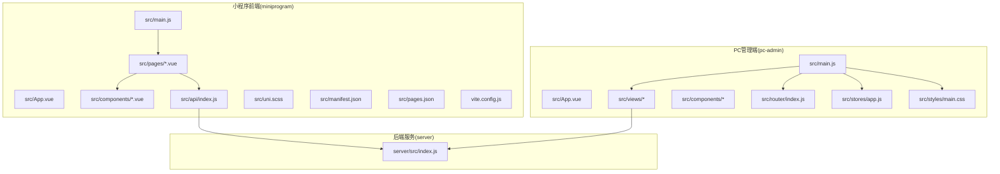
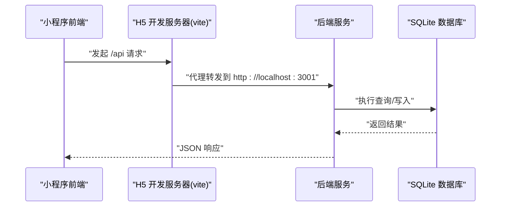
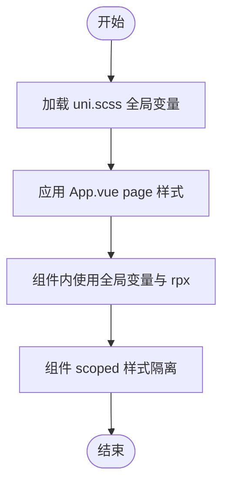
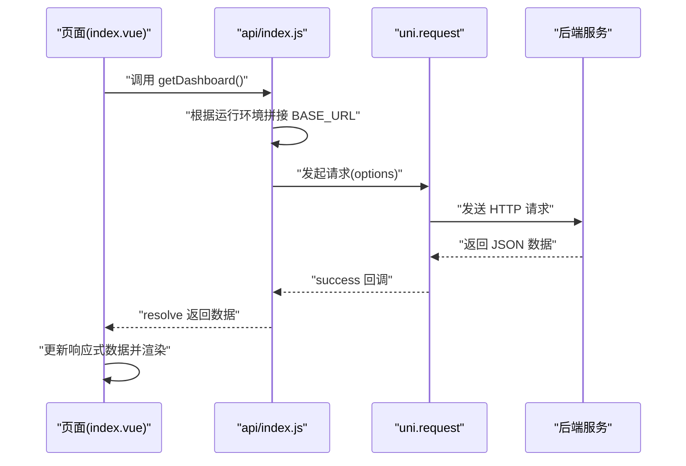
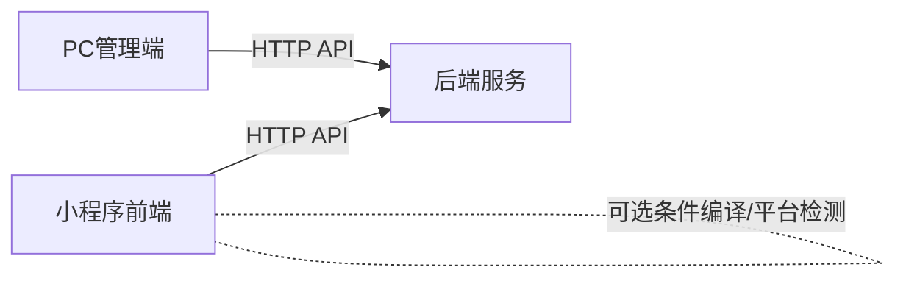

# 跨平台适配策略

<cite>
**本文引用的文件**
- [uni.scss](file://star-park/miniprogram/src/uni.scss)
- [main.js](file://star-park/miniprogram/src/main.js)
- [App.vue](file://star-park/miniprogram/src/App.vue)
- [pages.json](file://star-park/miniprogram/src/pages.json)
- [manifest.json](file://star-park/miniprogram/src/manifest.json)
- [api/index.js](file://star-park/miniprogram/src/api/index.js)
- [ChildCard.vue](file://star-park/miniprogram/src/components/ChildCard.vue)
- [TaskItem.vue](file://star-park/miniprogram/src/components/TaskItem.vue)
- [pages/index/index.vue](file://star-park/miniprogram/src/pages/index/index.vue)
- [vite.config.js](file://star-park/miniprogram/vite.config.js)
- [pc-admin/main.js](file://star-park/pc-admin/src/main.js)
- [pc-admin/App.vue](file://star-park/pc-admin/src/App.vue)
- [pc-admin/package.json](file://star-park/pc-admin/src/package.json)
- [server/index.js](file://star-park/server/src/index.js)
- [ARCHITECTURE.md](file://docs/ARCHITECTURE.md)
</cite>

## 目录
1. [引言](#引言)
2. [项目结构](#项目结构)
3. [核心组件](#核心组件)
4. [架构总览](#架构总览)
5. [详细组件分析](#详细组件分析)
6. [依赖关系分析](#依赖关系分析)
7. [性能考虑](#性能考虑)
8. [故障排查指南](#故障排查指南)
9. [结论](#结论)
10. [附录](#附录)

## 引言
本文件面向StarParadise小程序跨平台适配策略，系统化阐述uni-app如何在一套代码基础上实现H5、小程序、APP等多端运行；详解CSS样式适配（全局变量、平台差异、响应式）、JavaScript平台兼容性（API条件判断、平台特性降级）、以及小程序特有API（wx对象封装、本地存储、网络请求）的使用方式。同时给出最佳实践、常见问题与性能优化建议，帮助开发者高效构建与维护跨平台应用。

## 项目结构
项目采用monorepo组织，包含后端服务与两个前端子项目：小程序前端（基于uni-app）与PC管理端（基于Vue 3）。整体结构清晰，职责边界明确，前端页面/视图不互相导入，仅通过HTTP API与后端交互，符合架构约束。

图表来源
- [ARCHITECTURE.md:14-71](file://docs/ARCHITECTURE.md#L14-L71)

章节来源
- [ARCHITECTURE.md:1-209](file://docs/ARCHITECTURE.md#L1-L209)

## 核心组件
- uni-app应用入口与生命周期：小程序端通过统一入口创建应用实例，并在App.vue中注册应用生命周期事件，确保跨端一致的行为。
- 页面与导航：pages.json集中声明页面、全局样式与tabBar配置，保证不同端的导航一致性。
- 平台配置：manifest.json针对小程序与H5分别设置运行参数与代理，H5端通过vite dev server代理到后端服务。
- API封装：小程序端统一使用uni.request进行网络请求，自动根据运行环境选择基础URL，屏蔽平台差异。
- 组件化UI：通过可复用组件（如ChildCard、TaskItem）结合uni.scss全局变量，实现一致的视觉与交互体验。

章节来源
- [main.js:1-8](file://star-park/miniprogram/src/main.js#L1-L8)
- [App.vue:1-26](file://star-park/miniprogram/src/App.vue#L1-L26)
- [pages.json:1-54](file://star-park/miniprogram/src/pages.json#L1-L54)
- [manifest.json:1-31](file://star-park/miniprogram/src/manifest.json#L1-L31)
- [vite.config.js:1-17](file://star-park/miniprogram/vite.config.js#L1-L17)
- [api/index.js:1-75](file://star-park/miniprogram/src/api/index.js#L1-L75)
- [uni.scss:1-17](file://star-park/miniprogram/src/uni.scss#L1-L17)

## 架构总览
下图展示了跨平台适配的关键交互链路：小程序端与PC管理端均通过HTTP API访问后端服务，小程序端在H5模式下通过vite代理转发请求，确保开发期与生产期的一致性。

图表来源
- [api/index.js:1-30](file://star-park/miniprogram/src/api/index.js#L1-L30)
- [vite.config.js:6-15](file://star-park/miniprogram/vite.config.js#L6-L15)
- [manifest.json:19-29](file://star-park/miniprogram/src/manifest.json#L19-L29)
- [server/index.js:16-28](file://star-park/server/src/index.js#L16-L28)

## 详细组件分析

### CSS样式适配与全局变量
- 全局SCSS变量：通过uni.scss集中定义主题色、圆角、阴影、字号等变量，组件内统一引用，便于跨端统一风格。
- 页面级样式：App.vue中的全局page样式设置字体族、字号、行高与背景色，确保小程序端基础排版一致。
- 组件级样式：ChildCard与TaskItem使用scoped样式与全局变量，配合flex布局与rpx单位，实现响应式与跨端兼容。
- 平台差异：当前未见显式的条件编译示例，建议在需要时使用uni-app条件编译或平台检测，按需覆盖样式。

图表来源
- [uni.scss:1-17](file://star-park/miniprogram/src/uni.scss#L1-L17)
- [App.vue:17-25](file://star-park/miniprogram/src/App.vue#L17-L25)
- [ChildCard.vue:45-160](file://star-park/miniprogram/src/components/ChildCard.vue#L45-L160)
- [TaskItem.vue:38-132](file://star-park/miniprogram/src/components/TaskItem.vue#L38-L132)

章节来源
- [uni.scss:1-17](file://star-park/miniprogram/src/uni.scss#L1-L17)
- [App.vue:17-25](file://star-park/miniprogram/src/App.vue#L17-L25)
- [ChildCard.vue:45-160](file://star-park/miniprogram/src/components/ChildCard.vue#L45-L160)
- [TaskItem.vue:38-132](file://star-park/miniprogram/src/components/TaskItem.vue#L38-L132)

### JavaScript平台兼容性与API封装
- 运行环境识别：通过检测window对象是否存在决定请求基础URL，从而在H5与小程序端自动切换。
- 统一请求封装：request函数对uni.request进行二次封装，统一处理状态码、错误提示与Promise化，简化调用方逻辑。
- 页面跳转与生命周期：页面通过uni.switchTab进行跳转，生命周期使用onShow/onMounted等钩子，确保数据刷新与渲染时机正确。

图表来源
- [pages/index/index.vue:92-132](file://star-park/miniprogram/src/pages/index/index.vue#L92-L132)
- [api/index.js:1-75](file://star-park/miniprogram/src/api/index.js#L1-L75)

章节来源
- [api/index.js:1-75](file://star-park/miniprogram/src/api/index.js#L1-L75)
- [pages/index/index.vue:92-132](file://star-park/miniprogram/src/pages/index/index.vue#L92-L132)

### 小程序特有API与降级策略
- wx对象封装：当前代码使用uni.request与uni.showToast等跨端API，未直接使用wx对象。若需使用原生能力，建议通过条件判断或平台检测进行封装，避免直接依赖小程序原生API。
- 本地存储：建议统一使用uni.setStorageSync/uni.getStorageSync等跨端API，避免直接依赖浏览器localStorage。
- 网络请求：通过request函数统一封装，自动处理错误提示与状态码判断，必要时可扩展拦截器与重试机制。
- 平台特性降级：对于H5端不支持的能力（如小程序云开发、原生组件差异），应在调用前进行能力检测，提供降级方案或提示。

章节来源
- [api/index.js:7-30](file://star-park/miniprogram/src/api/index.js#L7-L30)

### 页面与导航配置
- 页面声明：pages.json集中声明所有页面与标题，确保不同端的页面结构一致。
- 全局样式：navigationBarTextStyle、navigationBarBackgroundColor、backgroundColor等统一设置，减少重复配置。
- tabBar：统一配置颜色、选中态图标与页面路径，保证底部导航一致性。

章节来源
- [pages.json:1-54](file://star-park/miniprogram/src/pages.json#L1-L54)

### H5开发与代理配置
- H5开发服务器：vite dev server监听本地端口并开启代理，将/api前缀转发至后端服务地址。
- 代理规则：通过changeOrigin与target配置，解决开发期跨域问题，保证请求路径与生产一致。

章节来源
- [vite.config.js:6-15](file://star-park/miniprogram/vite.config.js#L6-L15)
- [manifest.json:19-29](file://star-park/miniprogram/src/manifest.json#L19-L29)

### PC管理端集成要点
- 应用入口：pc-admin同样采用Vue 3入口，注册Pinia、路由与Element Plus，保持与小程序端一致的开发体验。
- 样式与组件：通过独立的样式与组件体系支撑PC端更丰富的交互与可视化需求。

章节来源
- [pc-admin/main.js:1-22](file://star-park/pc-admin/src/main.js#L1-L22)
- [pc-admin/App.vue:1-10](file://star-park/pc-admin/src/App.vue#L1-L10)
- [pc-admin/package.json:1-26](file://star-park/pc-admin/src/package.json#L1-L26)

## 依赖关系分析
- 前后端分离：前端通过HTTP API与后端交互，避免直接依赖后端模块，降低耦合度。
- 前端内部解耦：页面/视图不互相导入，组件与API模块相互独立，提升可维护性。
- 平台无关：小程序端使用uni-app API，PC端使用Vue生态，两端共享同一套后端服务。

图表来源
- [ARCHITECTURE.md:88-96](file://docs/ARCHITECTURE.md#L88-L96)
- [server/index.js:20-28](file://star-park/server/src/index.js#L20-L28)

章节来源
- [ARCHITECTURE.md:88-96](file://docs/ARCHITECTURE.md#L88-L96)
- [server/index.js:20-28](file://star-park/server/src/index.js#L20-L28)

## 性能考虑
- 请求合并与缓存：对高频接口（如仪表盘、统计）采用本地缓存与合理TTL，减少重复请求。
- 组件懒加载：对非首屏组件采用动态导入，降低初始包体。
- 图片与资源优化：使用合适尺寸与格式，启用压缩与CDN加速。
- 动画与渲染：避免在滚动中进行复杂计算，使用requestAnimationFrame与虚拟列表优化长列表。
- 网络层优化：在H5端启用Gzip/HTTP/2，合理设置缓存头；小程序端利用分包加载与按需引入。

## 故障排查指南
- 网络请求失败：检查BASE_URL与代理配置，确认后端服务是否正常启动与健康检查接口可用。
- 跨域问题：H5开发阶段确认vite代理配置，生产环境确认CORS设置。
- 生命周期异常：确认onShow/onMounted触发顺序与数据刷新逻辑，避免重复请求。
- 样式不生效：检查scoped作用域与rpx单位使用，确认uni.scss变量是否正确引入。

章节来源
- [api/index.js:1-30](file://star-park/miniprogram/src/api/index.js#L1-L30)
- [vite.config.js:6-15](file://star-park/miniprogram/vite.config.js#L6-L15)
- [server/index.js:29-32](file://star-park/server/src/index.js#L29-L32)

## 结论
本项目通过uni-app实现了小程序端的跨平台统一开发，配合统一的API封装与页面配置，有效降低了多端维护成本。建议在现有基础上进一步完善条件编译与平台检测、增强错误处理与降级策略、并持续优化网络与渲染性能，以获得更稳定的用户体验。

## 附录
- 最佳实践清单
  - 使用uni.scss集中管理主题变量，组件内统一引用。
  - 通过运行环境识别自动切换请求基础URL，避免硬编码。
  - 对网络请求进行统一封装，提供错误提示与状态码处理。
  - 在H5端使用vite代理，确保开发与生产的请求路径一致。
  - 对于平台特有能力，采用条件判断或封装，避免直接依赖原生API。
  - 对高频接口进行缓存与节流，优化首屏与交互性能。
  - 使用生命周期钩子确保数据刷新与渲染时机正确。