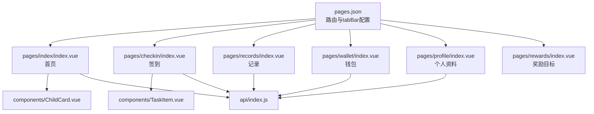
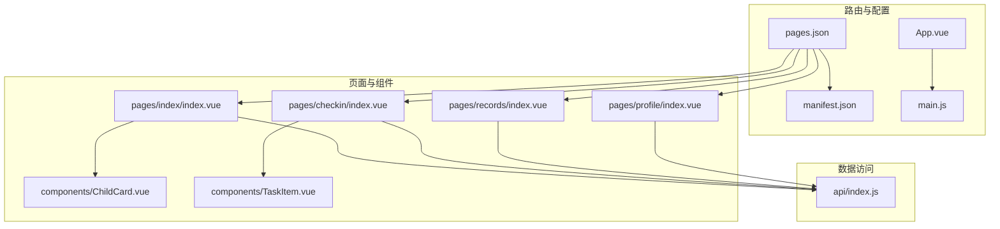
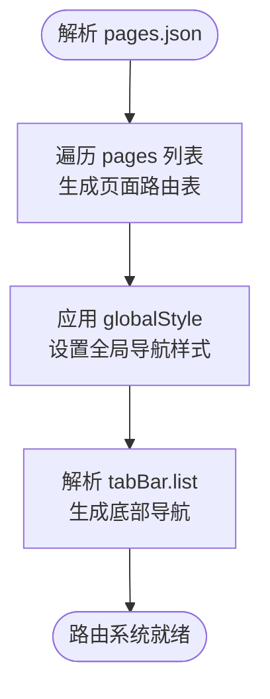
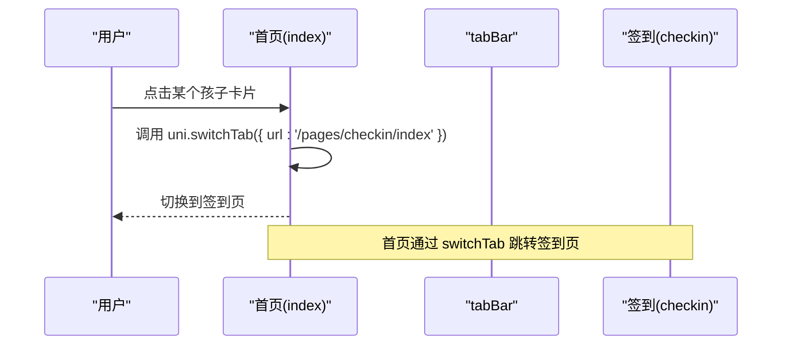
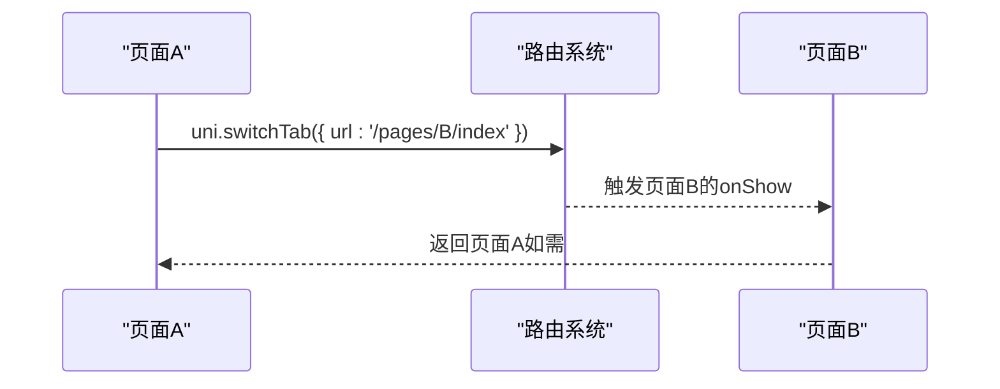
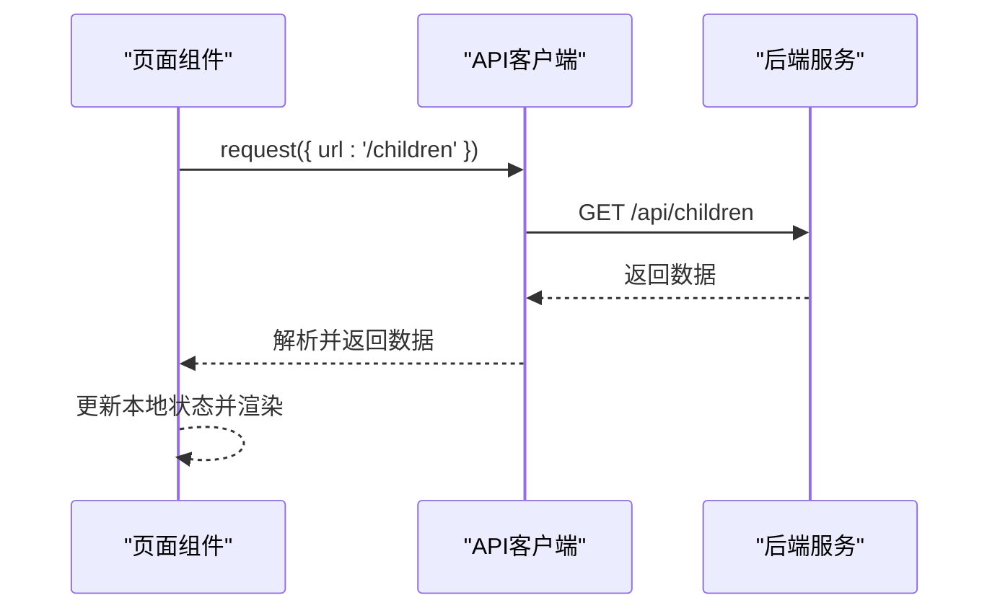
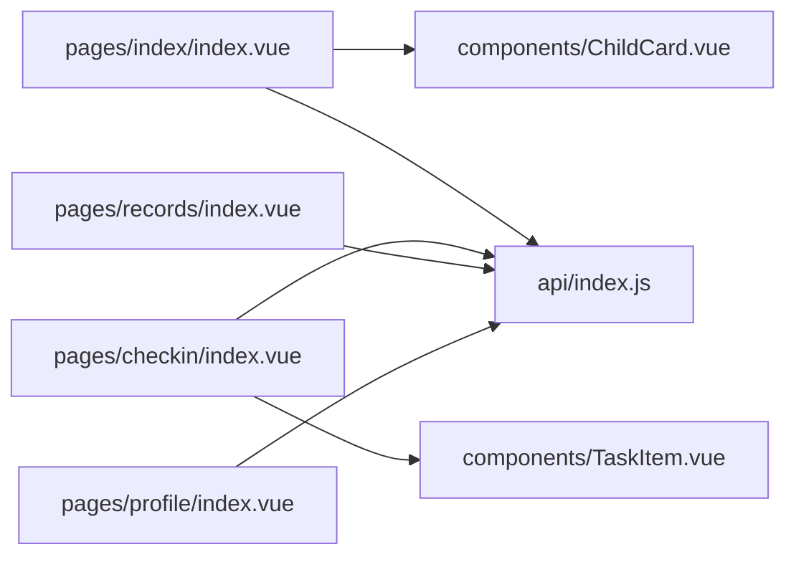

# 页面路由系统

<cite>
**本文引用的文件**
- [pages.json](file://star-park/miniprogram/src/pages.json)
- [App.vue](file://star-park/miniprogram/src/App.vue)
- [main.js](file://star-park/miniprogram/src/main.js)
- [manifest.json](file://star-park/miniprogram/src/manifest.json)
- [index.vue（首页）](file://star-park/miniprogram/src/pages/index/index.vue)
- [checkin.vue（签到）](file://star-park/miniprogram/src/pages/checkin/index.vue)
- [records.vue（记录）](file://star-park/miniprogram/src/pages/records/index.vue)
- [profile.vue（个人资料）](file://star-park/miniprogram/src/pages/profile/index.vue)
- [ChildCard.vue](file://star-park/miniprogram/src/components/ChildCard.vue)
- [TaskItem.vue](file://star-park/miniprogram/src/components/TaskItem.vue)
- [api/index.js](file://star-park/miniprogram/src/api/index.js)
- [miniprogram.md（设计文档）](file://docs/design-docs/miniprogram.md)
</cite>

## 目录
1. [简介](#简介)
2. [项目结构](#项目结构)
3. [核心组件](#核心组件)
4. [架构总览](#架构总览)
5. [详细组件分析](#详细组件分析)
6. [依赖分析](#依赖分析)
7. [性能考虑](#性能考虑)
8. [故障排查指南](#故障排查指南)
9. [结论](#结论)
10. [附录](#附录)

## 简介
本文件系统性梳理 StarParadise 小程序的页面路由体系，围绕 pages.json 的配置规范展开，详解页面路径定义、窗口表现设置、tabBar 配置、导航栏样式等；并结合首页、签到、记录、个人资料等页面的功能定位与路由关系，说明 uni-app 路由与原生小程序路由的差异与优势，解释页面间跳转方式、参数传递机制、生命周期管理，并给出最佳实践与性能优化建议。

## 项目结构
- 小程序前端位于 star-park/miniprogram/src，采用 Vue 3 + uni-app 技术栈，支持 H5 预览与微信小程序发布。
- 页面路由配置集中在 pages.json，全局样式与 tabBar 在同一文件中统一声明。
- 页面按功能划分为首页、签到、记录、钱包、个人资料、奖励目标等，其中首页与签到、记录、钱包、个人资料构成 tabBar 栏目的主要入口。

图表来源
- [pages.json:1-54](file://star-park/miniprogram/src/pages.json#L1-L54)
- [index.vue（首页）:1-194](file://star-park/miniprogram/src/pages/index/index.vue#L1-L194)
- [checkin.vue（签到）:1-322](file://star-park/miniprogram/src/pages/checkin/index.vue#L1-L322)
- [records.vue（记录）:1-460](file://star-park/miniprogram/src/pages/records/index.vue#L1-L460)
- [ChildCard.vue:1-162](file://star-park/miniprogram/src/components/ChildCard.vue#L1-L162)
- [TaskItem.vue:1-133](file://star-park/miniprogram/src/components/TaskItem.vue#L1-L133)
- [api/index.js:1-75](file://star-park/miniprogram/src/api/index.js#L1-L75)

章节来源
- [pages.json:1-54](file://star-park/miniprogram/src/pages.json#L1-L54)
- [miniprogram.md（设计文档）:1-81](file://docs/design-docs/miniprogram.md#L1-L81)

## 核心组件
- pages.json：集中定义页面路径、窗口样式、全局样式与 tabBar 列表，是路由系统的“蓝图”。
- App.vue：应用生命周期钩子 onLaunch/onShow/onHide，用于应用级初始化与可见性事件处理。
- main.js：应用入口，创建 SSR App 实例并导出 createApp。
- manifest.json：小程序平台配置，包含 appid、编译设置、H5 开发服务器代理等。
- 页面组件：首页、签到、记录、个人资料等页面，负责业务逻辑与 UI 展示。
- 通用组件：ChildCard、TaskItem 等，被页面复用，提升一致性与可维护性。
- API 客户端：统一封装 uni.request，提供 getChildren、getCheckins、createCheckin 等方法，支撑页面数据交互。

章节来源
- [App.vue:1-26](file://star-park/miniprogram/src/App.vue#L1-L26)
- [main.js:1-8](file://star-park/miniprogram/src/main.js#L1-L8)
- [manifest.json:1-31](file://star-park/miniprogram/src/manifest.json#L1-L31)
- [api/index.js:1-75](file://star-park/miniprogram/src/api/index.js#L1-L75)

## 架构总览
- 路由层：pages.json 声明页面与 tabBar，uni-app 将其映射为运行时路由表。
- 视图层：各页面通过模板与脚本组合，使用组件化与生命周期钩子组织视图与行为。
- 数据层：通过 api/index.js 统一发起请求，按需拉取仪表盘、孩子列表、打卡记录等数据。
- 平台适配：manifest.json 中的 mp-weixin 设置与 H5 代理，确保在不同环境下的正确构建与调试。

图表来源
- [pages.json:1-54](file://star-park/miniprogram/src/pages.json#L1-L54)
- [manifest.json:1-31](file://star-park/miniprogram/src/manifest.json#L1-L31)
- [App.vue:1-26](file://star-park/miniprogram/src/App.vue#L1-L26)
- [main.js:1-8](file://star-park/miniprogram/src/main.js#L1-L8)
- [index.vue（首页）:1-194](file://star-park/miniprogram/src/pages/index/index.vue#L1-L194)
- [checkin.vue（签到）:1-322](file://star-park/miniprogram/src/pages/checkin/index.vue#L1-L322)
- [records.vue（记录）:1-460](file://star-park/miniprogram/src/pages/records/index.vue#L1-L460)
- [profile.vue（个人资料）:1-211](file://star-park/miniprogram/src/pages/profile/index.vue#L1-L211)
- [ChildCard.vue:1-162](file://star-park/miniprogram/src/components/ChildCard.vue#L1-L162)
- [TaskItem.vue:1-133](file://star-park/miniprogram/src/components/TaskItem.vue#L1-L133)
- [api/index.js:1-75](file://star-park/miniprogram/src/api/index.js#L1-L75)

## 详细组件分析

### pages.json 配置规范
- 页面声明（pages）：每个页面以 path 指定相对路径，style 内可覆盖导航栏标题文本等。
- 全局样式（globalStyle）：统一设置导航栏文字颜色、标题文本、背景色等。
- tabBar（tabBar）：定义底部导航的颜色、选中态颜色、背景色、边框样式，以及每项的 pagePath、text、图标路径与选中态图标路径。

图表来源
- [pages.json:1-54](file://star-park/miniprogram/src/pages.json#L1-L54)

章节来源
- [pages.json:1-54](file://star-park/miniprogram/src/pages.json#L1-L54)

### 页面功能定位与路由关系
- 首页（index）
  - 功能：展示问候语、日期、孩子卡片列表与汇总数据；点击卡片跳转至签到页。
  - 路由：作为 tabBar 页面之一，路径为 pages/index/index。
  - 生命周期：mounted 与 onShow 时均加载仪表盘数据，保证进入前台刷新最新状态。
- 签到（checkin）
  - 功能：选择孩子、展示任务列表、勾选完成、提交打卡、显示成功动画与积分奖励入口。
  - 路由：作为 tabBar 页面之一，路径为 pages/checkin/index。
  - 生命周期：mounted 与 onShow 时加载孩子与任务数据，并标记当日已打卡任务。
- 记录（records）
  - 功能：选择孩子后展示余额、礼物目标进度、当月打卡日历与明细。
  - 路由：作为 tabBar 页面之一，路径为 pages/records/index。
  - 生命周期：mounted 与 onShow 时加载孩子列表与记录数据。
- 个人资料（profile）
  - 功能：展示用户头像、描述与菜单入口（当前多为占位提示）。
  - 路由：作为 tabBar 页面之一，路径为 pages/profile/index。
- 钱包（wallet）
  - 功能：作为 tabBar 页面之一，路径为 pages/wallet/index。
- 奖励目标（rewards）
  - 功能：作为 tabBar 页面之一，路径为 pages/rewards/index。

图表来源
- [index.vue（首页）:92-97](file://star-park/miniprogram/src/pages/index/index.vue#L92-L97)
- [pages.json:16-52](file://star-park/miniprogram/src/pages.json#L16-L52)

章节来源
- [index.vue（首页）:1-194](file://star-park/miniprogram/src/pages/index/index.vue#L1-L194)
- [checkin.vue（签到）:1-322](file://star-park/miniprogram/src/pages/checkin/index.vue#L1-L322)
- [records.vue（记录）:1-460](file://star-park/miniprogram/src/pages/records/index.vue#L1-L460)
- [profile.vue（个人资料）:1-211](file://star-park/miniprogram/src/pages/profile/index.vue#L1-L211)
- [pages.json:1-54](file://star-park/miniprogram/src/pages.json#L1-L54)

### uni-app 路由与原生小程序路由的差异与优势
- 差异
  - 声明式路由：pages.json 统一声明页面与 tabBar，无需在每个页面重复配置。
  - 平台抽象：uni-app 在不同平台（H5、微信小程序等）上自动适配路由行为与 API。
  - 组件化生态：与 Vue 生态结合，页面与组件复用更便捷。
- 优势
  - 一套代码多端运行：通过 manifest.json 与 pages.json 的统一配置，减少平台差异带来的维护成本。
  - 生命周期一致：App.vue 提供 onLaunch/onShow/onHide，页面内使用 uni-app 提供的生命周期钩子，便于统一处理应用级与页面级状态。

章节来源
- [App.vue:1-26](file://star-park/miniprogram/src/App.vue#L1-L26)
- [manifest.json:1-31](file://star-park/miniprogram/src/manifest.json#L1-L31)
- [miniprogram.md（设计文档）:1-81](file://docs/design-docs/miniprogram.md#L1-L81)

### 页面间跳转方式、参数传递机制、生命周期管理
- 跳转方式
  - 首页到签到：使用 uni.switchTab 切换 tabBar 页面。
  - 其他页面间跳转：可使用 uni.navigateTo 或 uni.redirectTo（根据业务需求选择）。
- 参数传递
  - 通过页面栈或全局状态管理传递参数；当前代码未显式使用带参跳转，建议在需要跨页面传参时统一通过页面栈或状态管理模块处理。
- 生命周期
  - 应用级：App.vue 提供 onLaunch/onShow/onHide，适合全局初始化与可见性事件。
  - 页面级：各页面使用 onMounted 与 onShow 加载数据；onShow 在每次进入页面时触发，适合刷新最新数据。

图表来源
- [index.vue（首页）:92-97](file://star-park/miniprogram/src/pages/index/index.vue#L92-L97)
- [checkin.vue（签到）:1-322](file://star-park/miniprogram/src/pages/checkin/index.vue#L1-L322)

章节来源
- [index.vue（首页）:126-132](file://star-park/miniprogram/src/pages/index/index.vue#L126-L132)
- [checkin.vue（签到）:265-266](file://star-park/miniprogram/src/pages/checkin/index.vue#L265-L266)
- [records.vue（记录）:197-203](file://star-park/miniprogram/src/pages/records/index.vue#L197-L203)
- [App.vue:4-14](file://star-park/miniprogram/src/App.vue#L4-L14)

### API 客户端与数据流
- API 客户端封装了 uni.request，统一处理状态码判断与错误提示。
- 页面通过 api/index.js 调用接口，如获取仪表盘、孩子列表、打卡记录、创建打卡等。
- 设计文档中的组件图与执行流程展示了页面与 API 的交互关系。

图表来源
- [api/index.js:7-30](file://star-park/miniprogram/src/api/index.js#L7-L30)
- [index.vue（首页）:100-124](file://star-park/miniprogram/src/pages/index/index.vue#L100-L124)
- [checkin.vue（签到）:194-241](file://star-park/miniprogram/src/pages/checkin/index.vue#L194-L241)
- [records.vue（记录）:127-195](file://star-park/miniprogram/src/pages/records/index.vue#L127-L195)

章节来源
- [api/index.js:1-75](file://star-park/miniprogram/src/api/index.js#L1-L75)
- [miniprogram.md（设计文档）:45-62](file://docs/design-docs/miniprogram.md#L45-L62)

## 依赖分析
- 页面对组件的依赖：首页依赖 ChildCard，签到页依赖 TaskItem，二者通过 props 与事件进行交互。
- 页面对 API 的依赖：所有页面均通过 api/index.js 发起请求，形成统一的数据访问层。
- 页面对路由的依赖：首页通过 uni.switchTab 跳转签到页，体现页面间关系与导航策略。

图表来源
- [index.vue（首页）:46-47](file://star-park/miniprogram/src/pages/index/index.vue#L46-L47)
- [checkin.vue（签到）:112-114](file://star-park/miniprogram/src/pages/checkin/index.vue#L112-L114)
- [records.vue（记录）](file://star-park/miniprogram/src/pages/records/index.vue#L86)
- [profile.vue（个人资料）:1-211](file://star-park/miniprogram/src/pages/profile/index.vue#L1-L211)
- [ChildCard.vue:32-42](file://star-park/miniprogram/src/components/ChildCard.vue#L32-L42)
- [TaskItem.vue:22-35](file://star-park/miniprogram/src/components/TaskItem.vue#L22-L35)
- [api/index.js:35-74](file://star-park/miniprogram/src/api/index.js#L35-L74)

章节来源
- [miniprogram.md（设计文档）:12-30](file://docs/design-docs/miniprogram.md#L12-L30)

## 性能考虑
- 首屏加载
  - 首页与签到页在 onShow 时均加载数据，建议在数据不变化时缓存，避免重复请求。
  - 对高频接口（如 dashboard、children）可增加本地缓存与过期策略。
- 渲染优化
  - 列表渲染使用 v-for 时保持 key 稳定，减少重排重绘。
  - 使用 scoped 样式与合理层级，避免过度阴影与圆角导致的绘制开销。
- 网络请求
  - 统一使用 API 客户端封装请求，集中处理错误提示与降级逻辑。
  - 对批量操作（如逐条创建打卡）可考虑合并请求或节流，降低网络压力。
- 生命周期
  - onShow 适合刷新数据，但应避免在短时间内频繁触发；必要时加入防抖或条件判断。
- 平台差异
  - H5 与小程序在路由行为与 API 表现上存在差异，建议在 manifest.json 中统一配置编译选项，减少分支逻辑。

## 故障排查指南
- 路由无法跳转
  - 检查 pages.json 是否正确注册目标页面路径与 tabBar 配置。
  - 确认 uni.switchTab 的 url 与 tabBar.pagePath 一致。
- 页面标题或样式异常
  - 检查 pages.json 中 globalStyle 与页面 style 的覆盖关系。
  - 确认 manifest.json 中 mp-weixin setting 的相关配置是否符合预期。
- 数据加载失败
  - 查看 API 客户端的请求封装与错误处理，确认网络状态与后端接口可用性。
  - 在页面中捕获异常并提示用户，避免白屏。
- 生命周期问题
  - onShow 触发频率较高，注意避免重复加载；必要时增加条件判断或缓存策略。

章节来源
- [pages.json:1-54](file://star-park/miniprogram/src/pages.json#L1-L54)
- [manifest.json:8-18](file://star-park/miniprogram/src/manifest.json#L8-L18)
- [api/index.js:7-30](file://star-park/miniprogram/src/api/index.js#L7-L30)
- [index.vue（首页）:126-132](file://star-park/miniprogram/src/pages/index/index.vue#L126-L132)
- [checkin.vue（签到）:265-266](file://star-park/miniprogram/src/pages/checkin/index.vue#L265-L266)
- [records.vue（记录）:197-203](file://star-park/miniprogram/src/pages/records/index.vue#L197-L203)

## 结论
StarParadise 的页面路由系统以 pages.json 为核心，配合 uni-app 的生命周期与组件化能力，实现了首页、签到、记录、钱包、个人资料等页面的清晰划分与稳定运行。通过统一的 API 客户端与 manifest.json 的平台配置，系统在多端环境下具备良好的一致性与可维护性。建议在后续迭代中进一步完善参数传递机制、引入缓存与防抖策略，并持续优化页面渲染与网络请求性能。

## 附录
- 最佳实践
  - 统一在 pages.json 中声明所有页面与 tabBar，避免页面内重复配置。
  - 使用 onShow 刷新数据，onMounted 初始化一次性资源。
  - 对高频接口增加缓存与去重逻辑，减少不必要的请求。
  - 在 manifest.json 中统一配置 H5 代理与小程序编译选项，确保开发与构建一致性。
- 性能优化建议
  - 列表渲染使用稳定的 key，减少 DOM 重建。
  - 合理使用阴影与圆角，避免过度绘制。
  - 对批量请求进行节流或合并，降低网络压力。
  - 在页面切换时避免重复加载，必要时使用本地缓存。