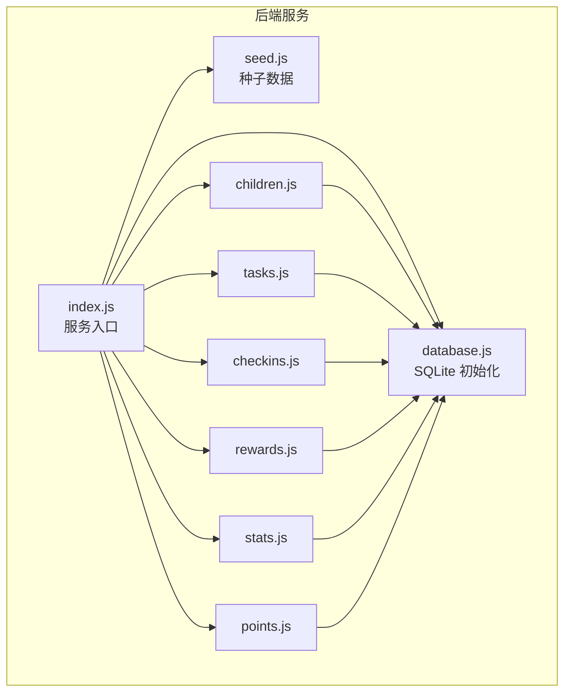
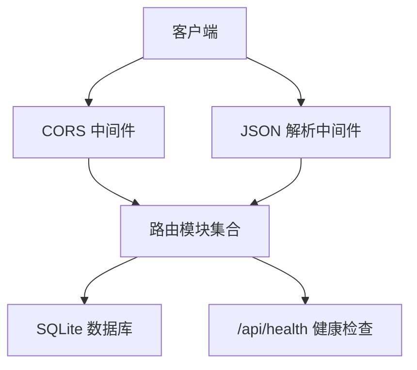
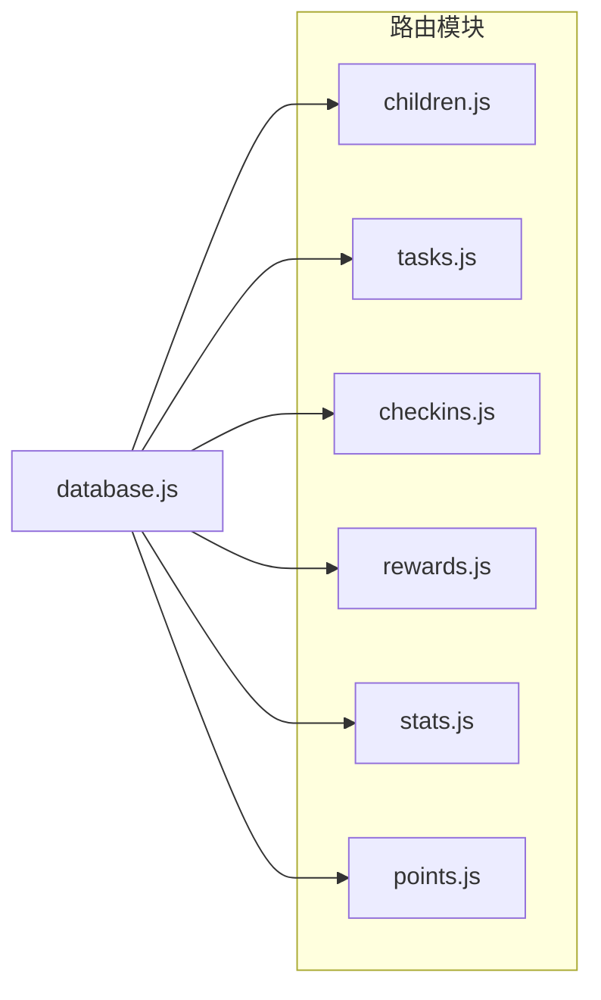
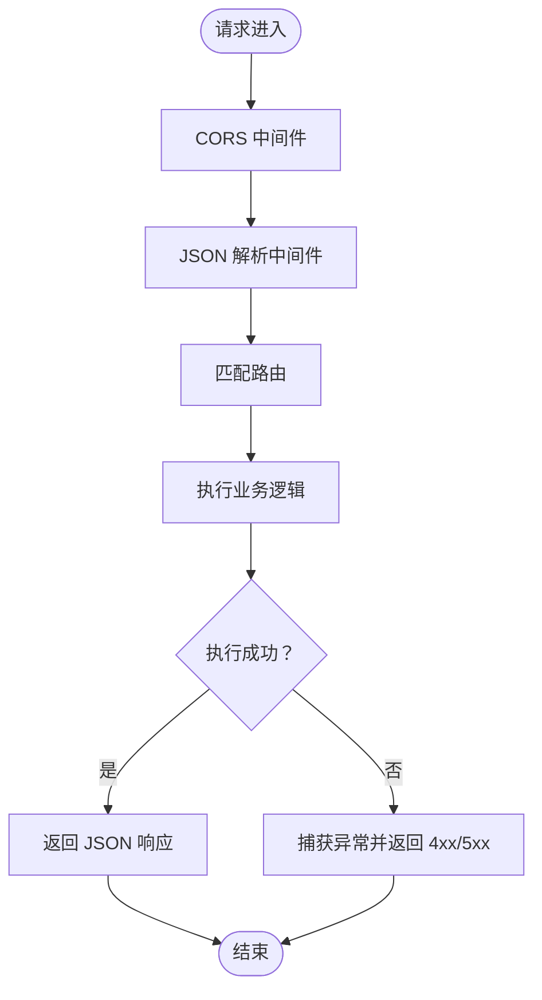
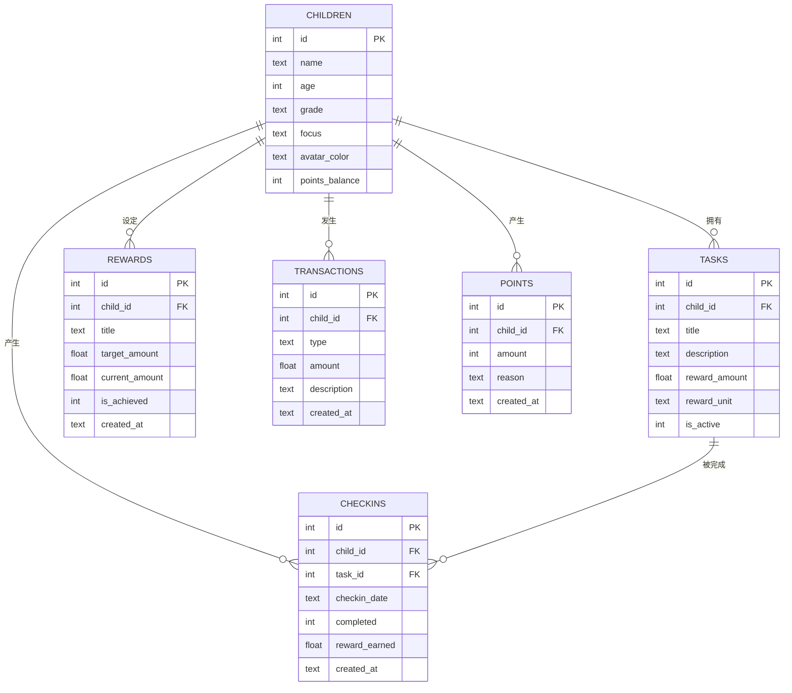
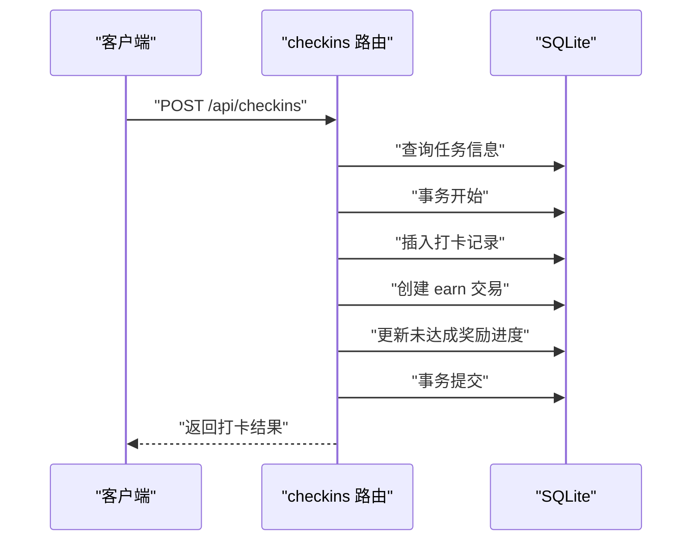
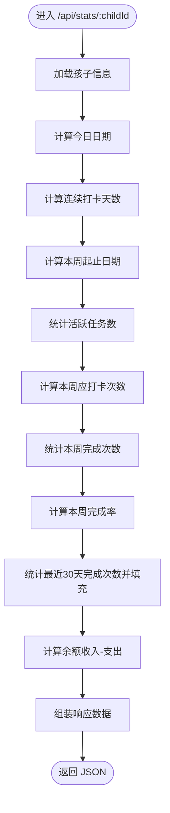
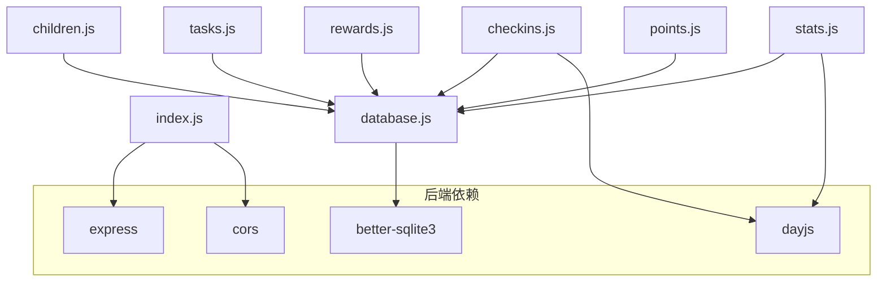

# 后端架构设计

<cite>
**本文引用的文件**
- [index.js](file://star-park/server/src/index.js)
- [package.json](file://star-park/server/package.json)
- [database.js](file://star-park/server/src/database.js)
- [seed.js](file://star-park/server/src/seed.js)
- [children.js](file://star-park/server/src/routes/children.js)
- [tasks.js](file://star-park/server/src/routes/tasks.js)
- [checkins.js](file://star-park/server/src/routes/checkins.js)
- [rewards.js](file://star-park/server/src/routes/rewards.js)
- [stats.js](file://star-park/server/src/routes/stats.js)
- [points.js](file://star-park/server/src/routes/points.js)
- [server.md](file://docs/design-docs/server.md)
- [ARCHITECTURE.md](file://docs/ARCHITECTURE.md)
- [api.md](file://docs/api.md)
- [DEVELOPMENT.md](file://docs/DEVELOPMENT.md)
</cite>

## 目录
1. [简介](#简介)
2. [项目结构](#项目结构)
3. [核心组件](#核心组件)
4. [架构总览](#架构总览)
5. [详细组件分析](#详细组件分析)
6. [依赖关系分析](#依赖关系分析)
7. [性能考量](#性能考量)
8. [故障排查指南](#故障排查指南)
9. [结论](#结论)
10. [附录](#附录)

## 简介
本设计文档面向 StarParadise 后端，系统基于 Express.js 提供 RESTful API，采用模块化路由组织业务领域（children、tasks、checkins、rewards、stats、points），结合 better-sqlite3 嵌入式数据库与轻量中间件（CORS、JSON 解析），形成高内聚、低耦合的微服务化路由架构。文档涵盖启动流程、中间件链路、请求处理管道、数据库访问层设计、性能优化策略、安全与扩展性设计，并给出可视化图示帮助读者快速理解。

## 项目结构
后端位于 star-park/server，采用“入口 -> 中间件 -> 路由 -> 数据库”的清晰分层：
- 入口文件负责实例化 Express、注册中间件、挂载路由、健康检查与服务启动
- 路由模块按业务域拆分，彼此不相互导入，严格遵守单向依赖约束
- 数据库模块集中初始化 SQLite、启用 WAL 并定义表结构，提供统一查询入口
- 种子数据模块在首次启动时初始化演示数据

图表来源
- [index.js:1-42](file://star-park/server/src/index.js#L1-L42)
- [database.js:1-90](file://star-park/server/src/database.js#L1-L90)
- [seed.js:1-45](file://star-park/server/src/seed.js#L1-L45)
- [children.js:1-88](file://star-park/server/src/routes/children.js#L1-L88)
- [tasks.js:1-91](file://star-park/server/src/routes/tasks.js#L1-L91)
- [checkins.js:1-90](file://star-park/server/src/routes/checkins.js#L1-L90)
- [rewards.js:1-84](file://star-park/server/src/routes/rewards.js#L1-L84)
- [stats.js:1-182](file://star-park/server/src/routes/stats.js#L1-L182)
- [points.js:1-74](file://star-park/server/src/routes/points.js#L1-L74)

章节来源
- [ARCHITECTURE.md:10-71](file://docs/ARCHITECTURE.md#L10-L71)
- [DEVELOPMENT.md:65-92](file://docs/DEVELOPMENT.md#L65-L92)

## 核心组件
- Express 应用与中间件
  - CORS 支持跨域
  - JSON 解析支持请求体
  - 健康检查端点 /api/health
- 路由模块（按业务域划分）
  - children：孩子信息、任务聚合、余额与交易记录
  - tasks：任务增删改查，带事务保证级联删除
  - checkins：打卡创建与查询，联动交易与奖励进度
  - rewards：奖励目标增删改查
  - stats：个人统计与仪表盘聚合
  - points：积分记录与手动加减分
- 数据库层
  - better-sqlite3 嵌入式数据库，WAL 模式与外键开启
  - 统一建表与迁移（含 points_balance 字段）
- 种子数据
  - 首次启动自动插入演示数据

章节来源
- [index.js:16-32](file://star-park/server/src/index.js#L16-L32)
- [children.js:1-88](file://star-park/server/src/routes/children.js#L1-L88)
- [tasks.js:1-91](file://star-park/server/src/routes/tasks.js#L1-L91)
- [checkins.js:1-90](file://star-park/server/src/routes/checkins.js#L1-L90)
- [rewards.js:1-84](file://star-park/server/src/routes/rewards.js#L1-L84)
- [stats.js:1-182](file://star-park/server/src/routes/stats.js#L1-L182)
- [points.js:1-74](file://star-park/server/src/routes/points.js#L1-L74)
- [database.js:13-89](file://star-park/server/src/database.js#L13-L89)
- [seed.js:3-42](file://star-park/server/src/seed.js#L3-L42)

## 架构总览
后端采用“入口 -> 中间件 -> 路由 -> 数据库”的线性处理链，路由模块各自封装业务逻辑，数据库模块提供统一连接与建模，形成清晰的职责边界与可演进的扩展点。

图表来源
- [index.js:16-32](file://star-park/server/src/index.js#L16-L32)

章节来源
- [server.md:10-31](file://docs/design-docs/server.md#L10-L31)
- [ARCHITECTURE.md:135-141](file://docs/ARCHITECTURE.md#L135-L141)

## 详细组件分析

### 路由层设计（children、tasks、checkins、rewards、stats、points）
- 设计原则
  - 每个业务域一个路由模块，避免模块间相互导入，保持高内聚低耦合
  - 路由仅负责请求解析、参数校验、调用数据库与返回响应
  - 错误统一捕获并返回 400/404/500 等语义化状态码
- 模块职责
  - children：聚合任务与余额，暴露查询、新增、余额查询、交易记录
  - tasks：任务 CRUD，删除时使用事务级联清理打卡记录
  - checkins：打卡查询与创建，创建时原子性写入打卡、交易与奖励进度
  - rewards：奖励目标 CRUD
  - stats：个人统计与仪表盘聚合（连续打卡、本周完成率、余额、30日趋势）
  - points：积分记录查询与手动加分，同步更新孩子积分余额
- API 列表与用途
  - 参考接口清单与说明，覆盖健康检查、孩子、任务、打卡、奖励、统计、积分等

图表来源
- [children.js:1-88](file://star-park/server/src/routes/children.js#L1-L88)
- [tasks.js:1-91](file://star-park/server/src/routes/tasks.js#L1-L91)
- [checkins.js:1-90](file://star-park/server/src/routes/checkins.js#L1-L90)
- [rewards.js:1-84](file://star-park/server/src/routes/rewards.js#L1-L84)
- [stats.js:1-182](file://star-park/server/src/routes/stats.js#L1-L182)
- [points.js:1-74](file://star-park/server/src/routes/points.js#L1-L74)
- [database.js:18-80](file://star-park/server/src/database.js#L18-L80)

章节来源
- [server.md:35-58](file://docs/design-docs/server.md#L35-L58)
- [api.md:16-222](file://docs/api.md#L16-L222)

### 中间件体系（CORS、JSON 解析、错误处理）
- CORS 中间件：允许前端跨域访问
- JSON 解析中间件：解析 application/json 请求体
- 错误处理：各路由模块 try/catch 捕获异常，返回 500；对必填参数缺失返回 400；资源不存在返回 404
- 健康检查：GET /api/health 返回服务状态与时间戳

图表来源
- [index.js:16-32](file://star-park/server/src/index.js#L16-L32)
- [children.js:34-36](file://star-park/server/src/routes/children.js#L34-L36)
- [tasks.js:24-35](file://star-park/server/src/routes/tasks.js#L24-L35)
- [checkins.js:33-44](file://star-park/server/src/routes/checkins.js#L33-L44)
- [rewards.js:24-35](file://star-park/server/src/routes/rewards.js#L24-L35)
- [stats.js:98-100](file://star-park/server/src/routes/stats.js#L98-L100)
- [points.js:33-41](file://star-park/server/src/routes/points.js#L33-L41)

章节来源
- [index.js:16-32](file://star-park/server/src/index.js#L16-L32)
- [server.md:103-110](file://docs/design-docs/server.md#L103-L110)

### 数据库访问层设计
- 初始化与配置
  - better-sqlite3 连接本地数据库文件 data/star-park.db
  - 启用 WAL 模式与外键约束，提升并发与一致性
- 表结构与关系
  - children：孩子基本信息与 points_balance
  - tasks：任务定义，外键关联 children
  - checkins：打卡记录，外键关联 children 与 tasks，CASCADE 删除
  - rewards：奖励目标，外键关联 children
  - transactions：金钱交易记录
  - points：积分记录，与 children 的 points_balance 同步
- 迁移与兼容
  - 自动为 children 表添加 points_balance 字段，忽略重复添加错误
- 事务与一致性
  - tasks 删除使用事务，先删 checkins 再删 tasks
  - checkins 创建使用事务，原子性写入打卡、交易与奖励进度
  - points 手动加分使用事务，原子性写入积分与更新余额

图表来源
- [database.js:18-80](file://star-park/server/src/database.js#L18-L80)

章节来源
- [database.js:13-89](file://star-park/server/src/database.js#L13-L89)
- [seed.js:3-42](file://star-park/server/src/seed.js#L3-L42)

### 打卡奖励处理流程（序列图）
从客户端提交打卡请求，到数据库原子性写入打卡、交易与奖励进度，最终返回结果。

图表来源
- [checkins.js:31-87](file://star-park/server/src/routes/checkins.js#L31-L87)

章节来源
- [server.md:76-92](file://docs/design-docs/server.md#L76-L92)

### 统计与仪表盘算法（流程图）
统计模块对连续打卡、本周完成率、30日趋势与余额进行计算，流程如下：

图表来源
- [stats.js:6-101](file://star-park/server/src/routes/stats.js#L6-L101)

章节来源
- [stats.js:6-101](file://star-park/server/src/routes/stats.js#L6-L101)

### 微服务化路由组织原则
- 单向依赖：路由模块只依赖数据库层，不相互导入
- 高内聚：每个路由聚焦单一业务域
- 低耦合：路由之间无直接耦合，通过数据库交互间接协作
- 可演进：新增业务域只需新增路由模块与数据库表，不影响既有模块

章节来源
- [ARCHITECTURE.md:86-93](file://docs/ARCHITECTURE.md#L86-L93)

## 依赖关系分析
- 后端依赖
  - express：HTTP 服务框架
  - better-sqlite3：SQLite 驱动
  - cors：跨域支持
  - dayjs：日期处理
- 前后端隔离
  - 前端通过 HTTP API 调用后端，不直接导入后端模块
  - 依赖方向严格单向，避免循环依赖

图表来源
- [package.json:8-13](file://star-park/server/package.json#L8-L13)
- [index.js:1-11](file://star-park/server/src/index.js#L1-L11)
- [database.js:1-3](file://star-park/server/src/database.js#L1-L3)
- [children.js:1-3](file://star-park/server/src/routes/children.js#L1-L3)
- [tasks.js:1-3](file://star-park/server/src/routes/tasks.js#L1-L3)
- [checkins.js:1-4](file://star-park/server/src/routes/checkins.js#L1-L4)
- [rewards.js:1-3](file://star-park/server/src/routes/rewards.js#L1-L3)
- [stats.js:1-4](file://star-park/server/src/routes/stats.js#L1-L4)
- [points.js:1-3](file://star-park/server/src/routes/points.js#L1-L3)

章节来源
- [ARCHITECTURE.md:165-176](file://docs/ARCHITECTURE.md#L165-L176)

## 性能考量
- 数据库层面
  - WAL 模式提升并发读写性能
  - 外键约束保障数据一致性
  - 事务包裹关键写入路径，减少部分一致性风险
- 代码层面
  - 路由中尽量减少 N+1 查询，如 children 聚合任务与余额
  - 对高频统计使用一次性聚合查询，避免多次往返
- 运行层面
  - 生产环境建议使用进程管理器与反向代理
  - 日志与监控可按需扩展，当前为控制台输出

章节来源
- [database.js:13-15](file://star-park/server/src/database.js#L13-L15)
- [children.js:10-31](file://star-park/server/src/routes/children.js#L10-L31)
- [stats.js:58-77](file://star-park/server/src/routes/stats.js#L58-L77)

## 故障排查指南
- 常见错误与处理
  - 400：请求参数缺失或非法（如必填字段为空、积分非整数）
  - 404：资源不存在（如任务/奖励/孩子不存在）
  - 500：数据库异常或路由内部错误
- 排查步骤
  - 检查 /api/health 是否可用
  - 核对请求参数与数据库表结构
  - 查看服务日志定位异常堆栈
- 种子数据
  - 若数据库为空，服务启动时会自动初始化演示数据

章节来源
- [server.md:103-110](file://docs/design-docs/server.md#L103-L110)
- [seed.js:3-42](file://star-park/server/src/seed.js#L3-L42)

## 结论
该后端架构以 Express + better-sqlite3 为核心，通过模块化路由实现业务域高内聚、低耦合，配合 WAL 与事务保障数据一致性。整体设计简洁、易维护、易扩展，适合家庭场景的小型应用。未来可在监控、鉴权与缓存方面进一步增强，以支撑更大规模的使用场景。

## 附录
- 启动与开发
  - 后端启动：cd star-park/server && npm start 或 npm run dev
  - 开发代理：管理后台开发时需配置 /api 代理至后端 3001 端口
- API 参考
  - 基础信息、接口列表与错误响应详见 API 文档

章节来源
- [DEVELOPMENT.md:41-64](file://docs/DEVELOPMENT.md#L41-L64)
- [api.md:10-222](file://docs/api.md#L10-L222)