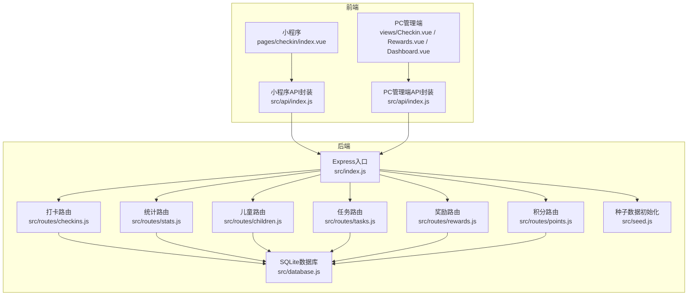
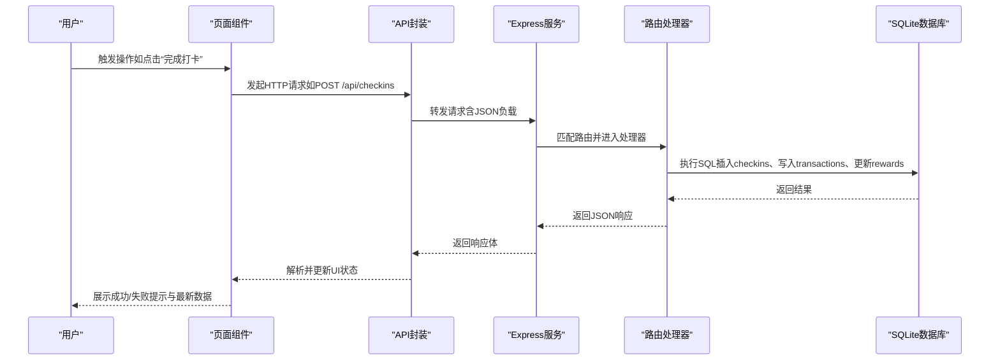
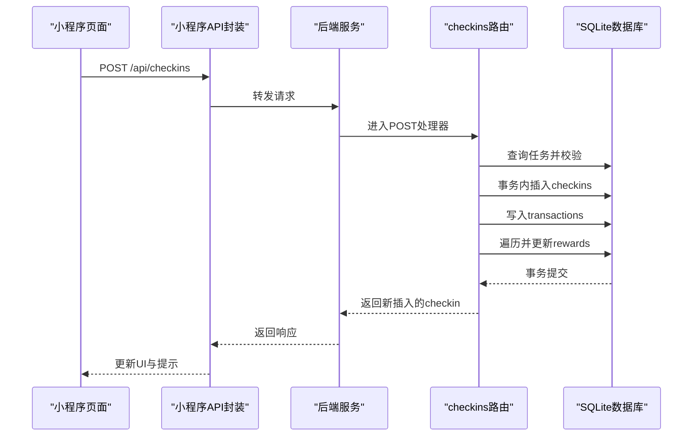
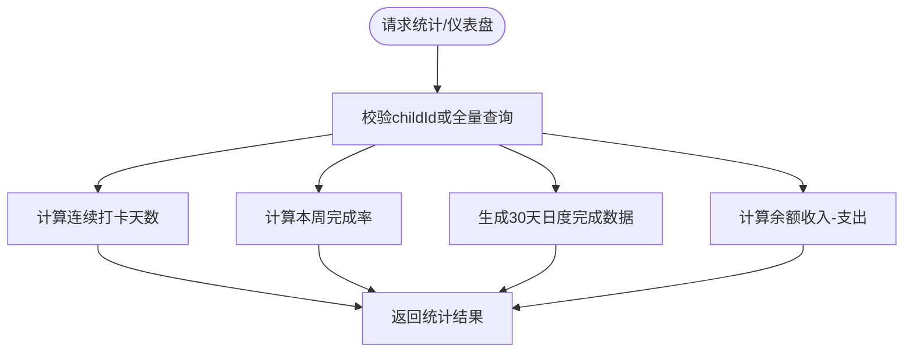
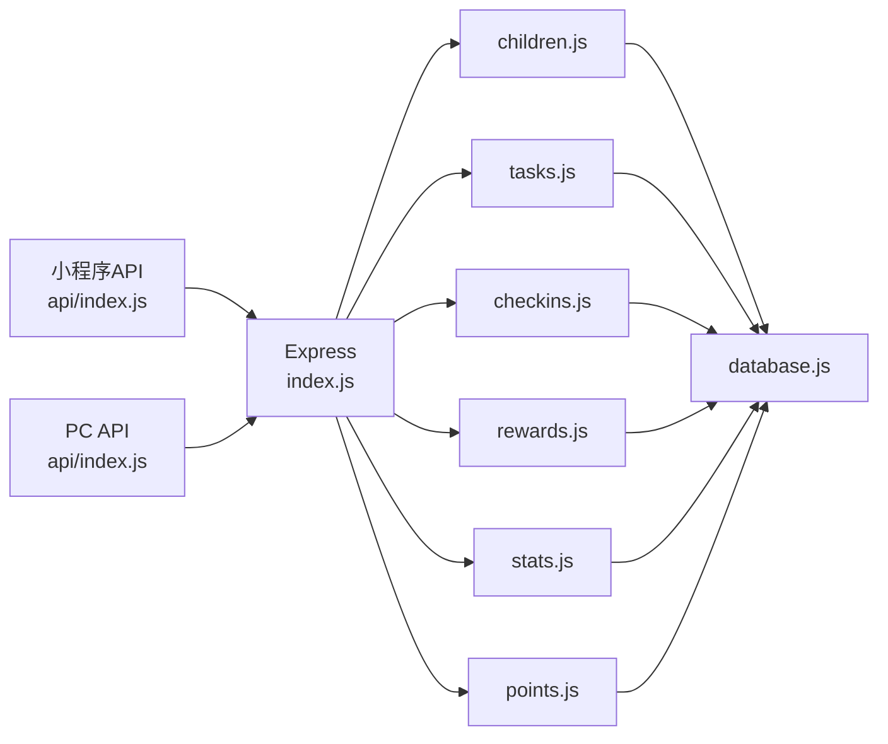

# 数据流设计

<cite>
**本文引用的文件**
- [index.js](file://star-park/server/src/index.js)
- [database.js](file://star-park/server/src/database.js)
- [checkins.js](file://star-park/server/src/routes/checkins.js)
- [stats.js](file://star-park/server/src/routes/stats.js)
- [children.js](file://star-park/server/src/routes/children.js)
- [tasks.js](file://star-park/server/src/routes/tasks.js)
- [rewards.js](file://star-park/server/src/routes/rewards.js)
- [points.js](file://star-park/server/src/routes/points.js)
- [seed.js](file://star-park/server/src/seed.js)
- [api.miniprogram.index.js](file://star-park/miniprogram/src/api/index.js)
- [api.pc-admin.index.js](file://star-park/pc-admin/src/api/index.js)
- [checkin.miniprogram.vue](file://star-park/miniprogram/src/pages/checkin/index.vue)
- [checkin.pc-admin.vue](file://star-park/pc-admin/src/views/Checkin.vue)
- [rewards.pc-admin.vue](file://star-park/pc-admin/src/views/Rewards.vue)
- [dashboard.pc-admin.vue](file://star-park/pc-admin/src/views/Dashboard.vue)
</cite>

## 目录
1. [简介](#简介)
2. [项目结构](#项目结构)
3. [核心组件](#核心组件)
4. [架构总览](#架构总览)
5. [详细组件分析](#详细组件分析)
6. [依赖关系分析](#依赖关系分析)
7. [性能考量](#性能考量)
8. [故障排查指南](#故障排查指南)
9. [结论](#结论)
10. [附录](#附录)

## 简介
本文件面向StarParadise数据流设计，系统性梳理从前端请求到后端API处理再到数据库操作的完整链路，并重点阐释以下关键业务流程的数据流：
- 打卡奖励流程：从任务完成到奖励累积与奖励目标更新
- 统计分析流程：连续打卡、本周完成率、30天日度完成情况、余额计算
- 数据同步机制：前端页面与后端数据库之间的双向数据同步与状态一致
- API客户端设计：小程序与PC管理端的统一接口封装与错误处理
- 错误处理机制：统一的状态码与错误消息返回
- 数据验证规则：必填字段校验与参数过滤
- 事务处理机制：跨表写入的一致性保障
- 并发控制策略与数据一致性：WAL模式、外键约束、事务块
- 缓存策略：基于内存态与本地存储的轻量缓存

## 项目结构
系统采用前后端分离架构，后端基于Express提供REST API，数据库采用better-sqlite3并启用WAL模式；前端包含微信小程序与PC管理端两套UI，分别通过各自API封装调用后端。

**图表来源**
- [index.js:1-42](file://star-park/server/src/index.js#L1-L42)
- [database.js:1-111](file://star-park/server/src/database.js#L1-L111)
- [checkins.js:1-90](file://star-park/server/src/routes/checkins.js#L1-L90)
- [stats.js:1-182](file://star-park/server/src/routes/stats.js#L1-L182)
- [children.js:1-96](file://star-park/server/src/routes/children.js#L1-L96)
- [tasks.js:1-91](file://star-park/server/src/routes/tasks.js#L1-L91)
- [rewards.js:1-167](file://star-park/server/src/routes/rewards.js#L1-L167)
- [points.js:1-74](file://star-park/server/src/routes/points.js#L1-L74)
- [seed.js:1-45](file://star-park/server/src/seed.js#L1-L45)
- [api.miniprogram.index.js:1-75](file://star-park/miniprogram/src/api/index.js#L1-L75)
- [api.pc-admin.index.js:1-56](file://star-park/pc-admin/src/api/index.js#L1-L56)
- [checkin.miniprogram.vue:1-322](file://star-park/miniprogram/src/pages/checkin/index.vue#L1-L322)
- [checkin.pc-admin.vue:1-417](file://star-park/pc-admin/src/views/Checkin.vue#L1-L417)
- [rewards.pc-admin.vue:1-471](file://star-park/pc-admin/src/views/Rewards.vue#L1-L471)
- [dashboard.pc-admin.vue:1-146](file://star-park/pc-admin/src/views/Dashboard.vue#L1-L146)

**章节来源**
- [index.js:1-42](file://star-park/server/src/index.js#L1-L42)
- [database.js:1-111](file://star-park/server/src/database.js#L1-L111)

## 核心组件
- Express应用与中间件：启用CORS与JSON解析，挂载各模块路由
- SQLite数据库：建表、迁移、WAL与外键开启
- 路由模块：children、tasks、checkins、rewards、stats、points
- 前端API封装：小程序与PC端统一请求封装与响应拦截
- 页面组件：打卡、奖励、仪表盘等视图层逻辑与数据联动

**章节来源**
- [index.js:16-28](file://star-park/server/src/index.js#L16-L28)
- [database.js:13-110](file://star-park/server/src/database.js#L13-L110)
- [children.js:5-37](file://star-park/server/src/routes/children.js#L5-L37)
- [tasks.js:5-19](file://star-park/server/src/routes/tasks.js#L5-L19)
- [checkins.js:6-28](file://star-park/server/src/routes/checkins.js#L6-L28)
- [rewards.js:5-19](file://star-park/server/src/routes/rewards.js#L5-L19)
- [stats.js:6-101](file://star-park/server/src/routes/stats.js#L6-L101)
- [points.js:5-28](file://star-park/server/src/routes/points.js#L5-L28)
- [api.miniprogram.index.js:1-75](file://star-park/miniprogram/src/api/index.js#L1-L75)
- [api.pc-admin.index.js:1-56](file://star-park/pc-admin/src/api/index.js#L1-L56)

## 架构总览
系统采用“前端页面组件 → API封装 → Express路由 → 数据库”的标准请求链路。后端通过事务保证跨表写入一致性，前端在页面级维护本地状态并在关键操作后刷新数据，实现数据同步。

**图表来源**
- [checkin.miniprogram.vue:165-192](file://star-park/miniprogram/src/pages/checkin/index.vue#L165-L192)
- [checkin.pc-admin.vue:197-216](file://star-park/pc-admin/src/views/Checkin.vue#L197-L216)
- [api.miniprogram.index.js:45-46](file://star-park/miniprogram/src/api/index.js#L45-L46)
- [api.pc-admin.index.js:30-32](file://star-park/pc-admin/src/api/index.js#L30-L32)
- [checkins.js:30-87](file://star-park/server/src/routes/checkins.js#L30-L87)
- [database.js:13-110](file://star-park/server/src/database.js#L13-L110)

## 详细组件分析

### 打卡奖励流程
- 前端触发：页面组件收集选中的任务，组装child_id、task_id、checkin_date等参数，调用API封装发起POST请求
- 后端处理：路由接收请求，校验必填字段；查询任务获取奖励金额；使用事务执行以下步骤：
  - 插入checkins记录
  - 若完成且有奖励，插入transactions记录并遍历该孩子未达成的奖励目标，累加current_amount并判断是否达成
- 前端回显：根据返回的checkin记录更新UI状态，展示成功提示与累计奖励

**图表来源**
- [checkin.miniprogram.vue:174-183](file://star-park/miniprogram/src/pages/checkin/index.vue#L174-L183)
- [checkins.js:30-87](file://star-park/server/src/routes/checkins.js#L30-L87)
- [database.js:48-72](file://star-park/server/src/database.js#L48-L72)

**章节来源**
- [checkins.js:30-87](file://star-park/server/src/routes/checkins.js#L30-L87)
- [checkin.miniprogram.vue:165-192](file://star-park/miniprogram/src/pages/checkin/index.vue#L165-L192)
- [checkin.pc-admin.vue:197-216](file://star-park/pc-admin/src/views/Checkin.vue#L197-L216)

### 统计分析流程
- 统计接口：按childId聚合连续打卡天数、本周完成率、30天日度完成情况、余额等
- 仪表盘接口：批量返回所有孩子当日打卡、活跃任务、连续打卡、本周完成率、余额与未达成奖励
- 前端渲染：PC管理端仪表盘页面拉取仪表盘数据并渲染卡片；打卡页按日期拉取当日已完成任务标记

**图表来源**
- [stats.js:6-101](file://star-park/server/src/routes/stats.js#L6-L101)
- [stats.js:103-182](file://star-park/server/src/routes/stats.js#L103-L182)

**章节来源**
- [stats.js:6-101](file://star-park/server/src/routes/stats.js#L6-L101)
- [stats.js:103-182](file://star-park/server/src/routes/stats.js#L103-L182)
- [dashboard.pc-admin.vue:76-87](file://star-park/pc-admin/src/views/Dashboard.vue#L76-L87)
- [checkin.miniprogram.vue:243-263](file://star-park/miniprogram/src/pages/checkin/index.vue#L243-L263)

### 数据同步机制
- 前端本地状态：页面组件维护children、activeChildId、activeTasks等本地状态
- 拉取与标记：首次加载时拉取children列表，随后按日期拉取当日checkins并标记已完成任务
- 刷新策略：完成打卡或积分发放后，重新拉取数据或局部更新本地状态，确保UI与数据库一致

**章节来源**
- [checkin.miniprogram.vue:194-241](file://star-park/miniprogram/src/pages/checkin/index.vue#L194-L241)
- [checkin.miniprogram.vue:243-263](file://star-park/miniprogram/src/pages/checkin/index.vue#L243-L263)
- [checkin.pc-admin.vue:160-195](file://star-park/pc-admin/src/views/Checkin.vue#L160-L195)

### API客户端设计
- 小程序端：统一request封装，自动拼接BASE_URL，处理HTTP状态码与fail回调，导出常用API方法
- PC管理端：基于axios创建实例，设置baseURL与超时，配置响应拦截器统一提取data，导出REST方法

**章节来源**
- [api.miniprogram.index.js:1-75](file://star-park/miniprogram/src/api/index.js#L1-L75)
- [api.pc-admin.index.js:1-56](file://star-park/pc-admin/src/api/index.js#L1-L56)

### 错误处理机制
- 统一状态码：后端在异常时返回500及错误消息；小程序端对非2xx响应reject；PC端响应拦截器统一抛错
- 业务错误：如任务不存在、奖励未达成、余额不足等，返回400并携带明确错误信息

**章节来源**
- [checkins.js:25-27](file://star-park/server/src/routes/checkins.js#L25-L27)
- [rewards.js:90-164](file://star-park/server/src/routes/rewards.js#L90-L164)
- [api.miniprogram.index.js:17-28](file://star-park/miniprogram/src/api/index.js#L17-L28)
- [api.pc-admin.index.js:12-19](file://star-park/pc-admin/src/api/index.js#L12-L19)

### 数据验证规则
- 必填字段：创建checkin需提供child_id、task_id、checkin_date；创建任务需child_id与title；创建奖励需child_id、title与target_amount；创建积分需child_id与amount
- 参数过滤：查询接口支持按child_id与date过滤；更新接口使用COALESCE进行部分字段更新

**章节来源**
- [checkins.js:33-36](file://star-park/server/src/routes/checkins.js#L33-L36)
- [tasks.js:24-27](file://star-park/server/src/routes/tasks.js#L24-L27)
- [rewards.js:24-27](file://star-park/server/src/routes/rewards.js#L24-L27)
- [points.js:33-41](file://star-park/server/src/routes/points.js#L33-L41)
- [children.js:42-45](file://star-park/server/src/routes/children.js#L42-L45)

### 事务处理机制
- 打卡流程：使用db.transaction包裹插入checkins、写入transactions、更新rewards，确保原子性
- 删除任务：先删除checkins再删除task，避免外键约束导致的失败
- 积分发放：事务内插入points记录并更新children.points_balance
- 奖励兑换：根据reward_unit区分“元”与“星星”，分别扣减余额或积分，均在事务中完成

**章节来源**
- [checkins.js:48-76](file://star-park/server/src/routes/checkins.js#L48-L76)
- [tasks.js:78-84](file://star-park/server/src/routes/tasks.js#L78-L84)
- [points.js:43-57](file://star-park/server/src/routes/points.js#L43-L57)
- [rewards.js:107-154](file://star-park/server/src/routes/rewards.js#L107-L154)

### 并发控制策略与数据一致性
- WAL模式：启用WAL提升读写并发性能
- 外键约束：启用foreign_keys，确保引用完整性
- 事务隔离：通过事务块保证多表写入的一致性
- 级联删除：checkins与rewards在删除父记录时级联清理

**章节来源**
- [database.js:13-15](file://star-park/server/src/database.js#L13-L15)
- [database.js:47-49](file://star-park/server/src/database.js#L47-L49)
- [database.js:58-60](file://star-park/server/src/database.js#L58-L60)
- [database.js:103-108](file://star-park/server/src/database.js#L103-L108)

### 数据缓存策略
- 前端缓存：页面组件在内存中维护children与tasks等数据，减少重复请求
- 本地持久化：小程序端可结合本地存储（如uni.setStorageSync）持久化关键状态，重启后恢复
- 后端缓存：SQLite本身具备页缓存与WAL缓冲，无需额外应用层缓存

**章节来源**
- [checkin.miniprogram.vue:116-129](file://star-park/miniprogram/src/pages/checkin/index.vue#L116-L129)
- [checkin.pc-admin.vue:120-122](file://star-park/pc-admin/src/views/Checkin.vue#L120-L122)

## 依赖关系分析
- 应用依赖：Express提供路由与中间件；better-sqlite3提供数据库访问；dayjs用于日期计算
- 路由依赖：各路由模块依赖database.js提供的连接与建表/迁移逻辑
- 前端依赖：小程序与PC端分别依赖各自API封装，间接依赖后端REST接口

**图表来源**
- [index.js:6-11](file://star-park/server/src/index.js#L6-L11)
- [children.js:1-3](file://star-park/server/src/routes/children.js#L1-L3)
- [tasks.js:1-3](file://star-park/server/src/routes/tasks.js#L1-L3)
- [checkins.js:1-4](file://star-park/server/src/routes/checkins.js#L1-L4)
- [rewards.js:1-3](file://star-park/server/src/routes/rewards.js#L1-L3)
- [stats.js:1-4](file://star-park/server/src/routes/stats.js#L1-L4)
- [points.js:1-3](file://star-park/server/src/routes/points.js#L1-L3)
- [database.js:1-11](file://star-park/server/src/database.js#L1-L11)
- [api.miniprogram.index.js:1-30](file://star-park/miniprogram/src/api/index.js#L1-L30)
- [api.pc-admin.index.js:1-10](file://star-park/pc-admin/src/api/index.js#L1-L10)

**章节来源**
- [index.js:6-27](file://star-park/server/src/index.js#L6-L27)
- [database.js:17-80](file://star-park/server/src/database.js#L17-L80)

## 性能考量
- 并发读写：WAL模式提升并发性能，适合多用户同时访问
- 查询优化：统计接口使用GROUP BY与日期范围查询，建议在checkin_date与child_id上建立索引（SQLite可考虑虚拟列或覆盖索引策略）
- 事务批处理：将多个写操作放入单个事务，减少锁竞争与提交次数
- 前端节流：在高频交互场景下（如快速切换任务），前端可增加防抖/节流，避免重复请求

## 故障排查指南
- 常见错误
  - 400错误：必填字段缺失或参数非法（如积分分值非整数、奖励单位不支持）
  - 404错误：资源不存在（如任务、奖励、孩子）
  - 400业务错误：奖励未达成、余额不足、重复兑换
  - 500错误：服务器内部异常
- 排查步骤
  - 检查前端请求参数与格式
  - 查看后端日志与错误堆栈
  - 核对数据库状态（事务是否提交、外键是否满足）
  - 在PC端打开浏览器开发者工具Network面板定位具体失败请求

**章节来源**
- [rewards.js:90-164](file://star-park/server/src/routes/rewards.js#L90-L164)
- [points.js:33-41](file://star-park/server/src/routes/points.js#L33-L41)
- [checkins.js:25-27](file://star-park/server/src/routes/checkins.js#L25-L27)

## 结论
StarParadise通过清晰的前后端职责划分与事务化的后端处理，实现了从任务完成到奖励累积、统计分析与数据同步的闭环。SQLite+WAL与事务机制提供了良好的并发与一致性保障；小程序与PC端的API封装统一了交互方式。后续可在查询性能与前端缓存策略上进一步优化，以支撑更大规模的并发访问。

## 附录
- 种子数据：启动时自动初始化示例孩子、任务与奖励目标，便于演示与测试
- 健康检查：提供/health接口用于服务可用性检测

**章节来源**
- [seed.js:1-45](file://star-park/server/src/seed.js#L1-L45)
- [index.js:29-32](file://star-park/server/src/index.js#L29-L32)