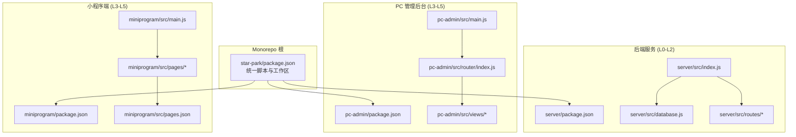
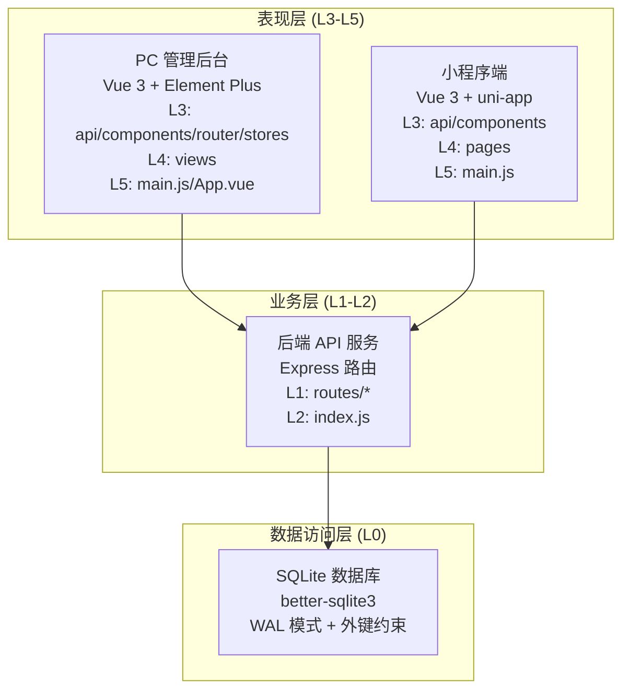
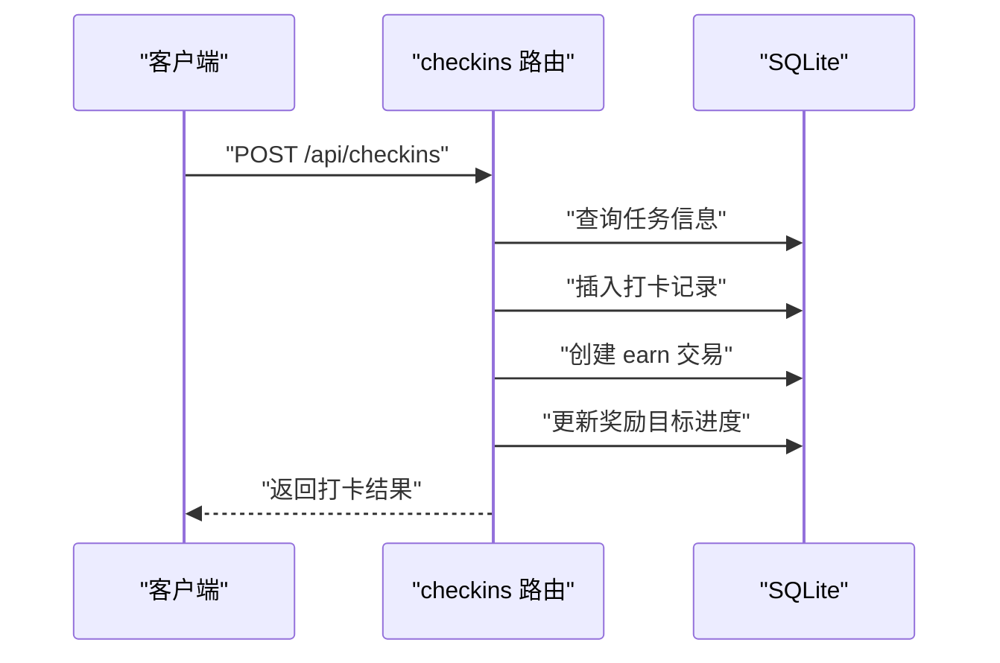
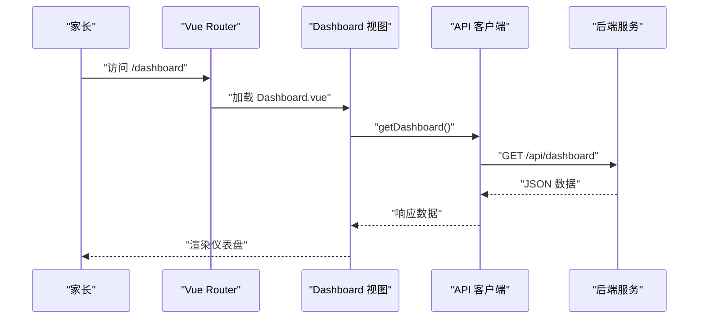
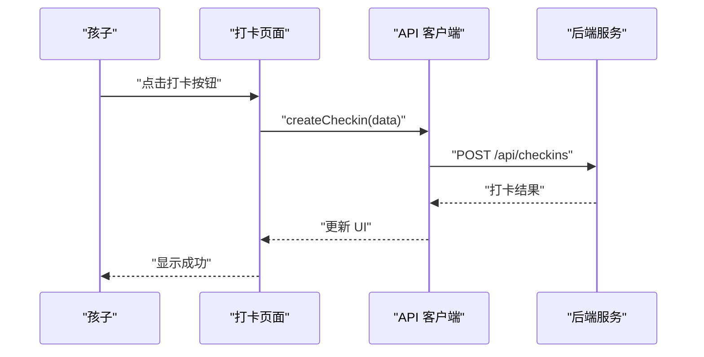
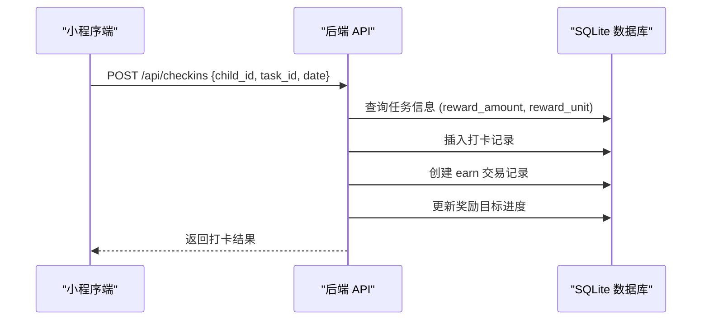
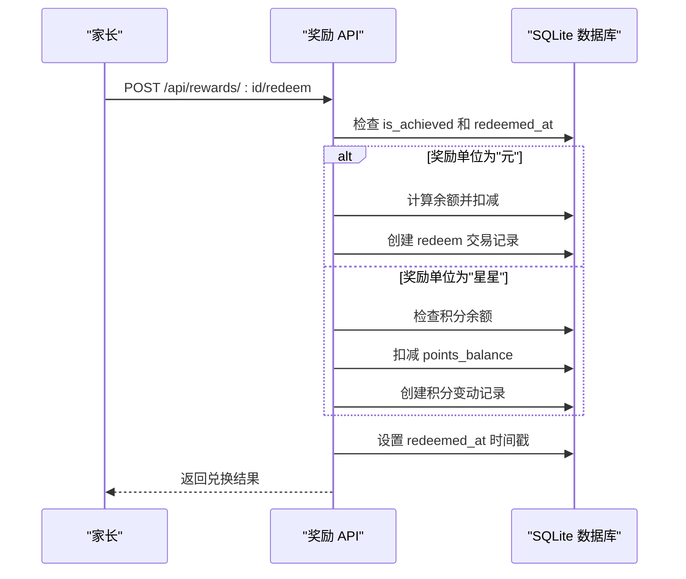
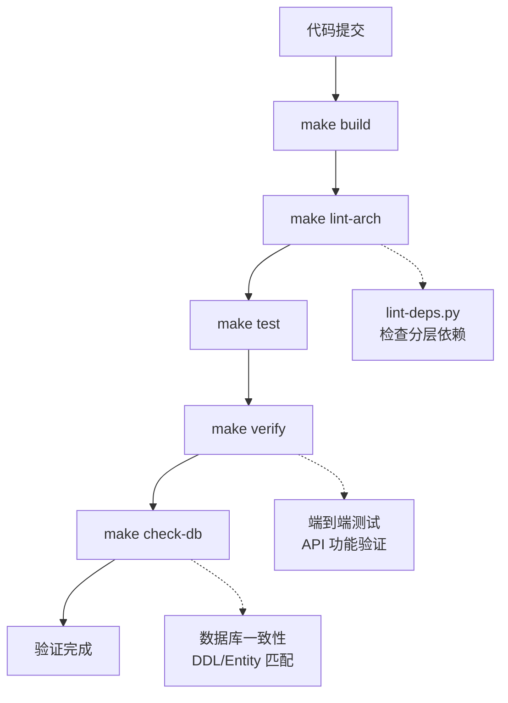

# 系统架构设计

<cite>
**本文引用的文件**
- [AGENTS.md](file://AGENTS.md)
- [ARCHITECTURE.md](file://docs/ARCHITECTURE.md)
- [design-docs/index.md](file://docs/design-docs/index.md)
- [design-docs/server.md](file://docs/design-docs/server.md)
- [design-docs/pc-admin.md](file://docs/design-docs/pc-admin.md)
- [design-docs/miniprogram.md](file://docs/design-docs/miniprogram.md)
- [api.md](file://docs/api.md)
- [lint-deps.py](file://scripts/lint-deps.py)
- [validate.py](file://scripts/validate.py)
- [check-db-consistency.sh](file://scripts/check-db-consistency.sh)
- [star-park/package.json](file://star-park/package.json)
- [server/package.json](file://star-park/server/package.json)
- [pc-admin/package.json](file://star-park/pc-admin/package.json)
- [miniprogram/package.json](file://star-park/miniprogram/package.json)
- [server/src/index.js](file://star-park/server/src/index.js)
- [server/src/database.js](file://star-park/server/src/database.js)
- [server/src/routes/checkins.js](file://star-park/server/src/routes/checkins.js)
- [server/src/routes/rewards.js](file://star-park/server/src/routes/rewards.js)
- [pc-admin/src/main.js](file://star-park/pc-admin/src/main.js)
- [pc-admin/src/router/index.js](file://star-park/pc-admin/src/router/index.js)
- [miniprogram/src/main.js](file://star-park/miniprogram/src/main.js)
- [miniprogram/src/pages.json](file://star-park/miniprogram/src/pages.json)
</cite>

## 更新摘要
**所做更改**
- 增强了 Monorepo 多项目管理策略的详细解释
- 完善了分层架构设计（L0-L5）的依赖规则说明
- 添加了详细的数据库架构和迁移机制
- 扩展了关键业务流程，特别是打卡流程和双货币系统
- 更新了架构验证和质量保证工具链
- 增强了系统边界和组件交互关系的描述

## 目录
1. [简介](#简介)
2. [项目结构](#项目结构)
3. [核心组件](#核心组件)
4. [架构总览](#架构总览)
5. [详细组件分析](#详细组件分析)
6. [依赖分析与约束](#依赖分析与约束)
7. [数据流与业务流程](#数据流与业务流程)
8. [性能考虑](#性能考虑)
9. [质量保障与验证](#质量保障与验证)
10. [故障排查指南](#故障排查指南)
11. [结论](#结论)
12. [附录](#附录)

## 简介
StarParadise 是一个家庭激励管理系统，采用前后端分离的 Monorepo 架构。后端使用 Express + SQLite 提供 REST API；前端分为管理后台（Vue 3 + Element Plus）和移动端小程序（Vue 3 + uni-app）。系统通过严格的分层架构设计（L0-L5）实现清晰的职责划分，并通过自动化验证工具保障架构一致性和代码质量。

## 项目结构
项目采用 Monorepo 多项目管理模式，将后端服务、PC 管理后台、小程序三个子项目统一管理，便于共享 API 契约、统一版本控制与构建脚本。

**图表来源**
- [AGENTS.md:43-49](file://AGENTS.md#L43-L49)
- [star-park/package.json:1-13](file://star-park/package.json#L1-L13)
- [server/src/index.js:1-42](file://star-park/server/src/index.js#L1-L42)
- [pc-admin/src/router/index.js:1-67](file://star-park/pc-admin/src/router/index.js#L1-L67)
- [miniprogram/src/pages.json:1-54](file://star-park/miniprogram/src/pages.json#L1-L54)

**章节来源**
- [AGENTS.md:43-49](file://AGENTS.md#L43-L49)
- [docs/ARCHITECTURE.md:14-69](file://docs/ARCHITECTURE.md#L14-L69)

## 核心组件
- **后端 API 服务**：提供 RESTful 接口，处理孩子、任务、打卡、奖励、积分等业务，使用 Express + better-sqlite3 + SQLite。
- **管理后台前端**：基于 Vue 3 + Element Plus，提供仪表盘、目标管理、打卡、任务管理、积分记录、奖励管理和数据统计。
- **小程序前端**：基于 Vue 3 + uni-app，支持 H5 预览与微信小程序发布，核心为每日打卡。

**章节来源**
- [AGENTS.md:43-49](file://AGENTS.md#L43-L49)
- [docs/ARCHITECTURE.md:95-114](file://docs/ARCHITECTURE.md#L95-L114)

## 架构总览
系统采用分层架构与微服务化路由组织相结合的设计：
- **分层架构**：L0 数据层（SQLite）、L1 后端路由、L2 后端入口；L3 前端基础设施、L4 前端页面/视图、L5 前端入口。
- **微服务化路由**：后端按资源域拆分路由模块（children、tasks、checkins、rewards、stats、points），每个模块职责单一。
- **Monorepo 多项目**：统一脚本与依赖管理，前端通过 HTTP API 与后端通信，避免直接导入后端模块。

**图表来源**
- [AGENTS.md:51-64](file://AGENTS.md#L51-L64)
- [docs/ARCHITECTURE.md:75-84](file://docs/ARCHITECTURE.md#L75-L84)
- [server/src/index.js:1-42](file://star-park/server/src/index.js#L1-L42)
- [server/src/database.js:1-111](file://star-park/server/src/database.js#L1-L111)

## 详细组件分析

### 后端 API 服务
- **组件图与路由组织**
  - Express 应用注册多个路由模块，分别处理 children、tasks、checkins、rewards、stats、points。
  - 数据库初始化与健康检查接口提供基础能力。
- **关键接口与数据模型**
  - 接口覆盖 CRUD 与聚合查询，如获取孩子列表、任务管理、打卡创建、奖励目标管理、仪表盘统计、积分记录等。
  - 数据模型包含 children、tasks、checkins、rewards、transactions、points 等表，支持外键与事务一致性。
- **打卡奖励流程**
  - 创建打卡时，根据任务奖励金额插入打卡记录、创建收益交易记录，并更新所有未达成奖励目标的累计金额与达成状态。

**图表来源**
- [server/src/routes/checkins.js:31-87](file://star-park/server/src/routes/checkins.js#L31-L87)

**章节来源**
- [AGENTS.md:74-78](file://AGENTS.md#L74-L78)
- [docs/design-docs/server.md:14-31](file://docs/design-docs/server.md#L14-L31)
- [server/src/index.js:21-27](file://star-park/server/src/index.js#L21-L27)
- [server/src/database.js:18-80](file://star-park/server/src/database.js#L18-L80)

### 管理后台前端
- **组件图与路由组织**
  - 入口文件初始化 Vue 应用、Pinia、Element Plus 与路由；路由采用嵌套路由组织仪表盘、目标管理、每日打卡、任务管理、积分记录、奖励管理、数据统计等视图。
- **页面加载流程**
  - 访问 /dashboard 时，视图组件通过 API 客户端发起请求，后端返回 JSON 数据并渲染页面。
- **配置与错误处理**
  - API 客户端封装 axios，默认 base URL 指向后端 /api；错误处理通过响应拦截器统一处理。

**图表来源**
- [pc-admin/src/router/index.js:1-67](file://star-park/pc-admin/src/router/index.js#L1-L67)
- [pc-admin/src/main.js:1-22](file://star-park/pc-admin/src/main.js#L1-L22)

**章节来源**
- [docs/design-docs/pc-admin.md:14-31](file://docs/design-docs/pc-admin.md#L14-31)
- [pc-admin/src/router/index.js:1-67](file://star-park/pc-admin/src/router/index.js#L1-L67)

### 小程序前端
- **组件图与导航组织**
  - 入口文件使用 createSSRApp 创建应用；TabBar 导航包含首页、打卡、记录、钱包、我的等页面；页面通过 API 客户端调用后端接口。
- **打卡流程**
  - 孩子在打卡页面点击按钮，页面调用 API 客户端创建打卡，后端返回结果并更新 UI。
- **配置与错误处理**
  - API 客户端封装 uni.request，默认指向后端地址；网络错误通过 uni.showToast 提示。

**图表来源**
- [miniprogram/src/main.js:1-8](file://star-park/miniprogram/src/main.js#L1-L8)
- [miniprogram/src/pages.json:1-54](file://star-park/miniprogram/src/pages.json#L1-L54)

**章节来源**
- [docs/design-docs/miniprogram.md:14-31](file://docs/design-docs/miniprogram.md#L14-31)
- [miniprogram/src/pages.json:1-54](file://star-park/miniprogram/src/pages.json#L1-L54)

## 依赖分析与约束
系统通过严格的层层次结构与禁止导入规则确保架构清晰与可维护性：

### 分层依赖规则（L0-L5）

| 层 | 范围 | 可导入 | 禁止导入 |
|----|------|--------|----------|
| L0 — 数据层 | `server/src/database.js`, `seed.js` | 仅 npm 包 | 任何项目内部模块 |
| L1 — 后端路由 | `server/src/routes/*` | L0 + npm 包 | L2, L3, L4, L5 |
| L2 — 后端入口 | `server/src/index.js` | L0, L1 + npm 包 | L3, L4, L5 |
| L3 — 前端基础设施 | `api/`, `components/`, `router/`, `stores/`, `styles/` | 仅 npm 包 | L0, L1, L2, L4, L5 |
| L4 — 前端页面 | `pages/`, `views/` | L3 + npm 包 | L0, L1, L2, L5 |
| L5 — 前端入口 | `main.js`, `App.vue` | L3, L4 + npm 包 | L0, L1, L2 |

### 特殊禁止规则
- 后端路由模块之间不得互相导入
- 前端模块不得直接导入后端模块（仅通过 HTTP API 通信）
- 同一子项目的页面/视图不得互相导入

**图表来源**
- [AGENTS.md:51-64](file://AGENTS.md#L51-L64)
- [docs/ARCHITECTURE.md:75-94](file://docs/ARCHITECTURE.md#L75-L94)
- [lint-deps.py:15-88](file://scripts/lint-deps.py#L15-88)

**章节来源**
- [AGENTS.md:51-64](file://AGENTS.md#L51-L64)
- [docs/ARCHITECTURE.md:75-94](file://docs/ARCHITECTURE.md#L75-L94)
- [lint-deps.py:15-88](file://scripts/lint-deps.py#L15-88)

## 数据流与业务流程

### 数据库架构
SQLite 嵌入式数据库，WAL 模式，外键约束开启。数据库文件位于 `star-park/server/data/star-park.db`。

**核心表结构：**
- `children`：包含 `points_balance` 积分余额字段
- `tasks`：任务定义，支持 `reward_unit` 区分元/积分
- `checkins`：打卡记录，关联任务和用户
- `rewards`：奖励目标，包含 `description`、`reward_unit`、`redeemed_at` 字段
- `transactions`：金钱交易记录（earn/redeem）
- `points`：积分变动记录

**Schema 迁移机制：**
采用 try/catch ALTER TABLE 模式，新增字段时自动迁移，已存在字段时忽略错误。

### 关键业务流程

#### 打卡奖励流程

#### 双货币系统
系统支持两种独立的货币体系：
- **余额系统**：基于 transactions 表，用于金钱奖励（元）
- **积分系统**：基于 points 表和 children.points_balance，用于行为激励（星星）

#### 奖励兑换流程

**图表来源**
- [server/src/routes/checkins.js:31-87](file://star-park/server/src/routes/checkins.js#L31-L87)
- [server/src/routes/rewards.js:89-164](file://star-park/server/src/routes/rewards.js#L89-L164)
- [server/src/database.js:82-108](file://star-park/server/src/database.js#L82-L108)

**章节来源**
- [AGENTS.md:66-78](file://AGENTS.md#L66-L78)
- [server/src/database.js:18-108](file://star-park/server/src/database.js#L18-L108)
- [server/src/routes/checkins.js:31-87](file://star-park/server/src/routes/checkins.js#L31-L87)
- [server/src/routes/rewards.js:89-164](file://star-park/server/src/routes/rewards.js#L89-L164)

## 性能考虑
- **数据库层面**
  - 启用 WAL 模式与外键约束，提升并发读写性能与数据一致性。
  - 使用事务包裹关键业务（如打卡流程），保证原子性与一致性。
- **服务层面**
  - Express 中间件启用 CORS 与 JSON 解析，路由按资源域拆分，减少耦合。
- **前端层面**
  - Vue 3 组件化与 Pinia 状态管理降低重复渲染与状态同步成本。
  - Element Plus 图表库用于统计展示，建议按需加载与懒渲染。

**章节来源**
- [server/src/database.js:13-15](file://star-park/server/src/database.js#L13-L15)
- [server/src/routes/checkins.js:48-78](file://star-park/server/src/routes/checkins.js#L48-L78)
- [server/src/index.js:16-18](file://star-park/server/src/index.js#L16-L18)

## 质量保障与验证
系统集成了完整的质量保障工具链：

### 架构验证工具
- **lint-deps.py**：强制执行分层依赖规则，检测违规导入
- **validate.py**：统一的验证流水线，执行构建、架构 lint、测试和端到端验证
- **check-db-consistency.sh**：DDL/Entity 一致性检查

### 验证流程

**图表来源**
- [validate.py:33-40](file://scripts/validate.py#L33-L40)
- [lint-deps.py:225-251](file://scripts/lint-deps.py#L225-L251)
- [check-db-consistency.sh:1-44](file://scripts/check-db-consistency.sh#L1-L44)

**章节来源**
- [AGENTS.md:26-36](file://AGENTS.md#L26-L36)
- [validate.py:1-57](file://scripts/validate.py#L1-L57)
- [lint-deps.py:1-251](file://scripts/lint-deps.py#L1-L251)
- [check-db-consistency.sh:1-44](file://scripts/check-db-consistency.sh#L1-L44)

## 故障排查指南
- **健康检查**
  - 通过 /api/health 接口确认服务可用性与时间戳。
- **常见错误与处理**
  - 400：请求参数缺失或不合法，检查必填字段与格式。
  - 404：资源不存在，核对 ID 与路径。
  - 500：数据库异常或内部错误，检查数据库状态与日志。
- **前端错误处理**
  - PC 管理后台：axios 响应拦截器统一处理错误，建议补充全局消息提示。
  - 小程序端：网络错误通过 uni.showToast 提示，建议在调用方完善重试与降级逻辑。
- **架构违规排查**
  - 运行 `make lint-arch` 检查分层依赖违规
  - 使用 `python3 scripts/lint-deps.py` 获取详细的违规报告

**章节来源**
- [server/src/index.js:29-32](file://star-park/server/src/index.js#L29-L32)
- [AGENTS.md:26-36](file://AGENTS.md#L26-L36)

## 结论
StarParadise 通过清晰的分层架构（L0-L5）、严格的依赖约束与 Monorepo 管理，实现了后端 API 服务与前后端应用的解耦与协作。Express + SQLite 的组合满足家庭场景的轻量需求，Vue 3 + Element Plus 与 uni-app 则提供了良好的开发体验与跨平台能力。系统集成了完整的验证工具链，确保架构一致性和代码质量。建议在现有基础上增强监控与告警体系，完善前端全局错误提示与国际化支持，持续优化数据库索引与查询性能。

## 附录
- **技术栈与版本**
  - 后端：Express、better-sqlite3、CORS、dayjs
  - PC 管理后台：Vue 3、Vue Router、Pinia、Element Plus、ECharts、Axios
  - 小程序：Vue 3、uni-app
- **统一脚本与启动命令**
  - 安装与启动：统一脚本集中于根 package.json，分别启动后端、PC 管理后台与小程序开发环境。
- **开发环境要求**
  - Node.js 18+, npm 9+, Python 3.10+
- **API 路由前缀**
  - 所有 API 以 `/api/` 为前缀：children, tasks, checkins, rewards, stats, dashboard, points

**章节来源**
- [AGENTS.md:92-92](file://AGENTS.md#L92-L92)
- [server/package.json:8-13](file://star-park/server/package.json#L8-L13)
- [pc-admin/package.json:11-20](file://star-park/pc-admin/package.json#L11-L20)
- [miniprogram/package.json:10-18](file://star-park/miniprogram/package.json#L10-L18)
- [star-park/package.json:6-11](file://star-park/package.json#L6-L11)
- [AGENTS.md:80-84](file://AGENTS.md#L80-L84)