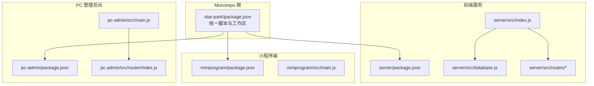
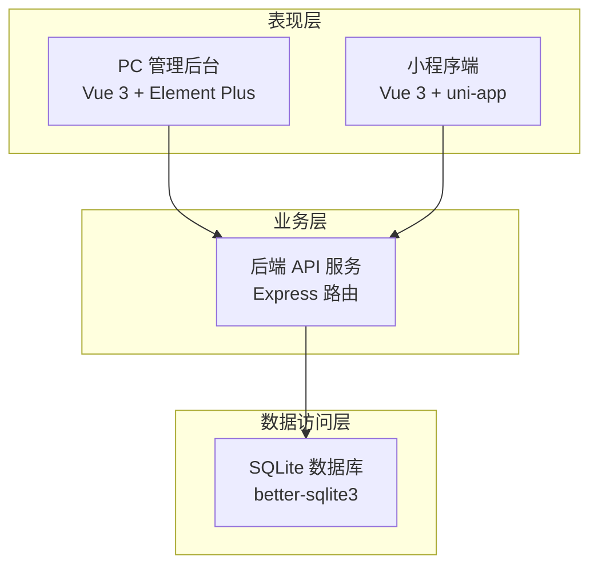
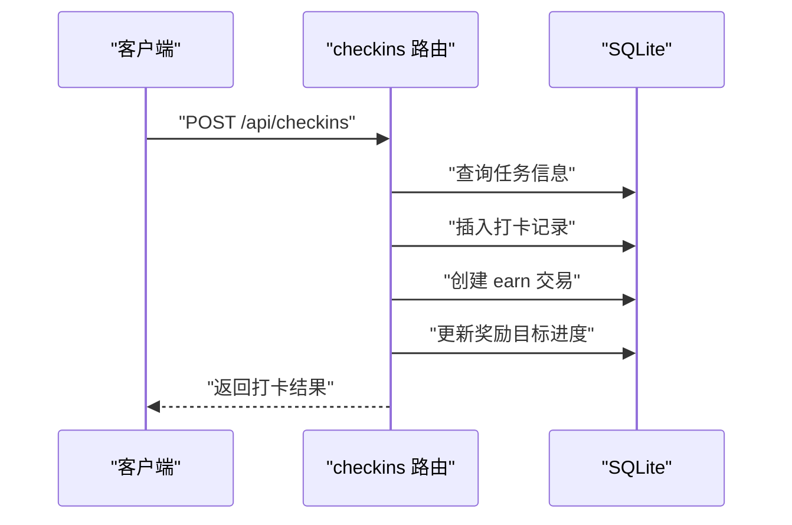
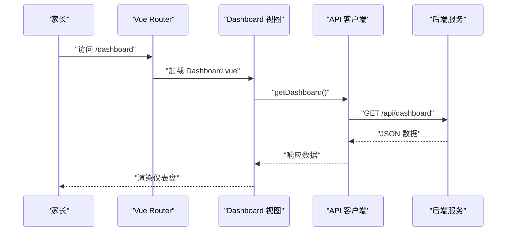
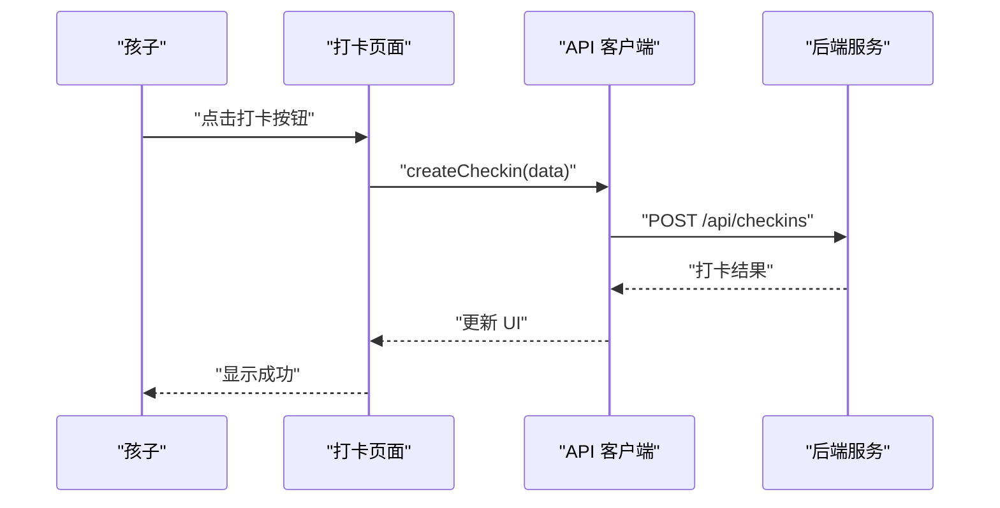
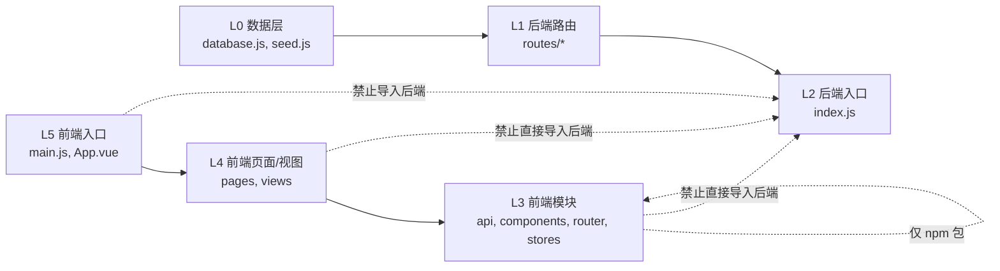

# 系统架构设计

<cite>
**本文引用的文件**
- [ARCHITECTURE.md](file://docs/ARCHITECTURE.md)
- [design-docs/index.md](file://docs/design-docs/index.md)
- [design-docs/server.md](file://docs/design-docs/server.md)
- [design-docs/pc-admin.md](file://docs/design-docs/pc-admin.md)
- [design-docs/miniprogram.md](file://docs/design-docs/miniprogram.md)
- [api.md](file://docs/api.md)
- [lint-deps.py](file://scripts/lint-deps.py)
- [star-park/package.json](file://star-park/package.json)
- [server/package.json](file://star-park/server/package.json)
- [pc-admin/package.json](file://star-park/pc-admin/package.json)
- [miniprogram/package.json](file://star-park/miniprogram/package.json)
- [server/src/index.js](file://star-park/server/src/index.js)
- [server/src/database.js](file://star-park/server/src/database.js)
- [server/src/routes/checkins.js](file://star-park/server/src/routes/checkins.js)
- [pc-admin/src/main.js](file://star-park/pc-admin/src/main.js)
- [pc-admin/src/router/index.js](file://star-park/pc-admin/src/router/index.js)
- [miniprogram/src/main.js](file://star-park/miniprogram/src/main.js)
</cite>

## 目录
1. [简介](#简介)
2. [项目结构](#项目结构)
3. [核心组件](#核心组件)
4. [架构总览](#架构总览)
5. [详细组件分析](#详细组件分析)
6. [依赖分析](#依赖分析)
7. [性能考虑](#性能考虑)
8. [故障排查指南](#故障排查指南)
9. [结论](#结论)
10. [附录](#附录)

## 简介
StarParadise 是一个家庭激励管理系统，采用前后端分离的 Monorepo 架构。后端使用 Express + SQLite 提供 REST API；前端分为管理后台（Vue 3 + Element Plus）和移动端小程序（Vue 3 + uni-app）。系统通过分层架构设计（表现层、业务层、数据访问层）实现清晰的职责划分，并通过严格的依赖约束工具保障架构一致性。

## 项目结构
项目采用 Monorepo 多项目管理模式，将后端服务、PC 管理后台、小程序三个子项目统一管理，便于共享 API 契约、统一版本控制与构建脚本。

图表来源
- [star-park/package.json:1-13](file://star-park/package.json#L1-L13)
- [server/src/index.js:1-42](file://star-park/server/src/index.js#L1-L42)
- [server/src/database.js:1-90](file://star-park/server/src/database.js#L1-L90)
- [pc-admin/src/main.js:1-22](file://star-park/pc-admin/src/main.js#L1-L22)
- [pc-admin/src/router/index.js:1-67](file://star-park/pc-admin/src/router/index.js#L1-L67)
- [miniprogram/src/main.js:1-8](file://star-park/miniprogram/src/main.js#L1-L8)

章节来源
- [star-park/package.json:1-13](file://star-park/package.json#L1-L13)
- [docs/ARCHITECTURE.md:14-69](file://docs/ARCHITECTURE.md#L14-L69)

## 核心组件
- 后端 API 服务：提供 RESTful 接口，处理孩子、任务、打卡、奖励、积分等业务，使用 Express + better-sqlite3 + SQLite。
- 管理后台前端：基于 Vue 3 + Element Plus，提供仪表盘、目标管理、打卡、任务管理、积分记录、奖励管理和数据统计。
- 小程序前端：基于 Vue 3 + uni-app，支持 H5 预览与微信小程序发布，核心为每日打卡。

章节来源
- [docs/ARCHITECTURE.md:95-114](file://docs/ARCHITECTURE.md#L95-L114)
- [docs/design-docs/server.md:1-115](file://docs/design-docs/server.md#L1-L115)
- [docs/design-docs/pc-admin.md:1-85](file://docs/design-docs/pc-admin.md#L1-L85)
- [docs/design-docs/miniprogram.md:1-78](file://docs/design-docs/miniprogram.md#L1-L78)

## 架构总览
系统采用分层架构与微服务化路由组织相结合的设计：
- 分层架构：L0 数据层（SQLite）、L1 后端路由、L2 后端入口；L3 前端 API/组件/路由/Store、L4 前端页面/视图、L5 前端入口。
- 微服务化路由：后端按资源域拆分路由模块（children、tasks、checkins、rewards、stats、points），每个模块职责单一。
- Monorepo 多项目：统一脚本与依赖管理，前端通过 HTTP API 与后端通信，避免直接导入后端模块。

图表来源
- [docs/ARCHITECTURE.md:10-11](file://docs/ARCHITECTURE.md#L10-L11)
- [docs/design-docs/server.md:14-31](file://docs/design-docs/server.md#L14-L31)
- [server/src/index.js:1-42](file://star-park/server/src/index.js#L1-L42)
- [server/src/database.js:1-90](file://star-park/server/src/database.js#L1-L90)

## 详细组件分析

### 后端 API 服务
- 组件图与路由组织
  - Express 应用注册多个路由模块，分别处理 children、tasks、checkins、rewards、stats、points。
  - 数据库初始化与健康检查接口提供基础能力。
- 关键接口与数据模型
  - 接口覆盖 CRUD 与聚合查询，如获取孩子列表、任务管理、打卡创建、奖励目标管理、仪表盘统计、积分记录等。
  - 数据模型包含 children、tasks、checkins、rewards、transactions、points 等表，支持外键与事务一致性。
- 打卡奖励流程
  - 创建打卡时，根据任务奖励金额插入打卡记录、创建收益交易记录，并更新所有未达成奖励目标的累计金额与达成状态。

图表来源
- [server/src/routes/checkins.js:31-87](file://star-park/server/src/routes/checkins.js#L31-L87)

章节来源
- [docs/design-docs/server.md:14-31](file://docs/design-docs/server.md#L14-L31)
- [docs/design-docs/server.md:35-58](file://docs/design-docs/server.md#L35-L58)
- [docs/design-docs/server.md:74-92](file://docs/design-docs/server.md#L74-L92)
- [server/src/index.js:21-27](file://star-park/server/src/index.js#L21-L27)
- [server/src/database.js:18-80](file://star-park/server/src/database.js#L18-L80)

### 管理后台前端
- 组件图与路由组织
  - 入口文件初始化 Vue 应用、Pinia、Element Plus 与路由；路由采用嵌套路由组织仪表盘、目标管理、每日打卡、任务管理、积分记录、奖励管理、数据统计等视图。
- 页面加载流程
  - 访问 /dashboard 时，视图组件通过 API 客户端发起请求，后端返回 JSON 数据并渲染页面。
- 配置与错误处理
  - API 客户端封装 axios，默认 base URL 指向后端 /api；错误处理通过响应拦截器统一处理。

图表来源
- [pc-admin/src/router/index.js:1-67](file://star-park/pc-admin/src/router/index.js#L1-L67)
- [pc-admin/src/main.js:1-22](file://star-park/pc-admin/src/main.js#L1-L22)

章节来源
- [docs/design-docs/pc-admin.md:14-31](file://docs/design-docs/pc-admin.md#L14-L31)
- [docs/design-docs/pc-admin.md:47-65](file://docs/design-docs/pc-admin.md#L47-L65)
- [pc-admin/src/router/index.js:1-67](file://star-park/pc-admin/src/router/index.js#L1-L67)
- [pc-admin/src/main.js:1-22](file://star-park/pc-admin/src/main.js#L1-L22)

### 小程序前端
- 组件图与导航组织
  - 入口文件使用 createSSRApp 创建应用；TabBar 导航包含首页、打卡、记录、我的等页面；页面通过 API 客户端调用后端接口。
- 打卡流程
  - 孩子在打卡页面点击按钮，页面调用 API 客户端创建打卡，后端返回结果并更新 UI。
- 配置与错误处理
  - API 客户端封装 uni.request，默认指向后端地址；网络错误通过 uni.showToast 提示。

图表来源
- [miniprogram/src/main.js:1-8](file://star-park/miniprogram/src/main.js#L1-L8)
- [docs/design-docs/miniprogram.md:44-60](file://docs/design-docs/miniprogram.md#L44-L60)

章节来源
- [docs/design-docs/miniprogram.md:14-31](file://docs/design-docs/miniprogram.md#L14-L31)
- [docs/design-docs/miniprogram.md:42-60](file://docs/design-docs/miniprogram.md#L42-L60)
- [miniprogram/src/main.js:1-8](file://star-park/miniprogram/src/main.js#L1-L8)

## 依赖分析
系统通过严格的层层次结构与禁止导入规则确保架构清晰与可维护性：
- 层层次结构（自底向上）：L0 数据层（database、seed）、L1 后端路由（routes/*）、L2 后端入口（index）、L3 前端 API/组件/路由/Store、L4 前端页面/视图、L5 前端入口（main/App）。
- 禁止的依赖：
  - 后端路由模块之间不得互相导入；
  - 数据层不得导入任何项目内部模块；
  - 前端模块不得直接导入后端模块（仅通过 HTTP API 通信）；
  - 同一子项目的页面/视图不得互相导入。

图表来源
- [docs/ARCHITECTURE.md:75-94](file://docs/ARCHITECTURE.md#L75-L94)
- [scripts/lint-deps.py:15-88](file://scripts/lint-deps.py#L15-L88)

章节来源
- [docs/ARCHITECTURE.md:75-94](file://docs/ARCHITECTURE.md#L75-L94)
- [scripts/lint-deps.py:15-88](file://scripts/lint-deps.py#L15-L88)

## 性能考虑
- 数据库层面
  - 启用 WAL 模式与外键约束，提升并发读写性能与数据一致性。
  - 使用事务包裹关键业务（如打卡流程），保证原子性与一致性。
- 服务层面
  - Express 中间件启用 CORS 与 JSON 解析，路由按资源域拆分，减少耦合。
- 前端层面
  - Vue 3 组件化与 Pinia 状态管理降低重复渲染与状态同步成本。
  - Element Plus 图表库用于统计展示，建议按需加载与懒渲染。

章节来源
- [server/src/database.js:13-15](file://star-park/server/src/database.js#L13-L15)
- [server/src/routes/checkins.js:48-78](file://star-park/server/src/routes/checkins.js#L48-L78)
- [server/src/index.js:16-18](file://star-park/server/src/index.js#L16-L18)
- [pc-admin/package.json:11-20](file://star-park/pc-admin/package.json#L11-L20)

## 故障排查指南
- 健康检查
  - 通过 /api/health 接口确认服务可用性与时间戳。
- 常见错误与处理
  - 400：请求参数缺失或不合法，检查必填字段与格式。
  - 404：资源不存在，核对 ID 与路径。
  - 500：数据库异常或内部错误，检查数据库状态与日志。
- 前端错误处理
  - PC 管理后台：axios 响应拦截器统一处理错误，建议补充全局消息提示。
  - 小程序端：网络错误通过 uni.showToast 提示，建议在调用方完善重试与降级逻辑。

章节来源
- [server/src/index.js:29-32](file://star-park/server/src/index.js#L29-L32)
- [docs/design-docs/server.md:103-110](file://docs/design-docs/server.md#L103-L110)
- [docs/design-docs/pc-admin.md:75-80](file://docs/design-docs/pc-admin.md#L75-L80)
- [docs/design-docs/miniprogram.md:69-73](file://docs/design-docs/miniprogram.md#L69-L73)

## 结论
StarParadise 通过清晰的分层架构、严格的依赖约束与 Monorepo 管理，实现了后端 API 服务与前后端应用的解耦与协作。Express + SQLite 的组合满足家庭场景的轻量需求，Vue 3 + Element Plus 与 uni-app 则提供了良好的开发体验与跨平台能力。建议在现有基础上增强监控与告警体系，完善前端全局错误提示与国际化支持，持续优化数据库索引与查询性能。

## 附录
- 技术栈与版本
  - 后端：Express、better-sqlite3、CORS、dayjs
  - PC 管理后台：Vue 3、Vue Router、Pinia、Element Plus、ECharts、Axios
  - 小程序：Vue 3、uni-app
- 统一脚本与启动命令
  - 安装与启动：统一脚本集中于根 package.json，分别启动后端、PC 管理后台与小程序开发环境。

章节来源
- [server/package.json:8-13](file://star-park/server/package.json#L8-L13)
- [pc-admin/package.json:11-20](file://star-park/pc-admin/package.json#L11-L20)
- [miniprogram/package.json:10-18](file://star-park/miniprogram/package.json#L10-L18)
- [star-park/package.json:6-11](file://star-park/package.json#L6-L11)