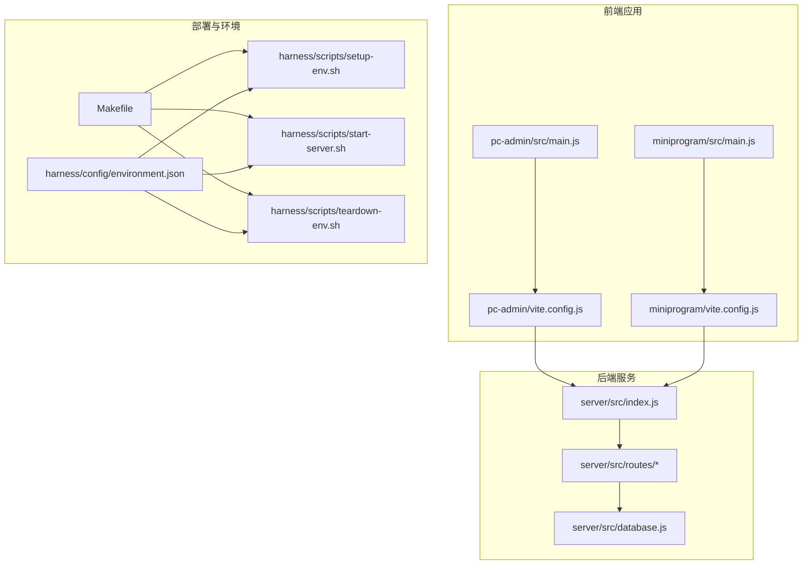
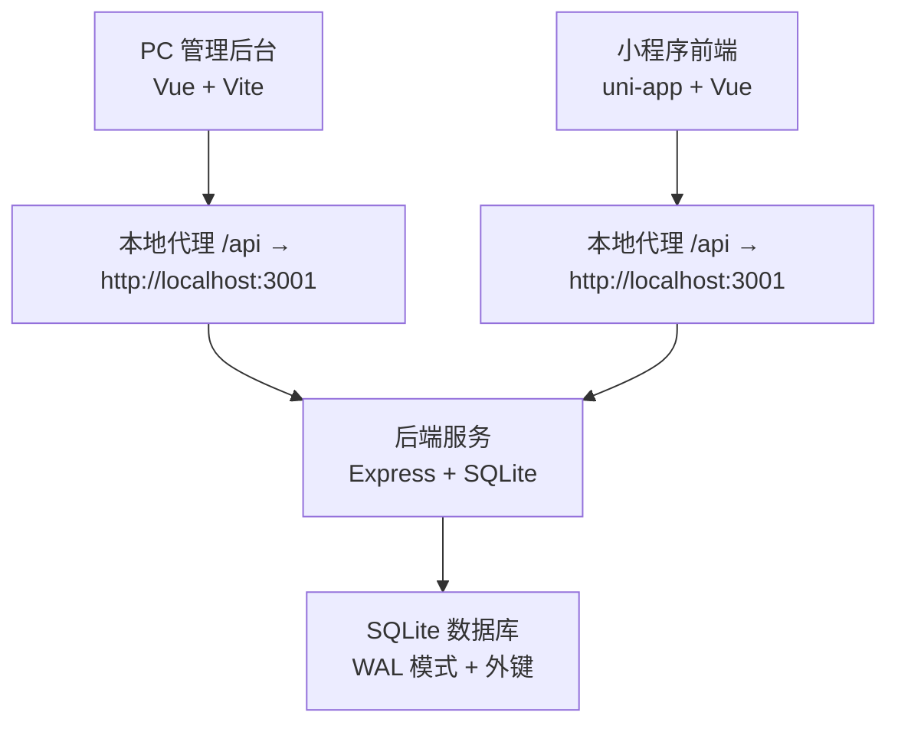
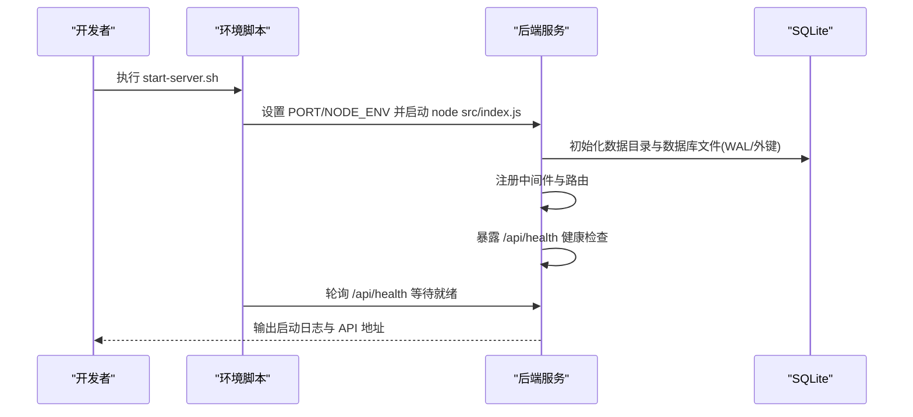
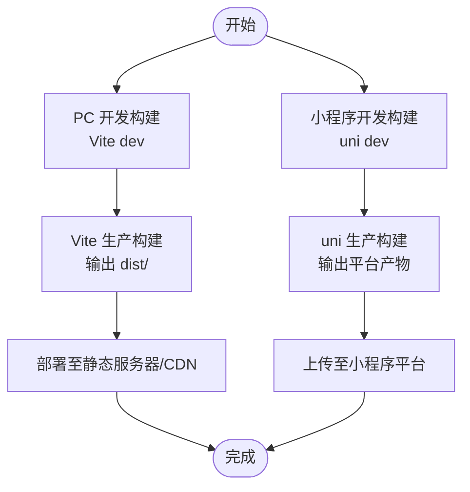
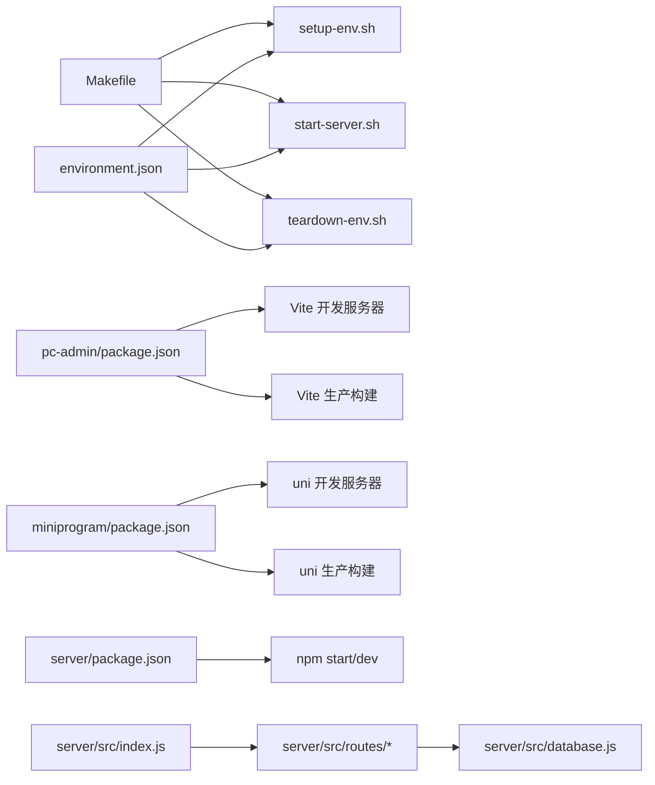
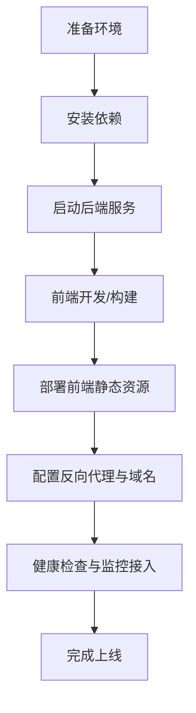

# 部署架构设计

<cite>
**本文引用的文件**
- [Makefile](file://Makefile)
- [environment.json](file://harness/config/environment.json)
- [setup-env.sh](file://harness/scripts/setup-env.sh)
- [start-server.sh](file://harness/scripts/start-server.sh)
- [teardown-env.sh](file://harness/scripts/teardown-env.sh)
- [server/package.json](file://star-park/server/package.json)
- [pc-admin/package.json](file://star-park/pc-admin/package.json)
- [miniprogram/package.json](file://star-park/miniprogram/package.json)
- [index.js](file://star-park/server/src/index.js)
- [database.js](file://star-park/server/src/database.js)
- [checkins.js](file://star-park/server/src/routes/checkins.js)
- [children.js](file://star-park/server/src/routes/children.js)
- [tasks.js](file://star-park/server/src/routes/tasks.js)
- [vite.config.js (pc-admin)](file://star-park/pc-admin/vite.config.js)
- [vite.config.js (miniprogram)](file://star-park/miniprogram/vite.config.js)
- [ARCHITECTURE.md](file://docs/ARCHITECTURE.md)
</cite>

## 目录
1. [简介](#简介)
2. [项目结构](#项目结构)
3. [核心组件](#核心组件)
4. [架构总览](#架构总览)
5. [详细组件分析](#详细组件分析)
6. [依赖关系分析](#依赖关系分析)
7. [性能考量](#性能考量)
8. [故障排查指南](#故障排查指南)
9. [结论](#结论)
10. [附录](#附录)

## 简介
本设计文档面向 StarParadise 的部署与运维，覆盖从单机开发到生产环境的部署拓扑、基础设施要求、后端服务与前端应用的构建发布流程、数据库部署与备份策略、环境配置管理、容器化部署选项、负载均衡与高可用设计、部署脚本使用方法、环境变量配置、日志与监控集成，以及部署流程图与运维最佳实践。

## 项目结构
项目采用 monorepo 结构，包含后端服务、PC 管理后台与小程序三个子项目，配合统一的构建与部署脚本。关键目录与职责如下：
- star-park/server：后端服务，基于 Express + SQLite，提供 REST API。
- star-park/pc-admin：PC 管理后台，Vue 3 + Vite，通过代理访问后端 API。
- star-park/miniprogram：小程序前端，基于 uni-app + Vue 3，通过代理访问后端 API。
- harness：部署与环境管理脚本与配置，包含环境参数、启动/停止脚本与功能场景定义。
- docs：架构与设计文档，包含系统架构图与模块说明。

图表来源
- [index.js:1-42](file://star-park/server/src/index.js#L1-L42)
- [database.js:1-111](file://star-park/server/src/database.js#L1-L111)
- [vite.config.js (pc-admin):1-19](file://star-park/pc-admin/vite.config.js#L1-L19)
- [vite.config.js (miniprogram):1-17](file://star-park/miniprogram/vite.config.js#L1-L17)
- [environment.json:1-65](file://harness/config/environment.json#L1-L65)
- [setup-env.sh:1-28](file://harness/scripts/setup-env.sh#L1-L28)
- [start-server.sh:1-29](file://harness/scripts/start-server.sh#L1-L29)
- [teardown-env.sh:1-14](file://harness/scripts/teardown-env.sh#L1-L14)
- [Makefile:1-70](file://Makefile#L1-L70)

章节来源
- [ARCHITECTURE.md:1-209](file://docs/ARCHITECTURE.md#L1-L209)
- [Makefile:1-70](file://Makefile#L1-L70)
- [environment.json:1-65](file://harness/config/environment.json#L1-L65)

## 核心组件
- 后端服务（Express + SQLite）
  - 服务入口负责中间件注册、路由挂载与健康检查端点。
  - 数据层通过 better-sqlite3 初始化 WAL 模式与外键约束，并自动创建数据库文件与表结构。
- 前端应用
  - PC 管理后台：Vite 开发服务器，本地代理指向后端服务端口；生产构建产物可部署至静态资源服务器或反向代理。
  - 小程序：uni-app 开发服务器，本地代理指向后端服务端口；生产构建产物用于各小程序平台。
- 部署与环境管理
  - 环境配置文件定义运行时语言版本、数据库类型与路径、服务端口、测试环境变量与功能场景。
  - 启动脚本设置环境变量并启动后端服务，内置健康检查等待逻辑。
  - 清理脚本终止后端进程并回收资源。

章节来源
- [index.js:1-42](file://star-park/server/src/index.js#L1-L42)
- [database.js:1-111](file://star-park/server/src/database.js#L1-L111)
- [pc-admin/package.json:1-26](file://star-park/pc-admin/package.json#L1-L26)
- [miniprogram/package.json:1-28](file://star-park/miniprogram/package.json#L1-L28)
- [environment.json:1-65](file://harness/config/environment.json#L1-L65)
- [start-server.sh:1-29](file://harness/scripts/start-server.sh#L1-L29)

## 架构总览
系统采用前后端分离的单体式部署模式，后端提供 REST API，前端通过代理访问后端。数据库为嵌入式 SQLite，部署简单、零运维成本，适合中小规模家庭应用场景。

图表来源
- [vite.config.js (pc-admin):1-19](file://star-park/pc-admin/vite.config.js#L1-L19)
- [vite.config.js (miniprogram):1-17](file://star-park/miniprogram/vite.config.js#L1-L17)
- [index.js:1-42](file://star-park/server/src/index.js#L1-L42)
- [database.js:1-111](file://star-park/server/src/database.js#L1-L111)

## 详细组件分析

### 后端服务部署配置
- 服务端口与环境变量
  - 默认端口：3001；可通过环境变量覆盖。
  - 运行模式：development/test 等通过 NODE_ENV 控制。
- 路由与健康检查
  - 路由前缀统一为 /api；健康检查端点 /api/health 返回状态。
- 数据库初始化
  - 首次启动自动创建数据目录与数据库文件，启用 WAL 模式与外键约束。
- 启动与停止
  - 启动脚本设置端口与环境变量，后台启动服务并轮询健康端点。
  - 停止脚本通过进程名匹配终止后端服务。

图表来源
- [start-server.sh:1-29](file://harness/scripts/start-server.sh#L1-L29)
- [index.js:1-42](file://star-park/server/src/index.js#L1-L42)
- [database.js:1-111](file://star-park/server/src/database.js#L1-L111)

章节来源
- [environment.json:1-65](file://harness/config/environment.json#L1-L65)
- [start-server.sh:1-29](file://harness/scripts/start-server.sh#L1-L29)
- [index.js:1-42](file://star-park/server/src/index.js#L1-L42)
- [database.js:1-111](file://star-park/server/src/database.js#L1-L111)

### 前端应用构建与发布流程
- PC 管理后台
  - 开发：Vite 本地开发服务器，端口 5173，默认代理 /api 到后端服务。
  - 构建：Vite 生产构建，产物位于 pc-admin/dist，可部署至 Nginx/Apache 或 CDN。
- 小程序
  - 开发：uni-app 本地开发服务器，端口 5173，默认代理 /api 到后端服务。
  - 构建：uni-app 生产构建，产物用于各小程序平台（如微信小程序）。
- 代理配置
  - 本地开发阶段通过 Vite/uni 插件配置代理，避免跨域问题。
  - 生产环境建议将前端静态资源托管于反向代理或 CDN，并将 /api 路由转发至后端服务。

图表来源
- [pc-admin/package.json:1-26](file://star-park/pc-admin/package.json#L1-L26)
- [miniprogram/package.json:1-28](file://star-park/miniprogram/package.json#L1-L28)
- [vite.config.js (pc-admin):1-19](file://star-park/pc-admin/vite.config.js#L1-L19)
- [vite.config.js (miniprogram):1-17](file://star-park/miniprogram/vite.config.js#L1-L17)

章节来源
- [pc-admin/package.json:1-26](file://star-park/pc-admin/package.json#L1-L26)
- [miniprogram/package.json:1-28](file://star-park/miniprogram/package.json#L1-L28)
- [vite.config.js (pc-admin):1-19](file://star-park/pc-admin/vite.config.js#L1-L19)
- [vite.config.js (miniprogram):1-17](file://star-park/miniprogram/vite.config.js#L1-L17)

### 数据库部署与备份策略
- 数据库类型与驱动
  - SQLite 嵌入式数据库，使用 better-sqlite3 驱动；无需独立数据库实例。
- 数据文件位置
  - 数据库文件位于后端数据目录，首次启动自动创建。
- 备份策略
  - 建议定期复制数据库文件进行备份；生产环境可结合定时任务与对象存储实现自动化备份。
  - 备份窗口应避开业务高峰期，确保数据一致性。
- 迁移与兼容
  - 启动时自动执行必要的迁移（新增列等），降低手动维护成本。

章节来源
- [database.js:1-111](file://star-park/server/src/database.js#L1-L111)
- [environment.json:1-65](file://harness/config/environment.json#L1-L65)

### 环境配置管理
- 运行时与依赖
  - 运行时语言版本与构建命令、开发命令、测试命令在环境配置中定义。
- 数据库配置
  - SQLite 配置包含驱动、路径与测试替代方案。
- 服务配置
  - HTTP 服务名称、类型、端口与环境变量映射。
- 测试环境
  - 定义测试环境变量（如 NODE_ENV、PORT）。
- 功能场景
  - 健康检查与打卡流程等场景步骤与预期结果，便于自动化验证。

章节来源
- [environment.json:1-65](file://harness/config/environment.json#L1-L65)

### 容器化部署选项
- 单容器部署
  - 使用 Node.js 运行时镜像，挂载后端数据目录与前端构建产物目录，暴露后端服务端口。
- 多容器部署
  - 后端容器：运行 Express 服务。
  - 前端容器：Nginx 托管 pc-admin/dist，反向代理 /api 至后端容器。
  - 数据卷：持久化 SQLite 数据文件与日志目录。
- 容器编排
  - 使用 Docker Compose 或 Kubernetes 管理容器生命周期与网络，实现健康检查与滚动更新。

[本节为概念性说明，不直接分析具体文件，故不附“章节来源”]

### 负载均衡与高可用设计
- 单实例适用场景
  - 小型家庭应用或开发测试环境，单实例足以满足需求。
- 扩展思路
  - 前端：多副本 Nginx/CDN 分发静态资源。
  - 后端：多实例 + 反向代理（Nginx/Haproxy）实现会话亲和或无状态化改造。
  - 数据：若业务增长，可评估迁移到更健壮的关系型数据库，同时保留备份与灾备策略。

[本节为概念性说明，不直接分析具体文件，故不附“章节来源”]

### 部署脚本使用方法
- 环境准备
  - 安装依赖：自动检测并安装后端、PC 管理后台、小程序三处依赖。
- 启动服务
  - 设置端口与运行模式，启动后端服务并等待健康检查就绪。
- 停止服务
  - 终止后端进程并清理残留进程。

章节来源
- [setup-env.sh:1-28](file://harness/scripts/setup-env.sh#L1-L28)
- [start-server.sh:1-29](file://harness/scripts/start-server.sh#L1-L29)
- [teardown-env.sh:1-14](file://harness/scripts/teardown-env.sh#L1-L14)
- [Makefile:62-70](file://Makefile#L62-L70)

### 环境变量配置
- PORT：后端服务监听端口，默认 3001。
- NODE_ENV：运行模式，如 development/test。
- 其他：根据需要可在启动脚本中扩展更多环境变量。

章节来源
- [start-server.sh:1-29](file://harness/scripts/start-server.sh#L1-L29)
- [environment.json:1-65](file://harness/config/environment.json#L1-L65)

### 日志管理与监控集成
- 日志
  - 后端服务启动日志与错误日志输出到控制台；建议在容器或 systemd 环境中重定向至文件或集中日志系统。
- 监控
  - 健康检查端点可用于存活探针与就绪探针。
  - 建议接入指标采集（如 Prometheus）与链路追踪（如 OpenTelemetry）以观测性能与异常。

章节来源
- [index.js:1-42](file://star-park/server/src/index.js#L1-L42)

## 依赖关系分析

图表来源
- [Makefile:1-70](file://Makefile#L1-L70)
- [environment.json:1-65](file://harness/config/environment.json#L1-L65)
- [pc-admin/package.json:1-26](file://star-park/pc-admin/package.json#L1-L26)
- [miniprogram/package.json:1-28](file://star-park/miniprogram/package.json#L1-L28)
- [server/package.json:1-15](file://star-park/server/package.json#L1-L15)
- [index.js:1-42](file://star-park/server/src/index.js#L1-L42)
- [database.js:1-111](file://star-park/server/src/database.js#L1-L111)

章节来源
- [Makefile:1-70](file://Makefile#L1-L70)
- [environment.json:1-65](file://harness/config/environment.json#L1-L65)

## 性能考量
- 数据库性能
  - WAL 模式提升并发读写性能；外键约束保证数据一致性。
  - 建议在高频查询场景下建立必要索引（如 checkins 的 child_id、date 组合索引）。
- 服务性能
  - Express 中间件简洁，JSON 解析与路由处理开销低；可根据需要引入缓存与连接池优化。
- 前端性能
  - 生产构建开启压缩与 Tree-shaking；CDN 加速静态资源加载。

章节来源
- [database.js:1-111](file://star-park/server/src/database.js#L1-L111)
- [index.js:1-42](file://star-park/server/src/index.js#L1-L42)

## 故障排查指南
- 服务无法启动
  - 检查端口占用与权限；确认环境变量设置是否正确。
- 健康检查失败
  - 查看后端启动日志；确认路由与中间件是否正确加载。
- 数据库异常
  - 检查数据目录权限与磁盘空间；必要时重建数据库文件并恢复备份。
- 前端代理问题
  - 确认本地代理配置与后端服务端口一致；生产环境需确保 /api 路由转发正确。

章节来源
- [start-server.sh:1-29](file://harness/scripts/start-server.sh#L1-L29)
- [index.js:1-42](file://star-park/server/src/index.js#L1-L42)
- [database.js:1-111](file://star-park/server/src/database.js#L1-L111)
- [vite.config.js (pc-admin):1-19](file://star-park/pc-admin/vite.config.js#L1-L19)
- [vite.config.js (miniprogram):1-17](file://star-park/miniprogram/vite.config.js#L1-L17)

## 结论
StarParadise 采用轻量级单体部署架构，后端基于 Express + SQLite，前端分别提供 PC 管理后台与小程序，配合统一的部署脚本与环境配置，能够快速完成从开发到生产的落地。对于小规模家庭应用，该架构具备部署简单、运维成本低的优势；随着业务增长，可按需扩展为多实例与容器化部署，并引入更完善的监控与备份体系。

## 附录
- 部署流程图（概念性）

[本图为概念性流程示意，不对应具体源文件，故不附“图表来源”]