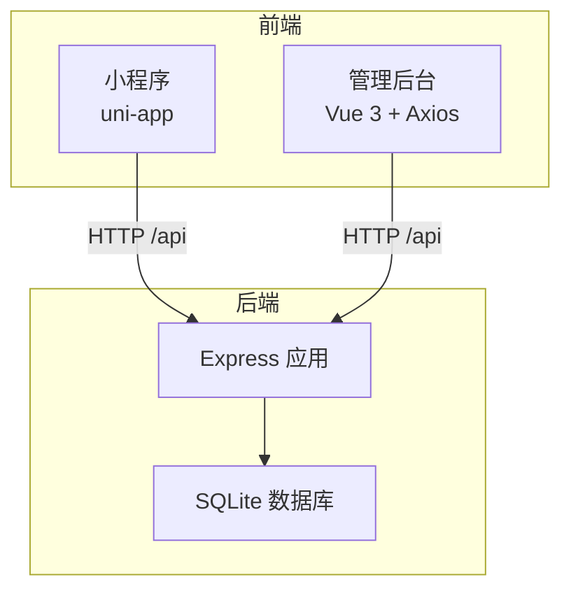
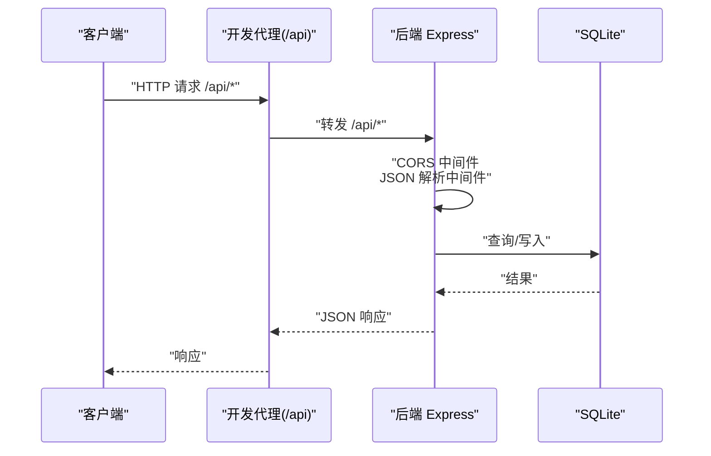
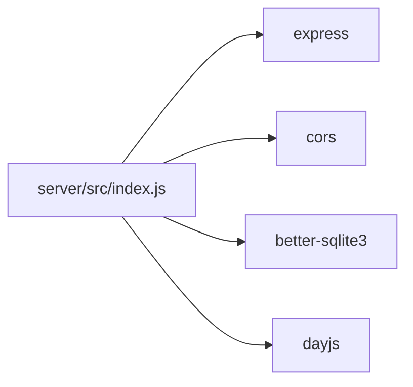
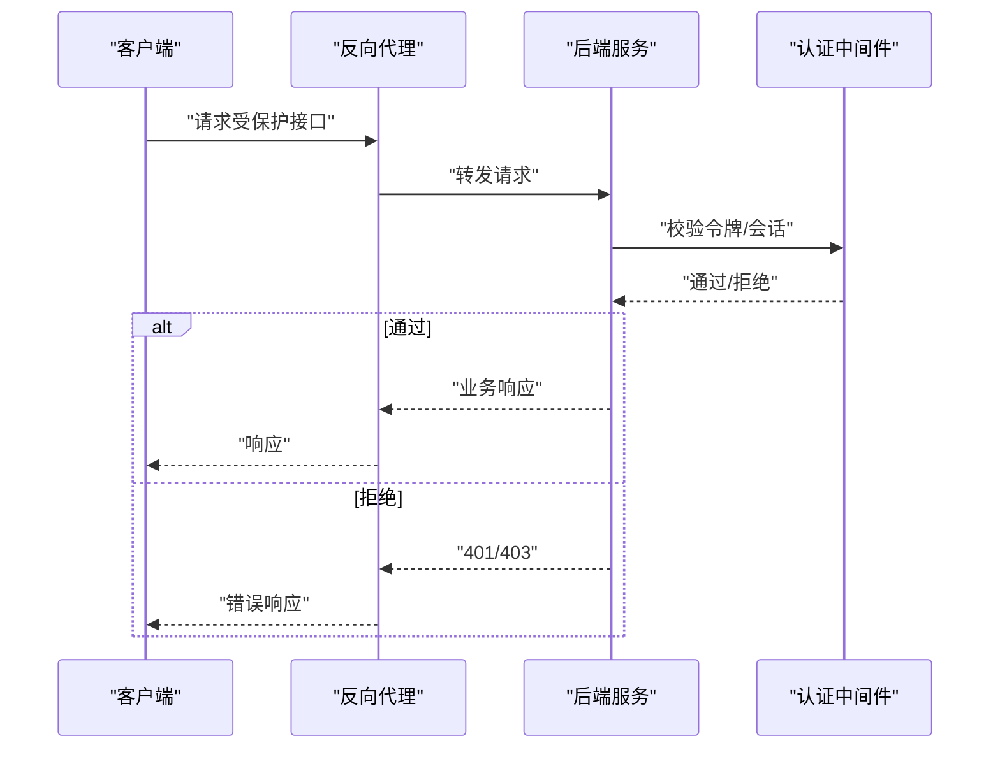

# 安全加固

<cite>
**本文引用的文件**
- [server/src/index.js](file://star-park/server/src/index.js)
- [server/src/database.js](file://star-park/server/src/database.js)
- [server/src/seed.js](file://star-park/server/src/seed.js)
- [server/src/routes/checkins.js](file://star-park/server/src/routes/checkins.js)
- [server/package.json](file://star-park/server/package.json)
- [miniprogram/src/api/index.js](file://star-park/miniprogram/src/api/index.js)
- [pc-admin/src/api/index.js](file://star-park/pc-admin/src/api/index.js)
- [miniprogram/vite.config.js](file://star-park/miniprogram/vite.config.js)
- [pc-admin/vite.config.js](file://star-park/pc-admin/vite.config.js)
- [docs/ARCHITECTURE.md](file://docs/ARCHITECTURE.md)
- [docs/api.md](file://docs/api.md)
- [harness/config/environment.json](file://harness/config/environment.json)
</cite>

## 目录
1. [引言](#引言)
2. [项目结构](#项目结构)
3. [核心组件](#核心组件)
4. [架构总览](#架构总览)
5. [详细组件分析](#详细组件分析)
6. [依赖分析](#依赖分析)
7. [性能考虑](#性能考虑)
8. [故障排查指南](#故障排查指南)
9. [结论](#结论)
10. [附录](#附录)

## 引言
本指南面向生产环境部署的StarParadise项目，聚焦当前系统在安全方面的现状与潜在风险，特别是无认证中间件带来的安全隐患，并提供可落地的安全加固建议。内容涵盖API认证机制（JWT或Session）、CORS白名单配置、HTTPS反向代理、网络安全配置（防火墙、端口、访问控制）、数据安全（传输与存储）、安全审计与漏洞扫描、以及安全事件应急响应流程。

## 项目结构
系统采用前后端分离的monorepo架构：后端Express + SQLite提供REST API；管理后台PC端使用Vue 3 + Axios；小程序端使用Vue 3 + uni-app。前端通过本地开发代理将/api前缀转发到后端服务，后端提供统一的REST接口。

图表来源
- [docs/ARCHITECTURE.md:14-71](file://docs/ARCHITECTURE.md#L14-L71)
- [miniprogram/vite.config.js:9-14](file://star-park/miniprogram/vite.config.js#L9-L14)
- [pc-admin/vite.config.js:8-13](file://star-park/pc-admin/vite.config.js#L8-L13)

章节来源
- [docs/ARCHITECTURE.md:1-209](file://docs/ARCHITECTURE.md#L1-L209)
- [miniprogram/vite.config.js:1-17](file://star-park/miniprogram/vite.config.js#L1-L17)
- [pc-admin/vite.config.js:1-19](file://star-park/pc-admin/vite.config.js#L1-L19)

## 核心组件
- 后端服务入口与中间件：启用CORS与JSON解析，注册各业务路由，提供健康检查端点与种子数据初始化。
- 数据层：SQLite数据库初始化、WAL模式、外键约束、迁移脚本。
- 前端API封装：小程序端基于uni.request，管理后台基于Axios，均通过/api前缀访问后端。
- 开发代理：前后端均配置了将/api转发至后端的服务地址。

章节来源
- [server/src/index.js:1-42](file://star-park/server/src/index.js#L1-L42)
- [server/src/database.js:1-111](file://star-park/server/src/database.js#L1-L111)
- [server/src/seed.js:1-45](file://star-park/server/src/seed.js#L1-L45)
- [miniprogram/src/api/index.js:1-75](file://star-park/miniprogram/src/api/index.js#L1-L75)
- [pc-admin/src/api/index.js:1-56](file://star-park/pc-admin/src/api/index.js#L1-L56)

## 架构总览
下图展示从客户端到后端API再到数据库的数据流，以及当前存在的安全薄弱点（无认证、CORS默认开放、明文HTTP）。

图表来源
- [server/src/index.js:17-18](file://star-park/server/src/index.js#L17-L18)
- [miniprogram/vite.config.js:9-14](file://star-park/miniprogram/vite.config.js#L9-L14)
- [pc-admin/vite.config.js:8-13](file://star-park/pc-admin/vite.config.js#L8-L13)

## 详细组件分析

### 当前安全状况与风险评估
- 认证与授权：后端未实现任何认证/授权机制，所有接口均可匿名访问，存在数据篡改、滥用与隐私泄露风险。
- CORS策略：默认启用CORS中间件且未配置白名单，跨域请求可能来自不受信任源，易受CSRF与XSS攻击。
- 传输安全：开发阶段通过HTTP明文传输，未启用HTTPS，存在中间人攻击与数据窃听风险。
- 输入校验与注入：部分路由对输入参数进行简单校验，但缺乏严格的参数类型、范围与格式校验，SQL注入与业务逻辑滥用风险较高。
- 健康检查与可观测性：健康检查端点未鉴权，可能被恶意探测利用。
- 数据库安全：SQLite文件位于本地目录，未做访问控制与备份加密，存在本地泄露风险。

章节来源
- [server/src/index.js:17-32](file://star-park/server/src/index.js#L17-L32)
- [docs/api.md:12-13](file://docs/api.md#L12-L13)
- [server/src/routes/checkins.js:34-44](file://star-park/server/src/routes/checkins.js#L34-L44)

### 生产环境安全加固建议

#### 1) API认证机制（JWT或Session）
- 选择方案
  - JWT：适合无状态、跨域场景；需妥善保管密钥与签名算法，设置合理过期时间与刷新策略。
  - Session：适合有状态场景；需配合安全Cookie（HttpOnly、Secure、SameSite）与会话超时。
- 集成步骤（通用）
  - 在后端中间件中引入认证模块，对受保护路由进行鉴权。
  - 在登录/注册接口返回令牌或设置会话，并在后续请求中携带令牌或Cookie。
  - 对关键操作（如创建/修改/删除）强制要求认证。
  - 为管理后台与小程序分别设计鉴权流程，确保令牌传递与刷新机制一致。
- 令牌存储与传输
  - 前端避免将敏感令牌存于localStorage；优先使用HttpOnly Cookie（需HTTPS）。
  - 传输层必须启用HTTPS，防止令牌在传输中被截获。

章节来源
- [server/src/index.js:17-27](file://star-park/server/src/index.js#L17-L27)

#### 2) CORS白名单配置
- 限制允许来源：仅允许管理后台与小程序域名访问后端API，拒绝任意来源。
- 允许方法与头：明确允许的HTTP方法与自定义头，避免通配符。
- 凭据支持：若需要携带Cookie，需显式允许凭据并指定具体来源。
- 建议使用专门的CORS中间件库，集中配置并定期审查。

章节来源
- [server/src/index.js:17-17](file://star-park/server/src/index.js#L17-L17)

#### 3) HTTPS与反向代理
- 反向代理（Nginx/Apache/Caddy）前置，开启TLS 1.2+/1.3，禁用弱密码套件。
- 将后端服务绑定在内网环回地址（如127.0.0.1），仅通过反向代理对外暴露。
- 配置严格的安全响应头（HSTS、X-Frame-Options、X-Content-Type-Options、Referrer-Policy）。
- 证书管理：使用自动化证书签发与续期（Let’s Encrypt），定期轮换私钥。

章节来源
- [harness/config/environment.json:23-25](file://harness/config/environment.json#L23-L25)

#### 4) 网络安全配置
- 防火墙规则
  - 默认拒绝所有入站连接，仅开放反向代理的HTTPS端口（443）。
  - 仅允许运维/监控IP访问SSH与数据库管理端口（如需直连）。
- 端口管理
  - 后端仅监听127.0.0.1，不暴露公网。
  - 反向代理负责端口映射与TLS终止。
- 访问控制策略
  - 对健康检查与静态资源设置访问限制。
  - 对管理后台与小程序域名实施IP/来源白名单。

章节来源
- [harness/config/environment.json:23-25](file://harness/config/environment.json#L23-L25)

#### 5) 数据安全保护
- 传输安全
  - 强制HTTPS，禁用HTTP；启用HSTS。
  - 对敏感数据（如令牌、凭证）进行最小化暴露。
- 存储安全
  - SQLite数据库文件放置在受限权限目录，仅授予运行用户读写。
  - 定期备份并加密存储，备份介质与主库隔离。
  - 对日志中的敏感字段脱敏或禁止记录。
- 敏感数据加密
  - 如需存储加密字段，使用强对称/非对称加密库，妥善管理密钥（建议使用密钥管理服务）。
  - 避免在数据库中明文存储密码或令牌。

章节来源
- [server/src/database.js:5-11](file://star-park/server/src/database.js#L5-L11)

#### 6) 输入校验与业务安全
- 参数校验：对所有入参进行类型、长度、范围与格式校验，拒绝异常值。
- SQL注入防护：统一使用参数化查询或ORM，避免动态拼接SQL。
- 业务逻辑校验：对关键操作（创建/修改/删除）进行权限与状态校验，防止越权与重复提交。
- 速率限制：对公共接口实施速率限制，缓解暴力破解与DDoS。

章节来源
- [server/src/routes/checkins.js:34-44](file://star-park/server/src/routes/checkins.js#L34-L44)

#### 7) 健康检查与可观测性
- 健康检查端点：建议改为仅内网可访问或加入认证。
- 日志与审计：记录关键操作与异常事件，保留足够上下文信息以便追溯。
- 监控告警：对异常状态码、响应时间、错误率、资源使用率设置阈值告警。

章节来源
- [server/src/index.js:30-32](file://star-park/server/src/index.js#L30-L32)

#### 8) 前端安全
- 小程序端：通过代理访问后端，避免硬编码后端地址；在生产环境将代理指向HTTPS反向代理。
- 管理后台：Axios实例统一配置基础URL与超时；对错误响应进行统一处理，避免泄露内部细节。
- 内容安全策略（CSP）：在反向代理或服务端设置CSP头，限制脚本执行来源与内联脚本。

章节来源
- [miniprogram/src/api/index.js:1-3](file://star-park/miniprogram/src/api/index.js#L1-L3)
- [pc-admin/src/api/index.js:4-10](file://star-park/pc-admin/src/api/index.js#L4-L10)

## 依赖分析
后端依赖简洁，主要为Express、CORS、better-sqlite3与dayjs。当前未包含认证、CSP、HSTS等安全相关依赖，需按加固建议补充。

图表来源
- [server/package.json:8-13](file://star-park/server/package.json#L8-L13)

章节来源
- [server/package.json:1-15](file://star-park/server/package.json#L1-L15)

## 性能考虑
- CORS中间件默认配置可能带来额外开销，建议在生产中精简允许来源与方法。
- SQLite WAL模式已启用，有助于并发读写；但生产环境建议结合只读副本与缓存层进一步优化。
- 反向代理可承担压缩、缓存静态资源等任务，减轻后端压力。

## 故障排查指南
- 健康检查失败
  - 检查后端进程状态与端口占用；确认种子数据初始化是否成功。
- CORS错误
  - 核对CORS白名单配置，确保来源与方法匹配。
- 代理转发问题
  - 检查开发代理配置与反向代理规则，确认/api前缀转发正确。
- 数据库异常
  - 检查数据库文件权限与磁盘空间；查看迁移脚本是否执行成功。

章节来源
- [server/src/index.js:34-35](file://star-park/server/src/index.js#L34-L35)
- [server/src/database.js:82-108](file://star-park/server/src/database.js#L82-L108)
- [miniprogram/vite.config.js:9-14](file://star-park/miniprogram/vite.config.js#L9-L14)
- [pc-admin/vite.config.js:8-13](file://star-park/pc-admin/vite.config.js#L8-L13)

## 结论
当前系统在生产环境中存在显著安全短板，尤其是无认证与CORS默认开放。建议立即引入认证机制（JWT或Session）、配置CORS白名单、启用HTTPS与反向代理、强化输入校验与业务安全、完善数据与日志安全策略，并建立安全审计与应急响应流程。通过渐进式加固，可在保障功能完整性的同时显著提升整体安全性。

## 附录

### API认证集成流程（序列图）

图表来源
- [server/src/index.js:17-27](file://star-park/server/src/index.js#L17-L27)