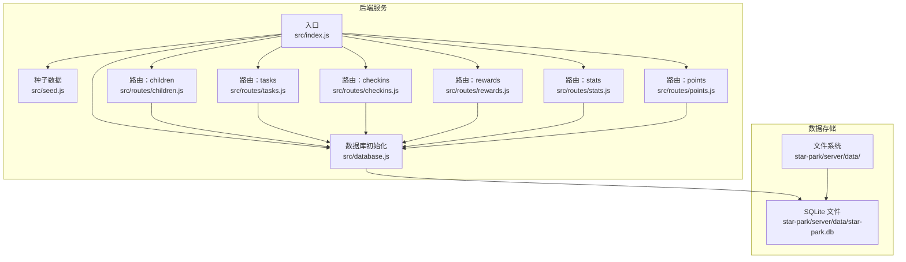
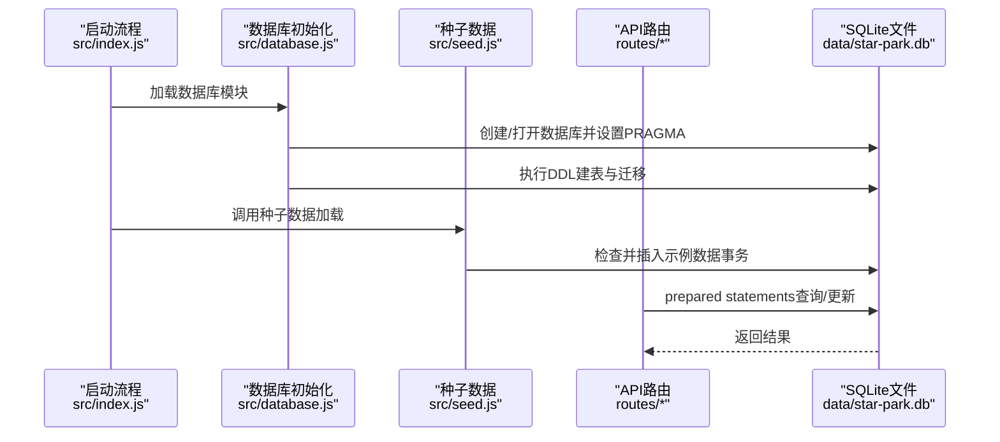
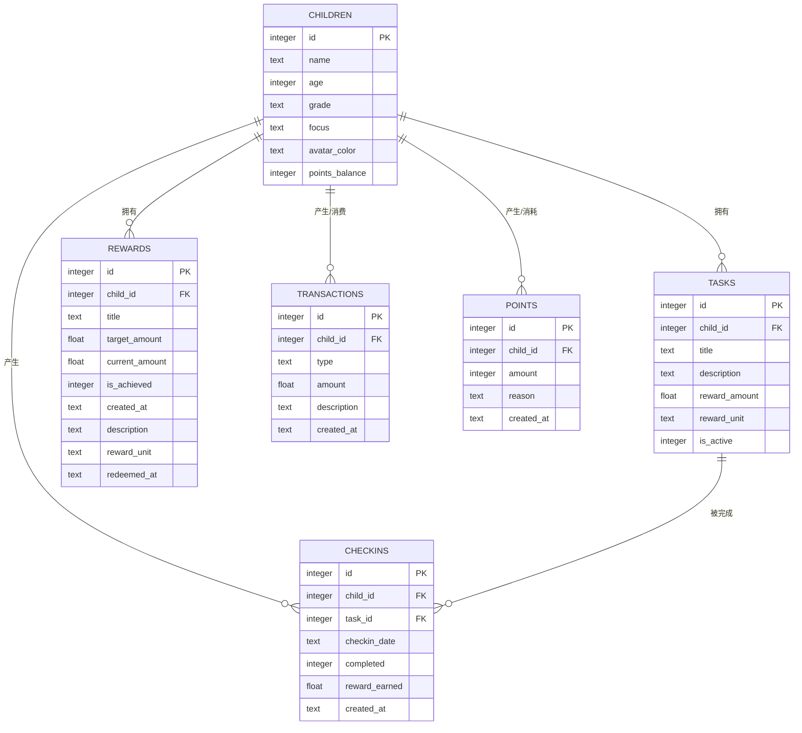
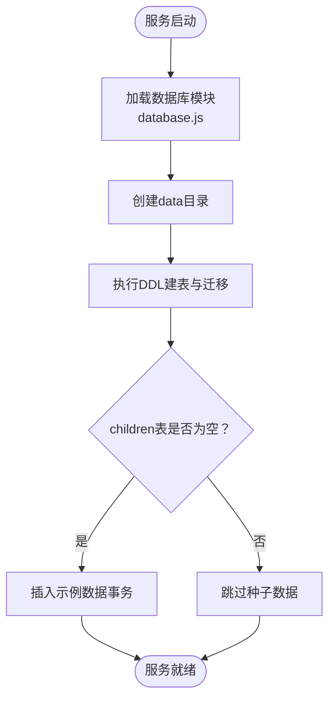
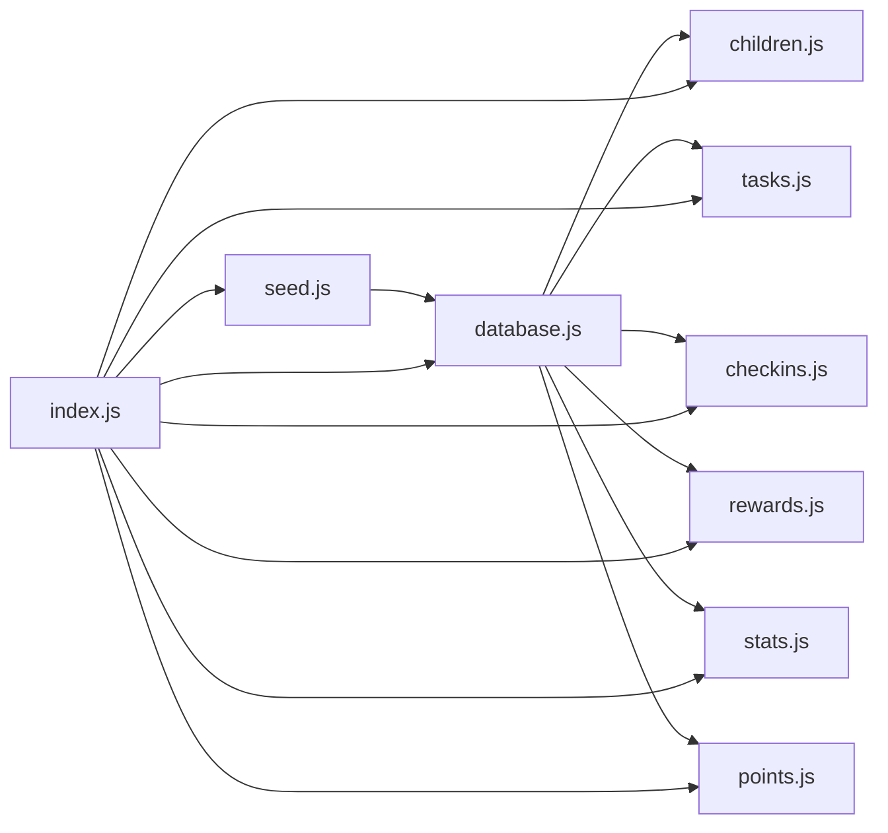

# 数据库维护

<cite>
**本文引用的文件**
- [database.js](file://star-park/server/src/database.js)
- [seed.js](file://star-park/server/src/seed.js)
- [index.js](file://star-park/server/src/index.js)
- [children.js](file://star-park/server/src/routes/children.js)
- [tasks.js](file://star-park/server/src/routes/tasks.js)
- [checkins.js](file://star-park/server/src/routes/checkins.js)
- [rewards.js](file://star-park/server/src/routes/rewards.js)
- [stats.js](file://star-park/server/src/routes/stats.js)
- [points.js](file://star-park/server/src/routes/points.js)
- [check-db-consistency.sh](file://scripts/check-db-consistency.sh)
- [OPERATIONS.md](file://docs/OPERATIONS.md)
- [.gitignore](file://star-park/server/.gitignore)
</cite>

## 目录
1. [简介](#简介)
2. [项目结构](#项目结构)
3. [核心组件](#核心组件)
4. [架构总览](#架构总览)
5. [详细组件分析](#详细组件分析)
6. [依赖关系分析](#依赖关系分析)
7. [性能考虑](#性能考虑)
8. [故障排查指南](#故障排查指南)
9. [结论](#结论)
10. [附录](#附录)

## 简介
本文件面向StarParadise项目的数据库维护工作，聚焦于SQLite数据库的日常维护、备份与恢复、文件管理、WAL模式配置与优势、性能优化（PRAGMA、索引与查询）、初始化与种子数据加载机制，以及常见问题（如数据库锁定、文件损坏）的诊断与处理。内容基于仓库中的实际实现与运维文档整理而成，便于技术与非技术读者理解与执行。

## 项目结构
- 数据库文件位置：star-park/server/data/star-park.db
- 初始化与迁移：database.js负责数据库实例化、PRAGMA设置、DDL建表与列迁移
- 种子数据：seed.js在首次启动时检测并插入示例数据
- API层：routes目录下的各路由模块读写数据库，提供业务接口
- 运维与一致性检查：scripts/check-db-consistency.sh进行DDL一致性校验；docs/OPERATIONS.md提供备份/恢复与性能调优指引

图表来源
- [index.js:1-42](file://star-park/server/src/index.js#L1-L42)
- [database.js:1-111](file://star-park/server/src/database.js#L1-L111)
- [seed.js:1-45](file://star-park/server/src/seed.js#L1-L45)
- [children.js:1-96](file://star-park/server/src/routes/children.js#L1-L96)
- [tasks.js:1-91](file://star-park/server/src/routes/tasks.js#L1-L91)
- [checkins.js:1-90](file://star-park/server/src/routes/checkins.js#L1-L90)
- [rewards.js:1-167](file://star-park/server/src/routes/rewards.js#L1-L167)
- [stats.js:1-182](file://star-park/server/src/routes/stats.js#L1-L182)
- [points.js:1-74](file://star-park/server/src/routes/points.js#L1-L74)

章节来源
- [index.js:1-42](file://star-park/server/src/index.js#L1-L42)
- [database.js:1-111](file://star-park/server/src/database.js#L1-L111)
- [seed.js:1-45](file://star-park/server/src/seed.js#L1-L45)
- [OPERATIONS.md:91-109](file://docs/OPERATIONS.md#L91-L109)

## 核心组件
- 数据库初始化与PRAGMA
  - 在database.js中创建data目录、实例化SQLite数据库，并启用WAL模式与外键约束
  - 通过exec批量创建核心表（children、tasks、checkins、rewards、transactions、points）
  - 通过ALTER语句进行列级迁移，保证历史数据平滑演进
- 种子数据加载
  - seed.js在启动时检测children表是否为空，若为空则批量插入示例数据，使用事务保证原子性
- API路由与数据库交互
  - 各路由模块通过prepared statements访问数据库，执行查询、插入、更新、删除等操作
  - 对关键流程（如打卡、兑换奖励、手动积分）采用事务，确保数据一致性

章节来源
- [database.js:10-111](file://star-park/server/src/database.js#L10-L111)
- [seed.js:3-42](file://star-park/server/src/seed.js#L3-L42)
- [children.js:6-37](file://star-park/server/src/routes/children.js#L6-L37)
- [tasks.js:21-36](file://star-park/server/src/routes/tasks.js#L21-L36)
- [checkins.js:30-87](file://star-park/server/src/routes/checkins.js#L30-L87)
- [rewards.js:89-164](file://star-park/server/src/routes/rewards.js#L89-L164)
- [points.js:30-72](file://star-park/server/src/routes/points.js#L30-L72)

## 架构总览
下图展示数据库在系统中的角色与数据流：后端服务启动时初始化数据库与种子数据，API路由通过prepared statements与数据库交互，形成请求-准备语句-执行-返回响应的闭环。

图表来源
- [index.js:34-35](file://star-park/server/src/index.js#L34-L35)
- [database.js:10-111](file://star-park/server/src/database.js#L10-L111)
- [seed.js:3-42](file://star-park/server/src/seed.js#L3-L42)
- [children.js:6-37](file://star-park/server/src/routes/children.js#L6-L37)
- [tasks.js:21-36](file://star-park/server/src/routes/tasks.js#L21-L36)
- [checkins.js:30-87](file://star-park/server/src/routes/checkins.js#L30-L87)
- [rewards.js:89-164](file://star-park/server/src/routes/rewards.js#L89-L164)
- [points.js:30-72](file://star-park/server/src/routes/points.js#L30-L72)

## 详细组件分析

### 数据库文件位置与结构
- 文件位置
  - 数据库存放在star-park/server/data/star-park.db
  - data目录在首次启动时自动创建
- 结构概览
  - 核心表：children、tasks、checkins、rewards、transactions、points
  - 外键约束：checkins对children、tasks的ON DELETE CASCADE
  - 列迁移：为children增加points_balance；为rewards增加description、reward_unit、redeemed_at

图表来源
- [database.js:18-80](file://star-park/server/src/database.js#L18-L80)

章节来源
- [database.js:5-11](file://star-park/server/src/database.js#L5-L11)
- [database.js:18-80](file://star-park/server/src/database.js#L18-L80)
- [database.js:82-108](file://star-park/server/src/database.js#L82-L108)

### WAL模式的启用与优势
- 启用方式：在database.js中通过PRAGMA开启WAL模式与外键约束
- 优势
  - 提升并发读写性能：允许多个读事务与一个写事务并发执行
  - 改善写入吞吐：减少写锁冲突，降低阻塞概率
  - 更好的崩溃恢复：WAL模式下重放日志更高效
- 注意事项
  - 生产环境建议配合定期PRAGMA optimize进行碎片整理与统计更新
  - 保持文件系统与磁盘I/O稳定，避免频繁断电导致WAL文件异常

章节来源
- [database.js:13-15](file://star-park/server/src/database.js#L13-L15)
- [OPERATIONS.md:104-109](file://docs/OPERATIONS.md#L104-L109)

### 数据库初始化与种子数据加载
- 初始化流程
  - 启动时加载database.js，自动创建data目录并实例化数据库
  - 执行DDL建表与列迁移
- 种子数据
  - 启动时检查children表是否为空，为空则插入示例数据
  - 使用事务包裹插入，确保原子性
- 运维建议
  - 若需“清空并重建”，可删除数据库文件后重启服务，系统将自动重建并再次加载种子数据

图表来源
- [index.js:34-35](file://star-park/server/src/index.js#L34-L35)
- [database.js:10-111](file://star-park/server/src/database.js#L10-L111)
- [seed.js:3-42](file://star-park/server/src/seed.js#L3-L42)

章节来源
- [index.js:34-35](file://star-park/server/src/index.js#L34-L35)
- [seed.js:3-42](file://star-park/server/src/seed.js#L3-L42)
- [OPERATIONS.md:91-102](file://docs/OPERATIONS.md#L91-L102)

### 数据库备份与恢复策略
- 备份
  - 建议在停机或低峰期执行物理复制备份
  - 备份命令参考：cp star-park/server/data/star-park.db star-park/server/data/star-park.db.bak
- 恢复
  - 从备份文件恢复：cp star-park/server/data/star-park.db.bak star-park/server/data/star-park.db
- 一致性检查
  - 使用check-db-consistency.sh脚本检查核心表与关键字段是否存在
  - 首次启动时数据库文件不存在会跳过检查

章节来源
- [OPERATIONS.md:91-102](file://docs/OPERATIONS.md#L91-L102)
- [check-db-consistency.sh:13-44](file://scripts/check-db-consistency.sh#L13-L44)

### 数据库文件管理
- 文件位置与忽略
  - 数据库文件位于star-park/server/data/star-park.db
  - data目录与*.db文件在.gitignore中被忽略，避免误提交
- 权限与安全
  - 当前项目未启用认证中间件，适合家庭内网使用
  - 生产部署建议添加API认证、CORS白名单与HTTPS反向代理

章节来源
- [database.js:5-11](file://star-park/server/src/database.js#L5-L11)
- [.gitignore:1-3](file://star-park/server/.gitignore#L1-L3)
- [OPERATIONS.md:110-117](file://docs/OPERATIONS.md#L110-L117)

### 性能优化建议
- PRAGMA优化
  - 定期执行PRAGMA optimize（生产环境建议纳入运维计划）
  - WAL模式已启用，有助于并发与写入性能
- 索引优化
  - 根据查询模式评估是否需要为常用过滤字段建立索引（如checkins.checkin_date、children.id等）
  - 注意：SQLite在某些场景下可能自动选择最优执行计划，新增索引需结合实际查询分析
- 查询性能调优
  - 使用prepared statements减少编译开销
  - 避免SELECT *，仅取必要字段
  - 对高频聚合查询（如统计、仪表盘）可考虑物化视图或应用侧缓存

章节来源
- [OPERATIONS.md:104-109](file://docs/OPERATIONS.md#L104-L109)
- [stats.js:6-101](file://star-park/server/src/routes/stats.js#L6-L101)
- [children.js:6-37](file://star-park/server/src/routes/children.js#L6-L37)
- [checkins.js:6-28](file://star-park/server/src/routes/checkins.js#L6-L28)

### 数据库一致性检查
- 检查内容
  - 核心表存在性：children、tasks、checkins、rewards、transactions、points
  - 关键字段存在性：children表的name、age、grade、focus、avatar_color、points_balance
- 执行方式
  - 通过shell脚本调用sqlite3命令行工具进行检查
  - 首次启动时数据库文件不存在会跳过检查

章节来源
- [check-db-consistency.sh:21-41](file://scripts/check-db-consistency.sh#L21-L41)

## 依赖关系分析
- 组件耦合
  - database.js作为单例，被所有路由模块依赖
  - seed.js依赖database.js进行数据初始化
  - index.js负责组装路由与启动服务
- 外部依赖
  - better-sqlite3驱动SQLite
  - dayjs用于日期计算
- 潜在循环依赖
  - 当前结构清晰，无明显循环依赖

图表来源
- [database.js:1-111](file://star-park/server/src/database.js#L1-L111)
- [seed.js:1-45](file://star-park/server/src/seed.js#L1-L45)
- [index.js:1-42](file://star-park/server/src/index.js#L1-L42)
- [children.js:1-96](file://star-park/server/src/routes/children.js#L1-L96)
- [tasks.js:1-91](file://star-park/server/src/routes/tasks.js#L1-L91)
- [checkins.js:1-90](file://star-park/server/src/routes/checkins.js#L1-L90)
- [rewards.js:1-167](file://star-park/server/src/routes/rewards.js#L1-L167)
- [stats.js:1-182](file://star-park/server/src/routes/stats.js#L1-L182)
- [points.js:1-74](file://star-park/server/src/routes/points.js#L1-L74)

## 性能考虑
- 并发与写入
  - WAL模式显著提升并发读写能力，适合多用户同时操作
- 统计与优化
  - 建议定期执行PRAGMA optimize，保持查询计划最优
- 查询模式
  - 高频统计类接口（仪表盘、周统计）建议结合应用缓存或定时刷新
- I/O与存储
  - 保持稳定的文件系统与磁盘空间，避免频繁断电导致WAL文件异常

章节来源
- [database.js:13-15](file://star-park/server/src/database.js#L13-L15)
- [OPERATIONS.md:104-109](file://docs/OPERATIONS.md#L104-L109)

## 故障排查指南
- 数据库锁定
  - 现象：写入失败或长时间阻塞
  - 排查：确认是否处于WAL模式；检查是否有长事务未提交；避免在同一进程中同时持有读写锁
  - 处理：缩短事务范围，确保及时commit/rollback
- 文件损坏
  - 现象：启动时报错或查询异常
  - 排查：使用sqlite3工具检查完整性（如pragma integrity_check）
  - 处理：优先使用备份恢复；若无备份，尝试从WAL文件回滚至最近一致点
- 字段缺失或DDL不一致
  - 现象：接口报字段不存在或类型不匹配
  - 排查：运行check-db-consistency.sh核对核心表与字段
  - 处理：根据迁移逻辑补充缺失列，或重建数据库后重新加载种子数据
- 外键约束错误
  - 现象：删除/更新时提示外键约束失败
  - 排查：确认删除顺序（先删除checkins，再删除tasks/rewards）
  - 处理：遵循路由中的事务顺序，确保级联删除生效

章节来源
- [check-db-consistency.sh:13-44](file://scripts/check-db-consistency.sh#L13-L44)
- [database.js:82-108](file://star-park/server/src/database.js#L82-L108)
- [tasks.js:78-84](file://star-park/server/src/routes/tasks.js#L78-L84)
- [checkins.js:48-76](file://star-park/server/src/routes/checkins.js#L48-L76)
- [rewards.js:107-154](file://star-park/server/src/routes/rewards.js#L107-L154)

## 结论
StarParadise的数据库维护围绕SQLite展开，通过WAL模式提升并发性能、通过PRAGMA优化与一致性检查保障稳定性、通过种子数据与迁移机制简化初始化与演进。建议在生产环境中纳入定期备份、PRAGMA优化与监控告警，以确保系统的长期可靠运行。

## 附录
- 数据库文件位置：star-park/server/data/star-park.db
- 备份命令参考：cp star-park/server/data/star-park.db star-park/server/data/star-park.db.bak
- 恢复命令参考：cp star-park/server/data/star-park.db.bak star-park/server/data/star-park.db
- 重新初始化种子数据：删除数据库文件后重启服务，系统将自动重建并加载种子数据

章节来源
- [OPERATIONS.md:91-102](file://docs/OPERATIONS.md#L91-L102)
- [database.js:5-11](file://star-park/server/src/database.js#L5-L11)