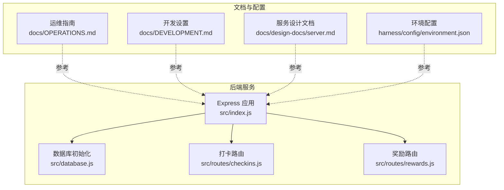
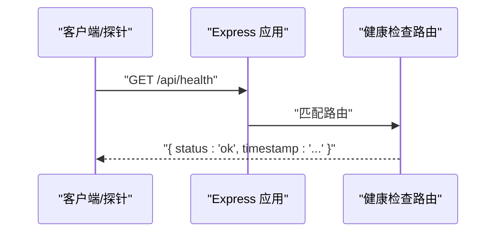
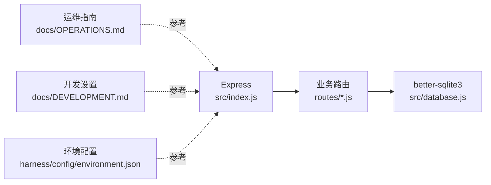

# 监控与日志

<cite>
**本文引用的文件**
- [star-park/server/src/index.js](file://star-park/server/src/index.js)
- [star-park/server/src/database.js](file://star-park/server/src/database.js)
- [star-park/server/src/routes/checkins.js](file://star-park/server/src/routes/checkins.js)
- [star-park/server/src/routes/rewards.js](file://star-park/server/src/routes/rewards.js)
- [docs/OPERATIONS.md](file://docs/OPERATIONS.md)
- [docs/DEVELOPMENT.md](file://docs/DEVELOPMENT.md)
- [docs/design-docs/server.md](file://docs/design-docs/server.md)
- [harness/config/environment.json](file://harness/config/environment.json)
- [scripts/check-db-consistency.sh](file://scripts/check-db-consistency.sh)
- [scripts/lint-quality.py](file://scripts/lint-quality.py)
</cite>

## 目录
1. [简介](#简介)
2. [项目结构](#项目结构)
3. [核心组件](#核心组件)
4. [架构总览](#架构总览)
5. [详细组件分析](#详细组件分析)
6. [依赖关系分析](#依赖关系分析)
7. [性能考虑](#性能考虑)
8. [故障排查指南](#故障排查指南)
9. [结论](#结论)
10. [附录](#附录)

## 简介
本文件面向StarParadise项目的监控与日志管理，覆盖以下主题：
- 健康检查接口的使用方法与响应格式
- 日志记录机制与环境差异（开发/生产）
- 日志查看与分析方法（控制台输出、日志轮转策略）
- 性能监控指标（数据库性能、API响应时间、内存使用）
- 故障排查基本方法与常用命令

## 项目结构
后端服务采用Express + better-sqlite3，核心入口负责路由注册与健康检查；数据库初始化与迁移逻辑集中于数据库模块；各业务路由实现具体API。

图表来源
- [star-park/server/src/index.js:1-42](file://star-park/server/src/index.js#L1-L42)
- [star-park/server/src/database.js:1-111](file://star-park/server/src/database.js#L1-L111)
- [star-park/server/src/routes/checkins.js:1-90](file://star-park/server/src/routes/checkins.js#L1-L90)
- [star-park/server/src/routes/rewards.js:1-167](file://star-park/server/src/routes/rewards.js#L1-L167)
- [docs/OPERATIONS.md:58-77](file://docs/OPERATIONS.md#L58-L77)
- [docs/DEVELOPMENT.md:94-116](file://docs/DEVELOPMENT.md#L94-L116)
- [docs/design-docs/server.md:35-59](file://docs/design-docs/server.md#L35-L59)
- [harness/config/environment.json:1-56](file://harness/config/environment.json#L1-L56)

章节来源
- [star-park/server/src/index.js:1-42](file://star-park/server/src/index.js#L1-L42)
- [docs/OPERATIONS.md:58-77](file://docs/OPERATIONS.md#L58-L77)
- [docs/DEVELOPMENT.md:94-116](file://docs/DEVELOPMENT.md#L94-L116)
- [docs/design-docs/server.md:35-59](file://docs/design-docs/server.md#L35-L59)
- [harness/config/environment.json:1-56](file://harness/config/environment.json#L1-L56)

## 核心组件
- 健康检查接口：提供轻量级可用性探测，便于容器编排与负载均衡。
- 日志机制：默认使用console输出；开发环境输出更宽松，生产环境建议结合系统日志或进程管理器进行采集与轮转。
- 数据库层：better-sqlite3 + WAL模式，具备基础迁移能力与一致性检查脚本。
- 路由层：围绕“打卡/奖励/统计”等业务提供REST接口，错误统一返回JSON。

章节来源
- [star-park/server/src/index.js:29-32](file://star-park/server/src/index.js#L29-L32)
- [docs/OPERATIONS.md:60-77](file://docs/OPERATIONS.md#L60-L77)
- [star-park/server/src/database.js:13-15](file://star-park/server/src/database.js#L13-L15)
- [scripts/check-db-consistency.sh:1-45](file://scripts/check-db-consistency.sh#L1-L45)

## 架构总览
后端服务启动后注册各业务路由，并提供健康检查端点；数据库初始化时启用WAL并执行DDL迁移；运维文档给出健康检查与日志查看示例。

图表来源
- [star-park/server/src/index.js:29-32](file://star-park/server/src/index.js#L29-L32)
- [docs/OPERATIONS.md:67-70](file://docs/OPERATIONS.md#L67-L70)

章节来源
- [star-park/server/src/index.js:29-32](file://star-park/server/src/index.js#L29-L32)
- [docs/OPERATIONS.md:67-70](file://docs/OPERATIONS.md#L67-L70)

## 详细组件分析

### 健康检查接口
- 端点：GET /api/health
- 响应：包含状态与时间戳的对象
- 使用场景：容器健康探针、反向代理存活检查、CI流水线前置校验
- 示例请求与期望响应参见运维指南中的示例

章节来源
- [star-park/server/src/index.js:29-32](file://star-park/server/src/index.js#L29-L32)
- [docs/OPERATIONS.md:67-70](file://docs/OPERATIONS.md#L67-L70)
- [docs/design-docs/server.md:58](file://docs/design-docs/server.md#L58)

### 日志记录机制与查看
- 框架与级别
  - 开发环境：使用console输出，输出级别较宽松
  - 生产环境：建议结合系统日志或进程管理器进行采集与轮转
- 控制台查看
  - 开发模式：直接运行查看控制台输出
  - 生产模式：通过系统日志或进程管理器查看
- 结构化日志建议
  - 服务端代码应使用结构化日志替代原始console.log
  - 前端/小程序可在拦截器中保留有限的console.error，但应避免直接输出到生产

章节来源
- [docs/OPERATIONS.md:60-77](file://docs/OPERATIONS.md#L60-L77)
- [docs/DEVELOPMENT.md:94-116](file://docs/DEVELOPMENT.md#L94-L116)
- [scripts/lint-quality.py:17-22](file://scripts/lint-quality.py#L17-L22)
- [scripts/lint-quality.py:74-97](file://scripts/lint-quality.py#L74-L97)

### 数据库层与一致性
- 初始化与优化
  - 初始化WAL模式与外键约束
  - 自动执行DDL迁移（如新增字段）
- 一致性检查
  - 提供脚本检查核心表与关键字段是否存在
- 运维建议
  - 生产环境可定期执行PRAGMA optimize
  - 数据库文件位于data目录，支持备份/恢复

章节来源
- [star-park/server/src/database.js:13-15](file://star-park/server/src/database.js#L13-L15)
- [star-park/server/src/database.js:82-108](file://star-park/server/src/database.js#L82-L108)
- [docs/OPERATIONS.md:104-109](file://docs/OPERATIONS.md#L104-L109)
- [scripts/check-db-consistency.sh:21-42](file://scripts/check-db-consistency.sh#L21-L42)

### API路由与错误处理
- 路由职责
  - 打卡：查询与创建打卡记录，联动交易与奖励进度
  - 奖励：查询/创建/更新/删除奖励目标，支持兑换（含事务）
- 错误处理
  - 统一捕获异常并返回JSON错误对象
  - 对业务错误（如余额不足、积分不足、不支持的单位）返回400

章节来源
- [star-park/server/src/routes/checkins.js:6-28](file://star-park/server/src/routes/checkins.js#L6-L28)
- [star-park/server/src/routes/checkins.js:30-87](file://star-park/server/src/routes/checkins.js#L30-L87)
- [star-park/server/src/routes/rewards.js:5-19](file://star-park/server/src/routes/rewards.js#L5-L19)
- [star-park/server/src/routes/rewards.js:89-164](file://star-park/server/src/routes/rewards.js#L89-L164)

## 依赖关系分析
后端应用依赖Express与better-sqlite3，数据库模块负责SQLite初始化与迁移；路由模块依赖数据库模块；运维与开发文档提供环境与命令参考。

图表来源
- [star-park/server/src/index.js:1-42](file://star-park/server/src/index.js#L1-L42)
- [star-park/server/src/database.js:1-111](file://star-park/server/src/database.js#L1-L111)
- [docs/OPERATIONS.md:58-77](file://docs/OPERATIONS.md#L58-L77)
- [docs/DEVELOPMENT.md:94-116](file://docs/DEVELOPMENT.md#L94-L116)
- [harness/config/environment.json:1-56](file://harness/config/environment.json#L1-L56)

章节来源
- [star-park/server/src/index.js:1-42](file://star-park/server/src/index.js#L1-L42)
- [star-park/server/src/database.js:1-111](file://star-park/server/src/database.js#L1-L111)
- [docs/OPERATIONS.md:58-77](file://docs/OPERATIONS.md#L58-L77)
- [docs/DEVELOPMENT.md:94-116](file://docs/DEVELOPMENT.md#L94-L116)
- [harness/config/environment.json:1-56](file://harness/config/environment.json#L1-L56)

## 性能考虑
- 数据库性能
  - 已启用WAL模式以提升并发写入性能
  - 建议定期执行PRAGMA optimize（生产环境）
  - 数据库存放于data目录，便于备份与迁移
- API响应时间
  - 本项目未内置APM或中间件埋点，建议在生产环境引入链路追踪与指标采集（如Prometheus/OpenTelemetry）
- 内存使用
  - better-sqlite3为同步驱动，内存占用与查询复杂度相关
  - 建议对高频查询建立索引、避免N+1查询、控制单次查询返回量

章节来源
- [star-park/server/src/database.js:13-15](file://star-park/server/src/database.js#L13-L15)
- [docs/OPERATIONS.md:104-109](file://docs/OPERATIONS.md#L104-L109)

## 故障排查指南
- 健康检查
  - 使用curl调用健康端点，确认返回包含status与timestamp
- 日志查看
  - 开发模式：直接运行查看控制台输出
  - 生产模式：结合系统日志或进程管理器查看
- 数据库一致性
  - 使用一致性检查脚本验证核心表与字段
  - 如缺失表/字段，重启服务触发自动迁移（若适用）
- 常用命令
  - 启动后端服务（开发/生产）
  - 停止服务（基于进程名）
  - 备份/恢复数据库文件

章节来源
- [docs/OPERATIONS.md:67-70](file://docs/OPERATIONS.md#L67-L70)
- [docs/OPERATIONS.md:72-77](file://docs/OPERATIONS.md#L72-L77)
- [scripts/check-db-consistency.sh:15-42](file://scripts/check-db-consistency.sh#L15-L42)
- [docs/OPERATIONS.md:81-89](file://docs/OPERATIONS.md#L81-L89)
- [docs/OPERATIONS.md:91-102](file://docs/OPERATIONS.md#L91-L102)

## 结论
- 健康检查接口简单可靠，适合作为运行状态的快速探测
- 日志机制以console为主，开发环境宽松，生产环境建议接入系统日志与轮转
- 数据库层具备基础迁移与一致性检查能力，生产环境建议配合定期优化与备份
- 性能监控可按需扩展至APM/指标采集，以满足更细粒度的可观测性需求

## 附录
- 环境与命令参考
  - 环境变量：PORT、NODE_ENV
  - 命令：启动后端、停止服务、备份数据库

章节来源
- [docs/DEVELOPMENT.md:94-116](file://docs/DEVELOPMENT.md#L94-L116)
- [docs/OPERATIONS.md:81-89](file://docs/OPERATIONS.md#L81-L89)
- [docs/OPERATIONS.md:91-102](file://docs/OPERATIONS.md#L91-L102)