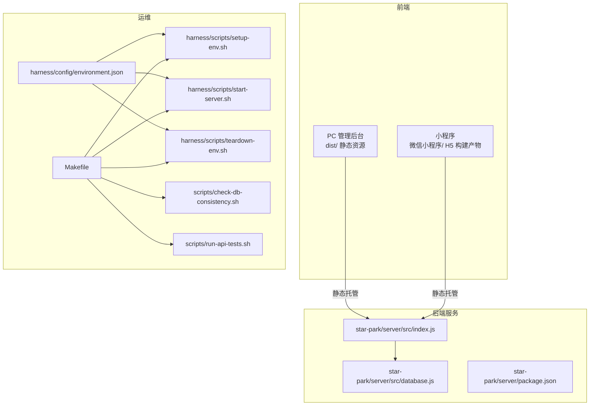
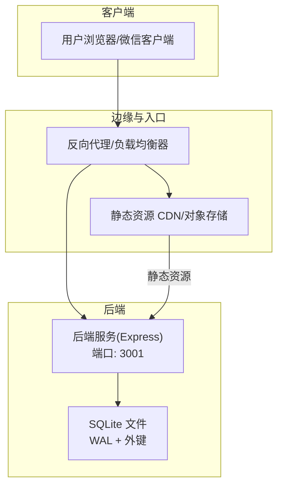
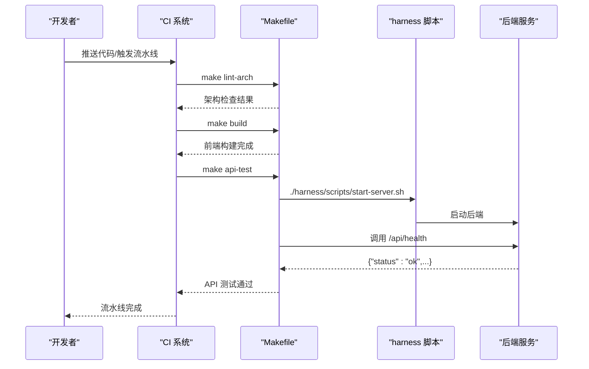
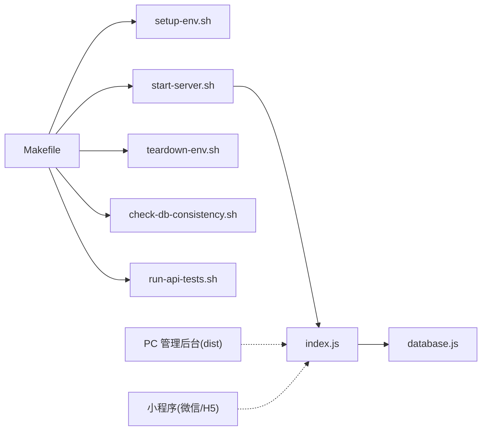
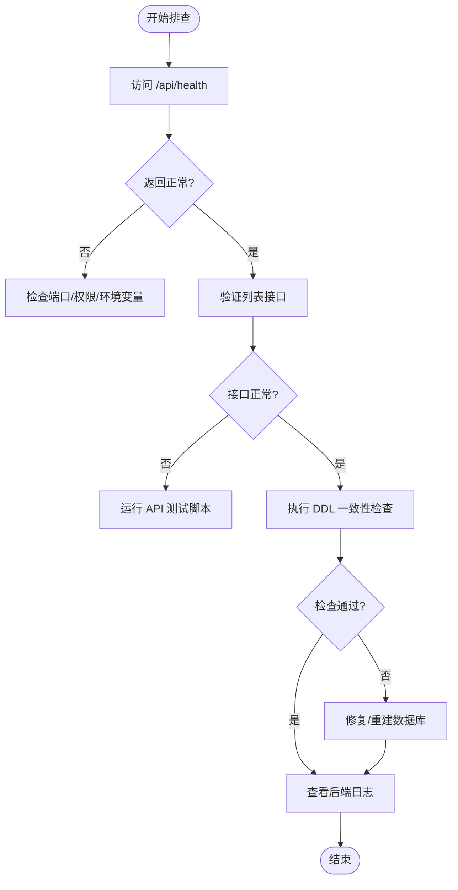

# 部署与运维

<cite>
**本文引用的文件**
- [docs/OPERATIONS.md](file://docs/OPERATIONS.md)
- [docs/DEVELOPMENT.md](file://docs/DEVELOPMENT.md)
- [Makefile](file://Makefile)
- [harness/config/environment.json](file://harness/config/environment.json)
- [harness/scripts/setup-env.sh](file://harness/scripts/setup-env.sh)
- [harness/scripts/start-server.sh](file://harness/scripts/start-server.sh)
- [harness/scripts/teardown-env.sh](file://harness/scripts/teardown-env.sh)
- [scripts/check-db-consistency.sh](file://scripts/check-db-consistency.sh)
- [scripts/run-api-tests.sh](file://scripts/run-api-tests.sh)
- [star-park/server/src/index.js](file://star-park/server/src/index.js)
- [star-park/server/src/database.js](file://star-park/server/src/database.js)
- [star-park/server/package.json](file://star-park/server/package.json)
</cite>

## 目录
1. [简介](#简介)
2. [项目结构](#项目结构)
3. [核心组件](#核心组件)
4. [架构总览](#架构总览)
5. [详细组件分析](#详细组件分析)
6. [依赖关系分析](#依赖关系分析)
7. [性能考虑](#性能考虑)
8. [故障排查指南](#故障排查指南)
9. [结论](#结论)
10. [附录](#附录)

## 简介
本文件面向生产环境与运维团队，系统性梳理 StarParadise 的部署与运维实践，覆盖服务器配置、环境变量、数据库部署、负载均衡、容器化与编排、监控告警、日志采集、性能指标、备份与灾备、安全加固、版本升级、自动化脚本与 CI/CD、环境切换与容量规划等主题。内容基于仓库现有实现与脚本进行归纳总结，并给出可操作的落地建议。

## 项目结构
项目采用多模块分层组织，后端服务为独立 Node.js 应用，前端包含 PC 管理后台与小程序两套产物；运维侧通过 Makefile 与 harness 脚本提供统一的环境准备、启动与清理能力；数据库为嵌入式 SQLite，位于后端数据目录。

图表来源
- [Makefile:1-70](file://Makefile#L1-L70)
- [harness/config/environment.json:1-56](file://harness/config/environment.json#L1-L56)
- [harness/scripts/setup-env.sh:1-23](file://harness/scripts/setup-env.sh#L1-L23)
- [harness/scripts/start-server.sh:1-29](file://harness/scripts/start-server.sh#L1-L29)
- [harness/scripts/teardown-env.sh:1-14](file://harness/scripts/teardown-env.sh#L1-L14)
- [scripts/check-db-consistency.sh:1-45](file://scripts/check-db-consistency.sh#L1-L45)
- [scripts/run-api-tests.sh:1-36](file://scripts/run-api-tests.sh#L1-L36)
- [star-park/server/src/index.js:1-42](file://star-park/server/src/index.js#L1-L42)
- [star-park/server/src/database.js:1-90](file://star-park/server/src/database.js#L1-L90)
- [star-park/server/package.json:1-15](file://star-park/server/package.json#L1-L15)

章节来源
- [docs/DEVELOPMENT.md:65-92](file://docs/DEVELOPMENT.md#L65-L92)
- [docs/OPERATIONS.md:16-29](file://docs/OPERATIONS.md#L16-L29)

## 核心组件
- 后端服务（Node.js + Express）
  - 提供 REST API，路由按业务域划分；内置健康检查端点；默认监听端口与环境变量可配置。
  - 依赖 better-sqlite3 作为嵌入式数据库驱动，数据库文件位于后端数据目录。
- 数据库（SQLite）
  - 首次启动自动建表与迁移；启用 WAL 模式与外键约束；支持 DDL 一致性检查脚本。
- 前端产物
  - PC 管理后台构建为静态站点，部署至静态文件服务器；小程序分别构建为微信小程序与 H5。
- 运维脚本与编排
  - Makefile 提供统一入口；harness 提供环境准备、启动与清理脚本；environment.json 描述运行时与功能场景。

章节来源
- [star-park/server/src/index.js:14-42](file://star-park/server/src/index.js#L14-L42)
- [star-park/server/src/database.js:10-90](file://star-park/server/src/database.js#L10-L90)
- [docs/OPERATIONS.md:16-29](file://docs/OPERATIONS.md#L16-L29)
- [Makefile:1-70](file://Makefile#L1-L70)
- [harness/config/environment.json:1-56](file://harness/config/environment.json#L1-L56)

## 架构总览
下图展示生产部署视角下的整体拓扑：前端静态资源由反向代理或 CDN 分发，后端服务通过健康检查与日志监控保障可用性；数据库为本地文件，结合备份策略与一致性检查确保数据完整性。

图表来源
- [star-park/server/src/index.js:14-42](file://star-park/server/src/index.js#L14-L42)
- [star-park/server/src/database.js:10-16](file://star-park/server/src/database.js#L10-L16)

## 详细组件分析

### 1) 生产环境部署流程
- 服务器准备
  - 安装 Node.js 与包管理器；准备静态资源托管（Nginx/Apache/CND）。
- 环境变量
  - 支持 PORT 与 NODE_ENV；默认端口为 3001；生产环境建议显式设置 NODE_ENV=production。
- 数据库部署
  - SQLite 为嵌入式，无需额外数据库实例；首次启动自动建表与迁移；数据文件位于后端数据目录。
- 前端部署
  - 构建 PC 管理后台为 dist/；构建小程序为对应平台产物；将静态资源部署至静态服务器或 CDN。
- 后端启动
  - 在生产环境以 NODE_ENV=production 启动后端服务；可通过进程管理器（如 PM2）守护进程。

章节来源
- [docs/OPERATIONS.md:16-29](file://docs/OPERATIONS.md#L16-L29)
- [docs/OPERATIONS.md:48-56](file://docs/OPERATIONS.md#L48-L56)
- [star-park/server/src/index.js:14-42](file://star-park/server/src/index.js#L14-L42)
- [star-park/server/src/database.js:10-16](file://star-park/server/src/database.js#L10-L16)

### 2) 容器化与编排（建议）
- Docker 镜像构建
  - 使用多阶段构建：基础镜像安装 Node.js，复制后端源码与依赖，仅打包运行时产物；静态资源单独构建并在 Nginx 镜像中部署。
- Kubernetes 编排
  - 后端：Deployment + Service；持久化挂载后端数据目录；健康探针使用 /api/health。
  - 前端：Deployment/Ingress 或静态对象存储；根据域名与路径配置路由。
  - 环境变量：通过 ConfigMap/Secret 注入 PORT、NODE_ENV 等。
- 负载均衡
  - Ingress/LoadBalancer 暴露服务；后端启用健康检查与优雅退出；前端静态资源走 CDN。

（本节为概念性建议，不直接对应具体源码）

### 3) 监控与日志
- 健康检查
  - 提供 /api/health；生产环境建议通过探针定期探测。
- 日志
  - 开发环境使用控制台输出；生产环境建议接入集中式日志（如 ELK/Fluent Bit）并设置日志级别。
- 性能指标
  - 建议采集 CPU/内存/请求延迟/错误率/数据库查询耗时等指标；结合 APM 工具。

章节来源
- [docs/OPERATIONS.md:65-77](file://docs/OPERATIONS.md#L65-L77)
- [star-park/server/src/index.js:29-32](file://star-park/server/src/index.js#L29-L32)

### 4) 数据库维护与一致性
- 建表与迁移
  - 首次启动自动建表；对已有表新增列时进行迁移并捕获异常。
- 一致性检查
  - 通过脚本检查核心表与关键字段是否存在，避免 DDL 不一致导致的功能异常。
- WAL 模式与优化
  - 已启用 WAL 提升并发；建议定期执行数据库优化命令以维持性能。

章节来源
- [star-park/server/src/database.js:17-87](file://star-park/server/src/database.js#L17-L87)
- [scripts/check-db-consistency.sh:21-42](file://scripts/check-db-consistency.sh#L21-L42)
- [docs/OPERATIONS.md:104-109](file://docs/OPERATIONS.md#L104-L109)

### 5) 运维自动化与 CI/CD
- Makefile 目标
  - 提供构建、测试、架构检查、端到端验证、数据库一致性检查、API 测试等统一入口。
- harness 脚本
  - 环境准备、启动后端、清理环境；支持超时检测与健康检查。
- CI/CD 建议
  - 在流水线中顺序执行：安装依赖 → 构建 → 架构检查 → 单元/集成测试 → API 测试 → 部署（可选）。

图表来源
- [Makefile:11-30](file://Makefile#L11-L30)
- [harness/scripts/start-server.sh:11-28](file://harness/scripts/start-server.sh#L11-L28)
- [star-park/server/src/index.js:29-32](file://star-park/server/src/index.js#L29-L32)

章节来源
- [Makefile:1-70](file://Makefile#L1-L70)
- [harness/scripts/start-server.sh:1-29](file://harness/scripts/start-server.sh#L1-L29)
- [scripts/run-api-tests.sh:13-32](file://scripts/run-api-tests.sh#L13-L32)

### 6) 安全加固
- 认证与授权
  - 当前无认证中间件；生产环境建议引入 JWT/Session 认证与权限控制。
- CORS 与网络边界
  - 限制 CORS 白名单；仅在内网或受控网络暴露 API。
- 传输安全
  - 通过反向代理启用 HTTPS；强制 TLS。
- 最小权限
  - 数据库文件仅本地访问，避免远程直连；后端进程以最小权限运行。

章节来源
- [docs/OPERATIONS.md:110-117](file://docs/OPERATIONS.md#L110-L117)

### 7) 版本升级与回滚
- 升级流程
  - 构建新版本 → 健康检查通过 → 切流/滚动更新 → 观察指标与日志 → 回滚（如异常）。
- 回滚策略
  - 保留上一版本镜像与静态资源；快速回滚至稳定版本。
- 灰度发布
  - 通过蓝绿/金丝雀策略逐步放量。

（本节为通用运维建议）

### 8) 环境切换管理
- 环境变量
  - development/test/production 对应不同配置；建议通过环境模板与密钥管理工具注入。
- 前端代理
  - 开发环境通过 Vite 代理转发后端请求；生产环境由反向代理统一处理。

章节来源
- [docs/DEVELOPMENT.md:94-115](file://docs/DEVELOPMENT.md#L94-L115)
- [docs/OPERATIONS.md:39-47](file://docs/OPERATIONS.md#L39-L47)

### 9) 容量规划建议
- 后端实例
  - 根据 QPS 与响应时间估算实例数；结合水平扩展与缓存策略。
- 数据库
  - SQLite 文件大小增长趋势与 WAL 日志占用；预留磁盘空间与快照策略。
- 前端静态资源
  - CDN 缓存命中率与带宽成本；版本化与长缓存策略。

（本节为通用建议）

## 依赖关系分析
- 组件耦合
  - 后端服务依赖 SQLite 文件；前端静态资源与后端解耦，通过 API 交互。
- 外部依赖
  - Express、better-sqlite3、CORS、dayjs；数据库驱动与 Node.js 版本需匹配。
- 运维脚本依赖
  - Makefile 依赖 harness 脚本与 shell 工具；API 测试依赖 curl；数据库检查依赖 sqlite3。

图表来源
- [Makefile:62-70](file://Makefile#L62-L70)
- [harness/scripts/setup-env.sh:10-19](file://harness/scripts/setup-env.sh#L10-L19)
- [harness/scripts/start-server.sh:11-13](file://harness/scripts/start-server.sh#L11-L13)
- [harness/scripts/teardown-env.sh:6-11](file://harness/scripts/teardown-env.sh#L6-L11)
- [scripts/check-db-consistency.sh:12-19](file://scripts/check-db-consistency.sh#L12-L19)
- [scripts/run-api-tests.sh:10-17](file://scripts/run-api-tests.sh#L10-L17)
- [star-park/server/src/index.js:1-12](file://star-park/server/src/index.js#L1-L12)
- [star-park/server/src/database.js:1-11](file://star-park/server/src/database.js#L1-L11)

章节来源
- [star-park/server/package.json:8-13](file://star-park/server/package.json#L8-L13)
- [Makefile:1-70](file://Makefile#L1-L70)

## 性能考虑
- 数据库
  - 已启用 WAL 模式与外键；建议定期执行数据库优化命令；关注 WAL 文件大小与磁盘 IO。
- 应用
  - 控制并发与连接池；合理设置超时与重试；对热点接口增加缓存。
- 前端
  - 静态资源开启压缩与缓存；CDN 加速；按需加载与懒加载。

章节来源
- [star-park/server/src/database.js:13-15](file://star-park/server/src/database.js#L13-L15)
- [docs/OPERATIONS.md:104-109](file://docs/OPERATIONS.md#L104-L109)

## 故障排查指南
- 服务无法启动
  - 检查端口占用与权限；确认环境变量是否正确；查看后端控制台输出。
- 健康检查失败
  - 使用 curl 访问 /api/health；确认后端已监听端口；检查进程状态。
- 数据库异常
  - 执行 DDL 一致性检查脚本；核对数据库文件是否存在；必要时重建数据库并重新初始化种子数据。
- API 功能异常
  - 运行 API 测试脚本；逐项验证健康检查、列表接口与仪表盘接口；结合日志定位问题。

图表来源
- [star-park/server/src/index.js:29-32](file://star-park/server/src/index.js#L29-L32)
- [scripts/run-api-tests.sh:13-32](file://scripts/run-api-tests.sh#L13-L32)
- [scripts/check-db-consistency.sh:15-42](file://scripts/check-db-consistency.sh#L15-L42)

章节来源
- [docs/OPERATIONS.md:72-102](file://docs/OPERATIONS.md#L72-L102)
- [scripts/run-api-tests.sh:13-32](file://scripts/run-api-tests.sh#L13-L32)
- [scripts/check-db-consistency.sh:15-42](file://scripts/check-db-consistency.sh#L15-L42)

## 结论
本文件基于仓库现有实现，给出了从部署到运维的完整实践路径：明确的环境变量与端口配置、SQLite 嵌入式数据库的运维要点、前端静态资源的部署策略、以及通过 Makefile 与 harness 脚本实现的自动化与健康检查。建议在生产环境中补充认证授权、HTTPS、集中日志与监控告警、数据库备份与灾备、容器化与编排、灰度发布与回滚策略，以满足企业级稳定性与可维护性要求。

## 附录
- 环境变量清单
  - PORT：后端服务端口，默认 3001
  - NODE_ENV：运行环境，默认 development
- 健康检查端点
  - GET /api/health
- 数据库位置
  - 后端数据目录下的 SQLite 文件

章节来源
- [docs/OPERATIONS.md:48-56](file://docs/OPERATIONS.md#L48-L56)
- [star-park/server/src/index.js:29-32](file://star-park/server/src/index.js#L29-L32)
- [star-park/server/src/database.js:10](file://star-park/server/src/database.js#L10)