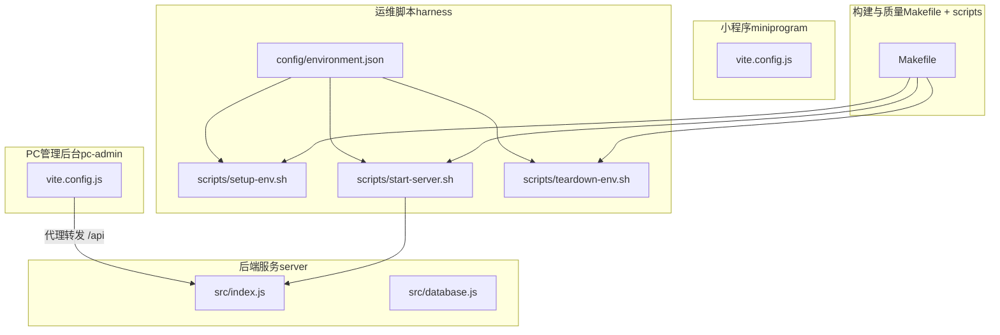
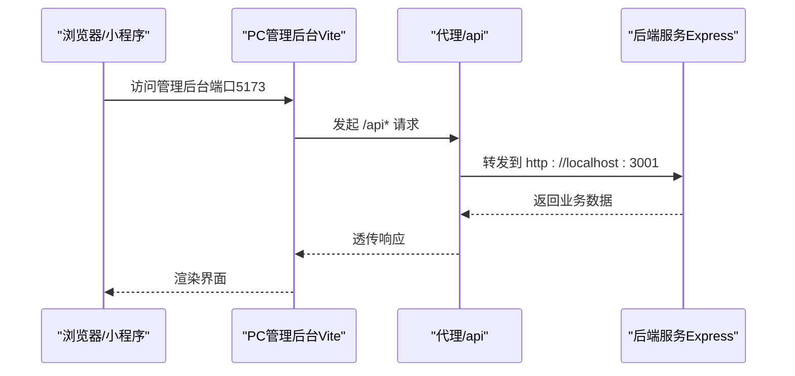
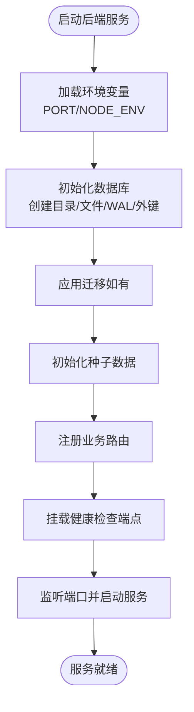
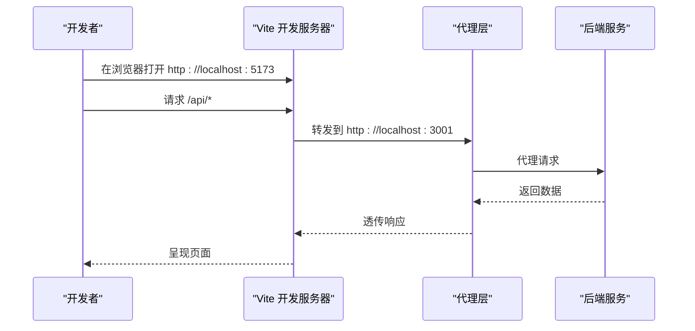
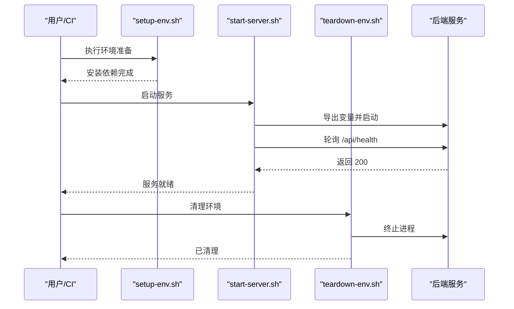
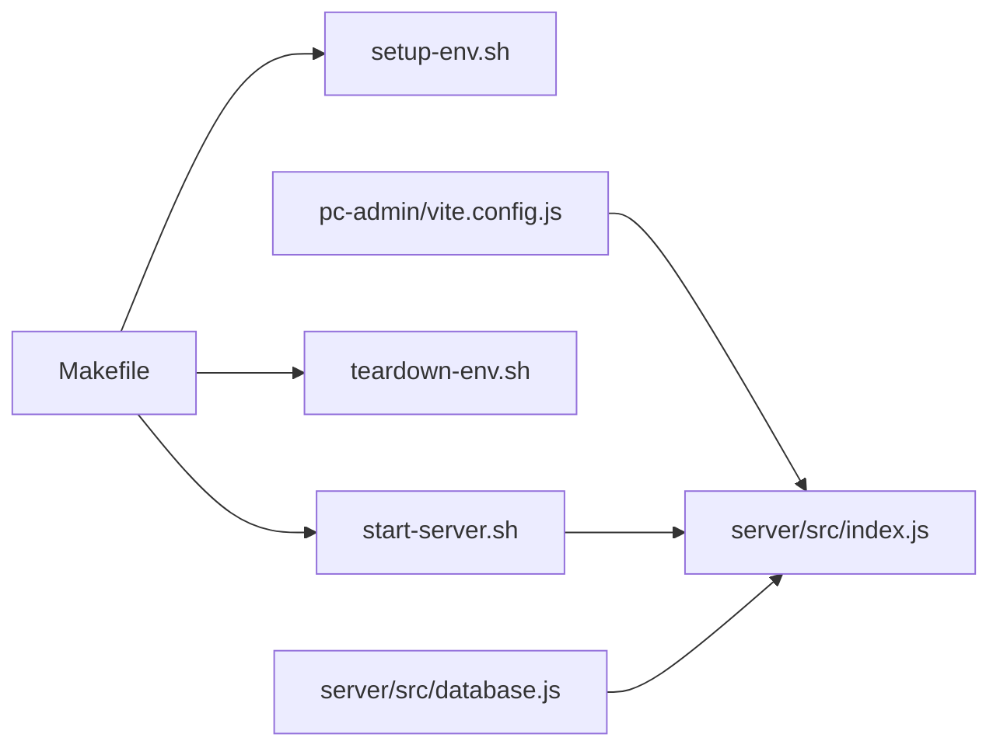

# 部署流程

<cite>
**本文引用的文件**
- [Makefile](file://Makefile)
- [DEVELOPMENT.md](file://docs/DEVELOPMENT.md)
- [OPERATIONS.md](file://docs/OPERATIONS.md)
- [environment.json](file://harness/config/environment.json)
- [setup-env.sh](file://harness/scripts/setup-env.sh)
- [start-server.sh](file://harness/scripts/start-server.sh)
- [teardown-env.sh](file://harness/scripts/teardown-env.sh)
- [index.js](file://star-park/server/src/index.js)
- [database.js](file://star-park/server/src/database.js)
- [package.json（server）](file://star-park/server/package.json)
- [package.json（pc-admin）](file://star-park/pc-admin/package.json)
- [vite.config.js（pc-admin）](file://star-park/pc-admin/vite.config.js)
- [vite.config.js（miniprogram）](file://star-park/miniprogram/vite.config.js)
</cite>

## 目录
1. [简介](#简介)
2. [项目结构](#项目结构)
3. [核心组件](#核心组件)
4. [架构总览](#架构总览)
5. [详细组件分析](#详细组件分析)
6. [依赖分析](#依赖分析)
7. [性能考虑](#性能考虑)
8. [故障排查指南](#故障排查指南)
9. [结论](#结论)
10. [附录](#附录)

## 简介
本文件面向StarParadise项目的部署与运维，覆盖从开发环境到生产环境的完整流程，包括本地开发环境搭建、生产环境部署配置、构建流程说明、环境变量与端口配置、网络代理设置、CI/CD流水线配置指南，以及部署前准备、依赖安装、数据库初始化、服务启动与验证步骤。文档同时对比development与production环境差异，并给出可操作的命令与路径指引。

## 项目结构
项目采用多子项目结构，包含后端服务、PC管理后台、小程序前端与运维脚本/配置：
- 后端服务（server）：基于Express + better-sqlite3，提供REST API与健康检查端点
- PC管理后台（pc-admin）：Vue 3 + Vite，开发时通过代理转发至后端
- 小程序（miniprogram）：基于uni-app，支持H5与微信小程序构建
- 运维脚本（harness）：封装环境准备、服务启动与清理
- 构建与质量工具（Makefile + scripts）：统一的构建、测试、架构检查与端到端验证

图表来源
- [index.js:1-42](file://star-park/server/src/index.js#L1-L42)
- [database.js:1-90](file://star-park/server/src/database.js#L1-L90)
- [vite.config.js（pc-admin）:1-19](file://star-park/pc-admin/vite.config.js#L1-L19)
- [vite.config.js（miniprogram）:1-7](file://star-park/miniprogram/vite.config.js#L1-L7)
- [environment.json:1-56](file://harness/config/environment.json#L1-L56)
- [setup-env.sh:1-23](file://harness/scripts/setup-env.sh#L1-L23)
- [start-server.sh:1-29](file://harness/scripts/start-server.sh#L1-L29)
- [teardown-env.sh:1-14](file://harness/scripts/teardown-env.sh#L1-L14)
- [Makefile:1-70](file://Makefile#L1-L70)

章节来源
- [DEVELOPMENT.md:65-92](file://docs/DEVELOPMENT.md#L65-L92)
- [OPERATIONS.md:1-118](file://docs/OPERATIONS.md#L1-L118)

## 核心组件
- 后端服务（server）
  - 入口与路由：提供健康检查、业务路由（children/tasks/checkins/rewards/stats/points）
  - 数据库：better-sqlite3 + WAL模式；自动创建数据目录与数据库文件
  - 端口：默认3001，可通过环境变量覆盖
- PC管理后台（pc-admin）
  - 开发服务器：Vite，默认端口5173
  - 代理：将/api前缀转发至后端服务（默认localhost:3001）
  - 构建：生成静态产物，部署至静态服务器
- 小程序（miniprogram）
  - 支持H5与微信小程序两种构建目标
  - 使用uni-app生态与Vite插件
- 运维脚本（harness）
  - 环境准备：安装依赖（server与pc-admin）
  - 服务启动：导出环境变量并启动后端，等待健康检查
  - 环境清理：终止后端进程
- 构建与质量（Makefile）
  - 统一命令：build、lint-arch、verify、setup-env、start-server、teardown-env
  - API文档生成、数据库一致性检查、API测试、编码规范检查等

章节来源
- [index.js:1-42](file://star-park/server/src/index.js#L1-L42)
- [database.js:1-90](file://star-park/server/src/database.js#L1-L90)
- [package.json（server）:1-15](file://star-park/server/package.json#L1-L15)
- [package.json（pc-admin）:1-26](file://star-park/pc-admin/package.json#L1-L26)
- [vite.config.js（pc-admin）:1-19](file://star-park/pc-admin/vite.config.js#L1-L19)
- [vite.config.js（miniprogram）:1-7](file://star-park/miniprogram/vite.config.js#L1-L7)
- [environment.json:1-56](file://harness/config/environment.json#L1-L56)
- [setup-env.sh:1-23](file://harness/scripts/setup-env.sh#L1-L23)
- [start-server.sh:1-29](file://harness/scripts/start-server.sh#L1-L29)
- [teardown-env.sh:1-14](file://harness/scripts/teardown-env.sh#L1-L14)
- [Makefile:1-70](file://Makefile#L1-L70)

## 架构总览
下图展示从浏览器/小程序到后端服务的数据流与代理关系，以及运维脚本如何驱动服务生命周期。

图表来源
- [vite.config.js（pc-admin）:1-19](file://star-park/pc-admin/vite.config.js#L1-L19)
- [index.js:1-42](file://star-park/server/src/index.js#L1-L42)

## 详细组件分析

### 后端服务（server）
- 启动与路由
  - 提供健康检查端点，便于启动后验证
  - 注册业务路由模块（children/tasks/checkins/rewards/stats/points）
- 数据库初始化
  - 自动创建数据目录与数据库文件
  - 启用WAL模式与外键约束，确保并发与一致性
  - 支持迁移（如新增字段），避免重复执行失败
- 端口与环境变量
  - 默认端口3001；可通过环境变量覆盖
  - NODE_ENV默认development，生产部署建议设为production

图表来源
- [index.js:1-42](file://star-park/server/src/index.js#L1-L42)
- [database.js:1-90](file://star-park/server/src/database.js#L1-L90)

章节来源
- [index.js:1-42](file://star-park/server/src/index.js#L1-L42)
- [database.js:1-90](file://star-park/server/src/database.js#L1-L90)
- [package.json（server）:1-15](file://star-park/server/package.json#L1-L15)
- [OPERATIONS.md:48-56](file://docs/OPERATIONS.md#L48-L56)

### PC管理后台（pc-admin）
- 开发与代理
  - 开发服务器端口5173
  - 通过代理将/api请求转发至后端（默认localhost:3001）
- 构建与部署
  - 构建产物输出至dist目录，可部署到静态服务器
- 环境变量
  - 通过Vite配置生效，代理目标可在配置中调整

图表来源
- [vite.config.js（pc-admin）:1-19](file://star-park/pc-admin/vite.config.js#L1-L19)
- [index.js:1-42](file://star-park/server/src/index.js#L1-L42)

章节来源
- [vite.config.js（pc-admin）:1-19](file://star-park/pc-admin/vite.config.js#L1-L19)
- [package.json（pc-admin）:1-26](file://star-park/pc-admin/package.json#L1-L26)
- [DEVELOPMENT.md:101-116](file://docs/DEVELOPMENT.md#L101-L116)

### 小程序（miniprogram）
- 构建目标
  - H5预览与微信小程序两种构建方式
- 配置
  - 基于uni-app与Vite插件，按需扩展

章节来源
- [vite.config.js（miniprogram）:1-7](file://star-park/miniprogram/vite.config.js#L1-L7)
- [package.json（pc-admin）:1-26](file://star-park/pc-admin/package.json#L1-L26)

### 运维脚本（harness）
- 环境准备（setup-env）
  - 自动安装后端与管理后台依赖
- 服务启动（start-server）
  - 导出端口与环境变量，启动后端并轮询健康检查
- 环境清理（teardown-env）
  - 终止后端进程，清理残留

图表来源
- [setup-env.sh:1-23](file://harness/scripts/setup-env.sh#L1-L23)
- [start-server.sh:1-29](file://harness/scripts/start-server.sh#L1-L29)
- [teardown-env.sh:1-14](file://harness/scripts/teardown-env.sh#L1-L14)
- [index.js:1-42](file://star-park/server/src/index.js#L1-L42)

章节来源
- [environment.json:1-56](file://harness/config/environment.json#L1-L56)
- [setup-env.sh:1-23](file://harness/scripts/setup-env.sh#L1-L23)
- [start-server.sh:1-29](file://harness/scripts/start-server.sh#L1-L29)
- [teardown-env.sh:1-14](file://harness/scripts/teardown-env.sh#L1-L14)

### 构建与质量（Makefile）
- 常用目标
  - build：构建管理后台
  - lint-arch：运行架构与质量检查脚本
  - verify：执行端到端验证脚本集合
  - setup-env/start-server/teardown-env：驱动运维脚本
  - api-doc/check-db/api-test/check-conventions：可选功能（视项目是否存在对应脚本而定）
- CI/CD建议
  - 在流水线中顺序执行：build → lint-arch → test（如已配置）

章节来源
- [Makefile:1-70](file://Makefile#L1-L70)
- [DEVELOPMENT.md:29-37](file://docs/DEVELOPMENT.md#L29-L37)
- [OPERATIONS.md:31-37](file://docs/OPERATIONS.md#L31-L37)

## 依赖分析
- 组件耦合
  - PC管理后台通过代理依赖后端服务
  - 运维脚本与后端服务存在启动/健康检查的时序依赖
  - Makefile作为统一入口协调各子流程
- 外部依赖
  - 后端：Express、better-sqlite3、CORS、dayjs
  - 管理后台：Vue 3、Vue Router、Pinia、Element Plus、ECharts、Axios
  - 小程序：uni-app生态与Vite插件

图表来源
- [Makefile:1-70](file://Makefile#L1-L70)
- [setup-env.sh:1-23](file://harness/scripts/setup-env.sh#L1-L23)
- [start-server.sh:1-29](file://harness/scripts/start-server.sh#L1-L29)
- [teardown-env.sh:1-14](file://harness/scripts/teardown-env.sh#L1-L14)
- [vite.config.js（pc-admin）:1-19](file://star-park/pc-admin/vite.config.js#L1-L19)
- [index.js:1-42](file://star-park/server/src/index.js#L1-L42)
- [database.js:1-90](file://star-park/server/src/database.js#L1-L90)

章节来源
- [package.json（server）:1-15](file://star-park/server/package.json#L1-L15)
- [package.json（pc-admin）:1-26](file://star-park/pc-admin/package.json#L1-L26)

## 性能考虑
- SQLite优化
  - 已启用WAL模式以提升并发读写
  - 建议定期执行optimize（生产环境维护时）
- 端口与代理
  - 后端默认3001，PC管理后台默认5173，避免冲突
  - 代理配置确保开发时跨域请求顺畅
- 构建与缓存
  - 使用Vite构建，生产环境建议开启静态资源缓存策略

章节来源
- [database.js:13-15](file://star-park/server/src/database.js#L13-L15)
- [vite.config.js（pc-admin）:6-14](file://star-park/pc-admin/vite.config.js#L6-L14)
- [OPERATIONS.md:104-108](file://docs/OPERATIONS.md#L104-L108)

## 故障排查指南
- 健康检查失败
  - 确认后端已启动且端口未被占用
  - 使用健康检查端点进行验证
- 代理不通
  - 检查PC管理后台代理配置是否指向正确的后端地址与端口
- 数据库问题
  - 确认数据目录存在且有写权限
  - 如需重置，可删除数据库文件后重启服务以自动重建
- 进程残留
  - 使用清理脚本或手动终止后端进程

章节来源
- [start-server.sh:18-28](file://harness/scripts/start-server.sh#L18-L28)
- [vite.config.js（pc-admin）:8-13](file://star-park/pc-admin/vite.config.js#L8-L13)
- [database.js:5-8](file://star-park/server/src/database.js#L5-L8)
- [teardown-env.sh:7-11](file://harness/scripts/teardown-env.sh#L7-L11)

## 结论
本部署文档提供了从开发到生产的完整路径：明确的环境变量与端口配置、清晰的代理与构建流程、可复用的运维脚本与Makefile命令，以及生产环境的安全加固建议。按照本文步骤执行，可快速完成本地开发与生产部署，并在CI/CD中稳定复用。

## 附录

### 开发环境到生产环境的部署步骤
- 本地开发
  - 安装依赖：统一通过环境准备脚本或各子项目脚本安装
  - 启动后端服务：使用开发脚本或运维脚本启动
  - 启动管理后台：使用Vite开发服务器
  - 启动小程序：选择H5或微信小程序模式
- 生产部署
  - 构建管理后台：生成静态产物并部署至静态服务器
  - 构建小程序：生成微信小程序产物并上传至开发者工具
  - 启动后端服务：设置NODE_ENV=production并启动

章节来源
- [DEVELOPMENT.md:9-27](file://docs/DEVELOPMENT.md#L9-L27)
- [OPERATIONS.md:16-29](file://docs/OPERATIONS.md#L16-L29)

### 环境变量与端口配置
- 后端
  - PORT：默认3001，可通过环境变量覆盖
  - NODE_ENV：默认development，生产建议设为production
- PC管理后台
  - 开发端口：5173
  - 代理：/api → http://localhost:3001

章节来源
- [index.js](file://star-park/server/src/index.js#L14)
- [start-server.sh:8-9](file://harness/scripts/start-server.sh#L8-L9)
- [vite.config.js（pc-admin）:7-13](file://star-park/pc-admin/vite.config.js#L7-L13)

### CI/CD流水线配置指南
- 建议流水线顺序
  - 构建：make build
  - 架构检查：make lint-arch
  - 测试：make test（如已配置）
- 可选步骤
  - API文档生成：make api-doc
  - 数据库一致性检查：make check-db
  - API测试：make api-test
  - 编码规范检查：make check-conventions
  - 端到端验证：make verify

章节来源
- [Makefile:3-37](file://Makefile#L3-L37)
- [OPERATIONS.md:31-37](file://docs/OPERATIONS.md#L31-L37)

### 部署前准备与验证清单
- 准备工作
  - 安装Node.js 18+与npm 9+
  - 准备Python 3.10+（用于验证脚本）
- 依赖安装
  - 后端与管理后台依赖安装
- 数据库初始化
  - 首次启动自动创建数据库文件与表结构
- 服务启动与验证
  - 启动后端服务并轮询健康检查端点
  - 访问管理后台与小程序确认代理与构建产物可用

章节来源
- [DEVELOPMENT.md:3-8](file://docs/DEVELOPMENT.md#L3-L8)
- [setup-env.sh:10-19](file://harness/scripts/setup-env.sh#L10-L19)
- [database.js:5-8](file://star-park/server/src/database.js#L5-L8)
- [start-server.sh:18-25](file://harness/scripts/start-server.sh#L18-L25)