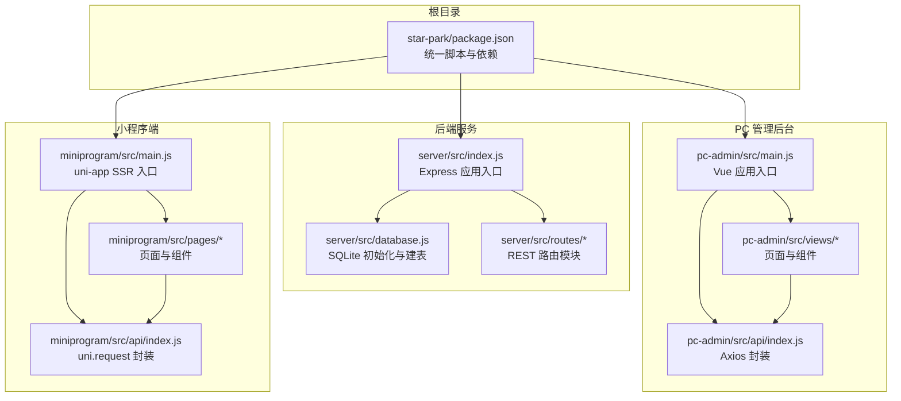
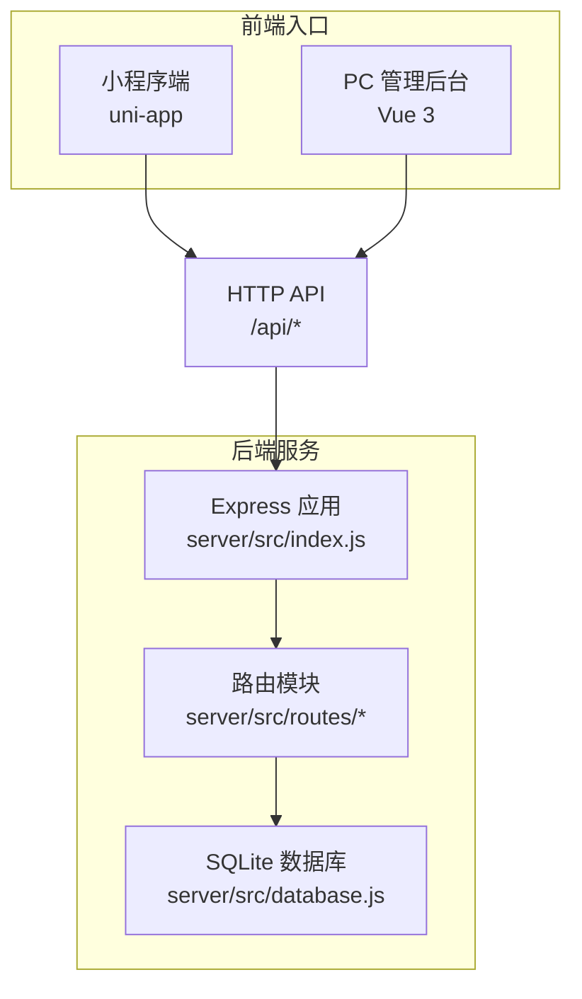
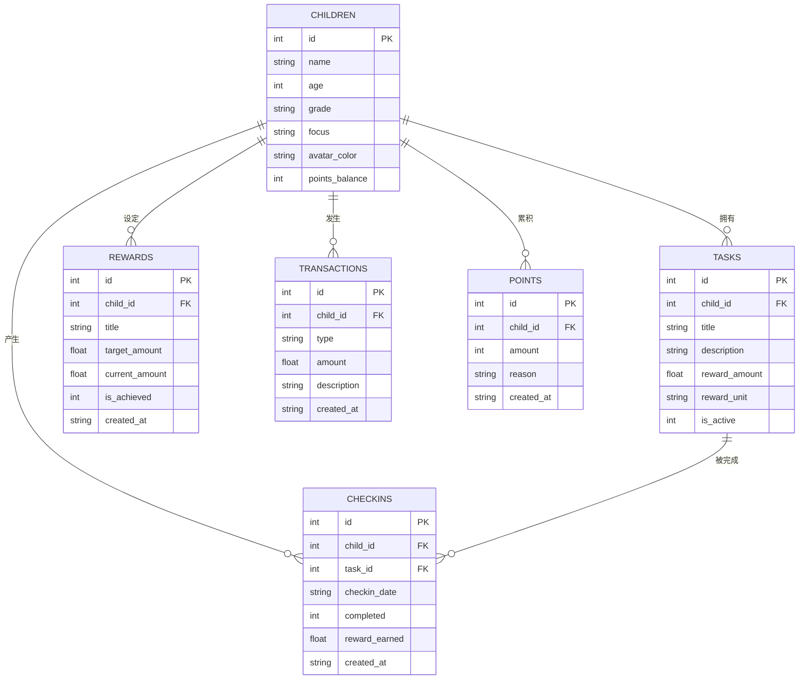
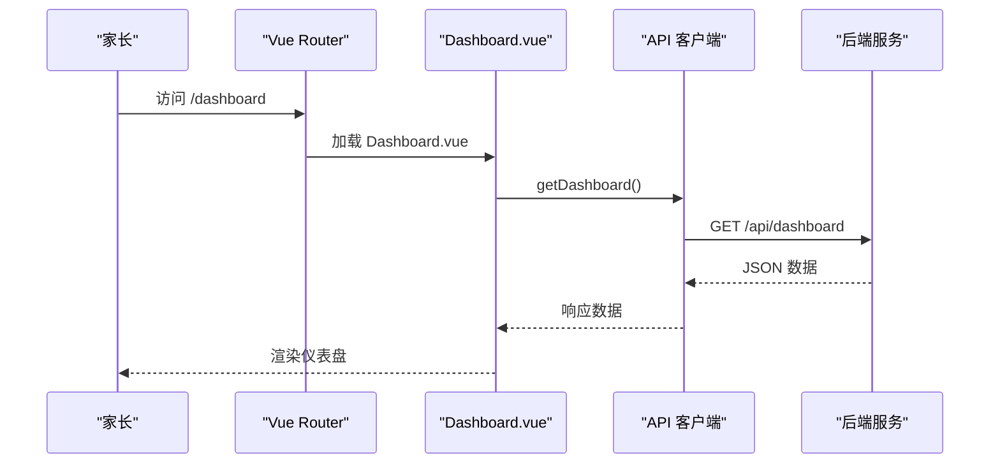
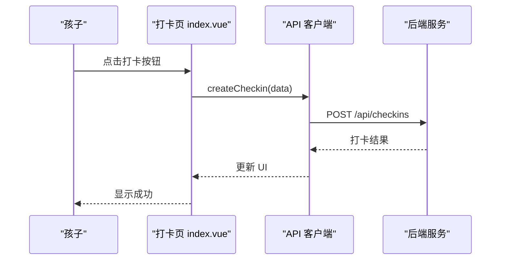
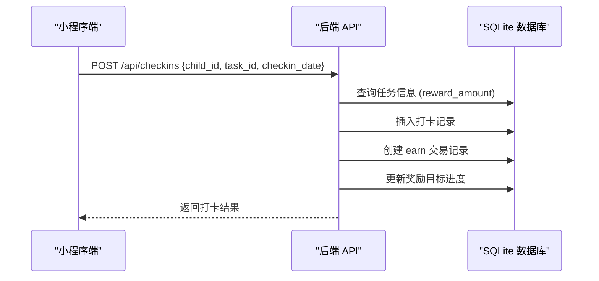
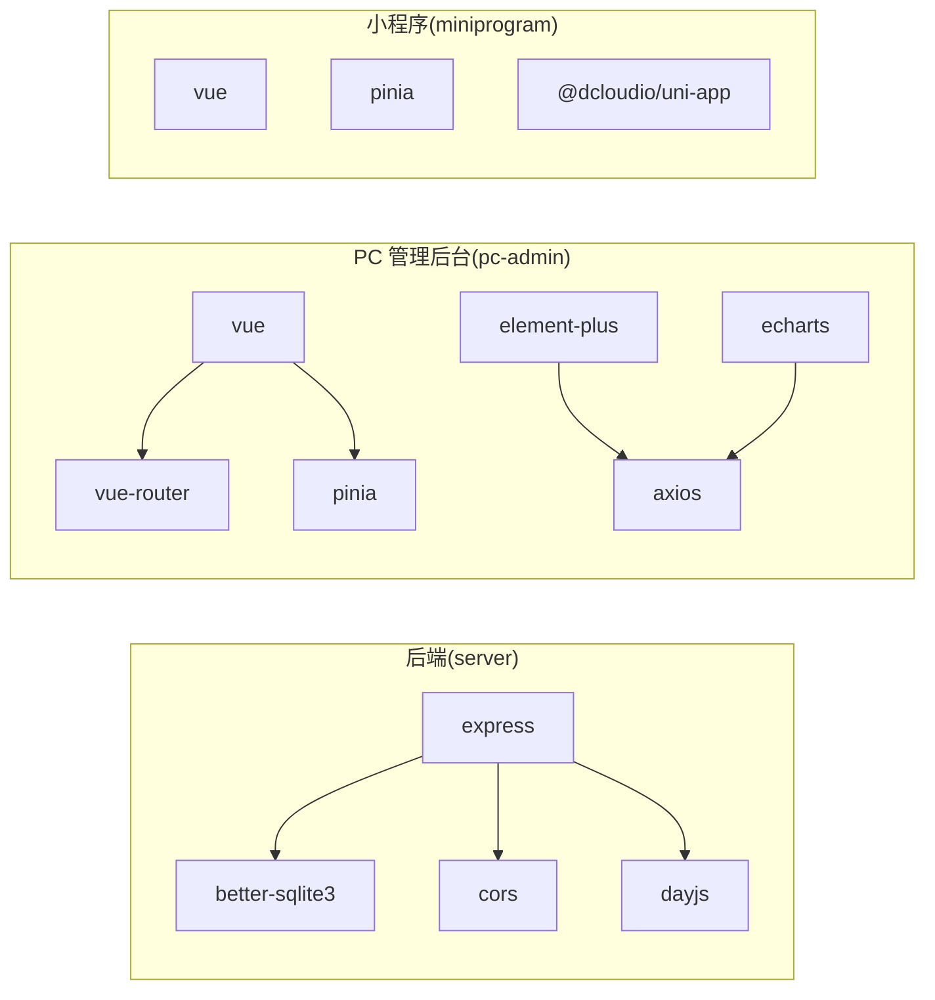

# 项目概述

<cite>
**本文引用的文件**
- [ARCHITECTURE.md](file://docs/ARCHITECTURE.md)
- [api.md](file://docs/api.md)
- [server.md](file://docs/design-docs/server.md)
- [pc-admin.md](file://docs/design-docs/pc-admin.md)
- [miniprogram.md](file://docs/design-docs/miniprogram.md)
- [package.json](file://star-park/package.json)
- [server/package.json](file://star-park/server/package.json)
- [pc-admin/package.json](file://star-park/pc-admin/package.json)
- [miniprogram/package.json](file://star-park/miniprogram/package.json)
- [index.js](file://star-park/server/src/index.js)
- [database.js](file://star-park/server/src/database.js)
- [main.js](file://star-park/pc-admin/src/main.js)
- [main.js](file://star-park/miniprogram/src/main.js)
- [index.js](file://star-park/pc-admin/src/api/index.js)
- [index.js](file://star-park/miniprogram/src/api/index.js)
- [Dashboard.vue](file://star-park/pc-admin/src/views/Dashboard.vue)
- [index.vue](file://star-park/miniprogram/src/pages/checkin/index.vue)
</cite>

## 目录
1. [引言](#引言)
2. [项目结构](#项目结构)
3. [核心组件](#核心组件)
4. [架构总览](#架构总览)
5. [详细组件分析](#详细组件分析)
6. [依赖关系分析](#依赖关系分析)
7. [性能考量](#性能考量)
8. [故障排查指南](#故障排查指南)
9. [结论](#结论)
10. [附录](#附录)

## 引言
StarParadise（星星乐园）是一个面向家庭的激励管理系统，旨在通过“积分 + 金钱奖励”的双重激励体系，帮助家长引导孩子养成良好习惯。系统覆盖家长使用的PC管理后台与孩子/家长共同使用的H5/小程序端，形成“打卡—奖励—统计—反馈”的闭环。

- 核心价值主张
  - 以游戏化的方式鼓励日常行为，提升孩子自主性与成就感
  - 家长可集中管理任务、奖励目标、统计报表，便于长期追踪与优化
  - 低门槛部署与使用，适合家庭场景

- 目标用户
  - 家长：负责创建任务、设置奖励目标、查看统计、发放积分
  - 孩子：在小程序端进行每日打卡、查看任务与奖励、获得即时反馈

- 主要功能特性
  - 积分系统：发放/查询积分，支持“特殊积分奖励”即时发放
  - 打卡管理：按任务维度完成打卡，自动计算奖励并更新余额
  - 奖励机制：设置目标金额，自动累进到达成条件
  - 统计分析：提供连续打卡、周完成率、月度收益等可视化指标

## 项目结构
项目采用 monorepo 结构，包含后端服务、PC管理后台、小程序端三个子项目，分别位于 star-park/server、star-park/pc-admin、star-park/miniprogram。根目录提供统一脚本，便于一键安装与启动。

**图表来源**
- [ARCHITECTURE.md:14-69](file://docs/ARCHITECTURE.md#L14-L69)
- [package.json:6-11](file://star-park/package.json#L6-L11)
- [server/src/index.js:1-42](file://star-park/server/src/index.js#L1-L42)
- [server/src/database.js:1-90](file://star-park/server/src/database.js#L1-L90)
- [pc-admin/src/main.js:1-22](file://star-park/pc-admin/src/main.js#L1-L22)
- [pc-admin/src/api/index.js:1-55](file://star-park/pc-admin/src/api/index.js#L1-L55)
- [miniprogram/src/main.js:1-8](file://star-park/miniprogram/src/main.js#L1-L8)
- [miniprogram/src/api/index.js:1-65](file://star-park/miniprogram/src/api/index.js#L1-L65)

**章节来源**
- [ARCHITECTURE.md:10-83](file://docs/ARCHITECTURE.md#L10-L83)
- [package.json:6-11](file://star-park/package.json#L6-L11)

## 核心组件
- 后端服务（Express + SQLite）
  - 提供 RESTful API，涵盖孩子、任务、打卡、奖励、统计、积分等模块
  - 使用 better-sqlite3 作为嵌入式数据库，零外部依赖，适合家庭部署
  - 通过中间件启用跨域与 JSON 解析，路由统一挂载于 /api 前缀

- PC 管理后台（Vue 3 + Element Plus）
  - 家长侧管理界面，包含仪表盘、目标管理、打卡、任务管理、积分记录、奖励管理、统计分析
  - 使用 Vue Router、Pinia、Axios，通过统一 API 客户端访问后端

- 小程序端（Vue 3 + uni-app）
  - H5/微信小程序双端运行，核心为每日打卡页，支持任务勾选、奖励展示与特殊积分发放
  - 通过封装的 uni.request 客户端与后端交互

**章节来源**
- [server.md:1-115](file://docs/design-docs/server.md#L1-L115)
- [pc-admin.md:1-85](file://docs/design-docs/pc-admin.md#L1-L85)
- [miniprogram.md:1-78](file://docs/design-docs/miniprogram.md#L1-L78)

## 架构总览
系统采用前后端分离的 monorepo 架构，三层抽象：前端入口（PC/小程序）、页面/视图与组件、后端路由与数据层。后端路由模块不互相导入，避免循环依赖；前端模块仅通过 HTTP API 与后端通信，保持清晰边界。

**图表来源**
- [ARCHITECTURE.md:14-69](file://docs/ARCHITECTURE.md#L14-L69)
- [server/src/index.js:1-42](file://star-park/server/src/index.js#L1-L42)
- [server/src/database.js:1-90](file://star-park/server/src/database.js#L1-L90)

**章节来源**
- [ARCHITECTURE.md:73-94](file://docs/ARCHITECTURE.md#L73-L94)

## 详细组件分析

### 后端服务（Express + SQLite）
- 设计要点
  - 单一入口应用，启用 CORS 与 JSON 中间件，统一挂载路由
  - 路由模块职责清晰：children、tasks、checkins、rewards、stats、points
  - 数据库 WAL 模式与外键约束，确保并发与一致性
  - 健康检查端点 /api/health 便于运维监控

- 数据模型（核心表）
  - children：孩子基本信息与积分余额
  - tasks：任务定义与奖励配置
  - checkins：打卡记录与奖励累计
  - rewards：奖励目标与达成状态
  - transactions：金钱交易流水
  - points：积分记录

**图表来源**
- [server/src/database.js:18-80](file://star-park/server/src/database.js#L18-L80)

**章节来源**
- [server.md:10-72](file://docs/design-docs/server.md#L10-L72)
- [server/src/index.js:1-42](file://star-park/server/src/index.js#L1-L42)
- [server/src/database.js:1-90](file://star-park/server/src/database.js#L1-L90)

### PC 管理后台（Vue 3 + Element Plus）
- 设计要点
  - 采用 Vue 3 + Element Plus + Vue Router + Pinia 的现代前端栈
  - API 客户端统一封装 axios，设置 baseURL 与超时，响应拦截统一提取 data
  - 仪表盘页面加载后端 /api/dashboard 数据，渲染孩子卡片与快捷操作

**图表来源**
- [pc-admin.md:47-64](file://docs/design-docs/pc-admin.md#L47-L64)
- [pc-admin/src/views/Dashboard.vue:76-91](file://star-park/pc-admin/src/views/Dashboard.vue#L76-L91)
- [pc-admin/src/api/index.js:43-44](file://star-park/pc-admin/src/api/index.js#L43-L44)

**章节来源**
- [pc-admin.md:10-32](file://docs/design-docs/pc-admin.md#L10-L32)
- [pc-admin/src/main.js:1-22](file://star-park/pc-admin/src/main.js#L1-L22)
- [pc-admin/src/api/index.js:1-55](file://star-park/pc-admin/src/api/index.js#L1-L55)
- [pc-admin/src/views/Dashboard.vue:1-146](file://star-park/pc-admin/src/views/Dashboard.vue#L1-L146)

### 小程序端（Vue 3 + uni-app）
- 设计要点
  - 支持 H5 预览与微信小程序发布，统一使用 Vue 3 + uni-app
  - 打卡页提供孩子选择、任务勾选、奖励统计与特殊积分发放
  - API 客户端封装 uni.request，统一处理成功与失败回调

**图表来源**
- [miniprogram.md:44-59](file://docs/design-docs/miniprogram.md#L44-L59)
- [miniprogram/src/pages/checkin/index.vue:212-241](file://star-park/miniprogram/src/pages/checkin/index.vue#L212-L241)
- [miniprogram/src/api/index.js:44-45](file://star-park/miniprogram/src/api/index.js#L44-L45)

**章节来源**
- [miniprogram.md:10-30](file://docs/design-docs/miniprogram.md#L10-L30)
- [miniprogram/src/main.js:1-8](file://star-park/miniprogram/src/main.js#L1-L8)
- [miniprogram/src/api/index.js:1-65](file://star-park/miniprogram/src/api/index.js#L1-L65)
- [miniprogram/src/pages/checkin/index.vue:1-661](file://star-park/miniprogram/src/pages/checkin/index.vue#L1-L661)

### 打卡奖励流程（端到端）

**图表来源**
- [ARCHITECTURE.md:119-131](file://docs/ARCHITECTURE.md#L119-L131)
- [server/src/routes/checkins.js:31-87](file://star-park/server/src/routes/checkins.js#L31-L87)

**章节来源**
- [ARCHITECTURE.md:115-142](file://docs/ARCHITECTURE.md#L115-L142)

## 依赖关系分析
- 技术选型与权衡
  - Express + better-sqlite3：轻量、易部署，适合家庭场景；对比 PostgreSQL 更简单
  - Vue 3 + Element Plus：生态成熟、组件丰富，适合快速搭建管理后台
  - uni-app：一次开发多端运行，兼顾 H5 与小程序发布
  - 积分与余额双系统：积分用于行为激励，余额用于金钱奖励，增强正向反馈层次

- 依赖图（简化）

**图表来源**
- [server/package.json:8-13](file://star-park/server/package.json#L8-L13)
- [pc-admin/package.json:11-20](file://star-park/pc-admin/package.json#L11-L20)
- [miniprogram/package.json:10-18](file://star-park/miniprogram/package.json#L10-L18)

**章节来源**
- [ARCHITECTURE.md:154-200](file://docs/ARCHITECTURE.md#L154-L200)

## 性能考量
- 数据库层面
  - 启用 WAL 模式与外键约束，提升并发与一致性
  - 建议在高频查询字段上建立索引（如 checkins.checkin_date、children.id），减少扫描成本
- 接口层面
  - 对统计类接口（如 /api/dashboard、/api/stats/:childId）进行缓存或分页，避免一次性返回大量数据
- 前端层面
  - PC 端使用虚拟滚动与懒加载，减少 DOM 压力
  - 小程序端避免频繁 setData，合并更新批次

## 故障排查指南
- 后端常见问题
  - 400 参数缺失：检查必填字段（如 child_id、task_id、checkin_date）
  - 404 资源不存在：确认资源 ID 与关联关系
  - 500 数据库异常：检查数据库文件权限与 WAL 文件状态
- 前端常见问题
  - PC 端：统一响应拦截器已输出错误日志，建议结合浏览器控制台定位
  - 小程序端：网络错误会触发 toast 提示，检查 BASE_URL 与跨域配置

**章节来源**
- [server.md:103-110](file://docs/design-docs/server.md#L103-L110)
- [pc-admin.md:75-80](file://docs/design-docs/pc-admin.md#L75-L80)
- [miniprogram.md:69-73](file://docs/design-docs/miniprogram.md#L69-L73)

## 结论
StarParadise 以“积分 + 金钱奖励”为核心，构建了从任务设定、每日打卡到统计反馈的完整闭环。通过 Express + SQLite 的后端与 Vue 3 + uni-app 的前后端组合，系统实现了低门槛、高可用的家庭激励管理方案。对于初学者，可从根脚本与单页组件入手快速上手；对于有经验的开发者，可在现有分层基础上扩展指标体系、引入缓存与消息队列，进一步提升性能与可观测性。

## 附录
- API 基础信息
  - Base URL: http://localhost:3001/api
  - 认证方式: 无（家庭内网使用）
  - 数据格式: JSON
- 常用命令
  - 安装全部依赖: npm run install:all
  - 启动后端服务: npm run start:server
  - 启动 PC 管理后台: npm run start:pc
  - 启动小程序 H5: npm run start:mini

**章节来源**
- [api.md:10-15](file://docs/api.md#L10-L15)
- [package.json:6-11](file://star-park/package.json#L6-L11)