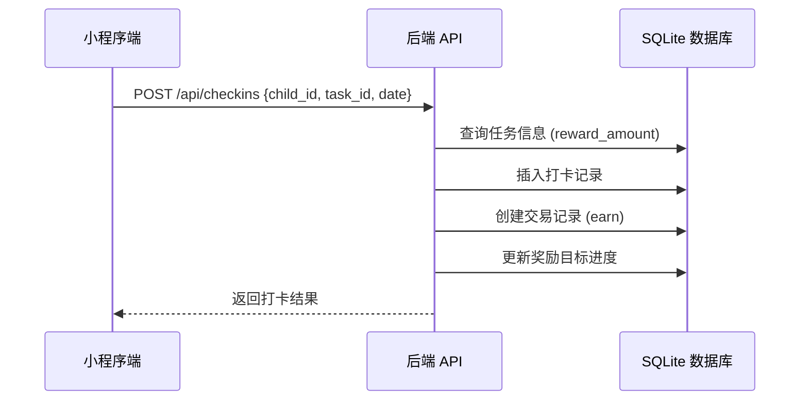

# 架构

> 上次重新生成：2026-05-25
> 来源分析：`star-park/server/src/`, `star-park/miniprogram/src/`, `star-park/pc-admin/src/`

## 1 概览

星星乐园是一个家庭激励管理系统，采用前后端分离的 monorepo 架构。后端使用 Express + SQLite 提供 REST API，前端分为管理后台（Vue 3 + Element Plus）和移动端小程序（Vue 3 + uni-app）两个独立应用。

## 2 系统架构

### 2.1 包依赖图

```mermaid
graph TD
    subgraph "Layer 5 — 前端入口"
        MP_MAIN[miniprogram/src/main.js]
        PC_MAIN[pc-admin/src/main.js]
    end
    subgraph "Layer 4 — 前端页面/视图"
        MP_PAGES[miniprogram/src/pages/]
        PC_VIEWS[pc-admin/src/views/]
    end
    subgraph "Layer 3 — 前端组件/API"
        MP_API[miniprogram/src/api/]
        MP_COMP[miniprogram/src/components/]
        PC_API[pc-admin/src/api/]
        PC_COMP[pc-admin/src/components/]
        PC_ROUTER[pc-admin/src/router/]
        PC_STORE[pc-admin/src/stores/]
        PC_STYLES[pc-admin/src/styles/]
    end
    subgraph "Layer 2 — 后端入口"
        SRV_INDEX[server/src/index.js]
    end
    subgraph "Layer 1 — 后端路由"
        SRV_CHILDREN[server/src/routes/children.js]
        SRV_TASKS[server/src/routes/tasks.js]
        SRV_CHECKINS[server/src/routes/checkins.js]
        SRV_REWARDS[server/src/routes/rewards.js]
        SRV_STATS[server/src/routes/stats.js]
        SRV_POINTS[server/src/routes/points.js]
    end
    subgraph "Layer 0 — 数据层"
        SRV_DB[server/src/database.js]
        SRV_SEED[server/src/seed.js]
    end

    MP_MAIN --> MP_PAGES
    MP_PAGES --> MP_API
    MP_PAGES --> MP_COMP
    PC_VIEWS --> PC_API
    PC_VIEWS --> PC_COMP
    PC_MAIN --> PC_VIEWS
    PC_MAIN --> PC_ROUTER
    PC_MAIN --> PC_STORE
    PC_MAIN --> PC_STYLES
    SRV_INDEX --> SRV_CHILDREN
    SRV_INDEX --> SRV_TASKS
    SRV_INDEX --> SRV_CHECKINS
    SRV_INDEX --> SRV_REWARDS
    SRV_INDEX --> SRV_STATS
    SRV_INDEX --> SRV_POINTS
    SRV_CHILDREN --> SRV_DB
    SRV_TASKS --> SRV_DB
    SRV_CHECKINS --> SRV_DB
    SRV_REWARDS --> SRV_DB
    SRV_STATS --> SRV_DB
    SRV_POINTS --> SRV_DB
    SRV_SEED --> SRV_DB
```



> 来源：`star-park/server/src/index.js:1-11`, `star-park/pc-admin/src/main.js`, `star-park/miniprogram/src/main.js`

### 2.2 层层次结构

| 层 | 包 | 可以导入 | 不能导入 |
|-------|----------|------------|---------------|
| L0 | `server/src/database.js`, `server/src/seed.js` | 仅标准库 + npm 包 | L1, L2, L3, L4, L5 |
| L1 | `server/src/routes/*` | L0, 标准库 + npm 包 | L2, L3, L4, L5 |
| L2 | `server/src/index.js` | L0, L1, 标准库 + npm 包 | L3, L4, L5 |
| L3 | `miniprogram/src/api/`, `miniprogram/src/components/`, `pc-admin/src/api/`, `pc-admin/src/components/`, `pc-admin/src/router/`, `pc-admin/src/stores/`, `pc-admin/src/styles/` | 标准库 + npm 包 | L0, L1, L2, L4, L5 |
| L4 | `miniprogram/src/pages/`, `pc-admin/src/views/` | L3, 标准库 + npm 包 | L0, L1, L2, L5 |
| L5 | `miniprogram/src/main.js`, `miniprogram/src/App.vue`, `pc-admin/src/main.js`, `pc-admin/src/App.vue` | L3, L4, 标准库 + npm 包 | L0, L1, L2 |

> 由以下强制执行：`scripts/lint-deps.py`

### 2.3 禁止的依赖

- `server/src/routes/*` 不得导入其他路由模块
- `server/src/database.js` 不得导入任何项目内部模块
- 前端模块不得直接导入后端模块（仅通过 HTTP API 通信）
- 同一子项目的页面/视图不得互相导入

> 由以下强制执行：`scripts/lint-deps.py:30-45`

## 3 核心组件

### 3.1 后端 API 服务

**用途**：提供 RESTful API 处理孩子、任务、打卡、奖励、积分等业务
**位置**：`star-park/server/src/`
**行数**：~560

### 3.2 管理后台前端

**用途**：家长使用的数据统计和管理界面
**位置**：`star-park/pc-admin/src/`
**行数**：~800

### 3.3 小程序前端

**用途**：孩子和家长使用的移动端打卡界面
**位置**：`star-park/miniprogram/src/`
**行数**：~300

## 4 数据流

### 4.1 打卡奖励流程



> 来源：`star-park/server/src/routes/checkins.js:31-87`

### 4.2 请求处理流

```
客户端请求 → Express 中间件(cors, json) → 路由处理 → SQLite 查询 → JSON 响应
                                                    ↓
                                              错误处理(500)
```

## 5 关键文件

| 文件 | 行数 | 用途 | 关键导出 |
|------|-------|------|----------|
| `server/src/index.js` | ~42 | 服务入口 | Express app |
| `server/src/database.js` | ~90 | 数据库初始化 | db 实例 |
| `server/src/routes/checkins.js` | ~90 | 打卡逻辑 | Express Router |
| `server/src/routes/stats.js` | ~182 | 统计+仪表盘 | Express Router |
| `pc-admin/src/api/index.js` | ~55 | API 客户端 | axios 实例 |
| `pc-admin/src/router/index.js` | ~67 | 路由配置 | Vue Router |

## 6 关键设计决策

| # | 决策 | 理由 | 考虑的替代方案 |
|---|------|------|---------------|
| 1 | 使用 SQLite 嵌入式数据库 | 零部署依赖、适合小型家庭应用 | PostgreSQL（过于重型） |
| 2 | Monorepo 多包结构 | 共享 API 契约、统一版本管理 | 独立仓库（增加维护成本） |
| 3 | uni-app 小程序框架 | 一次开发多端运行 | 原生微信小程序（仅限微信） |
| 4 | 积分与余额双系统 | 积分用于行为激励、余额用于金钱奖励 | 统一货币（丧失激励区分） |

## 7 模块与依赖

### 后端（server）

**外部依赖：**

| 依赖 | 版本 | 用途 |
|------|------|------|
| `express` | ^4.21.0 | HTTP 服务框架 |
| `better-sqlite3` | ^11.6.0 | SQLite 数据库驱动 |
| `cors` | ^2.8.5 | 跨域请求支持 |
| `dayjs` | ^1.11.13 | 日期处理 |

> 来源：`star-park/server/package.json`

### 管理后台（pc-admin）

| 依赖 | 版本 | 用途 |
|------|------|------|
| `vue` | ^3.4.0 | 前端框架 |
| `vue-router` | ^4.3.0 | 路由管理 |
| `pinia` | ^2.1.0 | 状态管理 |
| `element-plus` | ^2.7.0 | UI 组件库 |
| `echarts` | ^5.5.0 | 图表库 |
| `axios` | ^1.7.0 | HTTP 客户端 |

> 来源：`star-park/pc-admin/package.json`

### 小程序（miniprogram）

| 依赖 | 版本 | 用途 |
|------|------|------|
| `vue` | ^3.4.0 | 前端框架 |
| `pinia` | ^2.1.0 | 状态管理 |
| `@dcloudio/uni-app` | 3.0.0 | uni-app 框架 |

> 来源：`star-park/miniprogram/package.json`

## 参见

- [后端服务设计](design-docs/server.md)
- [管理后台设计](design-docs/pc-admin.md)
- [小程序端设计](design-docs/miniprogram.md)
- [API 接口文档](api.md)
